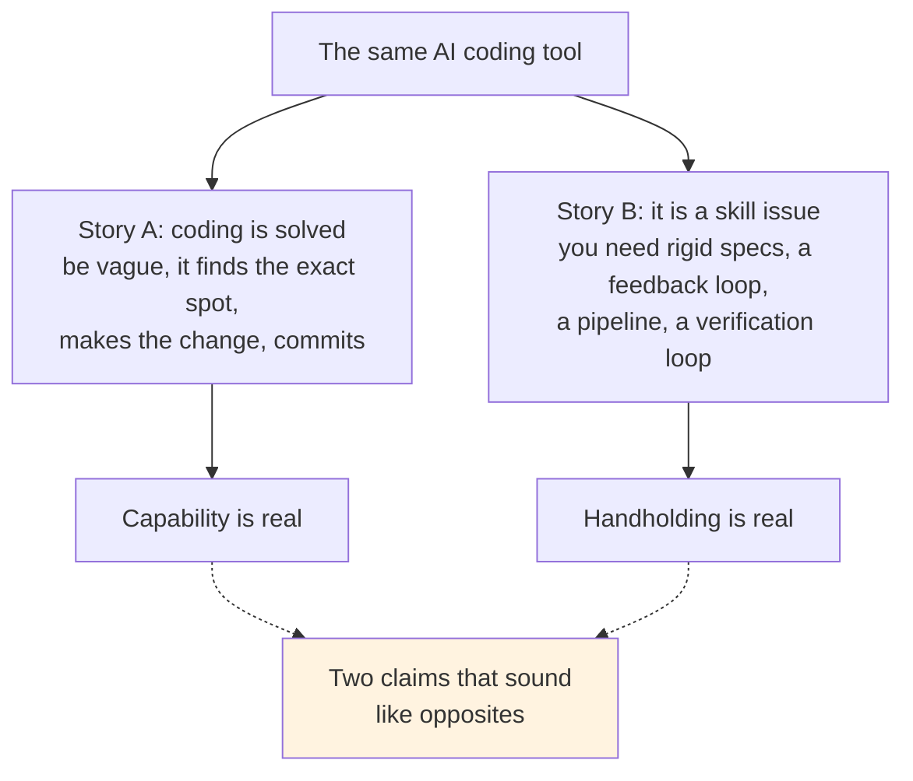
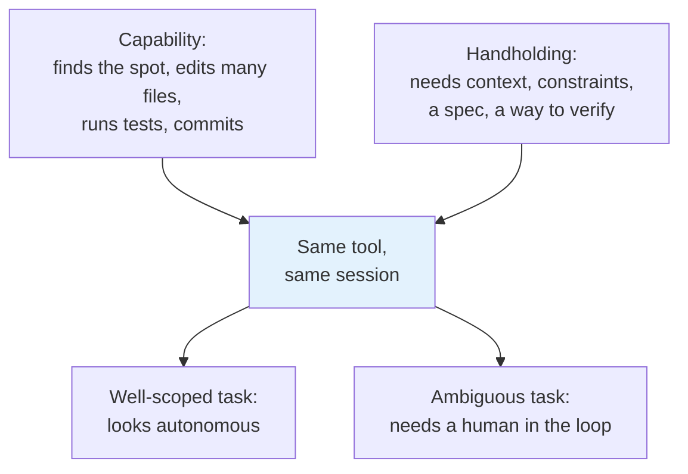
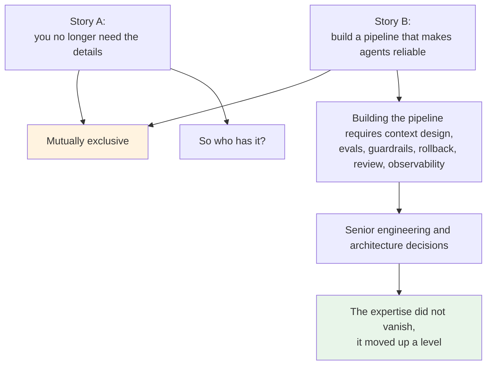
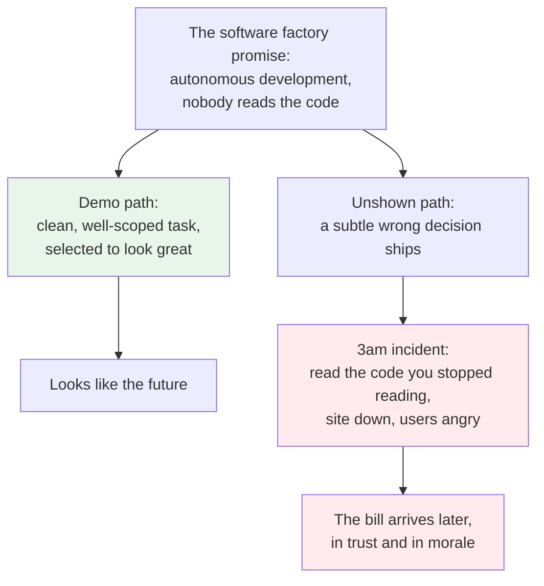
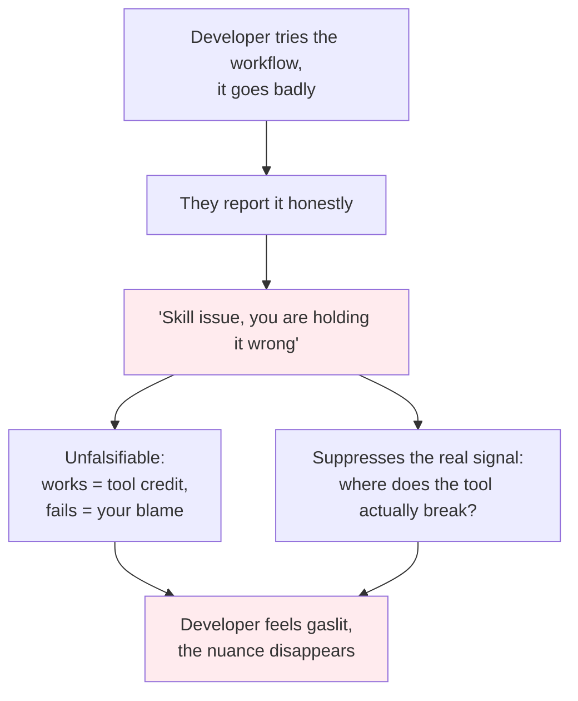
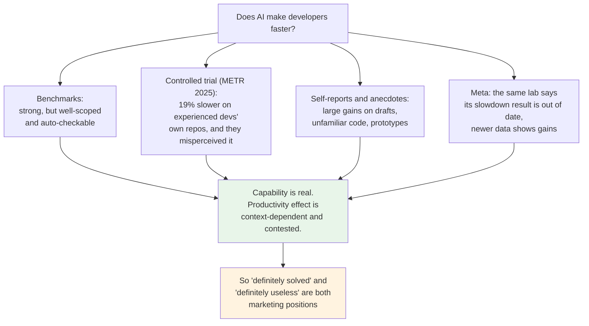
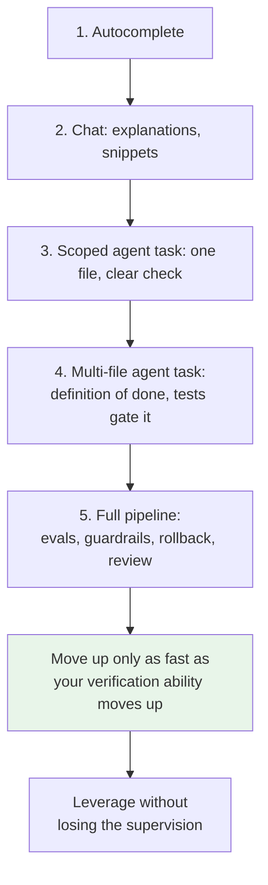

# The Software Factory Mirage

> One side tells you coding is solved and you can be vague. The other tells you that if it did not work, you are holding it wrong. Both are describing the same tool, and the truth is far less cinematic than either.

**TLDR**

- Two stories about AI coding arrive at once and they contradict each other. Story A: coding is solved, be vague, the agent finds the exact spot and makes the change. Story B: it failed because it is a skill issue, you need rigid specs, a strong verification loop, and the right pipeline.
- Both are partly true, which is the source of the confusion. The tool really can do impressive end-to-end work, and it really does need heavy handholding. "Coding solved" and "you need a pipeline" are two ends of the same instrument.
- The trap is inside Story B. The pipeline that makes agents reliable is a large engineering artifact, and building it requires the domain expertise that Story A says you no longer need. That contradiction is not a skill issue.
- The software factory, meaning fully autonomous development where nobody reads the code, is a mirage for most people today. The demo works. The 3am incident does not. The bill arrives later, when you are reading code you stopped reading while production is down.
- "You are holding it wrong" is true enough to be useful and absolute enough to feel like gaslighting. Setup does drive results, and the setup is neither cheap nor the user's fault when the tool overpromised.
- The evidence is genuinely mixed. Benchmark scores are high, a controlled study found experienced developers slower with AI, self-reports run positive, and the same research lab now says its own slowdown result is out of date. Treat confident claims in either direction as marketing.
- The move is to choose your own integration level, optimize for better output rather than merely faster output, and protect the domain expertise that lets you supervise the model. Integrate AI up to the point where it makes the work better, and stop before it costs you understanding.

## 1. The problem: one tool, two incompatible stories

Something strange is happening in the conversation about AI and software. Two stories are being told at the same time, by the same community, and they do not fit together.

**Story A, the autonomy story.** The models are so good that coding is basically solved. You can be vague with your request and the agent will pick up the nuance. It will search your codebase, find the exact spot that needs to change, integrate the change, consult the documentation, comment it, and commit it. You describe the outcome you want in loose language and it figures out the rest. When this works, it genuinely feels like the future of development, and plenty of people have had isolated experiences exactly like it.

**Story B, the skill-issue story.** The moment someone says that workflow did not work for them, the response is immediate: skill issue. You just need to learn to use the model. Let go of reading the code. Use a better model. Set up the right pipeline. Write extremely detailed specifications. Build a rigid feedback loop and a strong verification loop. The model is capable, the argument goes, and the results depend almost entirely on the scaffolding you build around it.

Look at those two claims side by side. Story A says the model is practically superintelligent and needs almost nothing from you. Story B says the model needs a tremendous amount of handholding and the single biggest determinant of success is the elaborate system you build around it. Those cannot both describe the same tool in the same breath. And yet both are said, often by the same people, in the same week.

## 2. Story A: why the autonomy narrative is not a lie

Start by taking Story A seriously, because it is not pure hype. The capability is real.

Modern agents can read a repository, locate the relevant files, and make a coherent change across several of them. They can call tools, run a test, read the failure, and try again. They can search the web or your docs. They can write the commit message. On a well-scoped task in a codebase with good structure and a clear definition of done, this works, and it can work while you are only loosely involved.

I have had this experience. So has almost everyone who has spent real hours with the tools. The trap of dismissing Story A entirely is that you end up arguing against your own good days.

The mistake in Story A is not the capability claim. It is the leap from "the agent can do this" to "the agent understands." A model that produces a correct-looking change has not necessarily understood your constraints. It has produced the most probable change given the context you gave it. Most of the time, on tasks with an obvious shape, the most probable change is the right one. That is why the good days are real.

## 3. Story B: why the rebuttal is not entirely wrong either

Now take Story B seriously, for the same reason. It is also not entirely wrong.

Results really do depend enormously on how you set the tool up. A vague prompt in a messy codebase with no tests will produce worse outcomes than a tight spec in a well-structured codebase with a fast verification loop. That part is simply true, and anyone who has used the tools carefully has felt it.

The agent has no context you did not give it and no way to know which of its plausible choices are wrong for your system. So the more you constrain the problem and the faster you can check the answer, the better the output. That is not a controversial claim. It is the natural consequence of how these systems work, and it is the subject of the companion piece [You Cannot Catch What You Cannot Read](./you-cannot-catch-what-you-cannot-read.md).

So the honest picture is not "Story A is true, Story B is cope" or the reverse. The honest picture is that capability and handholding are the same coin. The same instrument that performs astonishing feats on well-scoped work demands supervision on everything else. The narrative just reports the capability half, and the rebuttal reports the handholding half.

## 4. The contradiction: the pipeline needs the expertise it promises to remove

Here is where Story B stops being just incomplete and becomes self-defeating.

Setting up an agent pipeline that reliably produces good work is itself a serious engineering project. To build one you have to decide: what context gets fed in and how it stays fresh, which tools the agent may call, what the definition of done is, what tests and evals gate a change, what guardrails stop it from doing damage, how failures are rolled back, who reviews what, and how the whole thing is observed in production.

Those are the decisions a senior engineer or architect makes. They require understanding the domain, the failure modes, and the cost of being wrong. They are exactly the kind of judgment that the autonomy narrative says you no longer need.

So Story A and Story B cannot both be true for the same person. If the reliable results come from the pipeline, then either the expertise moved up into the pipeline and someone still had to build it, or the person harvesting the results is an expert who knows how to supervise it. In neither case has the expertise disappeared. It has moved.

This is the actual contradiction at the center of the mixed signals, and it is worth naming plainly because it reframes the whole debate. The question is never "do you still need to understand software." It is "at which layer do you need to understand it." The autonomy story quietly assumes the understanding is free and already built. It is not.

## 5. The mirage: the demo and the 3am incident

This is where the metaphor of the software factory starts to look like a mirage.

The software factory is the idea that development becomes fully autonomous: agents do the work, code gets reviewed by other agents, and one or two developers in the world manage a fleet of them. Sometimes it is even said that reading the code is optional, because the system verifies itself.

What you actually see from these setups is the demo. The demo is a well-scoped task in a controlled environment with a clean path. It looks incredible, and it should, because it was selected to look incredible.

The path that does not get shown is the incident. Something subtle slipped through. A wrong lock tier, a bad cache policy, a race that only appears under load. Now you are three months deep, the person who was supposed to have stopped reading the code has to go and read it, in the middle of the night, in a codebase they no longer hold in their head, while the site is down and users are angry. The thing you did not pay for now has a bill attached, and the bill is measured in trust.

None of this means the factory is impossible forever. It means the demo is not the factory. The demo shows the best case of a supervised tool. The factory claims the supervision is gone. Those are different products.

## 6. Why "you are holding it wrong" feels like gaslighting

Gaslighting is when someone makes you doubt your own perception of reality. That is a strong word, and I am using it carefully: nobody is literally gaslighting anyone, and the people saying "skill issue" usually believe it. But the pattern has the same effect, and it is worth being honest about why it lands as insulting.

You tried the workflow the industry described. It did not go well. You report that. And instead of the response being "here is where the tool actually struggles, and here is how to work with that," the response is a totalizing explanation that places the fault entirely on you: you are not using the right model, you have not set up the right pipeline, you are holding it wrong.

There are two problems with that as a universal answer.

First, it is unfalsifiable. If it works, the tool gets the credit. If it fails, you get the blame. No result can ever count as evidence against the framework. That is the structure of a belief, not an engineering claim.

Second, it suppresses the most valuable signal we have. The honest accounts of where these tools fail on real, messy, long-lived systems are exactly what everyone needs in order to use them well. When every failure is reframed as user error, that signal gets buried, and the gap between the marketing and the lived experience widens.

The nuance that both camps skip is this: setup matters, and the tool is overpromised. Those are not in tension. The failure was real, and the fix is partly yours, and the marketing is partly to blame. A serious answer holds all three.

## 7. What the impressive pipelines actually are

The most convincing counterargument to everything above is that some people really do run something close to autonomous development, and their results are impressive. That deserves a fair look, because it is true.

When you examine those setups, they are almost never "no engineering." They are a heavy engineering artifact that someone experienced built. They have carefully engineered context, a narrow domain where correct is checkable automatically, a battery of tests and evals, strong guardrails, and usually a human who still looks at the important changes. The impressive part is not that the human left. It is that the human moved to a higher level of abstraction and built a machine that holds the lower level.

That is a legitimate and powerful thing to build. It is also, almost by definition, what [Where the Value Actually Sits](./where-the-value-actually-sits.md) calls the frontier-transfer loop: taking a new primitive, shipping a reliable version of it, and moving on before the layer commoditizes. The pipeline is the asset. The person who could build the pipeline is the expert.

There is one more honest caveat. Nobody has run the fully unsupervised version for long enough to know how it holds up over a multi-year horizon. The claim that it will be fine is a projection, not a result. Choosing to wait before betting your career and your system on that projection is not fear. It is being appropriately uncertain in the face of insufficient evidence.

## 8. The evidence is mixed, so distrust confident claims from both sides

If you want to know whether these tools make you faster, you would expect the data to settle it. It does not, at least not yet, and the shape of the disagreement is itself the lesson.

The benchmark story is strong. Public benchmarks like SWE-bench show models solving a large fraction of real-world issues, and those numbers have climbed fast. Benchmarks measure well-scoped, automatically checkable tasks, though, which is the best case for the tool and not a proxy for your Tuesday.

The controlled story is more sobering. A 2025 randomized trial from METR found that experienced open-source developers working on their own repositories were 19 percent slower when allowed to use AI, even though they expected a 24 percent speedup and still believed afterward that AI had sped them up ([METR, 2025](https://metr.org/blog/2025-07-10-early-2025-ai-experienced-os-dev-study/)). The perception gap there is the interesting part. People were wrong about their own productivity, in the optimistic direction.

The self-report story runs the other way. Surveys and an enormous amount of anecdote show people reporting large gains, especially on a first draft, an unfamiliar codebase, or a throwaway prototype. That is real, and it is real for the reason Story B gives: those are contexts where the tool's strengths line up with the task.

And then the meta-story, which is the most important one. The same lab that measured the slowdown has since published an update saying its 2025 result is out of date and no longer reflects late-2025 tools, alongside newer self-reported data showing substantial gains. In other words, even the careful measurement has a short shelf life, because the thing being measured changes every few months.

The practical consequence is simple. Anyone who tells you the question is settled, in either direction, is selling something. The person to trust is the one who tells you where it works, where it does not, and how they know.

## 9. The solution: choose your own level

So what should you actually do? The useful reframe is to stop asking "is coding solved" and start asking "at what level do I integrate this tool, in my context, without trading away the expertise that lets me supervise it."

Think of it as a ladder. Autocomplete is the bottom rung. Then chat for explanations and small snippets. Then scoped agent tasks in one file. Then multi-file agent tasks with a clear definition of done. Then a full pipeline with evals and guardrails. Each rung buys more leverage and demands more supervision capability to stay safe. The rule is to move up only as fast as your ability to verify moves up with you.

A few rules fall out of everything above.

**Optimize for better, not just faster.** The goal is not to move quicker at any cost. The goal is to do better work, and if speed is a byproduct, take it. The moment speed becomes the objective, you have signed up for the demo path and its unshown incident. [The Bottleneck Moved](./the-bottleneck-moved.md) argues that judgment, not typing, is the scarce skill now, and judgment does not scale by going faster.

**Keep the reading skill, because it is the supervision capability.** The ability to skim generated code, notice what is off, and connect it to a failure mode is exactly what lets you decide whether to accept the change. It is not nostalgia. It is the new core skill, and it is trainable, as [You Cannot Catch What You Cannot Read](./you-cannot-catch-what-you-cannot-read.md) lays out.

**Protect your domain expertise instead of trading it for speed.** This is the whole argument in one line. The expertise is what lets you write the spec, judge the output, and catch the wrong decision. Swapping it for a faster loop is trading the thing that makes you valuable for the thing that makes you replaceable.

**Use the tool where it is strong, keep yourself where being wrong is expensive.** Boilerplate, mechanical refactors, exploring unfamiliar code, and first drafts: all excellent uses. Anything where an incorrect choice is costly and silent: keep your hands on it, or at least your eyes.

**Set your own bar.** There is no universal correct level of integration, and the industry will not hand you one. Choose the level that makes your work better and more enjoyable. If that is autocomplete and a chat window, that is a legitimate answer.

## 10. My own position

I will be honest about where I land, because a perspective piece without a position is just a summary.

I am choosing to be a bit more apprehensive about going all the way down into fully autonomous development. I do not see a strong reason that I have to. What I am interested in is doing the work well, not going faster for its own sake. If I happen to move faster because of these tools, great, but that is a byproduct and not the goal.

What I am actively trying to become is more of a domain expert, not less of one in exchange for moving quicker. That is not a rejection of AI. I like not having to type as much. Between autocomplete, snippets, frameworks, boilerplate generators, and package managers, I already type less than ever, and if I can hold the same quality while typing less, that is exactly how I want to use these tools. The line I am not willing to cross is the one where I stop understanding what I shipped.

I also do not believe either extreme of the narrative. I doubt we end up with pure software factories and one developer managing all the agents in the world, and I doubt the bubble fully pops and everyone goes back to hand-coding everything. The realistic outcome is the wide middle: these tools integrated at many different levels, by many different people, for many different contexts. Which means the question of how far to go is not answered by the industry. It is answered by you.

## 11. The takeaway

The software factory is a mirage for most people today, not because the tools are bad, but because the factory description removes the human from the loop while the actual reliability comes from the human being very much in the loop, one level up.

Two stories are being sold. One overpromises autonomy. The other overpromises that setup will remove all friction. Both try to take the human out of the loop. The truth is that the human is the loop: writing the spec, judging the output, and catching the wrong decision before it reaches production.

So choose your own path with these tools. Integrate them at the level that makes your work better and brings you more joy, and no further. Be more of a domain expert, not less, and let speed be the thing you notice in the rearview mirror rather than the thing you chase.

## Sources

- [METR (2025), Measuring the Impact of Early-2025 AI on Experienced Open-Source Developer Productivity](https://metr.org/blog/2025-07-10-early-2025-ai-experienced-os-dev-study/) - the randomized trial finding a 19% slowdown on experienced developers' own repositories, alongside the developers' own mistaken belief that they had been sped up. Note the page's own update: METR states these results are out of date and no longer reflect late-2025 tools, and points to newer self-reported data showing gains, which is itself a good illustration of how fast the ground moves.
- [Matteo Collina, The Future of the Software Engineering Career](https://adventures.nodeland.dev/archive/the-future-of-the-software-engineering-career/) - judgment over implementation, why fundamentals matter again, and why the value of a "human in the loop" increases as the tools get stronger.
- [The Bottleneck Moved](./the-bottleneck-moved.md) - the bottleneck shifting from writing code to judgment, and why the scarce skill is deciding what is correct.
- [You Cannot Catch What You Cannot Read](./you-cannot-catch-what-you-cannot-read.md) - delegating a spec is delegating hundreds of decisions, and the surviving skill is reading generated code and spotting the wrong choice.
- [Where the Value Actually Sits](./where-the-value-actually-sits.md) - the frontier-transfer loop and why the pipeline, not the model, is the durable asset.
- [Ownership Stays With You](./ownership-stays-with-you.md) - the agent ships, but you own the result, which is why supervision is not optional.

### See also

- [Distributed Transactions: When 2PC Fails and Saga Is the Answer](./../software-engineering/distributed-transactions.md) - an example of a domain where a wrong, silent decision is expensive, which is exactly where you keep your own hands on the work.
- [Locks Only Live as Long as Your Transaction: What BEGIN Really Does](./../software-engineering/lock-duration-and-begin.md) - the three-tier lock nuance an agent will happily get wrong unless you can read the transaction boundaries.
- [Backend Master Roadmap](./../software-engineering/backend-master-roadmap.md) - where the fundamentals that make supervision possible actually live.
