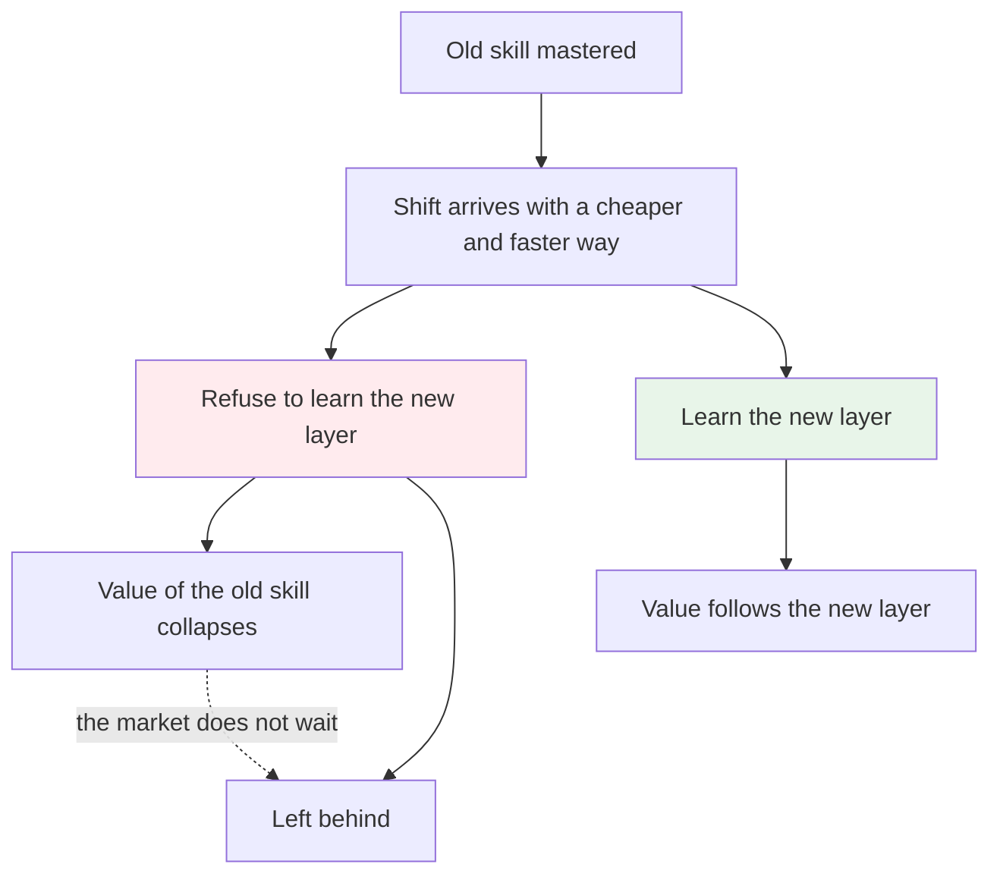
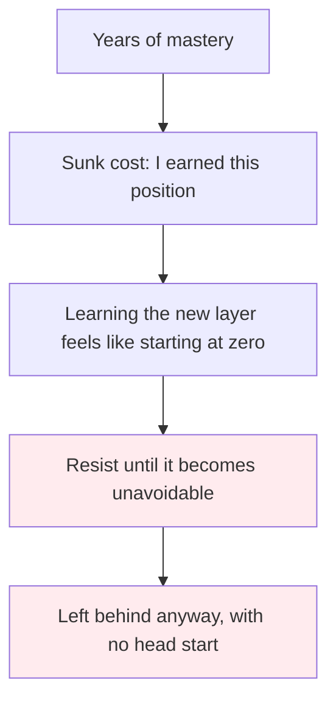
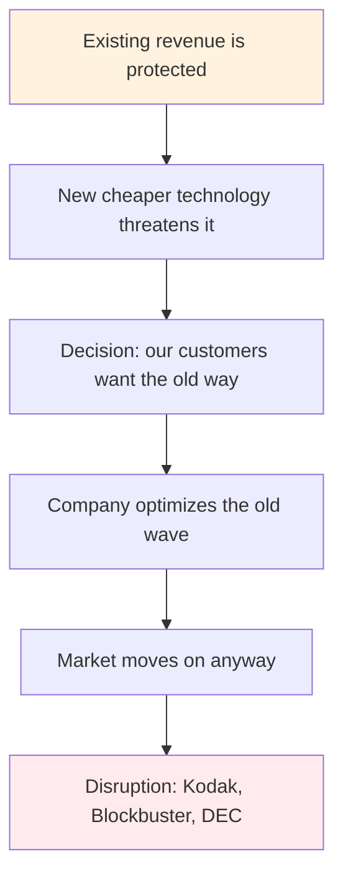
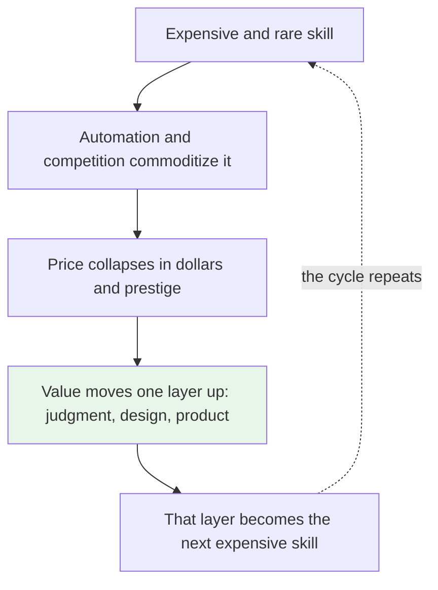
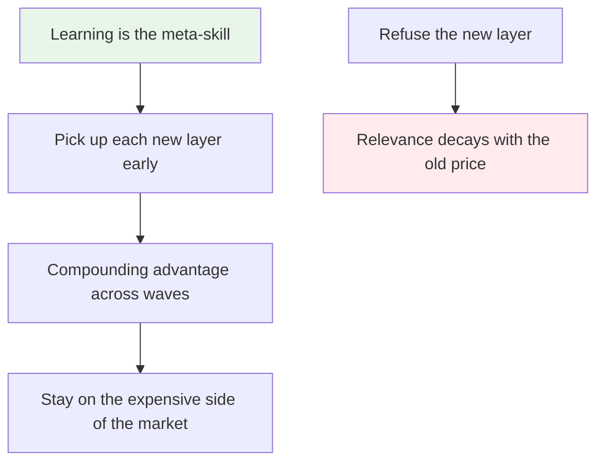
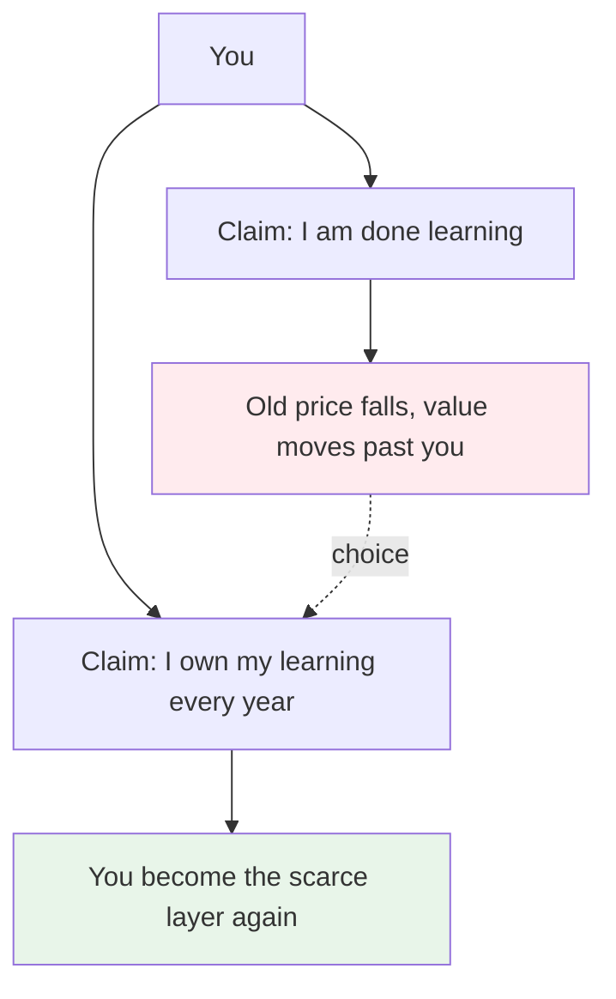

# The Wave Does Not Wait

> Shifts happen whether you accept them or not. Your only choice is which side of the wave you are on when it lands.

This is my take after rereading Clayton Christensen's The Innovator's Dilemma and Carlota Perez's Technological Revolutions and Financial Capital, and sitting with the history of computing leaving people behind. I keep coming back to the punchcard. It was a real profession with real skills and real careers, and then it was gone. No one who stayed with it was asked to move on. The wave just moved on for them.

## 1. The problem: every wave leaves the unwilling behind

Every big shift in software has the same shape. A skillset is valuable, a new way of working shows up and does it faster or cheaper, and from that moment the old skillset loses value on its own. It does not lose value because anyone decides to punish it. It loses value because the market prices things by what they produce, and the new layer produces more for less.

The people who get left behind are usually not the least skilled. They are the most invested. They spent a decade mastering the old layer and they decided the mastery itself was the job. So when the wave arrives, they judge it from the old position: this new thing is worse, incomplete, not a real way to work. The wave does not care. It values the outcome, not the credential.

The punchcard is the cleanest example. In the 1960s and 1970s, keypunch operators were a real profession doing real work, a large part of the computing workforce. Then terminals and personal computers removed the middleman. The profession did not end in a debate. It ended because the underlayer stopped existing. Anyone who wanted to stay in computing moved up to programming. Anyone who wanted to stay with the machines was left outside the industry entirely.

## 2. Why people refuse

Refusal is not usually laziness. It is usually identity. You have built years of expertise, you are known for it, people ask you because of it. The new layer makes you a beginner again, and starting over feels like losing everything you earned.

The mistake is treating what you know as a permanent asset instead of a decaying one. Every skill has an expiration date that is set by the market, not by you. The only skill without that expiration date is the ability to pick up the next layer when it arrives.

It also feels like a betrayal. The old layer worked, it was reliable, and on its own terms it still works. But the question is never whether the old way still works. It is whether enough of the market still pays for it. That is the question people avoid, because the honest answer would force them to start learning again.

## 3. Companies are not exempt

Individuals get this wrong, and so do companies, usually for the same reason. Existing revenue is comfortable. The new cheaper thing threatens it, so the company protects the old product and misses that the customer side already moved.

Clayton Christensen documented this in The Innovator's Dilemma: well run companies fail because they listen to their current customers, protect their profitable lines, and let the disruptive technology be somebody else's problem. The examples are famous. Kodak invented the digital camera in 1975 and let it sit because it threatened film, then filed for bankruptcy in 2012. Blockbuster turned down buying Netflix and filed for bankruptcy in 2010. DEC, the dominant minicomputer maker whose founder said no one would want a computer in the home, was absorbed by Compaq in 1998.

The same pressure hits the vendors people normally think of as safe. Infrastructure that used to be sold as a seven figure service now runs on managed cloud for a few thousand dollars a month. That is not market failure. That is the market working. The price fell because the value moved up the stack. The companies that kept pricing at the old level and the old capabilities saw their bottom line change, then their relevance.

## 4. The market always commoditizes

What looks like a threat is usually a price drop. A capability that was rare, expensive, and hand delivered becomes routine, cheap, and automated. That has been the whole arc of computing: punchcards to terminals, mainframes to PCs, bare metal to cloud, hand written SQL to managed systems. Every time, the expensive layer becomes the commodity and the value appears one level higher.

Perez describes this in Technological Revolutions and Financial Capital: technological revolutions periodically replace the established paradigm, and most of the social and economic pain comes from clinging to the old paradigm. The shift is not an accident or a side effect. It is what progress looks like. There is no way around it, so the rational position is riding it, not fighting it.

This is reassuring in one specific way. The same force that takes things away brings the next layer of value. The cloud dropping to thousands of dollars did not destroy infrastructure work; it moved the interesting part to architecture, security, and reliability at a far bigger scale. The expensive part did not vanish. It relocated.

## 5. The solution: treat learning as the job

The honest lesson is that your real skill was never the layer you know. It is your rate of learning it. If you can pick up each new layer while it is still forming, you are always early to the expensive side of the market. If you refuse, everything you know becomes a liability with a deadline.

Carol Dweck's work on the growth mindset is the psychological part of this: people who believe ability can be developed keep learning, while people who believe ability is fixed stop the moment they feel tested. Applied to our industry, the fixed mindset is the phrase I do not do X. The growth alternative is treating every shift as a chance to reset the price of your own skill.

There is also a fairness point that makes this optimism real. It was genuinely hard for a keypunch operator to retrain into programming, because the old world did not prepare them for it. Modern software people are in a better position: the industry is one long chain of retraining, the tools keep abstracting up, and the gap between the old layer and the new one has never been as bridgeable as it is now. When the new layer is conversational, the barrier to entering it is lower than it has ever been.

## 6. What this means for you

The market does not pay you for what you know. It pays you for producing something the buyer cannot produce themselves yet. The moment your skill is everyone's skill, the price moves. So the professional question is not how many years you accumulated. It is how fast you can rearm when the wave starts.

**Check where your value sits.** If everything you know is widely available and cheap to produce, your next job is to climb to the layer above it: the design, the judgment, the product thinking that is still scarce at any price.

**Learn in public while the layer is forming.** The people who look lucky in every shift are the ones who started on the new thing before it was obviously the future, not after it became the requirement.

**Do not confuse seniority with immunity.** Experience is only worth what the current wave still values. Every wave resets the scoreboard, and the reset respects learners, not resumes.

**If you are a team lead or founder, build the update loop.** The lesson from the companies above is that protecting the old product is usually the losing move. The winning move is the internal version of ride the wave: invest in the new layer before revenue forces it.

The wave does not wait for you to be ready, and it does not punish you for being slow. It just moves on, same as it did from punchcards, mainframes, and seven figure infrastructure contracts. That is not cruelty. That is just what waves do. You get to choose which one you are on.

### Sources

*   Clayton M. Christensen — [The Innovator's Dilemma](https://www.hbs.edu/faculty/Pages/item.aspx?num=46) (1997) — why well run companies fail when they protect existing revenue against disruptive technology
*   Carlota Perez — [Technological Revolutions and Financial Capital](https://www.carlotaperez.org/pubs?s=tvfc) (2002) — how each technological revolution replaces the entrenched paradigm and punishes those who cling to it
*   Carol Dweck — [Mindset: The New Psychology of Success](https://mindsetonline.com/) (2006) — why the belief that ability can be developed decides who keeps learning
*   Documented cases — Kodak (invented digital photography in 1975, bankruptcy 2012), Blockbuster (declined Netflix, bankruptcy 2010), DEC (dominant minicomputer maker, absorbed by Compaq 1998)
*   Context from my own notes on punchcard era workers and the price of infrastructure services falling from seven figures to managed cloud pricing

### See also

*   ./the-bottleneck-moved.md — the current shift: from writing code to judgment
*   ./developers-closer-to-customer.md — where the next scarce layer is forming
*   ../software-engineering/backend-master-roadmap.md — the map of layers a developer can keep climbing