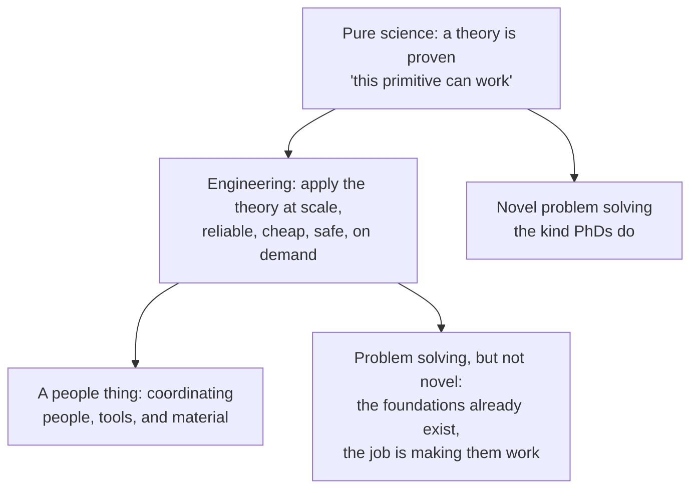
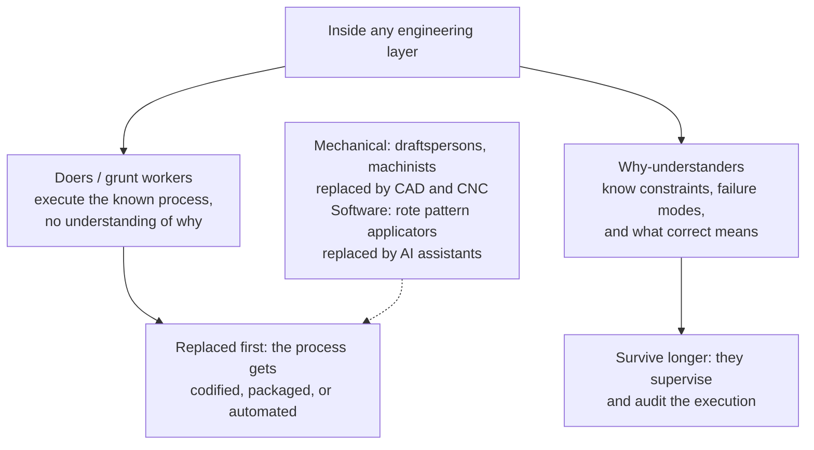
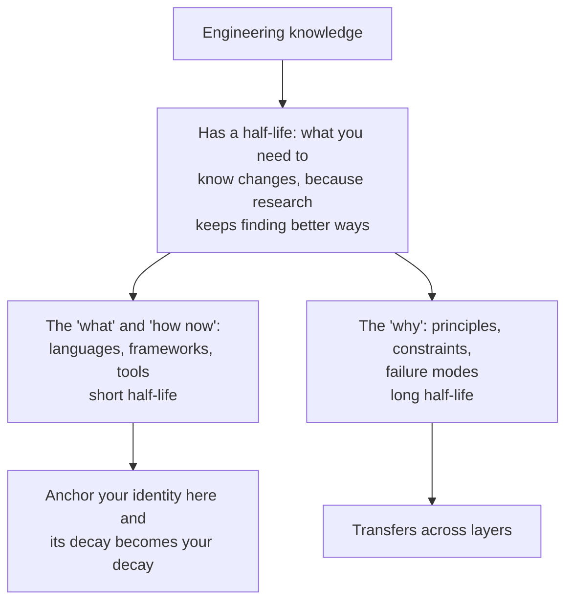
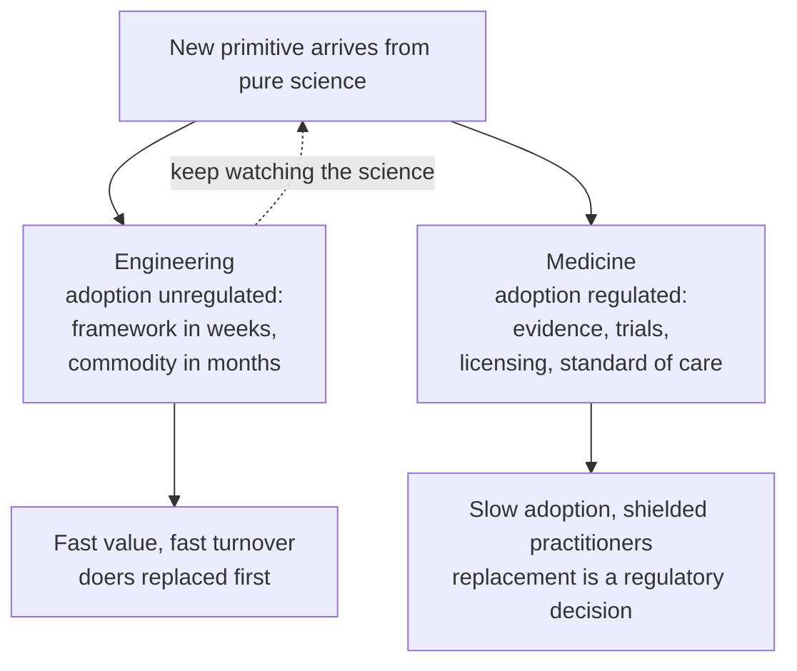
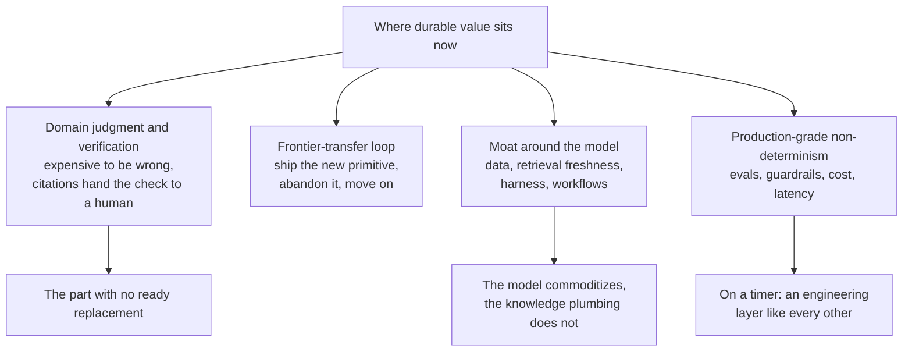
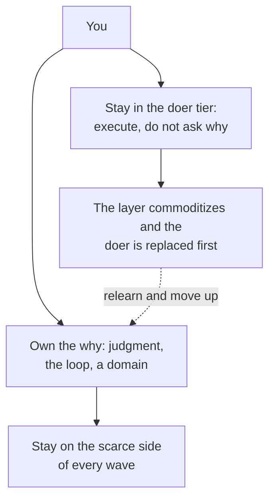

# Where the Value Actually Sits

> The leverage is not the model. It is the retrieval, the tools, the loop, and the judgment that supervises them.

This is my take after watching the AI moment reshape engineering from the inside. I keep coming back to one thread: pure science moves into engineering, engineering gets commoditized layer by layer, and at every layer the people who just execute get replaced first. If that pattern is real, then the question of where the value actually sits has a sharper answer than most of the industry gives.

## 1. From pure science to engineering

Pure science proves that something can work. A researcher demonstrates a primitive: the transformer, for example, showing that attention over tokens produces a useful representation. That is novel problem solving, the kind PhDs do, and nobody knows in advance whether it will work ([Vaswani et al., Attention Is All You Need, 2017](https://arxiv.org/abs/1706.03762)).

Engineering is what happens after the theory exists. It is the application of theories at scale: making them reliable, cheap, safe, and available on demand. The problem solving inside engineering is real, but it is not the novel kind. The foundations already exist; the job is to make the known work in the wild, at scale, repeatedly. And because it runs organizations, machines, and people together, engineering is a people thing: problem solving done between humans, for humans. That makes communication a core mechanism of the discipline, not a soft skill. A great theory shipped by no one is just a paper.

The AI story is a clean example of the boundary. The transformer was science. RAG, the agent loop, and the harness are engineering on top of it: turning "the model can read context in a prompt" into "the model can answer from your company's entire knowledge base, with citations" ([the RAG pattern itself](../artificial-intelligence/rag.mdx)).

## 2. Inside engineering: doers and those who understand why

Engineering is not one skill. It has layers, and the layer boundary is about understanding the why, not about years of experience.

**The doers, or grunt workers.** They execute a known process faithfully, and they do it without knowing why it works. In mechanical engineering these are the machinists who run a set-up they did not design, and the draftspersons who turned designs into drawings by following a standard. In software they are the engineers applying a well-known template or pattern by rote: the person who wires the same CRUD endpoints, copy-pastes the same auth flow, and could not explain the trade-offs in either. Their value is faithful execution of a process that other people designed.

**Those who understand why.** They know the constraints, the failure modes, and what correct means. They can decide when the known process breaks, adapt it, and verify that the result is actually right. Their value is judgment over the process, not execution of it.

Software engineering did not grow a doer tier by accident; the industry manufactured one. Engineers got turned into ticket-doing machines: a ticket arrives, the engineer executes it without thought, without questioning why, and without talking to anyone. "Communication skills" drifted into being the soft extra on a resume while closing tickets became the output. But if engineering is people-centric problem solving, then understanding the problem is the job, and understanding comes from talking to the humans who own the problem. The engineer who dropped that half became a faithful executor of processes designed by someone else, which is precisely the person who is replaced first.

The pattern is consistent across both kinds of engineering: when a process gets codified, packaged, or automated, the doer layer is the first casualty. CAD did not replace the engineer who understood why a part fails; it replaced the drafter who drew it by rote. Coding assistants are similarly wiping out the rote pattern-applicator tier of software engineering first, while the people who can define what correct means are busy, not unemployed.

## 3. Engineering knowledge has a half-life

There is a second reason the doer layer is fragile, and it applies to everyone: engineering knowledge changes. What you need to know today is not what you needed to know five years ago, and it will not be what you need to know five years from now. The knowledge has a half-life, and the reason is simple: research keeps finding better ways, and better ways get adopted.

But the half-life is not uniform. The "what and how" of today, the specific languages, frameworks, and current best practices, decays quickly. The "why", the principles and constraints underneath, decays slowly and transfers across layers. A doer is almost entirely made of the fast-decaying half: their whole asset is current how-to knowledge. A why-understander holds a mix, and the slow-decaying part is what survives a layer change. Anchor your identity to the fast half and its decay becomes your decay.

## 4. Unregulated adoption: why engineering must keep watching science

This is why engineering has no choice but to keep an eye on pure science: it is where the next primitive arrives, and unlike regulated professions, nothing gates the adoption. No license, no standard of care, no randomized trials. A paper drops, a framework wraps it in weeks, and the layer commoditizes in months. RAG went from a research pattern to LangChain and LlamaIndex to turnkey vector databases in about two years.

Medicine proves the contrast. Doctors live on the same science stream, but the profession is regulated, so adoption is slow and gated: evidence, trials, licensing, and a standard of care decide when a technique becomes acceptable. That regulation is a shield. A practitioner cannot be replaced by a tool overnight, because replacing the practitioner is a regulatory decision, not just a technical one. The doer tier of medicine is protected in a way the doer tier of engineering is not.

The lesson cuts both ways. Regulated adoption protects the practitioner but delays access to better methods. Unregulated adoption delivers new methods instantly but protects no one on the receiving end. Engineering chose the fast lane, and that choice is exactly why its knowledge has a short half-life and its doer tier gets replaced first. If you live in the fast lane, no institution will watch the science for you, so watching it yourself is the job.

## 5. Where durable value sits now

Put the pattern together: value sits wherever this wave of commoditization has not reached yet, and specifically in the why-understander positions rather than the doer positions. Four places, in rough order of durability:

1. **Domain judgment and verification.** Where being wrong is expensive (finance, health, legal, safety), "define what correct means and verify" stays scarce, because the buyer is accountable. RAG keeps citations in the answer for exactly this reason: the retrieval loop hands the final check to a human, and that check has no ready replacement ([Human Judgment & Verification](../artificial-intelligence/human-judgment-and-verification.md)).
2. **The frontier-transfer loop.** The ability to take a new primitive, ship a reliable version of it, and move on before the layer commoditizes. The skill is repeatable; the tools are not. The loop is the asset, the stack is not.
3. **The moat around the model, not the model.** The scarce, persistent inputs: proprietary data, a retrieval pipeline that stays fresh, and the harness, tools, and workflows a deployed system exposes. The model is interchangeable; the knowledge plumbing is not ([Context Engineering](../artificial-intelligence/engineering.md#context-engineering)).
4. **Production-grade non-determinism.** Evals, observability, guardrails, cost control, latency, and human-in-the-loop design: the new testing layer most organizations do not have yet ([Harness Engineering](../artificial-intelligence/engineering.md#harness-engineering), [The AI Application Stack](../software-engineering/ai-application-stack.md)). Treat it as current cash flow, not identity, because it is an engineering layer and it will commoditize too.

Every one of these rewards the why-understander and punishes the doer. Citations exist so a human can judge the answer. The frontier loop exists so you move before your tools rot. The knowledge moat is operated by people who understand retrieval constraints, not by people running a wizard. Evals require deciding what correct means in the first place.

## 6. What this means for you

**Know which tier you are in.** If your day is faithful execution of a well-known process, you are in the doer layer and you are on the replacement list, whether the process is machining steel or wiring CRUD. The defensible move is to move up: own the why, own the verification, own the failure modes.

**Relearn the human half.** If your job never requires explaining the why to a human, you are in the doer tier. Communication is not the soft skill they cut from the job description; it is the escape hatch into the why tier, because the whole discipline is people-centric problem solving.

**Own a domain, not a stack.** "Define correct and verify" only pays where being wrong is expensive. That is where the "no ready replacement" lives, and it is the one place the market cannot price down by commoditizing.

**Bet on the slow-decaying half.** Study the principles, not just the current tools, and treat learning itself as the job. What you need to know will keep being replaced by better ways; your rate of catching up is the only knowledge with no half-life.

**Move while the layer is young.** The frontier-transfer loop pays during the standardization phase, not after it. Early adopters of a new primitive get the scarce premium; late adopters get a commodity price.

The permanent asset is therefore not any layer, and not any stack. It is the why, the loop, and the trust around them: domain depth that defines "correct", the willingness to abandon mastered tools, and a reputation for turning uncertainty into dependable systems. In this wave specifically, coding was the first layer of software to commoditize, and the doer tier of it went first. RAG and the harness are commoditizing now. The judgment that supervises them is the part that does not have a ready replacement.

## Sources

* Vaswani, A., et al. (2017). [Attention Is All You Need](https://arxiv.org/abs/1706.03762) — the transformer primitive that made modern LLMs possible, the science underneath current engineering
* Lewis, P., et al. (2020). [Retrieval-Augmented Generation for Knowledge-Intensive NLP Tasks](https://arxiv.org/abs/2005.11401) — the RAG pattern as the concrete example of knowledge-by-retrieval
* Anthropic Applied AI (2025). [Effective context engineering for AI agents](https://www.anthropic.com/engineering/effective-context-engineering-for-ai-agents) — just-in-time retrieval and the agent loop as harness work
* IBM Think. [AI Model vs Agentic Harness](https://www.ibm.com/think/topics/retrieval-augmented-generation) — capability gains from the harness, not the model (via the [summary article](../artificial-intelligence/ai-model-vs-agentic-harness.mdx))
* My own reasoning from watching engineering layers: draftspersons replaced by CAD, rote software pattern applicators replaced by assistants, and the commoditization of RAG from pattern to frameworks to vector databases in about two years