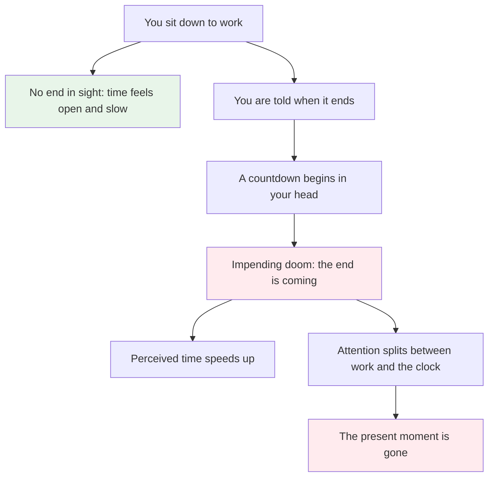
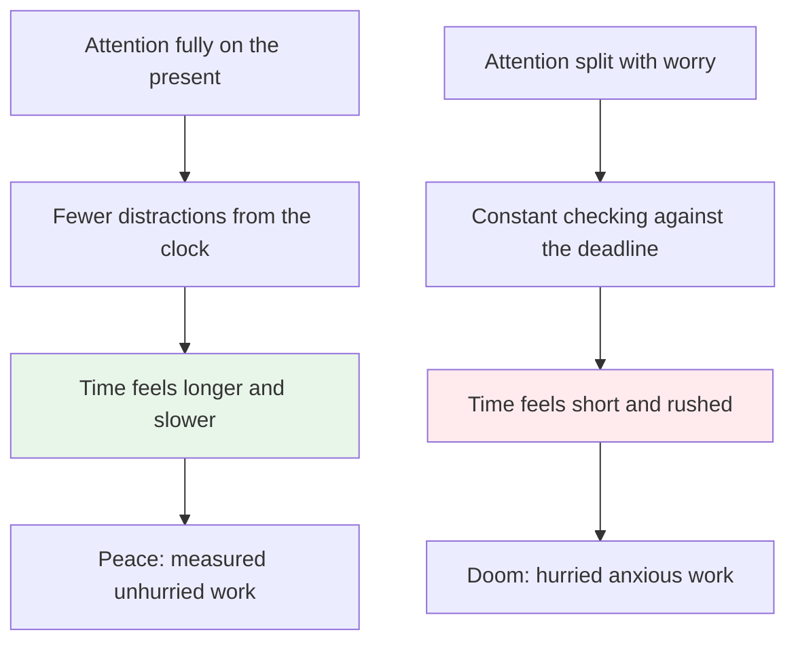
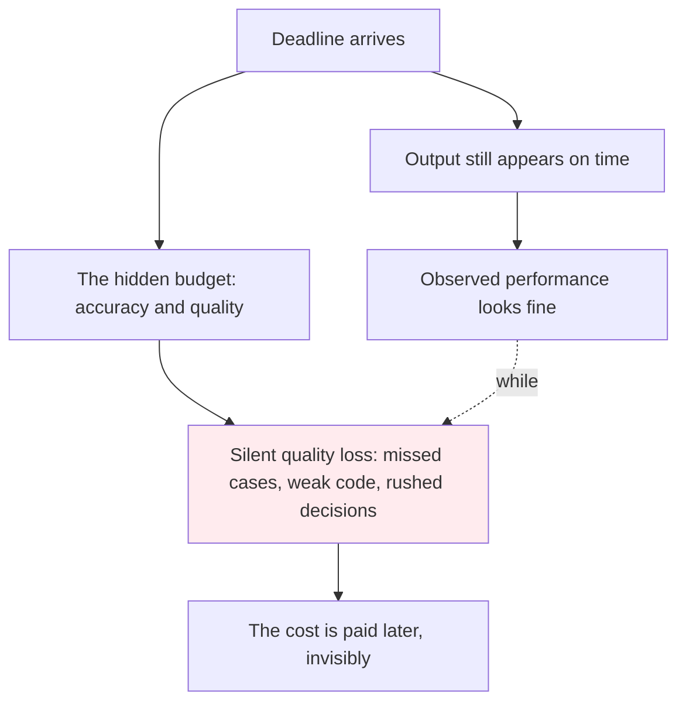
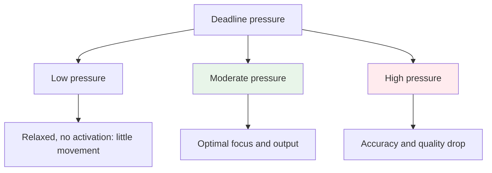
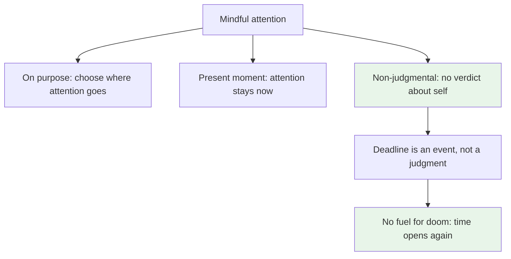
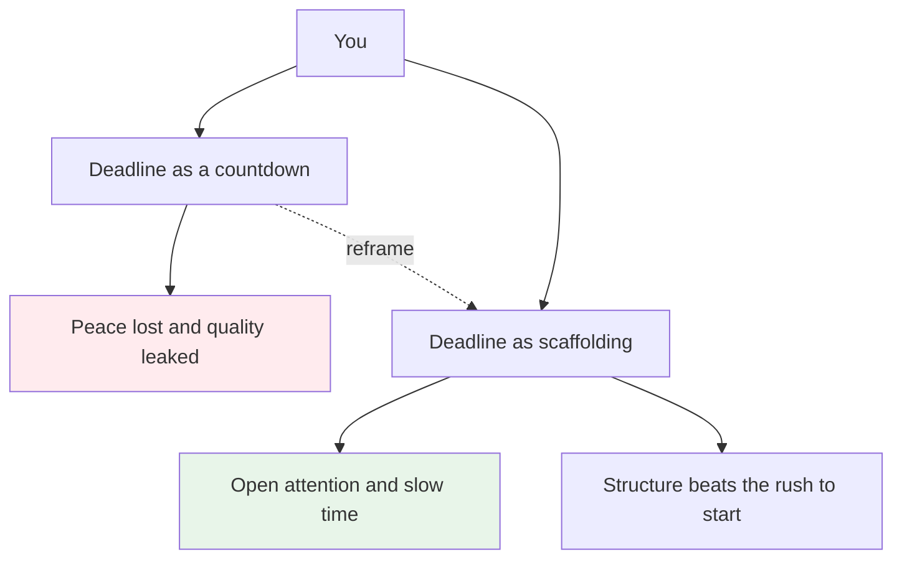

# You Can Slow Time

> We cannot slow the clock, but we can slow its perception, and perception is all that matters. In the moment of panic, if we relax and stay mindful, time feels slow again.

**TLDR**
- We cannot slow the clock, but we can slow the perception of time, and perception is all that matters.
- The mechanism is attention: full, present, non-judgmental attention dilates perceived time, and split attention compresses it.
- A recent study on mindfulness meditation and time perception found meditation leads people to overestimate durations, meaning time felt longer (Kramer, Weger and Sharma, 2013).
- Deadlines and known cutoffs are the enemy of this: the moment you know when it ends, "impending doom" enters and both your peace and your output quality quietly drop.
- The research on deadlines is honest about the tradeoff: deadlines prevent procrastination, but beyond a threshold they cost accuracy and quality while still producing output.
- The practical answer is not to remove all deadlines. It is to keep attention on the work, not on the clock, and to treat your own judgment as the only deadline that matters.

## The problem: the countdown steals the present

A real observation from the library. I sat down, opened a book, and let time do whatever it wanted. No clock, no plan, no countdown. It was peaceful the way open time always is. Then the librarian walked past and told me they were closing in a few minutes. The change was instant. The book was suddenly a race. The peace did not fade gradually, it was replaced by a low hum of hurry that had not been there a second earlier.

When you do not know when it ends, time feels open. When you know exactly when it ends, the knowledge becomes a countdown and the countdown becomes pressure.

The same thing happens with deadlines, just stretched over days or weeks instead of minutes. Had I known at the start of the session exactly when the library would close, that would have been hanging over me the whole time. The quiet would never have arrived in the first place. Knowing the end is not neutral information. It changes the texture of the present.

This is not a quirk of libraries. It is the general shape of deadline work. The work happens, the output arrives, but it costs more than it should because part of the mind is always rented out to the future, watching for the moment everything stops.

## The mechanism: attention is the clock

The reason this happens is that our sense of time is not a clock reading. It is a byproduct of attention. When attention is fully engaged in the present moment, durations feel longer. When attention is split between the present and a worry about the future, durations feel shorter and time seems to slip away.

This is exactly what Kramer, Weger and Sharma found in 2013. Participants carried out a temporal bisection task, comparing probe durations against short and long standards, then either listened to an audiobook or to a meditation focused on the movement of breath. The control group showed no change. The meditation group showed a relative overestimation of durations. Meditation made time feel longer. The paper explains the result within an internal clock framework: a change in attentional resources produces longer perceived durations.

So the two experiences are two states of the same organ. Meditation with attention on the breath dilates time. Deadlines with attention on the countdown compress it. Slowing time, the perception of it, is not a magic trick. It is a reallocation of attention, away from the future and back into the present (Kramer, Weger and Sharma, 2013).

## The second loss: urgency quietly degrades output

The library story is about peace, but there is a harder loss hiding behind it. When the doom takes over, the output does not stop. It continues, sometimes even faster. What suffers is the quality that nobody looks at until later.

Research on time pressure and performance has known this for decades. Time pressure reduces performance on everything from simple math problems (Bryan and Locke, 1967) to piloting airplanes (Raby and Wickens, 1994), as reviewed in the time pressure and productivity literature. More recent work sharpens the point. A laboratory study on software quality found that developers under time pressure adjust their output to improve observed performance at the expense of real software quality, you get the visible result while the invisible quality drops (Karreman et al., PLoS ONE, 2021). A 2025 study on physicians found time pressure decreased diagnostic accuracy and increased documentation errors. Across a scoping review of procedural performance, time pressure consistently affected industries like aviation, nuclear power and oil and gas, even where military and medical studies showed no effect.

This is the productivity loss you sense but cannot point to. You deliver the work. The deadline is met. The number on the clock is respected. It is just that the work is a little shallower, a few edge cases skipped, one more bug shipped, and the true cost is paid in a different week.

The picture is not one sided, and it is worth being honest about. Deadlines themselves are not evil. The classic work by Ariely and Wertenbroch showed that self-imposed deadlines help people control procrastination, though external evenly spaced deadlines performed even better. That suggests the deadline as a structure works. What fails is the deadline as a threat. And even the structure result has not fully replicated. A recent replication of Ariely and Wertenbroch's study found the deadline differences had only negligible effects on performance.

So the honest shape of the evidence is an inverted U. A little structure helps you start. Too much structure turns into doom, and doom spends the peace and the quality at the same time. Numerous studies describe this nonlinear effect, including recent work on innovation performance under time pressure. The task is to live on the left side of the peak, where deadlines are scaffolding rather than swords.

## The solution: present, non-judgmental, and not rushed

The way out is not the absence of deadlines. It is the way you hold them. Mindfulness, as Jon Kabat-Zinn defines it, is paying attention in a particular way: on purpose, in the present moment, and non-judgmentally. Every word in that definition matters, and the last one matters most for the doom.

Judgment is what turns a cutoff into a threat. If the closing time is just an event, you notice it and keep reading. If the closing time is a judgment, I have not read enough, I am being too slow, the panic has its fuel. The non-judgmental part is what drains the fuel. It separates the schedule from the verdict about yourself.

And the not-rushed part. Rushing and mindfulness are opposites, and rushing is always a bet against the present. Rushed work thinks skipping the present will buy more future. It rarely does. The meditative finding is the counterproof: attention that stays with the moment makes time feel longer, which is exactly the slow time you want when the pressure is on. Panic compresses the clock. Relaxed attention stretches it. In the moment of panic, relaxing and becoming mindful is not avoidance. It is the fastest way to regain the seconds that panic spends.

## What this changes in practice

The library lesson has a small, workable rule set behind it:

**Hide the countdown when you can.** If knowing exactly when the library closes ruins the reading, protect the open-ended time on purpose. Work without the clock visible, with the deadline filed somewhere checked once a day, not every minute. The doom feeds on a visible countdown. Starve it.

**Turn the deadline into an event, not a verdict.** When you miss a cutoff, the quality of the work does not change based on whether you judge yourself for it. The judgment adds a second layer of stress and nothing else. Drop the verdict and the doom loses its fuel. This is the non-judgmental part, applied to deadlines.

**Stay present while the deadline exists.** The paradox is that the meditative result works under pressure. When you feel the panic rise, the instinct is to rush, which splits attention and compresses time further. The countermove is the opposite: pick the single action in front of you and give it full attention. Time stretches again and the work actually gets done.

**Keep deadlines as scaffolding, not swords.** The evidence supports structure. Self-imposed and external deadlines help you start and ship. The loss sets in only when pressure crosses into threat. Design your deadlines to be gentle fences: they mark where the pasture ends, they do not scream at you.

The final thought is the one from the start. We cannot slow the clock, and we do not need to. The perception of time is trained by attention, attention can be pointed anywhere, and pointing it at the present is a skill, not a mood. Next time the librarian says it is closing soon, that is information. The doom is optional. The present moment is not.

### Sources

*   Robin S. S. Kramer, Ulrich W. Weger and Dinkar Sharma — [The effect of mindfulness meditation on time perception](https://pubmed.ncbi.nlm.nih.gov/23778017/) — Consciousness and Cognition, 2013 (PMID 23778017) — meditation led to overestimation of durations via an internal clock and attention mechanism. This is the core empirical backing for the whole article.
*   Jon Kabat-Zinn — [Full Catastrophe Living](https://www.penguinrandomhouse.com/books/216821/full-catastrophe-living-by-jon-kabat-zinn/) (1990) / [Wherever You Go, There You Are](https://www.penguinrandomhouse.com/books/50963/wherever-you-go-there-you-are-by-jon-kabat-zinn/) — the definition of mindfulness as on-purpose, present-moment, non-judgmental attention.
*   Dan Ariely and Klaus Wertenbroch — [Procrastination, Deadlines, and Performance: Self-Control by Precommitment](https://web.mit.edu/ariely/www/MIT/Papers/deadlines.pdf) — Psychological Science, 2002 — self-imposed deadlines help control procrastination, external evenly spaced deadlines perform even better.
*   Replication attempts — [Replication of "Procrastination, Deadlines, and Performance"](https://journals.sagepub.com/doi/full/10.1177/09567976261460772) — Psychological Science — the deadline effects were negligible in the replication, so the structure result is weaker than the classic result once suggested.
*   *[Time Pressure, Performance, and Productivity](https://learnmoore.org/mooredata/TPND.pdf)* review — compiles the classic findings that time pressure reduces performance on simple math (Bryan and Locke, 1967) and flying airplanes (Raby and Wickens, 1994), and asks whether an optimal level of time pressure exists.
*   Karreman et al. — [Impact of time pressure on software quality](https://journals.plos.org/plosone/article?id=10.1371/journal.pone.0245599) — PLoS ONE, 2021 — developers improve observed performance at the expense of real software quality under time pressure.
*   — [Physicians' responses to time pressure](https://www.sciencedirect.com/science/article/pii/S0168851025000582) — 2025 — time pressure reduced diagnostic accuracy and increased documentation errors.
*   — [The Role of Time Pressure on Procedural Performance: A Scoping Review](https://journals.sagepub.com/doi/full/10.1177/10711813251369783) — 2025 — time pressure effects differ by industry, with clear effects in aviation, nuclear power and oil and gas.
*   — [The nonlinear effect of time pressure on innovation performance](https://www.frontiersin.org/journals/psychology/articles/10.3389/fpsyg.2022.1049174/full) — Frontiers in Psychology, 2022 — supports the inverted U shape of the pressure-performance relationship.