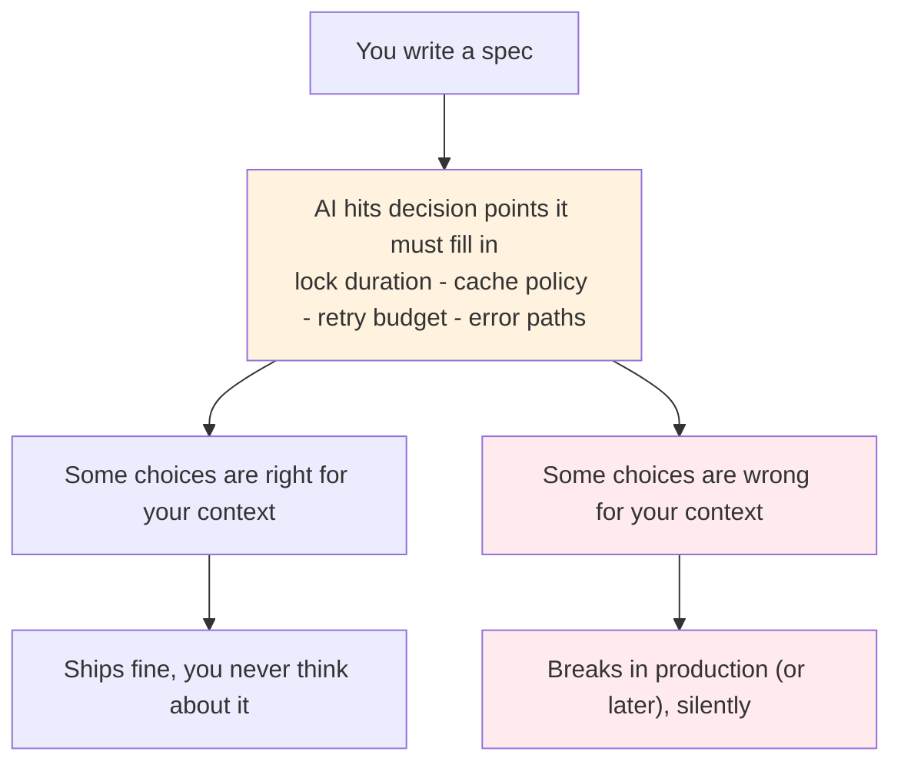
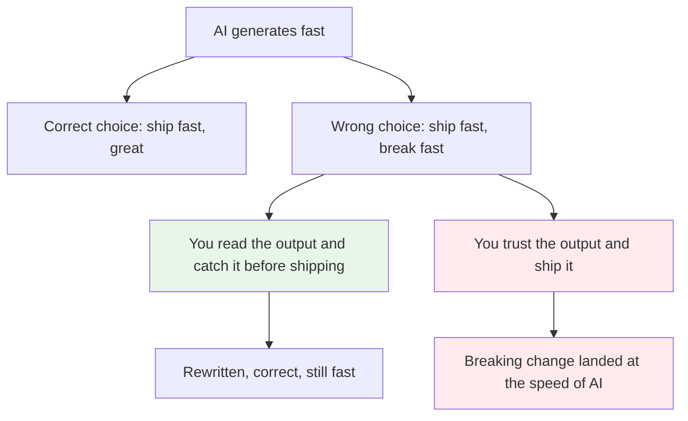
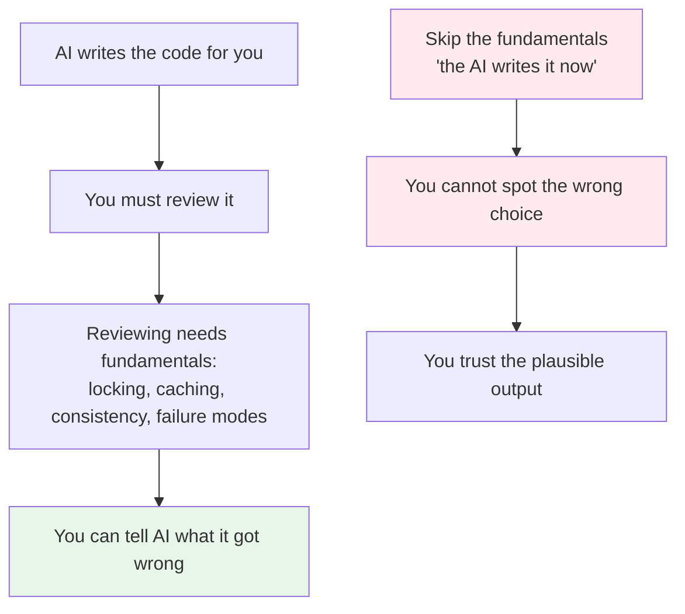
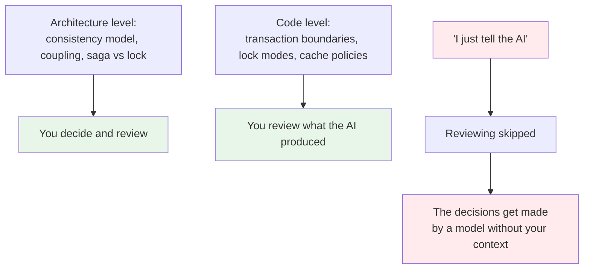

# You Cannot Catch What You Cannot Read: The Conundrum Behind Delegating Decisions to AI

> When you hand the AI a spec, you are handing it a stack of unspoken decisions. It will make all of them, faster than you can object. Your only defense is being able to read the result fast enough to see which choices are wrong.

**TLDR**

- **The conundrum:** giving an AI a spec is not delegating the writing, it is delegating hundreds of small decisions. At every decision point (lock duration, cache policy, retry strategy, error path) the AI makes a choice on your behalf. Some of those choices will be wrong for your context, and they arrive silently.
- **Speed cuts both ways.** Agents make building faster and they make breaking faster. If you cannot read the output and spot the wrong choice quickly, the speed increases the blast radius instead of your productivity.
- **The bottleneck is reading, not writing.** The skill that survives is the ability to skim generated code, notice what is off, and connect it to failure modes. That is a reading skill, not a typing skill, and it is trainable.
- **Reading transfer is real.** The book-reading habit (skimming text, hunting for information, holding context) translates almost directly into reviewing AI output. It is the same muscle: look, notice, connect.
- **Developers are skipping the part that matters.** "I don't type code anymore, the AI does" misses the point. You still have to discuss trade-offs at the code level and the architecture level. Reviewing is not optional; it is the job now.
- **The interview answer:** when someone asks "if AI can build everything, why hire developers," the answer is here: because someone has to be able to tell the AI what it got wrong, and that requires reading, judgment, and fundamentals.

## 1. The problem: you are not delegating the writing, you are delegating the decisions

The common framing is that you write a spec and the AI writes the product. But that framing hides the real transaction. Look at what actually happens: a product spec does not specify every lock duration, every cache invalidation policy, every retry budget, every timeout value, every error path. It cannot. Those are decisions the implementer makes.

Before AI, those decisions were made by a developer who understood the context: the load, the failure modes, the data shape, the operations constraints. The AI does not have that context; it has a statistical guess about what a reasonable implementation looks like. So at every decision point, it chooses something plausible. At most of them it is fine. At some of them it is wrong for *your* system, and it will not tell you which ones are which.

This is the trap. The output looks complete, so the temptation is to trust it. But completeness is not correctness. The AI did not make the hard decisions with your constraints; it filled them in.

## 2. The speed cuts both ways

This is the part people miss. Agents do not only make the good path faster. They make the *whole loop* faster in both directions: building and breaking. If the agent produces a correct solution, you ship in hours instead of weeks. If it produces a subtle wrong choice, you also discover that wrongness faster, because you now run it, test it, and watch it fail faster.

The speed is symmetric. The question is whether you are on the receiving end of the correct side or the broken side. That is determined by one thing: whether you can catch the wrong choice before it ships.

Speed without the ability to review is not leverage; it is a bigger blast radius. The agent does not slow down when the choice is wrong. That is the whole conundrum: the same tool that makes you fast also makes you fast to break.

## 3. The conundrum: you cannot correct what you cannot read

Here is the sharp version of the problem. When the AI returns the output, you have a small window to decide whether it is right. If you are not a well-versed developer, you cannot tell it what it got wrong. You cannot say "this cache should be stale-while-revalidate" if you do not see that the cache policy is the problem, which means you need to read the caching layer, which means you need to know caching. You cannot say "the lock is held too long" if you cannot spot the transaction boundary, which means you need transaction and locking fundamentals.

The conundrum is that the skill required to use the agent correctly is exactly the skill that the agent seems to make unnecessary. It looks like "I no longer need to write code, so I no longer need to understand code." But understanding code is precisely what you need to review the code the agent writes for you. Making typing cheap did not make reading cheap. Reading still requires the fundamentals that typing once forced you to acquire.

The developer trust model has inverted. It used to be: the developer implements, and the reviewer (or the compiler, or the tests) catches mistakes. Now the developer has to be the reviewer of everything the agent produces, all the time. There is no senior developer silently correcting the junior agent. You are the senior.

## 4. A concrete example from this knowledge base: the lock three-tier

The conversation that produced this article is the clearest demonstration I have. We were studying distributed transactions and row locks, and we established a genuine three-tier nuance that an AI would happily get wrong:

- A bare `UPDATE` (autocommit) holds its row lock for the one statement only.
- The same `UPDATE` inside `BEGIN ... COMMIT` holds the lock until the transaction ends.
- The same `UPDATE` inside a prepare flow (`PREPARE TRANSACTION 'gid'` ... `COMMIT PREPARED` / `ROLLBACK PREPARED`) holds the lock until the prepared transaction is resolved.

That last tier is the lock that makes two-phase commit block when the coordinator dies. If you hand an AI a "reserve inventory" spec, there is a real chance it produces the autocommit version or holds the lock too long, and you would not know the difference unless you can read the transaction boundaries in the generated code and connect them to their failure modes. You need the article [Locks Only Live as Long as Your Transaction](./../software-engineering/lock-duration-and-begin.md) in your head to catch it.

That is the whole argument in miniature. The agent writes plausible code. The nuance lives in the difference between three nearly identical statements. Only the developer who already knows the nuance can spot that the agent picked the wrong tier, and only then can they tell the agent what to change.

## 5. The skill that transfers: reading

Here is the part that gives me hope, and it is specific. I read a lot of books before entering computer science, as a hobby. That habit made me good at skimming text, holding large amounts of context, and hunting for the piece of information I need. That is a reading skill, and it transfers almost directly to reviewing AI output.

Reviewing generated code is largely an information hunt: scan the diff, notice what is different from what you expected, zoom into the suspicious area, check it against a known failure mode. That is skimming and targeted reading, exactly what a heavy reader trains for years. The book-reading muscle (pattern matching text, noticing when something is off, carrying a mental model of the whole) is the same muscle that catches an agent's wrong lock tier.

This matters because it means the skill is not magical and it is not dead. It is trainable, and it is the same craft people practiced as readers before they ever wrote a line of code. The habit of reading, of having consumed and understood a lot of written material, is an asset that AI makes more valuable, not less.

## 6. What developers are skipping

The disturbing part is watching developers skip the reading. The conversation usually goes "I am not typing the code by hand, I am telling the AI." As if that were the whole job. It is not. Telling the AI is the easy half; the work moves to *discussing the trade-offs at the code level and one level above.*

The lock discussion is at the code level: transaction boundaries, lock modes, autocommit behavior. The architecture level is one above: which consistency model, how much coupling you accept, when a saga instead of a lock. The AI is involved at both, but it is not *deciding* them. You are, by reviewing what it produced. If you skip reading because you are not typing, you skip the half of the job that now carries all the risk.

The irony is that the developers who read the most before AI will cope the best with AI. The ones who treat "not typing" as "not needing to know" are the ones the speed will break first.

## 7. The interview answer

If this conundrum comes up in an interview or a debate with someone who says "AI builds products from a spec, why do we need capable developers," this is the whole answer:

An AI cannot be told what it got wrong unless someone can see that it is wrong. Seeing that it is wrong requires reading generated code and connecting it to failure modes, which requires the fundamentals, which are exactly what an AI cannot give you. The spec only captures a fraction of the decisions; the rest are made by the model on your behalf. If you cannot review them, you are not using the tool, you are being used by it. The developer's job is now reading, judging, and correcting the output of a very fast, very confident writer that has no idea what your system actually needs.

That is also why the fundamentals roadmap in this knowledge base is not nostalgia. It is the reading list for the new job.

## Sources

- Context from this knowledge base's own writing process: the lock three-tier nuance (`Locks Only Live as Long as Your Transaction` and `Distributed Transactions`) as a concrete example of AI-undetectable wrong choices.
- [The Bottleneck Moved](./the-bottleneck-moved.md) - judgment replacing writing as the scarce skill; the Spidey sense and why fundamentals are how you evaluate agent output.
- [Ownership Stays With You](./ownership-stays-with-you.md) - the agent ships, but you own the result; reviewing is mandatory because you answer for the deployment.
- [Where the Value Actually Sits](./where-the-value-actually-sits.md) - the frontier loop: the human arbitrates AI output, which is exactly the reading-plus-judgment skill described here.

### See also

- [Locks Only Live as Long as Your Transaction](./../software-engineering/lock-duration-and-begin.md) - the three-tier lock nuance used as the concrete example.
- [Distributed Transactions: When 2PC Fails and Saga Is the Answer](./../software-engineering/distributed-transactions.md) - the prepare/commit/rollback window that makes locks block.
- [Backend Master Roadmap](./../software-engineering/backend-master-roadmap.md) - where the fundamentals live, and where this article sits to be found when the question comes up.