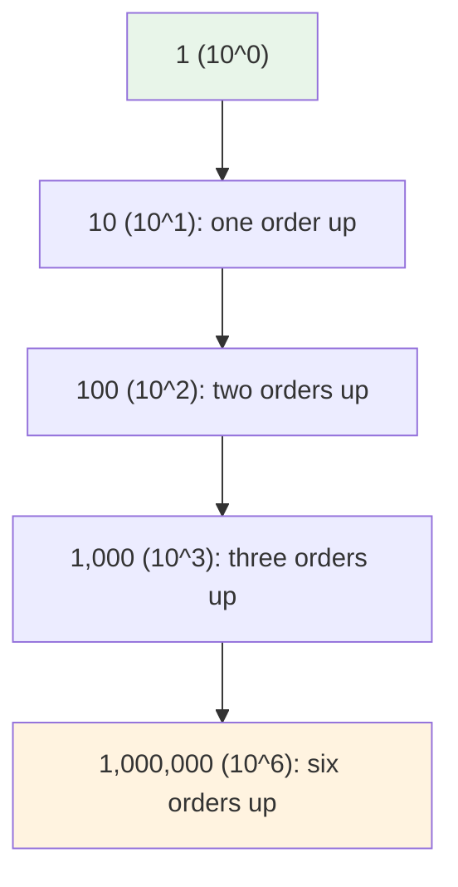
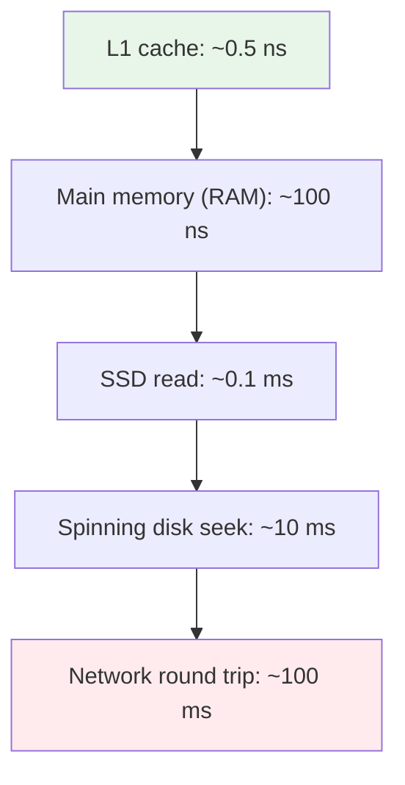

# Orders of Magnitude: The 10x Language of Scale

> An order of magnitude is a factor of 10. Saying "Redis is orders of magnitude faster than a database" is a claim about power-of-10 gaps, and knowing how to count them keeps that claim honest.

## 1. The problem: "faster" is not a number

Engineers compare things all the time: Redis vs PostgreSQL, memory vs disk, one API vs another. The casual way to describe the gap is "way faster" or "orders of magnitude faster", but neither says how much faster. In an interview or a design review, "roughly 10 times" and "roughly 1,000 times" sound similar, but they are 3 orders apart and lead to completely different architecture decisions.

The problem is that we lack a compact, exact way to say "how many powers of ten apart are these two things". That phrase, "how many powers of ten apart", is exactly what *orders of magnitude* measures.

## 2. What one order of magnitude is

One order of magnitude is a multiplication by 10. Two is multiplication by 100. Three is multiplication by 1,000. Each step up or down is exactly one zero in the number, or one step in scientific notation ([Wikipedia, Order of magnitude](https://en.wikipedia.org/wiki/Order_of_magnitude)):

| Power of 10 | Number | Orders above 1 |
| --- | --- | --- |
| 10^0 | 1 | 0 |
| 10^1 | 10 | 1 |
| 10^2 | 100 | 2 |
| 10^3 | 1,000 | 3 |
| 10^6 | 1,000,000 | 6 |

So a 1,000x difference is 10^3, which is 3 orders of magnitude.

## 3. How to measure the gap between two things

To find how many orders separate two numbers, subtract their exponents. 10^2 and 10^5 are 3 orders apart because 5 minus 2 is 3. The exponent pair is why this scales: adding one to the exponent, not multiplying the answer, is what an order is ([Wikipedia, Order of magnitude](https://en.wikipedia.org/wiki/Order_of_magnitude)).

A quick trick: count the digits. Two numbers are 1 order apart when one has one more digit than the other. 9 and 90 differ by one order even though 9 is "just 81 more", because the question is how many times you multiply, not how much you add.

## 4. The number that shows in every latency comparison

The gap shows up everywhere in backend work. A memory read and a disk read are not a bit apart, they are orders apart ([Jeff Dean and Peter Norvig, Latency Numbers Every Programmer Should Know](http://norvig.com/21-days.html)):

Read the ladder from top to bottom: every step down is roughly the next power-of-10 delay.

The caching comparison that started this article shows the same trick on real measurements. Why it matters depends on *which* database read you compare with, because the database read has different costs depending on where the data lives:

*   Redis GET, in-memory: ~0.023 ms, measured ([Redis vs PostgreSQL benchmark](https://markaicode.com/vs/redis-stack-vs-postgresql/)).
*   PostgreSQL point lookup with the page cached in RAM: ~0.118 ms, measured in the same benchmark. Less than one order apart from Redis, about 5x.
*   PostgreSQL with the page on local NVMe: ~0.078 ms per 8KB page ([what a Postgres read costs](https://www.buildmvpfast.com/blog/postgres-8kb-read-cost-database-performance-hardware-2026)). Still about 1 order from Redis.
*   PostgreSQL with the page on a spinning disk: ~5-10 ms per page ([what a Postgres read costs](https://www.buildmvpfast.com/blog/postgres-8kb-read-cost-database-performance-hardware-2026)). About 2.5 to 3 orders away from Redis.

So "Redis is orders of magnitude faster than a database" is only precisely true against a *cold* database read. Against a fully warmed read it is more like one order, or about 5x. That precision is exactly what orders of magnitude buy you: not a vague "much faster" but a checkable "about how many powers of ten".

## 5. Back-of-the-envelope estimation

The classic use is estimation in system design: tape out capacity with order-of-magnitude numbers, then round. If one server serves 1,000 requests per second and you need 1,000,000, that is 3 orders, so you need about a thousand servers, not a tweak. Estimated low-accuracy numbers are fine because the design decision is whether you are 0 orders, 1 order, or 3 orders away.

The rule that keeps estimation sane: when a number changes 100x, that is 2 orders, and small differences within one order are noise. Design changes, not tuning, are what cross an order of magnitude.

## 6. Traps that ruin the phrase

*   **5x is not an order.** It is under one order of magnitude. Only a full factor of 10 counts. This is the most common misuse.
*   **Orders multiply, they do not add.** Two steps up is *multiply by 100*, not "slightly more than 10".
*   **"Orders of magnitude" is plural for a reason.** "One order of magnitude" is 10x; "orders of magnitude" suggests at least one, and usually several, steps.
*   **1024 is not 2 orders from 1.** For data sizes, the binary prefix 2^10 is 1,024, which is close to 10^3 (1,000), so "kilo" is roughly one order of magnitude even when it means kibibytes. The rounding is within one order, and that is fine for estimation.

## 7. The one-number takeaway

To say the gap between two things in orders of magnitude: divide them, then count how many times you can divide by 10 before reaching 1. Or, quicker: count the digits of each and subtract. A thousand times faster is 3 orders. A million times is 6. Now the next time someone says "orders of magnitude faster", you can ask: how many?