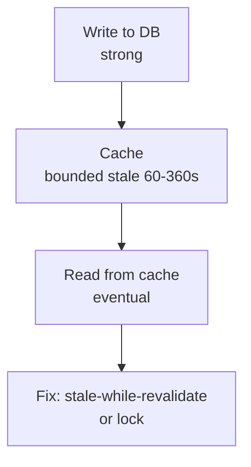

# Production Insights - Overview

What breaks in production and how to fix it without guessing. Short, runnable, sourced.

*   [Cache Stampede](../caching/cache-stampede.md) - when TTL expires and 1000 clients hit the DB at once, and 4 fixes that trade wait vs stale.
*   [Stale is Eventual](../caching/stale-is-eventual.md) - why serving stale `stale-while-revalidate` and coalesced requests are bounded eventual consistency.
*   [Strong vs Eventual Cache](../caching/strong-vs-eventual-cache.md) - two flavours: lock is strong (wait), stale/coalesced is eventual (fast) — the core trade.

