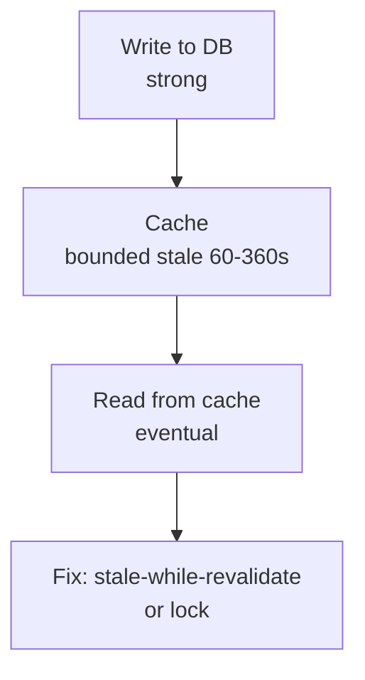

# Production Insights - Overview

What breaks in production and how to fix it without guessing. Short, runnable, sourced.

*   [Cache Stampede](./cache-stampede.md) - when TTL expires and 1000 clients hit the DB at once, and 4 fixes that trade wait vs stale.
*   [Stale is Eventual](./stale-is-eventual.md) - why serving stale `stale-while-revalidate` and coalesced requests are bounded eventual consistency.

