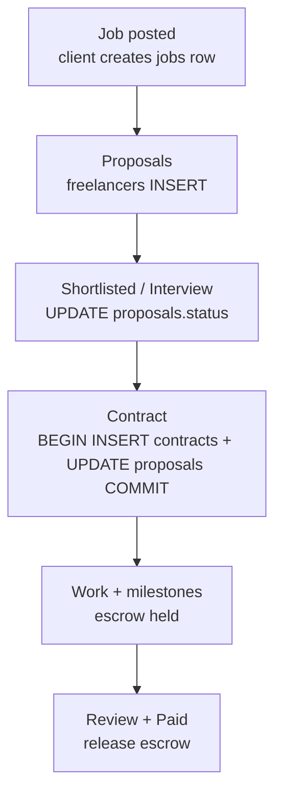

# QuickHire - hiring flow

Simple roadmap for the Upwork-like path. Each step maps to a DB and API pattern you already have.

## States

*   **Job posted** — client creates `jobs` row, RLS ensures only owner edits
*   **Proposals** — freelancers `INSERT` into `proposals`, `WHERE job_id = ?`, paginated with `WHERE id > last_id ORDER BY id LIMIT 20` (`databases/sql-introduction.md:5`)
*   **Shortlisted / Interview** — client updates `proposals.status`
*   **Contract** — `BEGIN; INSERT contracts; UPDATE proposals SET status='hired'; COMMIT;` (`databases/sql-introduction.md:38`)
*   **Work + milestones** — escrow held, milestones as `orders` with `status='paid'|'pending'`
*   **Review + Paid** — `UPDATE contracts` releases escrow, `INSERT reviews`

API is REST for `GET /jobs` (cacheable `GET`), see `api/graphql-vs-rest.md`.
