# Modeling a Recommendation System with Event Storming (QuickHire)

## The problem: "the recommendation feed is just a GET call"

You are modeling QuickHire, a marketplace where clients post jobs and freelancers bid on them. You stormed the core flow and the sticky notes flowed easily: `Job Posted`, `Bid Submitted`, `Bid Accepted`, `Job Completed`. Then you hit a wall.

The wall is the recommendation system. A freelancer opens the app and the home screen shows a feed of suggested jobs: "jobs matched to your skills, ordered by how relevant they are." You reach for an orange sticky and try to write the event for it. The natural attempt is `Recommendations Retrieved`.

And then nothing works.

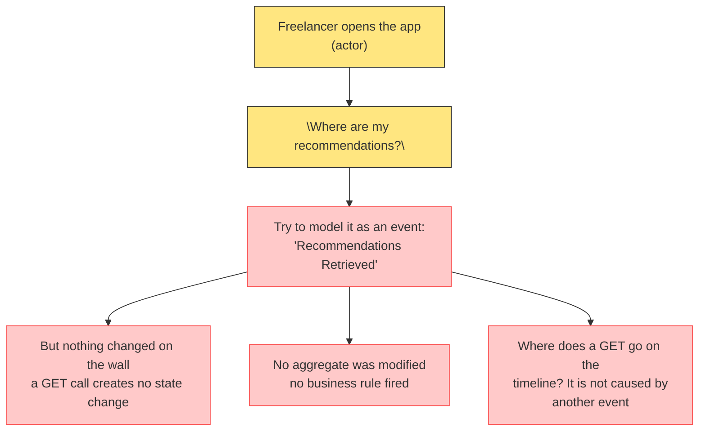

You feel stuck because you are looking at the wrong end of the system. Event Storming models state changes, and a recommendation feed is not a state change. It is a projection of everything that *did* change, precomputed and ready to be read. You cannot storm a projection with events. You can only storm the events that feed it.

The fix is a mental model with two sides.

## The mental model: events in, query out

A recommendation system has exactly two halves.

The **write side** collects events that are evidence about the people and jobs in the marketplace. These are orange sticky notes, and they already exist in your other contexts: `Job Posted`, `Bid Submitted`, `Job Completed`, `Review Submitted`, `Profile Updated`, `Job Saved`.

The **read side** is a precomputed store that the write side keeps updated. When the freelancer hits `GET /recommendations`, the system does not recompute anything from scratch at that moment. It reads the store. The GET is a query against a projection, which is exactly what Event Storming calls a **read model**, the green sticky note.

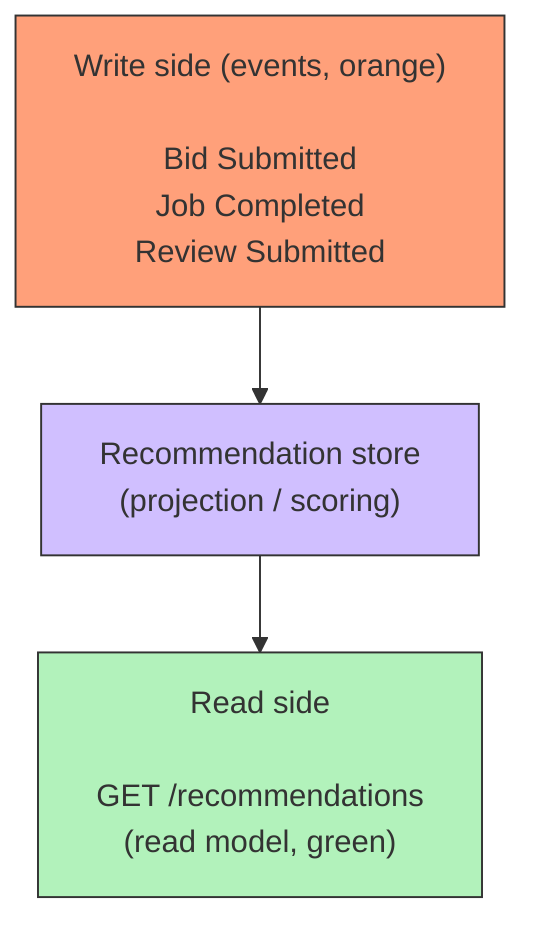

Everything that felt missing, the events that "should" surround the GET, does not exist because a read does not produce events. The events are on the other side, feeding the store. Once you see the two halves, the model falls into place.

## Step 1: dump the evidence events

The recommender needs raw material. Model a standard freelancer journey on QuickHire and write down every event that tells the system something about jobs, skills, and matches. Do not filter yet, just dump.

```
[Job Posted]
[Bid Submitted]
[Bid Rejected]
[Bid Accepted]
[Job Completed]
[Review Submitted]
[Profile Updated]
[Skill Added]
[Job Saved]
[Job Viewed]
[Profile Viewed]
[Job Archived]
```

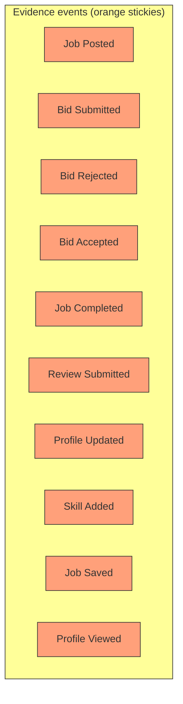

These are all real domain events that already exist in your other bounded contexts. That is the first discovery: the recommendation system introduces almost **no new events**. It consumes events that the marketplace was going to emit anyway.

## Step 2: classify which events feed the recommender

Not all evidence is equal. Some events are strong signals about relevance, others are noise. Classify each event by what it tells the recommender:

| Event | What it tells the recommender | Feed rank |
|---|---|---|
| Bid Submitted | Freelancer's skills matched a job. Strong relevance signal | High |
| Bid Accepted | The match was validated by the client. Strongest signal | Highest |
| Job Completed | The match produced real work. Validates skill quality | High |
| Review Submitted | Quality signal for future recommendations | High |
| Job Saved | Freelancer expressed interest without bidding. Good implicit signal | Medium |
| Job Viewed | Weak interest. Click-through signal | Medium |
| Profile Viewed | Client looked at the freelancer. Reverse-direction signal | Medium |
| Skill Added | Changes which jobs this freelancer matches | Refreshes match |
| Profile Updated | Changes the match vector | Refreshes match |
| Job Archived | Job is gone. Should stop being recommended | Removes from feed |

The classification matters because it decides which events the recommendation policy subscribes to and how much weight each one gets. The feed logic is a policy, not a human sitting and scoring jobs by hand.

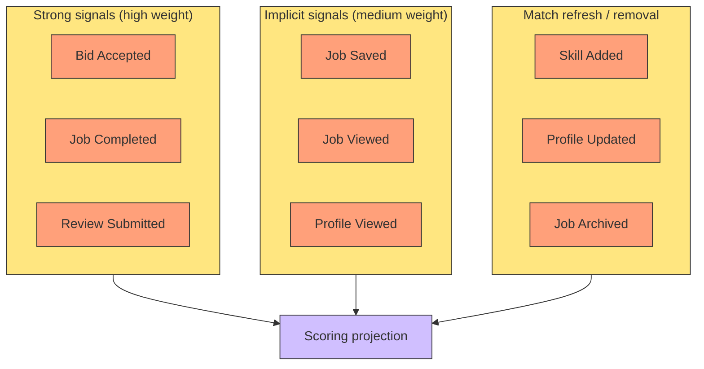

## Step 3: model the actors and commands for the evidence

Each evidence event already has a command and an actor in its source context. Reuse them, do not invent new ones:

| Event | Command (blue) | Actor (yellow) |
|---|---|---|
| Job Posted | Post Job | Client |
| Bid Submitted | Submit Bid | Freelancer |
| Bid Accepted | Accept Bid | Client |
| Job Completed | Mark Job Completed | Freelancer |
| Review Submitted | Write Review | Client |
| Skill Added | Add Skill | Freelancer |
| Job Saved | Save Job | Freelancer |
| Job Viewed | View Job | Freelancer |

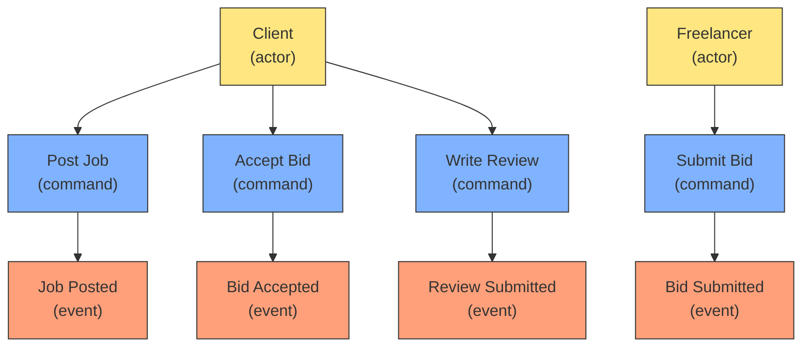

Notice that none of these actors belong to the recommendation system. The recommendation system has no human users of its own. It is a polite background worker that watches what everyone else does.

## Step 4: where the GET call actually goes

Now the part that stumped you. `GET /recommendations` appears on the board as a **green read model**, not an orange event. It sits at the end of the chain, between the freelancer and the next command they will issue.

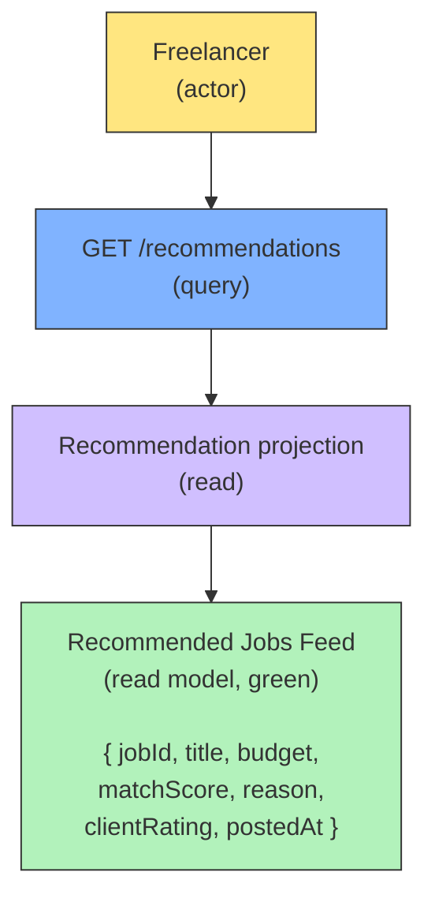

The feed is what the freelancer *sees* before they *act*. And per the read model rule: read models do not emit events, they enable commands. Looking at the feed, the freelancer can `View Job`, `Save Job`, or `Submit Bid`. Those commands produce more orange events, which flow back into the projection and improve tomorrow's feed.

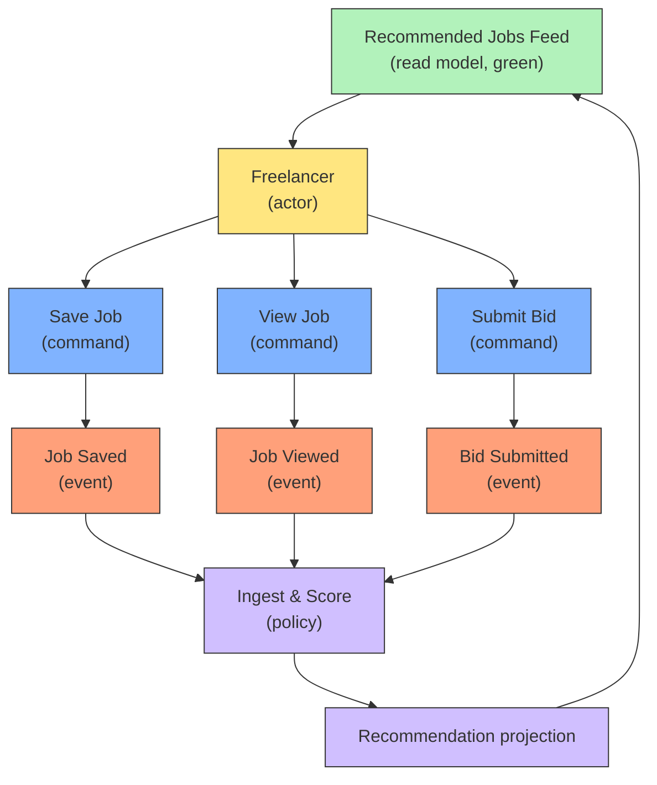

The loop is now closed on the board: events in, projection recomputed, GET reads it, user acts, more events in.

## The terminal read model: when the flow just ends

The recommendation feed feeds the loop, but not every read model has to. Some read models are *terminal*: they exist to be looked at, and nothing happens after them. The canonical example is an analytics dashboard.

Storm it like any other read model: green sticky at the end of the chain. The difference is that the arrow downstream of the green note does not exist — no command, no event, no policy. The flow terminates at the read model, and that is a valid, complete model.

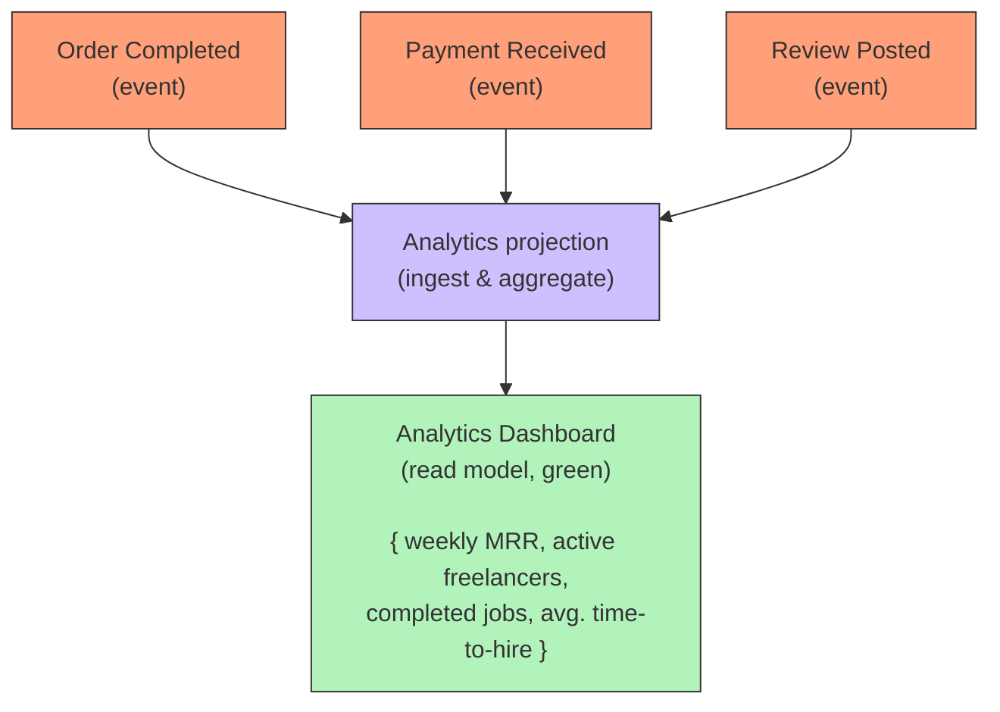

The dashboard still needs a way to stay fresh — a poll, a scheduled job, a push feed — but that refresh is a **yellow policy** (`Refresh every 5 min`), not a domain event, and it only re-delivers the same projection. It does not turn the dashboard into part of the write side.

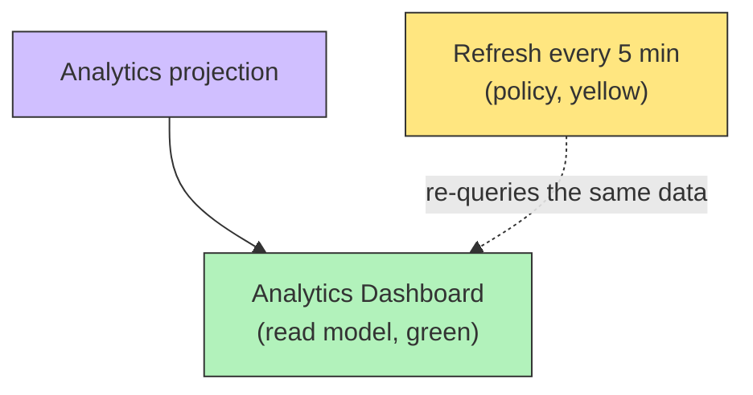

Contrast this with the recommendation feed: the feed's story only works *because* the freelancer acts on it. A dashboard genuinely ends the story. Model it as a green note with events feeding in and nothing coming out — and resist the urge to invent an event after it. "Analytics View" only earns event status if the viewing itself drives behavior, exactly like `Recommendation Viewed` below.

## The rare exception: when "Recommendations Viewed" IS an event

There is one case where the recommendation feed produces its own domain event. The recognition of the feed itself can be treated as a signal.

On a marketplace where discovery is the product, the moment a freelancer sees a recommendation is valuable: it is an impression. If the business cares to rank *how often a recommendation earns a view* versus a competing recommendation, you model `Recommendation Viewed` as an event that feeds a ranking policy. This is the special case where a "page visit" becomes a domain event, because the viewing itself drives real behavior.

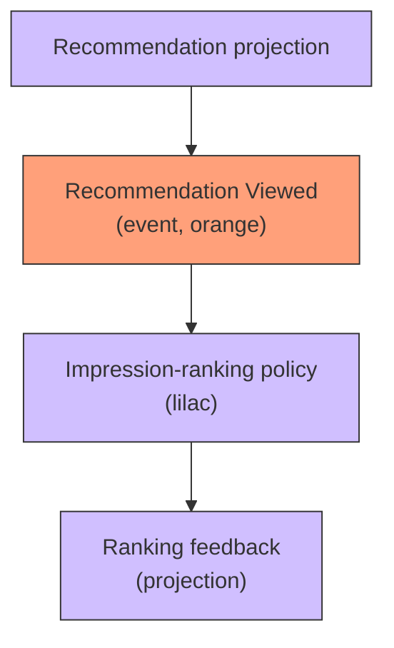

Use this only when the feed is the core value proposition and you need impression data to tune ranking. For most marketplaces, the implicit events (`Job Saved`, `Job Viewed`) are enough and you can skip this.

## Step 5: name the bounded context

The recommendation system is its own bounded context. It has its own language ("relevance", "match score", "impression"), its own store, and its own rules. It communicates with the marketplace exclusively through subscribed events on one side and a read API on the other.

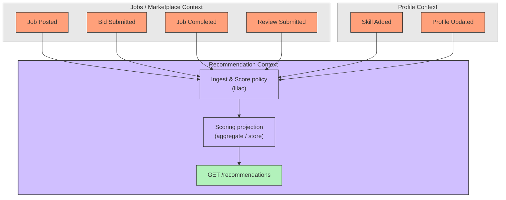

The recommendation context never queries the marketplace databases directly. The policy consumes the event payloads it needs, so the projection is self-sufficient. The GET endpoint reads only the projection.

## Common mistakes

**Modeling `Recommendations Retrieved` as an orange event.** It looks like an event but it changes nothing. It is the green read model. If you put it on the orange timeline, realize the past tense is wrong and the timeline gains a "ghost" that no command produces and no policy consumes.

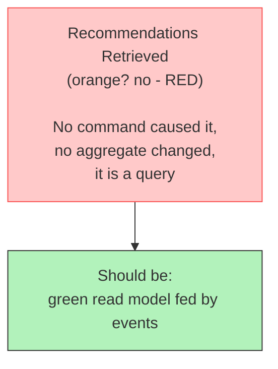

**Adding actors to the recommendation context.** The recommender has no human actors of its own. The actors (Client, Freelancer) live in their source contexts. If you find yourself drawing a "Recommender" user, you have drifts from the model.

**Letting the GET recompute from scratch.** If the GET call reads source aggregates across contexts, it is a boundary violation. The recompute is a policy job that runs as events arrive. The GET only reads the result.

**Skipping the feedback loop.** A recommendation system that does not observe its own outcomes gets stale. End the page at the read model *and* draw the user acting on it, because user action events are the next batch of fuel.

## What you get at the end

- A write side made of evidence events that already exist in your other contexts. No new events needed, just classification.
- A recommendation context with one policy (ingest and score), one projection store, and one read API.
- A green read model for `GET /recommendations` at the boundary between the actor and their next command.
- A closed feedback loop from feed to user action back to feed.

The GET call that stumped you was never supposed to be an event. It is the green sticky that the orange sticky notes have been feeding all along.