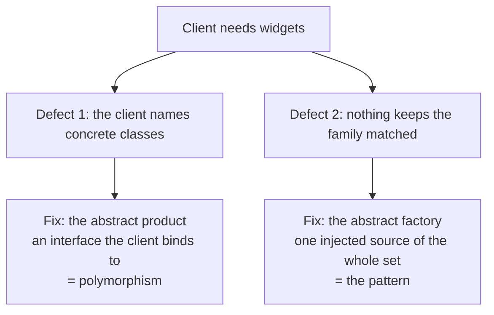
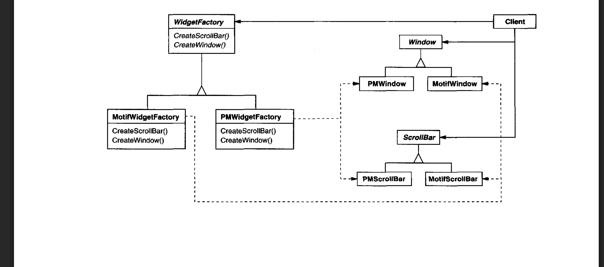
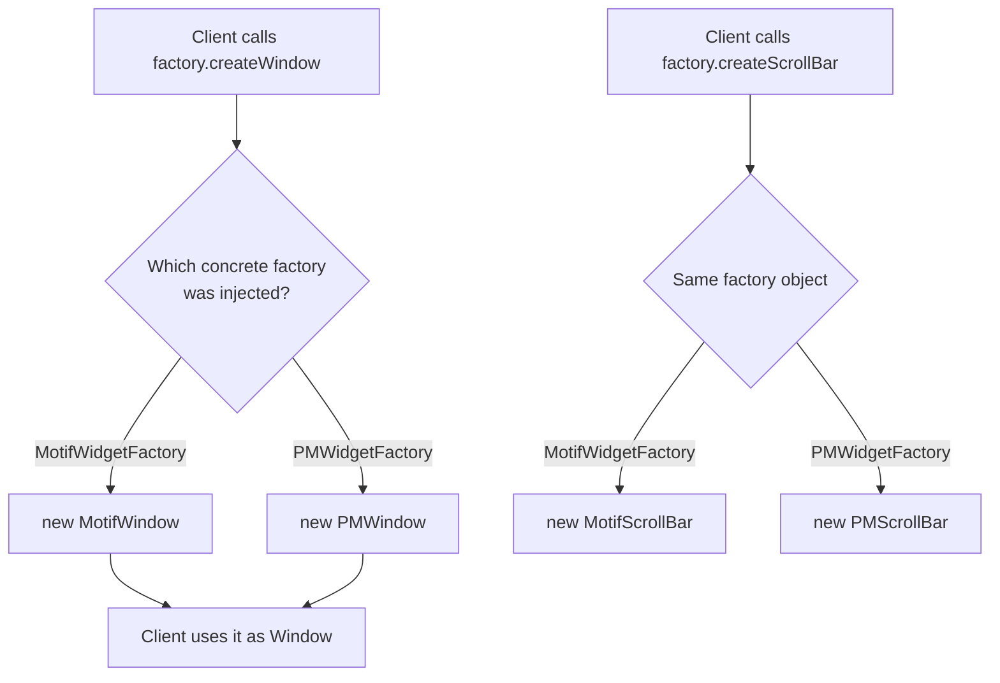
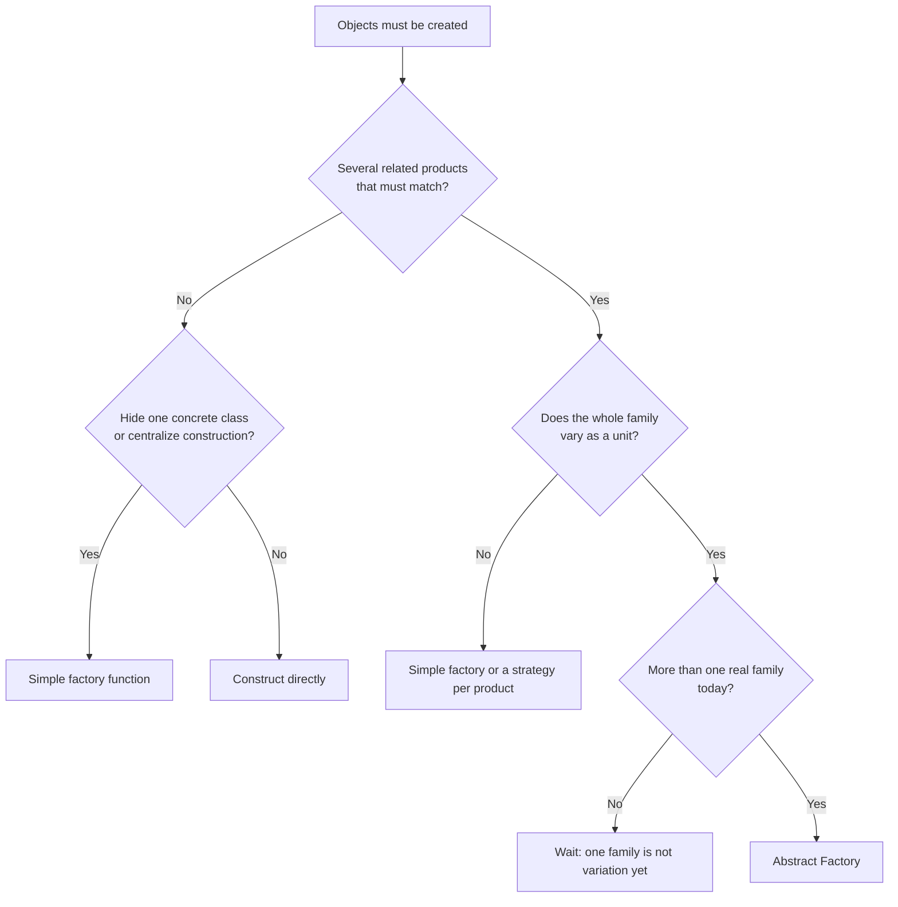

# Abstract Factory: Creating a Family of Objects Without Naming Them

**TLDR**

- **Abstract Factory** provides "an interface for creating families of related or dependent objects without specifying their concrete classes" (Gamma, Helm, Johnson, and Vlissides, *Design Patterns*, 1994; the pattern is also known as **Kit**).
- It solves **two separate problems**, and keeping them apart is the whole trick. Defect one is that the client names a concrete class; the fix is the **abstract product** (an interface the client binds to), which is plain polymorphism and needs no factory. Defect two is that nothing keeps the products matched; the fix is the **abstract factory** (one injected object that is the single source of the whole set).
- The word that matters is **families**. The factory earns its place only when two or more products must vary together. With a single product you have Factory Method, not Abstract Factory.
- The failure it prevents is a **pairing rule that lives nowhere**. A Motif window with a Presentation Manager scroll bar is a bug no compiler can catch, because no type expresses "these belong together."
- **The abstract product** keeps the concrete class out of the client. In Java the annotation is mandatory, so the interface is visibly what saves the client from writing `MotifWindow`; with inference the same decoupling comes from the factory's declared return type, not the call site.
- **The abstract factory** is the single source of the set: choosing one factory pins every product to the same family, so a mixed set is impossible by construction, and the branch on the theme exists once.
- Mechanically it is **composition plus polymorphism**: the client *has-a* factory and depends only on product interfaces, which is why GoF labels it **Object** (not **Class**) creational.
- **The test:** use it only when several related products must stay consistent and more than one real family exists today. One product, or products that do not need to match, means the abstract product plus a simple factory function is already enough.

## The problem

Suppose your application supports two visual themes, and each theme supplies its own version of several widgets: buttons, scroll bars, windows. The naive implementation constructs the concrete widget wherever it is needed:

```typescript
class Dialog {
  render() {
    const button = new MotifButton();
    const bar = new MotifScrollBar();
    // ...
  }
}
```

There are **two distinct defects** in this code, and they have two distinct fixes. Confusing them is why people either over-engineer or under-engineer the solution.

**Defect one: the client names concrete classes.** `Dialog` mentions `MotifButton` and `MotifScrollBar`. To change themes you must edit the client, and every screen that copied these lines. The fix is not a factory; it is an **interface type** the client can depend on instead. That is the abstract product, and it is just polymorphism.

**Defect two: the pairing rule lives nowhere.** Even if `Dialog` wrote `Button` and `ScrollBar`, nothing stops it from building a Motif button next to a Presentation Manager scroll bar. The relationship "these products belong to the same family" is real, but no type enforces it. The fix is the **abstract factory**: one object that is the only source of the whole set, so choosing it once pins every product to the same family.

This is the exact pain the pattern's Motivation describes: "Instantiating look-and-feel-specific classes of widgets throughout the application makes it hard to change the look and feel later."

<div style={{display: 'flex', justifyContent: 'center'}}>



</div>

The rest of this article takes each defect in turn, because the pattern is nothing more than the union of the two fixes.

## The intent, decoded

The GoF Intent is one sentence, and each clause carries weight.

> Provide an interface for creating families of related or dependent objects without specifying their concrete classes.

- **Provide an interface:** the client is given something to call. It does not construct directly.
- **for creating families:** a group of products that belong together and must be used together.
- **of related or dependent objects:** *related* means same theme or style; *dependent* means one product's correctness assumes the others match.
- **without specifying their concrete classes:** the client never writes `MotifButton`. All concrete names live behind the factory.

The defining constraint is the last clause. Everything else is in service of it, and the two fixes in the previous section are what make it true.

## The structure

The book's class diagram for the pattern (the Motif and Presentation Manager widget example). The dashed arrows are the creation edges: each concrete factory produces its own family.

<div style={{display: 'flex', justifyContent: 'center'}}>



</div>

## The abstract product: why the client never names a concrete class

The first half of the pattern is the **abstract product**. It is an interface (`Window`, `ScrollBar`, `Button`) that the client binds to. The concrete classes (`MotifWindow`, `PMWindow`) implement it, and the client never mentions them.

The clearest way to see what the abstract product buys is to remove it. Without an interface, the client has no choice but to name the concrete class:

```java
MotifWindow w = factory.createWindow(); // no abstraction: the concrete class is in the client
```

With it:

```java
Window w = factory.createWindow(); // the client binds only to the abstraction
```

In a nominal, statically typed language like Java the annotation is mandatory, which makes the point sharper: the abstract product is exactly what saves the client from writing `MotifWindow`. The compiler even refuses the coupled version, because a `Window` cannot be assigned to a `MotifWindow` variable without a cast.

In a language with inference the same thing happens without the visible annotation:

```typescript
interface WidgetFactory {
  createWindow(): Window; // the signature declares the abstract product
}

const w = factory.createWindow(); // w is Window, not MotifWindow
```

The decoupling was done by the **declared return type**, not by the call site. This is worth stating because the call site is where people look. If a factory leaks its concrete type, the client is forced to widen it back:

```typescript
createWindow(): MotifWindow;               // the signature leaks
const w = factory.createWindow();          // w: MotifWindow, the abstraction is lost
const w2: Window = factory.createWindow(); // the client has to put the abstraction back
```

A leak like that is a sign the factory's signature is wrong, not that the client should annotate harder.

The important conclusion: **the abstract product is decoupling, and it is not the factory.** A plain function returning the interface gives the same decoupling:

```typescript
function createWindow(): Window {
  return new MotifWindow();
}

const w = createWindow(); // the client still never names MotifWindow
```

So if the only problem were "keep concrete classes out of the client," you would not need Abstract Factory at all. The abstract product is necessary, but on its own it is not sufficient. That is the gap the second half fills.

## The abstract factory: why the family needs one source

The second half is the **abstract factory**, and it exists for the problem the abstract product cannot solve: keeping the products matched.

Suppose the client makes two products through two independent functions:

```typescript
const w = createWindow();    // MotifWindow
const s = createScrollBar(); // PMScrollBar: the families do not match
```

Both are typed as interfaces. The client still never names a concrete class. And yet the result is a Motif window with a Presentation Manager scroll bar. The interfaces hid the names; they did not enforce the relationship.

The abstract factory fixes this by being the **single source** of the whole set:

```typescript
const factory: WidgetFactory = new MotifWidgetFactory();
const w: Window = factory.createWindow();       // MotifWindow
const s: ScrollBar = factory.createScrollBar(); // MotifScrollBar
```

Now the client makes **one choice**, which factory to hold, and that single choice pins every product to the same family. There is no path to a scroll bar except through the same object that produced the window, so the mismatch is impossible by construction. The branch on the theme exists once, where the factory is chosen, and nowhere else.

<div style={{display: 'flex', justifyContent: 'center'}}>



</div>

This is the pattern's real contribution. The abstract product decouples the client from a **class**; the abstract factory decouples the client from a **family selection** and guarantees the set is consistent.

## The worked example (from the GoF book)

The book's Motivation is a user interface toolkit supporting multiple look-and-feel standards, such as Motif and Presentation Manager. Different look-and-feels define different appearances and behaviors for widgets like scroll bars, windows, and buttons. To be portable across them, the application must not hard-code its widgets.

```typescript
// The abstract products: the interfaces the client programs against.
interface Button {
  click(): void;
}

interface ScrollBar {
  scroll(): void;
}

// The abstract factory: one create method per product kind.
interface WidgetFactory {
  createButton(): Button;
  createScrollBar(): ScrollBar;
}

// The Motif family: one concrete product per abstract product.
class MotifButton implements Button {
  click() {
    // draw a Motif button
  }
}

class MotifScrollBar implements ScrollBar {
  scroll() {
    // draw a Motif scroll bar
  }
}

class MotifFactory implements WidgetFactory {
  createButton(): Button {
    return new MotifButton();
  }
  createScrollBar(): ScrollBar {
    return new MotifScrollBar();
  }
}

// The Presentation Manager family: the same products, the other look and feel.
class PMButton implements Button {
  click() {
    // draw a PM button
  }
}

class PMScrollBar implements ScrollBar {
  scroll() {
    // draw a PM scroll bar
  }
}

class PMFactory implements WidgetFactory {
  createButton(): Button {
    return new PMButton();
  }
  createScrollBar(): ScrollBar {
    return new PMScrollBar();
  }
}

class Dialog {
  constructor(private factory: WidgetFactory) {}

  render() {
    const button: Button = this.factory.createButton(); // never "MotifButton"
    button.click();
  }
}

// The decision lives in exactly one place:
const theme: 'motif' | 'pm' = 'motif';
const factory: WidgetFactory = theme === 'motif'
  ? new MotifFactory()
  : new PMFactory();
new Dialog(factory);
```

The client is written once and names no concrete product. The concrete names appear only inside the concrete factories. Swapping the theme swaps the entire widget set, and the two widget kinds can never be mixed because they come from the same factory.

Notice both halves in one place: `Dialog` depends on the `Button` interface (abstract product, defect one solved), and it takes a `WidgetFactory` rather than choosing widgets itself (abstract factory, defect two solved).

## When to use it, and when it is over-engineering

Use Abstract Factory when **both** are true:

1. There are **multiple related products** that must be consistent with each other.
2. The **whole family varies as a unit**, and there is more than one real family today.

<div style={{display: 'flex', justifyContent: 'center'}}>



</div>

**The cost is asymmetric.** Adding a new **family** is cheap: one new concrete factory, and no client changes. Adding a new **product kind** is expensive: every new product means one more method on the abstract factory and an implementation in every concrete factory. If the set of products grows faster than the set of families, Abstract Factory is the wrong shape; an interface per product with independent selection costs less.

Start with a simple factory function, and promote it to an Abstract Factory when the second real family arrives and the products must stay matched.

## The one rule

Abstract Factory provides an interface for creating a **family** of related objects without naming their concrete classes. Use it when several products must vary together and more than one real family exists. It is composition plus polymorphism, so the client stays closed while families come and go. If there is only one product, or the products do not need to match, the abstract product plus a simple factory function or an injected strategy is the cheaper and correct answer.

## Sources

- Erich Gamma, Richard Helm, Ralph Johnson, and John Vlissides, *Design Patterns: Elements of Reusable Object-Oriented Software*, Addison-Wesley, 1994 (Creational Patterns chapter, "Abstract Factory", also known as Kit; the Intent and Motivation quoted above; the Object/Class scope and Creational/Structural/Behavioral classification; the note that concrete factories are implemented with Factory Methods).
- The pattern catalog's creational set (Abstract Factory, Builder, Factory Method, Prototype, Singleton) and the definition of a creational pattern as abstracting the instantiation process, from the same book.
