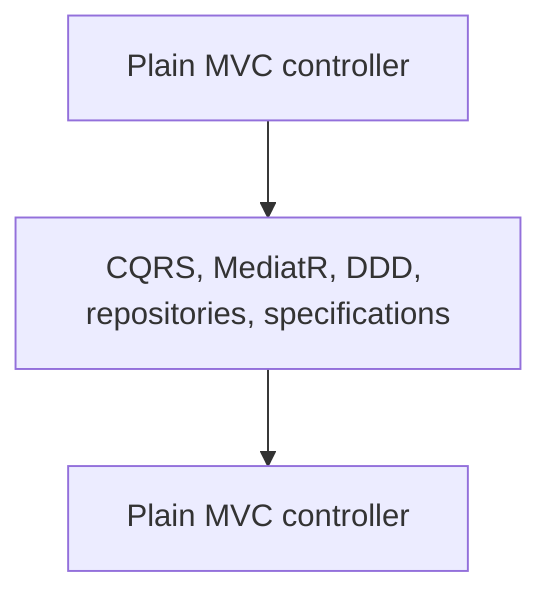
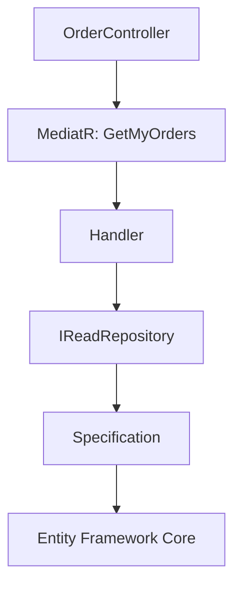
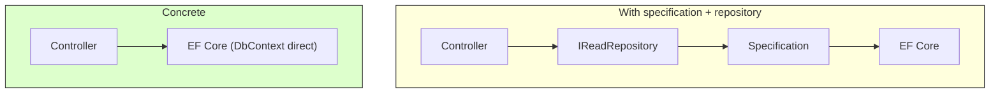
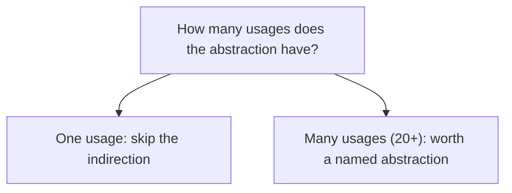
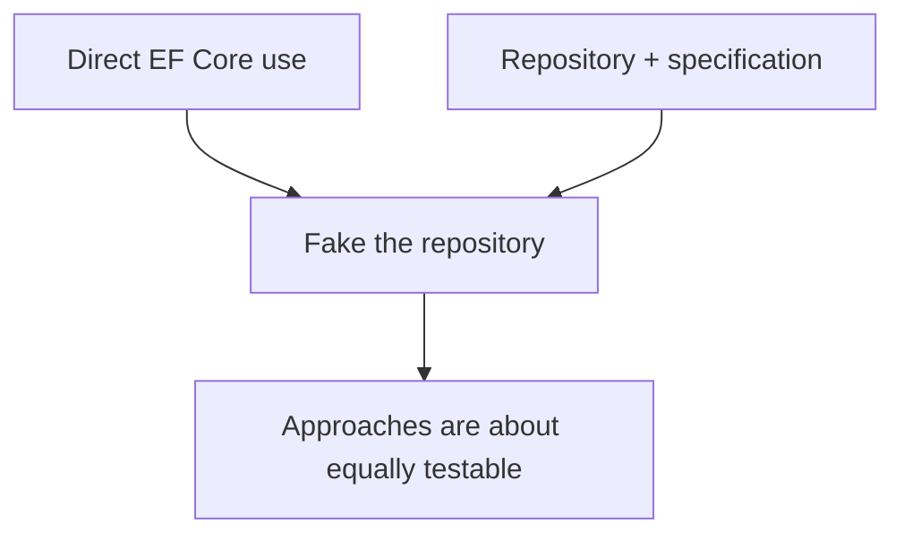
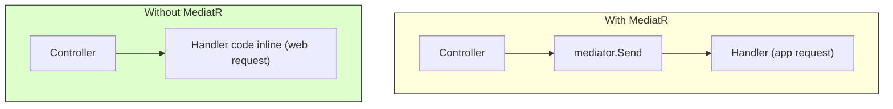
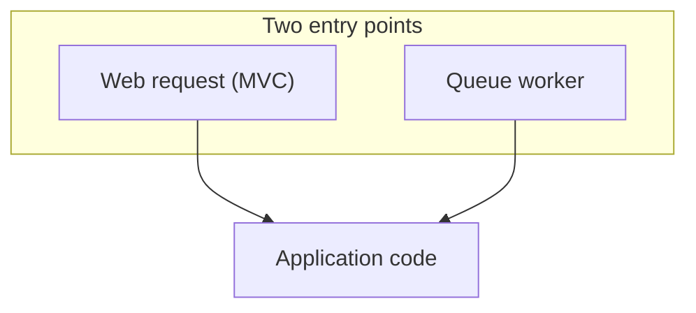
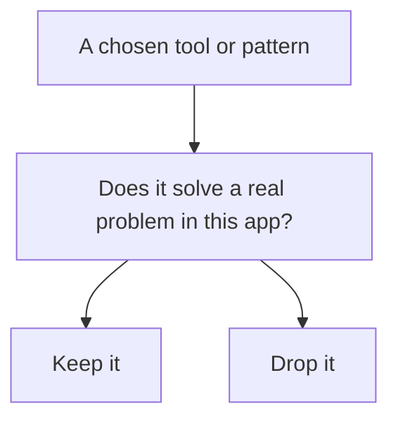

# Abstractions Must Earn Their Place

## The problem: everyone picks a side in an abstraction war

There is a well-known meme about API design. At one extreme you have a plain MVC controller. At the completely opposite extreme, you end up back at MVC controllers again. In the middle sits every abstraction, library, and tool you could add: CQRS, MediatR, DDD, FastEndpoints, repositories, specifications. The arguments about which approach is right never stop.

Both sides make sense to their believers, and both can be right. The honest answer to "who is right?" is that it depends. An answer of "it depends" is useless unless you explain what it depends on. This article does that by walking a single, real example and stripping its abstractions away, one at a time, explaining the trade off of each removal. The message is not that abstractions are bad. It is that every layer is a design choice, and the cost of each choice depends on your context, because context is king.

## The starting point

The example is a simple `OrderController` with a `MyOrders` method. This is what it uses today:

- MVC (the framework)
- MediatR (the mediator library)
- A repository, the `IReadRepository`
- A specification
- Entity Framework Core (the ORM)

The route calls MediatR with a `GetMyOrders` request, passing in the identity name of the logged in user. The handler injects an `IReadRepository`. It also applies a specification, which adds a `where` clause and other LINQ behavior to Entity Framework Core. The specification does the filtering for the current user's username. The repository is backed by EF Core. The result is a list of orders transformed into an `OrderViewModel`.

That is MVC plus MediatR, a specification, a repository, and an ORM, all for one route.

## Removing the specification and repository

The first step removes the specification and repository entirely, replacing them with direct use of the `DbContext` and the actual query. The result is identical. The question is what was lost.

The specification had two purposes in this context. It captured the precondition, the filtering of the username, and it did the eager loading of line items so they are not accidentally left unloaded. Both are real value. But the key question is how many places used it. The answer was one.

For one usage, creating that indirection is almost always unjustified. If the same filter was used in twenty places and always needed it, then yes, it is worth capturing it explicitly and giving it a meaningful name. Use this again: the count of usages is what separates the two cases, not the pattern itself.

The repository and the specification also travel together. Because the specification does the filtering, the repository must be used with it. Otherwise you retrieve too much data and have to filter in memory. That makes no sense, so the two layers are coupled by their own design.

There is still value in the specification and the repository. It depends on what you are capturing and how many consumers you have. The same test applies to the entire ORM question. If you want to abstract your ORM because you may change data access later, count the usages first. If you have ten places that call the ORM for orders, an abstraction is not valuable; just change the ten places. If you have a thousand, then maybe an abstraction is worth it, though you might also ask why you have a thousand.

## Is direct data access testable?

A common objection is that the repository and specification were easier to test than using Entity Framework Core directly. The reply is that this is not necessarily true.

You can fake out the particular data set for the EF Core path just as you can fake out the repository. The abstractions you create only deserve to stay when they have value, which comes down to your degree of coupling and your actual testing needs.

## Removing MediatR

The next removal is MediatR. Take the contents of the handler and put them inline in the controller.

Something stands out immediately. The username is no longer available. Where did the username come from? MVC. It was only accessible inside the controller, and it was being passed into the request. Inline, we now have to reference that value directly in the application code.

This muddles the water between application code and framework code. MVC is about HTTP. Now application code is directly tied to the web framework. Before, the code had an application request. Now it really has a web request. The application code is coupled directly to MVC.

Does this matter? It depends on whether you are building a web app that only ever returns HTML or JSON. If it is a web app built on HTTP with no other entry point, this coupling is totally fine.

But if you have other entry points, it becomes a problem.

## The web + worker pattern

MVC could be one entry point and Minimal APIs could be another. But you might need more. Consider a web plus queue worker arrangement: the controller places messages on a queue, and a separate worker executes the tasks. Same codebase, potentially deployed as two separate units, but still two different entry points.

If that is your case, you do not want the application code living directly inside an MVC controller, because the worker must reach the same logic without going through HTTP. Otherwise the worker could not reuse it without re-implementing it around the web framework.

So the problem is not MediatR, and it is not controllers. It is coupling application logic to a single entry point when you have more than one. When different routes call the same command or query, a mediator is a legitimate tool, because the logic should be reachable from all of them.

## The actual message

None of the tools is the problem. Controllers are not the problem. Minimal APIs with CQS, AutoMapper, MediatR, FastEndpoints, vertical slices, DDD - none of it is the problem.

The problem is not understanding the degree of coupling you have to the tooling and whether it provides value in the given context.

The concrete points to carry away:

- Frameworks (MVC, Minimal APIs, and so on) are entry points, not architecture.
- Your architecture is composed of many different architectural styles.
- Indirection adds flexibility, but it also adds complexity.
- Direct coupling is not inherently bad. Understand what you are coupling to and what it costs.
- You do not need an abstraction for everything unless something is actually limiting you.
- Use abstractions when they solve real problems, not just because everyone says to abstract everything.
- Design around your application's needs, not someone else's patterns.

## Summary

| Abstraction | Worth it when | Wasteful when |
|---|---|---|
| Specification | Reused in many places, captures a precondition | A single route needs a one-off filter |
| Repository | The query context is repeated and shared | One place reads a record |
| MediatR / mediator | Multiple entry points call the same logic | One HTTP entry point only |

The decision is always the same question: how many usages, how much coupling, and does the abstraction earn its indirection in this context. Use abstractions that solve a real problem, and let the concrete ones drive the code to that answer.

## References

- Comartin, D. (2025). *Minimal APIs, CQRS, DDD… Or Just Use Controllers?*. CodeOpinion. https://codeopinion.com/minimal-apis-cqrs-ddd-or-just-use-controllers/. The companion blog post with the full walkthrough of this example. This article summarizes and restates the trade-offs.
- Comartin, D. (2025). *Minimal APIs, CQRS, DDD… Or Just Use Controllers?*. YouTube, https://www.youtube.com/watch?v=FR64isPs5Vs. The original video on the ClickOpinion channel.