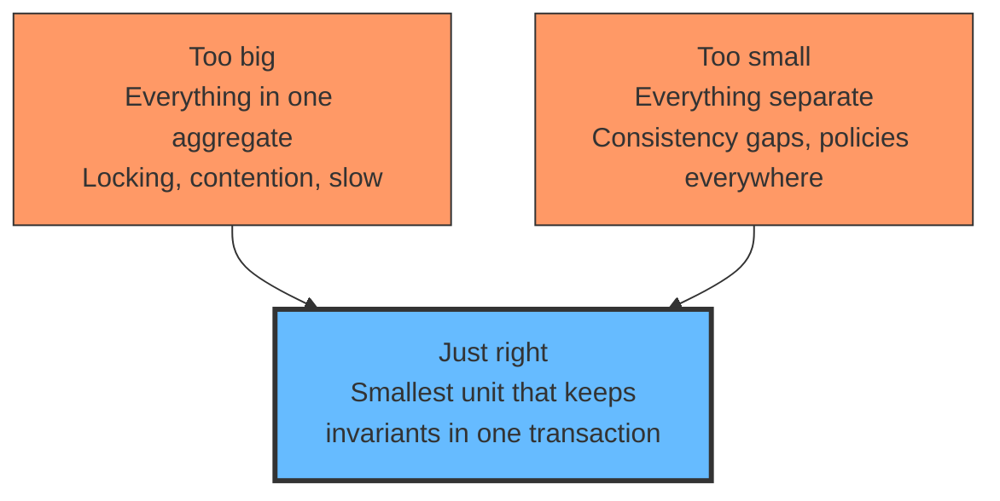
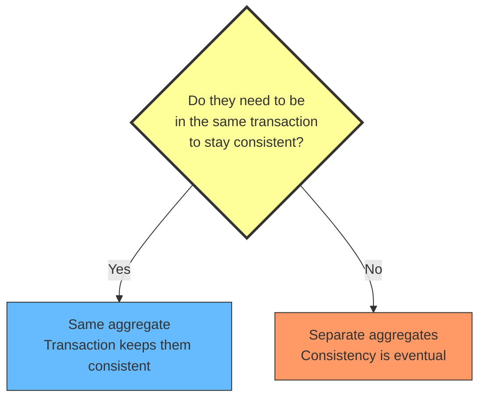
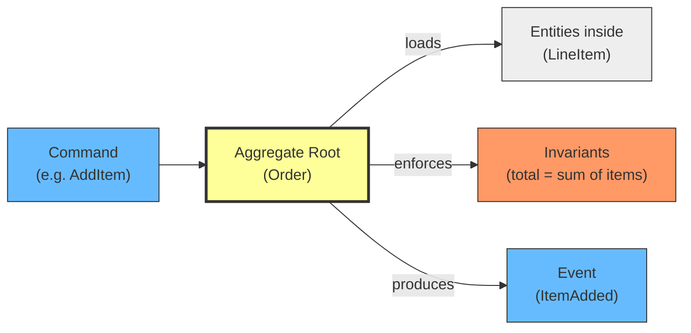
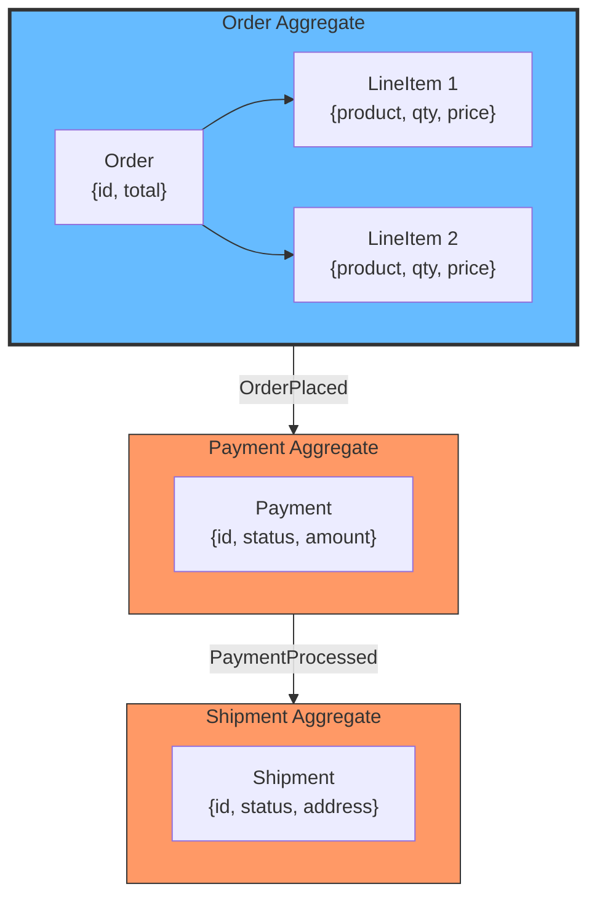

# Aggregate Sizing: How Big Should an Aggregate Be?

## The problem: the aggregate is either too big or too small

Every team using Domain-Driven Design hits the same question: how many entities should go inside one aggregate? The two failure modes:

**Too big:** you bundle everything together. One aggregate contains Order, LineItem, Payment, Shipment. Now changing the shipment status locks the order, and every concurrent operation serializes on the same lock. Performance degrades. The team blames DDD.

**Too small:** you split everything apart. Order and LineItem are separate aggregates. Now the user adds an item to the order, and the system needs to keep the order total and the line items consistent. But they are in different transactions. You need eventual consistency between things that must be consistent right now.

Both failure modes come from the same mistake: treating the aggregate as a structural grouping (things that are "related") instead of a behavioral boundary (things that must be consistent together).

<div style={{display: 'flex', justifyContent: 'center'}}>



</div>

## The rule: aggregate boundary = consistency boundary = transaction boundary

An aggregate is not a folder for related entities. It is a **consistency boundary**. After a transaction commits, every invariant inside the aggregate must hold. The aggregate root (the entity you load and save through) enforces all invariants.

The sizing question is simple: **do these entities need to be in the same transaction to stay consistent?**

- **Yes:** same aggregate. Transaction keeps them consistent.
- **No:** separate aggregates. Consistency between them is eventual.

<div style={{display: 'flex', justifyContent: 'center'}}>



</div>

Three sub-questions help answer the main one:

**Do they change in the same transaction?** If you update a LineItem, do you need to recalculate the Order total in the same transaction? If yes, they belong together.

**Do they share invariants?** Is there a rule that says "Order total must equal sum of LineItem prices"? If yes, they must be in the same aggregate. If the invariant spans two aggregates, you need eventual consistency to enforce it, which is harder and slower.

**Do they have independent lifecycles?** Can a LineItem exist without an Order? Can an Order exist without a Payment? If they can live independently, they are separate aggregates.

## What the aggregate root actually does

The aggregate root is the entry point. All operations go through it. It loads the entities it needs, enforces invariants, and saves everything in one transaction.

Entities inside the aggregate are data. They do not enforce invariants on their own. The root does.

Events are the output of the aggregate, not part of it. A command triggers behavior; the aggregate enforces invariants; events are the result.

<div style={{display: 'flex', justifyContent: 'center'}}>



</div>

## Practical example: e-commerce order

### Too big (the everything-bagel aggregate)

```typescript
class Order {
  id: string;
  customer: Customer;
  lineItems: LineItem[];
  payment: Payment;
  shipment: Shipment;
  status: OrderStatus;

  addItem(item: LineItem) {
    this.lineItems.push(item);
    this.recalculateTotal(); // touches line items
    this.validatePayment(); // touches payment
  }
}
```

Everything is in one aggregate. Changing an item locks the entire order. Payment and shipment serialize on the same lock. If two users modify different line items at the same time, they block each other. If the payment service is slow, the order modification is slow too.

### Too small (everything is separate)

```typescript
class Order {
  id: string;
  total: number;
}

class LineItem {
  id: string;
  orderId: string;
  productId: string;
  quantity: number;
  price: number;
}
```

Order and LineItem are separate aggregates. But the invariant "Order total must equal sum of LineItem prices" must hold. Since they are in different transactions, you need eventual consistency. You need a policy that updates the order total when a line item changes. This is over-engineered for something that must be immediately consistent.

### Just right (the consistency boundary)

```typescript
class Order {
  id: string;
  private lineItems: LineItem[] = [];
  private total: number = 0;

  addItem(productId: string, price: number, quantity: number) {
    const item = new LineItem(productId, price, quantity);
    this.lineItems.push(item);
    this.recalculateTotal(); // same transaction, same aggregate
  }

  removeItem(lineItemId: string) {
    this.lineItems = this.lineItems.filter(i => i.id !== lineItemId);
    this.recalculateTotal(); // invariant enforced immediately
  }

  private recalculateTotal() {
    this.total = this.lineItems.reduce(
      (sum, i) => sum + i.price * i.quantity, 0
    );
  }
}
```

LineItem is inside Order because the invariant "total = sum of line items" must hold in the same transaction. Payment is separate because payment can succeed or fail independently of the order being created. Shipment is separate because shipping happens later, after payment.

<div style={{display: 'flex', justifyContent: 'center'}}>



</div>

## The cost of getting it wrong

### Too big: contention

When the aggregate is large, every operation that touches any entity inside it locks the entire aggregate. Two users modifying different line items on the same order serialize on the same lock. The bigger the aggregate, the worse the contention. In a high-throughput system, this kills performance.

You will see it in database row locks, long transactions, and timeout errors. The fix is always the same: make the aggregate smaller.

### Too small: consistency gaps

When the aggregate is too small, you need policies to keep things consistent that should have been consistent by default. The system becomes more complex, harder to reason about, and harder to debug. Every policy is a potential failure point. You end up with event handlers doing work that a single transaction would do.

### The sweet spot

The right aggregate is the smallest unit that keeps all invariants consistent in a single transaction. Everything outside that boundary is a separate aggregate with eventual consistency.

## When to split: signals that your aggregate is too big

- Concurrent operations on different entities serialize on the same lock.
- The aggregate has entities with independent lifecycles (e.g., Payment can exist without Order).
- The aggregate has entities that are modified by different commands at different times.
- The aggregate is loaded but most of its data is never read.

## When to merge: signals that your aggregate is too small

- Two entities share an invariant that must hold in the same transaction.
- You need a policy to keep them consistent, but the consistency is immediate (not eventual).
- The "separate" aggregate is always loaded together with the other one.

## The relationship to bounded contexts

Aggregate sizing is a tactical decision within a bounded context. The bounded context tells you where language changes. The aggregate tells you what must be consistent together. You can have multiple aggregates in one bounded context, each with its own consistency boundary.

The bounded context is the strategic boundary. The aggregate is the tactical boundary. Both matter, but they solve different problems.

## Summary

- Aggregate = consistency boundary, not a folder for related entities.
- Same transaction = same aggregate. Different transactions = separate aggregates.
- The aggregate root enforces invariants. Entities inside are data. Events are output.
- Too big = contention. Too small = consistency gaps.
- The right size is the smallest unit that keeps all invariants consistent in a single transaction.

## See also

- [How Two Updates in Transactions Block Each Other](/docs/software-engineering/transaction-locking) explains the locking mechanics behind aggregate contention: how row locks work, what happens when they are held too long, and how deadlock occurs.
