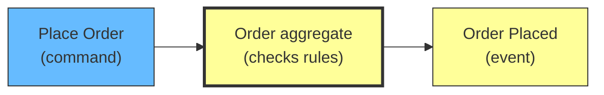
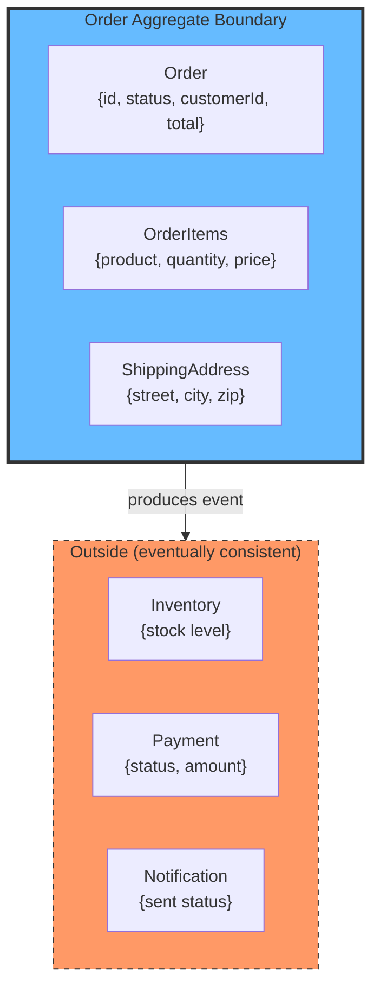
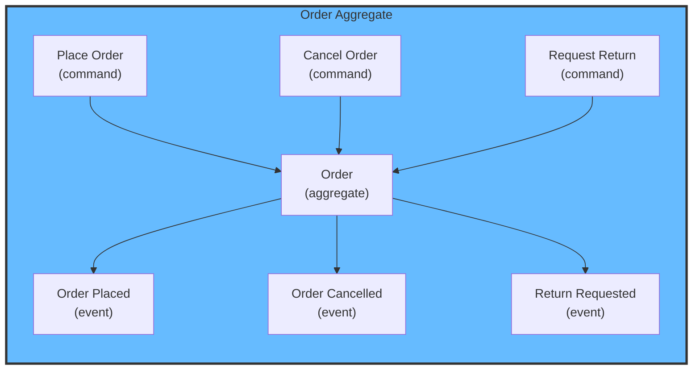
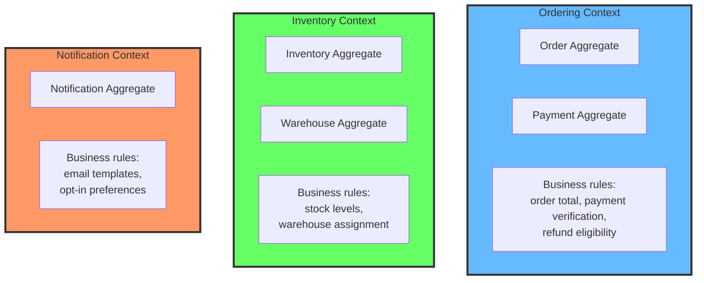
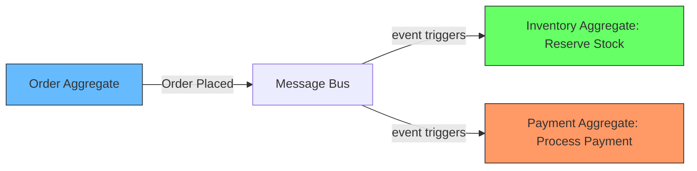

# Aggregates and Boundaries: From Commands to Modules

## What is an aggregate

The authoritative definitions from the original sources:

**Evans (2003, *Domain-Driven Design*, p.125):** "An aggregate is a cluster of associated objects that we treat as a unit for the purpose of data changes. Each aggregate has a root and a boundary. The root is the only member of the aggregate that outside objects are allowed to hold references to."

**Vernon (2013, *Implementing Domain-Driven Design*, p.347):** "An aggregate is a cluster of domain objects that can be treated as a single unit. An aggregate will have one of its component objects be the aggregate root. Any references from outside the aggregate should only go to the aggregate root. The root can then forward the request to any of its internal components if needed."

**Fowler (2013, bliki: *DDD_Aggregate*):** "A DDD aggregate is a cluster of domain objects that can be treated as a single unit. An example may be an order and its line-items, these will be separate objects, but it's useful to treat the order (together with its line items) as a single aggregate."

In simpler terms: an aggregate is the thing that enforces business rules. It receives commands, checks if the rules allow it, and produces events if they do.

```
Place Order (command) → Order aggregate (check rules) → Order Placed (event)
```

The aggregate is an entity — it is the thing being acted on. `Order` is an entity. When someone says "Place Order," the `Order` aggregate checks: "is the cart valid? are the items in stock? is the customer allowed to order?" If all rules pass, it produces `Order Placed`.



If the rules fail, no event is produced. The command is rejected. This is what makes the aggregate a consistency boundary — it guarantees that `Order Placed` never happens unless all rules pass. Evans (2003) describes this in Chapter 6: "An aggregate is a cluster of associated objects that we treat as a unit for the purpose of data changes."

## One aggregate, one consistency boundary

An aggregate draws a line around the data it needs to enforce its rules. Everything inside that line must be consistent. Everything outside can be eventually consistent.

For an `Order` aggregate:



The order aggregate enforces: "cannot place order if total is zero" and "cannot cancel if already shipped." It does not enforce inventory levels — that is another aggregate (`Inventory`). The order publishes `Order Placed` and the inventory aggregate picks it up and reserves stock eventually.

Vernon (2013, *Implementing Domain-Driven Design*) defines this rule: "Design small aggregates." A common mistake is putting too much inside the boundary. If the inventory check happens inside the order aggregate, the aggregate is too large and holds the transaction open too long. Smaller aggregates mean you accept eventual consistency between them.

## From command and event to aggregate

How do you find the aggregates from your use cases?

Every use case has a command and an event. The noun in the middle is the aggregate.

This pattern appears consistently across the authoritative sources:

**Evans (2003, Chapter 6, Cargo Shipping example):** The `Cargo` aggregate handles `HandleCargo` (command) and produces `Cargo Handled` (event). The aggregate enforces rules like "cargo cannot be handled at a location it is not routed through."

**Vernon (2013, Chapter 10, Scrum example):** The `BacklogItem` aggregate handles `CommitBacklogItemToSprint` (command) and produces `BacklogItemCommitted` (event). The aggregate enforces rules like "backlog item must be in a state that allows committing to a sprint."

**Fowler (2013, bliki: *DDD_Aggregate*):** "A DDD aggregate is a cluster of domain objects that can be treated as a single unit. An example may be an order and its line-items."

**Baeldung (2024):** "Aggregates accept business commands, which usually results in producing an event related to the business domain – the Domain Event."

| Use case | Command | Aggregate | Event | Source |
|---|---|---|---|---|
| Customer places order | Place Order | Order | Order Placed | Fowler 2013 |
| Customer cancels order | Cancel Order | Order | Order Cancelled | Baeldung 2024 |
| Commit backlog item | CommitToSprint | BacklogItem | BacklogItemCommitted | Vernon 2013, Ch.10 |
| Handle cargo | HandleCargo | Cargo | Cargo Handled | Evans 2003, Ch.6 |
| Process payment | Process Payment | Payment | Payment Processed | Common example |

All commands and events that share the same aggregate noun belong to that aggregate.



## What is a bounded context

**Evans (2003, *Domain-Driven Design*, p.317):** "A bounded context is a boundary within which a particular model is defined and applicable. When models of different contexts are combined, they become ambiguous and contradictory. Therefore explicit boundaries are placed around each model."

**Vernon (2013, *Implementing Domain-Driven Design*, p.78):** "A bounded context is simply the boundary within a domain within which a particular ubiquitous language applies and a particular domain model is implemented and evolved."

In simpler terms: a bounded context is a line around a group of concepts that share the same language. The same word can mean different things in different contexts. "Book" in the catalog context means title, author, and reviews. "Book" in the warehouse context means weight and dimensions. The bounded context makes it explicit which meaning applies.

## From aggregate to bounded context

An aggregate is not a bounded context. A bounded context contains multiple aggregates that share the same language and business rules. The aggregate is inside the boundary. The bounded context is the boundary itself.

The question: **which aggregates belong in the same context?**

Two criteria:

**They share business rules.** If a rule in `Order` depends on data in `Payment`, they might be in the same context. "Orders over $1000 cannot be placed without payment verification" — this rule touches both aggregates. If it is common, they belong together.

**They share actors.** If the same person works with both aggregates as part of the same workflow, they belong together. The customer places the order, then the payment processes. Same person, same workflow.



## How many aggregates in a context?

There is no fixed number. The range for most systems is 1 to 12 aggregates per context. Fewer than 1 is impossible. More than 12 means either the context is too large or the aggregates are too fine.

The guideline: **if you have more than 12 aggregates in one context, look for a split.** There is likely a sub-group that has its own language and actors.

The guideline for the opposite: **if you have one aggregate per context, you have too many contexts.** Merge them. A context with one aggregate is rarely independent enough to justify the separation.

In the ordering context above: `Order` and `Payment` — two aggregates. That is typical. In a larger system, an ordering context might have `Order`, `Payment`, `Cart`, `Pricing`. That is four. Still manageable. When you get to ten, question the boundary.

## The wrong way to design aggregates

The most common mistake is designing aggregates by data access instead of by business rules.

"Order needs to query inventory to check stock" → people put inventory inside the order aggregate. Now the order aggregate holds stock data, shipping data, payment data. It becomes a god object. Transactions hold locks on too many tables. Performance degrades.

The fix is accepting eventual consistency: the order aggregate produces `Order Placed`. The inventory aggregate picks it up and reserves stock. The order aggregate checks the result later. If stock runs out between placement and reservation, that is a business decision, not a data problem.



Vernon calls this "aggregate design through domain events." The aggregates stay small. The events connect them. Consistency is eventual, not transactional.

## Summary

Commands and events share an aggregate noun. The aggregate is the entity that enforces business rules. Multiple aggregates form a bounded context if they share language and actors. The typical range is 2–12 aggregates per context. If you have fewer than 2, the aggregates might be too large. If you have more than 12, the context might be too large. Design aggregates small enough to be independent and large enough to enforce their own rules without crossing context boundaries too often.

### References

- Evans, E. (2003). *Domain-Driven Design: Tackling Complexity in the Heart of Software*. Addison-Wesley. Chapters 5 and 6 — The Cargo Shipping example: `Cargo` aggregate with `HandleCargo` command producing `Cargo Handled` event. Consistency boundaries and entity design.
- Vernon, V. (2013). *Implementing Domain-Driven Design*. Addison-Wesley. Chapter 10 — Aggregates. The `BacklogItem` aggregate example: `CommitToSprint` command produces `BacklogItemCommitted` event. Four design rules (model invariants, design small, reference by identity, eventual consistency outside boundary).
- Vernon, V. (2011). *Effective Aggregate Design*. dddcommunity.org. https://www.dddcommunity.org/library/vernon_2011/ — Three-part paper covering aggregate design pitfalls, rules of thumb, and modeling choices.
- Fowler, M. (2013). *DDD_Aggregate*. martinfowler.com. https://martinfowler.com/bliki/DDD_Aggregate.html — "A DDD aggregate is a cluster of domain objects that can be treated as a single unit. An example may be an order and its line-items."
- Baeldung. (2024). *DDD Aggregates and @DomainEvents*. baeldung.com. https://www.baeldung.com/spring-data-ddd — "Aggregates accept business commands, which usually results in producing an event related to the business domain – the Domain Event."
- Martin, R. C. (2002). *Agile Software Development: Principles, Patterns, and Practices*. Pearson. Chapter 8 — Common Closure Principle.
- Fowler, M. (2001). *Reducing Coupling*. IEEE Software, 18(4). — Coupling between aggregates and contexts.
