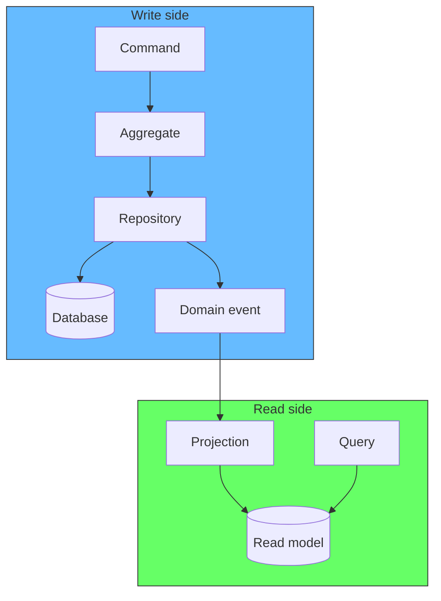

# Aggregates, Behavior, and Querying: A Concrete Example

## The example: an order system

An order has items, a status, and a total. The business rules:

- An order cannot have more than 10 items.
- An order cannot be modified after it is confirmed.
- The total is calculated from the items.

These are invariants. The aggregate enforces them.

## The aggregate

```python
class Order:
    def __init__(self, order_id: str, customer_id: str):
        self.order_id = order_id
        self.customer_id = customer_id
        self.status = "draft"
        self.items: list[OrderItem] = []
        self.total = 0.0

    def add_item(self, product_id: str, quantity: int, price: float):
        if self.status != "draft":
            raise OrderAlreadyConfirmed("cannot modify a confirmed order")
        if len(self.items) >= 10:
            raise OrderTooLarge("order cannot have more than 10 items")

        self.items.append(OrderItem(product_id, quantity, price))
        self._recalculate_total()

    def remove_item(self, product_id: str):
        if self.status != "draft":
            raise OrderAlreadyConfirmed("cannot modify a confirmed order")

        self.items = [i for i in self.items if i.product_id != product_id]
        self._recalculate_total()

    def confirm(self):
        if not self.items:
            raise OrderEmpty("cannot confirm an empty order")
        self.status = "confirmed"

    def _recalculate_total(self):
        self.total = sum(i.quantity * i.price for i in self.items)


class OrderItem:
    def __init__(self, product_id: str, quantity: int, price: float):
        self.product_id = product_id
        self.quantity = quantity
        self.price = price
```

Every method enforces a business rule. The outside code never touches `items` or `total` directly. It calls `add_item`, `remove_item`, or `confirm`.

## Writing through the aggregate

```python
# The controller or command handler
def place_order(command):
    order = Order(order_id=command.order_id, customer_id=command.customer_id)

    for item in command.items:
        order.add_item(item.product_id, item.quantity, item.price)

    order.confirm()
    order_repo.save(order)

# Adding an item to an existing order
def add_order_item(command):
    order = order_repo.find_by_id(command.order_id)
    order.add_item(command.product_id, command.quantity, command.price)
    order_repo.save(order)
```

The outside code does not know about the invariants. It does not check `if status == "draft"`. It does not recalculate the total. The aggregate does all of that.

## Querying: do not use the aggregate

Now the question: how do you display an order? Do you load the aggregate and read its fields?

No. The aggregate is shaped for writing, not reading. Loading the full aggregate to display a list of orders is wasteful. The aggregate has behavior, validation logic, and internal state that you do not need for a read.

## The read model

Create a separate model optimized for queries. A flat table, a view, or a projection.

```python
# The read model: flat, no behavior, just data
class OrderSummary:
    def __init__(self, order_id, customer_name, item_count, total, status, created_at):
        self.order_id = order_id
        self.customer_name = customer_name
        self.item_count = item_count
        self.total = total
        self.status = status
        self.created_at = created_at
```

```python
# The query handler
def get_order_summary(order_id: str) -> OrderSummary:
    return db.query_one(
        "SELECT order_id, customer_name, item_count, total, status, created_at "
        "FROM order_summaries WHERE order_id = ?",
        order_id
    )

# List orders for a customer
def list_customer_orders(customer_id: str) -> list[OrderSummary]:
    return db.query(
        "SELECT order_id, customer_name, item_count, total, status, created_at "
        "FROM order_summaries WHERE customer_id = ? ORDER BY created_at DESC",
        customer_id
    )
```

## How the read model stays in sync

When you save an aggregate, publish a domain event. A projection handler listens and updates the read model.

```python
# When the order is saved, publish an event
class OrderRepository:
    def save(self, order: Order):
        self.db.save(order)
        self.event_store.append(OrderPlaced(
            order_id=order.order_id,
            customer_id=order.customer_id,
            total=order.total,
            item_count=len(order.items),
            status=order.status
        ))

# The projection handler updates the read model
def on_order_placed(event):
    db.execute(
        "INSERT INTO order_summaries (order_id, customer_name, item_count, total, status) "
        "VALUES (?, ?, ?, ?, ?)",
        event.order_id, event.customer_name, event.item_count, event.total, event.status
    )
```

## The separation

<div style={{display: 'flex', justifyContent: 'center'}}>



</div>

| Side | Model | Purpose | Access |
|---|---|---|---|
| Write | Aggregate | Enforce invariants | Repository |
| Read | Read model | Serve queries | Direct SQL |

## Why not just use the aggregate for both?

You can. But the aggregate carries baggage. Loading an `Order` to display a list means loading all its `OrderItem` objects, running validation logic, and holding a lock. For a list of 50 orders, that is 50 aggregates with 50 sets of items.

The read model is a flat table. One SQL query returns 50 rows. No objects, no behavior, no locks.

Vernon: "A read model is not a domain model. It is a projection of the data optimized for a specific query."

## Related

- [DDD: The Complete Process Step by Step](ddd-process.md) - the full process from discovery to implementation
- [Aggregate Sizing: How Big Should an Aggregate Be?](aggregate-sizing.md) - why aggregate boundaries matter
- [Transactions Live Outside the Aggregate](transactions-outside-aggregate.md) - how writes cross aggregate boundaries
