# The AI Application Stack

## The problem: LLMs look like magic until they are not

Ask a large language model the same question twice and compare the answers. The happy path is astonishing. The model writes, summarizes, classifies, and reasons well enough that it feels like a person. The unhappy paths are everything the demo did not show.

The same prompt returns different answers on two runs. A model that is brilliant at chat fabricates confident, specific factual errors. A support agent routes an urgent complaint to the wrong team. The bill grows with every token and nobody can explain the line items. The product owner keeps asking why the numbers move between weeks, and the honest answer is that they do, because the thing you integrated is not deterministic the way an ordinary function is.

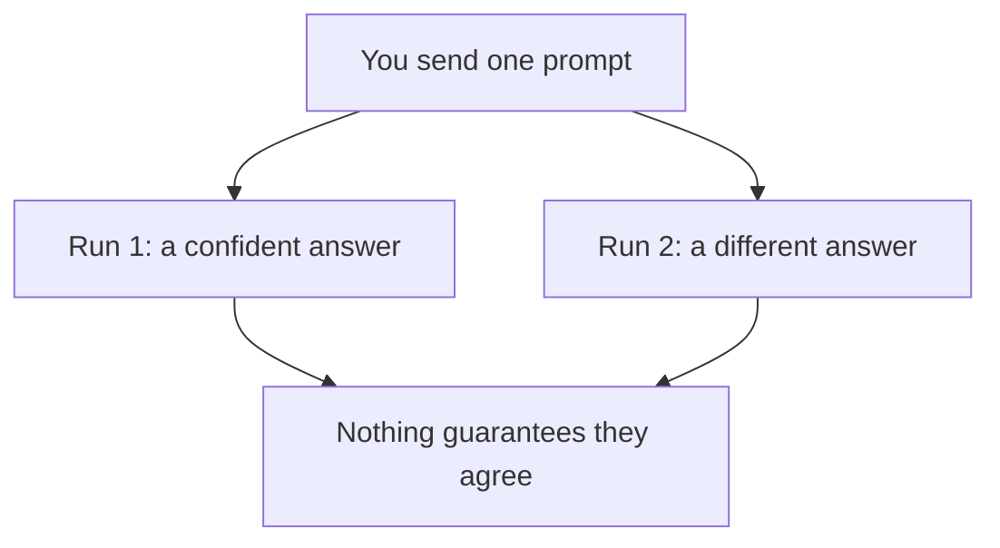

The mistake is to treat the model as the system. It is not. The model is one layer of a stack, and the engineering work lives in the layers around it: the model and its limits, the tokens and context each call costs, the knowledge you provide through retrieval, the evals that tell you what it actually does, and the workflows that decide whether it acts alone or with a human in the loop.

This article follows the same method used across the series. Read the situation, name the factor that matters, and decide. The question is never "is AI good?" The question is "what can the model do alone, and what does the system need to add around it?"

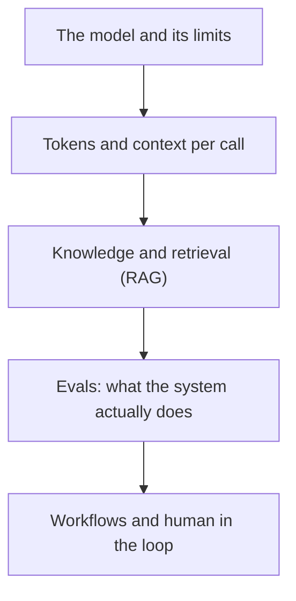

## What a language model is

A language model is software that predicts the next piece of text given the text before it. Given a sequence, it computes a probability distribution over what comes next, samples one token from that distribution, adds it to the sequence, and repeats. Generation stops when the model emits an end token or reaches the limit of the output budget.

That is the entire interface. Everything a model does, chat, classification, summarization, code generation, tool use, is an instance of next token prediction wrapped in a prompt that tells it what the task is.

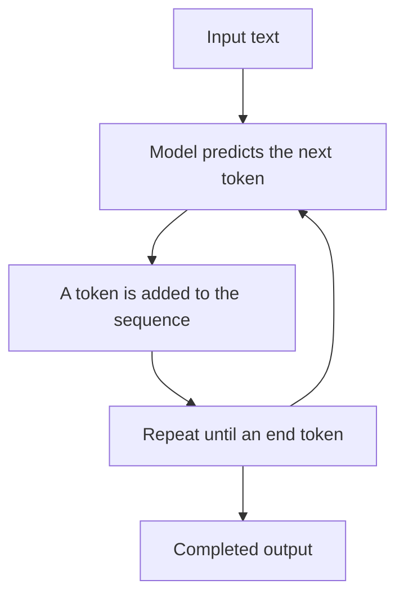

That one loop explains most of what people find surprising. There is no database lookup for the facts in the answer, so the answer is a plausible continuation, not a retrieved truth. There is no automatic second pass that checks the answer against a source, so the model cannot reliably correct itself. There is no guarantee of determinism, so the same input can produce different outputs on different runs.

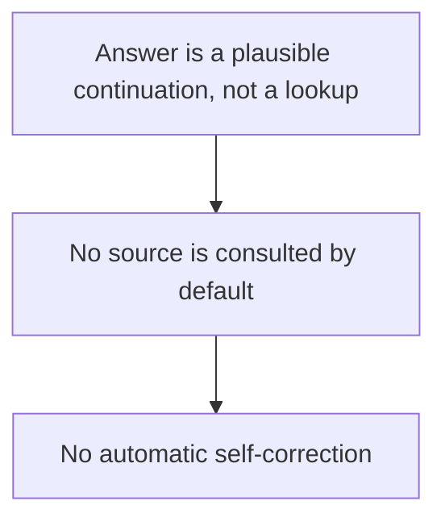

## Where they came from: the transformer

The modern stack is built on a single architecture introduced by one paper. In 2017, Vaswani, Shazeer, Parmar, Uszkoreit, Jones, Gomez, Kaiser, and Polosukhin published "Attention Is All You Need" at NeurIPS 2017. The dominant sequence models at the time, recurrent and convolutional networks in encoder decoder configurations, processed text sequentially. Each token depended on the tokens before it, which was hard to parallelize and made long distance dependencies difficult to learn.

The paper proposed the Transformer, a new architecture based solely on an attention mechanism, dropping recurrence and convolutions entirely. Attention lets every position of a sequence attend to every other position directly, so a token near the end of a long input can look straight at a token near the start without passing through every token in between. The authors report that the new setup is significantly more parallelizable and reaches state of the art in translation after training for just twelve hours on eight GPUs.

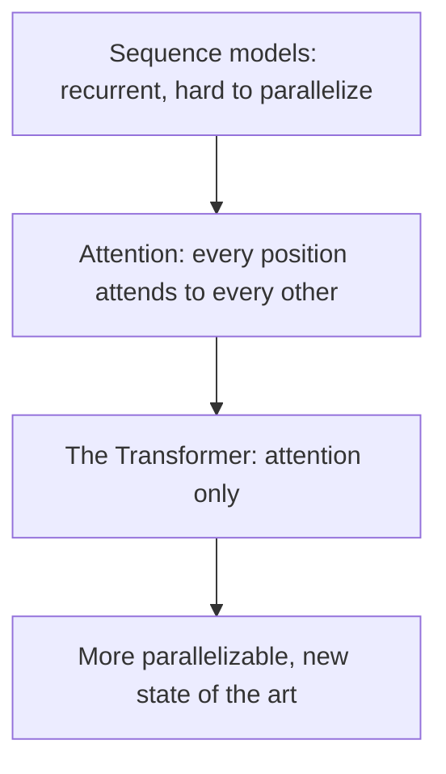

That architecture became the foundation of the major language model families that followed: GPT, BERT, and T5 are all Transformer based. When you call a hosted model today you are calling a scaled up version of the same mechanism. The scale and the provider differ, but the founding move is the same: attention instead of recurrence.

## The shape of a call: tokens, context, and the model

Every call to a model funnels through a small set of concepts. Naming them makes the rest of the stack legible.

A token is the unit the model reads. Text is split into chunks that are not exactly words. A common word can be one token, and a rare word can split into several. The model sees tokens, not characters. Whatever you send and whatever it returns is measured in tokens, and every pricing model is token based.

The context is the full set of tokens the model sees for a single call: your instructions, the conversation history, the documents you include, and the beginning of what it writes. The context window is the maximum size of that set. The model can only reason over what fits in the window, and when the window fills, something has to be dropped.

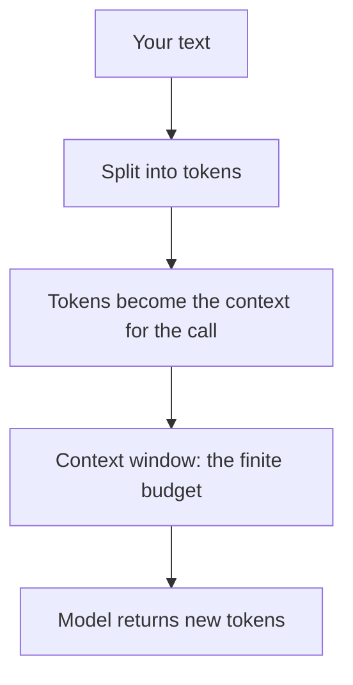

Two decisions in this section dominate the rest of the stack. The first is how many tokens you put into the context, because that sets the cost and the latency of every call. Fewer tokens means cheaper, faster calls. The second is what knowledge is available inside that context, because the model only reasons over what it can see in the window. When the right answer depends on information that is not in the window, the model will either invent it or admit it cannot know, and neither is a good default.

## RAG: grounding the model on your knowledge

The model's parameters are fixed after training. The model learns general language, but from training data alone it cannot know your product, your internal documentation, your current inventory, or the contents of your database, unless you put that information into the context of each call.

The name for that is retrieval augmented generation, RAG, introduced by Lewis et al. in their 2020 paper "Retrieval-Augmented Generation for Knowledge-Intensive NLP Tasks". The paper's starting point is that purely parametric models can store a lot of factual knowledge in their weights, but accessing that knowledge precisely is hard, and it is frozen at deployment time. Their proposal pairs the model with a non parametric memory: a retriever pulls documents related to the question, and the generator uses those documents as extra context. The answer, then, is written from a source it can point at, instead of being invented from the weights alone.

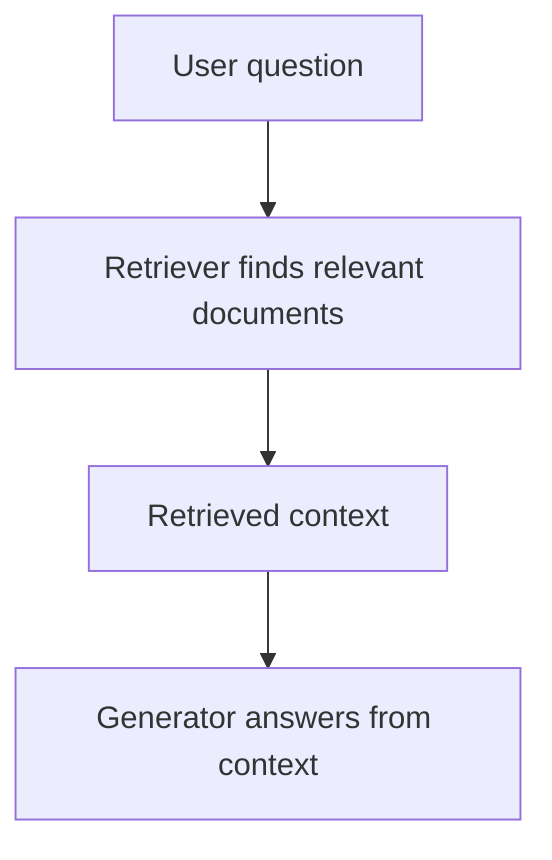

The practical shape is simple. You index the corpus your model should know, such as documentation, policies, or tickets. When a question arrives, the retriever finds the passages most relevant to it, and those passages are appended to the prompt as context. The model then composes an answer from that context.

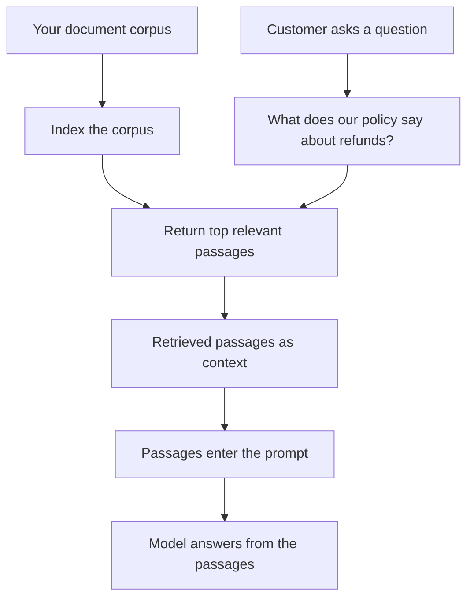

RAG is valuable for two reasons. First, it brings knowledge into the system without a training run, so the corpus can change without retraining the model. Second, it makes answers verifiable, because the output can cite the passages it was built from. It is not a silver bullet: retrieval is only as good as the corpus, the ranking, and the way the context is assembled. But it is the first place to look when the model must speak about knowledge it was not trained on, and OpenAI lists it as a first class accuracy lever: use retrieval-augmented generation to optimize for accuracy.

## Quality is not given, it has to be measured

Ordinary QA does not transfer to a language model. Unit tests assert that a function returns a specific value. A model has no fixed return value. The output is sampled, so the same input can produce different outputs. A single passing demo run tells you almost nothing about production behavior.

Orosz and Hamel devote a full Pragmatic Engineer guide to this gap. Their point: LLMs are non-deterministic, you cannot assume the model gives the same answer to the same question twice, and evals, tests written to judge behavior instead of equality, are becoming a core part of the AI engineer's toolset and CI/CD.

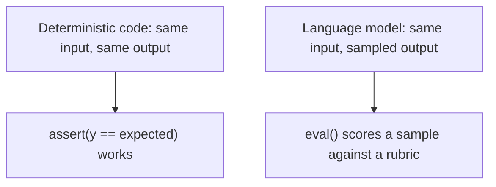

An eval is a test where the assertion is scored instead of compared. It runs a representative set of inputs through the system, then a judge decides how good each output is: does it answer the question, is it grounded in the source, does it follow the rules. The judge can be a rubric, code, a second model, or a person. Each has a place, and none is complete on its own.

When do you need evals? Before you ship a behavior that depends on a model, and again every time the prompt or the model changes. Because model behavior is a distribution, a regression is rarely one failing test. It is a distribution shift across a dataset, and you can only see it if you sample that dataset. Anthropic puts the point directly: teams without evals get stuck in reactive loops, fixing one failure, creating another, and unable to tell a real regression from noise.

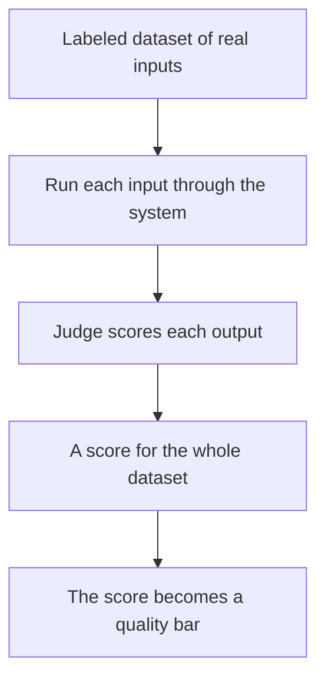

The larger point is architectural. Evals are not a testing footnote. They are the unit tests of a non-deterministic system, and they belong in the same loop: run them on every prompt or model change, keep the dataset as a living asset, and gate releases on the result.

## Model selection: do not pay for more model than the task

The biggest model dominates the headlines, but the engineering answer is not "biggest is best". It is "smallest that still does the job". OpenAI's model selection guide frames it as a sequence of two optimization phases: first optimize for accuracy until you hit your target, and only then optimize for cost and latency while keeping the accuracy. Accuracy comes first, because if the model cannot meet the bar, cheap and fast mean nothing. Once a model works, you aim to hold the accuracy bar with the smallest and cheapest model that still clears it.

The analogy is choosing a mobile plan. You do not buy the unlimited premium plan if your usage is light and you only need calls and messages. The same is true of models. The frontier flagship is the premium plan: it can do nearly everything, but most workflows use only a fraction of what it offers. Paying flagship prices to classify a short text is overpaying.

The filter that decides whether a smaller model is enough is the same eval dataset you already build. If a smaller model hits the accuracy target when run through the same eval, deploy it. If not, you have two options: give the model several examples of the task in the prompt, or distill, meaning you fine-tune a smaller model from the outputs of the larger one.

OpenAI's guide gives a worked example that makes the material concrete. A fake news classifier was tuned to a 90% accuracy target:

| Method | Accuracy | Cost per article |
|---|---|---|
| Large model, zero-shot | 84.5% | $1.72 |
| Large model, few-shot | 91.5% | $11.92 |
| Small model, fine-tuned | 91.5% | $0.21 |

The fine-tuned small model hit the same accuracy at under 2% of the cost of the few-shot run. This is the entire point of the "accuracy first" workflow: the large model does the exploration, its outputs become the training data, and a small model takes over the same task for a fraction of the cost.

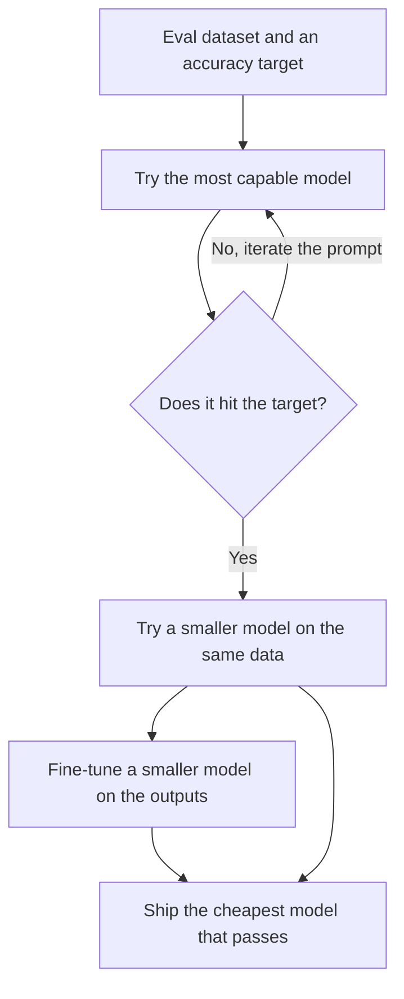

## Workflows, patterns, and agents

A product does not run on a single call. Most useful behavior is a sequence: look something up, reason, act, use a tool, keep going. The question that defines the architecture is how much of that sequence is written in advance and how much is left to the model.

Anthropic's "Building Effective Agents" draws the line clearly. A workflow is a system where models and tools are wired together on a predefined code path. An agent is a system where the model directs its own process, deciding which step to take and which tools to call as it goes. The difference is practical: a workflow is deterministic in its shape, an agent is open ended in its shape.

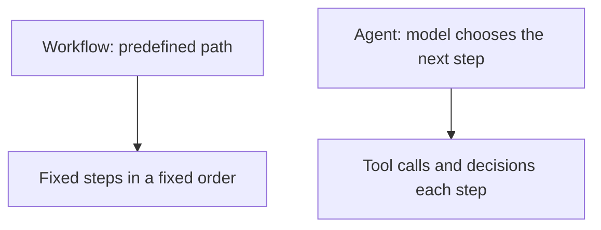

Anthropic has a clear warning about overbuilding. Their experience is that the most reliable agents are built with simple, composable patterns: retry loops, tool use, and prompt chains, not heavy frameworks. Simple patterns are easier to test and cheaper to run. Start with the simplest thing that works, and only grow complexity when the task demands it. A workflow with a fixed path is the default; an agent is justified only when the route through the task is unknown in advance, and each step depends on the result of the previous one.

## The human in the loop

The model can fail, and it will at least occasionally. So a production system needs an answer for those failures. The answer has two moving parts: keep the loop automated where it is cheap and safe, and keep a person where a wrong output is expensive. The engineering discipline is to decide consciously where that line is.

Human in the loop (HITL) therefore means: the model does the draft, and a person reviews or approves the output before it reaches a user or an effect. The loop is worth the cost when a mistake is expensive: a medical note, a refund decision, an email sent to a customer, a public facing answer about company facts. Fully automated is fast but may not be trustworthy yet. Fully manual does not scale.

Even the automated quality process needs a human layer. Anthropic's guidance is specific. Any model grading done by an LLM judge must be calibrated against human gradings before you trust it. Build a small set of outputs that humans grade. Compare the automated scores to the human ones. If they diverge, fix the rubric or adjust the judge. Only when the divergence is small enough do you let the automated grader run at high volume. Anthropic describes the healthy end state: the most effective teams combine automated evals for fast iteration, production monitoring for ground truth, and periodic human review for calibration.

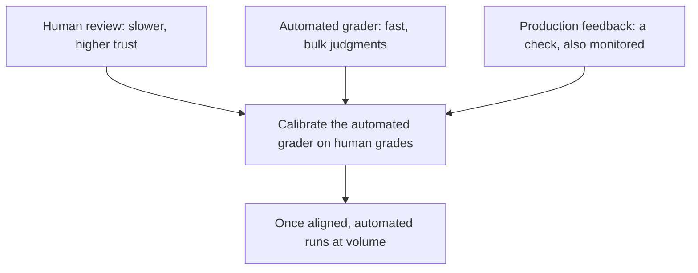

The mental model is simple: the automation runs as far as it can, and a person watches the highest consequence step. The loop gets as far as it is safe, and a person sits at the step where being wrong costs too much.

## When to do what: the decision table

| Situation | What to do | Why |
|---|---|---|
| A single answer, no domain knowledge needed | Call the model directly | Fewer moving parts than the full stack |
| The model must know your internal data | Add RAG: retrieve and include the relevant documents | Grounds the answer in a verifiable source |
| Same input must behave predictably | Build an eval suite and a quality gate | Output is a distribution, so judge by sample |
| Answers are good but the bill is too high | Try a smaller model, then fine-tuning (distillation) | Accuracy first, cost and latency second |
| A product with several steps | Start with a workflow, not an agent | Agents cost more and are harder to debug |
| A wrong output is expensive | Put a person in the loop at that step | Human review is ground truth for the edge |
| Output is subjective, tone or brand matter | Calibrate an automated judge with human grading | Trust the grader before you scale it |

## The recipe

The stack, in the order you work through it for a typical LLM application:

1. Define the accuracy target that is "good enough" for production, on real data.
2. Build an eval dataset of labeled inputs that lets the system measure itself against that target. This dataset is the asset everything else depends on.
3. Start with the most capable model you have access to, and log its responses. Those logs become training and example material.
4. Add RAG when the task depends on knowledge outside the model's training data, and build the eval again.
5. Reduce. Evaluate a smaller model. If that is not enough, use few-shot examples or fine-tune (distill) the smaller model against the larger model's outputs.
6. Prefer workflows over agents. Let the model direct the steps only when the path is genuinely open ended.
7. Put a person on the steps the model must not get wrong, and calibrate every automated judge against human grades before release.

The model is one component in the stack. The power is in the layers, retrieval that grounds the context, evals that make the non-determinism visible, model selection that stops you overpaying, and people who sit at the point where failure is too expensive to leave to chance.

## References

- Vaswani, A., Shazeer, N., Parmar, N., Uszkoreit, J., Jones, L., Gomez, A. N., Kaiser, L., Polosukhin, I. (2017). *Attention Is All You Need*. NeurIPS 2017. arXiv:1706.03762. https://arxiv.org/abs/1706.03762. Introduces the Transformer and replaces recurrence with attention; the basis of modern language models.
- Lewis, P., Perez, E., Piktus, A., Petroni, F., Karpukhin, V., Goyal, N., Kuttler, H., Lewis, M., Yih, W., Rocktschel, T., Riedel, S., Kiela, D. (2020). *Retrieval-Augmented Generation for Knowledge-Intensive NLP Tasks*. arXiv:2005.11401. https://arxiv.org/abs/2005.11401. Introduces RAG, pairing parametric generation with retrieved documents.
- Anthropic. (2024). *Building Effective Agents*. Dec 19, 2024. https://www.anthropic.com/engineering/building-effective-agents. Workflows versus agents, and why simple composable patterns beat big frameworks.
- Orosz, G., Husain, H. (2025). *A pragmatic guide to LLM evals for developers*. The Pragmatic Engineer, Dec 2025. https://newsletter.pragmaticengineer.com/p/evals. LLMs are non-deterministic, so evals belong in CI and the core AI engineering toolset.
- Anthropic. (2026). *Demystifying evals for AI agents*. Jan 9, 2026. https://www.anthropic.com/engineering/demystifying-evals-for-ai-agents. Automated and human eval combined: calibrate LLM as judge against human grading.
- OpenAI. (2026). *Model selection*. OpenAI API Docs. https://developers.openai.com/api/docs/guides/model-selection. Accuracy first, then cost and latency; smaller models, distillation, and the classifier cost example.
- OpenAI. (2024). *Model Distillation in the API*. Oct 1, 2024. https://openai.com/index/api-model-distillation/. Fine tuning a smaller, cheaper model on the outputs of a frontier model.