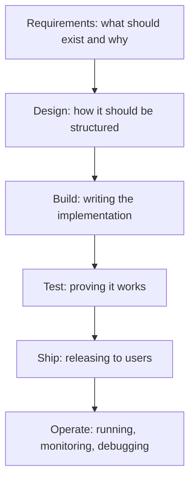
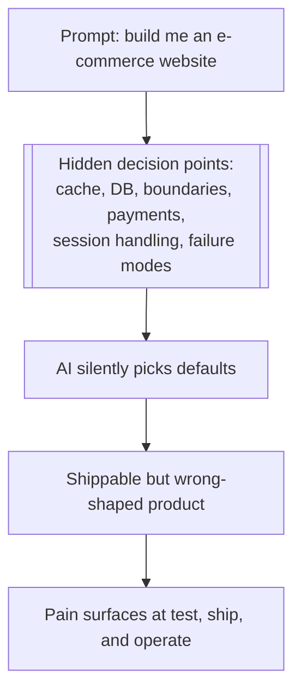
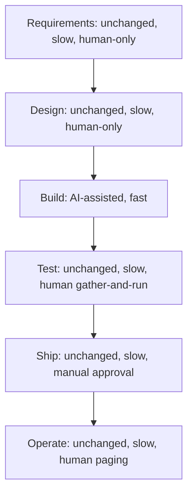
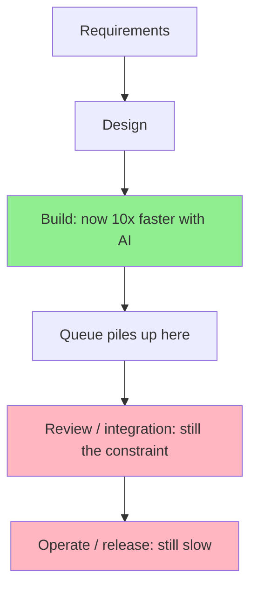
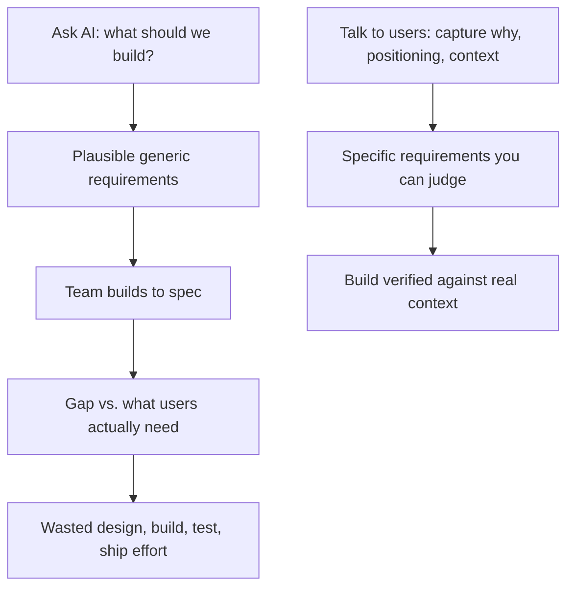
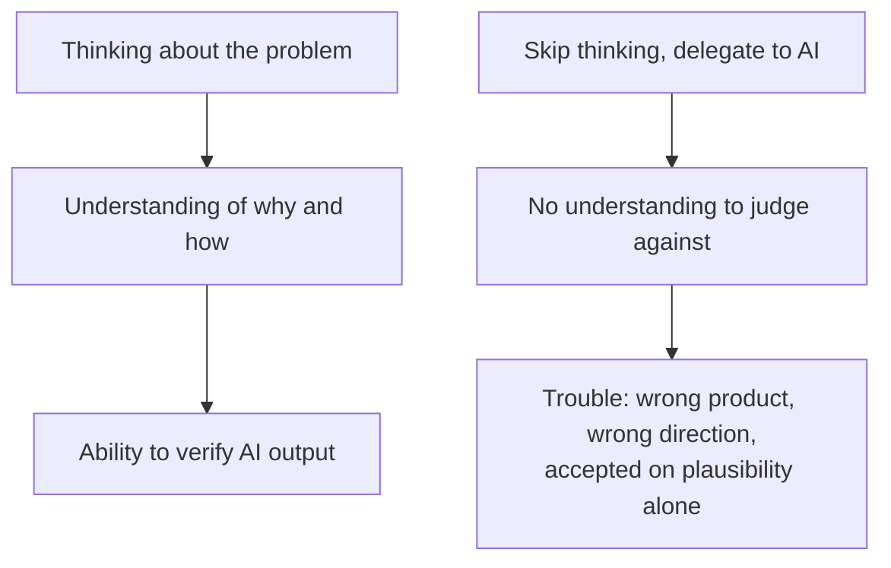
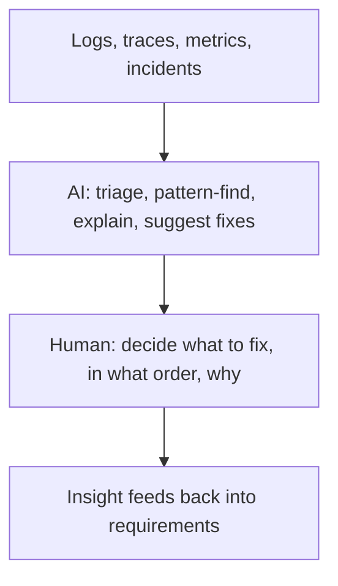

# AI in the Software Development Lifecycle

The software development lifecycle (SDLC) is a chain: **requirements, design, build, test, ship, operate**. Most teams adopt AI at exactly one link in that chain - the build phase - and then wonder why the overall project does not get faster, or why the thing they shipped is not what their users needed.

This article walks through the classic SDLC, then explains where delegating to AI helps, where it hurts, and why the two most common mistakes are the two extreme ends of delegation: asking AI to do *too much* and asking it to do *too little*.

## The classic lifecycle

Before AI, the value chain looked like this:

Each phase consumes the output of the one before it. The chain is only as fast as its slowest link, and the value is only as good as the weakest link's output. Keeping that mental model in your head is the key to using AI well; the AI mistakes below are all failures to respect the shape of this chain.

AI can be applied at every one of these phases, to different degrees of usefulness:

| Phase | What AI contributes | Human work needed around it |
|-------|---------------------|-----------------------------|
| Requirements | Drafting, summarising, organising | Defining the "why", talking to users, judgment |
| Design | Exploring options, generating diagrams, reviewing trade-offs | Choosing the direction, owning the trade-offs |
| Build | Generating code, boilerplate, refactoring, tests | Reviewing, verifying, reasoning about integration |
| Test | Generating test cases, analysis of failures | Deciding what correctness means, accepting risks |
| Ship | Release notes, rollback analysis, CI debugging | Approval, accountability, compliance |
| Operate | Log analysis, incident triage, monitoring insights | Making the call, deciding what to fix now |

None of this is automatic. The value you get from AI at a phase depends on how much *context and direction* you feed it - and that context has to come from somewhere. Which brings us to the first mistake.

## Over-delegation: the "build me an e-commerce website" trap

A common first interaction with AI in the SDLC is to hand it an entire project at once: "create an e-commerce website." The result looks impressive and works - narrowly. But the request delegates far more than the code. It delegates the *decisions*.

An e-commerce site requires dozens of genuine decision points: which caching strategy, where boundaries live between contexts, which database, how payments and inventory are modelled, what happens under a spike, how refunds behave. Two people giving the same prompt to the same AI get two different - and both **not-wrong** - sets of answers. They are not the answers *you* wanted, because you never stated them.

This is the defining failure mode of "vibe coding" a whole business feature. Thoughtbot's analysis of an AI-generated professional services website is a concrete example: the site scored 2.7/10 on accessibility, with more than fifty low-contrast issues, invisible to the person who accepted the output but illegal in several jurisdictions when shipped (see Sources). The decisions about accessibility, semantics, and labels were delegated to the tool, and the tool optimised for "looks like a website" rather than "meets the requirements" - because there *were* no requirements beyond the prompt.

The fix is to break the chain back down. **Delegate the build phase, keep the requirements and design phases.** You decide what the e-commerce site must do, who it is for, which decisions are non-negotiable, and how failure should behave. Then AI fills in the implementation - and you verify.

## Under-delegation: AI only in the build phase

The opposite extreme is equally common. A team keeps requirements, design, testing, and operations fully manual, and asks AI to do nothing but write code faster in the middle of the chain. It gets real productivity in that one phase - an experienced developer who catches AI's mistakes can churn through tickets quickly.

The narrow view is that the build phase is where AI adds value, and everything else stays the same.

The mistake here is the same shape as over-delegation, mirrored. You made one link dramatically faster, so work piles up at the next link - which is now relatively slower. The bottleneck never moved; you just made it more visible. Meanwhile the phases where AI genuinely struggles and where you should not delegate (requirement decisions, design judgment) are left untouched, and the phases where AI is excellent and low-risk (log analysis, test generation, summarisation) are also left untouched.

The right response is not to undo the faster build phase. It is to recognise that the chain's throughput is set by its constraint (the next section), and to apply AI where it unblocks the chain rather than where it is already comfortable.

## The constraint: faster build gets absorbed by slower phases

The Theory of Constraints, popularised in software by *The Phoenix Project*, says a system's throughput is limited by exactly one constraint at a time. Every resource that is not the constraint has surplus capacity, so speeding it up does not make the system faster - it just piles work in front of the actual bottleneck. Goldratt's formulation, quoted in *The Phoenix Project*: **"Any improvement not made at the constraint is an illusion."**

DORA's 2024 research reached the same conclusion about AI specifically: organisations that invested in AI coding tools without first addressing their existing constraints found that the generated code "piled up in the same constrained review and integration stages, making lead times longer, not shorter" (see Sources).

If the real constraint is the manual review queue, or a release process that only runs on Fridays, or requirements that take three months, then a 10x faster build phase produces nothing but a longer queue. Teams feel busy. The system does not get faster.

The solution is to find the constraint first, then apply AI *there*. If design is the constraint (a single architect reviewing every change), AI can summarise diffs and surface candidate issues to compress that review cost. If test is the constraint, AI can generate suites and analyse failures. If operate is the constraint, AI can triage logs and incidents fast (more below). Delegating to the build phase because it is easiest is exactly backwards; delegate to the phase that is slowest, because that is where AI buys the most system throughput.

## AI in requirements is dangerous: it has no user context

The most dangerous phase to delegate is the first one. Requirements are the definition of *why* the software exists at all, and that "why" does not live in training data. It lives in user conversations, in market realities, in constraints and positioning that nobody has ever written down - which means the model has never seen it.

Steve Blank's "get out of the building" argument from customer development applies directly. Requirements from AI are a feature list produced without contact with a single user. Blank's own cautionary tale is the MIPS microprocessor, where the founders outsourced a decision to a marketer instead of testing their own hypothesis, and the wrong choice stayed in the chip for 25 years.

The fundamental property: an AI asked to write requirements will generate *plausible* requirements. They look like real requirements. They are grounded in no user, no business, and no context. That is not the error - the error is believing them, because verification is impossible without the context you skipped gathering.

The fix is not to remove AI from requirements; it is to stop *starting* there. Use AI to organise, summarise, stress-test, and challenge the requirements you gathered from humans. Keep the user conversation as the source. Talking to users is the only thing that gives you the "why" - positioning, unstated constraints, the reasons behind the ask - that the model never had.

## Do not offload thinking: thinking becomes understanding

There is a deeper reason the requirements and design phases cannot be delegated: **you build understanding by thinking through a problem, and that understanding is what lets you verify anything afterward.** This connects to the core tension in Software 3.0: "you can outsource your thinking, but you cannot outsource your understanding."

If you skip the thinking phase in requirements, you never develop the understanding of why the product is shaped the way it is. Then every later decision - design trade-offs, which build output to accept, what a bug means - has to be made without that context. You cannot reliably verify AI output you do not understand.

This is why the division from *Human Judgment & Verification* holds: humans own thinking, judgment, and context; AI owns execution. Offloading thinking to AI in a phase that shapes everything downstream is not efficiency, it is surrendering the only tool you have for telling good output from plausible output.

## Where AI genuinely helps early and often: operations and insights

The opposite of "building requirements from nothing" is using AI where there is already rich, concrete context: the operation phase. Logs, traces, metrics, incident history, and error rates are structured, plentiful, and precise. AI is excellent at summarising them, finding patterns, hypothesising root causes, and surfacing insights - and the output can be verified against the live system.

Crucially, this is a *secondary* source of requirements, not the primary one. Observing what breaks in production tells you what your current system got wrong, which is useful - but it cannot tell you what users hoped for, what they will pay for, or what direction you should take. It complements the "why" from user conversations; it does not replace it.

## Summary

The classic SDLC is a chain, and AI is a tool to apply per-link, not all-at-once and not at one link only.

| Pitfall | Symptom | Fix |
|---------|---------|-----|
| Over-delegation | "Build me an e-commerce site" ships wrong-shaped software | Keep requirements and design human; delegate build |
| Under-delegation | AI only writes code faster, everything else unchanged | Apply AI across the chain |
| Ignoring the constraint | 10x faster build, longer lead times | Find the bottleneck, delegate AI there |
| AI-written requirements | Plausible specs with no user context | Gather context from users first |
| Offloading thinking | Can't verify what you accept | Keep ownership of the "why" |
| Treating ops as the only source | Builds a better version of what's already wrong | Pair ops insights with user conversations |

Delegating completely is how you build the wrong thing confidently. Delegating narrowly is how you keep a slow chain with one fast link. The right pattern is the middle: **humans own the "why" (requirements) and the judgment (design, verification); AI executes, and AI gets pointed at the constraint.**

## Sources

- thoughtbot. *[Your vibe coded website is going to get you fined](https://thoughtbot.com/blog/your-vibe-coded-website-is-going-to-get-you-fined)*, July 2026. Accessibility findings from a vibe-coded site redesign; legal exposure from delegated decisions.
- Alexander Hagemann. *[Applying the Theory of Constraints to Software Engineering](https://alex.rocks/post/theory-of-constraints-in-software-engineering/)*, 2025. ToC applied to software, lessons from *The Phoenix Project*, "improvement not at the constraint is an illusion."
- DORA, *State of DevOps Report 2024*. AI tools amplifying existing constraints in constrained review/integration stages, increasing lead times.
- Steve Blank. *[Customer Development is Not a Focus Group](https://steveblank.com/2009/11/30/customer-development-is-not-a-focus-group/)*, 2009. Feature lists from customers are not customer development; the "why" comes from outside the building.
- Knowledge base. *[Software 3.0: Vibe Coding, Verification & Understanding](../artificial-intelligence/software-3-0.md)*. Karpathy's thinking vs understanding, "you can outsource your thinking, but not your understanding."
- Knowledge base. *[Human Judgment & Verification](../artificial-intelligence/human-judgment-and-verification.md)*. Every task splits into thinking (human) and grunt work (AI); humans verify.
- Knowledge base. *[Architecture by Neglect](architecture-by-neglect.md)*. Locally-optimal decisions with no architectural thought produce a globally incoherent system; decisions must be made, not defaulted.