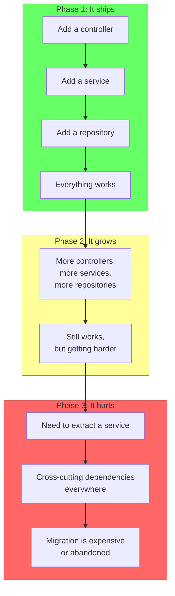
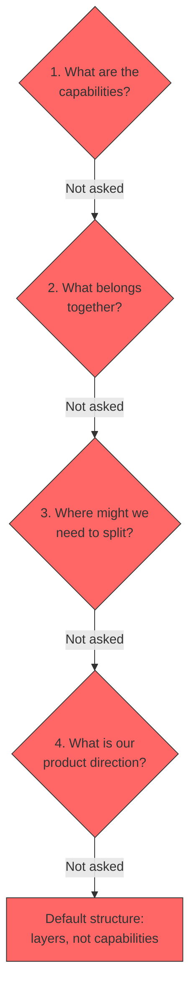
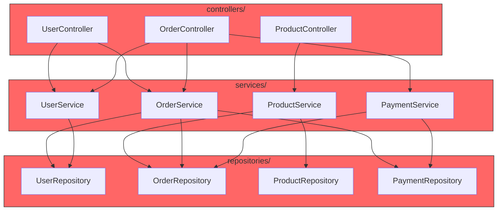
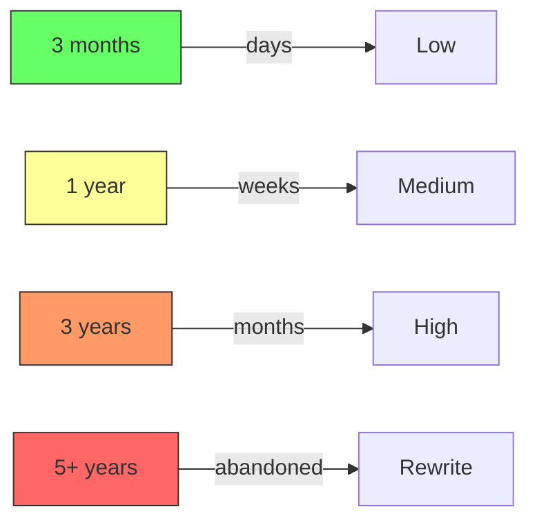
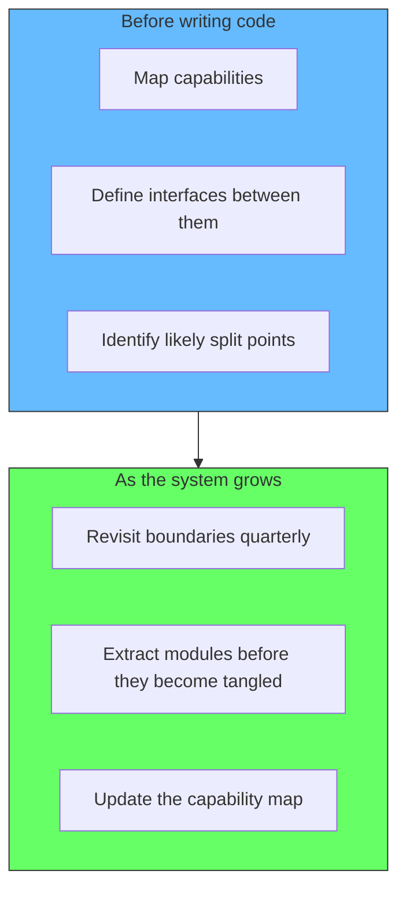

# Architecture by Neglect

Most messy codebases are not the result of bad architectural decisions. They are the result of **no architectural decisions**.

Teams jump into implementation without thinking about boundaries. They start with a few controllers, a few services, a few repositories. The structure follows the technology -- all controllers together, all services together, all repositories together. It works. It ships. Nobody asks what comes next.



The pain arrives the moment someone asks: "Can we deploy this piece independently?" Or "Can we scale this part separately?" Or "Can we give this domain to a different team?" The answer, discovered too late, is: the code was never structured for that.

## The root cause: no direction

Architecture does not emerge from code. It emerges from understanding what the system needs to do and what it might need to do later. Teams skip this step not because they are lazy, but because they do not know they need it.

```
The conversation that never happens:

"Why are we grouping controllers together?"
 -- "Because that's where controllers go."
"Where would we draw the line if we had to split this into services?"
 -- "We haven't thought about it."
"What are the capabilities of this system?"
 -- "We haven't mapped them."
"Which parts might need to scale independently?"
 -- "We don't know."
```

Every one of these unanswered questions becomes a future cost. The code was structured by default -- by technology, by convention, by what the framework generates. Not by design.

## What nobody thinks about

There are four questions teams almost never ask at the start, and each one compounds the cost of the next:



### 1. What are the capabilities?

Grouping by layer feels natural because it maps to the technology stack. But the system does not serve a technology stack -- it serves business outcomes.

The question "what are the capabilities of this system?" forces a shift from technology-thinking to domain-thinking. Without it, the folder structure mirrors the ORM, the HTTP framework, and the database schema -- not the business.

### 2. What belongs together?

Even within a capability, what goes in and what stays out? An order repository belongs with the order capability, not with every other repository in the system. A payment adapter belongs with the payment capability, not in a generic "integrations" folder.

This question is answered by looking at **change reasons**. If two files change for the same reason (an update to the checkout flow), they belong together. If they change for different reasons (adding a database column vs adding a new endpoint), they do not.

[Cohesion: Capability vs Layer](/docs/software-engineering/cohesion-capability-vs-layer) covers this in depth. The deeper problem is that teams reach for architecture patterns before understanding the domain — see [Architecture is Not the Starting Point](/docs/software-engineering/architecture-is-not-the-starting-point).

### 3. Where might we need to split?

The hardest refactoring is the one nobody anticipated. When a monolith grows without internal boundaries, every extraction requires untangling a web of implicit dependencies.

The question is not "will we split?" It is "where would we split if we had to?" Answering this upfront creates natural seams. Modules that would become services are already organized as units. The database schema already has logical boundaries. The deployment pipeline already knows which parts could be independent.

### 4. What is our product direction?

This is the deepest question. A team that does not know where the product is headed cannot make architectural tradeoffs. Every feature looks equally important, every module is equally likely to scale, every boundary is provisional.

A product direction does not need to be a detailed roadmap. It needs to be enough to answer: "Will orders always be part of the same deployable unit as payments?" or "Will search ever need its own scaling profile?" Without that context, every decision is a guess.

## The result: a tangled dependency graph

When none of these questions are asked, the system defaults to the path of least resistance -- layer grouping. The result is not a monolith. It is a ball of mud with the polite label of "monolith."



Every service calls repositories from other domains. Every controller reaches across multiple services. The layers are tidy. The dependencies are not. When someone eventually asks to split this into independently deployable services, extracting a clean module from this graph requires weeks or months of refactoring.

## How expensive is fixing this?

The cost of extracting a service from a layer-grouped codebase grows exponentially with time.

| Codebase age | Effort to extract one service |
|---|---|
| 3 months | Days -- boundaries are still visible |
| 1 year | Weeks -- dependencies have cross-pollinated |
| 3 years | Months -- no clear seams, rewrites considered |
| 5+ years | Abandoned -- cost exceeds perceived benefit |



The teams that say "we will fix the architecture later" are making a bet. The bet is that the system will stabilize before the cost of restructuring exceeds the value. It rarely does. Systems do not stabilize -- they grow.

## The fix is not technical

The fix is not a better framework, a new database, or migrating to microservices. The fix is **thinking about architecture as a design problem, not an implementation detail**.

This means:

1. Before writing code, draw the capabilities. What does this system do? Where are the boundaries?
2. Ask the hypothetical split question. If we had to extract one part into its own service, would that be easy or hard? If hard, what would need to change?
3. Group by change reason, not by technology. Two files that change together belong together, even if one is a controller and the other is a repository.
4. Know the product direction enough to know which boundaries are stable and which are provisional.



## Summary

Architecture by neglect is the most common anti-pattern in software. It is not caused by bad choices. It is caused by not making choices at all. The code follows the default structure -- layers -- and the default structure guarantees that any future split will be difficult and expensive.

The cost of thinking about architecture upfront is small. The cost of not thinking about it compounds every day the system grows.
