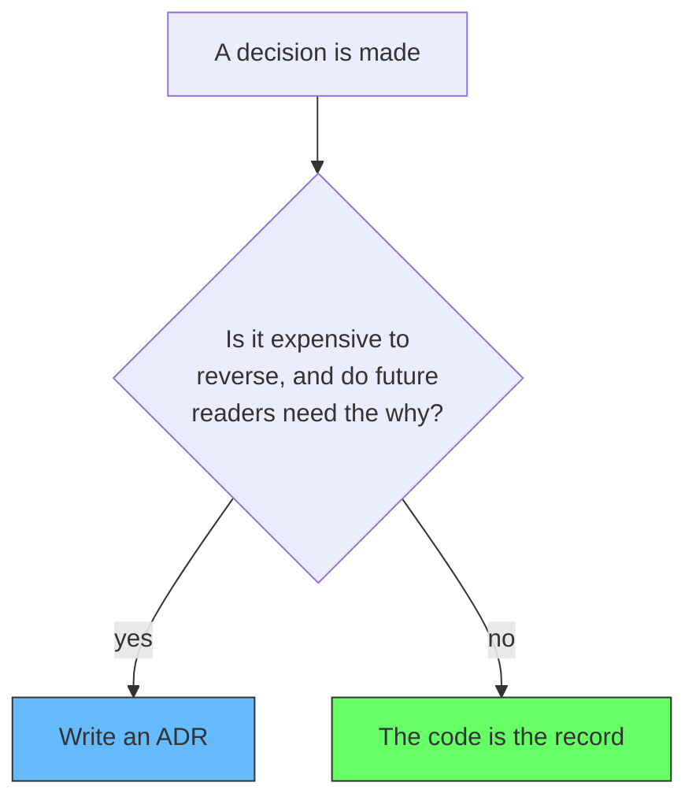
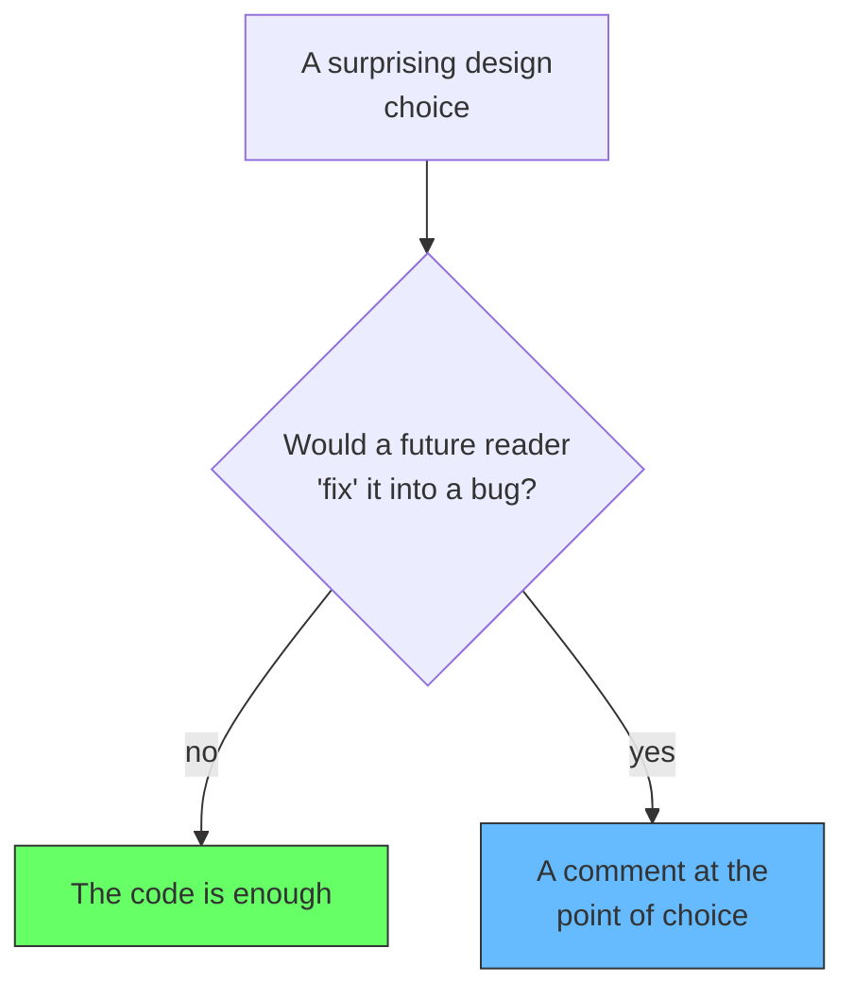

# Why Architecture Decisions Get Records but Design Decisions Don't

Some software decisions get a record: a file in a `decisions/` or `adr/` folder with context, a decision, and consequences. Others get nothing written down. The reasoning lives in the code that resulted, and the code is the record. It is worth being explicit about why the difference is not arbitrary.

Most teams know the formal half. It is called an **Architecture Decision Record (ADR)**. The name is a useful pointer and also a trap. It suggests that the thing needing a record is "architecture," and by implication that everything else does not. That is the wrong division. What deserves a record is not the label of the decision. It is how expensive the decision is to reverse, and how much a future engineer needs to know why it exists.

## Where ADRs came from

Michael Nygard introduced the ADR in 2011. His framing matters, because he did not say "record your architecture." He said to record **architecturally significant** decisions: decisions that affect the structure, the non-functional characteristics, the dependencies, the interfaces, or the construction techniques of a system. These are exactly the decisions that outlive the people who made them and cannot be reconstructed from the code alone.

That is the test, and it is broader and clearer than the word "architecture." Martin Fowler, who wrote about the form later, says the same: an ADR captures the decision, the context, and the consequences, precisely so that people months or years later understand why the system is the way it is. The deciding trait is significance, not the folder the decision lives in.

## Architecture decisions are the ones you cannot reverse

An architecture decision tends to be expensive to reverse, and the price goes up as the team grows. Choosing a service boundary, a message broker, an ownership model, an interface contract: reversing it means touching many files, many teams, possibly migrating data. It is a nearly one-way door.

Because it is costly to reverse, the future engineers who inherit it want to know why it exists. And the code alone cannot tell them. Code can show that a line was chosen; it cannot show what it was chosen *instead of*, or which tradeoff was being avoided. That reasoning evaporates when the decision-maker leaves. The ADR exists to keep it.

## Design decisions are cheap to fix

Design decisions sit on the other side. A design decision is how a unit is built on the inside: how a class is split, how a function is named, how a small piece of data flows, which local pattern is used. These are local and cheap to reverse. If a future engineer finds a name confusing, they rename it. They refactor the class. There is no migration, no cross-team meeting, no data to move. The cost of changing it is the cost of the change itself.

So a design decision does not need an ADR, and writing one would waste time. The code it produced is a complete record of the decision. A future reader sees the structure and the naming, and if it bothers them they change it and see immediately whether it still works. They do not need a document about the reasoning, because the reasoning is re-derivable in minutes from a few lines of code.

## The gray zone: an expensive "design" decision

The line between the two is not the name. It is the reversibility. A choice that is called a design choice but is expensive to reverse is really an architecture decision, regardless of the label: adopting a library, settling a data model, defining an interface contract, choosing a message format. These are cheap-sounding and hard to reverse, and the reasoning vanishes from the code. They deserve a record.

## The rule

The test, stated plainly: a decision is recorded when it is expensive to reverse and the why is lost in the code. If a developer in six months, on the same part of the system, could reconstruct the decision from the code alone, no record is needed. If they could not, the record prevents the decision from being re-litigated and the reasoning from being lost.

## Non-obvious design decisions get a comment, not a file

There is one kind of design decision that does get written down, and the form tells you the difference. If a design choice looks wrong, and a future developer would "fix" it into a bug, the reason belongs in a comment at the point of choice. The comment lives next to the code. It is not an ADR in a folder, it is a line of explanation attached to the thing it explains.

## Summary

The difference between an architecture decision and a design decision is not the label. It is the cost of reversal and whether a future engineer needs to know why. Decisions that are expensive to reverse, and whose reasoning the code hides, require an ADR. Decisions that are cheap to reverse, and that the code expresses, do not. There the code is the record, and a comment is the most that is ever needed.

A decision that is called a design decision but is hard to reverse is really an architecture decision, and should be recorded. A decision that is genuinely local is served better by the code than by a file in a folder.