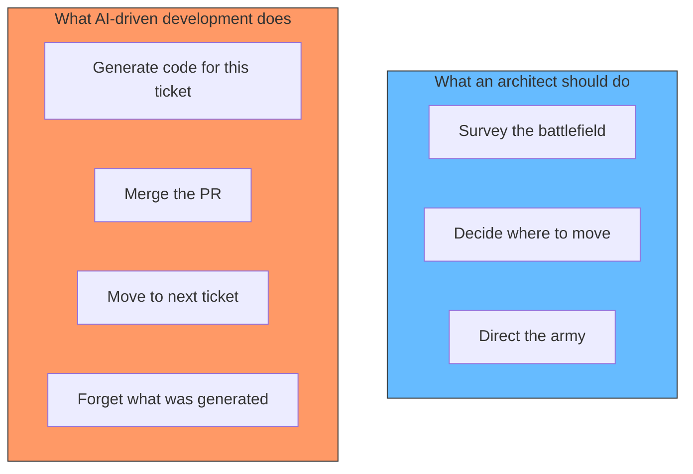
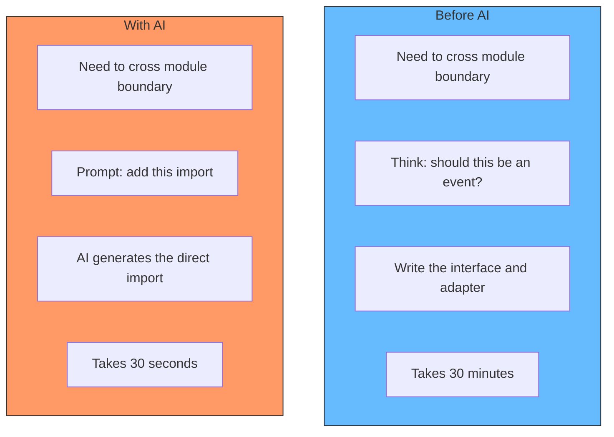
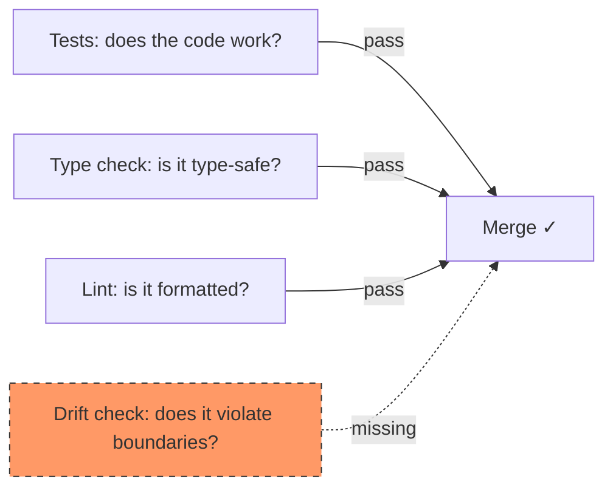
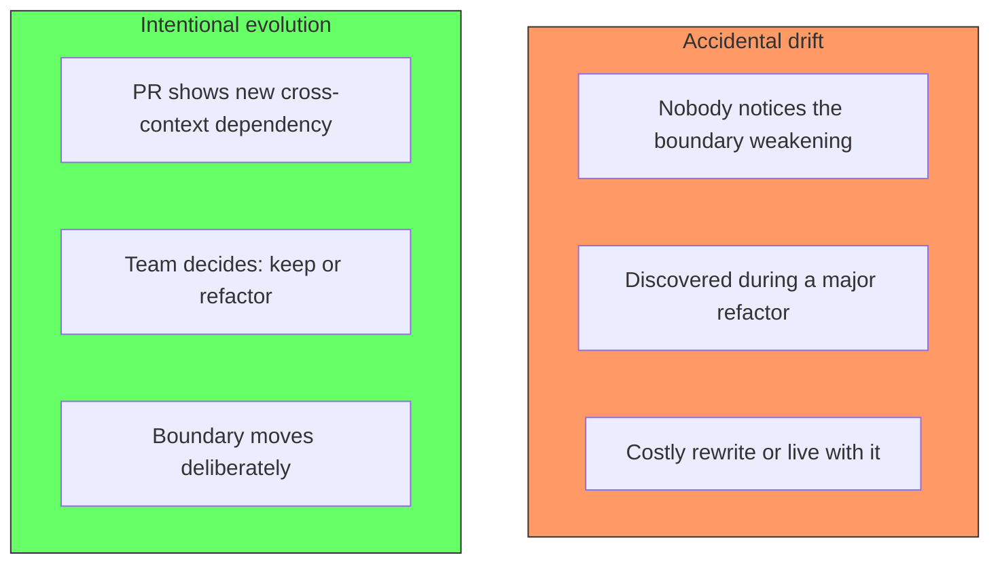

# Architecture Drift in the Age of AI

## The problem: a general fighting as a foot soldier

A general on a battlefield has one job: see the whole board, understand the enemy's strategy, and decide where to move the army. If the general picks up a rifle and charges into the nearest trench, the army loses direction. The general might win that one skirmish, but the battle is lost because nobody was watching the bigger picture.

This is what it feels like when a developer opens Cursor and starts generating code without thinking about architecture. The AI produces a solution to the immediate problem in seconds. The task is done. But every AI-generated file is a micro-decision about structure, dependencies, and boundaries — made without anyone watching the whole board. The developer is fighting in the trench instead of surveying the battlefield.

Each AI generation is optimal for the local task. The problem is that locally optimal decisions produce a globally incoherent system. The AI solves the problem in front of it. It does not know, and cannot know, what shape the system should have in six months.

## What architecture drift is

Architecture drift is the slow divergence between the intended architecture and the implemented architecture. It happens one import at a time, one extra parameter at a time, one cross-context dependency at a time.

No single change looks like a violation. Each one is justified at the moment: "I just need to access this one field from the other module." But 50 such justifications later, the boundary between two contexts no longer exists. The code still works, but the architecture is gone.

Drift is not a bug. It is the natural result of making localized decisions without a feedback loop that shows the global picture.

## Why AI accelerates drift

Before AI, generating code required effort. Writing 50 lines of boilerplate to connect two modules took long enough that a developer would ask: "is this the right way to do this?" The friction created a moment of reflection.

AI removes the friction. You prompt, it generates, you move on. The moment of reflection is gone.

The 30 minutes of friction was not waste. It was the cost of making an intentional decision. Removing that cost means more decisions are made by accident. The architecture drifts faster because nobody is steering.

The danger is that AI-generated code looks correct. It compiles. It passes tests. It works locally. The problem is not in the code — it is in the structure that nobody designed.

## The missing feedback loop

Most teams have no way to see architecture drift. They have linters for formatting, type checkers for type safety, and tests for correctness. But nothing tells them: "this PR adds a new dependency between two contexts that were supposed to be independent."

The missing feedback loop is what makes drift invisible. A team can ship 100 PRs that each pass code review, and at the end of the year discover that the architecture they planned no longer exists. Nobody noticed because nobody was measuring.

The fix is a coupling report that runs on every PR and shows the diff in cross-context dependencies. Not a gate that blocks — a signal that makes the drift visible while it is still small.

## Architecture is always evolving

Architecture drift is often framed as a failure of discipline. It is not. Architecture is not something you design once and freeze. It evolves with the product, the team, and the market.

The question is not whether the architecture will drift. It will. The question is whether the drift is intentional or accidental.

Intentional evolution is how architecture should work. The team sees a coupling diff on a PR, discusses it, and decides: "this dependency is justified because the domain has changed" or "this is a shortcut, let us route it through the proper interface." The boundary moves because the team chose to move it, not because nobody was watching.

## How to manage drift without slowing down

The AI generation speed is not the enemy. The lack of visibility is. You can generate code fast and still maintain architecture if you have a feedback loop that shows the structural impact of each change.

**Step 1: Measure coupling in CI.** Generate a report on every PR that shows the diff in cross-context imports. Do not block the PR initially — just show the number.

**Step 2: Review the diff.** When the report shows a new cross-context import, the team sees it. They ask: "is this the right way to connect these two contexts?"

**Step 3: Decide consciously.** Sometimes the answer is yes. The domain has changed and the boundary needs to shift. Other times the answer is no and the import should go through a port. Both answers are valid as long as they are conscious.

**Step 4: Update the architecture record.** When a boundary shifts, update the context map. The record stays in sync with reality, not with the original plan.

## Summary

Architecture drift happens naturally with or without AI. AI accelerates it by removing the friction that forced developers to reflect before crossing a boundary.

The solution is not to slow down or stop using AI. The solution is to add a feedback loop that makes drift visible at PR time. A coupling diff does not block velocity — it enables conscious evolution. The general stays on the board and watches the battlefield. The AI fights in the trenches. Both do their jobs.

### References

- Fowler, M. (2003). *Architecture Drift*. martinfowler.com. https://martinfowler.com/articles/evodb.html — On the gap between intended and implemented architecture
- Perry, D. E., & Wolf, A. L. (1992). *Foundations for the Study of Software Architecture*. ACM SIGSOFT Software Engineering Notes. — Original formulation of software architecture as a set of design decisions
- Kruchten, P. (1995). *The 4+1 View Model of Architecture*. IEEE Software. — Architecture as multiple views that must remain consistent
- Foote, B., & Yoder, J. (1997). *Big Ball of Mud*. PLoP. — The inevitable outcome of unchecked architecture drift
- Fowler, M. (2019). *Software Architecture Guide*. martinfowler.com. https://martinfowler.com/architecture/ — Architecture as a series of decisions, not a static document
