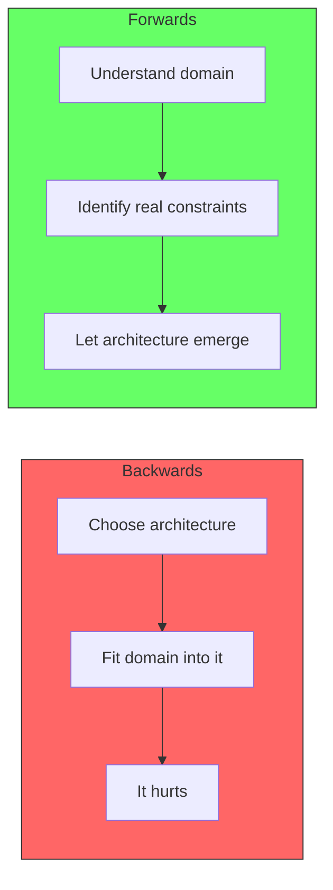
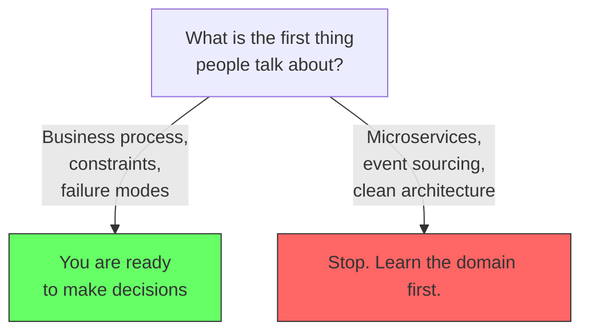

# Architecture is Not the Starting Point

Clean architecture, layered architecture, DDD, event-driven, microservices. Pick any pattern, follow every enterprise best practice, and you still end up in the same place: a system that is hard to change. Change something, and you fear you will break something else. The same comment keeps coming up: "We would be better off rewriting this whole thing."

And the codebase might not even look that bad. It might not even be that hard to follow. Except it is — because it is convoluted and complicated when you actually need to make a change.

## The real problem

One of these five things is probably the cause:

- You made an architectural decision you should not have made because you did not have enough information yet.
- You are solving a problem you do not actually have.
- You added technical nonsense for a problem that does not exist.
- The conversation started with "we need microservices / event sourcing / DDD" and nobody could explain the business process, the constraints, the consistency issues, or the failure modes.
- You treated architecture as a blueprint instead of an evolving response to real constraints.

## The shift

The question is not "what architecture should we use?" The question is "what problem justifies the architectural decision we are about to make?"

The first decision — choosing an architecture, a framework, a pattern — should not happen before you understand the business domain. If the first thing people talk about is microservices, event sourcing, or clean architecture, you are doing it backwards.

Architecture is not a blueprint. It is not a checklist. It comes with tradeoffs and complexity. The only valid reason to adopt a pattern is that it solves a concrete problem you have measured or felt.

## Summary

Every architecture works when it solves a real problem. Every architecture fails when it is chosen before the problem is understood. Start with the domain, not the pattern.
