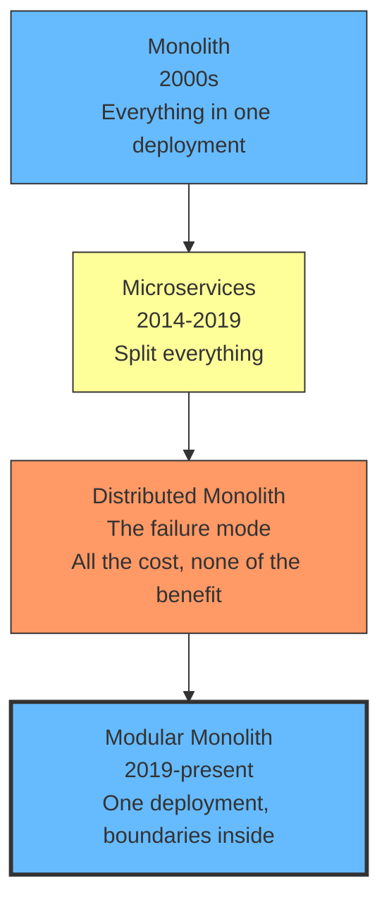
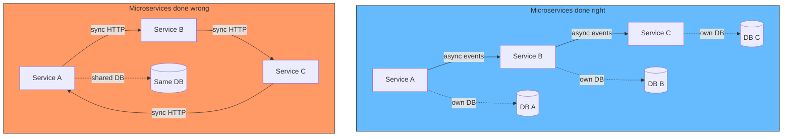
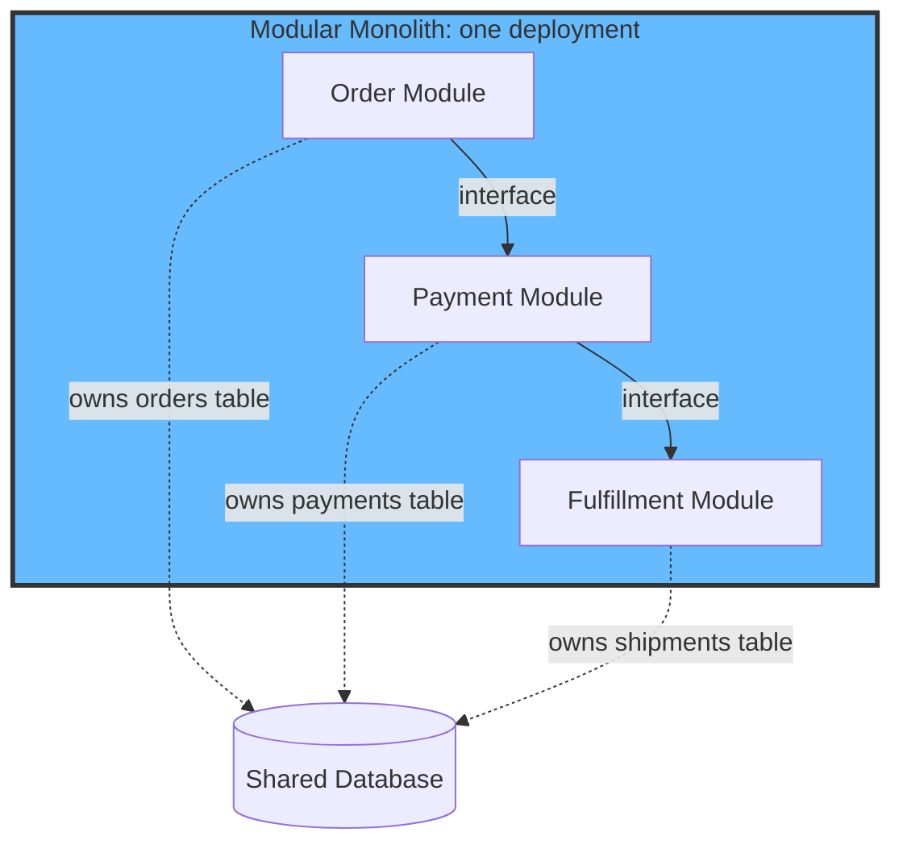
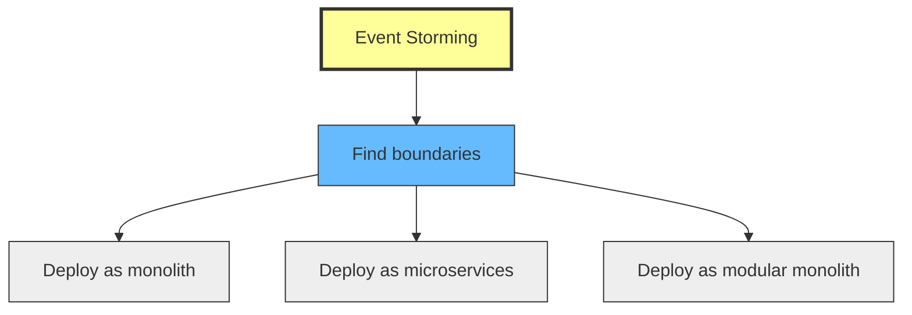

# How Architecture Styles Changed and Event Storming Survived All of Them

## The problem: every few years, the industry reinvents itself

2005: "Monoliths are terrible. Split everything into services."
2015: "Microservices are terrible. Put everything back."
2020: "Actually, keep it in one deployment but add boundaries."
2025: "Wait, what was the problem again?"

The architecture styles kept changing. The one technique that survived every reinvention was event storming. Not because it is magic. Because it solves a different problem.

## The monolith era (2000s)

Everything was in one deployment. One codebase, one database, one team. It worked. Then it did not.

The monolith was simple to deploy but painful to change. Every feature touched ten files. Every refactor broke something nobody expected. The team lived in fear of the deploy. The codebase worked, but it was hard to evolve.

The diagnosis was: the monolith is the problem. The prescription was: split it.

## The microservices era (2014-2019)

Netflix, Amazon, and Google were already running thousands of services. The rest of the industry looked at them and said: "We should do that."

The promise was clear: independent deployment, independent scaling, team autonomy. Each service owns its data, its logic, its deployment. Change one service without affecting others. Deploy without coordinating. Scale what needs scaling.

The reality was different. Most teams did not have Netflix's scale. They did not have Netflix's platform team. They did not have Netflix's years of learning. They split their monolith into 15 services, shared a database, and added synchronous calls between them.

The result was the worst of both worlds.

## The distributed monolith: the failure mode

A distributed monolith is what happens when you split the deployment but keep the coupling. The services are separate processes, but they cannot operate independently. Changing one service requires changing another. Deploying one service requires deploying another. They share a database. They make synchronous calls to each other.

You get all the cost of microservices (network latency, observability, deployment complexity, distributed transactions) with none of the benefit (independent deployment, independent scaling, team autonomy).

The distributed monolith is not a different architecture. It is a microservices implementation done wrong. And it is the most common outcome when teams adopt microservices without understanding the boundaries first.

Amazon Prime Video made this public in 2023. Their video monitoring service was split into microservices that called each other synchronously. They consolidated back to a monolith and cut costs by 90%. The internet called it a "return to monolith." It was actually a correction from distributed monolith to monolith with clear boundaries.

## The modular monolith: the backlash

The industry started asking: what if we keep the simplicity of one deployment but add the boundaries that microservices promised?

The modular monolith is one deployable with modules inside. Each module represents a bounded context. Modules communicate through well-defined interfaces. They share a database but each module owns its tables. The deployment is simple. The boundaries are enforced.

The modular monolith gives you: one deployment (simple), clear boundaries (evolvable), in-process calls (fast), and the option to extract modules later when you have a real reason (scaling, team autonomy).

The key insight: the boundary is the valuable part. The deployment is a separate decision.

## What changed across all these styles

The deployment changed. The boundaries did not.

- **Monolith:** boundaries exist in the code (folders, namespaces), but are not enforced.
- **Microservices:** boundaries are enforced by deployment (separate processes, separate databases).
- **Modular monolith:** boundaries are enforced by code (module interfaces, build rules), deployment is shared.

The boundary is the constant. The deployment is the variable.

## How event storming survived all of it

Event storming is a discovery technique. It helps you find the boundaries. It does not care how you deploy.

The Capital One article (2019) showed event storming used to decompose a monolith into microservices. The technique was the same: run the workshop, find the language changes, draw the boundaries. The deployment decision (microservices) was separate.

Today, teams use the same technique to find boundaries for modular monoliths. The workshop is the same. The sticky notes are the same. The language changes are the same. The boundaries are the same. The only thing that changed was the deployment decision.

This is why event storming survived. It solves the discovery problem (what are the boundaries?) while the industry argued about the deployment problem (monolith vs microservices vs modular monolith). The discovery problem is harder and more important. The deployment problem is a trade-off that depends on team size, scale, and operational maturity.

## The timeline

- **2000s:** Monolith. Simple deployment, painful evolution.
- **2005-2015:** SOA. Services, but still heavy (ESB, SOAP, centralized governance).
- **2014-2019:** Microservices. Lighter services, but adoption outpaced understanding.
- **2019-2023:** Distributed monolith. The failure mode became visible (Amazon Prime Video).
- **2019-present:** Modular monolith. Back to one deployment, with enforced boundaries.
- **2014-present:** Event storming. Discovery technique. Survived every deployment shift.

## What this means for you

The architecture style is a trade-off. The boundaries are not.

If you are a small team, start with a modular monolith. Use event storming to find the boundaries. Deploy as one. Extract later when you have a reason.

If you are a large team with independent domains, microservices may be justified. Use event storming to find the boundaries first. Then split.

If you already have a monolith, do not split because it is trendy. Split because the boundaries are clear and the pain of staying together is real.

The direction matters: problem first, deployment second. Event storming gives you the problem. The deployment is a choice.

## Summary

- Architecture styles changed: monolith, microservices, distributed monolith, modular monolith.
- The distributed monolith is the most common failure mode of microservices adoption.
- The modular monolith is the industry backlash: one deployment, boundaries inside.
- The boundary is the constant. The deployment is the variable.
- Event storming survived because it solves the discovery problem, not the deployment problem.
- Direction matters: problem first, deployment second.

## See also

- [DDD: The Complete Process Step by Step](/docs/software-engineering/ddd-process) walks through event storming to working code.
- [From Event Storming to Bounded Contexts](/docs/software-engineering/event-storming-read-models-boundaries) covers how event storming leads to bounded contexts.
