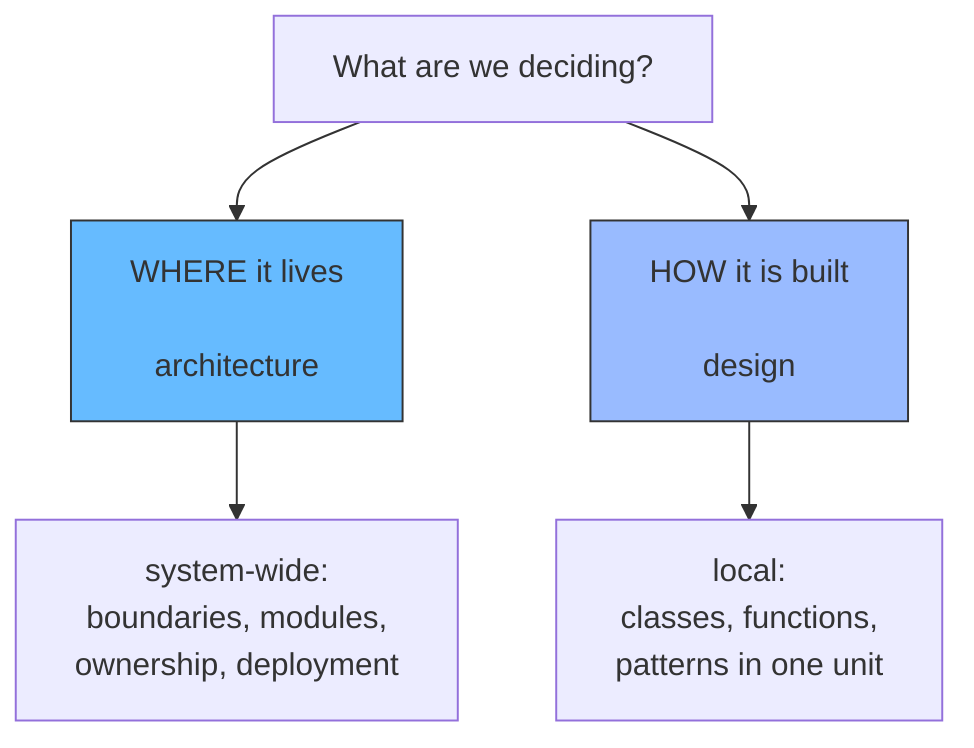
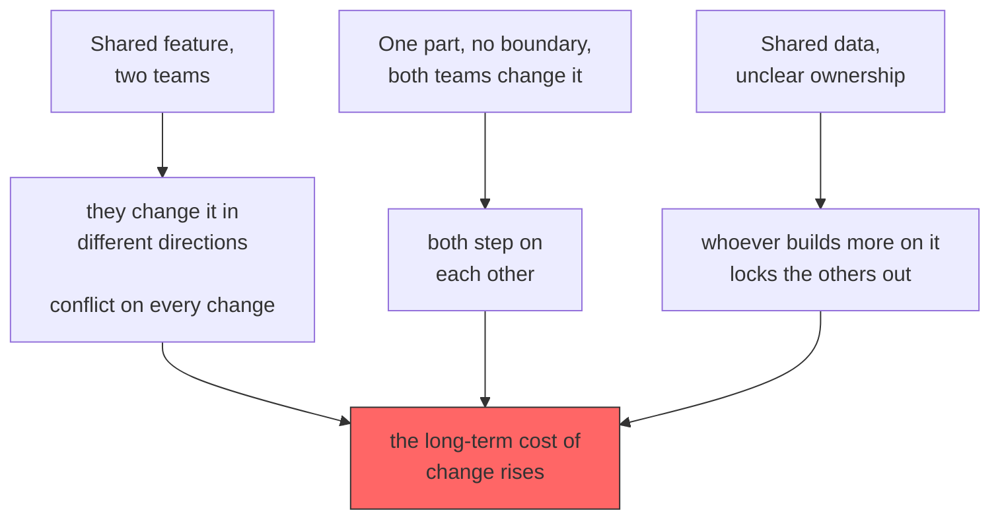
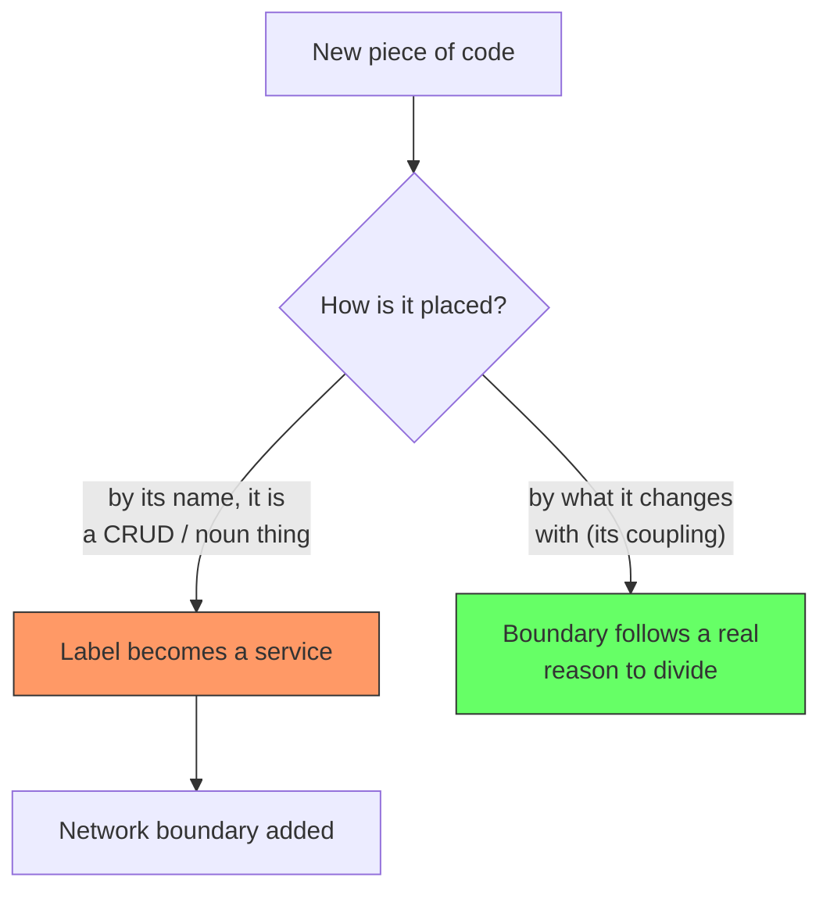
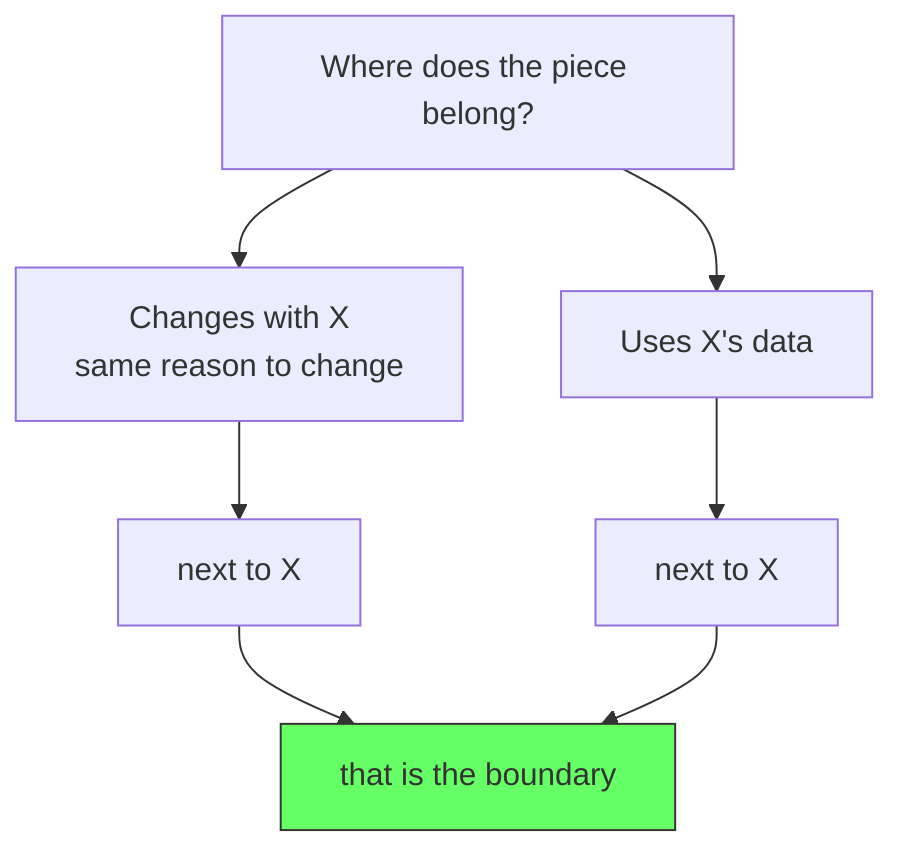
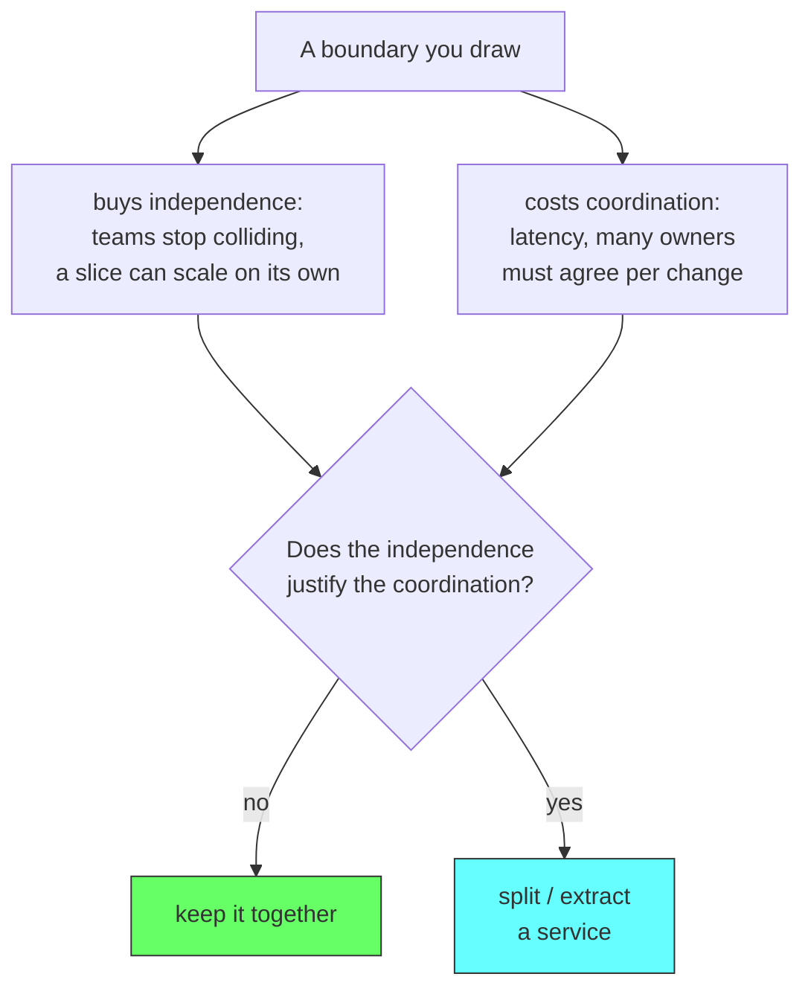
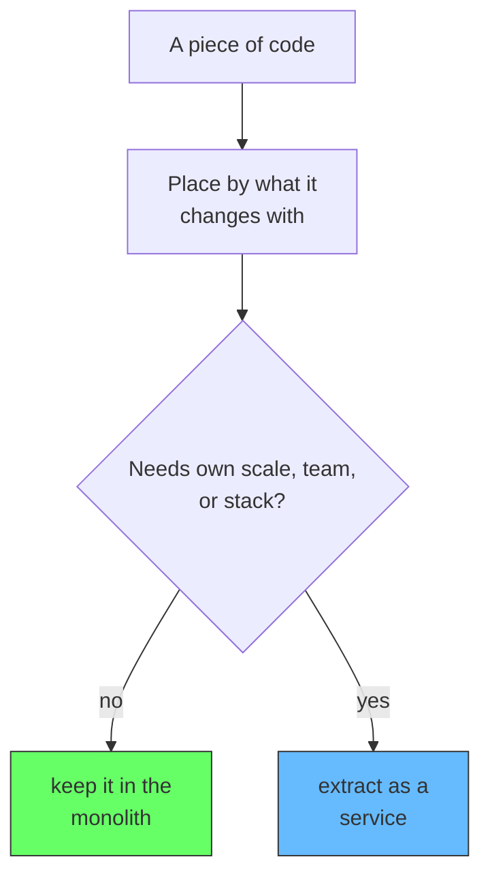

# Architecture vs Design: Where Does This Code Belong?

The hardest decision in software is not "how do I write this?" It is "where does this go?" A developer can write a flawless CRUD endpoint, a clean interface, a beautiful error path, and still be wrong, because the code sits in the wrong place. Most tense code-review arguments are really architecture debates wearing the costume of style debates. The argument is phrased as "this function is ugly," but the real tension is "this logic cannot live here."

The confusion comes from treating architecture and design as if they were one question. They are two different questions, and mixing them up is where the mistakes begin.

## Design vs architecture

Design is how a single unit of software is built on the inside. It covers a class, a function, a module: how responsibility is split, how things are named, how data flows within a unit. Design is local. You can judge it by reading one file on its own, because the unit carries its quality with it.

Architecture is where a piece of software lives in the system. It covers the boundaries, the modules, the services, who owns the data, and how it deploys. Architecture is system-wide. You cannot judge it by reading one file, because a single file looks the same on either side of a line. The placement is what makes it architecture.

The common mistake is to answer an architecture question with a design answer. Faced with a piece of code, instead of asking "where does it belong?", teams ask "is it written cleanly?" Clean code does not tell you where it goes. You can write the cleanest CRUD module in the world and place it somewhere that costs the company money every month.

## Why it matters: placement decides the cost of change

Architecture matters for one reason: it decides who can change what, and that decides the long-term cost of change. This is easiest to see with teams and their data.

Imagine a feature split across two teams. Team A wants to change it one way, Team B wants to change it the other way. Both touch the same code, so every change becomes a negotiation. Or imagine one shared part with no boundary at all: both teams change it, and both collide. Now add data. If two teams both write to the same data, the team that builds the most on top of it locks it, and the other team can no longer change it without breaking what was built.

In every case the problem is the same: the way code and data are placed decides who can change them and how expensive that change is later. A wrong placement does not fail today. It restricts the team's freedom and makes the thing harder to change for the whole life of the system.

So picking where a piece lives is not a cosmetic choice. It is a decision about how expensive the software will be to change, and how freely the teams who own it can act, from the day it ships.

## The mistake: placing by a noun

The placement decision needs a method, and teams mostly skip it. They place a piece of code by its name instead of by what it changes with. A piece is a "users thing," so it becomes the "users service." A piece is a CRUD endpoint, so it becomes the "account service." The piece is given a name, the name is made into a service, and the service is forced behind a network boundary, under the banner of "microservices." No one stops to ask whether that boundary solves a felt problem.

Take a simple customers table. It is CRUD. It has no independent scaling profile, no special team, no different runtime. It is a table that other parts of the system read and write, so it belongs alongside them. But a team can still isolate it, because it is a table, and tables become services. The network boundary does not come from a need; it comes from the label.

The cost appears immediately. A separate build, pipeline, monitoring, database, and on-call for a small table is overhead that exceeds the logic it holds. Worse, the table was always read by the whole monolith, so moving it behind a service turns an in-process read into a network call for every feature that touches it. A new integration, a new latency, a new failure domain. A problem that did not exist was created and paid for, and it can be paid for by every future consumer of that table.

## The method: place by coupling

The way to decide where a piece belongs has been known for a long time. A piece of code belongs next to the code it changes with, and next to the code whose data it uses. That is the boundary. Not the name of the piece, not a guess about the future.

- A piece that changes for the same reason as its neighbors belongs with them. This is cohesion.
- A piece that only changes when its neighbors change, and whose data its neighbors need, is coupled to them. It belongs next to them. This is the test.

For the customers table the answer is clear. Its data is changed by accounts, profiles, billing, and orders, and they all read it. It couples and changes with the whole domain. It belongs in the monolith, not behind a network. A table shared by the whole system is a shared schema, not a service boundary.

## What microservices are actually for

Microservices are not a fashion and not a category that a table falls into. They exist to solve a narrow set of real problems. If none of these is present, a service boundary is paid for with nothing, and the costs are not even paid by the person who drew it:

- **Independent scale.** One part is noticeably heavier than the rest, and one deployment cannot serve it well.
- **Independent team cadence.** A real team needs to ship its part on its own schedule, not wait on or merge with others.
- **Different stack or isolation.** A part needs a technology, or a failure domain, the monolith could not afford.

A CRUD table matches none of these. It is not heavy, it is not a separate team, and a different runtime does not help it. So a CRUD service buys independence it does not need and pays in coordination it does need. The cost of the boundary is coordination: latency, and the number of people who must align before a change ships.

## The one-line trade: independence vs. coordination

The whole decision fits in one line. Both monoliths and microservices are just degrees of separation. Every boundary buys some independence, and every boundary costs some coordination:

- **Independence** is what you get: people stop stepping on each other, and a justified slice can scale or deploy on its own.
- **Coordination** is what you pay: latency, and the human cost of several owners aligning for a single change.

Pick the point where one more boundary no longer buys enough independence to justify the coordination it forces.

## Summary

There are two different questions in software, and it is common to confuse them. Design is the "how" of a unit and it is local. Architecture is the "where" of a unit, it is system-wide, and it decides who can change what and at what long-term cost.

Teams answer the "where" question with a noun. A thing is CRUD or is a user, so it becomes a service and is pushed across the network. That is placing by noun rather than by coupling. The correct method is to place a piece by what it changes with and what data it needs.

The pattern, microservices, is the trailing detail. Pieces stay together unless one of the justified needs, real scale, an own team, or a separate stack, wants a boundary of its own. And even then, the independence the boundary buys must outweigh the coordination it forces. Everything else is a boundary drawn for a problem that was never asked.

