# Cohesion: Related by Capability, Not by Layer

Everyone agrees: related things should be close together. That proximity promotes cohesion, makes code easier to find, and reduces cognitive load. But "related" is doing a lot of work in that sentence.

Related by what?

A database repository and a database migration are related -- they both touch the database layer. But they serve different capabilities. A database repository and a business-domain service are not related by layer, but they are related by capability -- they collaborate to fulfill the same user-facing feature.

Grouping by layer and grouping by capability produce completely different module structures. Mixing them up is one of the most common sources of accidental coupling in software architecture.

## The problem: what does "related" mean?

When a developer says "these things are related," they usually mean one of two things:

1. **Related by technical layer** -- they share an underlying infrastructure concern (database, network, UI, logging, auth)
2. **Related by capability** -- they collaborate to deliver a business outcome (checkout, search, notifications, user onboarding)

These two interpretations lead to radically different module boundaries.

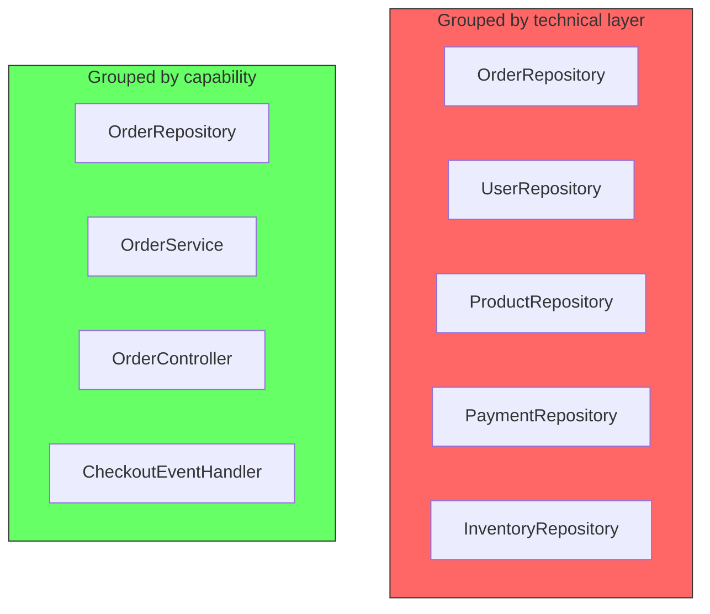

In the left group, everything is "related" because it talks to a database. In the right group, everything is related because they collectively handle orders.

## Layer grouping: what it looks like

Layer grouping organizes code by the technical role it plays in the system. The classic example is a project structure like this:

```
src/
  repositories/
    user_repo.py
    order_repo.py
    product_repo.py
    payment_repo.py
  services/
    user_service.py
    order_service.py
    product_service.py
  controllers/
    user_controller.py
    order_controller.py
    product_controller.py
```

Every repository lives together because they are all repositories. Every service lives together because they are all services. This is technically a form of cohesion -- all items in `repositories/` do "database access" -- but it is cohesion by technical role, not by capability.

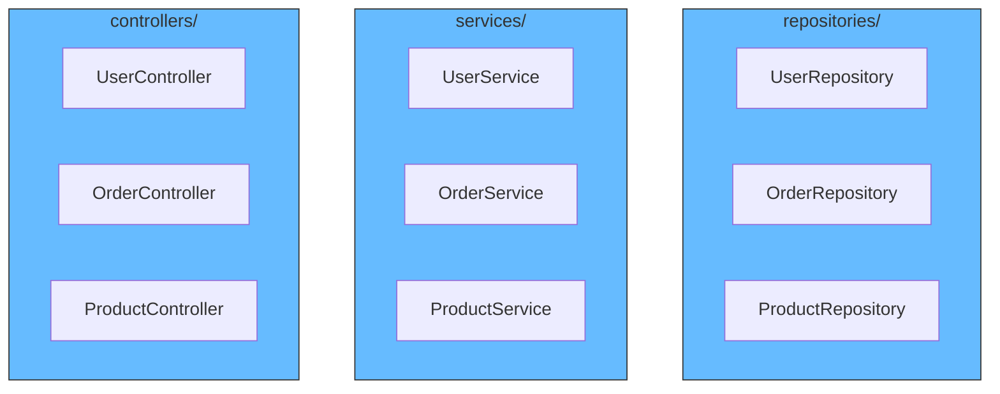

Each folder is cohesive in the sense that all its members share a technical concern. But the folder boundary does not correspond to any business boundary. A change to the order flow requires touching files in `repositories/`, `services/`, and `controllers/` -- three separate modules, even though the change is conceptually one thing.

## Capability grouping: what it looks like

Capability grouping organizes code by the business outcome it contributes to. The same system restructured:

```
src/
  orders/
    order_repo.py
    order_service.py
    order_controller.py
    checkout_event_handler.py
  users/
    user_repo.py
    user_service.py
    user_controller.py
  products/
    product_repo.py
    product_service.py
    product_controller.py
```

Now every file in `orders/` is there because it participates in the "orders" capability. The repository, service, controller, and event handler are related by the business outcome they collectively produce, not by their technical role.

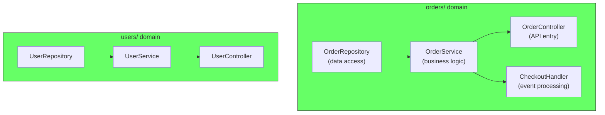

A change to the order flow stays entirely within `orders/`. The module boundary now matches the capability boundary.

## Capability grouping requires defining the interface first

Capability grouping sounds straightforward in theory. In practice, identifying the right capability boundaries is the hard part. You cannot group by capability until you know what the capabilities are and where the lines between them fall.

This is not a coding exercise. It is a design exercise. Before writing any code, you need to draw the interfaces. On a whiteboard, in a design doc, on Canva, on a napkin -- whatever works. The act of drawing forces you to decide:

- What does this capability own?
- What does it need from other capabilities?
- What does it expose to other capabilities?
- Where is the boundary where one capability ends and another begins?

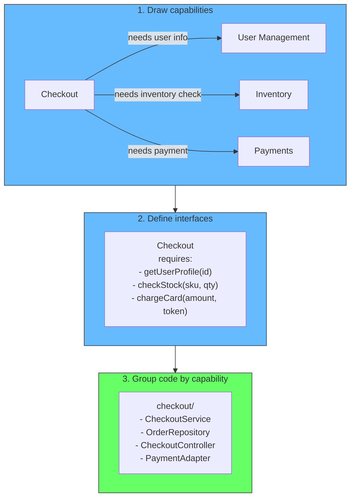

Without this step, capability grouping becomes guesswork. You might draw the boundaries wrong -- grouping by org chart instead of business outcome, or splitting along data entities instead of behaviors. The drawing is where you catch those mistakes, not after the modules are built and deployed.

The interface is the contract. It tells each capability what it can expect from the others. When the interfaces are clear, the grouping becomes mechanical: everything that implements a capability lives together, and everything that consumes it sits outside.

## Why layer grouping feels natural

Layer grouping is intuitive because developers think in terms of their technical stack. A backend developer sees "repositories" as a natural category. A frontend developer sees "components," "hooks," and "utils" as natural categories. These categories reflect how the developer works, not how the business works.

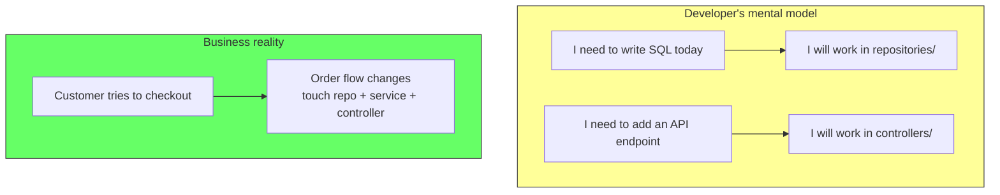

The developer's mental model is based on the tools and abstractions they use daily. The business's reality is based on the user journeys and outcomes. Layer grouping maps to the first. Capability grouping maps to the second.

### The hidden reality: a ball of mud

The clean-looking folder structure of layer grouping hides a mess. Each layer's components do not stay within their domain -- they reach across to serve multiple capabilities. The result is a tangled dependency graph where everything depends on everything else.

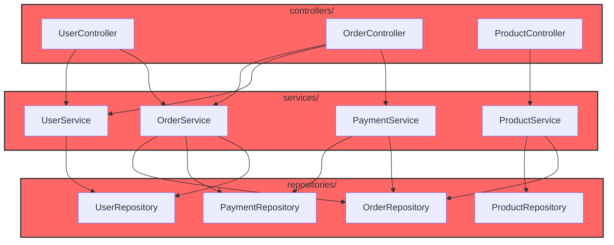

Every service reaches into repositories owned by other domains. OrderService calls UserRepository, UserService reaches into OrderRepository. The layers are clean. The dependency graph is not. This is the ball of mud -- not at the folder level, but at the dependency level. The system is cohesive by layer but coupled by domain.

## The historical root: ERD-first development

There is a historical reason layer grouping feels so natural. For decades, the standard workflow was: draw an Entity-Relationship Diagram (ERD), then generate CRUD around it. The data model came first. The application was a thin wrapper around the tables.

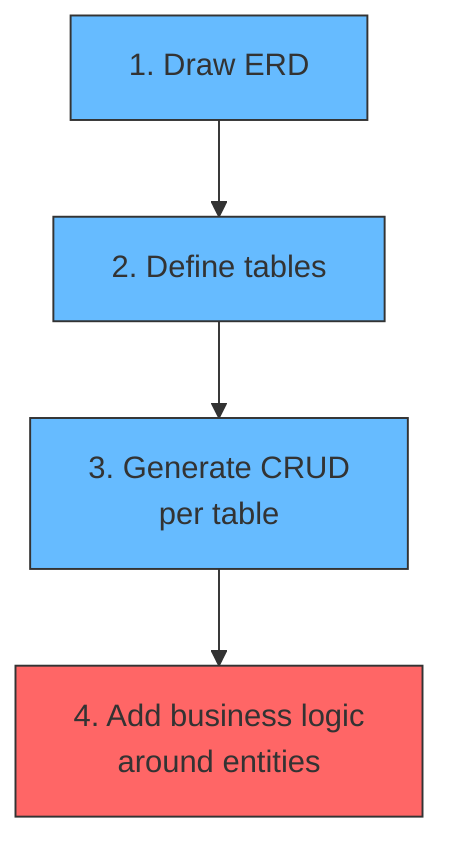

This workflow trained generations of developers to think in terms of data entities. A User table gets a UserRepository, a UserService, and a UserController. An Order table gets an OrderRepository, an OrderService, and an OrderController. The module structure mirrors the database schema.

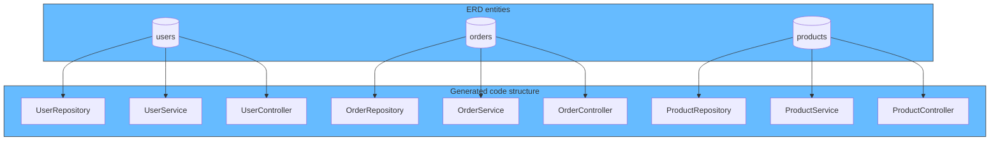

This worked fine for monoliths. The data model was the source of truth, and the code was organized around it.

The problem came when microservices arrived. Teams that were trained to think in entities asked: "how do we group these tables together into services?" They looked at the ERD and tried to cluster entities by data relationships -- which tables reference which, which tables are accessed together. They were still thinking in data.

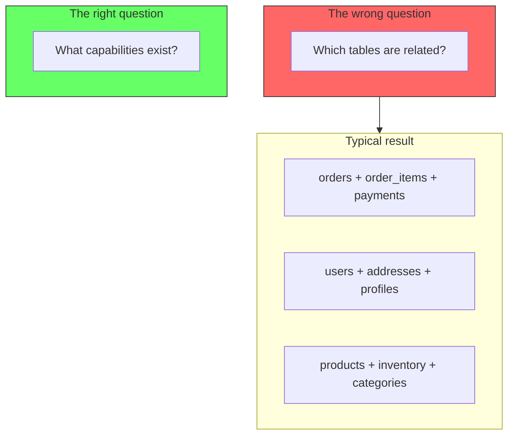

Grouping by data proximity is a step up from grouping by technical layer. At least it clusters related entities. But it still misses the point. The capability is not "orders table plus payments table." The capability is "allow a customer to purchase items."

The question should never be "which tables are related?" It should be "what business outcomes does this system produce, and what does each one need to do its job?" That shifts the focus from data to behavior. The tables are implementation details of the capability, not the capability itself.

## The consequence: coupling when you split

Layer grouping is benign in a monolith. You can change a repository, a service, and a controller in the same deploy. The files are in different folders but they ship together.

The problem appears the moment you want to deploy parts of the system independently -- which is exactly what microservices or modular monoliths aim to do.

Consider splitting the layer-grouped monolith into services. The natural split seems to be: "make a repository service, a service layer, and a controller layer." But that produces a distributed monolith.

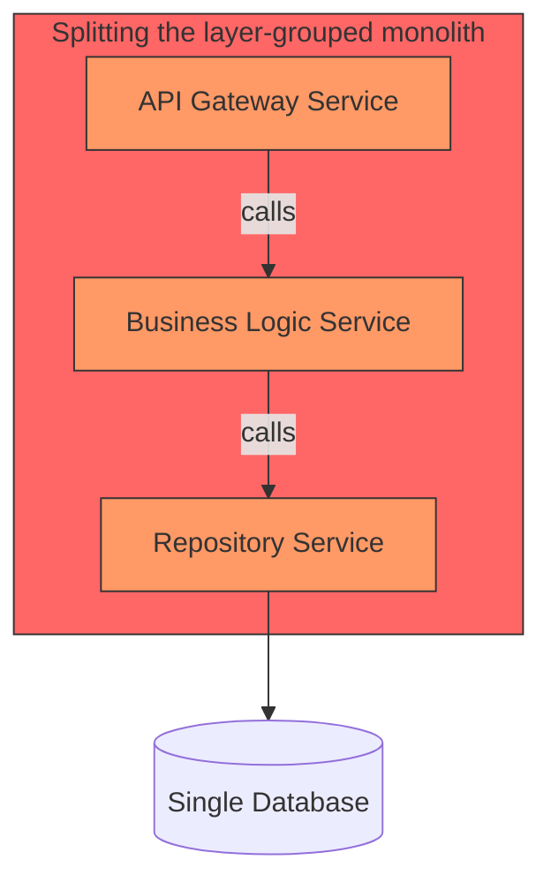

Every user flow now chains through three services. The order flow calls the order endpoint in the API service, which calls the order logic service, which calls the order repository service. The same chaining happens for users, products, and payments. The three services are tightly coupled -- a change to the order flow requires coordinated changes in all three. This is the distributed monolith anti-pattern: all the operational cost of microservices with none of the independence.

The root cause is clear: the services were split by technical layer, not by capability. The services are "related" by being repositories, not by being order-handling components. So when you need to deploy them separately, you discover they are tightly coupled because the real relationship was always the capability, not the layer.

## Capability grouping enables independent deployability

Now split the capability-grouped monolith. Each capability becomes its own service:

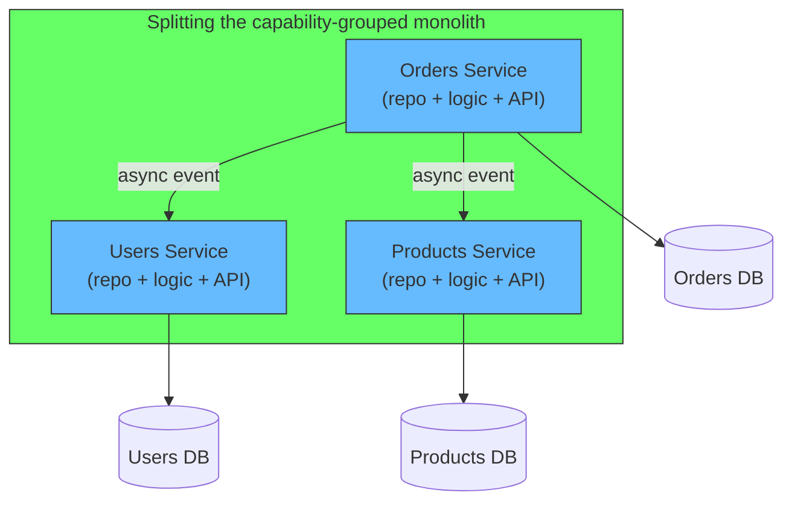

Each service owns its full capability -- data access, business logic, API, and event handling. A change to the order flow stays within the Orders service. No coordinated deploys needed across services. The services communicate via async events, not synchronous chains.

The service boundaries match the capability boundaries because the code was already organized that way.

## A concrete example

Imagine an e-commerce system with an OrderRepository, a PaymentRepository, and a UserRepository.

**Layer grouping** treats them as related because they are all repositories. They sit in the same module, share a base class, and often share a database connection pool.

**Capability grouping** sees them differently. OrderRepository belongs with the order capability. PaymentRepository belongs with the payment capability. UserRepository belongs with the user capability. They are not related -- they just happen to use the same infrastructure pattern.

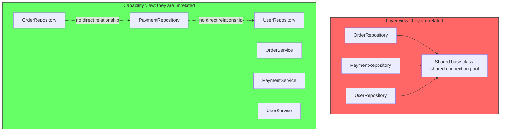

The mistake is confusing "uses the same technology" with "serves the same purpose."

## The right mindset: explore capabilities first, design second

All of this leads to a simple shift in how to approach architecture.

Stop starting with technology. Do not begin by choosing the stack, drawing the database schema, or laying out the folder structure. Those come later.

Start by asking: **what capabilities does this system need?**

This is an exploratory phase. Zen mode. Whiteboard, markers, no code. Let the capabilities emerge from the problem domain, not from the technology stack. What does the user need to do? What outcomes matter? What boundaries exist in the business?

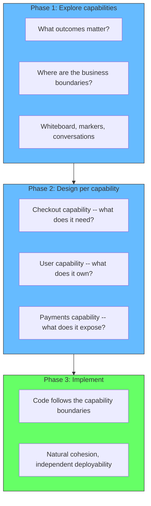

When you start from capabilities, the design falls out naturally. Each capability becomes a module or a service. Each module owns its data, its logic, and its API. The modules are cohesive because they were imagined as cohesive units from the start -- not assembled from pieces scattered across technical layers.

The technology decisions become local. The checkout capability uses whatever database makes sense for checkout. The user capability uses whatever makes sense for users. They are not forced into the same technical mold because they were never grouped by technology.

This is the fundamental difference between architecture-by-technology and architecture-by-capability. One starts with the tools and fits the problem to them. The other starts with the problem and picks the tools that fit.

## Summary

| | Layer grouping | Capability grouping |
|---|---|---|
| **What is related** | Technical role (repository, service, controller) | Business outcome (orders, users, payments) |
| **Cohesion type** | Technical cohesion | Domain cohesion |
| **Change locality** | A feature change touches N folders | A feature change touches 1 folder |
| **Independent deployability** | Hard -- every capability is spread across layers | Natural -- each capability is self-contained |
| **Distributed monolith risk** | High | Low |

The next time someone says "these things should be together because they are related," ask: related by what? If the answer is "they both use the database," that is layer-related. If the answer is "they both participate in the checkout flow," that is capability-related. Capability-related is the stronger signal.
