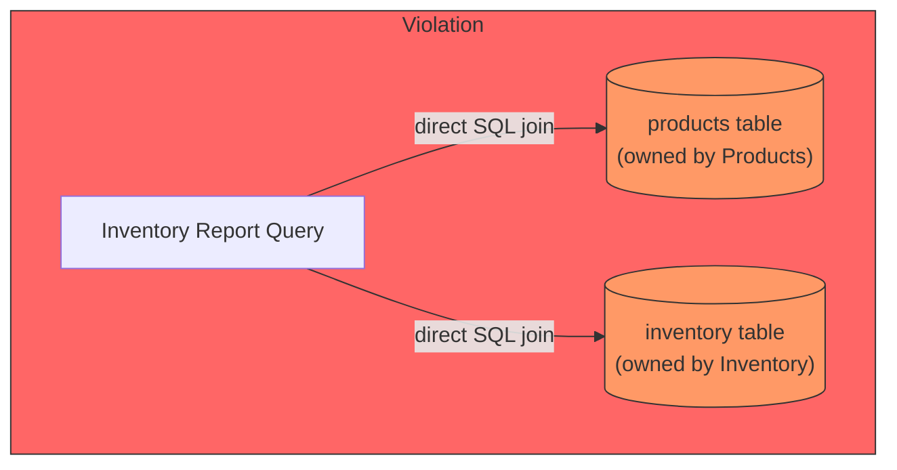
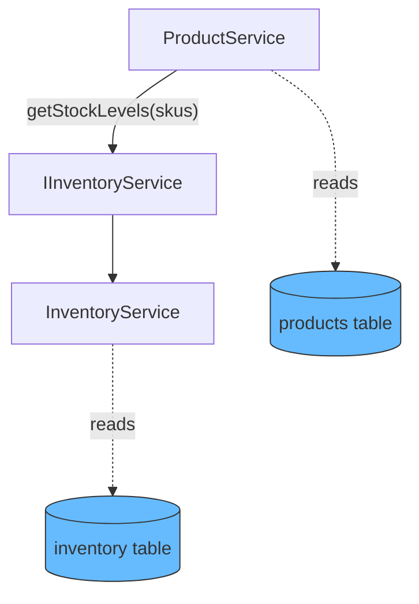
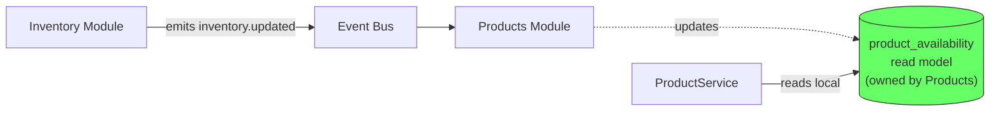
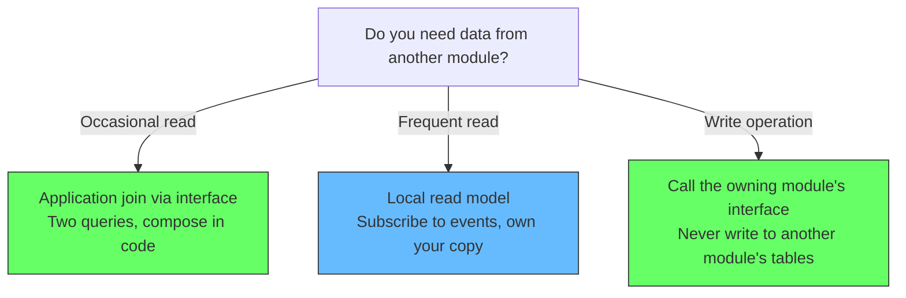

# Cross-Module Queries

Two modules, two tables, one join. Who owns the data?

In a layered monolith, the answer is easy: nobody. Any code can query any table, so the join happens wherever it is needed. That is the problem.

In a modular monolith, each module owns its tables. A query that spans two modules is a conflict between data ownership and convenience.

## The wrong approach: direct cross-module join

A dashboard needs to show product names alongside inventory levels. The SQL join is simple:

```typescript
// Direct join across module boundaries -- this breaks ownership
async function getInventoryReport(): Promise<InventoryReport> {
  return db.query(`
    SELECT p.name, p.sku, i.quantity, i.warehouse
    FROM products p
    JOIN inventory i ON p.sku = i.sku
  `)
}
```



This is a data ownership violation. The Inventory module now depends on the Products schema. A change to the products table — renaming a column, changing a type — breaks the inventory report. The coupling is invisible until it breaks.

More importantly, this blocks future extraction. When you eventually want to extract Inventory into its own service, the direct SQL join cannot cross the network boundary. The query breaks, and you have to untangle the dependency at the worst possible time.

## The right approach: application join

Instead of a SQL join, each module exposes an interface. One module calls the other to get the data it needs, then composes the result in application code.

```typescript
// Products module owns the join with Inventory
interface IInventoryService {
  getStockLevels(skus: string[]): Promise<StockEntry[]>
  isInStock(sku: string): Promise<boolean>
}

class ProductService {
  constructor(
    private productRepo: ProductRepository,
    private inventory: IInventoryService,
  ) {}

  async getProductsWithStock(): Promise<ProductWithStock[]> {
    const products = await this.productRepo.findAll()
    const skus = products.map(p => p.sku)
    const stockLevels = await this.inventory.getStockLevels(skus)

    // Application join -- two queries, composed in code
    return products.map(product => ({
      ...product,
      stock: stockLevels.find(s => s.sku === product.sku)?.quantity ?? 0,
    }))
  }
}
```



Each module queries only its own tables. The composition happens in the service layer. Neither module owns the other's data.

**The cost**: two queries instead of one. A network call instead of a local join (or two sequential queries in the same process). For occasional reads, this cost is negligible. For frequent reads, it adds up.

## The scale pattern: local read models

If the application join happens frequently and latency matters, create a local read model. The consuming module subscribes to events from the owning module and maintains a denormalized copy of the data it needs.

```typescript
// ProductAvailability read model, owned by Products module
// Kept in sync by consuming Inventory events

interface ProductAvailabilityProjection {
  findBySku(sku: string): Promise<StockInfo>
  upsert(sku: string, quantity: number): Promise<void>
}

class ProductAvailabilityService {
  constructor(
    private productRepo: ProductRepository,
    private availability: ProductAvailabilityProjection,
  ) {}

  @OnEvent('inventory.updated')
  async onInventoryUpdated(event: InventoryUpdatedEvent) {
    await this.availability.upsert(
      event.sku,
      event.newQuantity,
    )
  }

  async getProductsWithStock(): Promise<ProductWithStock[]> {
    const products = await this.productRepo.findAll()
    const stock = await this.availability.findBySku(products.map(p => p.sku))

    // Now this is a local query -- no cross-module boundary crossed
    return products.map(product => ({
      ...product,
      stock: stock.find(s => s.sku === product.sku)?.quantity ?? 0,
    }))
  }
}
```



The read model is owned by the Products module. The Inventory module does not control it. The event contract between them is the boundary. If Inventory changes its schema, the event shape changes, and Products must adapt its projection.

## What this enables

The same rules that protect data ownership today enable future extraction:

| Approach | Today (modular monolith) | Tomorrow (microservices) |
|---|---|---|
| **Direct SQL join** | Works, violates ownership | Breaks — cannot cross network |
| **Application join via interface** | Two in-process queries | Two network calls — same interface |
| **Local read model** | In-process event subscription | Event bus works unchanged |

The application join via interface is the safest default. The interface does not change when the implementation becomes a separate service. Only the wiring changes — from a direct method call to a network call.

## Guidelines



**One rule covers all**: if you need data from another module, ask the module through its interface. Never query its tables directly. The join is just an application concern, not a data concern.
