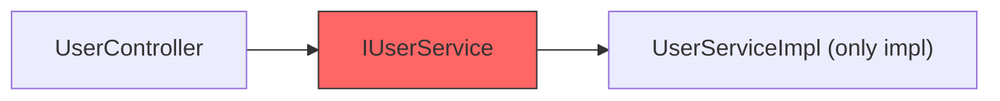
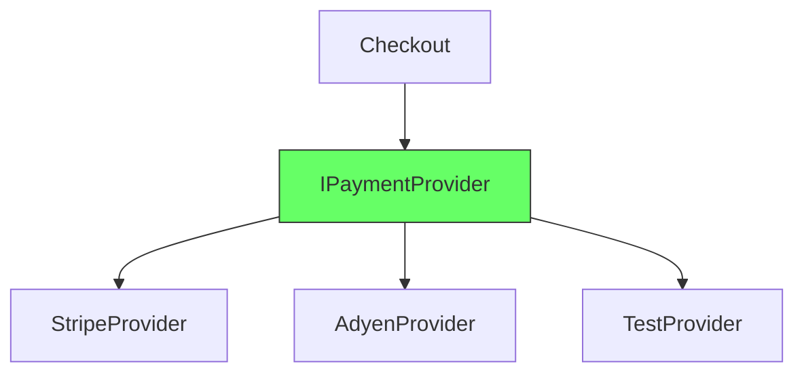
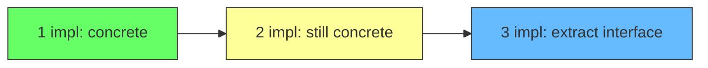

# Interface Implementation Pair

Martin Fowler calls it an anti-pattern. Mark Seemann calls it a violation of the Reused Abstractions Principle. Most teams call it "how we write code."

It looks like this:

```
interface IUserService {
  getUser(id: string): User
  createUser(data: CreateUserInput): User
}

class UserServiceImpl implements IUserService {
  // exactly one implementation of IUserService
}
```

One interface. One implementation. A 1:1 pair. The interface has exactly one consumer in production (the code that depends on `IUserService`) and one consumer in tests (the mock). Every method on the interface exists on the implementation. Every time you change the implementation, you change the interface. They never diverge.



## Why it is a smell

The interface adds indirection without abstraction. An abstraction should hide details. A 1:1 interface hides nothing — it duplicates the public surface of the concrete class. Every rename, every parameter change, every method addition must be mirrored in both files.

The cost is real:

- Two files to maintain instead of one
- Another file to navigate when reading the code
- A type to update on every refactor
- Cognitive load: "should I depend on the interface or the class?"

## When it is not a smell

The interface-implementation pair is justified when a second implementation exists or is imminent.

```
interface IPaymentProvider {
  processPayment(amount: Money): Receipt
}

class StripeProvider implements IPaymentProvider { ... }  // US, EU
class AdyenProvider implements IPaymentProvider { ... }    // Asia Pacific
class TestProvider implements IPaymentProvider { ... }     // tests
```

Three implementations. The interface earns its keep because it defines the contract that all three share.

But note: the 1:1 pair `StripeProvider : IPaymentProvider` is not tested alone. The interface exists because there are multiple implementations, not because Stripe needs one.



## What to do instead

Start with the concrete class. Add the interface when a second implementation appears.

```
// Step 1: concrete class, no interface
class StripePaymentProvider { ... }

// Step 2: second implementation appears
class AdyenPaymentProvider { ... }

// Step 3: extract interface
interface IPaymentProvider { ... }
class StripePaymentProvider implements IPaymentProvider { ... }
class AdyenPaymentProvider implements IPaymentProvider { ... }
```



Waiting for the second implementation means you know what the common contract looks like. You extract the real abstraction, not a guess.

## References

> Martin Fowler: *"InterfaceImplementationPair — an interface with a single implementation is a code smell."*
> — [martinfowler.com/bliki/InterfaceImplementationPair.html](https://martinfowler.com/bliki/InterfaceImplementationPair.html)

> Mark Seemann: *"Having only one implementation of a given interface is a code smell. It violates the Reused Abstractions Principle."*
> — [blog.ploeh.dk](http://blog.ploeh.dk/2010/12/02/InterfacesAreNotAbstractions.aspx)

## Summary

| | 1:1 interface-impl pair | Interface with 2+ implementations |
|---|---|---|
| **Indirection** | Pure cost — adds a file, no abstraction | Paid for by shared contract |
| **Maintenance** | Two files to update per change | Interface is stable, impls vary |
| **Testability** | Mock framework handles concrete classes | Interface is the natural seam |
| **Abstraction** | None — duplicates the concrete surface | Hides detail, exposes only contract |

A 1:1 interface-implementation pair is indirection without abstraction. Delete the interface. The concrete class is enough.
