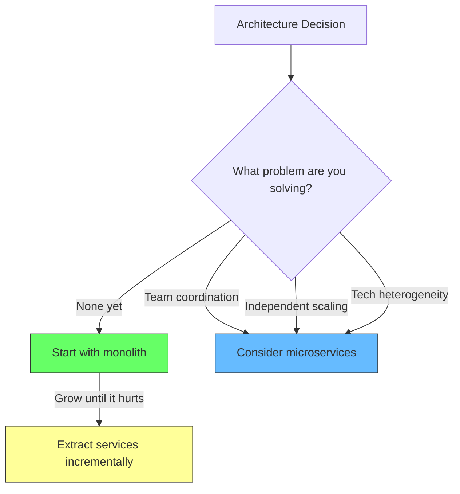
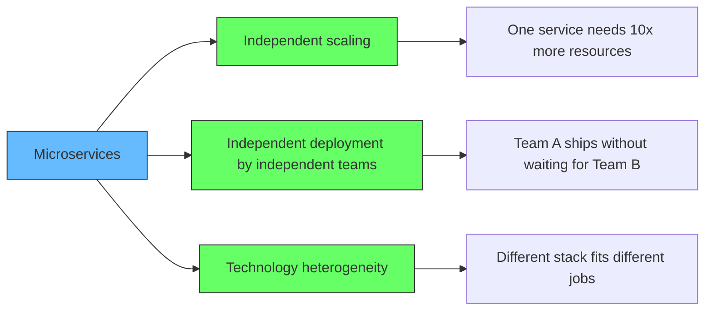
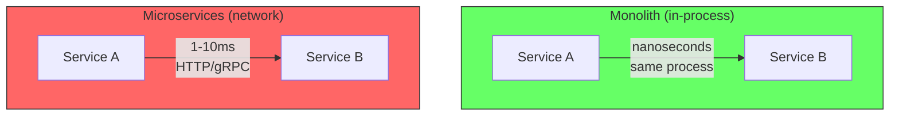
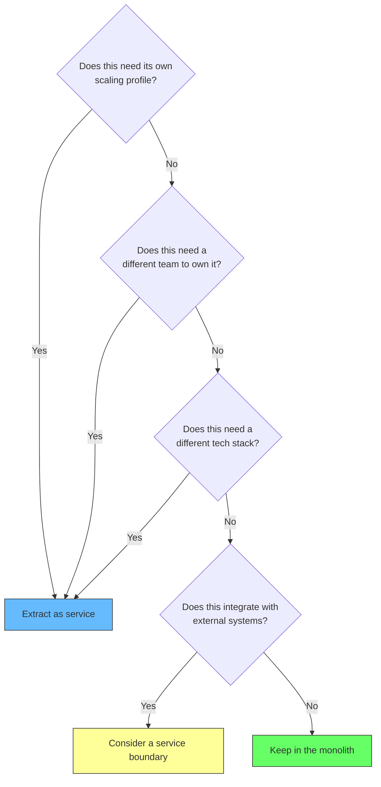
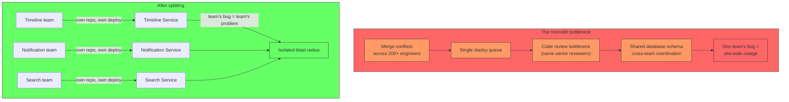
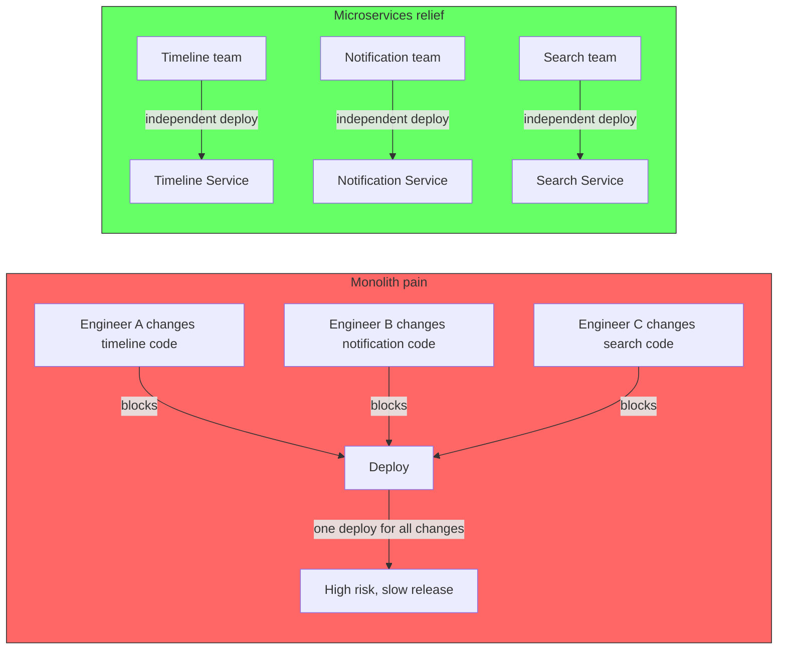
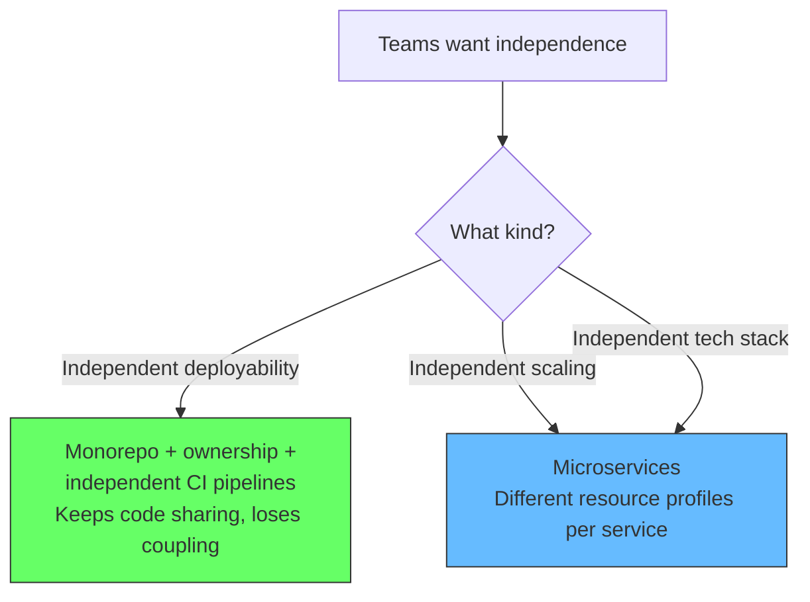
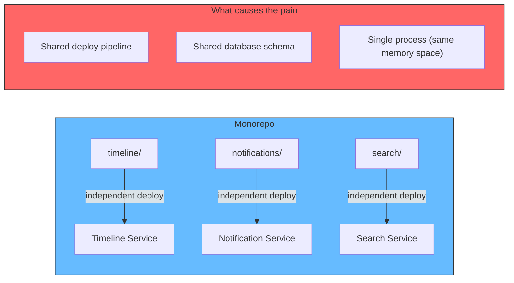
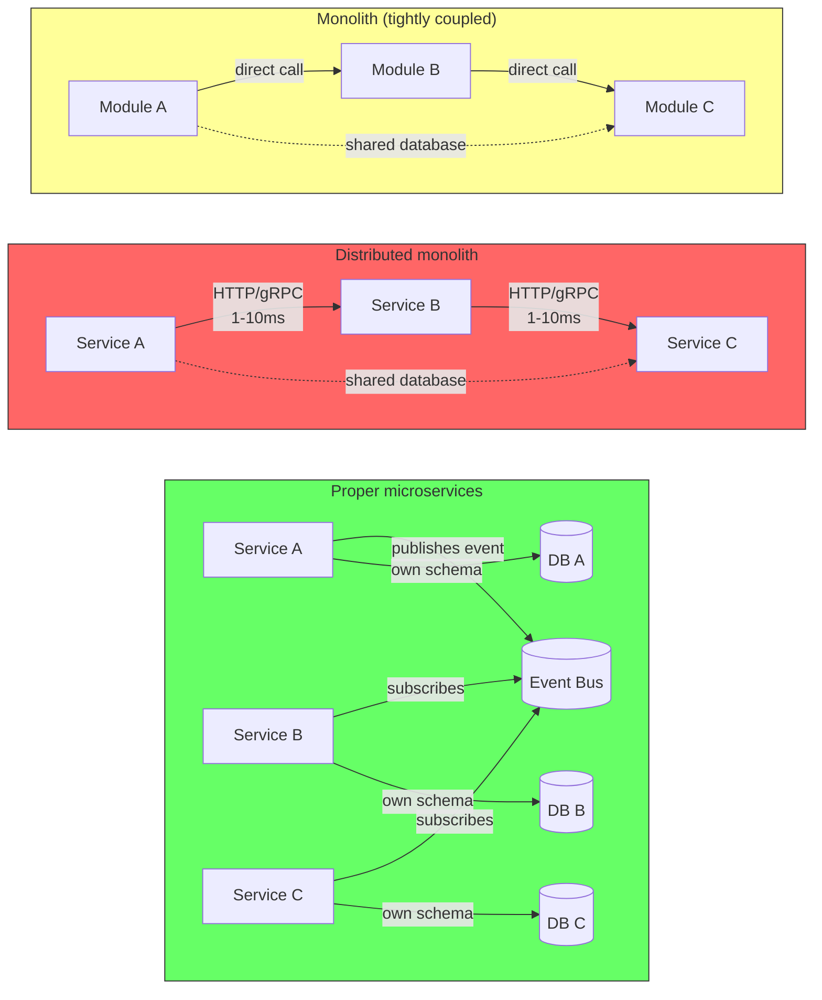
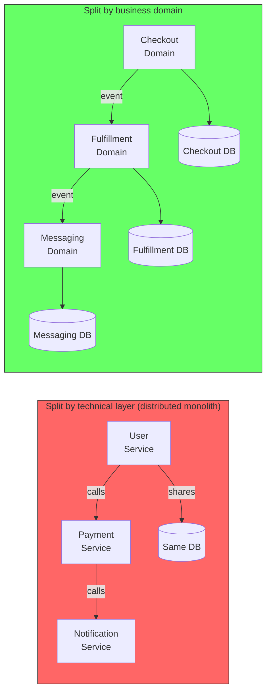

# Monolith vs Microservices

The question is never "which architecture is better." It is "what problem are you solving." Microservices and monoliths are tools, not identities. Using the wrong one costs time, money, and developer sanity.

## The problem: premature complexity

Teams adopt microservices because they sound modern, or because "we might need to scale independently someday." This introduces distributed systems complexity -- network calls, eventual consistency, service discovery, observability -- before any concrete problem exists.

Martin Fowler (2014): *"Almost all the successful microservice stories have started with a monolith that got too big and was broken up. Almost all the cases where I've heard of a system that was built as a microservice system from scratch, it has ended up in serious trouble."*

Amazon Prime Video published a case study in 2023 showing a **90% cost reduction** by consolidating microservices back into a monolith. The distributed architecture added network overhead that was never justified by their actual scaling needs.

## What microservices actually solve

Microservices solve exactly three problems. If you do not have these problems, you are paying the complexity tax for no benefit.

| Problem | Monolith handles it? | Microservices help when... |
|---|---|---|
| **Scaling** | A well-cached monolith handles 10K+ QPS easily | One feature consumes vastly different resources than the rest |
| **Deployments** | One deploy for everything | Teams need to ship on independent cadences |
| **Technology** | One stack for the whole app | A subsystem genuinely benefits from a different language/database |
| **Team coordination** | Works up to ~10-15 engineers | Multiple teams step on each other's code daily |

### The latency trap

Network calls are the hidden cost that eats architectures alive.

> Monoliths have lower latency (nanoseconds for internal calls vs milliseconds for network calls). Microservices add 10-100ms per request chain. -- easecloud.io, 2026

A request chain of 5 services means 50-500ms of pure network overhead before any business logic runs. That latency penalty does not exist in a monolith.

## The decision framework

Use this framework when deciding where to put new functionality.

Sources from 2026 consistently reinforce the same threshold:

- **blobstreaming.org**: "Microservices solve three specific problems: independent scaling, independent deployment by independent teams, and technology heterogeneity. If you don't have those problems, you're just paying complexity tax."
- **ideatosystem.com**: "Scale it far longer than intuition suggests. Introduce microservices only when organizational complexity, scaling pressure, or reliability concerns justify the operational overhead."
- **outplane.com**: "Keep it in the monolith when: 'We might need to scale this independently someday' or 'Microservices are the modern way'."

## The Twitter example

Twitter famously moved from a monolith to microservices. It is often cited as proof that microservices are necessary at scale. The real reason tells a different story.

> Twitter did not split because of QPS. They split because hundreds of engineers were stepping on each other's code. -- Industry consensus, 2026

The bottleneck was **organizational**, not technical. The monolith could handle the traffic. It could not handle the engineering coordination.

Here is specifically what "stepping on each other's code" looked like at Twitter's scale:

### Merge conflicts on every deploy

With hundreds of engineers committing to the same monolith repo, every deploy train required resolving merge conflicts across unrelated features. An engineer fixing a typo in the notification system could conflict with an engineer refactoring the timeline service -- they touched the same shared models, utility files, or configuration. Resolving these conflicts took hours of manual effort and frequently introduced bugs from incorrectly merged code.

### Shared deployment queue

The monolith had a single deployment pipeline. If the timeline team's feature had a bug during staging, it blocked the **entire deployment queue**. The notification team's perfectly tested code sat waiting because an unrelated change broke the build. A single team's mistake could delay every other team's release by hours or days.

### Code review bottleneck

Since every change touched the same repository, the same senior engineers became reviewers for everything. A timeline change, a search change, and a notification change all needed review from the same pool of architects who understood the full monolith. Review queues backed up, and teams spent more time waiting for sign-off than writing code.

### Schema coupling

The database had one schema. If the notifications team needed to add a column, they had to coordinate with the timeline and search teams to ensure nothing broke. A migration that was safe for one feature could lock a table needed by another team's critical path. Schema changes required cross-team meetings, planning, and synchronized deploys.

### Blast radius of failures

A memory leak in the search feature could bring down the entire monolith process, taking notifications and timelines with it. A bad deploy by one team meant a site-wide outage for all users. There was no isolation -- every team's risk was every team's problem.

### The key insight

Each of these problems is a **coordination** problem, not a **performance** problem. The monolith at Twitter was processing tweets just fine. The issue was that the cost of coordinating 200+ engineers in a single codebase exceeded the cost of operating a distributed system.

**The lesson**: If you have 5 engineers and one codebase, a monolith is the correct choice. If you have 500 engineers and one codebase, microservices solve a coordination problem, not a performance one.

## The monorepo clarification

A common reaction to the Twitter story is: "Doesn't a monorepo cause the same conflicts?" The answer is no. The problems Twitter faced were caused by a **monolithic deployment** -- one process, one deploy pipeline, one shared database -- not by storing code in one repository.

A monorepo can hold hundreds of microservices. Each service has its own deploy pipeline, its own data store, and its own team ownership. The repo is just where the code lives; it does not dictate how the code runs or deploys.

Google runs a monorepo with billions of lines of code and thousands of services. They do not have the Twitter problems because:

- **Build system (Bazel)** rebuilds and tests only what changed, not the whole repo
- **Ownership files** route reviews to the right team, not a single bottleneck
- **Independent deploy pipelines** per service -- one team's bad change does not block another team's deploy
- **Blast radius** is contained by service boundaries, not repo boundaries

Staples used microservices for a similar organizational reason: the Preferred Program team could deploy independently without disturbing the Payments team. That separation was about **team boundaries and deploy isolation**, not about the repository structure. You can have the same independence inside a monorepo as long as each service owns its own deploy pipeline and data.

But there is an important hierarchy here. Teams often reach for microservices when what they actually need is **independent deployability**. A monorepo with proper ownership files, a build system that only rebuilds changed targets, and independent CI pipelines per team can give them that without the operational cost of microservices. They still share common libraries, types, and tooling -- code sharing and deployment independence are not mutually exclusive.

Microservices only become necessary when you need one of the other two problems they solve:

- **Independent scaling** -- one feature needs 10x more resources than the rest
- **Technology heterogeneity** -- a subsystem genuinely benefits from a different stack

If the only goal is "teams should not block each other's deploys," a well-structured monorepo with independent deploy pipelines achieves that with far less complexity.

The real question is not monorepo vs multirepo. It is: do your services own their own deploy pipeline and data store, or are they all tied to the same deploy button and database?

## The distributed monolith anti-pattern

A common mistake is assuming that splitting a monolith into services automatically removes coupling. It does not. If two modules were tightly coupled inside the monolith, extracting them into separate services does not uncouple them -- it just turns in-process calls into network calls. The same logical dependency now has added latency, serialization overhead, and potential network failures.

This is called a **distributed monolith**: a system that runs as separate processes but remains as coupled as if it were a single deployment. It has all the operational cost of microservices with none of the benefits.

### How to spot a distributed monolith

- Services share a database schema (or even a database)
- A change in one service requires coordinated changes in others
- Most features require chaining calls across 3+ services
- You cannot deploy one service without also deploying others
- Services make synchronous calls to third-parties scattered across the system instead of contained behind an integration service ([see Third-Party Coupling](/docs/software-engineering/architecture/third-party-coupling))
- The team structure does not match the service boundaries

The root cause is almost always splitting along **technical layers** rather than **business domains**. Breaking a monolith into a "user service," "payment service," and "notification service" is splitting by layer. The real boundaries are business capabilities: "checkout," "fulfillment," "messaging."

The lesson: microservices **enforce** boundaries, they do not create them. If the logical boundaries are not clean in the monolith, splitting makes the coupling more expensive without removing it. Start monolithic, discover the real seams, then extract along those seams.

## Summary

| Keep the monolith when... | Extract services when... |
|---|---|
| You have fewer than 10-15 engineers | Teams are stepping on each other's code |
| A well-cached monolith handles your traffic | One feature has dramatically different resource needs |
| Network latency would hurt your use case | A subsystem needs a fundamentally different stack |
| "We might scale someday" is your only reason | You can measure the pain of not having microservices |
| You want to ship fast and iterate | You have the operational maturity to manage distributed systems |

Start monolithic. Extract services only when you feel concrete pain that microservices would solve. Premature microservices add complexity without payoff.
