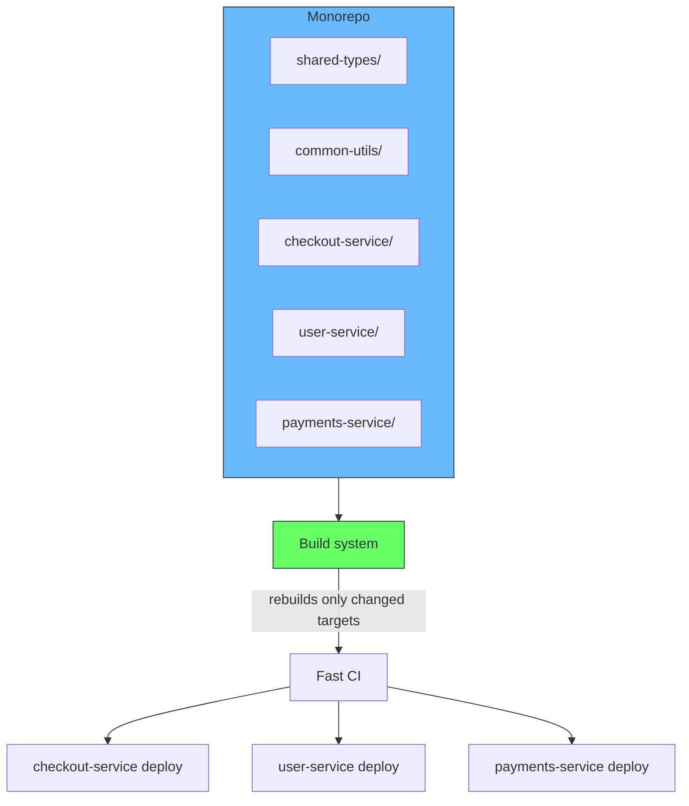
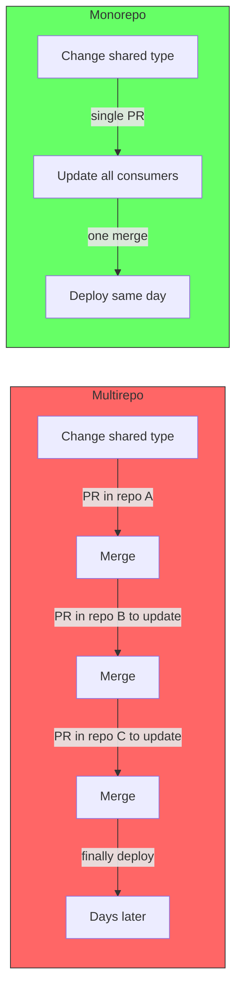
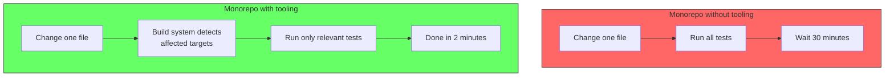
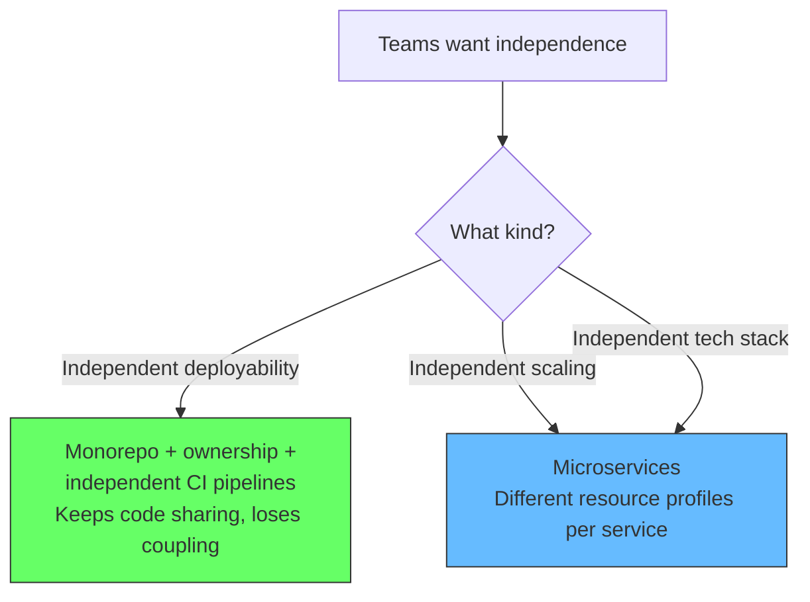
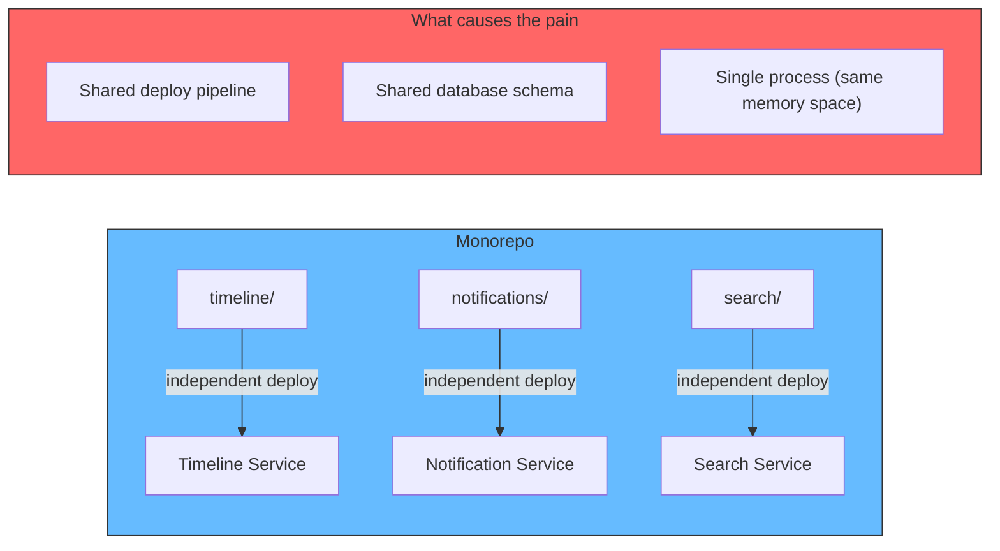

# Monorepo

A monorepo is a repository that contains multiple distinct projects. Those projects can be libraries, services, applications, configurations -- anything. The repo does not dictate how they run or deploy. A monorepo can hold hundreds of microservices, each with its own deploy pipeline, data store, and team ownership.

```
my-project/
  packages/
    shared-types/        # published as @my/shared-types
    common-utils/        # published as @my/common-utils
  services/
    checkout-service/    # deployed independently
    user-service/        # deployed independently
    payments-service/    # deployed independently
  apps/
    admin-panel/         # a separate web app
    customer-portal/     # another web app
  package.json
  tsconfig.json
```



## The problem monorepo solves

Monorepo solves a **coordination problem**, not an architecture problem.

| Problem | How monorepo helps |
|---|---|
| Code sharing across projects | Shared libraries live in the same repo, no need to publish to a package registry for internal use |
| Atomic cross-project changes | Change a shared type and update all consumers in the same commit |
| Unified tooling | One linter config, one CI template, one build tool per repo |
| Cross-project refactoring | Rename a shared interface and every usage is updated in one PR |



## What it requires

A monorepo without proper tooling is a nightmare. Every CI job runs all tests, every change triggers every build, ownership is unclear. The tooling is not optional.



- **Build system**: Bazel, Turborepo, Nx, or Gradle that rebuilds only affected targets
- **Ownership files**: CODEOWNERS or similar to route reviews to the right team
- **Independent CI pipelines**: Each service/app has its own CI config, triggered only when its code changes
- **Dependency management**: Lockfiles, workspace support, and clear dependency graphs

Google runs a monorepo with billions of lines of code and thousands of services. They do not have coordination problems because they have Bazel, ownership files, and independent deploy pipelines -- not because they use a monorepo.

## Monorepo vs multirepo

The real question is not monorepo vs multirepo. It is: do your services own their own deploy pipeline and data store, or are they all tied to the same deploy button and database?



| | Monorepo | Multirepo |
|---|---|---|
| **Code sharing** | Natural -- shared libraries in the same repo | Requires package publishing and versioning |
| **Cross-project refactoring** | Single commit updates all consumers | Multiple PRs across repos, coordinated merge order |
| **Tooling** | Unified -- one config for lint, test, build | Fragmented -- each repo may diverge |
| **CI speed** | Requires build system to avoid running everything | Naturally isolated but may duplicate work |
| **Team autonomy** | Requires CODEOWNERS and independent CI | Built-in -- each team owns their repo |
| **Scaling** | Requires investment in build tooling | Scales naturally but at the cost of duplication |

## Monorepo with microservices

A common reaction to the Twitter monolith-to-microservices story is: "Doesn't a monorepo cause the same conflicts?" The answer is no. The problems Twitter faced were caused by a **monolithic deployment** -- one process, one deploy pipeline, one shared database -- not by storing code in one repository.

Teams often reach for microservices when what they actually need is **independent deployability**. A monorepo with proper ownership files, a build system that only rebuilds changed targets, and independent CI pipelines per team can give that without the operational cost of microservices. They still share common libraries, types, and tooling -- code sharing and deployment independence are not mutually exclusive.



## Relationship to modular monolith

A monorepo is a **repository strategy** (where you store code at rest). A modular monolith is an **architectural pattern** (how you structure code at runtime). They are orthogonal -- you can have either, both, or neither.

| | Monorepo | Multirepo |
|---|---|---|
| **Modular Monolith** | Most common sweet spot. One deployable unit, shared tooling, shared types, clear module boundaries. | Module boundaries are clear but each module is its own repo. Versioning and publishing needed for internal modules. Rarely worth the overhead. |
| **Microservices** | Common at scale. Independent deploys with shared types and tooling. Requires build system and ownership tooling. | Maximum independence. No shared code -- duplication is the cost of autonomy. |

## Summary

A monorepo solves code sharing and coordination problems. It does not dictate your architecture. You can run a monorepo with a modular monolith, microservices, or anything in between. The key is tooling -- a monorepo without a proper build system, ownership files, and independent CI pipelines is just a big repo.
