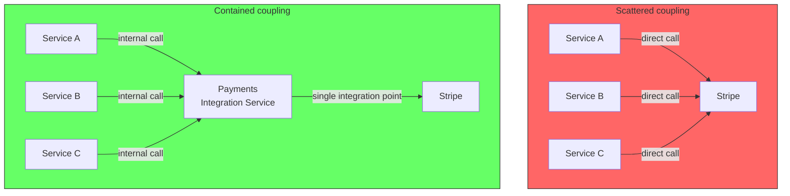
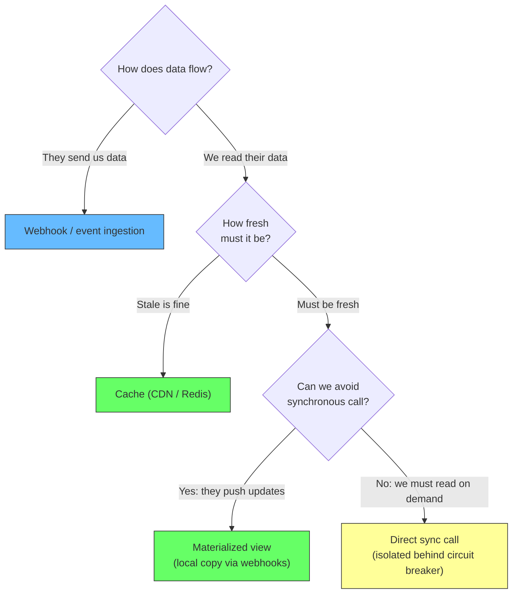
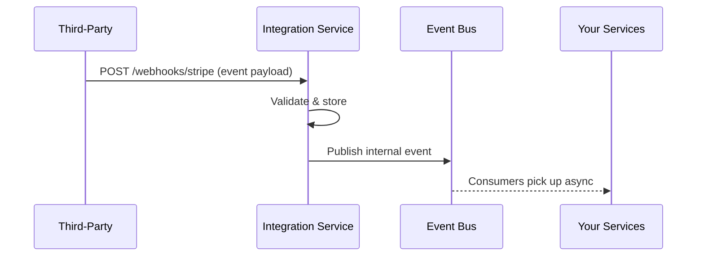
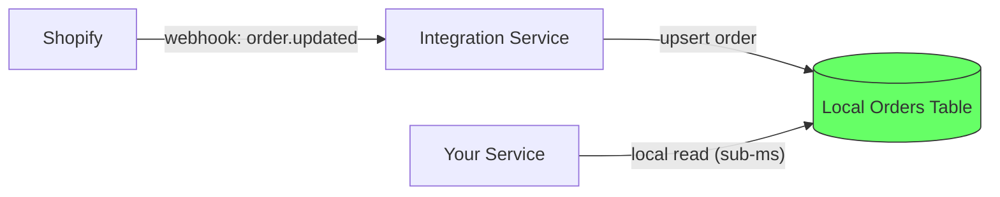
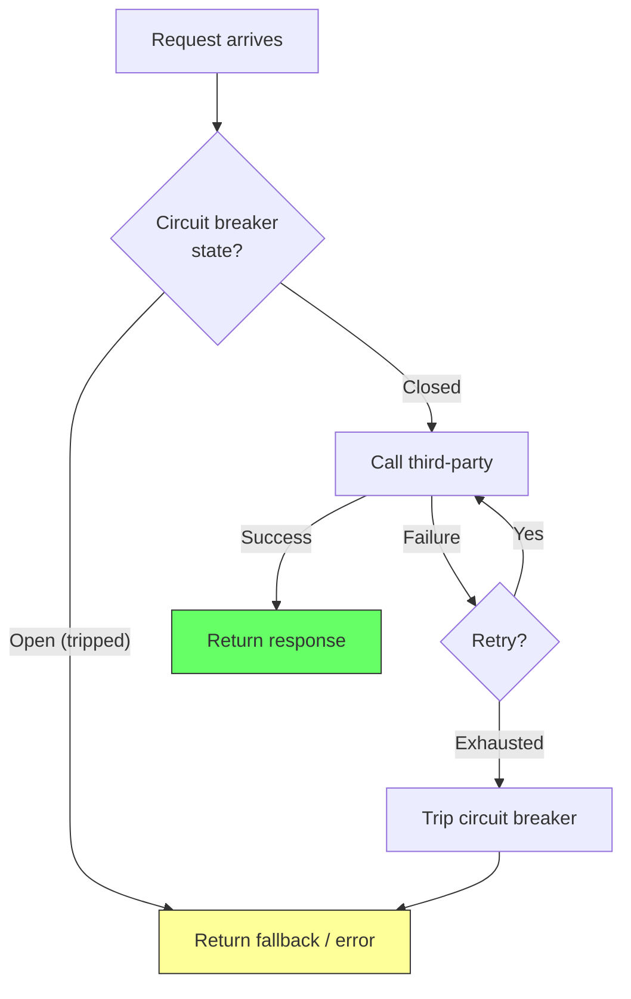
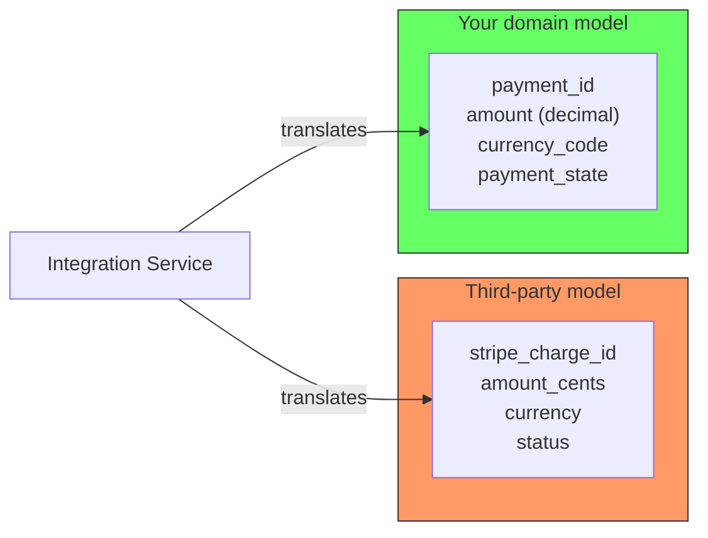

# Third-Party Coupling

Third-party services (Stripe, Twilio, AWS, etc.) are external coupling you cannot eliminate. Unlike your own services, you cannot merge them into a monolith or redesign their API. The question is not how to remove the coupling but how to contain it.

## The containment principle

The worst approach is letting every service in your system talk to the third-party directly. That scatters the coupling everywhere -- any API change, rate limit issue, or outage hits every team.

The fix: put an **integration service** between your system and the third-party. That service owns the API keys, translates between the external model and your domain model, and handles retries, rate limits, and failures. The rest of your system talks to the integration service, never to the third-party directly.

## The integration patterns

The choice depends on the direction of data flow and how fresh the data needs to be.

### Webhook / event ingestion (they push to us)

When the third-party can push data to you, this is the best option. Expose an endpoint that accepts their payload, validate it, store it, and emit an internal event. No synchronous call needed.

Example: Stripe sends `charge.succeeded` to your webhook. Your integration service validates the signature, updates your local ledger, and publishes an event. The rest of your system reacts async.

### Cache (we read, stale is fine)

If you need to read data that changes infrequently and staleness is acceptable, cache aggressively.

| Cache layer | Latency | Freshest data | Best for |
|---|---|---|---|
| CDN (Cloudflare, Fastly) | Edge latency | Minutes | Public product data, pricing, docs |
| Redis / Memcached | ~1ms | Seconds to minutes | Lookup tables, feature flags |
| In-memory (local) | Nanoseconds | Seconds to minutes | Configuration, reference data |

### Materialized view (we read, but can stay fresh via pushes)

The third-party pushes updates via webhooks, and you maintain your own copy of the data. Reads are local (fast), and the data stays as fresh as the webhook latency.

Example: Shopify pushes order updates to your webhook. Your integration service maintains a materialized `orders` table. When your service needs order data, it reads locally instead of calling Shopify's API.

### Direct sync call (must read, cannot avoid)

When you must call the third-party on every request (e.g., payment gateway authorization), the sync call is unavoidable. But you isolate it:

- **Circuit breaker** -- if the third-party is down, fail fast instead of timing out
- **Retry with backoff** -- transient failures get retried, but not in a tight loop
- **Timeout** -- bound the wait so your thread/request is not stuck forever
- **Fallback** -- a default response or an error the caller can handle gracefully

## The facade pattern

The integration service should translate the third-party's model into your domain model. This is the **anti-corruption layer** from Domain-Driven Design.

If Stripe renames `status` to `state`, only the integration service changes. No other service in your system even knows Stripe exists.

## Summary

| Pattern | Data flow | Freshness | Coupling |
|---|---|---|---|
| Webhook / event ingestion | They push to us | Real-time (within webhook delay) | Async, decoupled |
| Cache | We pull | Stale | No network call |
| Materialized view | They push, we store | Fresh within push latency | Async, decoupled |
| Direct sync | We pull on demand | Fresh | Tight, but isolated |
| Facade / anti-corruption layer | Any | Any | Translates model, contains change |

Keep the integration behind **one** service. That service owns the API keys, retries, rate limits, and model translation. Everything else in your system talks to that service -- never to the third-party directly.
