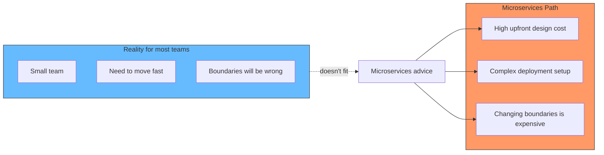
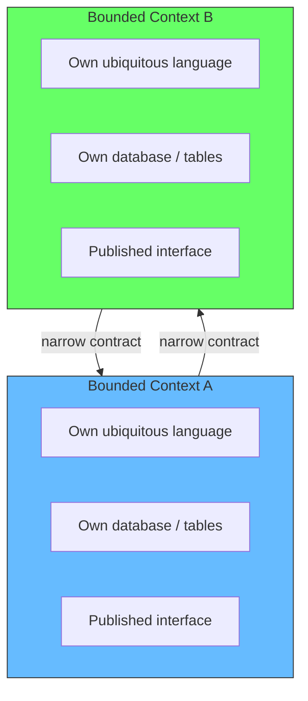
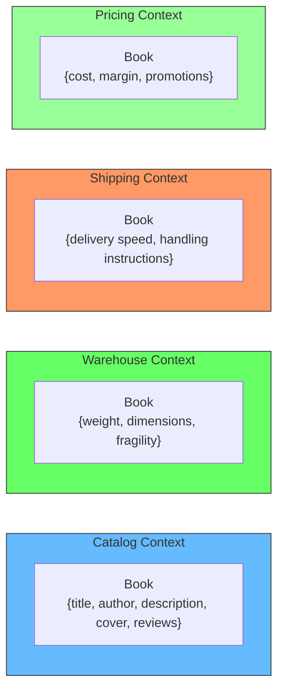
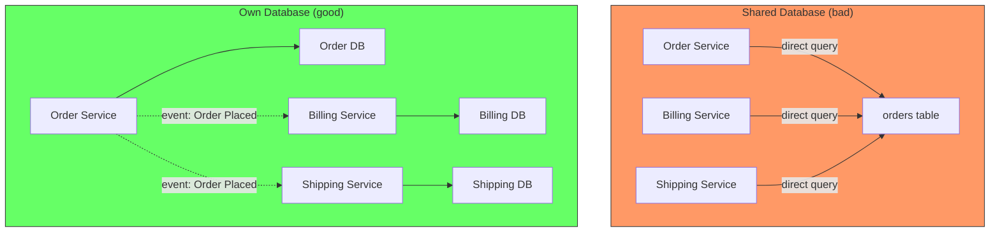
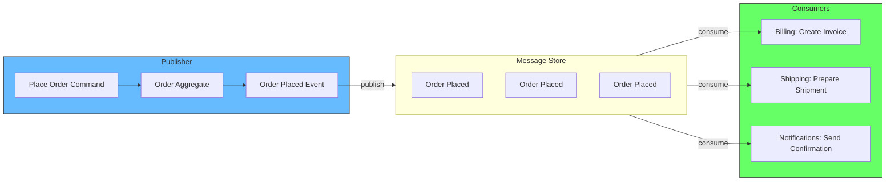
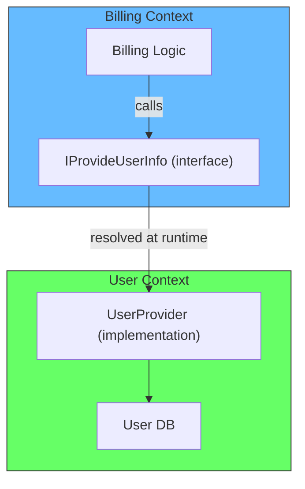
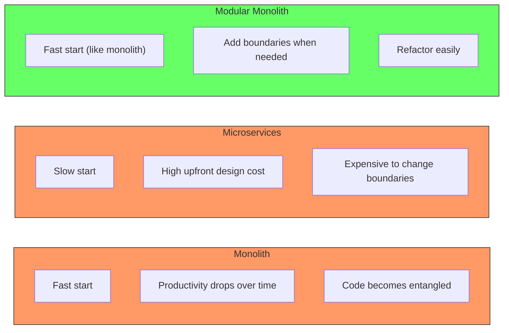
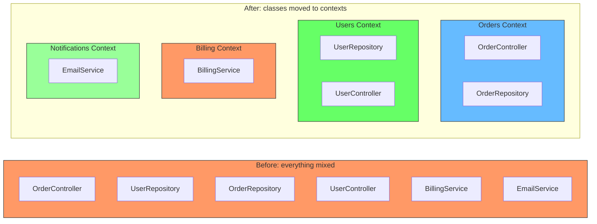
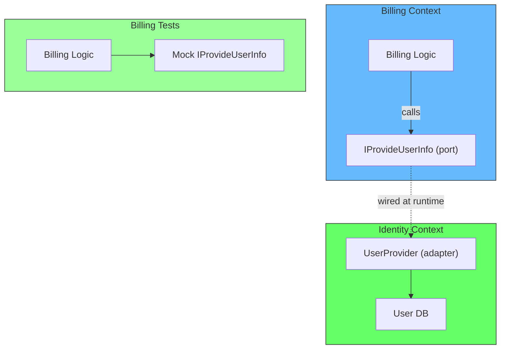

# Bounded Contexts Without Microservices

## The problem: you want boundaries but microservices cost too much

You know your codebase needs boundaries. Without them, every change is slow, every feature touches too many files, and the team steps on each other. Bounded contexts are the answer, but the path to them is unclear.

Most advice jumps straight to microservices. But microservices have a high upfront cost. You need to design the communication between services. You need Docker, orchestration, monitoring, and deployment pipelines. You need your team to have deep operational knowledge. And if you get the boundaries wrong, changing them is expensive — you have to move components between services, introduce new communication patterns, and redesign contracts.



There is a middle path. You can introduce bounded contexts inside a single deployable unit. You get the boundaries, the independence, the loose coupling, and the data ownership — without the operational cost of microservices. This is the modular monolith.

## What a bounded context is

A bounded context is a boundary around a specific model. Inside, everything is consistent and makes sense. Outside, the same terms might mean different things.

Each bounded context has four properties:

| Property | Meaning |
|---|---|
| Independence | It can change without affecting other contexts |
| Loose coupling | It communicates with others through narrow, explicit contracts |
| Own language | The terms inside have meaning specific to this context |
| Own data | It owns its data and exposes it through interfaces, not shared tables |



## The Amazon example: one noun, many meanings

A book at Amazon means different things depending on which department you ask.

The catalog team cares about the cover, the author, the title, the description, and reviews. The warehouse team cares about dimensions and weight — does it fit in a box? The shipping team cares about fragility and delivery speed. The pricing team cares about cost and margin.



If you forced all four teams to share a single `Book` model, every change would require coordination across all teams. The catalog team adding a field would require the warehouse team to deploy. The pricing team changing a promotion rule would need the shipping team to be available. This is the source of coupling in monoliths that never defined boundaries.

Each context owns its own representation. The catalog publishes a `Book` event. The warehouse consumes it and maps it to its own model. The contract between them is the event schema, not the internal database.

## The shared data trap

Sharing a database table between contexts creates an implicit contract. One context writes data. Another reads and interprets it. But you cannot enforce the contract — the database has no concept of "this field is for internal use only" or "you must not query this table directly."



When two contexts share a table, you cannot tell which fields are internal to one context and which form the contract between them. Every query becomes a contract that can break. Every schema change is a negotiation between all consumers.

The rule: each bounded context owns its data. If another context needs that data, it goes through an interface or an event — not a direct database query. This gives each context the freedom to change its internal schema without breaking others.

## Communication between bounded contexts

There are two standard patterns for bounded contexts to communicate.

### Events (async)

One context publishes an event when something happens. Other contexts subscribe to whatever they care about. The publisher does not know who subscribes — it only knows the event schema.



Events are loosely coupled because the consumer only needs to know the event schema. It does not care how the event was triggered, what the publisher does internally, or whether other consumers exist.

A message store is not required but highly recommended. If you store all events, you can deploy a new context and replay the event history to build its state without complex integration.

Handle events asynchronously when possible. If every event triggers synchronous processing, a chain of event handlers can slow down the whole system. Async processing keeps the publisher fast and prevents cascading failures.

### Direct calls through interfaces (sync)

Sometimes you need a synchronous response. The providing context exposes an interface. The consuming context knows the interface but not the implementation.

```csharp
// Interface (contract) - owned by the consuming context
public interface IProvideUserInfo
{
    UserInfo GetUserById(string userId);
}

// Implementation - owned by the providing context
public class UserProvider : IProvideUserInfo
{
    public UserInfo GetUserById(string userId)
    {
        // query own database, apply own logic
        return new UserInfo { Name = "...", Age = 30 };
    }
}
```

The consuming context defines the interface it needs and expects the provider to implement it. This is consumer-owned contracts — the same as ports and adapters.



Testing is easier because the consumer can mock the interface without needing the provider. The provider can change its internal implementation without the consumer knowing.

### Which pattern to use

| | Events | Direct calls |
|---|---|---|
| Coupling | Loose | Medium (depends on contract) |
| When to use | "Tell the world something happened" | "I need an answer right now" |
| Example | Order placed, Payment received | Get user info, Check inventory |
| Failure isolation | Consumer failure does not affect publisher | Provider failure affects consumer |

Use events as the default. Prefer async communication. Use direct calls only when you need a synchronous response and cannot model it as an event.

## The productivity curve

Monoliths start fast. You can go from idea to deployed feature in hours. But over time, the codebase becomes entangled, and productivity drops. Every feature touches multiple modules, tests are slow, and deployments are risky.

Microservices start slow. You need to define boundaries, set up infrastructure, and design communication patterns before you build features. But once established, productivity can grow — unless the boundaries are wrong, in which case you hit a wall.



The modular monolith is the middle path. Start with a monolith. When productivity drops, ask: "can we introduce boundaries?" Do a context map. Move classes into modules. Detect cross-context dependencies. Replace them with events or interfaces. This gives you the boundaries without the upfront cost.

If later you need microservices, the transition is manageable. You already have bounded contexts with explicit communication patterns. Grab one context, extract it into a separate service, and wire it up using the same events and interfaces you already have.

## Steps to introduce bounded contexts in an existing codebase

### Step 1: Create a context map

Draw the boundaries you think exist. This is a rough sketch, not a final design. You can use Event Storming or the noun test from capability-first design.

### Step 2: Move classes into their contexts

Take the classes that clearly belong together and move them into the same module or namespace. Most IDEs support this with a drag-and-drop refactoring. This step alone is an improvement: classes that change together are now grouped together.



### Step 3: Detect cross-context dependencies

Now find every place where a class in one context references a class in another context. These are the coupling points. Not all cross-context references are bad, but every one should be justified.

You can use static analysis tools to measure coupling. PHPStan, ArchUnit, and similar tools can detect cross-context code usage. They can tell you how many direct calls go from context A to context B and which classes are involved.

### Step 4: Replace direct dependencies with communication patterns

For each cross-context reference, decide: should this be an event or a direct call? Introduce the interface or the event handler. Remove the direct reference.

Over time, the modules become independent. You can commit by commit, step by step, remove the coupling between contexts.

## Creating a bounded context from scratch (greenfield)

When starting a new project, you have the chance to get boundaries right from day one. The process is different from refactoring an existing codebase.

### Phase 1: Discover the contexts

Before you write any code, map the domain. You do not need a team workshop for this if you are solo. Use the noun test:

1. List every behavior the system needs
2. Extract the noun from each behavior
3. Group by noun

For a job marketplace:

| Behavior | Noun | Context |
|---|---|---|
| Professional signs up | Professional | Identity |
| Client signs up | Client | Identity |
| Job posted | Job | Jobs |
| Professional sends bid | Bid | Bids |
| Client accepts bid | Bid | Bids |
| Message sent | Message | Messaging |

If two behaviors share a noun, they go in the same context. If they reference different nouns, they are candidates for separate contexts.

### Phase 2: Set up the project structure

Create a folder for each context. The folder is the physical boundary. Everything inside it is internal. Nothing outside imports from it directly — only through public interfaces.

```
src/
  Identity/
    Public/
      IProvideUserInfo.cs       # port (interface)
      UserInfo.cs               # shared return type
    Internal/
      UserRepository.cs          # data access
      User.cs                    # internal model
    CompositionRoot.cs           # registration
  Jobs/
    Public/
      IProvideJobInfo.cs
      JobDto.cs
    Internal/
      JobRepository.cs
      Job.cs
    CompositionRoot.cs
  Bids/
    Public/
      IBidProcessor.cs
      SubmitBidResult.cs
    Internal/
      BidRepository.cs
      Bid.cs
    CompositionRoot.cs
  App/
    CompositionRoot.cs           # wires all contexts together
    Program.cs
```

The `Public` folder is the boundary. Other contexts import from here. The `Internal` folder is private. No context imports from another context's `Internal` folder. Enforce this with a linter or architecture test from day one — it is easier than cleaning up violations later.

### Phase 3: Define the ports and events

Each context publishes what it needs to expose. This includes:

- **Interfaces** for synchronous queries (e.g., `IProvideUserInfo.GetUserById`)
- **Events** for things that happened (e.g., `JobPosted`, `BidAccepted`)
- **DTOs** for the return types (e.g., `UserInfo`, `JobDto`)

Keep the public surface minimal. Only expose what another context genuinely needs. Everything else stays internal.

```csharp
// Public interface in the Identity context
public interface IProvideUserInfo
{
    UserInfo? GetUserById(string userId);
}

// Public event in the Jobs context
public record JobPosted(
    string JobId,
    string ProfessionalId,
    string Title,
    decimal Budget
);
```

### Phase 4: Implement the context in isolation

Build each context as if it were a separate library. It has its own data access. It has its own business logic. It has its own tests. The only way it communicates with the outside world is through its public interfaces and the events it publishes or subscribes to.

Because the context only imports from other contexts' `Public` folders and never from `Internal`, you can test it in complete isolation. Mock the interfaces. Assert the events. You do not need the real database of another context to test the interaction.



This is ports and adapters. The consuming context defines the port. The providing context implements the adapter. The composition root wires them together.

### Phase 5: Wire in the composition root

The composition root is the only place in the codebase where contexts are connected. It registers implementations for each port and sets up event handlers.

```csharp
// App/CompositionRoot.cs
public static void Configure(IServiceCollection services)
{
    // Identity
    services.AddScoped<IProvideUserInfo, UserProvider>();

    // Jobs
    services.AddScoped<IProvideJobInfo, JobProvider>();

    // Billing
    services.AddScoped<IBillingProcessor, BillingProcessor>();
    services.AddScoped<JobPostedHandler>(); // subscribes to JobPosted
}
```

If you change the implementation of a context, you only change the composition root. No other context knows or cares. If a context should no longer be used, you remove its registration. The rest of the system does not change.

### Phase 6: Add a context boundary test

Write one test that verifies no context imports from another context's internal namespace. Most languages have a tool for this. In C# with ArchUnit:

```csharp
[Fact]
public void BillingContext_ShouldNotReference_InternalOfOtherContexts()
{
    var billingAssembly = typeof(BillingContextRoot).Assembly;

    var otherInternals = new[]
    {
        "Identity.Internal",
        "Jobs.Internal",
        "Messaging.Internal"
    };

    billingAssembly
        .Should()
        .NotReferenceClass()
        .That()
        .ResideInNamespace(otherInternals)
        .Check();
}
```

This test is the enforcement mechanism. If someone imports from another context's internals, the build fails. It protects the boundary without requiring manual code review every time.

## Static code analysis for coupling and cohesion

Once you have your contexts, you need tools to measure and enforce boundaries. Manual review does not scale. Static analysis tools catch violations automatically.

### ArchUnit (Java, .NET)

ArchUnit lets you write architecture tests as code. It can enforce that classes in one package do not depend on classes in another, that certain namespaces are only accessed through interfaces, and that the dependency graph follows rules.

```java
// Java example
@Test
void billingShouldNotDependOnIdentityInternals() {
    JavaClasses classes = new ClassFileImporter()
        .importPackages("com.myapp");

    ArchRule rule = classes()
        .that().resideInAPackage("..billing..")
        .should().onlyDependOnClassesThat()
        .resideOutsideOfPackages("..identity.internal..");

    rule.check(classes);
}
```

```csharp
// .NET example
[Fact]
public void BillingContext_OnlyUsesPublicContracts() {
    var result = Types
        .InAssembly(BillingAssembly)
        .That()
        .ResideInNamespace("Billing")
        .Should()
        .NotDependOnAnyTypesThat()
        .ResideInNamespace("Identity.Internal")
        .Evaluate(architecture);
    Assert.True(result.IsEmpty);
}
```

ArchUnit is the most explicit tool. You write the exact boundaries you want and the build fails when they are crossed.

### PHPStan with level max (PHP)

PHPStan at max level detects unused imports and unknown type references. Combined with custom rules, it can flag cross-context dependencies.

The open-source extension `phpstan-extension` for modular architecture adds rules like:

- Classes in module A cannot use classes from module B's internal namespace
- Cross-module access must go through interfaces
- Only the composition root can wire dependencies

### Dependency Cruiser (TypeScript, JavaScript)

Dependency cruiser generates a dependency graph and enforces rules defined in a config file. You can forbid modules from importing across context boundaries, limit the depth of imports, and prevent circular dependencies.

```json
{
  "forbidden": [
    {
      "name": "no-cross-context-internals",
      "comment": "Billing must not import from Identity internal",
      "from": { "path": "src/billing" },
      "to": { "path": "src/identity/internal" }
    },
    {
      "name": "no-circular",
      "comment": "No circular dependencies between contexts",
      "from": {},
      "to": { "circular": true }
    }
  ]
}
```

Run `npx depcruise src` in CI. If someone adds an import from billing to identity internal, the build breaks.

### Modules and interfaces (Go)

Go has built-in module isolation. Each module can define exported and unexported symbols. If you put each context in a separate Go module, the compiler enforces the boundaries. A billing module cannot import from identity's internal package unless identity exports it.

```go
// go.mod for identity module
module example.com/identity

// package identity/internal is not importable from outside
// Only package identity/public is importable
```

Go's module system makes boundary enforcement part of the language, not a separate tool.

### Cargo features and visibility (Rust)

Rust's module system with `pub(crate)` and `pub` visibility lets you control exactly what is visible outside each module. Combined with Cargo workspace features, you can isolate contexts into separate crates within a workspace.

```rust
// Identity crate
pub mod public;  // accessible by other crates
mod internal;    // accessible only within this crate
```

The compiler prevents any crate from importing `identity::internal`. No test, no linter, no CI step — it is enforced at compile time.

### NDepend (.NET)

NDepend generates detailed coupling metrics: afferent coupling (how many types depend on this), efferent coupling (how many types this depends on), and dependency cycles. It can track these metrics over time and fail the build if they exceed thresholds.

### Enforcing from day one

The most important rule: do not wait to enforce boundaries. Add an architecture test or linter rule in the first commit. Once violations exist, cleaning them up is harder than preventing them.

Start with one rule: "No context imports from another context's internal namespace." Add more rules as the codebase grows. The cost of adding the rule early is near zero. The cost of adding it later is rewriting existing code.

## Measuring coupling

Once you have your contexts, measure the coupling between them. Count:

- How many direct calls go from context A to context B
- How many events context A publishes and context B consumes
- How many classes from context A are referenced by context B

Set a target: "context A should not directly reference more than 5 classes in context B" or "all cross-context communication must go through events or interfaces." This gives the team a clear quality bar.

If you see one context that all other contexts depend on heavily, that is a sign of a missing boundary. The heavily-coupled context might need to be split, or the communication pattern might be wrong.

## The modular monolith as the stepping stone

The modular monolith is not just a compromise. It is the pragmatic middle ground.

| | Monolith | Modular Monolith | Microservices |
|---|---|---|---|
| First feature | Hours | Hours | Weeks |
| Refactoring boundaries | Impossible | Possible with effort | Very expensive |
| Operational cost | Low | Low | High |
| Independent deployability | No | No | Yes |
| Path to microservices | Start over | Extract contexts | Already there |

You start with a monolith because you need to validate the idea first. When the product is validated and the team has resources, you introduce boundaries through refactoring. If the codebase grows beyond what a single deployable unit can handle, you extract services.

The modular monolith gives you the boundaries without the overhead. It is the step most teams skip — jumping directly from "no boundaries" to "microservices" — and it is the step that prevents most microservice failures.

## Summary

Bounded contexts give you independence, own language, own data, and loose coupling. You do not need microservices to have them. The modular monolith lets you introduce boundaries gradually, refactor them when they are wrong, and extract them into services only when you need to.

Start with a monolith. When productivity drops, introduce boundaries. Use events as the default communication pattern. Own your data. Measure coupling. Refactor boundaries when they hurt. Extract to microservices only when the monolith cannot scale.

### References

- Evans, E. (2003). *Domain-Driven Design: Tackling Complexity in the Heart of Software*. Addison-Wesley. — Bounded contexts, aggregates, and ubiquitous language
- Fowler, M. (2015). *MonolithFirst*. martinfowler.com. https://martinfowler.com/bliki/MonolithFirst.html — Start with a monolith, extract services when ready
- Brandolini, A. (2013). *Introducing Event Storming*. ziobrando.blogspot.com. https://ziobrando.blogspot.com/2013/11/introducing-event-storming.html — Workshop technique for discovering bounded contexts
- Ploed, M. (2018). *Context Mapping*. DDD Europe. https://www.youtube.com/watch?v=DhMrqX_qrJE — Finding bounded contexts through context mapping
- Newman, S. (2015). *Building Microservices*. O'Reilly Media. — Microservice communication patterns, service boundaries
- Cockburn, A. (2005). *Hexagonal Architecture (Ports and Adapters)*. alistair.cockburn.us. https://alistair.cockburn.us/hexagonal-architecture/ — Consumer-owned interfaces for loose coupling
- Vernon, V. (2013). *Implementing Domain-Driven Design*. Addison-Wesley. — Practical DDD with bounded contexts and aggregates
- ArchUnit. (n.d.). *ArchUnit: A Java architecture test library*. archunit.org. https://www.archunit.org/ — Enforce architecture rules in Java and .NET
- Maier, S. (n.d.). *Dependency Cruiser*. github.com/sverweij/dependency-cruiser. https://github.com/sverweij/dependency-cruiser — Validate module boundaries in JavaScript, TypeScript, and more
- NDepend. (n.d.). *NDepend: .NET Code Quality*. ndepend.com. https://www.ndepend.com/ — Coupling metrics and dependency graph analysis for .NET
