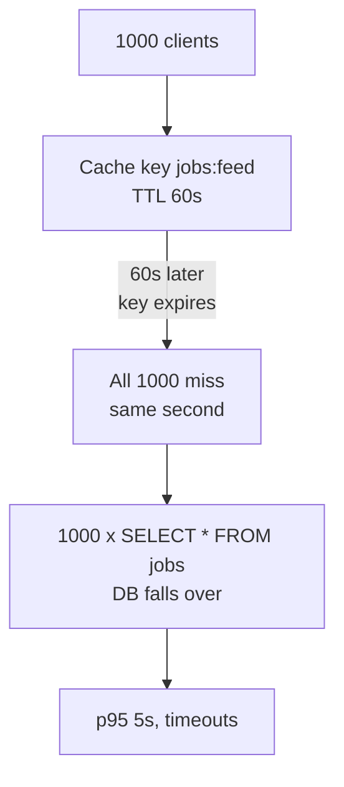
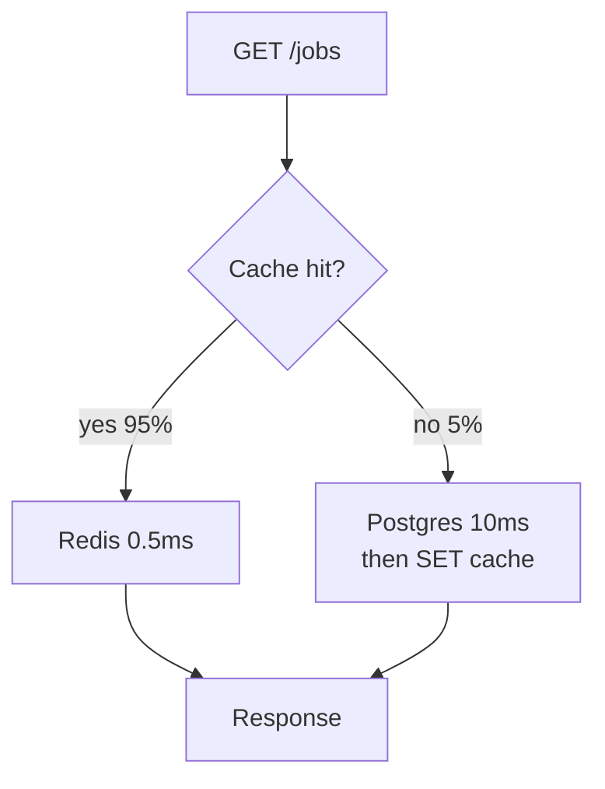
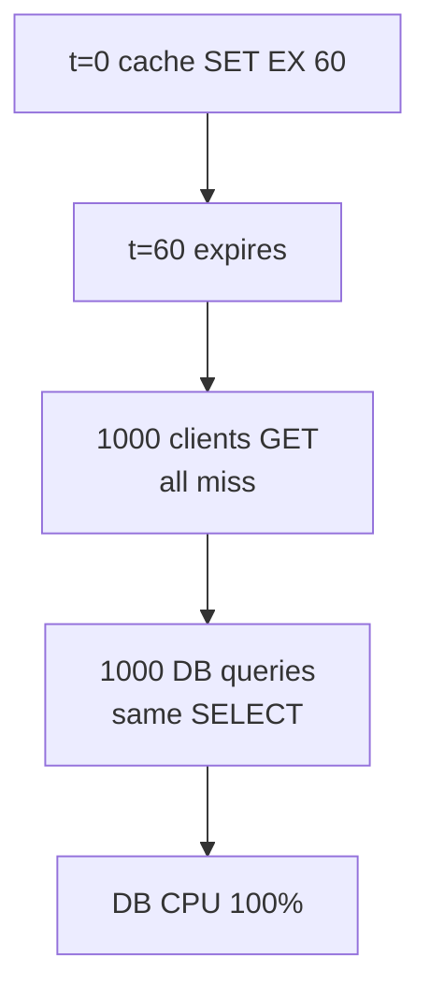
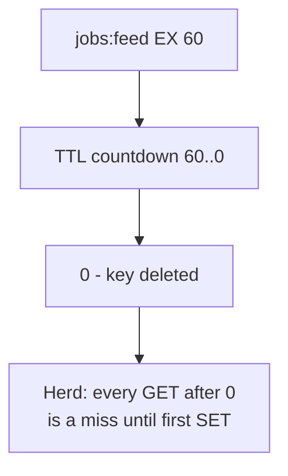
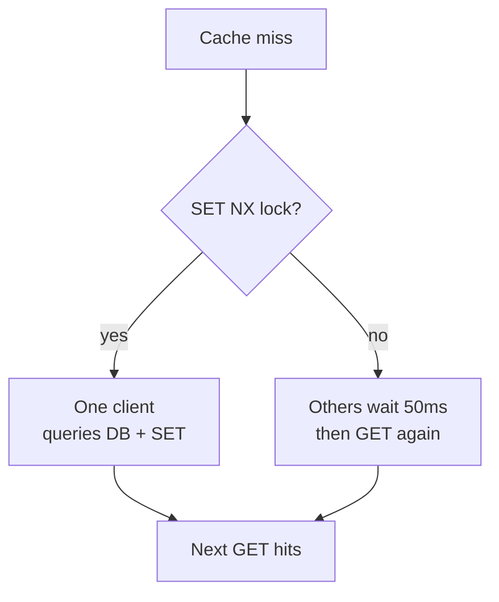
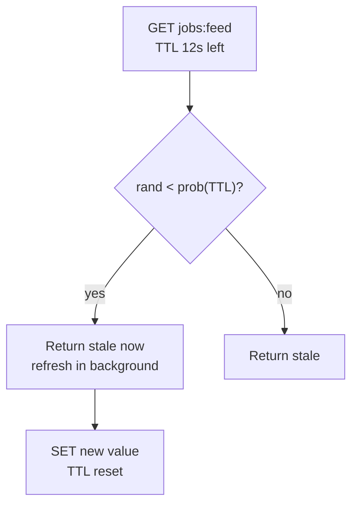
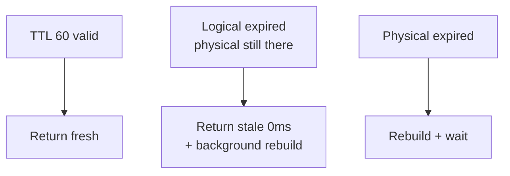
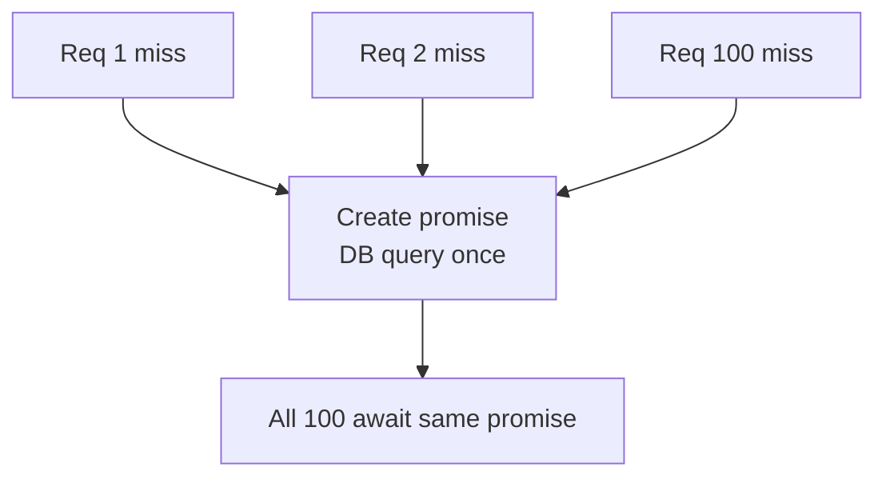
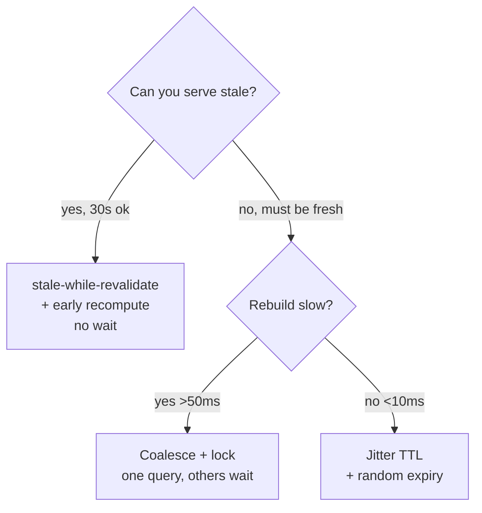

# Cache Stampede - when the cache expires and the database falls over

The cache was added to protect the database. Then the cache expires and the database gets more load than if there was no cache at all. That is a stampede.

<div style={{display: 'flex', justifyContent: 'center'}}>



</div>

Sources: Marc Brooker (AWS), Facebook memcached, Cloudflare, Redis docs, Martin Kleppmann DDIA ch6, Varnish stale-while-revalidate.

---

## What problem caching solved and why it was necessary

### Problem it solved

Databases are slow for repeated reads. A `SELECT * FROM jobs WHERE status='open' ORDER BY created_at` with index still hits disk and costs 10ms. At 1000 req/s that is 10k IOPS. Memory is 1000x faster than disk.

### Why cache was necessary

Cache keeps the hot result in memory. `GET jobs:feed` from Redis is 0.5ms, no DB parsing, no I/O. The DB handles writes, the cache handles reads. Without it you scale DB vertically until it cannot scale.

<div style={{display: 'flex', justifyContent: 'center'}}>



</div>

Cache works when the 95% hit path avoids the DB. Stampede is when the 5% miss path becomes 100% at once.

---

## 1. What a stampede is

### Problem

A hot key `jobs:feed` has TTL 60s. At 60s it expires. 1000 clients that were hitting cache now all miss within 10ms. Each runs `SELECT` and `SET`. The DB gets the spike the cache was meant to prevent.

### Solution

A stampede is a thundering herd on cache miss. It happens on expiry, on cold start, or when a node restarts and cache is empty.

```js
// Naive getOrSet that stampedes
async function getJobs() {
  let data = await redis.get('jobs:feed')
  if (data) return JSON.parse(data)
  data = await db.query('SELECT * FROM jobs WHERE status=$1', ['open']) // 1000 x this
  await redis.set('jobs:feed', JSON.stringify(data), 'EX', 60)
  return data
}
```

<div style={{display: 'flex', justifyContent: 'center'}}>



</div>

You see it as p95 latency spike every 60s, or DB CPU correlated with TTL.

---

## 2. Why TTL expiry causes it

### Problem

Fixed TTL means all clients see expiry at the same wall clock. Even with 1s jitter, if TTL is 60s and traffic is 1000 req/s, 1000 clients still miss in the same second after expiry.

### Solution

Understand the window. TTL is wall clock, not per client. Any hot key with TTL will have a synchronized miss.

<div style={{display: 'flex', justifyContent: 'center'}}>



</div>

Cold start is the same without expiry: deploy clears Redis, first 1000 requests are all misses.

---

## 3. Fix 1 - mutex lock (only one rebuilds)

### Problem

Only one client should rebuild the cache, others wait.

### Solution

Use a lock. First client to miss sets `jobs:feed:lock` with `NX` and short TTL, rebuilds, others wait 50ms and retry `GET`.

```js
async function getJobsWithLock() {
  let data = await redis.get('jobs:feed')
  if (data) return JSON.parse(data)

  const locked = await redis.set('jobs:feed:lock', '1', 'NX', 'EX', 5)
  if (locked) {
    try {
      data = await db.query('SELECT * FROM jobs WHERE status=$1', ['open'])
      await redis.set('jobs:feed', JSON.stringify(data), 'EX', 60)
      return data
    } finally {
      await redis.del('jobs:feed:lock')
    }
  } else {
    await sleep(50)
    return getJobsWithLock() // retry, now likely hit
  }
}
```

<div style={{display: 'flex', justifyContent: 'center'}}>



</div>

This is where the request coalescing you already have fits — same idea, but at the app layer. Use when rebuild is slow and you can tolerate 50ms wait. Needs Redis `SET NX` atomicity.

---

## 4. Fix 2 - early recomputation (probabilistic)

### Problem

Lock adds wait. Can we rebuild before expiry so no miss happens?

### Solution

Recompute early with probability that rises as TTL approaches 0. Facebook memcached does this. At 80% of TTL, 10% of gets trigger background refresh, at 95% 50% does, so the key never actually expires under load.

```js
async function getJobsEarly() {
  const data = await redis.get('jobs:feed')
  const ttl = await redis.ttl('jobs:feed') // seconds left
  if (data && ttl > 5) return JSON.parse(data)
  if (data && Math.random() < earlyProb(ttl)) {
    // background refresh, return stale now
    refreshInBackground()
    return JSON.parse(data)
  }
  // real miss
  return rebuild()
}
```

<div style={{display: 'flex', justifyContent: 'center'}}>



</div>

No waiting, good for hot keys you can refresh async. Needs a background worker.

---

## 5. Fix 3 - stale-while-revalidate (serve stale)

### Problem

Can we serve stale data while rebuilding so no client waits?

### Solution

Store two TTLs. Logical TTL is 60s, but keep stale value for 300s. On miss of logical TTL, return stale immediately and rebuild in background. Varnish and `Cache-Control: stale-while-revalidate=300` do this.

```http
Cache-Control: max-age=60, stale-while-revalidate=300
# client gets stale for 300s after 60s while origin refreshes
```

```js
// Redis with stale
// SET jobs:feed = {data, staleUntil: now+300}
let entry = await redis.get('jobs:feed')
if (!entry) return rebuild()
if (entry.expiresAt < Date.now()) {
  refreshInBackground()
  return entry.data // stale but fast
}
return entry.data
```

<div style={{display: 'flex', justifyContent: 'center'}}>



</div>

Best for read-heavy feeds where 5s stale is okay. QuickHire `GET /jobs` feed can be stale 30s, `GET /jobs/1` detail cannot.

---

## 6. Fix 4 - request coalescing (single flight)

### Problem

Even with lock, 1000 clients still do 1000 `GET` retries. Can we coalesce at the app?

### Solution

Single flight: if 100 requests for `jobs:feed` are in flight, run DB query once, share the promise.

```js
const inflight = new Map()
async function getJobsCoalesced() {
  let data = await redis.get('jobs:feed')
  if (data) return JSON.parse(data)
  if (inflight.has('jobs:feed')) return inflight.get('jobs:feed')
  const p = db.query('SELECT * FROM jobs').then(d => {
    redis.set('jobs:feed', JSON.stringify(d), 'EX', 60)
    inflight.delete('jobs:feed')
    return d
  })
  inflight.set('jobs:feed', p)
  return p
}
```

<div style={{display: 'flex', justifyContent: 'center'}}>



</div>

You already have this pattern in `software-engineering/request-coalescing.md`. Use it per process, combine with Redis lock for multi-instance.

---

## When to use which

<div style={{display: 'flex', justifyContent: 'center'}}>



</div>

| Fix | Wait? | Stale? | Needs | When to use |
|---|---|---|---|---|
| Mutex lock | Yes 50ms | No | Redis `NX` | Rebuild slow, freshness required, key not too hot |
| Early recompute | No | Briefly | Background worker | Hot keys, can refresh async |
| Stale-while-revalidate | No | Yes 300s | Store stale | Feeds, `GET /jobs`, where stale is okay |
| Coalescing | No | No | In-memory map | Single instance, duplicate requests in flight |
| Jitter | No | No | `EX 60+rand(10)` | Low traffic, simple |

QuickHire feed: `stale-while-revalidate 30s` + `coalescing` in Node. Job detail: `mutex lock`.

---

### Links

*   Marc Brooker - Cache stampede notes, AWS
*   Facebook - memcached early recompute
*   Cloudflare - stale-while-revalidate
*   Redis `SET NX EX` docs, DDIA ch6 - replication and caching
*   ../software-engineering/request-coalescing.md - single flight pattern
*   ../databases/sql-introduction.md - `EXPLAIN ANALYZE` to see the DB spike

