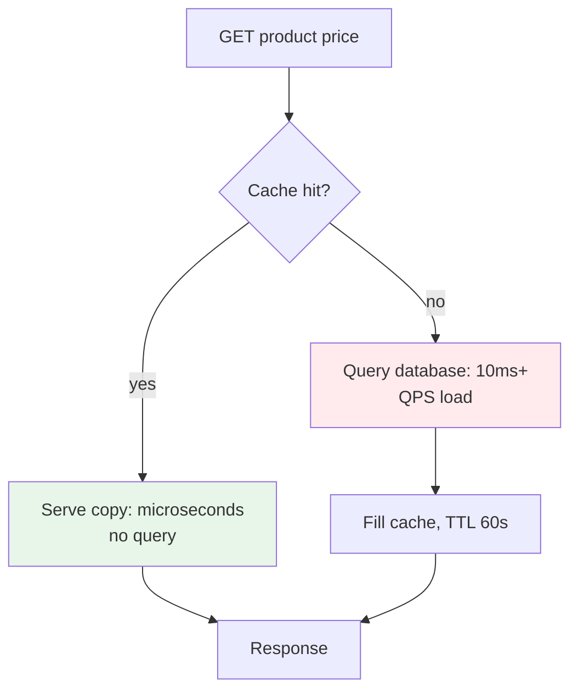
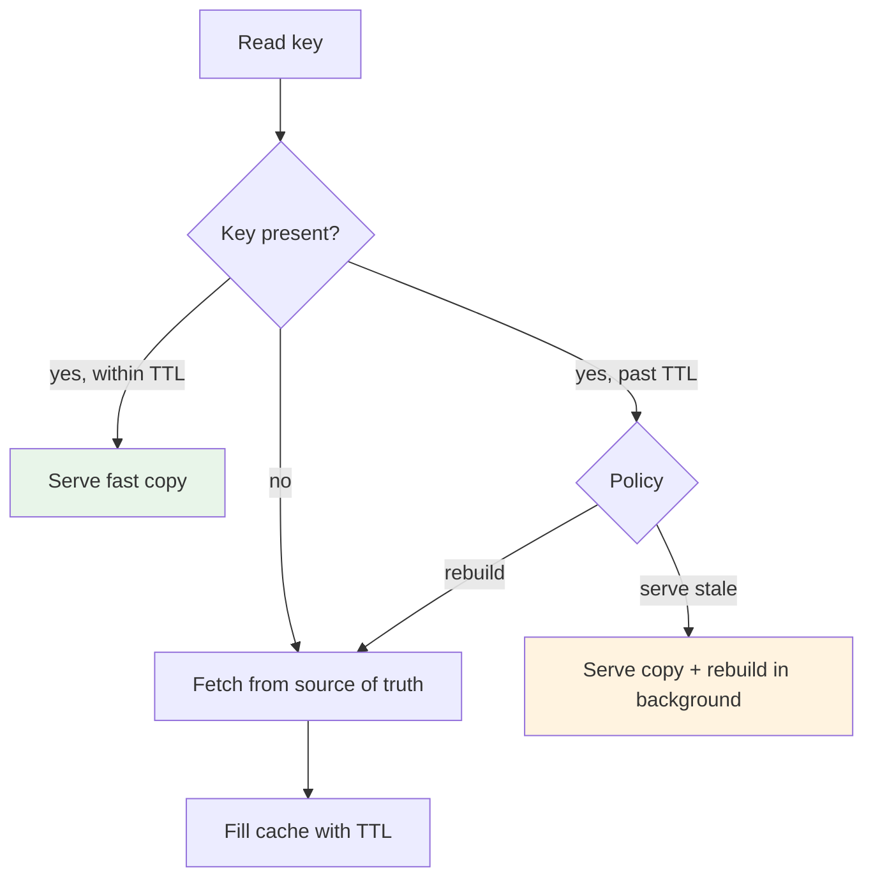
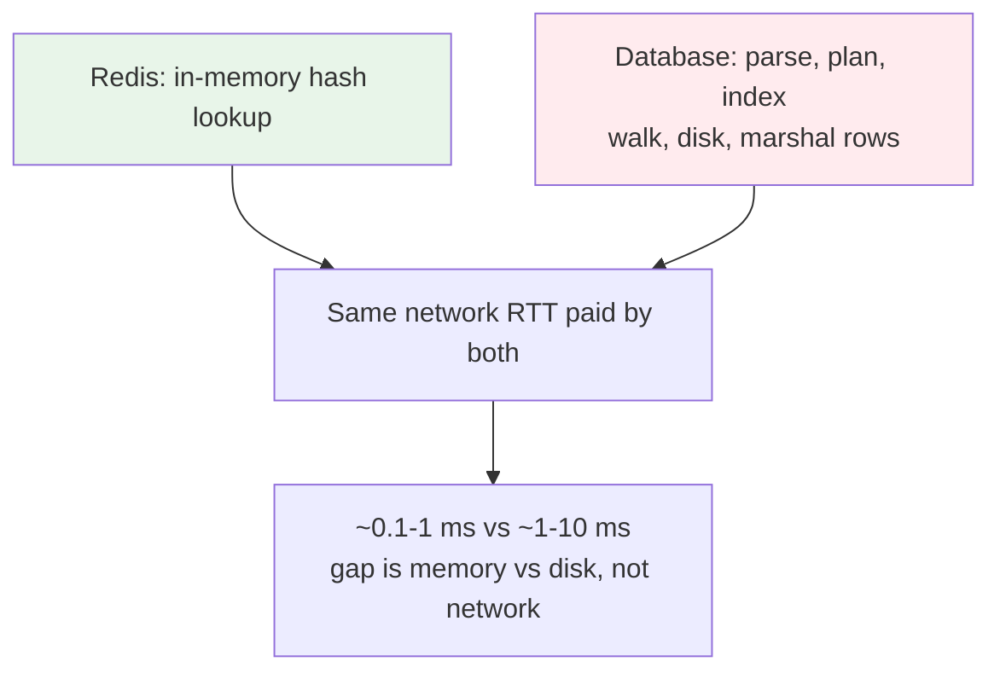
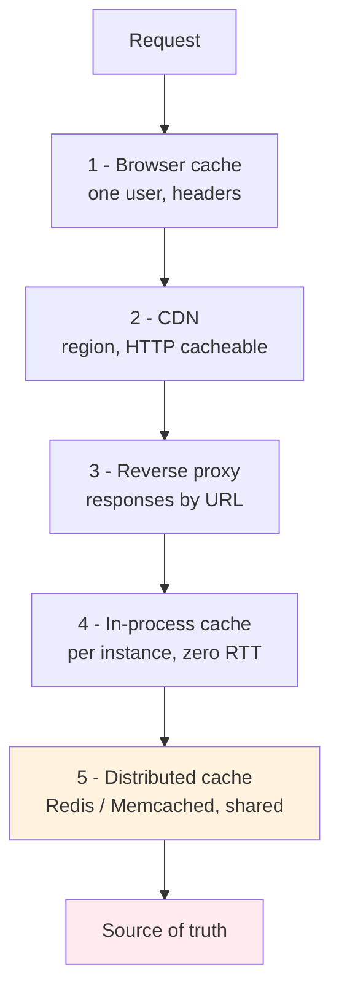
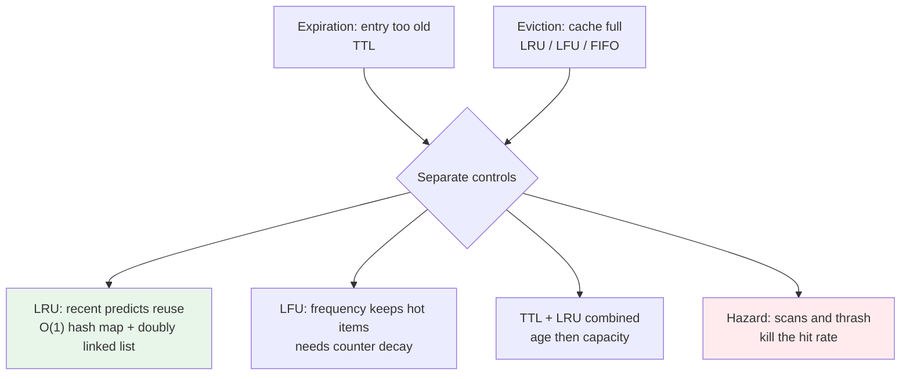
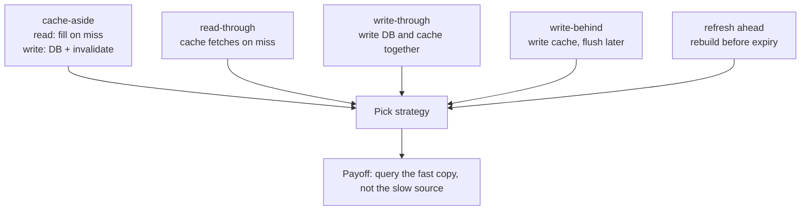
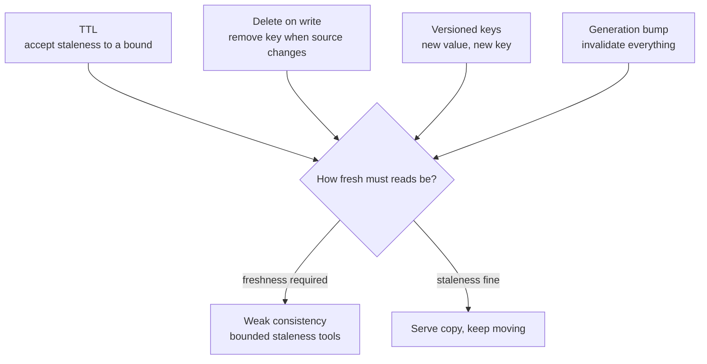
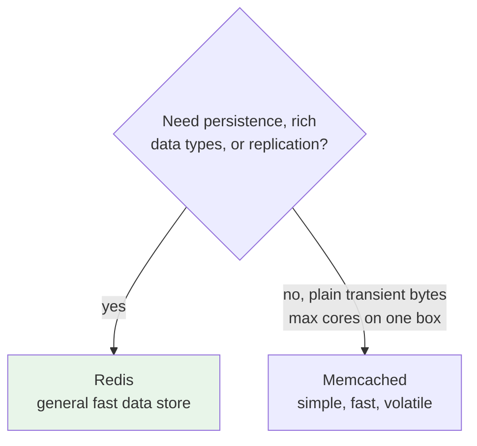
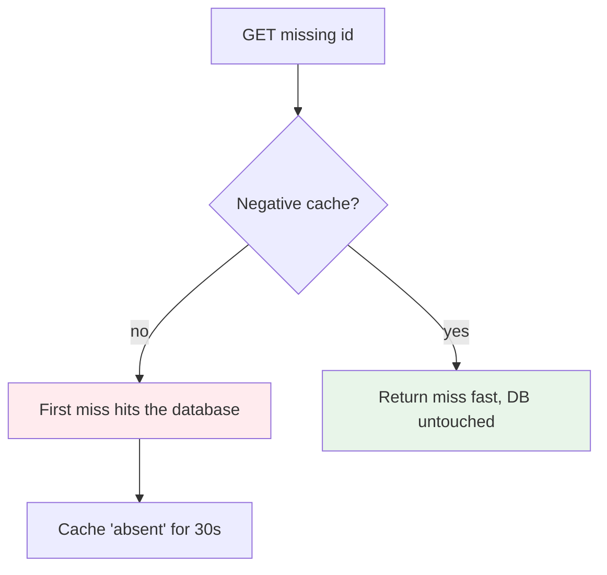
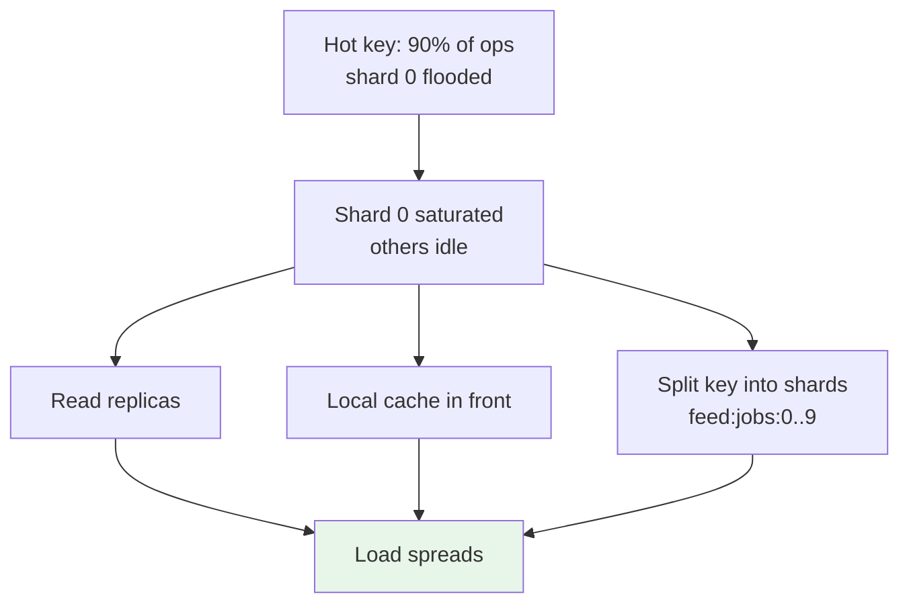

# Caching: How It Works, the 5 Layers, and the Strategies

> A cache is a faster copy placed closer to the reader. The moment you add one, you accept that the copy can differ from the source of truth. All of caching is choosing where the copy sits and how you keep it good enough.

This is the fundamentals article for roadmap section 5 (Caching & Storage). It covers how caching works, the 5 layers, and the write and invalidation strategies. For what happens when your cache misses all at once, see [Cache Stampede](../production-insights/cache-stampede.md).

## 1. The problem: reads repeat, and each one is expensive

Every read has a cost. A database fetch is ~10ms, an API call 50-500ms, and under load those costs scale with every repeated request. The expensive part is not the query, it is how often the same answer gets computed over and over.

Caching exists for one reason: the hottest data is read far more often than it changes. A popular product price is read thousands of times a second and changes a few times a day. So instead of recomputing the answer every time, you compute it once, keep the result where it is cheap to read, and serve that copy on the hot path.

The read path becomes two paths. The fast path is a memory lookup. The slow path is the source of truth plus refilling the cache. You win when the fast path serves most requests.

This is why the cache is often described with the 95/5 rule. If 95% of reads hit the cache, the database only sees 5% of the traffic. The miss rate is the real quality metric, not the cache size.

## 2. How a cache works: key, value, TTL, and fill path

A cache has three parts you control and one you do not:

*   **A bounded store.** Memory is limited, so the cache must evict entries when full (LRU is the usual policy).
*   **A key and a value.** The key is what the reader asks for. The value is the freshly computed or fetched result.
*   **A lifetime.** TTL, time to live, says how long the copy is trusted. After TTL the entry is a candidate for staleness or removal.
*   **A fill path.** The code that computes or fetches the value on a miss and puts it in the store.

Every read hits one of three states:

*   **Hit.** Key present and within TTL. Served from memory, no further work.
*   **Miss.** Key absent or expired. Fetch from the source of truth, fill the cache, answer.
*   **Stale.** Key present but past TTL. The copy still exists, so you can choose to serve it (bounded staleness) or rebuild. This third state is what the stampede and staleness articles build on.

The trade begins here: a cache is a second copy of data, so it can disagree with the source of truth. TTL bounds how long the disagreement may last. Everything else in this article is about shrinking that window without losing the speed benefit.

## 3. The numbers: how much slower is the database, really

Design interviews keep coming back to one table: latency numbers. What matters is the ratio, not the exact value:

| Operation | Typical time |
|---|---|
| L1/L2 CPU cache | ~1-10 ns |
| Main memory (RAM) | ~100 ns |
| Redis GET/SET | ~0.1-1 ms |
| Same-datacenter network round trip | ~0.2-0.5 ms |
| SSD random read | ~100 µs |
| Simple database query | ~1-10 ms |
| HDD seek | ~10 ms |

The numbers to quote in an interview: a Redis GET is about 0.1-1 ms and a simple database read about 1-10 ms. A cache hit at ~100 µs against a ~5 ms database read is the 50x improvement people use as the reference figure. That ratio is why the 95/5 rule from section 1 is so powerful: cutting 95% of reads off the database removes almost all of the expensive path.

And here is the point that answers "how can Redis be that much faster if both hit a network." Both paths pay the network. A Redis and a Postgres in the same datacenter share the same round trip, ~0.2-0.5 ms. The gap is what each server does after the packet lands. Postgres parses SQL, builds a plan, walks indexes, touches disk or its buffer pool, and marshals rows. Redis hashes a key in memory. The database does orders of magnitude more work per request for the same network cost, so the difference is memory vs disk plus query work, not network. Say that explicitly and you sound like you have operated the stack, not memorized it.

## 4. The 5 layers of caching

Between the user and the database there are five places a copy can sit. Each layer is cheaper to hit than the one behind it, and each layer has a smaller audience than the one in front of it.

**Layer 1: Browser cache.** `Cache-Control` and `ETag` headers let the browser serve assets and GET responses without contacting your server at all. The audience is one user. The cost of staying in sync is HTTP headers.

**Layer 2: CDN.** Copies static assets and cacheable responses at the edge, near the user. The audience is a region or the whole world. See the CDN section of the roadmap for day 2 coverage.

**Layer 3: Reverse proxy.** Nginx, Varnish, HAProxy, sitting one hop in front of the app, cache full responses by URL or by key computed at the proxy. The audience is all requests to that entry point.

**Layer 4: Application in-process cache.** A map or memoization table inside the app instance. Zero network round trip, but per instance: each replica has its own copy, so writes must invalidate everywhere or accept divergence.

**Layer 5: Distributed cache.** Redis or Memcached, a shared store every instance reads. It survives instance restarts and is where "cache" usually means Redis. Bonus on the same level: the database's own buffer pool and query cache sitting under everything.

A request walks the layers from top to bottom and stops at the first hit. That is the practical design rule: put the copy as close to the reader as the freshness requirements allow. Cache static assets in the browser, images at the CDN, aggregated list responses at the proxy, per-request configuration in process, and cross-service hot feeds in Redis.

## 5. Eviction: what leaves when the cache is full

A bounded cache has to drop entries, and it uses two different controls that interviews test separately. Expiration removes an entry because it is too old (TTL). Eviction removes an entry because the cache is out of capacity. A fresh entry can be evicted to make room, and a stale entry can sit in memory until someone reads it. Age and capacity are different decisions.

**LRU, least recently used,** evicts the entry not touched for the longest. It is the default, because recent access predicts near-future reuse, and it is implementable in O(1) with a hash map plus a doubly linked list. That exact "implement an LRU cache" is one of the most asked coding questions, and its LFU variant is the common hard follow up.

**LFU, least frequently used,** evicts the entry with the fewest accesses. It keeps perpetually hot items that LRU would drop as soon as they go quiet for a few seconds. It needs frequency counts and can keep yesterday's favorites forever, so production LFU adds decay, like Redis aging its 24-bit counter over time.

Both share a known failure: a one-time scan touches every key once, fills the cache, and evicts the hot working set. That is the scan resistance problem, fixed with a segmented cache or an admission policy that filters one-time reads. The related failure is thrashing, the cache smaller than the working set, so entries are evicted almost as fast as they load and the hit rate collapses.

FIFO and random exist for simplicity and uniform access patterns. TTL belongs to expiration, LRU and LFU to capacity.

## 6. The strategies: who fills the cache and who invalidates it

The strategies differ in who moves data between the cache and the source of truth. They are easiest to remember by the read path and the write path they imply.

**Cache-aside (lazy load).** The application reads the cache first, and on a miss fetches from the source, fills the cache, and carries on. Writes go to the source, and the application invalidates or updates the cache key. This is the default for most services because it is easy and it fills the cache only with data actually asked for.

**Read-through.** The cache itself fetches from the source when it does not have the value. The application talks only to the cache. This is cache-aside with the fetch logic moved inside the cache layer.

**Write-through.** The write updates the source of truth and the cache in the same operation. The cache never goes stale from a write, but every write now costs two writes.

**Write-behind (write-back).** The write lands in the cache first and is flushed to the source asynchronously. Fastest writes and the cache always has the newest value, but a crash before flush loses data. Use only when losing a few writes is acceptable or the flush is idempotent and retried.

**Refresh ahead.** Background refresh before expiry replaces the miss with a scheduled rebuild. This is the family the stampede article calls early recomputation.

Rule of thumb: start with cache-aside. It pairs naturally with the invalidation in the next section, and you can evolve to read-through or write-behind only when a specific hot path proves it needs it.

The four write strategies differ in what a write costs and what you accept in exchange:

| Strategy | Write path | Read path | Accepts | Best for |
|---|---|---|---|---|
| Cache-aside | DB only, invalidate key | fill on miss | stale window | most services, the default |
| Read-through | DB only | cache fills itself | stale window | read-heavy, cleaner app code |
| Write-through | DB + cache together | always fresh | slower writes | read-your-writes, sessions |
| Write-behind | cache only, flush async | always fresh | data loss on crash | write-heavy, counters, analytics |

## 7. Invalidation: the hard part

TTL is the simplest invalidation: accept staleness up to a bound, let expiry take care of the rest. It works, but it gives up precision. When a price changes at 14:00 and the TTL says 60s, you knowingly serve the old price for up to a minute.

Where correctness matters, you invalidate explicitly:

*   **Delete on write.** The write path removes the cache key so the next read repopulates from the new source value. This is the natural pair for cache-aside.
*   **Versioned keys.** Put a version in the key name. A new version means a new key, old readers keep the old copy until they move, and nothing is ever modified in place.
*   **Generation bump.** One global counter or version number is part of every key. Bumping it invalidates everything at once. Expensive, but useful when a bulk change touches a large fraction of the cache, and it beats deleting thousands of keys one by one.

The invalidation rule that prevents most surprises: never invalidate on a read, only on the write that changes the data. And never pretend the cache is consistent when it is not. The bounded-inconsistency view of all this lives in [Stale is Eventual](../production-insights/stale-is-eventual.md) and [Strong vs Eventual Cache](../production-insights/strong-vs-eventual-cache.md).

## 8. Redis vs Memcached

Both are in-memory key-value stores, and for a plain session or lookup-table cache they behave the same. The differences decide the choice:

**Redis.** Persists data (RDB snapshots, AOF append log), so a restart does not lose everything. Has rich data types: lists, sets, sorted sets, hashes, streams, which let you build queues, leaderboards, and counters inside the cache. Supports replication and clustering, so it can hold much more memory than one server. Ops run on a single thread per instance, which gives simple semantics and atomic Lua scripts. Redis is the default for almost anything beyond pure caching, and many systems use it as a general fast data store.

**Memcached.** Keeps values in memory only, no persistence, no data types beyond bytes and strings. Uses multiple threads and an efficient memory allocator, so on one large box it can serve more concurrent throughput than a single-threaded Redis instance. Because there is no persistence and no replication to coordinate, it is simple and rock solid for transient caches where losing a copy on restart is fine.

The practical rule: start with Redis. It covers sessions, rate limits, pub/sub, and its data types replace a lot of application code. Reach for Memcached when you have a huge single-node cache, mostly large blobs, and the simplicity and threading model of Memcached beat what Redis gives you.

## 9. Failure modes: hot keys, penetration, and the stampede

Three problems show up under load, and interviews ask you to name the failure and its fix for each starts with the demand on the cache.

**Cache penetration.** Reads for keys that never exist fall through the cache every time and hammer the source, because there is nothing to cache. The fix is negative caching: cache the absence with a short, separate TTL so repeated misses stop reaching the database.

**Hot keys and hot partitions.**

A cache is only as safe as its load distribution. With many keys the load spreads evenly, but traffic is rarely even. A single hot key, one event, one celebrity product, one feed, can absorb 90% of the operations.

Sharding does not save you here. Consistent hashing spreads keys across nodes, so the hot key lands on exactly one shard, and that shard melts while the others idle. The symptom to watch is one shard at 100% CPU or memory while its siblings are quiet.

The fixes are the same family as the stampede fixes and usually combine them:

*   **Read replicas** of the hot key or of the cache itself, so one copy does not serve everyone.
*   **Local in-process cache** in front of the shared one, so most reads never reach the hot shard.
*   **Shard by a key component.** Instead of one key `feed:jobs`, use `feed:jobs:0` to `feed:jobs:9` and read all ten, spreading the traffic across shards.

**Cache stampede.** The hot key's expiry and a stampede are the same event: the coordinated miss in [Cache Stampede](../production-insights/cache-stampede.md) is exactly what happens to a hot key the instant it expires. Handle hot keys and you handle most of the nasty cache production incidents at once.

## 10. What interviews test under caching

Caching questions appear in every system design round, and they cluster into a small set. Map each cluster to its section in this article so a question maps straight to an answer:

| What they test | Sample question | Covered in |
|---|---|---|
| Fundamentals | what is a cache, hit vs miss | section 1-2 |
| Latency ratio | how much slower is a DB read than Redis | section 3 |
| Placement | where would you put a cache | section 4 |
| Eviction | LRU vs LFU, implement an LRU cache | section 5 |
| Write strategies | which pattern fits this workload | section 6 |
| Invalidation | how do cache and DB stay consistent | section 7 |
| Tool choice | Redis vs Memcached | section 8 |
| Failure modes | stampede, penetration, hot key | section 9 |

The framing interviewers reward, from the question banks reviewed: name the source of truth, define the cache key and its scope (per process, shared, per user), describe the workload (read/write ratio, skew, staleness tolerance), choose the load and write path, separate expiration from eviction, protect the miss path on hot keys, and decide what happens when the cache is down. Start answers at the request path, speak in trade-offs, and pick cache-aside as the default unless the workload proves it needs stricter consistency.

## 11. The rules you can keep

*   Cache reads, design writes. Every strategy question is really a question about the write path.
*   Add layers from the outside in. Browser and CDN first, proxy and process cache next, shared cache last.
*   Start with cache-aside plus TTL, and add explicit invalidation only where freshness is a correctness requirement.
*   Measure the miss rate, not the hit count. A growing miss rate at fixed traffic is a TTL problem hiding.
*   Treat a shared cache as load-bearing infrastructure once services depend on it: capacity plan it, monitor it, and test the degraded path when it is down.
*   Never let the miss path scale with the herd. On a hot key, expiry and a stampede are the same event.

### Sources

*   AWS Builders' Library - [Caching Challenges and Strategies](https://aws.amazon.com/builders-library/caching-challenges-and-strategies/) - the canonical practical treatment of caching layers, strategies, and their failure modes
*   Redis documentation - [Redis vs Memcached](https://redis.io/docs/latest/operate/oss_and_stack/management/memcached/) and [Key eviction](https://redis.io/docs/latest/reference/eviction/) - persistence, data types, and eviction policy differences
*   Memcached - [FAQ](https://github.com/memcached/memcached/wiki/FAQ) - threading model and no-persistence design
*   Martín Kleppmann - [Designing Data-Intensive Applications](https://dataintensive.net/) ch 6 - how caching sits in front of databases and the stale data semantics of replication and caching
*   HTTP caching - [MDN HTTP Caching](https://developer.mozilla.org/en-US/docs/Web/HTTP/Caching) and RFC 9111 - `Cache-Control`, `ETag`, `stale-while-revalidate` for browser and proxy layers
*   Jeff Dean and Peter Norvig - [Latency Numbers Every Programmer Should Know](http://norvig.com/21-days.html) - memory, disk, and network latencies that back the 10-100x gap
*   Redis - [Diagnosing latency issues](https://redis.io/docs/latest/operate/oss_and_stack/management/optimization/latency/) - intrinsic latency floor (~100-200 µs), TCP ~200 µs vs unix socket ~30 µs
*   Devinterview.io - [50 Caching Interview Questions](https://devinterview.io/questions/software-architecture-and-system-design/caching-interview-questions/), TechPrep - [68 Caching Interview Questions](https://www.techprep.app/blog/caching-interview-questions), and DesignGurus - [Caching for System Design Interviews](http://designgurus.io/system-design-interview/concepts/caching) - the question clusters mapped in section 10
*   PracHub - [Caching Interview Questions: Eviction, Stampedes, and Consistency](https://prachub.com/resources/caching-interview-questions-for-backend-engineers-eviction-stampedes-and-consistency) - expiration vs eviction as separate controls, negative caching, and the answer framing

### See also

*   ../production-insights/cache-stampede.md - the coordinated miss, and 4 fixes trading wait vs stale
*   ../production-insights/stale-is-eventual.md - why serving stale is bounded eventual consistency
*   ../production-insights/strong-vs-eventual-cache.md - lock for strong, stale for eventual, the PACELC trade
*   ./request-coalescing.md - single flight: turning a stampede into one call
*   ./development-stories.md - a cache on the critical path is load-bearing infrastructure