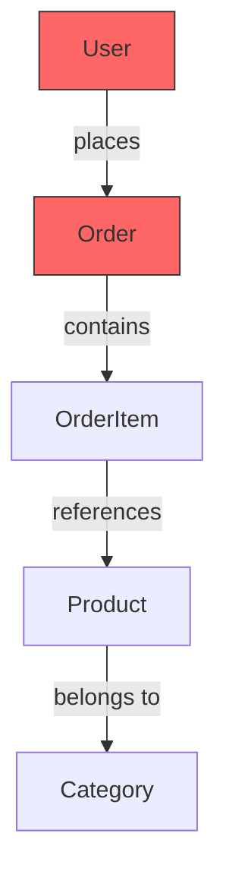
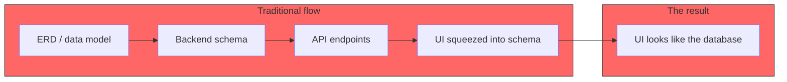
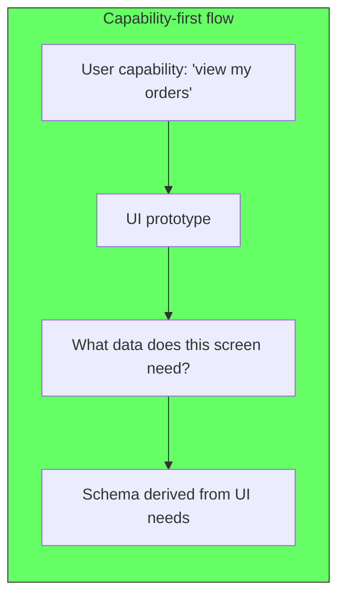
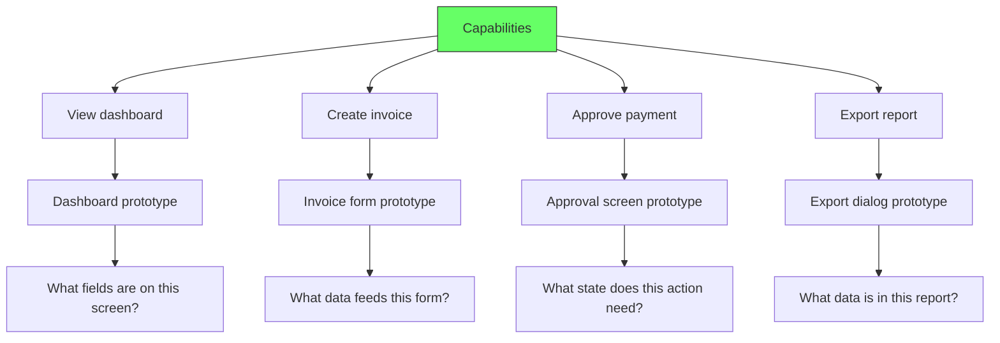
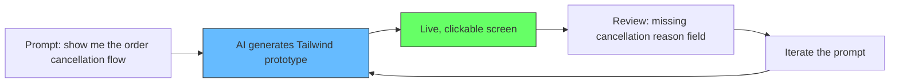
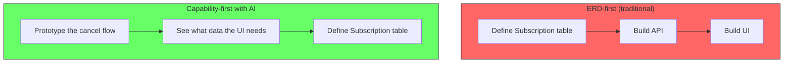
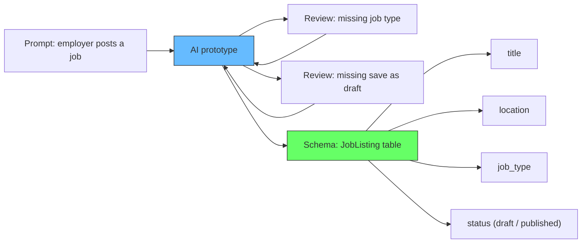
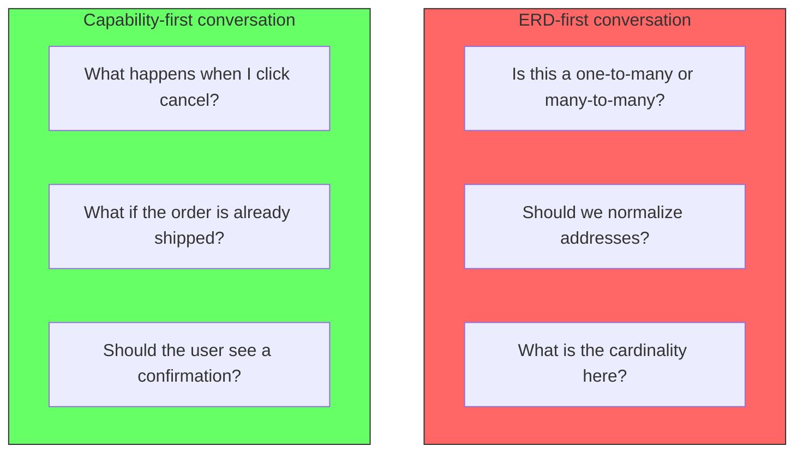

# Capability-First Design

## The problem: starting with tables

Most design processes begin with a data model. Open a whiteboard, draw boxes for entities, connect them with relationships, define attributes. The ERD comes first.



The ERD is about structure. It answers "what data do we store?" It does not answer "what can the user do here?" The entire design conversation happens before anyone sees a screen. By the time the UI is built, the data model is committed, and the UX is squeezed into whatever the schema allows.

The result: interfaces that mirror database tables. Users see forms fields that correspond to columns. Navigation reflects foreign keys. The software models the database, not the user's workflow.



## The solution: capability-first with throwaway prototypes

Capability-first design starts with one question: **what can the user do here?** Capture the workflow, the decisions, the inputs and outputs from the user's perspective. Data comes later.



A capability is a complete action a user can take. "Place an order" is a capability. "View order history" is a capability. "Cancel a subscription" is a capability. Each capability maps to a screen or a set of screens.



## How AI makes this practical

The traditional objection to capability-first is that prototyping every screen takes too long. Wireframes, mockups, HTML templates — each adds overhead. Teams default to ERD-first because drawing boxes on a whiteboard is faster than building a UI.

AI removes that tradeoff. A prompt like "make a Tailwind UI for viewing and canceling orders" produces a working prototype in 30 seconds. The screen is clickable. It shows real layout, real states, real interactions. You can look at it and immediately see what's missing, what's confusing, what data the screen actually needs.



This is the key shift. The prototype is not a deliverable. It is a thinking tool. You throw it away after the design conversation. The data model that emerges from it is what you keep.

```
Example prompt chain:

1. "Make a page that shows a user their active subscriptions"
   → AI generates a cards layout with subscription name, price, next billing date

2. "Add a cancel button that opens a confirmation dialog"
   → AI adds the dialog with a reason dropdown

3. "Show what happens after cancellation — a confirmation screen"
   → AI adds a success state with next steps

4. "What data does this page need?"
   → Now derive the schema: subscription id, plan name, price, status,
     next billing date, cancellation reason, cancelled date
```

The data model falls out of the UI naturally. You never start with "Subscription has a status field and a cancelled_at timestamp." You start with "the user needs to see their subscriptions and cancel one." The schema is whatever that capability requires.



## A concrete example: the job board

A team wants to build a job board. The ERD-first approach starts with entities: Company, JobListing, Application, User. The team spends two days defining relationships, foreign keys, and nullable columns. Then they build the API. Then they build the UI. On day five, they realize the "post a job" flow requires a preview step that was not accounted for in the schema. The status column needs a new value. The UI is fighting the data model.

The capability-first approach starts with one prompt:

> "Make a page where an employer posts a new job. Show a form with title, description, location, salary range, and a preview button."

The AI generates the form in seconds. The team looks at it and notices: there is no field for "job type" (remote, hybrid, onsite). They add it. They see the preview screen and notice it shows a "publish" button but no "save as draft" option. They add it. Thirty minutes of iteration produces a complete picture of what the "post a job" capability actually involves.

Now they derive the schema from the prototype. The JobListing table needs: title, description, location, salary_min, salary_max, job_type, status (draft, published). The schema is correct because it was derived from a real workflow, not guessed in advance.



## What this changes about the design conversation

In an ERD-first meeting, the conversation sounds like: "Does an Order belong to a Customer or a User? Is the line item a separate entity or an embedded collection? Should we normalize the address?"

In a capability-first meeting with a prototype, the conversation sounds like: "When I click cancel, what happens? Should I see a confirmation? What if the order is already shipped? What if there is a cancellation fee?"

The first conversation is about data structure. The second is about user experience. The second conversation surfaces real requirements. The first conversation surfaces imaginary problems.



## The disposable repository

To make this practical, have a simple repository with Tailwind CSS and a basic HTML file or a React component setup. No routing, no state management, no API calls. Just a folder where you prompt AI to generate screens, look at them, refine the prompt, and generate again.

The repository is disposable. It contains no business logic. It is a prototyping surface. When the design conversation is done, the screens are deleted. What you keep is the schema and the capability map that emerged from the exercise.

```
prototype-repo/
  index.html       # single HTML file with Tailwind CDN
  or
  app.tsx          # single React component, no routing
  styles.css

Prompt the AI to generate directly into this file. Each iteration overwrites the previous prototype. There is no history to preserve. The prototype is not the product. It is a tool for thinking.

## UI libraries for prototyping

The right library makes AI prototypes look polished with minimal prompting. These are the best options for a disposable prototyping repo:

**shadcn/ui** — The most popular choice. Beautiful, accessible components that look like they belong in a real product. AI models know it well and generate accurate shadcn code consistently. Built on Radix primitives, so accessibility is baked in. Works with Tailwind CSS. https://ui.shadcn.com

**DaisyUI** — Component classes for Tailwind CSS. No JSX, no props, just HTML classes. This makes it ideal for single-file prototypes (index.html with Tailwind CDN). Add `btn btn-primary` and you get a styled button. AI generates DaisyUI reliably because it is just class names. https://daisyui.com

**Radix UI** — Headless primitives (dialog, dropdown, popover, tooltip). No styling, only behavior. Pair with Tailwind for full control. Good when the prototype needs real interactions (accessible modals, menus) without committing to a design system. AI works with Radix well because the API is stable and well-documented. https://www.radix-ui.com

All three work with AI code generation and produce production-quality UIs. Pick based on how much styling you want out of the box: DaisyUI (most), shadcn (medium), Radix (least).

## Summary

| | ERD-first | Capability-first with AI |
|---|---|---|
| Starting point | Data entities | User actions |
| Conversation | Cardinality, normalization | Flow, states, edge cases |
| Feedback loop | Days (build UI after schema) | Seconds (iterate the prompt) |
| Schema quality | Guessed upfront | Derived from real screen needs |
| Risk | Build wrong thing correctly | Build right thing from the start |

Capability-first does not mean no data modeling. It means the data model serves the user interface, not the other way around. AI-generated throwaway prototypes make this practical because the cost of a prototype is near zero. The question is no longer "should we prototype?" The question is "what capability do we need to understand next?"
