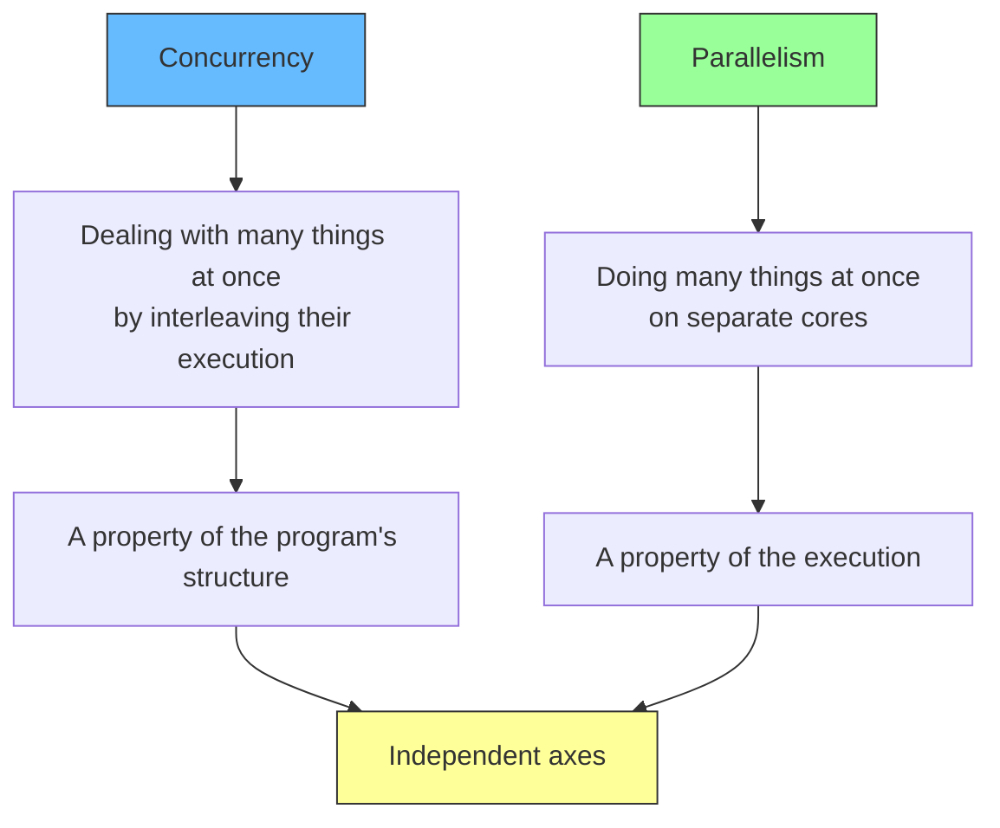
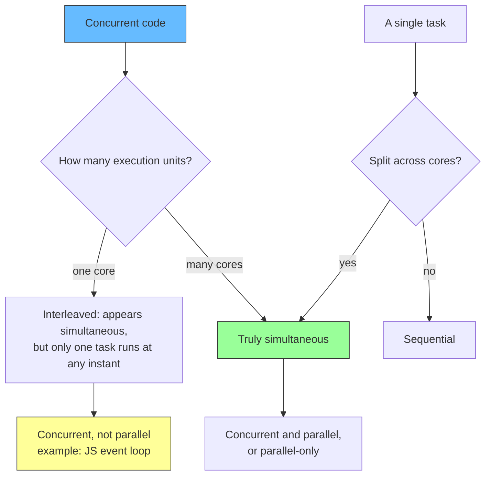
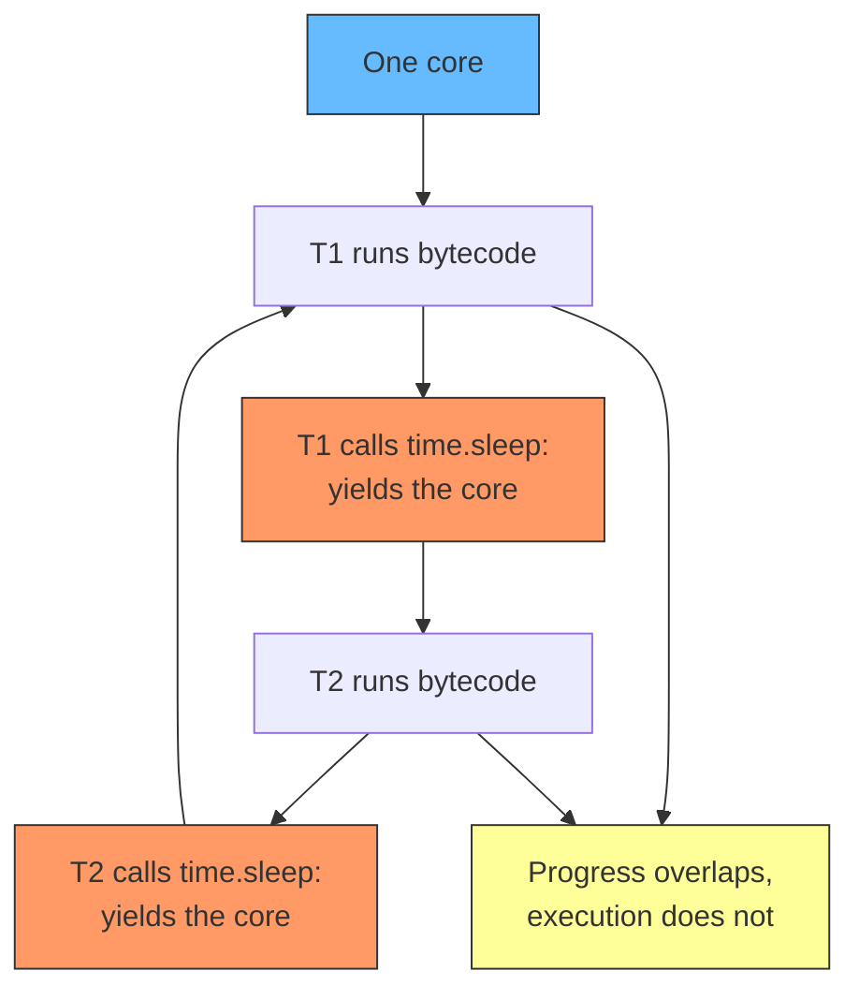
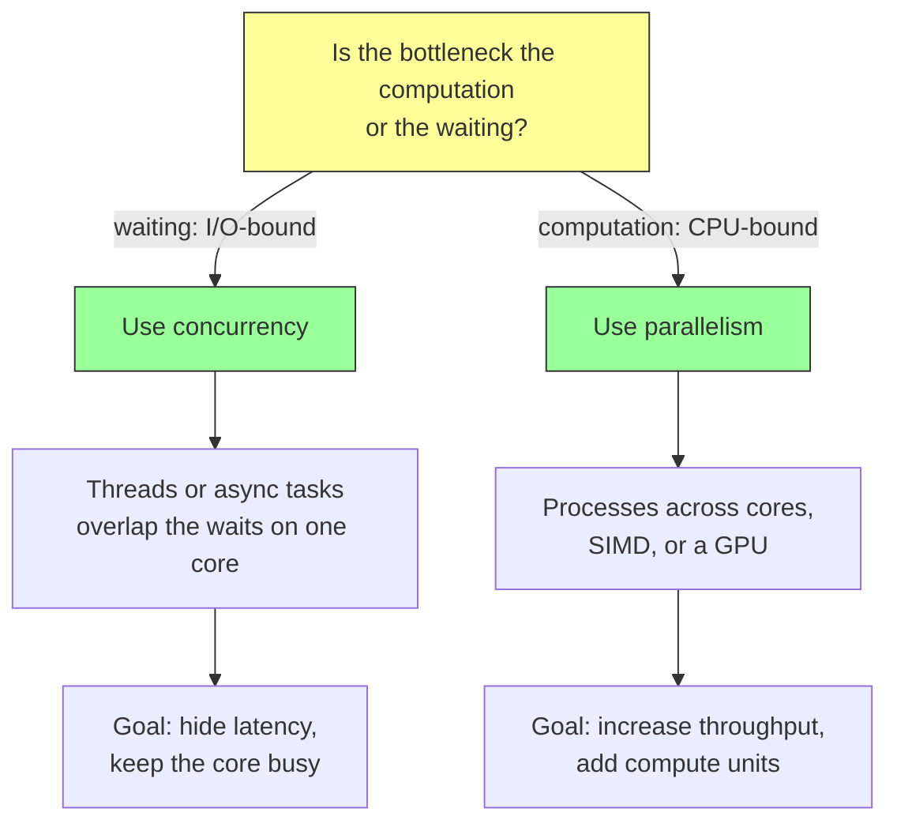
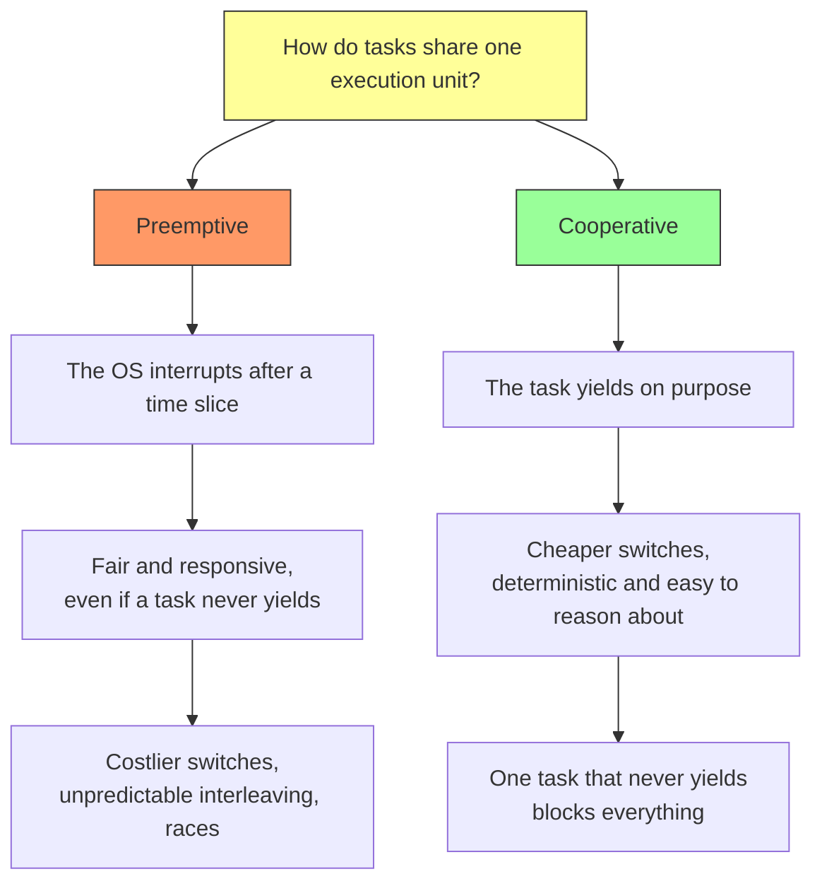
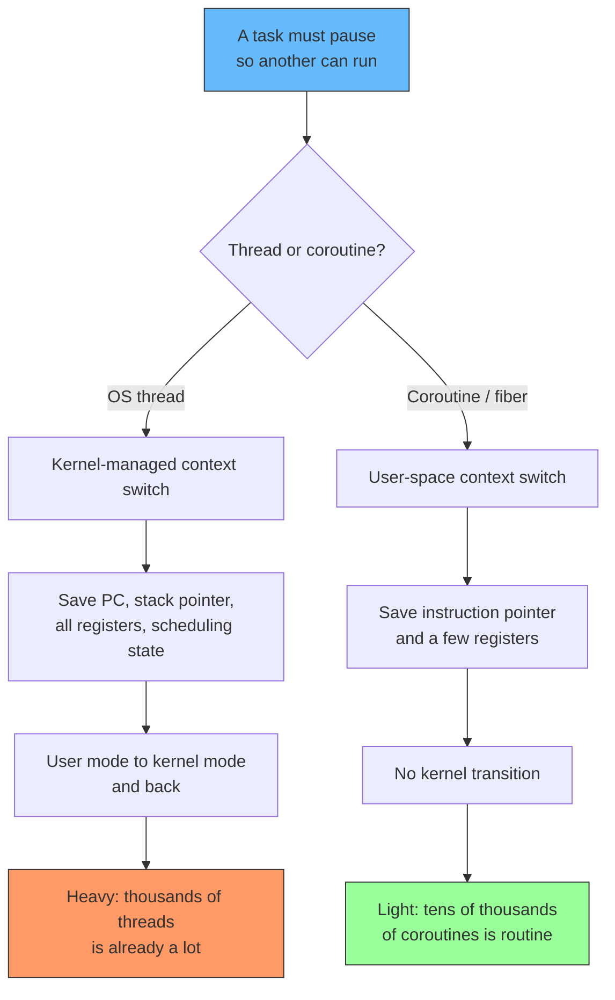
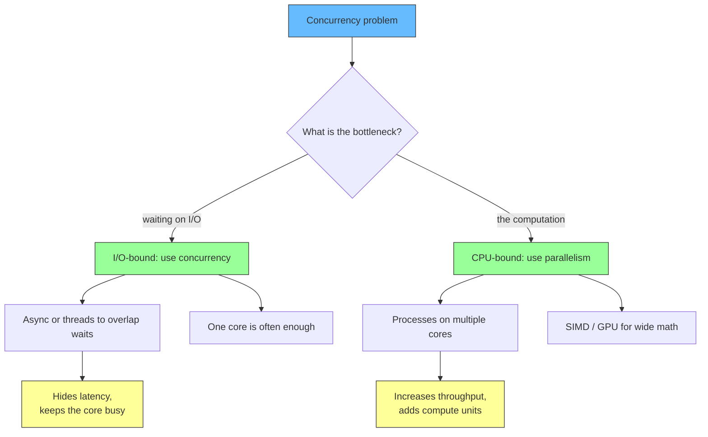

# Concurrency vs. Parallelism: Interleaving, Cores, and the Cost of Switching

*Part of the concurrency series. Based on [Concurrency vs. Parallelism by The Coding Gopher](https://www.youtube.com/watch?v=jfgQxS4WDxg).*

## TLDR

- **Concurrency is a program's ability to handle multiple tasks by interleaving their execution.** The tasks progress independently and can be paused and resumed, but they are not necessarily running at the same physical instant. On one core, this is done by time slicing (the scheduler swaps tasks) or by voluntary yielding (a task gives up the core).
- **Parallelism is truly simultaneous execution.** Multiple tasks run at the same instant on separate CPU cores or processors. It requires more than one execution unit.
- **They are different axes.** Concurrent code can run on a single core and only *appear* parallel; parallel code can be a single task split across cores. Concurrency is about structure, parallelism is about execution.
- **The workloads differ.** Concurrency is for **I/O-bound** work, where the bottleneck is waiting (disk, network, database) and the core would otherwise sit idle. Parallelism is for **CPU-bound** work, where the bottleneck is the computation itself.
- **Scheduling comes in two flavors.** **Preemptive**: the OS forcibly interrupts a running task after a time slice, which guarantees fairness and responsiveness but costs more and makes interleaving unpredictable. **Cooperative**: tasks yield on purpose, which is cheaper and more predictable but lets one non-yielding task freeze everything.
- **Concurrency is not free; a context switch has a price.** A thread switch is managed by the kernel and saves a full execution context (program counter, stack pointer, registers, scheduling state) plus a user-to-kernel transition. A coroutine or fiber switch happens in user space, saves almost nothing, and can be tens of thousands of times cheaper.

## The two words, and why they are not synonyms

Concurrency and parallelism get used as if they meant the same thing. They do not, and the difference decides which tool you reach for.

**Concurrency** is a program's ability to handle multiple tasks by *interleaving* their execution. The tasks progress independently and may be paused and resumed over time, but they are not necessarily running at the same physical instant. This is interleaved execution: several logical threads of control share a single CPU core, and the core moves between them either through time slicing or through voluntary yielding.

**Parallelism** is *truly simultaneous* execution: multiple tasks running at the same time on separate CPU cores or processors.

Rob Pike's summary is the one to keep: *concurrency is about dealing with lots of things at once; parallelism is about doing lots of things at once.* Concurrency is a property of a program's **structure**; parallelism is a property of its **execution** ([Concurrency is not parallelism](https://go.dev/blog/waza-talk)).

<div style={{display: 'flex', justifyContent: 'center'}}>



</div>

Because they are independent, there are four combinations, and only one of them is "both":

| | **not parallel** | **parallel** |
|---|---|---|
| **not concurrent** | a plain sequential program | one task split across cores (SIMD, a parallel map over a list) |
| **concurrent** | many tasks interleaved on one core (Python threads, the JavaScript event loop) | many tasks on many cores (Python `multiprocessing`, goroutines scheduled across cores) |

## The confusion in practice: concurrent code that looks parallel

The reason the two words blur together is that concurrent programs can *appear* to run in parallel even when there is only one thread or core, and parallel programs are usually concurrent too.

- A single-threaded JavaScript event loop handles many events "at once" from the programmer's point of view, even though the interpreter never runs two JavaScript functions at the same instant.
- Training a neural network runs matrix multiplications in parallel across many CPU cores or GPU cores, and those operations genuinely execute simultaneously.

In the first case the work is concurrent without parallelism. In the second it is parallel. Seeing one does not imply the other.

<div style={{display: 'flex', justifyContent: 'center'}}>



</div>

## Concurrency on one core: interleaved execution

The clearest way to see interleaving is two threads that keep waiting on I/O, running on a single core. In CPython, the global interpreter lock (GIL) permits only one thread to execute Python bytecode at a time, so these threads cannot be parallel. They are concurrent: when one blocks, the other gets the core.

```python
# Two workers that each wait on I/O, on one core.
# CPython's GIL lets only one thread execute bytecode at a time,
# so they interleave; they never run simultaneously.
import threading
import time

def worker(name, delay):
    for _ in range(3):
        print(f"{name} start I/O")
        time.sleep(delay)  # releases the GIL, so the other thread runs
        print(f"{name} I/O done")

t1 = threading.Thread(target=worker, args=("T1", 0.1))
t2 = threading.Thread(target=worker, args=("T2", 0.1))
t1.start(); t2.start()
t1.join(); t2.join()
```

The output interleaves (`T1 start`, `T2 start`, `T1 done`, ...), and at no instant are both threads running Python. When `time.sleep` is called, the active thread yields the CPU and the other one runs. This is why threads are efficient for I/O-bound tasks such as network requests: while one thread is blocked on a wait, another makes progress.

The GIL is the detail that trips people up in Python specifically. It means ordinary threads do *not* give you parallelism for CPU-bound work. The interpreter is changing this: PEP 703 defines an optional free-threaded build, available experimentally in Python 3.13 and later, that removes the GIL ([PEP 703](https://peps.python.org/pep-0703/)).

<div style={{display: 'flex', justifyContent: 'center'}}>



</div>

## I/O-bound vs CPU-bound: which tool the workload wants

The distinction between the two concepts matters most when you are picking a tool, and the deciding question is what the program is actually waiting on.

- **I/O-bound.** Most of the time is spent waiting for an external resource: a disk read, a network response, a database query. The CPU is idle during those waits. Concurrency helps, because it schedules another task during the wait. This improves CPU utilization without adding hardware. Concurrency *hides latency*.
- **CPU-bound.** Most of the time is spent computing: compressing video, training a model, computing fractals. The CPU is the bottleneck. Parallelism helps, because it divides the work across more compute units. This *increases throughput* ([Concurrency vs. Parallelism, The Coding Gopher](https://www.youtube.com/watch?v=jfgQxS4WDxg)).

| | I/O-bound | CPU-bound |
|---|---|---|
| bottleneck | waiting on external resources | the computation itself |
| the CPU is | mostly idle | fully busy |
| best tool | concurrency (threads, async) | parallelism (processes, SIMD, GPU) |
| what it improves | latency hiding and utilization | throughput |

<div style={{display: 'flex', justifyContent: 'center'}}>



</div>

## Parallelism across cores: true simultaneous execution

For CPU-bound work, there is no waiting to hide, so overlapping tasks on one core buys nothing. The work has to run on separate cores at the same time. A video encoder does this by splitting a frame into chunks and processing the chunks in parallel; a neural network training pipeline dispatches matrix operations to GPU cores. At the hardware level, this is implemented with multi-core processors, vector execution units (SIMD), and GPU cores ([SIMD](https://en.wikipedia.org/wiki/Single_instruction,_multiple_data)).

In Python, the standard way to get real parallelism is `multiprocessing`. Each process runs its own interpreter with its own memory space, so there is no shared GIL and the processes can use different cores at the same instant:

```python
# CPU-bound work split across processes for true parallelism.
# Each process has its own interpreter and memory, so no shared GIL.
from multiprocessing import Pool

def burn(n):
    return sum(i * i for i in range(n))

if __name__ == "__main__":
    with Pool() as pool:              # one worker process per core
        results = pool.map(burn, [10_000_000] * 4)
```

The contrast with the threaded example is the whole point. Threads interleave on one core to hide waits; processes run at the same time on many cores to add compute. One improves latency; the other improves throughput ([Python `multiprocessing`](https://docs.python.org/3/library/multiprocessing.html)).

## Task scheduling: preemptive vs. cooperative

When several tasks share an execution unit, something has to decide when each runs. That something is the scheduler, and it works in one of two modes.

**Preemptive scheduling.** The scheduler forcibly interrupts a running task after a time slice and gives another task a turn. This is what most operating systems do, and it is how Python threads behave underneath: the OS preempts them, and there is no yield or coordination logic in the code. Preemption guarantees responsiveness and fairness even when a task never yields voluntarily. The costs are higher overhead (saving registers, swapping stacks, potentially invalidating cache) and unpredictability: because interleaving can happen at any point, the code is harder to reason about and prone to race conditions ([OSTEP, Limited Direct Execution](https://pages.cs.wisc.edu/~remzi/OSTEP/cpu-mechanisms.pdf)).

**Cooperative scheduling.** Tasks yield control back to the scheduler on purpose. This is the model behind `async`/`await` in Python and JavaScript, and behind goroutines in Go. It has lower overhead because switches happen only at known points, and it is easier to reason about because those points are deterministic. The downside is that a task which forgets to yield can block the entire system, which is a common bug for newcomers to asynchronous programming.

```python
# Cooperative concurrency: the task yields at each await.
# No kernel threads are involved; it is all user-space scheduling.
import asyncio

async def fetch(name):
    print(f"{name} start")
    await asyncio.sleep(0.1)  # yields control back to the event loop
    print(f"{name} done")

asyncio.run(asyncio.gather(fetch("A"), fetch("B")))
```

<div style={{display: 'flex', justifyContent: 'center'}}>



</div>

A nuance worth knowing: goroutines are often described as cooperative, and they were when Go launched, but since Go 1.14 they are asynchronously preemptible, so a tight loop can be interrupted too ([Go 1.14 release notes](https://go.dev/doc/go1.14)). The clean binary is a useful teaching model, but real runtimes mix the two.

## The cost of concurrency: context switching

Whenever the system pauses one task to run another, it must save the first task's state so it can resume later. This is a **context switch**, and its cost is a first-order performance concern.

In a thread-based system, the switch is managed by the operating system kernel and is expensive. The kernel saves the thread's complete execution context into a data structure such as a thread control block (TCB): the **program counter** (the exact instruction to resume at), the **stack pointer** (the thread's private stack of local variables and call frames), the **contents of all CPU registers**, and the thread's **scheduling state and priority**. It also performs a transition from user mode to kernel mode and back, which adds latency. This is why threads are relatively heavy and why you cannot have millions of them ([OSTEP, Concurrency: An Introduction](https://pages.cs.wisc.edu/~remzi/OSTEP/threads-intro.pdf)).

A coroutine or fiber switch is dramatically cheaper. It happens entirely in user space, managed by the application's runtime rather than the kernel. The state to save is minimal, often just the instruction pointer (where to resume) and the specific CPU registers the function is using. There is no kernel transition. That is what makes it feasible to switch between tens of thousands of coroutines far more cheaply than between threads.

<div style={{display: 'flex', justifyContent: 'center'}}>



</div>

## Putting it together

<div style={{display: 'flex', justifyContent: 'center'}}>



</div>

A few rules of thumb:

- Ask what the program is waiting on. Waiting means concurrency; computing means parallelism.
- Do not expect threads to speed up CPU-bound Python: the GIL prevents parallel bytecode execution.
- Do not expect `async` to speed up CPU-bound work either. It interleaves on one thread; a CPU-bound coroutine blocks the loop.
- Know your scheduler. Preemptive interleaving is unpredictable and needs synchronization; cooperative yielding is predictable and needs discipline.
- Count the switch. If you are moving between tens of thousands of tasks, the switch cost decides what is possible.

## Where this fits: the series

This is Part 1 of a series. Each part stays focused on one problem, so no single article has to carry every case. Parts with a published article are linked; the rest are planned or in progress.

**Part 1. Foundations**

1. **Concurrency vs. Parallelism** (this article). Interleaving, cores, scheduling modes, and the cost of a context switch.
2. **Race Conditions** (in progress). What goes wrong when concurrent tasks share state: the lost update, data races versus race conditions, and the fix taxonomy.
3. **The Memory Model and Happens-Before** (planned). Why a lock gives visibility and not just exclusion, and why source order is not execution order.

**Part 2. Mutual exclusion and its alternatives**

4. **Mutex** (in progress). The general-purpose lock and its traps: forgetting to release, reentrancy, lock-ordering deadlock, holding too long, priority inversion, double-checked locking.
5. **Atomics and Compare-and-Swap** (planned). When the whole operation fits in one instruction.
6. **Lock-Free and Wait-Free Structures** (planned). When you cannot take a lock at all.
7. **Ownership, Confinement, and Message Passing** (planned). Remove the sharing with immutability, a single owner, channels, and actors ([Parallel actors in event storming](./parallel-actors-and-concurrency.md) covers one modeling angle).

**Part 3. Concurrency by runtime**

8. **The Event Loop and Async/Await** (planned). Concurrency on a single thread, and why a blocking call freezes everything.
9. **Threads, Goroutines, and the Scheduler** (planned). Preemptive kernel threads, cooperative green threads, M:N scheduling, and virtual threads.
10. **Shared-Runtime Locks: the GIL and Friends** (planned). CPython's global interpreter lock and other runtime-wide limits.

**Part 4. Database and distributed concurrency**

11. **Transactions and Isolation Levels** (planned; specifics live in [how two updates block each other](./transaction-locking.md), [locks and BEGIN](./lock-duration-and-begin.md), and [concurrent UPDATEs in autocommit](./serialized-updates-autocommit.md)).
12. **Optimistic versus Pessimistic Concurrency, and Idempotency** (planned).
13. **Sagas** (written) and **[Distributed Transactions](./distributed-transactions.md)** (written).
14. **Consistency Models** (planned; [strong versus eventual consistency](./strong-vs-eventual-consistency.md) covers an aggregate-level slice).

**Part 5. Practice**

15. **Testing and Debugging Concurrent Code** (planned). Race detectors, stress tests, deterministic schedulers, and Heisenbugs.
16. **Backpressure and Flow Control** (planned). Why an unbounded queue is a concurrency bug in disguise.

## References

- The Coding Gopher, *Concurrency vs. Parallelism*: https://www.youtube.com/watch?v=jfgQxS4WDxg
- Rob Pike, *Concurrency Is Not Parallelism*: https://go.dev/blog/waza-talk
- OSTEP, *Limited Direct Execution* (preemptive vs. cooperative scheduling): https://pages.cs.wisc.edu/~remzi/OSTEP/cpu-mechanisms.pdf
- OSTEP, *Concurrency: An Introduction* (threads and context switches): https://pages.cs.wisc.edu/~remzi/OSTEP/threads-intro.pdf
- Python, `threading` documentation: https://docs.python.org/3/library/threading.html
- Python, `multiprocessing` documentation: https://docs.python.org/3/library/multiprocessing.html
- Python, `asyncio` tasks documentation: https://docs.python.org/3/library/asyncio-task.html
- PEP 703, *Making the Global Interpreter Lock Optional in CPython*: https://peps.python.org/pep-0703/
- Python glossary, *global interpreter lock*: https://docs.python.org/3/glossary.html
- Node.js, *The Node.js Event Loop*: https://nodejs.org/en/learn/asynchronous-work/event-loop-timers-and-nexttick
- Go, *Effective Go* (goroutines): https://go.dev/doc/effective_go
- Go 1.14 release notes (asynchronous goroutine preemption): https://go.dev/doc/go1.14
- Wikipedia, *Global interpreter lock*: https://en.wikipedia.org/wiki/Global_interpreter_lock
- Wikipedia, *Preemption (computing)*: https://en.wikipedia.org/wiki/Preemption_(computing)
- Wikipedia, *Cooperative multitasking*: https://en.wikipedia.org/wiki/Cooperative_multitasking
- Wikipedia, *Context switch*: https://en.wikipedia.org/wiki/Context_switch
- Wikipedia, *Single instruction, multiple data*: https://en.wikipedia.org/wiki/Single_instruction,_multiple_data
