# Domain-Driven Design: The Complete Process Step by Step

## The problem: why software ends up hard to change

Every project starts with a business that knows what it wants and a team that knows how to code. The result is often the same: the codebase works, but it is painful to change. Every feature touches ten files. Every refactor breaks something nobody expected. The team lives in fear of the deploy.

Most teams blame the architecture. They try microservices, or a new framework, or cleaner abstractions. The same pain returns, because the root cause is never the architecture.

The root cause is a mismatch between how the business thinks and how the code is organized.

The business thinks in capabilities. An order is not just a database row; it is the customer's intent to buy, validated against inventory, priced, fulfilled, and shipped. Different parts of the business use the word "order" to mean different things. The sales team means "a commitment to buy." The warehouse team means "a package to pick." The finance team means "money owed."

The code collapses all of these into one `Order` model with 40 fields, structured one way, in one place. That single model is wrong in every department's eyes at once. Every change fights the model, because the model fights reality.

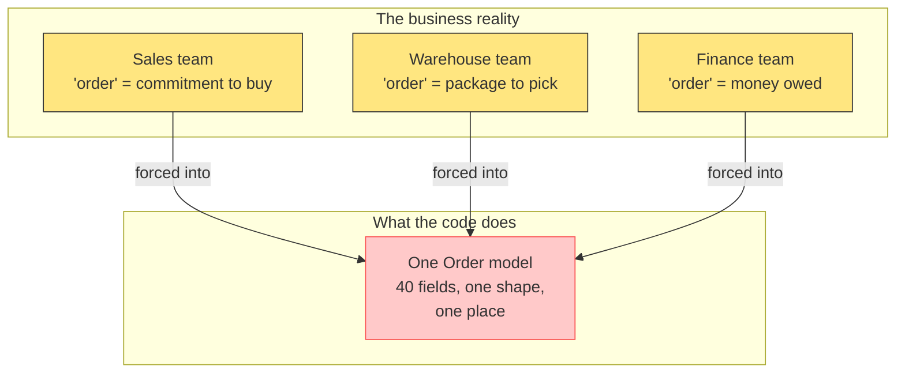

The fix is not to organize code around technology or data. The fix is to organize code around the way the business actually thinks. That is what Domain-Driven Design (DDD) does. It is a process, not a framework. It does not tell you which database to use or which pattern to follow. It tells you how to find the boundaries of the business and make those boundaries your architecture.

## The solution: DDD as a process

DDD gives you a step-by-step way to turn a messy business domain into a well-bounded codebase. The process looks like this:

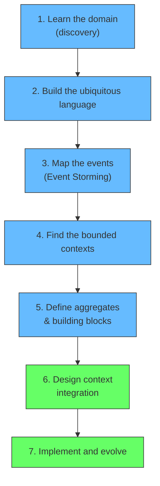

Each step answers one question:

| Step | Question it answers |
|---|---|
| 1. Learn the domain | What is this business actually doing? |
| 2. Ubiquitous language | What do the words mean, and who agrees on them? |
| 3. Map the events | What happens over time, and in what order? |
| 4. Bounded contexts | Where do different languages need to be kept apart? |
| 5. Aggregates | What has to stay internally consistent? |
| 6. Context integration | How do the parts talk without coupling? |
| 7. Implement and evolve | How do I build it so it stays cheap to change? |

This article walks through each step with a single running example: an online bookstore. Follow the example and the process applies to your domain too.

<div style={{display: 'flex', justifyContent: 'center'}}>

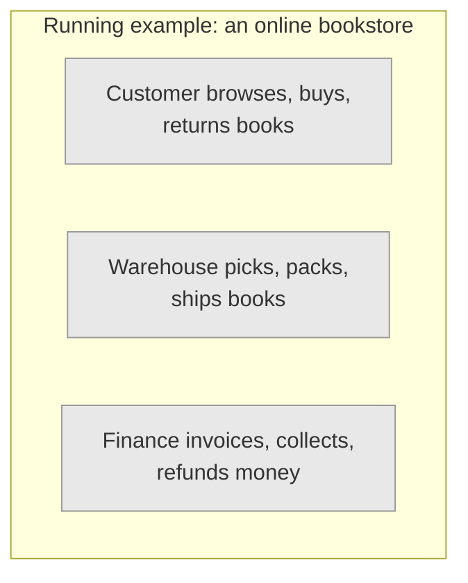

</div>

## Step 1: Learn the domain

You cannot model a domain you do not understand. The first step is deep discovery, and it is the most important one. Skip it and every later step produces a wrong model.

There are three levels of expertise:

| Who | Knows | Does not know |
|---|---|---|
| **Domain expert** | The rules, the edge cases, the history | Software structure |
| **Developer** | Software | The business rules |
| **Business stakeholder** | Why the business exists | The operational detail |

The gap between domain experts and developers is the reason software goes wrong. Developers make assumptions when they do not know, and those assumptions become the model. The goal of discovery is to close that gap before a single line of code is written.

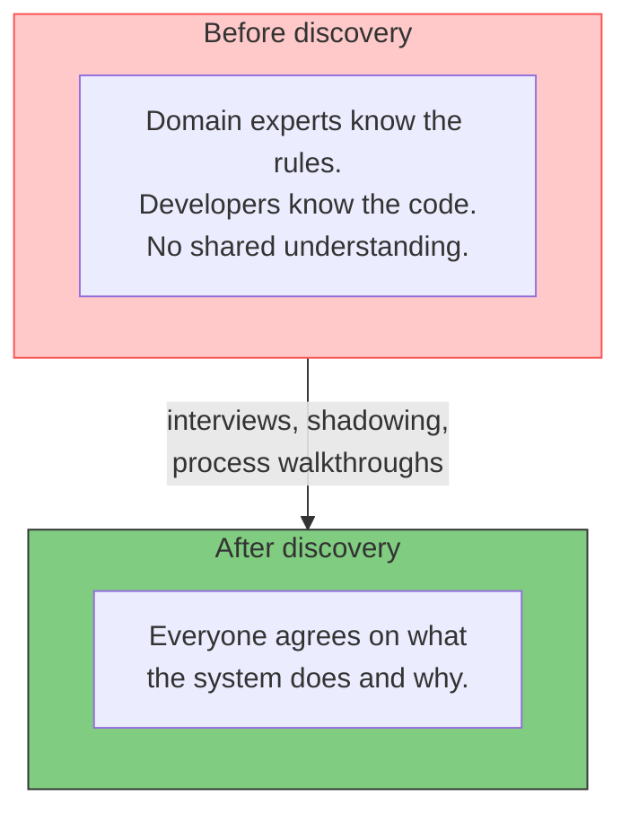

The wrong way to learn the domain is to ask a single manager for a feature list and build it. The manager's feature list is their mental model of the domain, which is different from the worker's and different from the customer's. You need the people who live in the process.

For the bookstore, discovery means:

- Talk to the buying team: how does a store choose which books to stock?
- Watch the warehouse: how does a book go from a shelf to a truck?
- Ask finance: when exactly does money change hands, and why do refunds happen?
- Listen for the moments where people disagree about what a word means.

The output of discovery is not documentation. It is a working vocabulary and a map of the business, which you carry into the next step. If you can describe what the business does in its own words, without inventing fields or tables, step 1 is done.

## Step 2: Build the ubiquitous language

The biggest cause of failed DDD efforts is language drift. The business says "order." The developer codes a `Cart`, the designer calls it a "basket," and the database table is `transactions`. Now the word "order" means three different things to three people working on the same system. Conversations become translation exercises and every change is ambiguous.

The ubiquitous language is a single, agreed vocabulary used everywhere: in conversation, in code, in the database schema, in the tests. When a developer writes `CreateOrder`, and the business says "place an order," and the database table is `orders`, the language is unified. No translation layer exists between what people say and what code does.

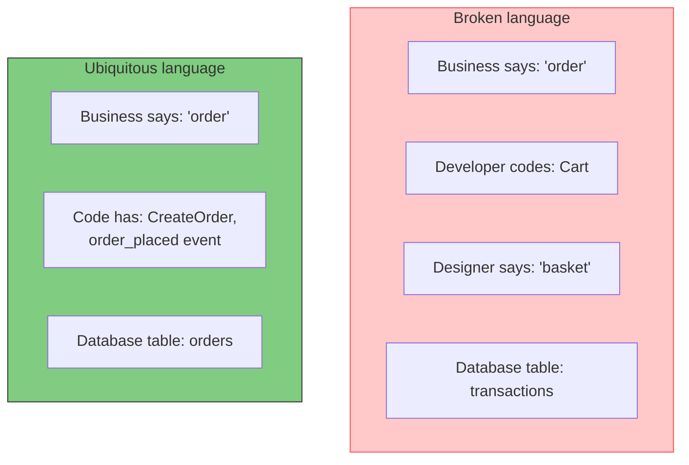

The ubiquitous language is not a glossary you write once and print. It is a living agreement that is enforced in real time. The rules are simple:

- Business terminology wins. If the business calls it "advance payment" the code calls it that too, even if "deposit" feels cleaner.
- Everyone corrects everyone. The developer who hears a manager say "basket" says "you mean order," out loud, in the meeting.
- Code matches the words. When you start coding, the names in code are the same words used in conversation.

### Why this is a readability fix, not a comment fix

The ubiquitous language solves a problem that shows up in every codebase built years ago: the code is there, it runs, but nobody understands it. When a new developer joins the team, they stare at a class named `Cart` with a field named `transaction_status` and cannot tell what either means. Because the code does not speak the business language, every change is a scavenger hunt. You cannot modify what you cannot understand, so change becomes slow and risky.

The obvious answer is "just add comments." The reason that fails is simple: **comments lie, code does not.** A comment says one thing at the moment it is written. Then the code changes, the developer updating it forgets to touch the comment, and from that moment on the comment says something the code no longer does. The comment becomes an active source of confusion -- worse than no comment, because it is confident and wrong. Code can only fail by failing; comments can fail by misleading than continuing to compile.

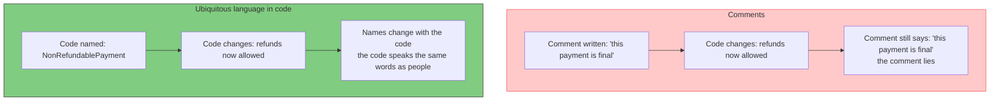

When the code uses the ubiquitous language, the names are the design. A method called `RefundPayment` exists because finance says "we refund payments." When the business changes the rule, the developer renames the method, and the change is visible everywhere including the diff, the search, the tests. The developer does not need a comment to explain what the method does, because the method name says it, and the name can never drift from the behavior -- the two are the same artefact.

This also changes who can read the code. A business person can glance at the event list, the aggregate names, and the test names, and recognize the system. A developer can take a stakeholder's sentence -- "when an order is confirmed, we reserve stock" -- and navigate straight to the `Order.Confirm()` method and the `ReserveStock` policy. The code and the business map onto each other one to one. That alignment is the real payoff of the language, and it is why DDD produces code that is easy for a newcomer to pick up even years later.

One more distinction worth making explicit. This is a **design-level** problem, not an **architecture-level** problem. Architecture is about how the big components interact -- which services call which, how events flow between contexts, what the deployment boundaries are. Design is about what happens inside one of those components -- the names, the structure, the responsibilities of a single class. Bad naming is a design failure. The ubiquitous language fixes it at the design level, inside each module. Confusing the two is itself a design error: teams rearchitect relentlessly to escape a design problem, and then import their old names into the new architecture, carrying the confusion with them.

A good test for your language: if two teams use the same word to mean different things, you have not one language but two. That is the signal that moves you from step 2 to step 4. The word "book" in the bookstore is a good example. For the sales team it means title, author, and price. For the warehouse it means weight, dimensions, and a barcode. Same word, different meaning, and no amount of translation fixes it.

## Step 3: Map the events

With a shared language in place, the next step is to map what actually happens in the business over time. The technique for this is called Event Storming. It is a workshop where everyone sits with the domain experts and writes the story of the domain on sticky notes, ordered from start to finish.

The heart of Event Storming is the domain event: a fact that happened, written in the past tense. Events are the only thing that is absolutely true about a domain. "Order placed" happened. "Book shipped" happened. You can argue about what an order is, but you cannot argue about whether it was placed.

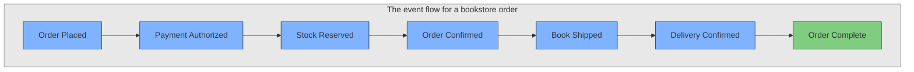

You write events in the past tense because they represent completed facts. Between events, you annotate who or what caused each one:

| Sticky | Color | Meaning |
|---|---|---|
| Event | Orange | A fact in the past tense: Order Placed |
| Command | Blue | An intent that causes an event: Place Order |
| Actor | Yellow | The person or system issuing the command: Customer |
| Policy | Purple | An automated rule that reacts to an event: When Stock Reserved, confirm order |
| Read model | Green | Information an actor needs before acting: Order Summary |

The full pattern connecting them is always the same:

```
Actor sees (read model) → issues command → system records event → policy reacts
```

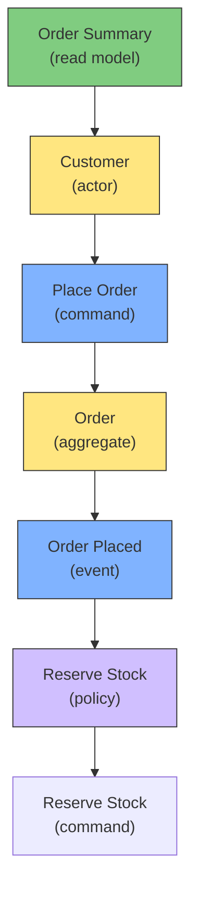

Event Storming has three levels of depth, and you do all of them before writing code:

| Level | What you map | What it gives you |
|---|---|---|
| **Big picture** | Every event in the whole lifecycle | A map of the business |
| **Process modeling** | Commands, actors, policies per event | How the business actually runs |
| **Software design** | Aggregates and boundaries | The seams for your architecture |

### Running the workshop

Event Storming is not a document you read. It is a workshop you run, with the domain experts in the room. The setup matters as much as the method.

**Who is in the room.** Bring the people who live in the process: the sales supervisor, the warehouse staff, the finance lead, a customer support rep, and 3 to 5 developers. Fifteen to twenty people is normal. The point is that the domain experts and the developers do the modeling together, in each other's presence, not through an intermediary. When the warehouse person puts up "Book Received" and the sales person reacts "books are listed, not received," the disagreement happens in front of everyone, and that is the model taking shape.

**What is on the wall.** A long stretch of paper, enough for a full timeline, usually several meters. Events go on a horizontal time axis from left to right. Everything else is a sticky placed relative to the events it touches.

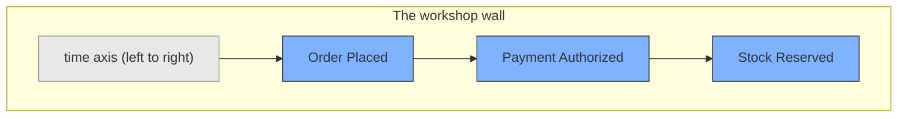

**Who talks.** The domain experts talk. The developers listen and ask questions. An experienced facilitator keeps the conversation moving and prevents the group from jumping into solutions. The rule of the room: unmodeled is unthinking, and criticism is a reason to add a sticky, not to delete one.

The three levels happen in sequence in the same session.

### Level 1, Big Picture: the events only

No commands, no actors, no rules. Just the domain events, in order, across the whole lifecycle. For the bookstore, the group walks from a customer wanting a book to a customer returning it, writing one orange sticky per event the moment someone says what happened.

People are told not to skip ahead. If a participant names a command ("then we confirm the order"), the facilitator writes it as an event instead ("Order Confirmed"). The output is a full horizontal story of the business, and everyone in the room can see all of it at once. This is the moment departments discover they have been describing the same process differently for years.

### Level 2, Process Modeling: add commands, actors, policies

Go event by event. On each event, ask "what command caused this?" and "who issued it?" Add the blue command and the yellow actor above or below the event. Where the trigger is not a person but an automated rule, add the purple policy instead.

The bookstore's warehouse flow has no human driving it. "Stock Reserved" was not caused by a warehouse worker clicking a button; it was caused by the policy "when Order Placed, reserve stock." That policy sticky is what tells you the warehouse runs on rules, not on staff decisions, which matters for the model and later for testing.

As the group works, hot spots appear. Someone says "wait, that is not how refunds work." The facilitator marks the spot with a red sticky labeled with the question, and the group moves on. The red stickies are the backlog for the next sessions. A red sticky is not a dependency and not a decision; it is an open question, often the sign of an external party the group does not control. A red sticky reading "Visa, Mastercard, Amex" above a payment step is the room saying "the payment is done by someone external, we need to talk about that later." You write it, move on, and come back in a later session.

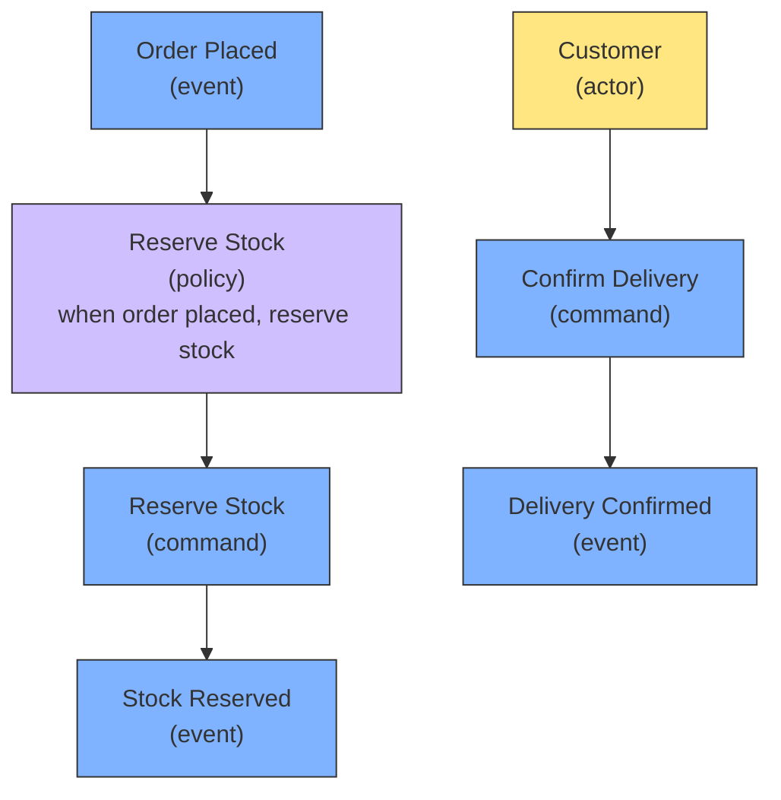

### Level 3, Software Design: boundaries and aggregates

Now the group looks at the wall and finds the seams. Events that cluster around one noun and one group of actors, with their own rules, form a candidate bounded context. This level overlaps with step 4; the facilitator starts drawing the context boxes over the wall, and the sticky notes inside each box become the model of that context.

The three levels are cumulative. Level 1 gives the story, level 2 gives the mechanics, level 3 gives the structure. A typical first session runs two to four hours and produces a wall that is the draft of everything the next steps will refine.

The output of step 3 is a series of event flows for every major process in the business. These flows are the raw material for the next step: finding where the contexts split.

## Step 4: Find the bounded contexts

This is the step that turns your event map into architecture. You have a wall full of events, commands, actors, and policies. Now you find the places where two islands of language live side by side.

A bounded context is a boundary around a model, where every concept has exactly one meaning. Inside the boundary, the ubiquitous language is consistent. Outside it, the same word may mean something else.

In the bookstore, "book" is one concept in the sales context (title, author, price) and a different concept in the warehouse context (weight, dimensions, barcode). These are two bounded contexts.

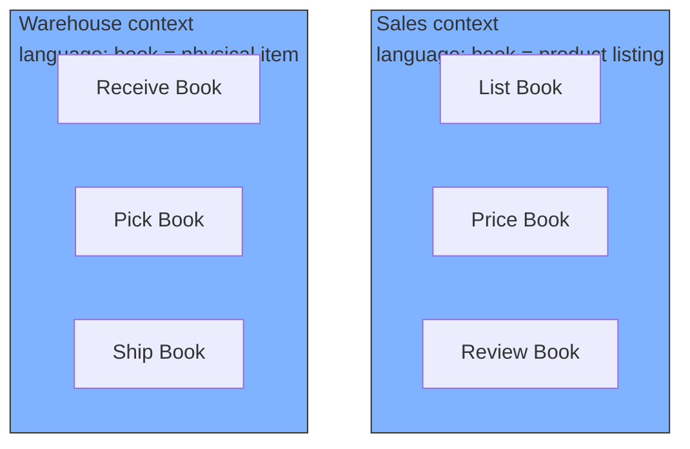

How do you find the boundaries? You look for three signals:

| Signal | What it means | In the bookstore |
|---|---|---|
| **Different language** | Two groups use the same word for different things | Sales "book" vs Warehouse "book" |
| **Different invariants** | Two groups enforce different rules | "Book must have a price" vs "Book must weigh under 30kg" |
| **Different data** | Two groups need different attributes | Sales needs price; warehouse needs dimensions |

When two clusters of events have a different language, different rules, and different data for the same noun, you draw a boundary between them. That boundary is a bounded context.

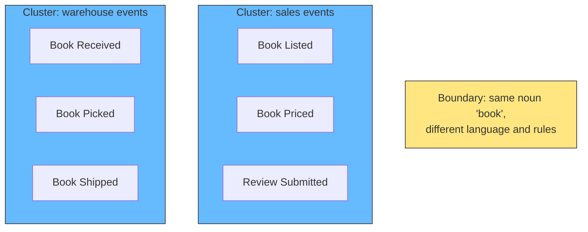

### Two forces pull every boundary

There are two forces at work, and a boundary is where they balance. Keep both in mind, because each one alone gives the wrong answer.

- **The cohesion force: if things change together, they belong together.** When two events, commands, or rules always move as one, splitting them makes every change a cross-boundary negotiation. This is the force that puts "Stock Reserved" next to "Order Placed": reserving stock happens at the same moment, by the same trigger, so they belong in the same cluster. If you ignored this force, you would scatter pieces that always change together and pay for it in chatter.

- **The boundary force: if the language, rules, or actors change, draw a line.** When the words change, the invariants change, or the people change, the two sides do not actually change together after all -- they only look related. This force is what stops everything from collapsing into one giant context. Everything in a system is eventually related; if "related" were enough, there would be one bounded context for the whole company. What justifies a boundary is not relatedness. It is the point where relatedness stops being *change togetherness*.

You feel this balance when you look at a wall. A cluster pulls events together because they share a noun and a trigger. A line pushes clusters apart because they no longer speak the same words. The signals table above detects the second force; the "changes together" rule detects the first. A good boundary is where the two have been weighed against each other.

**Language change comes in two forms**, and it is worth recognizing both on the wall:

| Form | What happens | Example |
|---|---|---|
| Same word, two meanings | Both sides say the noun but mean different things | Sales "book" vs warehouse "book" |
| The vocabulary swaps | One set of words simply ends and a new one begins | Offer, campaign, audience vanish; cart, tax, coupon appear |

The second form is easier to miss and happens more than people expect, for example between a promotions section and a checkout section on the same wall. The word "offer" has no home in checkout. When the working vocabulary changes as you walk along the timeline, you have crossed a boundary even if no single word changed meaning.

**One rule applies to events, not to nouns.** The "changes together, belongs together" rule picks clusters of *behavior*: events, commands, and policies. It does not mean a noun has to live in one place. The same Order appears in the shopping cart, the order capture, and the fulfillment flow -- three contexts, three copies, each with its own attributes. You do not force them together into a shared Order, because sharing would create exactly the coupling the boundary exists to prevent. A noun crossing into several contexts is normal. What you must never do is let those copies merge.

The bounded context is the most important concept in DDD, because it decides everything downstream. Each bounded context becomes the unit of organization: the module, the service, the team ownership, the namespace. When you get the boundaries right, cohesion and decoupling follow automatically. When you get them wrong, no architecture saves you.

There is a common failure mode worth naming: teams skip step 3 and step 4 and jump straight to code, carving boundaries by technical layer or by org chart. A "services" module and a "data" module are not bounded contexts. They are layers. A context is defined by the language of a business capability, nothing else. And a department is not a context either. The language is the boundary, not the reporting line. If two departments share a language, they belong in one context even though there is an org chart line between them.

### The boundary is not the deployment

Keep two questions separate, because the process answers them with different evidence:

- **Where do the boundaries go?** The event storming answers this: the language, rules, and change-togetherness decide the context boxes.
- **How do I deploy them?** Scale and team structure answer this: one context can be one process, or several contexts can share a process, or one context can even be split across multiple deployables.

Capital One makes this exact point: a bounded context typically becomes one or more microservices, but nothing about the boundary itself forces the deployment. You separate them *for independence* -- to scale one context independently, or to give two teams ownership of separate deployable units. Those are the two legitimate reasons to split a deployable: independent scaling and independent teams. If you have neither, the boundary should stay as a module inside one deployable, and drawing it is still fully worth it.

So the boundary is discovered from language. The deployment is decided by scale and teams. Mixing the two is how you end up with fifteen microservices that are really a distributed monolith: every service depends on every other, because deployment was used as a proxy for a boundary that was never actually discovered.

## Step 5: Define the aggregates

Once you know the contexts, you design the building blocks inside each one. The tactical building blocks of DDD are:

| Block | What it is | Example |
|---|---|---|
| **Entity** | An object with a continuous identity across time | A Customer, an Order |
| **Value object** | An object defined by its attributes, immutable | Money, Address |
| **Aggregate** | A cluster of entities and value objects treated as one unit | An Order with its line items |
| **Aggregate root** | The entity that owns the cluster and guards its rules | The Order in the Order aggregate |
| **Repository** | A collection-like interface to the aggregate | OrdersRepository |
| **Domain service** | Behavior that does not naturally belong to one entity | Pricing service, discount calculation |

The aggregate is the centerpiece. Think of it as the unit of consistency: the smallest cluster of objects that must be modified together to satisfy an invariant.

An online order has line items, a delivery address, and a status. When the order changes, its line items change with it. They are one aggregate, owned by the Order aggregate root. The customer is a separate aggregate. The book being sold is a separate aggregate, in a different context.

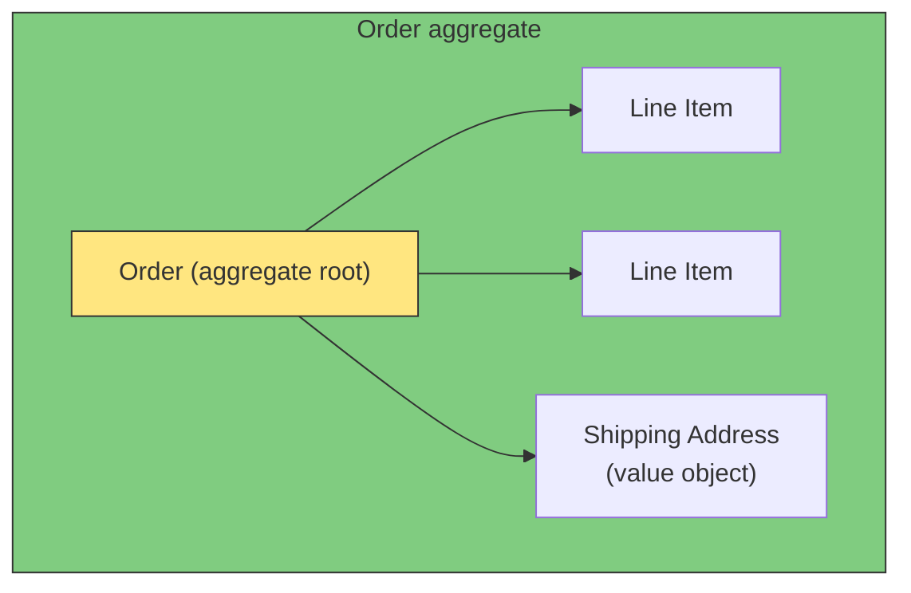

The rules for aggregates are strict, and they are what make DDD systems testable and reliable:

- **One command, one aggregate.** A command changes a single aggregate in a single transaction. You never update two aggregates in one operation, because the moment you do, you create a transaction spanning two consistency boundaries.
- **Other aggregates are reached by reference, not by object.** The Order holds the Customer's ID, not the Customer object. This avoids dragging other roots into the transaction.
- **Changes flow through the root.** External code only holds the aggregate root, never reaches into the line items directly. The root guards every rule, including the invariant that line items cannot make the total negative.

The aggregate root protects the invariant. The invariant is a business rule that must hold at all times. For the Order aggregate: an order can only be confirmed if every line item has stock available. That check happens inside the root, which refuses to confirm otherwise.

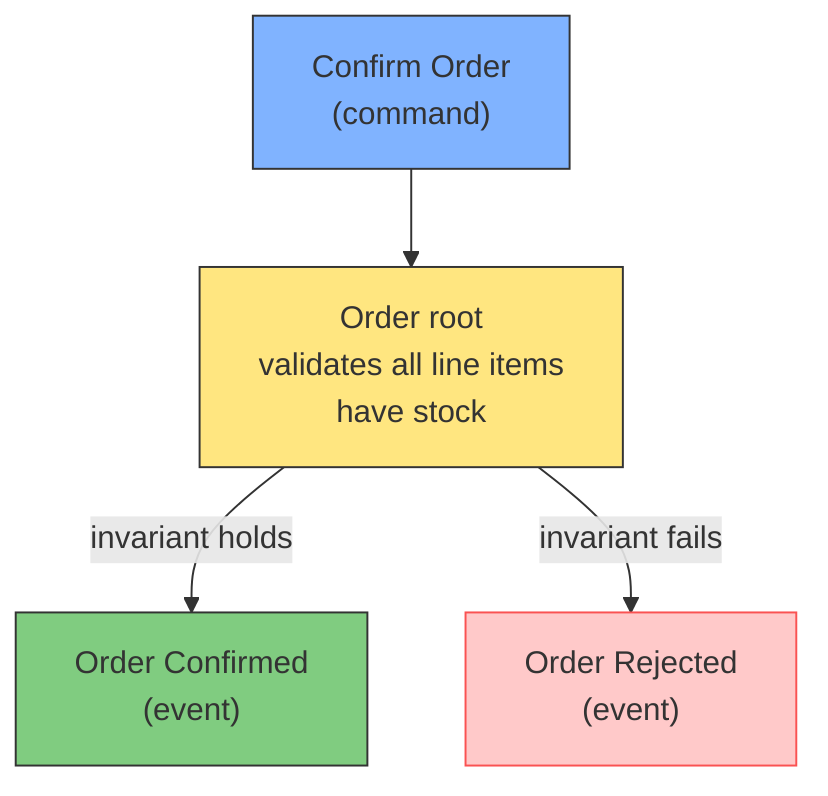

There is a limit to how large an aggregate should be. A useful rule of thumb from Vaughn Vernon: design small aggregates. A small aggregate is fast to load, easy to reason about, and rarely creates contention when many transactions touch it. If you find an aggregate swallowing your whole data model, you have actually rediscovered the god object the bounded context was meant to prevent.

## Step 6: Design context integration

The bounded contexts are separate, but the business flows through them. A book is listed in the sales context, purchased, then picked and shipped in the warehouse context. The contexts must talk. The question is how to make them talk without coupling.

DDD offers a set of integration patterns called context mapping. Each pattern names a relationship between two contexts and how they communicate. The most useful ones:

| Pattern | What it does | Use when |
|---|---|---|
| **Shared kernel** | Two contexts share a small model | Teams trust each other and change rarely |
| **Customer-supplier** | Upstream provides what downstream needs | One context feeds another |
| **Conformist** | Downstream conforms to upstream's model | Upstream cannot change |
| **Anti-corruption layer** | A translator guards the boundary | You must protect your model from a legacy system |
| **Open host service** | A protocol that many contexts consume | Many consumers need stable access |
| **Published language** | The shared protocol between contexts | You need a neutral event format |

The workhorse for modern systems is the published language backed by domain events. The sales context publishes "Order Placed." The warehouse context subscribes to it and reacts. Neither context imports the other's classes, database, or model.

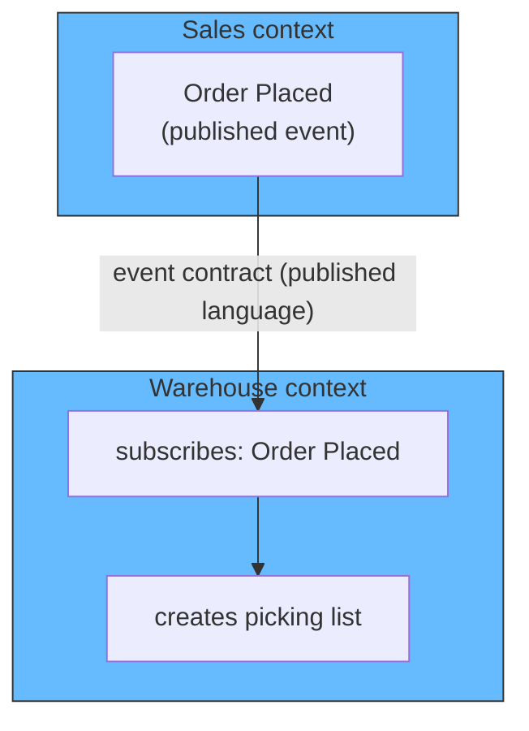

The discipline of integration is the same one from the aggregates: the event carries everything the consumer needs in its payload. The warehouse does not call back into the sales context to ask "what does this order contain?" The event payload holds the order ID, the items, and the quantities. This is how you keep contexts decoupled: the only connection is the event, and the event carries its own data.

For legacy systems, the anti-corruption layer (ACL) is the pattern that saves you. Your clean domain model sits behind an ACL that translates the legacy system's awkward model into yours. Your code never sees the legacy mess, because the ACL stands between you and it. When you finally retire the legacy system, you delete the ACL and lose nothing.

## Step 7: Implement and evolve

The process does not end when the model is drawn. The model has to live in code and survive contact with reality. This step covers how to implement the model and keep it correct as the business changes.

### Implement inside, keep technology outside

Keep the domain model pure. The aggregates, entities, value objects, and domain services contain business logic and nothing else. Database frameworks, HTTP controllers, message queues, and UI all live outside the model, calling in through the model's own interfaces.

This separation is often called hexagonal or ports-and-adapters architecture. The domain model is the center. Ports are the interfaces the domain needs (a repository interface, an event publisher interface). Adapters are the implementations of those ports (a Postgres repository, a Kafka publisher). Swap the adapters and the model never changes.

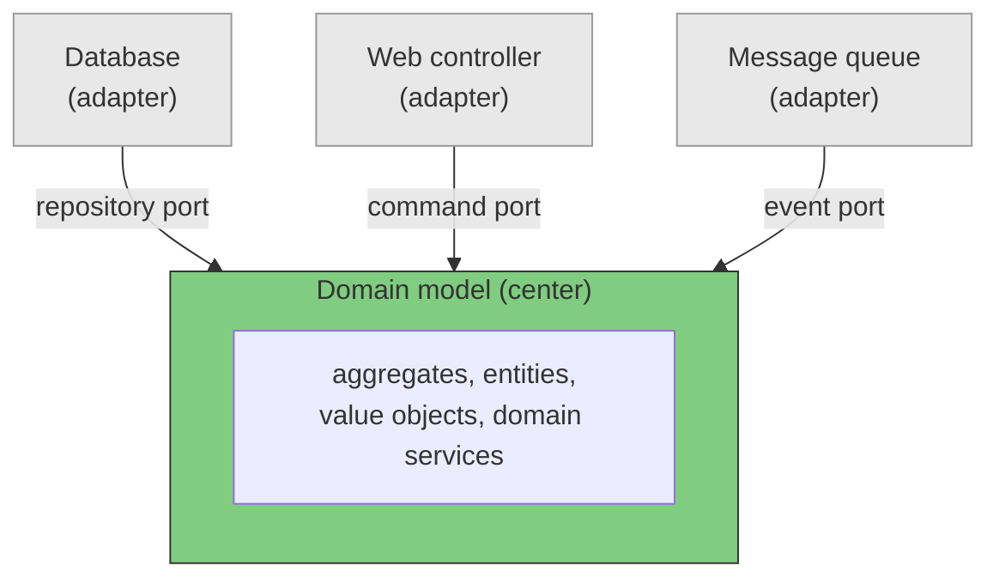

The repository port is worth calling out. The aggregate is loaded and saved through a repository interface, which lives in the domain model layer. The actual SQL lives in the adapter. The domain does not know how an order is persisted. It only knows the repository can load and save orders. This keeps the model testable without a database and keeps the model honest about its own rules.

### Test the domain, not the plumbing

Because the model is pure, you can test it directly. The aggregate tests describe the business rules in the ubiquitous language:

- An order cannot be confirmed without stock for every line item.
- A refund cannot exceed the amount paid.
- A delivery address is immutable after shipping starts.

These tests are the living documentation of the domain. When a business rule changes, the test changes first, and the whole organization can read why.

### Evolve the model deliberately

The model is never finished. The business changes, new invariants appear, and language drifts. DDD approaches this in two ways:

| Practice | What it is |
|---|---|
| **Continuous refactoring** | The model is improved whenever the business understanding deepens |
| **Model refactoring is designed, not random** | Changes to boundaries and aggregates are intentional and documented |

The key discipline: when the business understanding changes, you refactor the model, then the code. Most teams make the mistake of patching the code to fit a new feature while leaving a stale model in place. The model drifts from reality, and within a year the code and the business tell two different stories again.

The hardest part of evolution is knowing when a bounded context itself is wrong. A context that grows beyond its language, or that accumulates so many aggregates it no longer holds one coherent meaning, has to be split. The split is a normal act of DDD, not a failure. You re-run step 3 on the context in question, find the new boundary, and extract it.

## The diagrams the process produces

A teammate joins your team, or a stakeholder wants to understand the system, or you are the new developer trying to find where a change goes. What do they look at?

The answer is a small set of diagrams, each capturing one layer of the design. The diagrams are the visible output of the process, and they are what the team references daily. They should be few enough to maintain and central enough that the whole team reads them.

| Diagram | Shows | Created in |
|---|---|---|
| **Event flow diagram** | The domain events in order, with commands and actors | Step 3 |
| **Context map** | The bounded contexts and how they connect | Step 4, refined in 6 |
| **Aggregate diagram** | Each context's aggregates and their rules | Step 5 |
| **Integration diagram** | The events flowing between contexts | Step 6 |

The context map is the primary one. It is the picture of the whole system: every bounded context as a box, and an edge for every relationship, labeled with the integration pattern (published language, anti-corruption layer, shared kernel). A newcomer reads the context map to learn which box their feature belongs in, and which boxes their code may not touch.

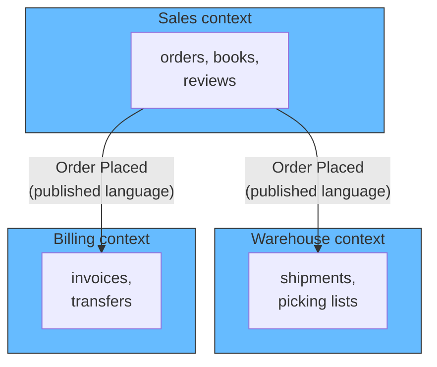

The event flow diagram is the story of the business. It starts as sticky notes on a wall during the workshop, and then gets transferred to a shared tool because a wall of stickies does not last. It answers "what happens between Order Placed and Order Shipped?" It is the diagram the domain experts understand best, because it is their process drawn as facts.

The aggregate and integration diagrams are read together with the context map. The aggregate diagram zooms into one context and shows its aggregates, their roots, and the invariants each enforces. The integration diagram zooms out to the events crossing context boundaries. Working through the three zoom levels -- context map, aggregate, integration -- gives the full picture at any scale.

There is one rule for keeping these diagrams honest: **they must be derived from the code, or they will drift.** A static diagram that nobody updates is a comment that lies. The cheapest way to keep them honest is to generate them from the code where possible, and to treat them as living artifacts that are updated in the same PR as the code they describe. The diagram that survives is the one the team actually uses to navigate the system, not the one displayed once in a design review.

The hierarchy of the diagrams mirrors the process: events first, then contexts, then aggregates, then integration. If you build the system the way this article describes, the diagrams come out of the work instead of being bolted on afterward.

## Worked example: from Event Storming to TypeScript

The bookstore example above was invented to teach. This section uses a real Event Storming model documented publicly by ArchMan (archman.dev) for an e-commerce domain, and shows how the workshop output becomes TypeScript code. The model has four bounded contexts, so it exercises everything this article has covered.

### The workshop output

The workshop produced these domain events, arranged on a timeline:

```
CustomerRegistered → CartCreated → CartItemAdded → CheckoutStarted
→ PaymentAuthorized → PaymentProcessed | PaymentFailed
→ FraudCheckStarted → FraudCheckPassed | FraudCheckFailed
→ InventoryReserved | InventoryReservationFailed
→ ShipmentPrepared → ShipmentShipped → DeliveryArrived | DeliveryFailed
→ RefundInitiated → RefundProcessed
→ OrderCancelled (at any time before shipping)
```

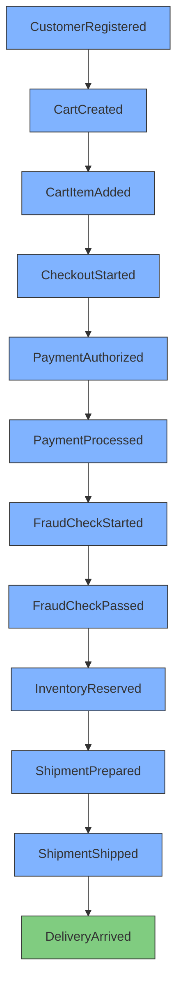

The failure events branch off the same commands: PaymentFailed and PaymentProcessed both come from ProcessPayment; FraudCheckFailed and FraudCheckPassed both come from CheckFraud; InventoryReservationFailed and InventoryReserved both come from ReserveInventory. Each branch is a decision the business makes, modeled as a fork.

### The aggregates

The workshop grouped the events into aggregates, each one a consistency boundary:

| Aggregate | Events it owns |
|---|---|
| **Order** | OrderCreated, CartItemAdded (until checkout), CheckoutStarted, OrderConfirmed, OrderCancelled |
| **Payment** | PaymentAuthorized, PaymentProcessed, PaymentFailed, RefundProcessed |
| **Shipment** | InventoryReserved, ShipmentPrepared, ShipmentShipped, DeliveryArrived |
| **FraudCheck** | FraudCheckStarted, FraudCheckPassed, FraudCheckFailed |

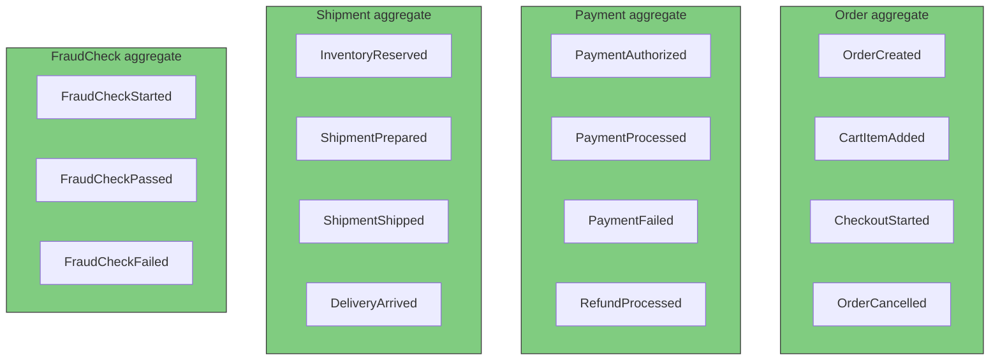

### The bounded contexts

The aggregates then clustered into four bounded contexts, each owning its language and its events:

| Bounded context | Owns | Subscribes to |
|---|---|---|
| **Ordering** | OrderCreated, OrderConfirmed, OrderCancelled | PaymentProcessed |
| **Payment** | PaymentAuthorized, PaymentProcessed, PaymentFailed, RefundProcessed | CheckoutStarted |
| **Fraud** | FraudCheckStarted, FraudCheckPassed, FraudCheckFailed | OrderCreated |
| **Fulfillment** | InventoryReserved, ShipmentPrepared, ShipmentShipped, DeliveryArrived | FraudCheckPassed, OrderConfirmed |

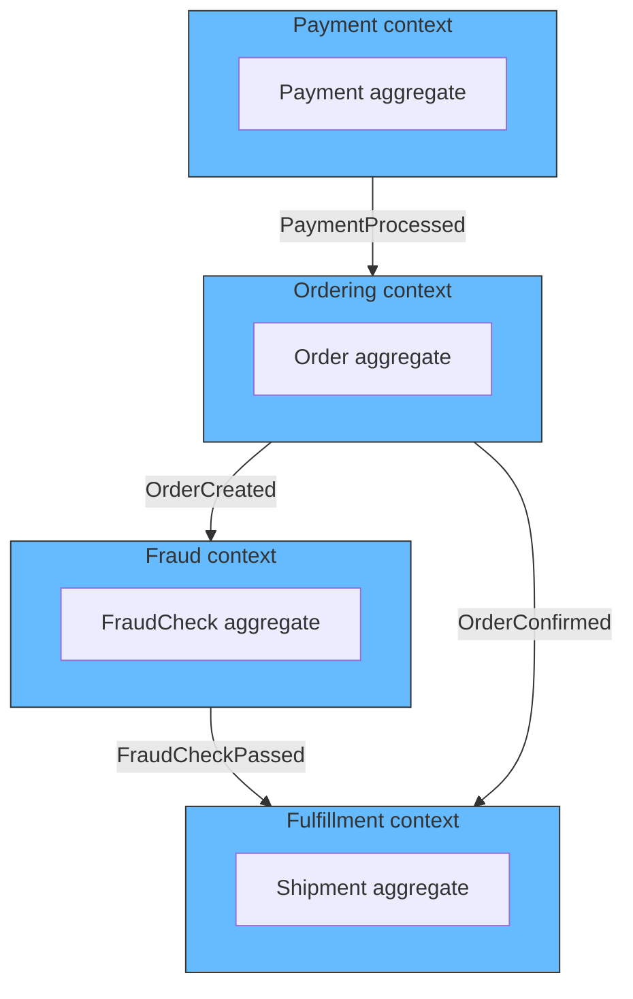

The context map shows exactly how the systems connect: each arrow is a domain event crossing a boundary. No service calls another directly. Ordering publishes OrderCreated, Fraud consumes it; Fraud publishes FraudCheckPassed, Fulfillment consumes it. The events are the published language between contexts.

### What the boundaries do to the timeline order

The timeline built in Level 1 is a discovery scaffold, not the final model. Its job is to surface missing events and let the room agree on the story. Once the group starts drawing context boxes, the events regroup by language and ownership, not by where they sat on the wall. An event near the start of the timeline and one in the middle can land in the same bounded context if they share a language and a rule.

Our worked example is a live case of this. The workshop timeline runs FraudCheckStarted right after PaymentProcessed, with ShipmentPrepared much later. Yet the Fraud context owns FraudCheckStarted, FraudCheckPassed, and FraudCheckFailed, and the Payment context owns PaymentAuthorized, PaymentProcessed, and PaymentFailed. Those events are not adjacent on the wall; the context boundary pulled them together anyway, because they share a language and an owner. This regrouping did not break the process because ordering survives in two separate places:

- **Inside a context**, the events keep their own sequence. OrderCreated, OrderConfirmed, OrderCancelled form an order inside the Ordering context even though other contexts' events sit between them on the wall.
- **Across contexts**, ordering is carried by the boundary events, not by position. Whether a shipment is prepared before or after the payment is not decided by drawing one sticky to the left of another. It is decided by which event the Fulfillment context subscribes to, which is exactly the sequential chain in the event storming diagram below.

Capital One's engineering team documents the same situation in a widely referenced post about decomposing a monolith with Event Storming. They sequenced the events of a generic e-commerce site on a timeline, then grouped them into bounded contexts. The result: the same aggregate, Order, ended up in three contexts at once, Shopping Cart, Order Capture, and Order Fulfillment. The author explains why this is correct rather than contradictory: "it indicates they are different microservices since they are in different bounded contexts. They may both be doing things related to an Order, but what they are doing is different." The global timeline was the discovery tool; each context then re-established its own sequence for its own copy of Order.

<div style={{display: 'flex', justifyContent: 'center'}}>

```mermaid
graph TD
    subgraph WALL["The workshop wall: one timeline"]
        T1["Order Submitted"] --> T2["Payment Processed"]
        T2 --> T3["Inventory Updated"]
        T3 --> T4["Order Shipped"]
    end
    subgraph CART["Shopping Cart context"]
        C1["Order Submitted"]
    end
    subgraph CAPTURE["Order Capture context"]
        A1["Order Submitted"]
        A2["Payment Processed"]
        A3["Inventory Updated"]
    end
    subgraph FULFILL["Order Fulfillment context"]
        B1["Order Shipped"]
    end
    T1 -.-> C1
    T1 -.-> A1
    A3 -.->|"boundary event"| B1
    style WALL fill:#e8e8e8,stroke:#999
    style CART fill:#6bf,stroke:#333
    style CAPTURE fill:#6bf,stroke:#333
    style FULFILL fill:#6bf,stroke:#333
    style T1 fill:#ffa07a,stroke:#333
    style T2 fill:#ffa07a,stroke:#333
    style T3 fill:#ffa07a,stroke:#333
    style T4 fill:#ffa07a,stroke:#333
```

</div>

The wall shows the same events three times: once in the global order and again inside the contexts that own them. What survives the regrouping is not a single global sequence. It is each context's internal sequence plus the boundary events stitching the contexts together. That is the exact shape the code below implements.

### The event storming diagram

Before any code, the full event storming diagram is drawn with the standard color coding: actors in yellow, commands in blue, events in orange, policies in purple. This diagram is the contract the code is built from. Every class below is a translation of one sticky note on this diagram.

```mermaid
graph TD
    subgraph ORDERING["Ordering context"]
        CUST["Customer<br/>(actor)"] --> PLACE["PlaceOrder<br/>(command)"]
        PLACE --> OCREATED["OrderCreated<br/>(event)"]
    end
    subgraph FRAUD["Fraud context"]
        FPOL["Auto Fraud Check<br/>(policy)"] --> FCHK["CheckFraud<br/>(command)"]
        FCHK --> FSTARTED["FraudCheckStarted<br/>(event)"]
        FSTARTED --> FPASSED["FraudCheckPassed<br/>(event)"]
        FSTARTED --> FFAILED["FraudCheckFailed<br/>(event)"]
    end
    subgraph PAYMENT["Payment context"]
        PPOL["Auto Process Payment<br/>(policy)"] --> PPROC["ProcessPayment<br/>(command)"]
        PPROC --> PPROCESSED["PaymentProcessed<br/>(event)"]
        PPROC --> PFAILED["PaymentFailed<br/>(event)"]
    end
    subgraph FULFILLMENT["Fulfillment context"]
        SPOL["Auto Shipment<br/>(policy)"] --> PREP["PrepareShipment<br/>(command)"]
        PREP --> SPREPARED["ShipmentPrepared<br/>(event)"]
    end
    OCREATED -->|"event crosses context"| FPOL
    FPASSED -->|"event crosses context"| PPOL
    PPROCESSED -->|"event crosses context"| SPOL
    style CUST fill:#ffe680,stroke:#333
    style PLACE fill:#80b3ff,stroke:#333
    style OCREATED fill:#ffa07a,stroke:#333
    style FPOL fill:#d0bfff,stroke:#333
    style FCHK fill:#80b3ff,stroke:#333
    style FSTARTED fill:#ffa07a,stroke:#333
    style FPASSED fill:#ffa07a,stroke:#333
    style FFAILED fill:#ffa07a,stroke:#333
    style PPOL fill:#d0bfff,stroke:#333
    style PPROC fill:#80b3ff,stroke:#333
    style PPROCESSED fill:#ffa07a,stroke:#333
    style PFAILED fill:#ffa07a,stroke:#333
    style SPOL fill:#d0bfff,stroke:#333
    style PREP fill:#80b3ff,stroke:#333
    style SPREPARED fill:#ffa07a,stroke:#333
    style ORDERING fill:#e8e8e8,stroke:#999
    style FRAUD fill:#e8e8e8,stroke:#999
    style PAYMENT fill:#e8e8e8,stroke:#999
    style FULFILLMENT fill:#e8e8e8,stroke:#999
```

Read it like the workshop wall. A yellow actor issues a blue command. The command produces an orange event. A purple policy listens for an event and, when its rule matches, issues its own command. The only connections between contexts are the events crossing the boundaries.

The Customer (actor) places an order. OrderCreated reaches the Fraud context, where the Auto Fraud Check policy fires and issues CheckFraud. FraudCheckPassed reaches the Payment context, where the Auto Process Payment policy issues ProcessPayment. Only PaymentProcessed reaches Fulfillment, where the Auto Shipment policy issues PrepareShipment. The chain is sequential: fraud passes, then the money is taken, then the box is packed. A shipment can never be prepared before the payment has succeeded. Three policies, four commands, seven events, four contexts. The code below implements exactly this diagram.

### The code: events first

The first thing you write is the event classes, one per orange sticky from the diagram. They are immutable records, because an event is a fact that never changes.

```typescript
// shared/events.ts -- the published language between contexts

export interface DomainEvent {
  readonly eventId: string;
  readonly occurredAt: Date;
}

export class OrderCreated implements DomainEvent {
  constructor(
    public readonly eventId: string,
    public readonly occurredAt: Date,
    public readonly orderId: string,
    public readonly customerId: string,
    public readonly items: ReadonlyArray<{sku: string; qty: number}>,
    public readonly totalAmount: number,
  ) {}
}

export class FraudCheckStarted implements DomainEvent {
  constructor(
    public readonly eventId: string,
    public readonly occurredAt: Date,
    public readonly orderId: string,
    public readonly amount: number,
  ) {}
}

export class FraudCheckPassed implements DomainEvent {
  constructor(
    public readonly eventId: string,
    public readonly occurredAt: Date,
    public readonly orderId: string,
    public readonly amount: number,
  ) {}
}

export class FraudCheckFailed implements DomainEvent {
  constructor(
    public readonly eventId: string,
    public readonly occurredAt: Date,
    public readonly orderId: string,
    public readonly reason: string,
  ) {}
}

export class PaymentProcessed implements DomainEvent {
  constructor(
    public readonly eventId: string,
    public readonly occurredAt: Date,
    public readonly orderId: string,
    public readonly amount: number,
    public readonly transactionId: string,
  ) {}
}

export class PaymentFailed implements DomainEvent {
  constructor(
    public readonly eventId: string,
    public readonly occurredAt: Date,
    public readonly orderId: string,
    public readonly reason: string,
  ) {}
}

export class ShipmentPrepared implements DomainEvent {
  constructor(
    public readonly eventId: string,
    public readonly occurredAt: Date,
    public readonly orderId: string,
    public readonly warehouseId: string,
  ) {}
}
```

### The code: commands next

Next come the commands, one per blue sticky. A command is an intent, not a fact. It is what the actor wants to happen. It never happens on its own; it is issued by an actor or a policy.

```typescript
// shared/commands.ts -- the blue stickies

export class PlaceOrder {
  constructor(
    public readonly orderId: string,
    public readonly customerId: string,
    public readonly items: ReadonlyArray<{sku: string; qty: number}>,
    public readonly totalAmount: number,
  ) {}
}

export class CheckFraud {
  constructor(
    public readonly orderId: string,
    public readonly amount: number,
  ) {}
}

export class ProcessPayment {
  constructor(
    public readonly orderId: string,
    public readonly amount: number,
  ) {}
}

export class PrepareShipment {
  constructor(
    public readonly orderId: string,
  ) {}
}
```

### The code: the bus

The event store connects the contexts. It appends events and notifies subscribers, exactly like the wall of stickies but in code form. It is also where commands are dispatched: an actor calls `bus.execute`, the command handler runs, and the events it produces are appended.

```typescript
// shared/bus.ts -- command dispatch + event publish

import {DomainEvent} from './events';

type CommandHandler = (command: unknown) => void;
type EventHandler = (event: DomainEvent) => void;

export class Bus {
  private readonly events: DomainEvent[] = [];
  private readonly eventHandlers = new Map<Function, EventHandler[]>();
  private readonly commandHandlers = new Map<Function, CommandHandler>();

  execute(command: unknown): void {
    const handler = this.commandHandlers.get(command.constructor);
    if (!handler) throw new Error(`No handler for ${command.constructor.name}`);
    handler(command);
  }

  registerCommand(type: Function, handler: CommandHandler): void {
    this.commandHandlers.set(type, handler);
  }

  append(event: DomainEvent): void {
    this.events.push(event);
    for (const handler of this.eventHandlers.get(event.constructor) ?? []) {
      handler(event);
    }
  }

  subscribe<T extends DomainEvent>(type: new (...args: any[]) => T, handler: (e: T) => void): void {
    const list = this.eventHandlers.get(type) ?? [];
    list.push(handler as EventHandler);
    this.eventHandlers.set(type, list);
  }

  eventsForAggregate(aggregateId: string): DomainEvent[] {
    return this.events.filter(
      (e) => 'orderId' in e && (e as {orderId: string}).orderId === aggregateId,
    );
  }
}
```

### The code: one module per bounded context

Each bounded context becomes its own folder, owning its commands, its handlers, and its policies. No context imports another context's internals; the only shared thing is the published event and command contract.

```
src/
  shared/
    events.ts
    commands.ts
    bus.ts
  ordering/
    place-order-handler.ts
  fraud/
    auto-fraud-check-policy.ts
    check-fraud-handler.ts
  payment/
    auto-process-payment-policy.ts
    process-payment-handler.ts
  fulfillment/
    auto-shipment-policy.ts
    prepare-shipment-handler.ts
```

The Ordering context owns the PlaceOrder command. Its handler is the code translation of the Customer's yellow sticky: it takes the command and produces the OrderCreated event.

```typescript
// ordering/place-order-handler.ts -- Ordering bounded context

import {Bus} from '../shared/bus';
import {PlaceOrder} from '../shared/commands';
import {OrderCreated} from '../shared/events';

export class PlaceOrderHandler {
  constructor(private readonly bus: Bus) {
    this.bus.registerCommand(PlaceOrder, (cmd) => this.handle(cmd as PlaceOrder));
  }

  private handle(cmd: PlaceOrder): void {
    this.bus.append(
      new OrderCreated(
        this.newId(), new Date(),
        cmd.orderId, cmd.customerId, cmd.items, cmd.totalAmount,
      ),
    );
  }

  private newId(): string {
    return crypto.randomUUID();
  }
}
```

The Fraud context has a policy and a handler. The Auto Fraud Check policy is the purple sticky: it listens for OrderCreated and, when the event arrives, issues the CheckFraud command. The handler is the blue sticky: it performs the check and emits either FraudCheckPassed or FraudCheckFailed.

```typescript
// fraud/auto-fraud-check-policy.ts -- Fraud bounded context, the purple policy

import {Bus} from '../shared/bus';
import {CheckFraud} from '../shared/commands';
import {OrderCreated} from '../shared/events';

export class AutoFraudCheckPolicy {
  constructor(private readonly bus: Bus) {
    this.bus.subscribe(OrderCreated, (e) => this.onOrderCreated(e));
  }

  private onOrderCreated(event: OrderCreated): void {
    this.bus.execute(new CheckFraud(event.orderId, event.totalAmount));
  }
}
```

```typescript
// fraud/check-fraud-handler.ts -- Fraud bounded context, the blue command

import {Bus} from '../shared/bus';
import {CheckFraud} from '../shared/commands';
import {FraudCheckStarted, FraudCheckPassed, FraudCheckFailed} from '../shared/events';

export class CheckFraudHandler {
  constructor(private readonly bus: Bus) {
    this.bus.registerCommand(CheckFraud, (cmd) => this.handle(cmd as CheckFraud));
  }

  private handle(cmd: CheckFraud): void {
    this.bus.append(
      new FraudCheckStarted(this.newId(), new Date(), cmd.orderId, cmd.amount),
    );

    if (cmd.amount > 10_000) {
      this.bus.append(
        new FraudCheckFailed(this.newId(), new Date(), cmd.orderId, 'manual_review_required'),
      );
    } else {
      this.bus.append(
        new FraudCheckPassed(this.newId(), new Date(), cmd.orderId, cmd.amount),
      );
    }
  }

  private newId(): string {
    return crypto.randomUUID();
  }
}
```

The Fulfillment context mirrors the previous ones: a policy that listens for PaymentProcessed and issues PrepareShipment, plus a handler that emits ShipmentPrepared. The chain forces the order: the money is taken before the box is packed, because the Fulfillment policy only fires on the payment event. This is the exact shape of the diagram -- the policy sits between an incoming event and an outgoing command.

```typescript
// fulfillment/auto-shipment-policy.ts -- Fulfillment bounded context, the purple policy

import {Bus} from '../shared/bus';
import {PrepareShipment} from '../shared/commands';
import {PaymentProcessed} from '../shared/events';

export class AutoShipmentPolicy {
  constructor(private readonly bus: Bus) {
    this.bus.subscribe(PaymentProcessed, (e) => this.onPaymentProcessed(e));
  }

  private onPaymentProcessed(event: PaymentProcessed): void {
    this.bus.execute(new PrepareShipment(event.orderId));
  }
}
```

```typescript
// fulfillment/prepare-shipment-handler.ts -- Fulfillment bounded context, the blue command

import {Bus} from '../shared/bus';
import {PrepareShipment} from '../shared/commands';
import {ShipmentPrepared} from '../shared/events';

export class PrepareShipmentHandler {
  constructor(private readonly bus: Bus) {
    this.bus.registerCommand(PrepareShipment, (cmd) => this.handle(cmd as PrepareShipment));
  }

  private handle(cmd: PrepareShipment): void {
    this.bus.append(
      new ShipmentPrepared(this.newId(), new Date(), cmd.orderId, 'warehouse-001'),
    );
  }

  private newId(): string {
    return crypto.randomUUID();
  }
}
```

The Payment context mirrors the Fraud one exactly, driven by the consumer of FraudCheckPassed: the Auto Process Payment policy listens and issues ProcessPayment, whose handler emits PaymentProcessed on success and PaymentFailed on rejection. Every context in the diagram gets the same treatment -- a policy per purple sticky, a command handler per blue sticky, and the events it can emit as orange stickies.

```typescript
// payment/auto-process-payment-policy.ts -- Payment bounded context, the purple policy

import {Bus} from '../shared/bus';
import {ProcessPayment} from '../shared/commands';
import {FraudCheckPassed} from '../shared/events';

export class AutoProcessPaymentPolicy {
  constructor(private readonly bus: Bus) {
    this.bus.subscribe(FraudCheckPassed, (e) => this.onFraudCheckPassed(e));
  }

  private onFraudCheckPassed(event: FraudCheckPassed): void {
    this.bus.execute(new ProcessPayment(event.orderId, event.amount ?? 0));
  }
}
```

```typescript
// payment/process-payment-handler.ts -- Payment bounded context, the blue command

import {Bus} from '../shared/bus';
import {ProcessPayment} from '../shared/commands';
import {PaymentProcessed, PaymentFailed} from '../shared/events';

export class ProcessPaymentHandler {
  constructor(private readonly bus: Bus) {
    this.bus.registerCommand(ProcessPayment, (cmd) => this.handle(cmd as ProcessPayment));
  }

  private handle(cmd: ProcessPayment): void {
    if (cmd.amount <= 0) {
      this.bus.append(
        new PaymentFailed(this.newId(), new Date(), cmd.orderId, 'invalid_amount'),
      );
      return;
    }
    this.bus.append(
      new PaymentProcessed(this.newId(), new Date(), cmd.orderId, cmd.amount, `txn-${cmd.orderId}`),
    );
  }

  private newId(): string {
    return crypto.randomUUID();
  }
}
```

### The code: wiring it together

The composition root creates the bus, registers every command handler and policy, and lets the actor drive the flow. The Customer's place-order intent is the only external trigger; everything after it is events and policies reacting.

```typescript
// main.ts

import {Bus} from './shared/bus';
import {PlaceOrder} from './shared/commands';
import {PlaceOrderHandler} from './ordering/place-order-handler';
import {AutoFraudCheckPolicy} from './fraud/auto-fraud-check-policy';
import {CheckFraudHandler} from './fraud/check-fraud-handler';
import {AutoProcessPaymentPolicy} from './payment/auto-process-payment-policy';
import {ProcessPaymentHandler} from './payment/process-payment-handler';
import {AutoShipmentPolicy} from './fulfillment/auto-shipment-policy';
import {PrepareShipmentHandler} from './fulfillment/prepare-shipment-handler';

const bus = new Bus();

new PlaceOrderHandler(bus);
new CheckFraudHandler(bus);
new ProcessPaymentHandler(bus);
new PrepareShipmentHandler(bus);
new AutoFraudCheckPolicy(bus);
new AutoProcessPaymentPolicy(bus);
new AutoShipmentPolicy(bus);

// the actor: Customer places an order
bus.execute(new PlaceOrder('order-123', 'cust-456', [{sku: 'item-1', qty: 2}], 5000.0));

console.log(bus.eventsForAggregate('order-123'));
// OrderCreated, FraudCheckStarted, FraudCheckPassed, PaymentProcessed, ShipmentPrepared
```

Running the program produces exactly the event cascade the diagram predicted. OrderCreated triggers the Auto Fraud Check policy, which issues CheckFraud, which emits FraudCheckPassed, which triggers the Auto Process Payment policy, which issues ProcessPayment, which emits PaymentProcessed, which triggers the Auto Shipment policy, which issues PrepareShipment, which emits ShipmentPrepared. The chain is strictly sequential -- shipment waits on payment, payment waits on fraud -- so the box can never be packed before the money has been taken. Each sticky note on the diagram maps to one class, and the only external actor is the Customer issuing the first command.

## Putting it all together

The full process in one picture, with the question each step asks:

```mermaid
graph TD
    S1["Learn the domain<br/>What is the business doing?"] --> S2["Build the ubiquitous language<br/>What do the words mean?"]
    S2 --> S3["Map the events<br/>What happens over time?"]
    S3 --> S4["Find bounded contexts<br/>Where do languages differ?"]
    S4 --> S5["Define aggregates<br/>What must stay consistent?"]
    S5 --> S6["Design integration<br/>How do contexts talk?"]
    S6 --> S7["Implement and evolve<br/>How does it stay cheap to change?"]
    S7 -->|"domain shifts"| S3
    style S1 fill:#6bf,stroke:#333
    style S2 fill:#6bf,stroke:#333
    style S3 fill:#6bf,stroke:#333
    style S4 fill:#6bf,stroke:#333
    style S5 fill:#6bf,stroke:#333
    style S6 fill:#6f6,stroke:#333
    style S7 fill:#6f6,stroke:#333
```

The process loops back on itself on purpose. DDD is never a one-time waterfall. The domain changes, so the model changes, and the process starts again at the event map for whichever part of the system changed.

The payoff of going through the process honestly is not pretty diagrams. It is a codebase where a new feature lands in the context it belongs to, where business people and developers describe the system in the same words, and where the architecture never fights the business it serves. The bookstore example applies to any domain. The process is the point: learn, name, map, bound, define, integrate, evolve. Skip none of it.

## Summary

| Step | Action | Key question |
|---|---|---|
| 1 | Learn the domain | What is the business really doing? |
| 2 | Ubiquitous language | What do the words mean, and who agrees? |
| 3 | Event Storming | What happens over time? |
| 4 | Bounded contexts | Where do languages collide? |
| 5 | Aggregates | What must remain consistent? |
| 6 | Context integration | How do contexts communicate? |
| 7 | Implement and evolve | How does it stay cheap to change? |