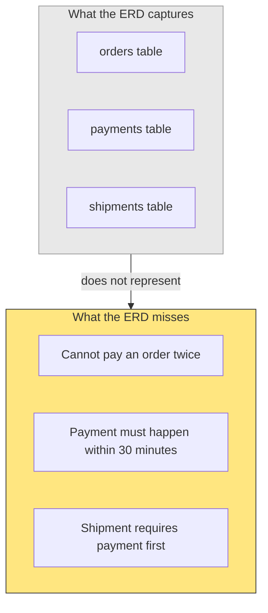
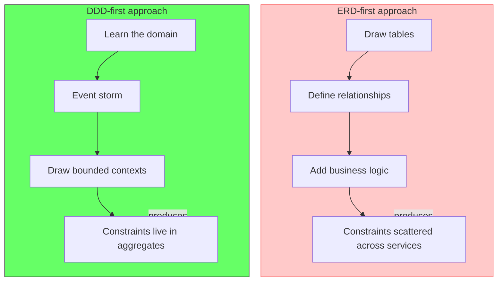
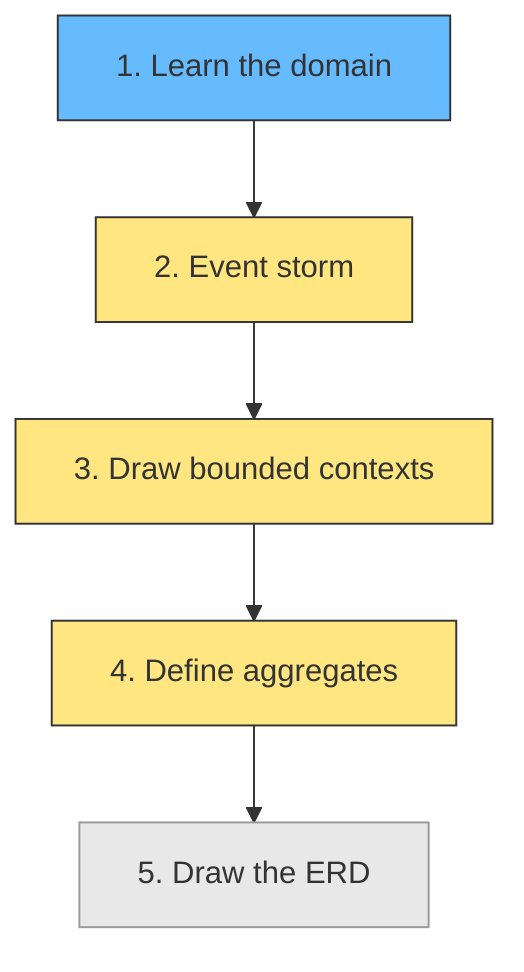

# Why DDD Starts from the Business, Not the Database

## The ERD-first problem

Most teams begin system design by drawing tables. The orders table has a foreign key to payments. The payments table has a foreign key to shipments. The schema looks clean. The constraints look obvious.

Then the bugs start. Two students enroll in the same course at the same time, exceeding capacity. A payment is processed twice because two services wrote to the same row. A shipment is triggered before payment clears. The ERD did not prevent any of this, because the ERD shows storage, not behavior.

An ERD captures the data at rest. It does not capture the data in motion. The business rule "a course cannot exceed its capacity" is not a column type or a foreign key. It is a constraint on a workflow -- a sequence of decisions, events, and state transitions that the ERD cannot represent.

Gart Solutions: "Traditional software architecture tends to be technology-first. Engineers start with the database schema, design API endpoints around CRUD operations, and treat business logic as a thin layer on top."

## What DDD does differently

Domain-Driven Design inverts the starting point. Instead of asking "what data do we store?", it asks "what is the business doing?" The answer comes from event storming -- orange stickies on a wall representing events, commands, actors, and policies. Boundaries emerge from the business reality, not from data relationships.

The aggregate pattern enforces business constraints at the consistency boundary. The `Course` aggregate owns the capacity check. Enrollment goes through the aggregate. Two concurrent enrollments hit the aggregate, and the aggregate handles the conflict through optimistic or pessimistic locking. The business rule lives in one place.

George, on optimistic concurrency in Clean DDD: "The Aggregate's main task is to protect invariants (business rules, the boundary of immediate consistency). In a multi-threaded environment, when multiple threads are running simultaneously on the same Aggregate, a business rule may be broken."

## The constraint gap

| Starting point | Captures | Misses |
|---|---|---|
| ERD | Tables, columns, relationships | Behavior, constraints, workflows |
| Event storming | Events, commands, actors, policies | Data storage details |

The ERD is not wrong. It is incomplete. It shows the data model that supports the business model, not the business model itself. As howitworks.dev states: "DDD is a discipline for making the model in the code and the model in the domain expert's head the same model." The domain expert does not think in tables. They think in events, decisions, and constraints.

## The correct order of operations

1. Learn the domain. Talk to the business. Identify what happens.
2. Event storm. Map the events, commands, actors, and policies.
3. Draw boundaries. Find the bounded contexts where the language changes.
4. Define aggregates. Identify what must stay internally consistent.
5. Draw the ERD. The data model follows the boundaries.

The ERD is the last artifact, not the first. It is the data model that serves the domain model. Reversing this order produces a schema that is easy to query but expensive to change -- a big ball of mud with a clean-looking database.

## Related

- [DDD: The Complete Process Step by Step](ddd-process.md) - the full process from discovery to implementation
- [Architecture is Not the Starting Point](architecture-is-not-the-starting-point.md) - why architecture follows domain
- [Aggregate Sizing: How Big Should an Aggregate Be?](aggregate-sizing.md) - how aggregate boundaries enforce business constraints
