# Debugging a Down System: Where to Start

## The problem: a production system is down and everyone is guessing

When a production system goes down, the pattern repeats: multiple engineers scatter, each SSH-ing into a random box, reading logs without a hypothesis, and making the same checks three times. Panic drives people to the most instinctive action (dive into code and find the root cause immediately), which is the wrong instinct. The system keeps degrading while everyone tries to work independently.

The failure is rarely technical skill. It is the absence of a fixed process. A search problem under stress needs a method: a sequence of decisions that works at 3 AM when you are tired, stressed, and looking at a system someone else built. This article is that method, in the order you should execute it.

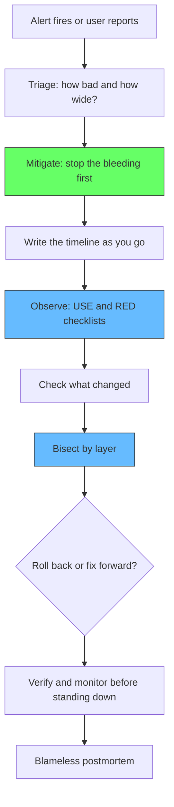

## The first rule: stabilize before you understand

The single most common mistake in production incident debugging is treating diagnosis as the first job. It is not. Your first job is to reduce customer impact; root-cause analysis is the second job and can usually wait.

Google's SRE book says it bluntly: "Your first response in a major outage may be to start troubleshooting and try to find a root cause as quickly as possible. Ignore that instinct!" Instead: "make the system work as well as it can under the circumstances. This may entail emergency options, such as diverting traffic from a broken cluster to others that are still working, dropping traffic wholesale to prevent a cascading failure, or disabling subsystems to lighten the load. Stopping the bleeding should be your first priority."

Split every incident into two explicit tracks that run in parallel:

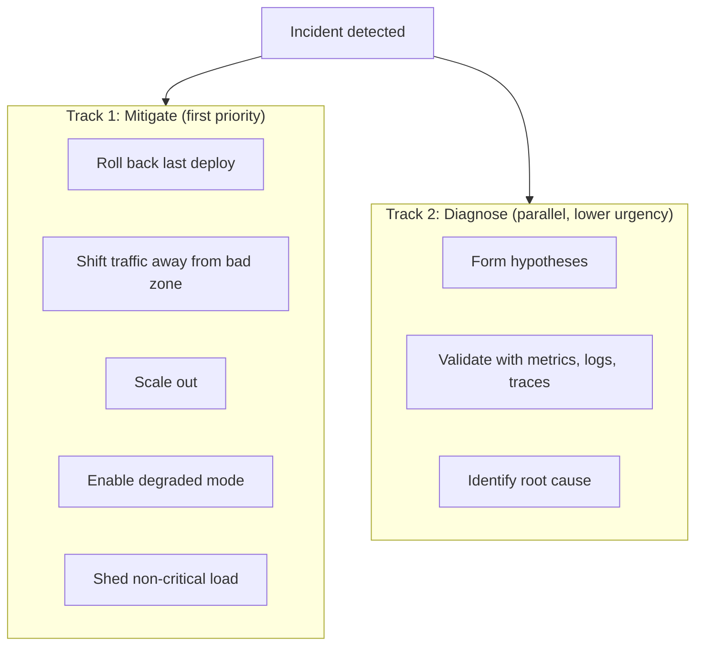

Mitigation actions are coarse, reversible, and require no understanding of the root cause. Diagnosis is slower and continues after the customer impact is gone. If you have more than one responder, assign the tracks to different people. If you are alone, do the mitigation pass first and time-box it: spend the first ten minutes asking "what can I do right now to make this stop hurting," not "why is this happening."

The payoff is measured: teams that adopt a mitigate-first posture cut incident duration significantly, often by 30 to 50 percent on change-induced incidents, because rollback is faster than diagnosis. If your mean time to recovery is dominated by diagnosis time, that is a process smell, not a tooling problem.

## Write the timeline as you go

The second first-principle habit is cheap and gets skipped under stress: open a scratch doc and log timestamps for everything. When the alert fired, when symptoms actually started (these are rarely the same moment), what you checked, what you changed, what happened after each change.

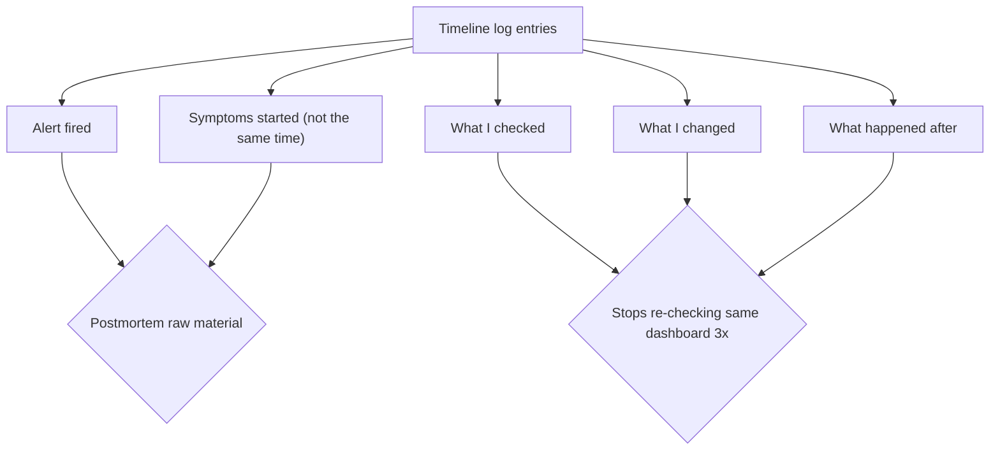

Two reasons this matters. First, it mechanically stops you from re-checking the same dashboard three times at 3 AM, because your notes show you already looked and what you saw. Second, the timeline is the raw material for the postmortem, and a timeline reconstructed from memory two days later is fiction. One line per event is enough: "10:23 alerted, 10:26 error rate 90%, 10:31 rolled back v1.4.2, 10:37 error rate dropping," and so on.

## Triage: assess blast radius, not just "it's down"

Before diagnostic work, answer a small set of questions that determine severity and escalation. The size and shape of the problem determines the size and shape of the response. "It's down" is not a severity; it is a prompt to measure.

The core questions, drawn from Google's debugging incident study, are:

- What is the error rate? Is it 3 percent or 100 percent? The two need completely different responses.
- Which service, endpoint, or region is affected?
- When did it start?
- Did anything deploy or change around that time?
- Is it getting better or worse on its own?

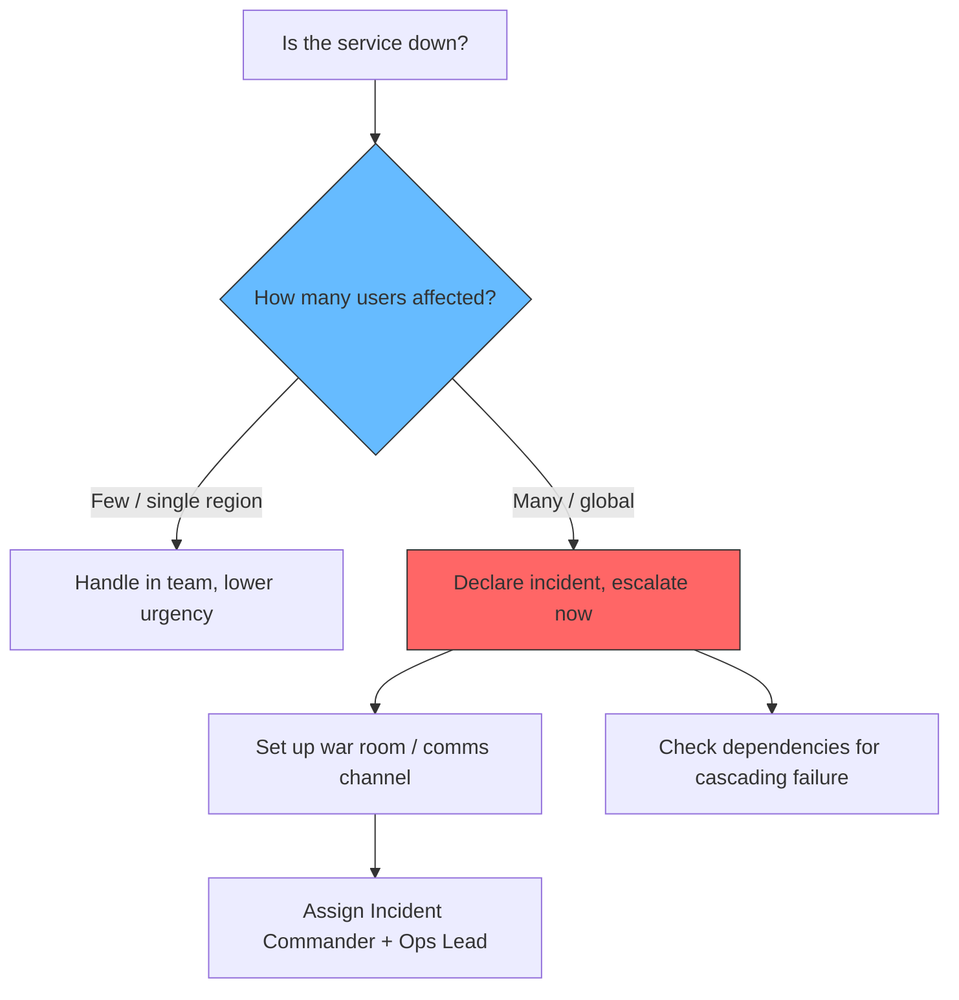

The severity assessment drives whether you page people, spin up a war room, and alert leadership. Google SRE Workbook: "declaring an incident early is cheap; declaring it late is expensive." There is a real cost to under-declaring: stakeholders assume nothing is being done because they were never told otherwise.

## Observe before you hypothesize: the USE and RED checklists

Once mitigation is underway, resist the urge to SSH into a random box and start reading logs. Logs confirm hypotheses; they are bad at generating them. Generate hypotheses from metrics, using two complementary checklists that cover two different failure classes.

### The USE method: per resource

Brendan Gregg's USE method: for every resource (CPU, memory, disk, network, connection pools, thread pools), check Utilization, Saturation, and Errors. It catches the class of incident where nothing changed in your code but the system ran out of something: capacity exhaustion, noisy neighbors, a leak that finally crossed a threshold.

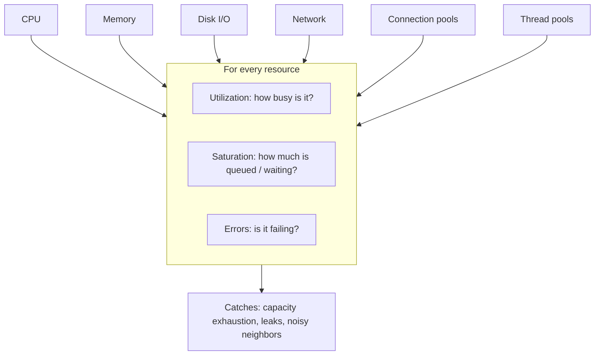

### The RED method: per service

The RED method is the service-level complement: for every service, check Rate (requests per second), Errors (failed requests per second), and Duration (latency distribution, not averages). It catches the class of incident the USE method misses: a downstream dependency returning errors fast, a slow code path that burns no resource, a traffic spike from a single client.

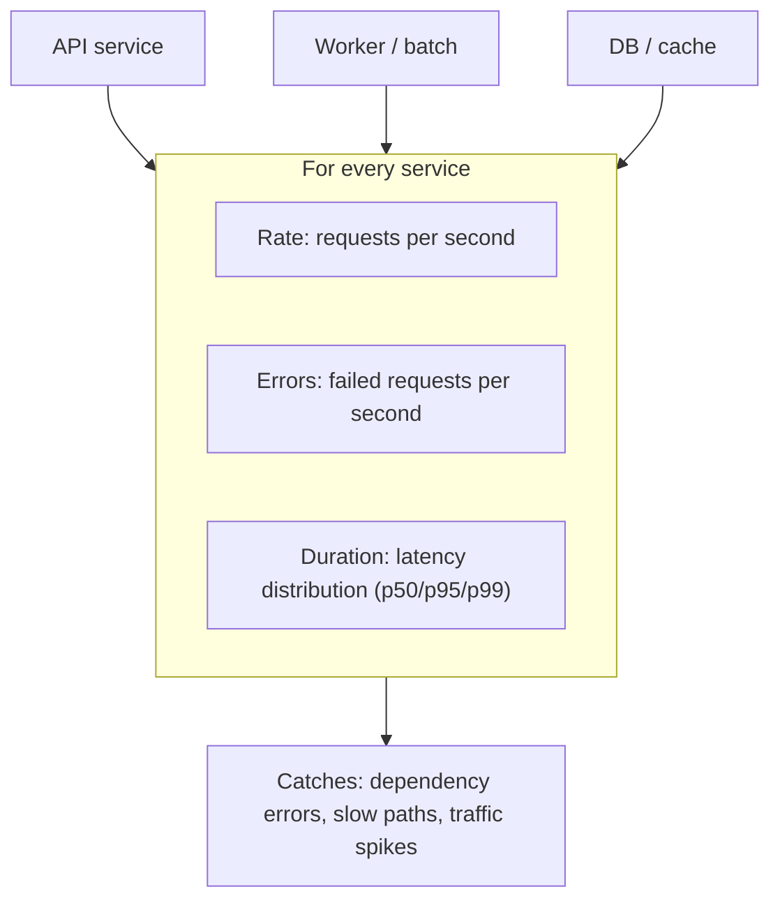

Use the two methods together as a decision fork:

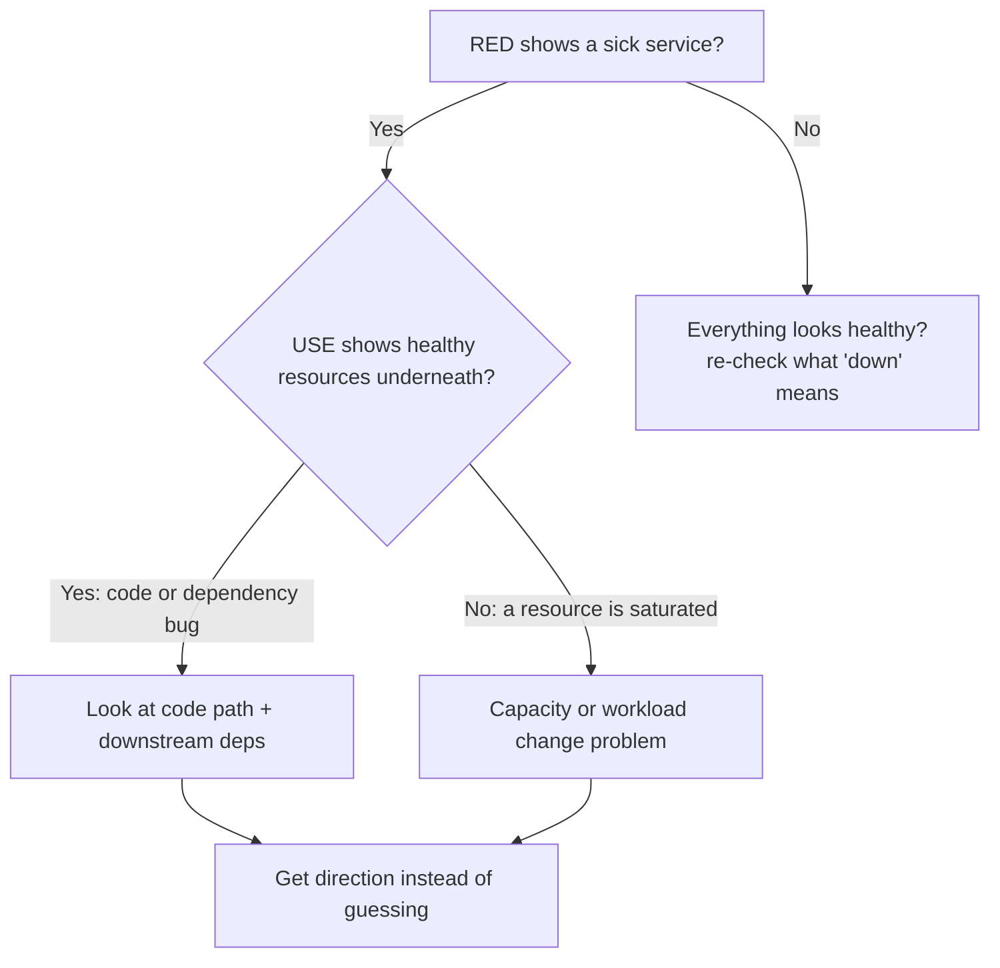

If RED shows a sick service but USE shows healthy resources underneath it (plenty of CPU, memory, and no queueing), the problem is in the code or in a dependency. If USE shows a saturated resource, the problem is capacity or a workload change. Either way you now have a direction instead of a guess, which is more than most hops during an outage produce.

## Check what changed first

Before deep diagnosis, do one cheap thing: check what changed. The majority of production incidents follow a change. Industry postmortem datasets and vendor incident analyses consistently attribute somewhere between half and three-quarters of incidents to a recent change. "Change" means more than deploys: it includes configuration pushes, feature flag flips, data backfills, third-party provider updates, scaling decisions, and even DNS or certificate changes.

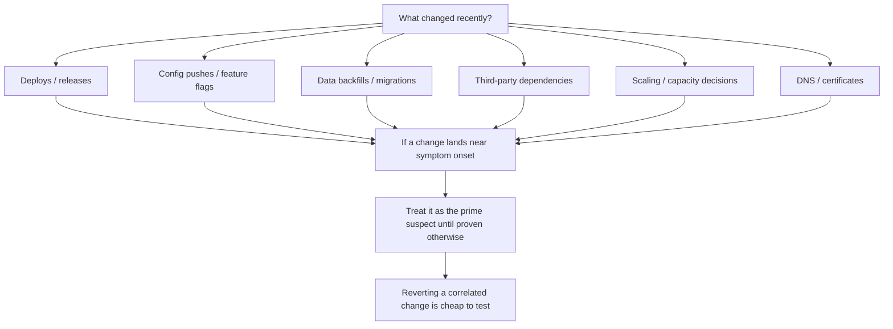

If a change lands within a few minutes of symptom onset, treat it as the prime suspect until proven otherwise. Correlation is not causation, but at 3 AM correlation is an excellent place to start, and reverting a correlated change is cheap to test. The heuristic only works if changes are visible: install deploy annotations so your CI/CD pipeline posts an event to your metrics system on every change, and you can overlay deploys against error rates in one dashboard instead of cross-referencing day-old memory.

## Bisect by layer

Distributed systems debugging is a search problem, and the fastest search is binary. A request in a typical stack crosses several layers: edge / DNS / TLS, load balancer, the service itself, its dependencies, the database, and the infrastructure underneath. Do not walk this list top to bottom. Pick a midpoint, test it, and cut the search space in half.

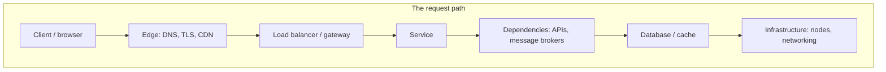

The bisection rule: if the service layer looks healthy from its own metrics but clients see errors, the problem is above the service (edge, load balancer, DNS, TLS). If the service itself is reporting errors, the problem is at the service or below. Each test should eliminate roughly half of the remaining layers.

Test dependencies from inside the caller's network context, not from your laptop: your laptop's view of the database proves nothing about the pod's view. And check node conditions before blaming anything above them. A useful framing is to ask what the system is doing, then why it is doing that, then where its resources and output are going. A malfunctioning system is usually still trying to do something, just not the thing you want it doing.

## Decide: roll back or fix forward

You found a suspect change. Now comes the decision that actually determines incident duration: revert it, or fix it in place. Use a rubric, not a debate.

| Signal | Roll back | Fix forward |
|---|---|---|
| Change is recent and correlated with onset | Yes | No |
| Rollback path is tested and takes minutes | Yes | No |
| Change included a schema migration or data backfill | No | Usually yes |
| Other changes shipped on top of the suspect | Depends on isolation | Often yes |
| Cause is external (provider outage, upstream API) | Nothing to roll back | Mitigate around it |
| Fix is a one-line, well-understood patch with fast CI | Maybe | Possibly |
| It is 3 AM and you are not sure | Yes | No |

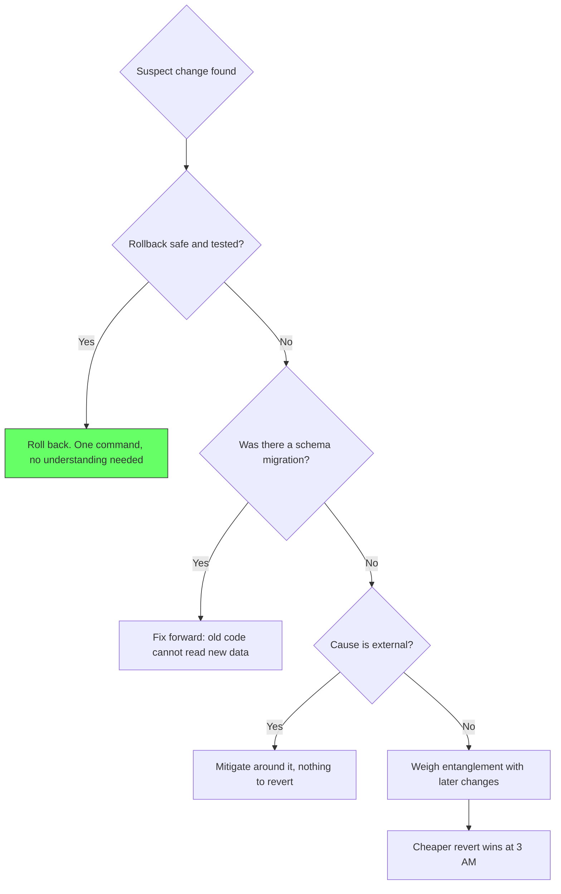

Default to rollback when the change is recent, suspect, and cheap to revert. Rollback is a mitigation you can execute in one command without understanding the bug. Fix forward when rollback is genuinely riskier than the bug: a migration already rewrote data in a shape the old code cannot read; the suspect change is entangled with later changes you would also have to revert; or the cause is external and there is nothing of yours to revert. Be honest about the cost of fixing forward: it means writing code under pressure, reviewing it under pressure, and shipping it through a pipeline, all while the incident continues.

Two failure modes to avoid. Ego-driven fix-forward: "I can patch this in five minutes" is how five-minute incidents become ninety-minute incidents. And rollback theater: rolling back a change the timestamps already exonerated, which is another reason the written timeline matters.

## Verify, then monitor before standing down

After applying the mitigation, confirm recovery before declaring victory. The hardest part of incident response is knowing when it is over. Some issues take 5 to 10 minutes to propagate through the system after a fix, and npm-style latency or cache invalidation means the metric you care about recovers last.

Watch the metrics that determined the incident for 10 to 15 minutes after mitigation, and watch for the inflection point where the incident started to resolve. Confirm each one returns to baseline:

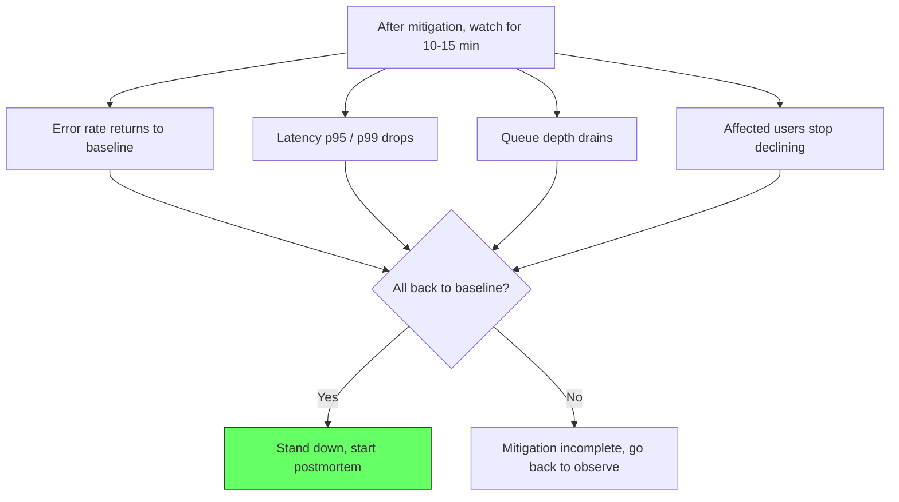

Do not declare victory as soon as one dashboard looks healthy. A single green chart can mask ongoing degradation elsewhere. The verification window is cheap insurance against a full relapse and a second pager at 4 AM.

## Postmortem: make the incident worth something

Within 48 hours, write the postmortem. Its purpose is not to assign blame but to prevent recurrence. Ask "how did our system allow this," not "who caused this." The best teams treat postmortems as learning tools, and the best postmortems are blameless by construction: every response is bound to fail, and the system's job is to handle that gracefully.

A useful postmortem has a minimal structure:

- Summary: what happened, duration, customer impact
- Timeline: the chronological log you wrote during the incident (this is why you kept it)
- Root cause: specific and deep, not "a bug caused it"
- What went well: did the runbook help, did alerting fire promptly
- What went poorly: was the runbook outdated, did comms lag
- Action items: each with an owner and a due date, and each one either preventing recurrence or sharpening the response

The most durable output of an incident is not the fix. It is the timeline: a defensible, timestamped record of what was observed, what was tried, and what worked. That record is what turns an incident into a postmortem worth reading, and a postmortem worth reading is what stops the same incident from happening twice.

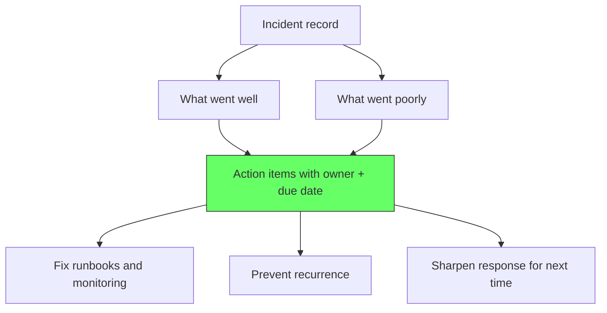

## The hands-on checklist: commands per layer

The framework above is the *method*; this is the *muscle*. A down system is a search problem, and each layer has a small set of concrete checks that split the search space in half. Work them in this order. Start at the layer closest to the user and move inward, exactly as the serve-site tells you when the problem reproduces.

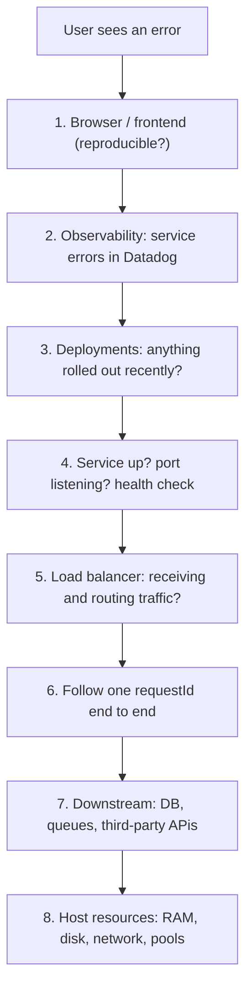

### Layer 1: the browser, when the bug is reproducible

If you can open the site and see the failure, the browser is the fastest diagnostic you have. The DevTools Network tab answers the frontend-versus-backend question in one glance: if the static assets (HTML, JS, CSS) load but the API call returns 500, the frontend is fine and the backend is failing. If the page itself will not load, the problem is more likely in the edge (DNS, CDN, load balancer) than in your code.

```bash
# From the browser DevTools Network tab, look at the failing request:
#   - 500/502/503 -> backend service error
#   - 504/timeout -> server alive but upstream slow (LB -> app -> DB)
#   - 401/403    -> authz, not an outage (still affects users loudly)
#   - net::ERR_CONNECTION_* -> nothing listening at that address

# Mirror the same request from your machine to separate browser quirks
# from server behavior:
curl -i https://api.example.com/v1/orders          # headers + status
curl -s -o /dev/null -w "%{http_code} %{time_total}s\n" https://api.example.com/health
curl -sS --max-time 5 https://api.example.com/health
```

Mark the request's status code and response time down in the timeline. That single request is the same one you will trace through every layer below.

### Layer 2: observability first, before SSH

If the problem is not reproducible or is affecting production traffic, go to Datadog (or your APM) before touching any server. Service-level dashboards answer the RED questions immediately.

```text
# Datadog-style checks, in this order:
Service list   -> which service is red? error rate up, latency up
Service map    -> which upstream/downstream is the red service calling?
APM trace list -> grab the latest failing trace, note its requestId/spanId
Logs search    -> filter logs by service + status:error and a 5-min window
```

The service map is the highest-value view: it shows whether a service is *causing* errors or *suffering* from them, by exposing what it calls. An API service can look broken while the real failure is the database it depends on, three layers down. Two minutes on the service map beats twenty minutes reading logs in isolation.

### Layer 3: was there a recent deployment?

Most incidents follow a change, and the change is usually a deploy. Check the deploy history before deep diagnosis, and keep the deploy timeline next to your metrics timeline so you can overlay them.

```bash
# Kubernetes
kubectl get deployments --all-namespaces                 # current state
kubectl rollout status deployment/api-server             # rollout state
kubectl get events --sort-by=.metadata.creationTimestamp | tail -20

# Application
git log --oneline --since="2 hours ago" --all            # recent commits
# CI/CD pipeline page (GitHub Actions / GitLab / Jenkins):
# which environments got what build, and when

# If a correlated deploy is the prime suspect, roll back:
kubectl rollout undo deployment/api-server               # last revision
kubectl rollout undo deployment/api-server --to-revision=42
```

Do not roll back before checking the timestamp correlation the change-first heuristic asks for. Rolling back the deploy that the timeline already exonerated is rollback theater, and it burns time.

### Layer 4: is the service actually up?

Before blaming code, confirm the process is listening and answering at all. This is where the port checks live. A "service down" often means "the port is not accepting connections," which has different causes than "the process is crashing after accepting."

```bash
# Is anything listening on the port?
ss -tlnp | grep 8080              # modern: sockets + owning process
netstat -tlnp | grep 8080         # older alternative
lsof -i :8080                     # mac/linux: who owns the port

# Is the process alive?
ps aux | grep api-server

# Does it answer a request locally? (bypass LB, DNS, everything)
curl -s -o /dev/null -w "%{http_code}\n" http://localhost:8080/health
curl -i http://localhost:8080/health
pgrep -af api-server

# Containerized
docker ps                         # is it running or restarting?
docker logs api-server --tail 200 # crash-looping containers log a stack
```

In Kubernetes, check pod and node state first, because pods restart and nodes drain independently of your binary:

```bash
kubectl get pods -o wide                  # CrashLoopBackOff / Running?
kubectl get pods -n prod-apis             # which replicas are up
kubectl describe pod api-server-abc123    # last termination reason
kubectl logs api-server-abc123 --tail 200
kubectl top nodes                        # node-level pressure first
kubectl top pods                         # then pod-level usage
```

This layer tells you whether the problem is "nothing is listening" (port/process/deploy) versus "something is listening but returning errors" (code, dependency, or data).

### Layer 5: the load balancer

If the service listens but client requests fail, the fault may be above the service: the load balancer not receiving traffic, or receiving it but routing to unhealthy backends. Load balancer logs are the authoritative record of whether a request even reached your app.

```bash
# Is DNS resolving to the right LB?
dig +short api.example.com
nslookup api.example.com
getent hosts api.example.com

# Can you reach the LB, and what does it say?
curl -s -o /dev/null -w "%{http_code}\n" https://api.example.com/health
curl -v https://api.example.com/health     # watch the connect/handshake

# Is a healthy backend registered and receiving? (check via LB UI/API):
#   - backend pool: are all targets HEALTHY/UNHEALTHY?
#   - health-check probes from LB -> app: green?
#   - listeners/rules: does the path map to the right target group?
```

The key question for the load balancer is routing integrity, not liveness: is traffic *reaching* the right backend pool, and are the backends it routes to *healthy* per the LB's own probes? An LB that thinks all backends are unhealthy will return 502 even though your app is perfectly fine on localhost.

### Layer 6: follow one requestId end to end

This is the single most powerful trick in distributed debugging. Take the failing request's ID from the browser (Layer 1) or the latest failing trace (Layer 2), and search for that exact ID in every layer's logs. The same requestId appears in the load balancer, the app, and the downstream calls it made. If the ID is visible at the app but never appears downstream, the failure is the outgoing call. If it never appears at the app, the failure is before the app.

```text
# From the failing response headers or APM trace, grab:
#   request-id: 1a2b3c4d...

# Datadog logs search:
#   @request_id:1a2b3c4d...
#   service:api-server AND @request_id:1a2b3c4d... (status:error OR status:warn)

# Load balancer logs: filter by the same ID. Did it reach the LB?
# App logs: filter by the same ID. Did the app receive it? Where did it stop?
# Downstream: filter the DB/queue traces by the same ID. Did the call reach it?
```

The requestId is the through-line that turns "several services, several logs, several places" into "one request, one path, one answer." Tracing systems (Datadog APM, Jaeger, OpenTelemetry) do this look-up for you, but you can reproduce the trick with plain `grep` across correlated log streams if the tooling is missing. This is why structured logging with request correlation is a non-negotiable baseline.

### Layer 7: are downstream services (and the database) alive?

When the app is healthy but still failing, the fault is usually downstream. Test each hard dependency from inside the caller's network context, not from your laptop. Your laptop can reach the database when the pod cannot, and vice versa, because firewall rules differ per network.

```bash
# Reachability and health from a pod that can actually test it:
kubectl exec -it api-server-abc123 -- \
  curl -i http://auth-service:8080/health
kubectl exec -it api-server-abc123 -- \
  nc -vz payments-service 8080   # TCP reachability

# DNS inside the cluster matches expectations:
kubectl exec -it api-server-abc123 -- nslookup auth-service.default.svc.cluster.local
```

For the database specifically, "is it down" is usually answered by connection state, not CPU. Connection pools, thread pools, and connection slots saturate long before the machine runs out of memory:

```bash
# PostgreSQL: are we at the connection limit? What are the slow queries?
SELECT count(*) FROM pg_stat_activity;                       # active connections
SHOW max_connections;                                        # the ceiling
SELECT count(*) FROM pg_stat_activity WHERE state = 'idle in transaction';
SELECT query, count(*) AS running FROM pg_stat_activity
  WHERE state = 'active' GROUP BY query ORDER BY running DESC;
SELECT pid, now() - query_start AS running_for, query
  FROM pg_stat_activity WHERE state = 'active' ORDER BY running_for DESC;

# MySQL: same idea, different dialect
SHOW STATUS LIKE 'Threads_connected';
SHOW PROCESSLIST;
SELECT * FROM information_schema.innodb_trx ORDER BY trx_started;  # locks

# Redis: reachable? memory near max? who is connected?
redis-cli -h redis.internal ping        # PONG?
redis-cli -h redis.internal INFO memory # used_memory vs maxmemory
redis-cli -h redis.internal CLIENT LIST

# Message brokers: are queues backing up?
#   rabbitmqctl list_queues name messages     (or `rabbitmqctl status`)
#   kafka-consumer-groups --bootstrap-server ... --describe --group accounting
```

A saturated connection pool is the classic invisible killer: the database CPU looks fine, the RAM looks fine, but every request blocks waiting for a connection the pool never released. Layer 7's job is to catch that class.

### Layer 8: host resources (RAM, disk, network, pools)

If nothing above explains it, the machine itself may be the problem. The USE method (from the earlier section) is exactly this run of checks: utilization, saturation, errors.

```bash
# CPU and load
uptime                    # 1/5/15-min load averages in one line
top -b -n1 | head -20     # snapshot, sort by CPU
vmstat 1 5                # run queue, swapping, context switches

# Memory
free -h                   # total/used/free + swap
# Check swap: heavy swapping means memory pressure, slow but alive

# Disk
df -h                     # free space per mount (a full /var disk KILLS a box)
iostat -dx 1 5            # utilization and wait per disk (Util ~= saturating?)
# A 100% utilized disk with a growing await queue is the same as a hang

# Network
ss -s                     # socket summary: TIME_WAIT storms, orphaned sockets
netstat -i                # interface errors / drops at the NIC level
ping -c 5 <db-host>       # basic reachability (not proof of health)

# The connection/thread pool view (most common saturation bottleneck):
ss -tn state established | wc -l      # count open connections
# App-level: connection pool metrics in Datadog (pool size, pending, acquired)
```

This is the layer where port checks and interface-level checks separate "the app is unhappy" from "the box is unhappy." If the box is starving on memory, disk, or network, everything above it degrades at once, which produces the classic symptom of "everything is failing and nothing is the cause."

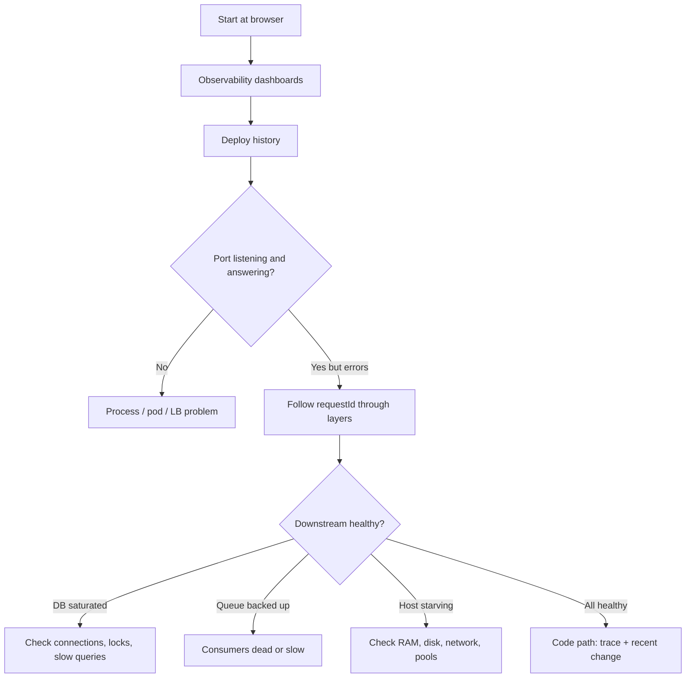

## Sources

- Google SRE Book: [Effective Troubleshooting](https://sre.google/sre-book/effective-troubleshooting/)
- Google SRE Workbook: [Incident Response](https://sre.google/workbook/incident-response/)
- Charisma Chan: [Debugging Incidents in Google's Distributed Systems](https://cacm.acm.org/practice/debugging-incidents-in-googles-distributed-systems/) (Communications of the ACM, 2020)
- Stack Overflow Blog: [Don't panic! A playbook for managing any production incident](https://stackoverflow.blog/2023/05/03/dont-panic-a-playbook-for-managing-any-production-incident/)
- Brendan Gregg: [The USE Method](https://www.brendangregg.com/usemethod.html)
- Grafana Labs: [The RED Method](https://grafana.com/blog/2018/08/02/the-red-method-how-to-instrument-your-services/)