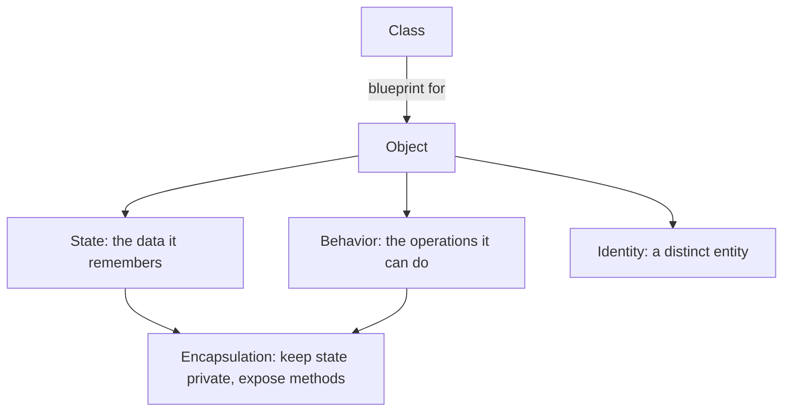
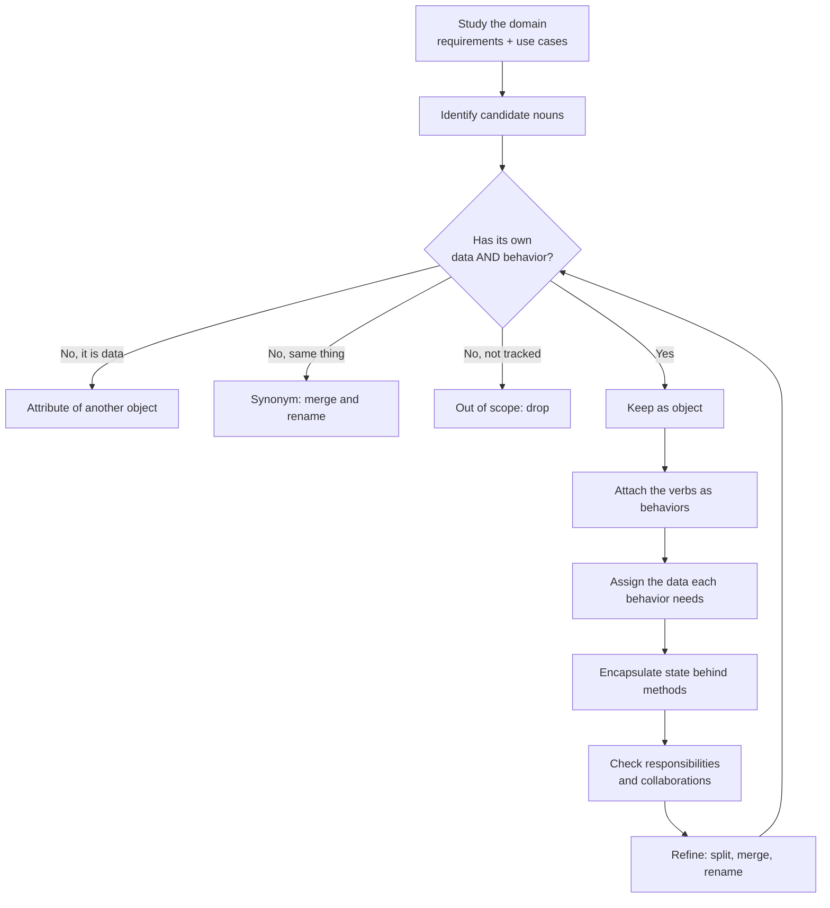
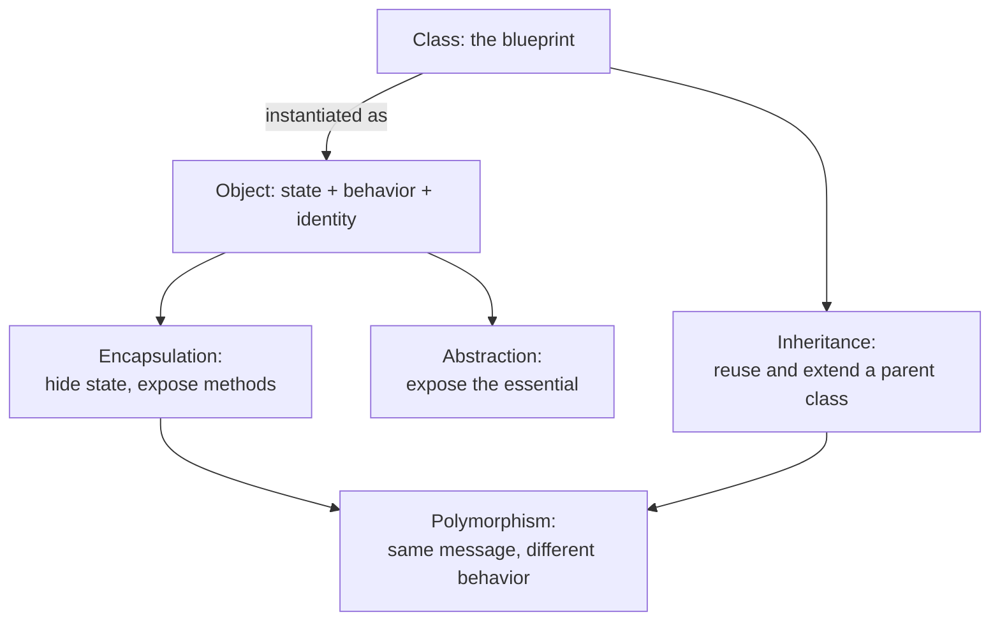
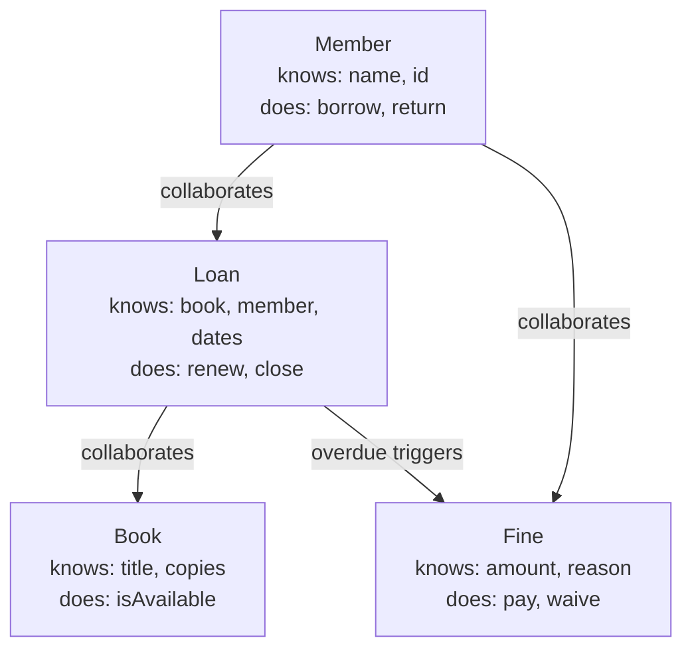

# How to Decide What the Objects Are in OOP

**TLDR**

- **OOP is a programming paradigm built on objects**: software entities that bundle data with the behavior that operates on that data, where a program is a set of objects that interact with one another. The syntax (classes, `new`, methods) is the easy part. The hard part is choosing *which* objects should exist.
- **An object is defined by state, behavior, and identity.** If a candidate only carries data and has no behavior of its own, it is usually an attribute of something else, not an object.
- **The method is disciplined filtering, not noun-spotting.** Study the domain, list candidate nouns from requirements and use cases, then keep only the nouns that have their own data *and* behavior. Everything else is an **attribute**, a **synonym**, or **out of scope**.
- **Behaviors come from verbs.** Attach the verbs connected to each surviving noun, then give each object the data it needs to perform them. This is where encapsulation and cohesion are decided.
- **A noun list is a starting point, not the answer.** Grammatical (noun-verb) analysis is Abbott's technique; it produces candidates, not a design. Responsibility-driven design and CRC cards are the correction: ask what each object is responsible for and who it collaborates with.
- **The core vocabulary that falls out of this**: object, class, encapsulation, abstraction, inheritance, polymorphism.
- **CRC cards** (Class, Responsibility, Collaborator) are the cheapest way to test the model by acting out scenarios before writing code.

## The problem: OOP teaches syntax, not object choice

Every OOP tutorial teaches the same things: how to declare a class, how to instantiate it, how to inherit. Almost none answer the question that actually decides whether the design works: **what should the objects be?**

This matters because object choice is the design. Get it wrong and the failure modes are predictable:

- A **god object** absorbs every responsibility (the `LibraryManager` that knows books, members, fines, emails, and the database).
- **Anemic objects** that are pure data bags with getters and setters, while behavior leaks into services and procedures. This is object-oriented code in syntax only.
- **Chatty objects** that call each other in long chains because responsibilities were scattered arbitrarily.
- **Duplicate concepts** ("user" and "member" as separate classes) that must be kept in sync forever.

There is a repeatable way to choose objects. It starts with the domain, not the code, and it treats every candidate as guilty until it proves it has both data and behavior.

## What an object actually is

Wikipedia's definition is the working one: **"Object-oriented programming (OOP) is a programming paradigm based on objects, software entities that encapsulate data and function(s). An OOP computer program consists of objects that interact with one another."**

An object is more precisely defined by three things, a definition that traces back to Grady Booch's *Object-Oriented Analysis and Design with Applications*:

- **State**: the data the object remembers (a book's title, a loan's due date).
- **Behavior**: the operations it can perform (a loan can be renewed).
- **Identity**: it is a distinct, distinguishable thing, even if two objects hold identical data.

A **class** is the blueprint that describes what data and behavior its objects will have; objects are instances of a class. The class is a compile-time concept, the object is a runtime entity.

The practical test that follows: if a candidate has **state but no meaningful behavior**, it is probably not an object. `title` and `dueDate` are values that belong to `Book` and `Loan`; they are not objects in their own right.

<div style={{display: 'flex', justifyContent: 'center'}}>



</div>

## The method: eight steps from domain to objects

The process below is the standard object-oriented analysis sequence: extract candidates from the requirements, filter them, attach behavior, then check responsibilities. The library system is the running example.

1. **Study the domain model.** Look at the real-world things and concepts the system deals with, using the requirements or use cases as your source. For a library: who borrows, what is borrowed, what rules apply.
2. **Identify candidate nouns.** In a library system: `book`, `member`, `loan`, `librarian`, `fine`, `title`, `dueDate`.
3. **Filter the candidates.** Keep a noun as an object if it has *its own data and behavior*. Drop or reclassify the rest:
   - **Attributes, not objects**: `title` and `dueDate` are data belonging to `Book` or `Loan`.
   - **Synonyms**: "user" and "member" may be the same thing. Pick one name.
   - **Out of scope**: things the system does not need to track.
4. **Find the behaviors.** Look at the verbs connected to each noun. A `Loan` can be `renew()`ed or `close()`d. A `Member` can `borrow()` or `returnBook()`.
5. **Assign the data each object needs to carry out those behaviors.** A `Loan` needs the book, the member, the loan date, and the due date.
6. **Bundle data and behavior (encapsulation).** Keep the data private and expose it through methods, so each object protects its own state and cannot be pushed into an invalid one.
7. **Check responsibilities and collaborations.** Each object should have one clear purpose, and objects should work together by calling each other's methods. CRC cards are a handy way to test this.
8. **Refine.** Split objects that do too much, merge ones that overlap, and rename unclear ones as understanding improves.

<div style={{display: 'flex', justifyContent: 'center'}}>



</div>

## The filter, applied to the library

Run the candidate list through step 3. The decision table is the whole method in miniature:

| Candidate | Verdict | Why |
| --- | --- | --- |
| `Book` | **Object** | Has state (title, ISBN, copies) and behavior (is it available). |
| `Member` | **Object** | Has state (name, id, loans) and behavior (borrow, return). |
| `Loan` | **Object** | Has state (book, member, dates) and behavior (renew, close, isOverdue). |
| `Librarian` | **Object** (often a `Member` role) | Acts on the system; may carry its own privileges. |
| `Fine` | **Object** | Has state (amount, reason) and behavior (waive, pay). |
| `title` | **Attribute** | Data owned by `Book`. |
| `dueDate` | **Attribute** | Data owned by `Loan`. |
| `user` | **Synonym** | Same concept as `Member`; keep one name. |
| `shelfLocation` | **Attribute** (or out of scope) | Only matters if the system tracks physical location. |

The test is not "is it a noun?" but "does it own behavior that operates on its own data?" `dueDate` fails: it is a value `Loan` remembers and calculates against. `Loan` passes: it is the thing that can be renewed, closed, and asked whether it is overdue.

## The behaviors decide the data

Once the objects are chosen, the verbs tell you what data each one must carry. This is the step that most tutorials skip, and it is where cohesion is won or lost. Keep the data minimal: an object should hold exactly what its behaviors need, not a copy of everything nearby.

```typescript
class Loan {
  // State: only what the behaviors below need.
  private readonly book: Book;
  private readonly member: Member;
  private readonly loanDate: Date;
  private dueDate: Date;
  private closed = false;

  // Behavior: the verbs found in step 4.
  renew(): void {
    if (this.closed) throw new Error("Cannot renew a closed loan");
    this.dueDate = addDays(this.dueDate, 14);
  }

  close(): void {
    this.closed = true;
  }

  isOverdue(now: Date): boolean {
    return !this.closed && now > this.dueDate;
  }
}
```

Note what is **not** here: `Loan` does not compute fines, send emails, or query the database. Those belong to `Fine`, a notifier, and a repository. Handing them to `Loan` is how the god object is born.

## The vocabulary that falls out of the process

Choosing objects forces you to name the mechanisms you are using. These are the six terms every OOP interview and design review assumes:

- **Object**: a software entity that bundles data (state) with the behavior that operates on that data.
- **Class**: a blueprint that describes what data and behavior its objects will have. Objects are instances of a class.
- **Encapsulation**: bundling data and behavior together, and (in the fuller definition) hiding the internal data so it can only be accessed through the object's methods.
- **Abstraction**: exposing only what is essential about an object and hiding the complexity behind it. You use `account.withdraw(50)` without needing to know how it works internally.
- **Inheritance**: a class reusing and extending the data and behavior of another class, such as `SavingsAccount` extending `BankAccount`.
- **Polymorphism**: different objects responding to the same message in their own way. Calling `shape.area()` works for a `Circle` or a `Square`, and each calculates it differently.

<div style={{display: 'flex', justifyContent: 'center'}}>



</div>

Two cautions when using this vocabulary. First, **inheritance is not the same as polymorphism**: you can get polymorphism through interfaces or composition without a single `extends`. Second, and related, the modern default is **composition over inheritance**; reach for inheritance only for a genuine, substitutable is-a, and prefer an interface when you only need the polymorphic call site.

## The catch: nouns are candidates, not a design

Step 2 (list the nouns) comes from **grammatical analysis**, often called **Abbott's technique** after Russ Abbott's 1983 paper *Program design by informal English descriptions*. Its rule is simple: in informal English, nouns map to candidate objects and classes, verbs map to operations.

That rule is useful and it is also dangerous. Plain English does not respect software boundaries. It buries behaviors in nouns ("the system prints a report" makes `PrintReport` look like an object), hides synonyms, and gives no way to tell an object from a dumb data holder. Taking the noun list as the design produces exactly the anemic, chatty models described at the top.

**Responsibility-driven design**, introduced by Rebecca Wirfs-Brock and Brian Wilkerson at OOPSLA 1989, is the correction. It shifts the question from "what data does this thing have?" to:

- What is this object **responsible for knowing**?
- What is it **responsible for doing**?
- Who must it **collaborate with** to fulfill those responsibilities?

Objects are roles with responsibilities, not bundles of data with algorithms bolted on. Steps 4 through 8 above are responsibility-driven: verbs become responsibilities, and responsibilities drive both the data and the collaborations. Use noun extraction to fill the candidate bucket, then use responsibilities to decide what survives.

## CRC cards: test the model before you build it

The cheapest responsibility test is a **CRC card** (Class, Responsibility, Collaborator), introduced by Kent Beck and Ward Cunningham in *A Laboratory for Teaching Object-Oriented Thinking* (OOPSLA 1989). Each index card holds:

- the **class name** at the top,
- the **responsibilities** (what it must know or do) on the left,
- the **collaborators** (who it needs) on the right.

Then you play out a use case by physically moving the cards. For "member borrows a book":

1. `Member` is asked to `borrow(book)`.
2. `Member` cannot do it alone, so it collaborates with `Loan`: create a loan for this book and member.
3. `Loan` asks `Book` whether a copy is available.
4. If a card gets too many responsibilities, it is doing too much: split it. If two cards always move together, merge or reclassify them. If a card is never picked up, it is probably not an object.

This is the same refinement loop as step 8, done on paper where it costs minutes instead of a refactor.

<div style={{display: 'flex', justifyContent: 'center'}}>



</div>

## A checklist for a new model

Before you write the class, run through these:

- Does it have **behavior of its own**, or is it only data? (Only data means attribute.)
- Is it a **synonym** for something that already exists? (Merge the names.)
- Is it **in scope** for what the system must do? (If not, drop it.)
- Does it have **one clear responsibility**, or is it absorbing several? (Split it.)
- Is its **state minimal** for its behaviors, and is that state **private**? (Encapsulate it.)
- Do its **collaborations point one way** and stay shallow? (Deep chains mean responsibilities are misplaced.)
- Are you using **inheritance only for a genuine is-a**, and polymorphism elsewhere? (Otherwise compose.)

## The one rule

An object earns its existence by owning **both data and behavior**. Extract candidates from the domain with nouns, but let **verbs and responsibilities** decide what survives: attach behaviors, give each object only the state those behaviors need, hide that state behind methods, and test the result with CRC cards before writing code. Nouns start the search; responsibilities end it.

## Sources

- Wikipedia, [Object-oriented programming](https://en.wikipedia.org/wiki/Object-oriented_programming): "Object-oriented programming (OOP) is a programming paradigm based on objects, software entities that encapsulate data and function(s). An OOP computer program consists of objects that interact with one another."
- Wikipedia, [Object (computer science)](https://en.wikipedia.org/wiki/Object_(computer_science)): an object has state, behavior, and identity, and can model a part of reality or be an invention of the design process.
- Grady Booch, *Object-Oriented Analysis and Design with Applications*, 2nd ed., Benjamin/Cummings, 1994 (object as state, behavior, and identity; the object as "an individual, identifiable item, unit, or entity... with a well-defined role in the problem domain").
- Russ Abbott, "Program design by informal English descriptions", *Communications of the ACM*, 26(11), 1983 (grammatical analysis: nouns as candidate objects, verbs as operations).
- Kent Beck and Ward Cunningham, "A Laboratory for Teaching Object-Oriented Thinking", *OOPSLA '89 Conference Proceedings*, SIGPLAN Notices 24(10), 1989 ([paper](https://c2.com/doc/oopsla89/paper.html)) (CRC cards: class, responsibility, collaborator).
- Rebecca Wirfs-Brock and Brian Wilkerson, "Object-Oriented Design: A Responsibility-Driven Approach", *OOPSLA '89*, 1989, and Rebecca Wirfs-Brock, Brian Wilkerson, and Lauren Wiener, *Designing Object-Oriented Software*, Prentice Hall, 1990 (responsibility-driven design; how to find, characterize, and reject candidate objects).
- Rebecca Wirfs-Brock and Alan McKean, *Object Design: Roles, Responsibilities, and Collaborations*, Addison-Wesley, 2003 (finding objects, role stereotypes, collaborations).
- Wikipedia, [Encapsulation (computer programming)](https://en.wikipedia.org/wiki/Encapsulation_(computer_programming)) (bundling data with the methods that operate on it; hiding internal state).
