# Decoupling Case Studies: When to Apply Each Level

## The problem: no Swiss Army knife in software

Most software damage does not come from a lack of skill. It comes from over-engineering. Someone adopts a so-called best practice, applies it everywhere, and the system becomes harder, not easier, to work on.

The reason is a hidden assumption: that there is one right way to build software, and that a well chosen pattern fits every situation. That assumption is false. There is no Swiss Army knife. There is no single solution that fits every case.

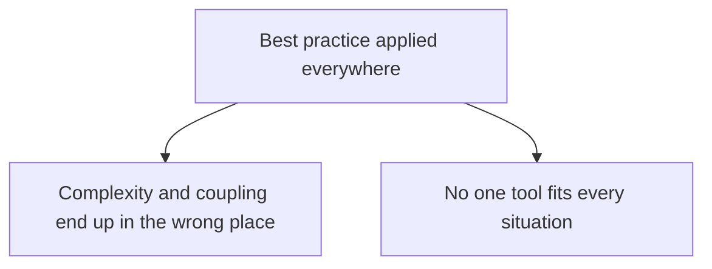

Decoupling is one of the loudest of those practices. The previous article, *Decoupling Moves Complexity*, showed that decoupling is not a goal but a spectrum: moving away from an in memory method call trades one kind of complexity for another. You never remove complexity, you decide where it lives.

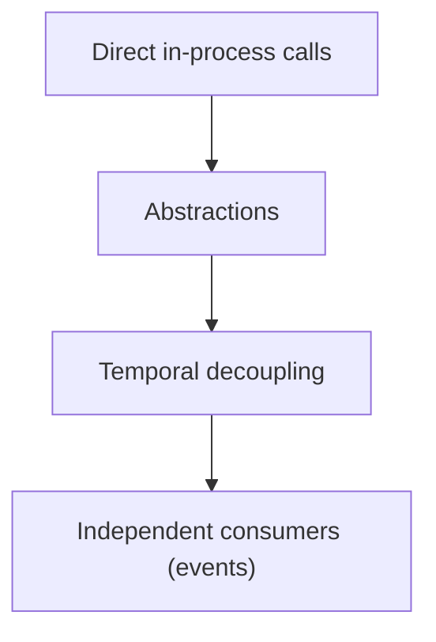

This article turns that spectrum into a decision guide. For every level, it answers two questions with concrete business scenarios: **when is this technique feasible, and when is it not?** The point is to build the judgment to know, in a given situation, which level to use and which to leave alone.

A future helper article, *Brownfield: Refactoring When the Decisions Are Already Made*, covers the special hardest case of applying these techniques inside an existing system. The guidance here assumes a team that is free to choose, with a note in each section pointing to where brownfield changes the answer.

## The decision method: ask what the situation needs most

Do not line up the techniques and pick the fanciest one. Look at the real situation, extract the single factor that matters most, and then pick the level that matches that factor. What you gain must beat the complexity you accept.

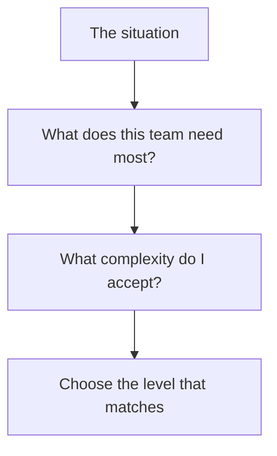

Each of the following cases applies that method and lands on a different level. Read them together: they are not four companies to memorize, they are four signals for when a technique is and is not worth it.

## Level 0: Direct coupled calls, the monolith

### The situation it fits

A brand new product. No online customers on day one. Traffic that will grow slowly, if at all. A small team, and a domain that has not yet been proven by real users.

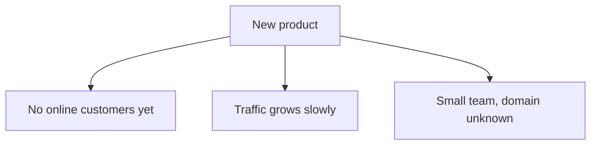

What the team needs most is **learning**. It has no idea where its real boundaries are, because no real user has told it what matters. It has no scale pressure because there is no traffic.

- It's feasible when: you need to ship an unproven idea fast, the team is small, and the total known surface is small enough that coupling costs little.
- Not feasible (harmful) when: traffic is large or highly bursty, multiple unpreventable teams must change the same area independently, or the product already generates demand.

Why is direct good here? A fast, unproven product teaches you where the seams really are, and coupling is cheap when there is little code. It lets the product move fast at a time when speed is the only advantage it has. Fowler calls this MonolithFirst: start as a monolith even if you expect to split later.

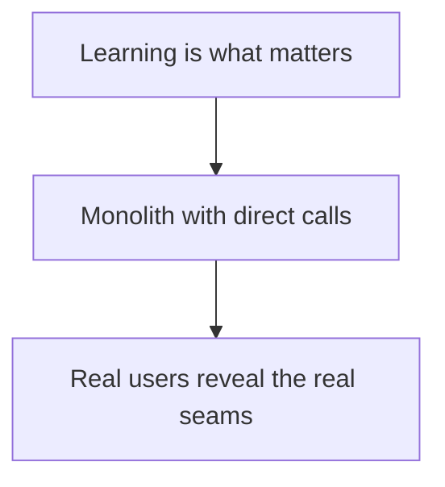

When it stops being good: the moment the situation no longer looks like a small, unproven, single-team product. That is when you move up to the next level. A monolith is not the final answer; it is the correct starting point.

### How people get the monolith wrong

There are two wrong ways to read this. The first is to keep the tight coupling forever, even after real teams, traffic, or bursts arrive, and then you get the big ball of mud. The second is to treat "start as a monolith" as a reason to avoid *any* internal structure, so the code grows without seams and is later impossible to split. The correct reading: start coupled, but keep the seams clean enough that splitting later is a controlled move, not a rewrite.

## Case 1: Boundaries (and only sometimes abstractions)

### Situation: the same code grows, but now many teams inhabit it

The product worked and users grew. Now several teams all edit the same area. Every change touches many files. Teams step on each other. No one owns any part.

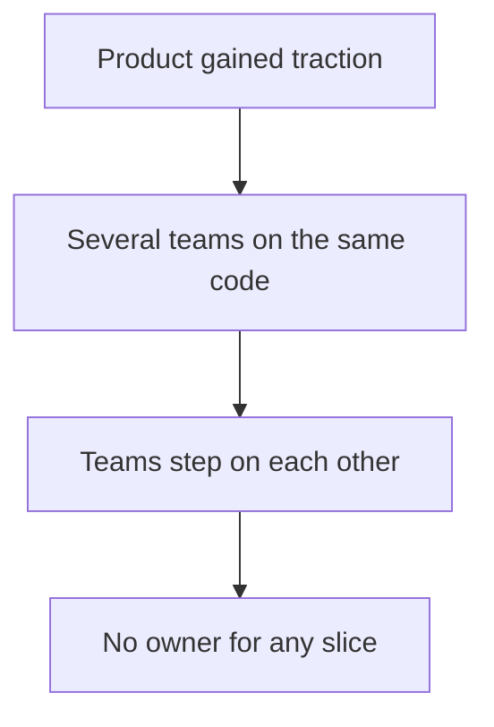

What the team needs most is **coordination**. Not scaling. A developer wants to stop colliding with another developer.

The right move is **boundaries**: split the code into modules that each team owns. The boundary itself is what fixes the collision, because each team now has a place it can change without touching the others' code.

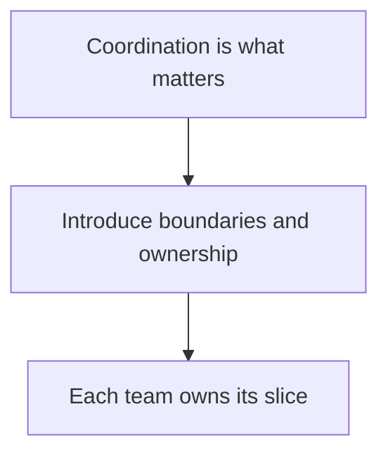

Note what this does *not* automatically justify: **abstractions**. An interface is not a boundary. A boundary is a split in ownership; an abstraction is an indirection between a caller and a concrete implementation. You can have strong boundaries with no interfaces at all — modules that simply do not reach into each other. And you can have a forest of interfaces with no real boundaries. Teams colliding justify the split. They do not, by themselves, justify an interface.

### The abstraction trigger is multiple implementations, not teams

The reason to use an interface is that there are **multiple real implementations** your scenario requires. That is the whole point of an interface: the caller does not know which implementation it is talking to, and the wiring decides at runtime. The payment flow might run against Stripe for US customers, Adyen for Asia, and a test provider in tests. Now the interface earns its place, because it genuinely hides which one is behind it.

This trigger is **independent of team size and team count**. A one-person project with two payment providers needs the interface. A fifty-team company with one payment provider does not. The number of implementations decides, not the number of developers.

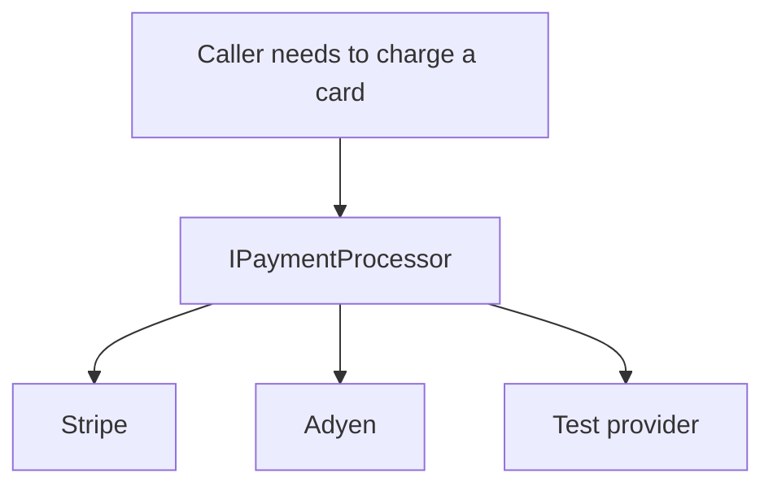

### How people get abstractions wrong

The common mistake is creating an interface over a **single implementation** just for the sake of having an interface. Every method in the interface is a pass-through to the one class that implements it. There is no second implementation to hide, no variation to make use of, and the indirection adds a file to navigate with nothing behind it.

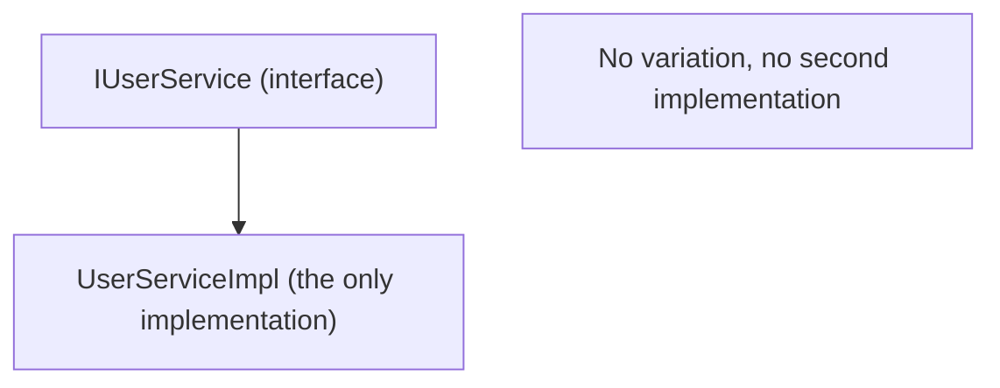

That is the mistake this article calls out again and again: applying a technique without the trigger. The trigger for an abstraction is real variation in implementations. Without it, the interface is noise.

- Boundaries are feasible when: teams have reached the point where concurrent ownership causes collisions, and the seams can be found in the code.
- Boundaries are not feasible when: it is still one small team with no contention, or you draw boundaries before you have evidence of where they are.
- Abstractions are feasible when: the scenario genuinely needs more than one implementation, or the consumer owns a contract it wants to keep stable.
- Abstractions are not feasible when: every interface has one implementation and no plan for a second. That is just noise, no matter how many teams exist.

The seam that was a worthless guess in Level 0 is now meaningful because many consumers and owners give it real content.

## Case 2: Temporal decoupling with queues

### Situation: bursts of traffic that the system must survive

The product works but meets bursts. A launch day, a black Friday sale, a flash sale. Orders are heavy in short windows. If every order must synchronously hit the database, payment processor, email, and inventory at the same instant, the whole system fails under load.

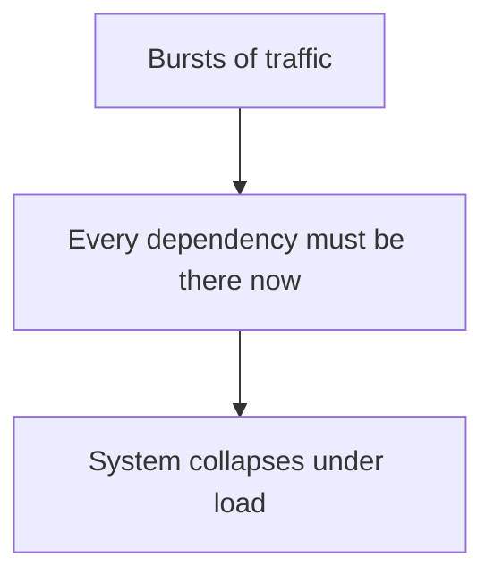

What the team needs most is **availability under bursts**. The problem is the number of things that must all be ready at the same instant.

- It is now correct when: load arrives in spikes and the synchronous chain cannot absorb them, and the business accepts that work completes a little later than a click.
- Not feasible when: the system is small and has no bursts, or low latency is a hard requirement and a delayed side effect breaks the contract (say returning "payment declined" instantly matters).

The move is a queue. The API accepts the request, writes it to a queue, and returns quickly. Workers process at the rate the system can safely handle.

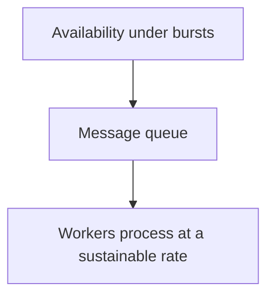

Temporal decoupling is not free: you now own retries, idempotency, dead letter queues, and the outbox, and the meaning of the user-facing response changes (order accepted vs order completed). You choose the queue when surviving a burst is worth those costs.

### A separate trigger: do not pay for the peak

The bursts case above is about surviving. There is a second, independent reason to queue work: the system could survive the burst by scaling every consumer up to the size of the peak, but then it pays for that capacity for the whole month in exchange for the hour it needs it. The queue lets the team size its consumers for the average and let the spikes accumulate as a backlog instead of a bill.

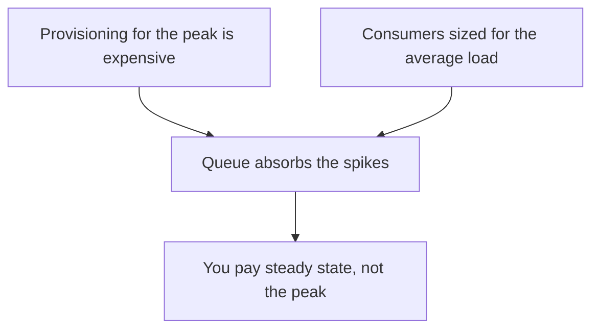

This is the documented pattern that Microsoft's Azure Architecture Center calls Queue-Based Load Leveling: it decouples the rate of incoming requests from the rate at which workers process them, so your infrastructure can be provisioned to the *average* and not the peak. Microsoft's worked example reads exactly like this case: a retail chain's inventory service bursts when stores open and when promotions hit, and leveling with a queue means it no longer provisions compute for the worst day. The deciding question is about the bill, not about predictability or latency.

### An example: Netflix's queued video encoding pipeline

This is not a hypothetical. Netflix documents how its video processing pipeline uses queues this exact way. Every encoding job is a message, encoding workers consume from a queue, and Netflix scales its worker count based on the *depth* of those job queues, not on the raw rate of uploads. Encoding is the classic workload where this shines: it is compute-heavy, it arrives in bursts (a new title drops, a studio pushes a batch of assets), and the end result is not needed instantly.

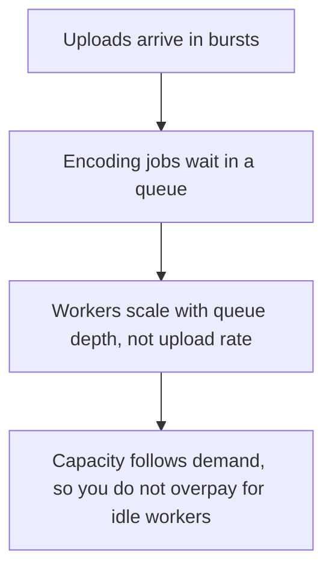

- Feasible when: the average is a small fraction of the peak, and the surge can be deferred to a queue without breaking the product. imperfectus The result an hour late is invisible to the user, so the backlog is free to burn down overnight.
- Not feasible when: the elevated load is sustained, because then the queue never drains, the backlog never falls, and the workers cannot catch up; the same hourly bill stays and the users wait forever.
- If the video result is needed within seconds of the upload, the queue is wrong for a different reason: creating the user-facing result immediately matters more than the bill, so the sync path is the right fit.

### How people get queues wrong

The common mistake is reaching for a queue because "asynchronous sounds more scalable," when there is no burst and no delayed-work acceptance. You then pay for retries, idempotency, and unknown consumer timing to solve a load problem you do not have. Worse, you can change the meaning of the response (accepted vs completed) for zero benefit. A queue is a response to a real burst, not a decoration.

## Case 3: Events and independent consumers

### Situation: many downstream reactions the order flow must not coordinate

The company now has many interests reacting to an order that are not the order flow's concern: loyalty points, analytics, a recommendation engine, an external partner.

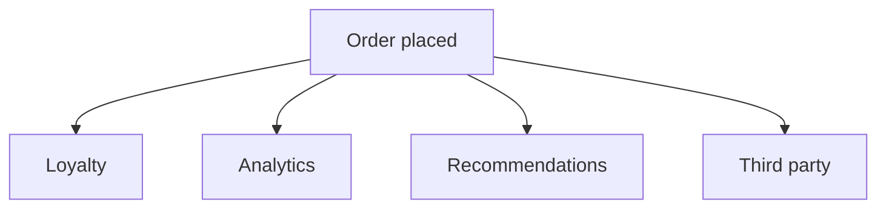

What the system needs most is **independent evolution**. You do not want to change the Order service each time a new consumer appears, and consumers want to change without coordinating with the publisher.

- It is now correct when: new consumers consistently appear, consumers evolve on different cadences, and you truly do not know who all the consumers are at the boundary.
- Not feasible when: there are few consumers and one of them is. The publisher silently paying the cost of an event bus to talk to one consumer is waste. Also, if end-to-end behavior must be easy for a human to trace, events make it invisible, and that is a real cost.

When it fits, the answer is an `OrderPlaced` event broadcast to many subscribers, each of which can slot in or evolve with no change to the publisher.

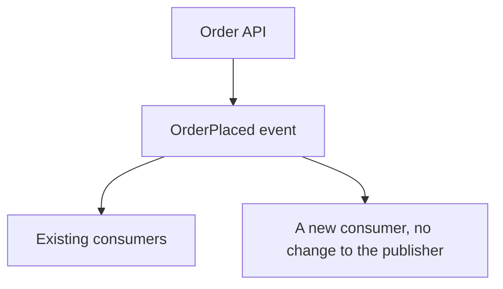

Accept the invisible complexity: no single call stack shows the whole chain, and events are contracts you must version and treat as stable. For this situation the independence is worth more than the invisible behavior.

### How people get events wrong

The common mistake is using an event bus to talk to a single consumer, or to a handful of consumers you can find and could call directly. Then the producer pays for a publisher, a topic, versioned contracts, and invisible behavior, all to reach one known class. Events are a response to genuinely independent, multiplying consumers. Publishing to one stable receiver is just your indirection, and you will regret debugging it later.

## Case 4: The brownfield system (the hard mode)

Up to here we assumed a team free to choose. A brownfield system is different: the decisions are already made, baked into code, deployment, and behavior. Applying a desired technique now is a refactoring, and it is sharply harder than applying it during development.

What the team needs first is **understanding**, not a technique. Chesterton's fence applies: the odd boundary, the ugly if, the coupling in a surprising place, may exist because it holds something important. Do not tear it down, and do not replace it with an event, until you know why it is there.

- It works when: you have mapped the existing system, you identify seams that already exist in production, and you choose to extract a seam the business genuinely benefits from. This is the Strangler Fig route: build and extract incrementally, replace module by module instead of rewriting.
- Not feasible when: you do a big rewrite from a guess, break a working behavior without a safety net, or add boundaries and events that the existing code does not support.

Fowler's own note adds another truth: it is easier to find real seams in a brownfield, because the system already shows you its actual boundaries under load. The hard part is trusting the seams you can see and respecting the ones you cannot.

Greenfield versus brownfield, which is easier? Greenfield is easier to ship fast. Brownfield is easier to partition correctly, because the code gives you the real seams. This article focuses on the greenfield case where you are free to choose; a companion article on brownfield focuses on the refactoring judgment.

## The decision table

| Level | Feasible when | Not feasible (harmful) when |
|---|---|---|
| Direct calls | Unproven small product | Real traffic, bursts, or many teams |
| Boundaries | Several teams with contention, real seams | One team, no real variation |
| Abstractions | Real variation behind a seam (multiple impls, consumer contract) | One implementation, no plan for a second |
| Temporal, queue | Bursts and spikes, or avoiding provisioning for peak, tolerate delayed work | Low traffic, no spikes, or an instant-latency contract |
| Events | Independent, ever growing consumers | One consumer, or you need a visible flow |
| Brownfield | Existing system, seam you can see | A rewrite based on guessed seams, breaking validated behavior |

One product travels across all four. The correct level is the one matching the current factor, and it can move.

## Conclusion

The decision method is not "go decoupled." It is "read the situation, name the factor, and pick the level that places less damage."

- Learning matters: start with direct calls and grow.
- Coordination matters: add boundaries.
- Availability matters: add temporal.
- Independent evolution matters: add events.
- Already-built system: understand first, then change.

There is no universal rule. There is only reading the situation and matching it to the complexity you can afford to live in.

## References

- Comartin, D. (2026). *Decoupling in Software Architecture Moves Complexity*. CodeOpinion. https://codeopinion.com/decoupling-in-software-architecture-moves-complexity/. Source of the spectrum this guide applies.
- Fowler, M. (2015). *MonolithFirst*. martinfowler.com. https://martinfowler.com/bliki/MonolithFirst.html. Ground the greenfield choice: start as a monolith, split later.
- Newman, S. (2015). *Microservices For Greenfield?*. samnewman.io. https://samnewman.io/blog/2015/04/07/microservices-for-greenfield/. Why brownfield can be easier to decompose correctly (the real seams exist).
- Knowledge base. *Decoupling Moves Complexity*. decoupling-moves-complexity.md. The spectrum and definitions.
- Knowledge base. *Abstractions Must Earn Their Place*. abstractions-are-contextual.md. One use and one entry point do not justify an abstraction.
- Knowledge base. *What Makes Coupling Loose*. what-makes-coupling-loose.md. Coupling is about knowledge, not transport.
- Knowledge base. *Bounded Contexts Without Microservices*. bounded-contexts.md. Boundaries and their owners.
- Knowledge base. *Monolith vs Microservices*. monolith-vs-microservices.md. The cost of splitting too early.
- Microsoft. (2026). *Queue-Based Load Leveling Pattern*. Azure Architecture Center. https://learn.microsoft.com/azure/architecture/patterns/queue-based-load-leveling. Source of the load leveling framing: decouple intake rate from processing rate so consumers can be sized for average load, and the cost benefit of provisioning for average rather than peak.
- Netflix Technology Blog. (2024). *The Making of VES: the Cosmos Microservice for Netflix Video Encoding*. netflixtechblog.com. https://netflixtechblog.com/the-making-of-ves-the-cosmos-microservice-for-netflix-video-encoding-946b9b3cd300. Real queue-driven video pipeline: workers scale with job queue depth.