# Decoupling Moves Complexity

## The problem: decoupling is sold as pure wins

What happens when someone clicks the Place Order button? To the user it is one click. Behind that click a lot runs: save the order, record the payment, charge the card, reserve inventory, send a confirmation email, record loyalty points, and maybe fire analytics, recommendations, or other processes that react to the order. So much is happening that much can go wrong.

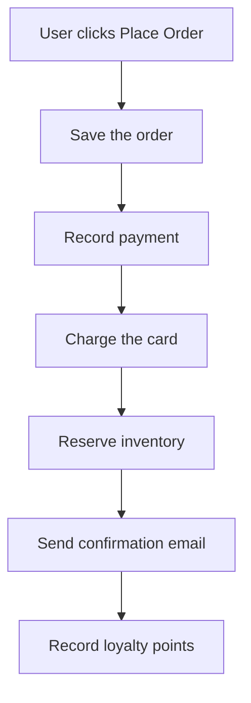

Developers are told that decoupling fixes this. Use abstractions. Use dependency injection. Replace direct calls with messages and queues. Use publish subscribe and event driven architecture.

All of those things can be useful, but they are not goals. More importantly, they are not free.

Every step away from an in memory method call adds a new kind of complexity and a new cost. You might gain independent deployability, extensibility, scalability, or different availability characteristics. But you are also introducing something else that you now have to understand, operate, and debug.

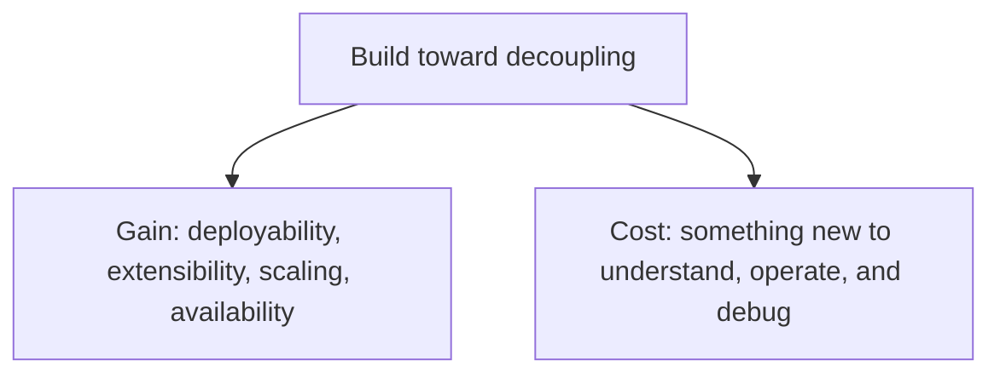

## You do not remove complexity, you move it

It is easy to look at a large procedural workflow and believe decoupling will clean it up.

One button click has to save the order, send an email, update loyalty points, charge the payment, and reserve inventory. Doing all of that inline in one place becomes a hot mess. Splitting the responsibilities apart seems like it should reduce complexity.

It does not.

You did not change the amount of complexity in the business process. You did not make the payment, inventory, email, and loyalty concerns disappear. You moved the complexity to somewhere else.

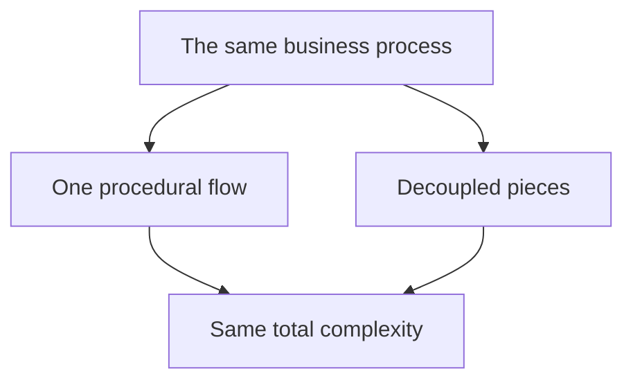

That is the better way to think about decoupling. It is a spectrum, not a goal. The question is not how far you can move toward a fully decoupled system. The question is where your business case belongs on that spectrum.

You might use direct in process calls. You might introduce abstractions with interfaces and dependency injection. You might add a queue for temporal decoupling. You might use publish subscribe with independent consumers.

This is not a maturity model. The goal is not to reach a system where everything runs through events. Forcing that everywhere is the classic round peg in a square hole, and it ends in a pile of pain. The goal is to find what fits best where.

## Direct calls give you traceability

Start with the most direct approach. The user clicks Place Order and everything happens procedurally inside the same process. The application saves the order, reserves inventory, charges the payment, records loyalty points, and sends the email, all through direct execution. Most code works this way even when no one plans for it.

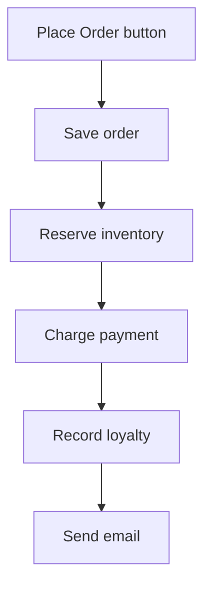

The strength is traceability. You can read the code, go to a definition, set breakpoints, and inspect the call stack at any point. The ordering is explicit because the code tells you what happens and in what order.

Traceability matters for debugging. When something fails, there is a clear place to start. There is a call stack. There is a path through the code. You can step through the workflow from beginning to end.

The downside is tight coupling and shared availability. Even if saving the order, charging the card, and sending the email live in different modules, they are coupled through the workflow. They all run together when the user clicks the button. And because they all run together, they must all be available at the same time. If the payment processor, email provider, inventory system, or database is down, the whole operation fails. One unavailable dependency takes down the whole request.

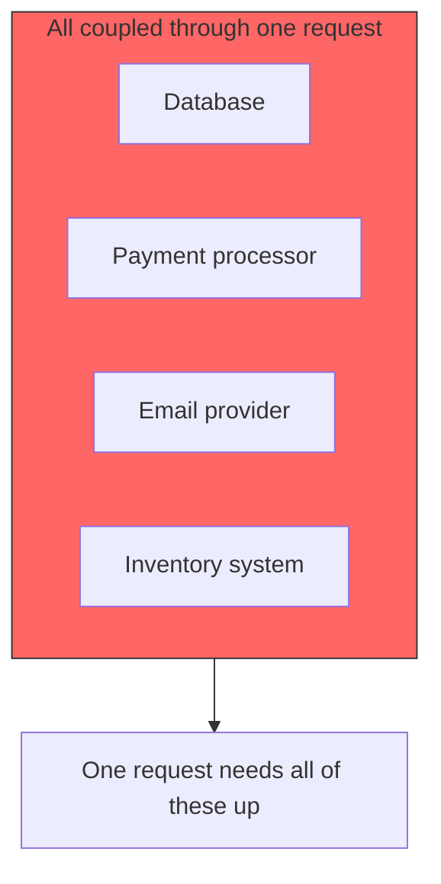

As this grows, it becomes the big ball of mud, sometimes called the turd pile. More responsibilities get tied together through one procedural flow and the code turns into a spaghetti fest.

Direct calls give you traceability, but they also give you coupling and shared availability.

## Abstractions create seams but add indirection

The next step is usually to stop depending directly on concrete implementations. Instead of coupling the order flow to Stripe, an email provider, or a specific inventory implementation, we introduce abstractions. The workflow depends on an `IPaymentProcessor`, an inventory reservation interface, and an order email interface.

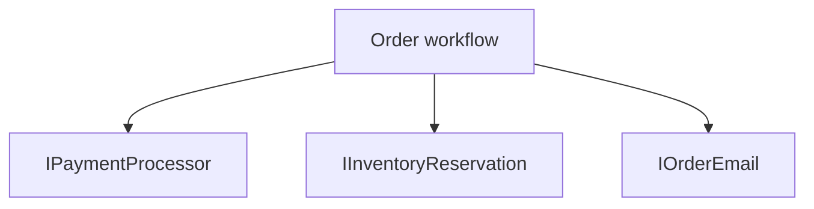

Now the workflow does not depend on the concrete implementation. The abstractions create seams. Those seams can become useful boundaries. They can represent functional boundaries, hide implementation details, and give some extensibility.

The caller does not need to know how Stripe works. It only knows it wants to charge a card or record a payment. That detail belongs behind the abstraction.

There are real benefits. You can have multiple implementations. You can swap providers. You can use a test implementation. A SaaS application might choose a payment processor at runtime based on the customer.

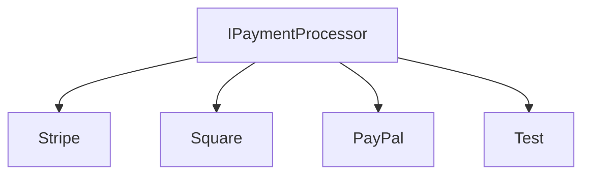

But the cost is indirection, especially at runtime. An interface alone does not tell you what actually happens. The implementation might be Stripe, Square, or PayPal. There might be decorators around it for retries, logging, metrics, or other behavior. The interface is only part of the story. The real behavior depends on how everything is wired at runtime.

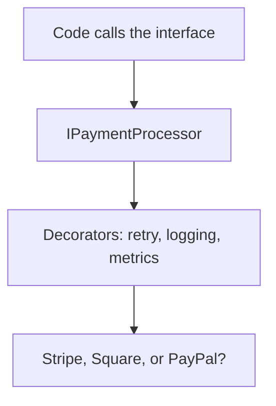

The pain gets worse when every class has an interface but every interface has exactly one implementation. Why does that interface exist? Nobody knows. It is not a meaningful boundary. It is an abstraction built directly from the single implementation underneath it. There is no real variation, so you do not even yet know what the abstraction should represent. It is just noise.

Abstractions are useful when they create a seam that matters. They are not automatically useful because an interface exists.

## Temporal decoupling changes the meaning

**Temporal decoupling** is the separation of the *time* at which work is produced from the *time* at which it is processed. The producer finishes its job now, hands the work to something that holds it, and never waits for the consumer. The consumer does the work later, possibly seconds or minutes afterwards, and possibly when the producer is long gone.

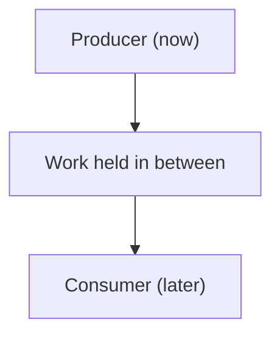

It is different from the previous two rungs, which only changed *where* the work runs. Temporal decoupling changes *when* it runs. The producer and consumer are no longer coupled in time: the producer does not need the consumer to be available, and the consumer does not need the producer to still exist.

The next step is queues. The user clicks Place Order, but the application no longer processes everything immediately. The Order API places a message on a queue and returns, a separate process picks up the message and finishes the order later.

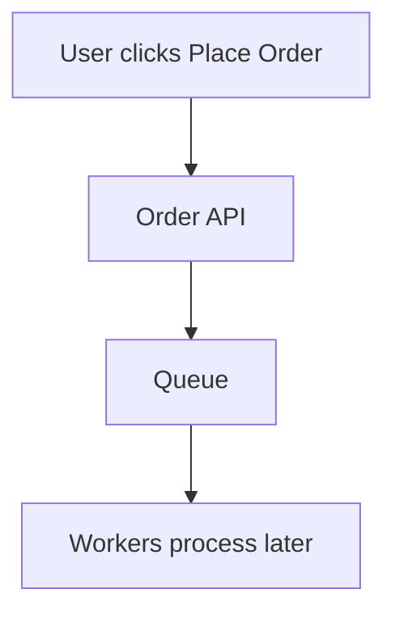

This gives different scaling and availability. When orders flood in, they do not all hit the database, email, inventory, and payment at the same instant. Messages wait in the queue, and workers process them at the rate the system can absorb. The producer does not need the consumer to be available at that moment. The worker can be offline for a while and process the message later.

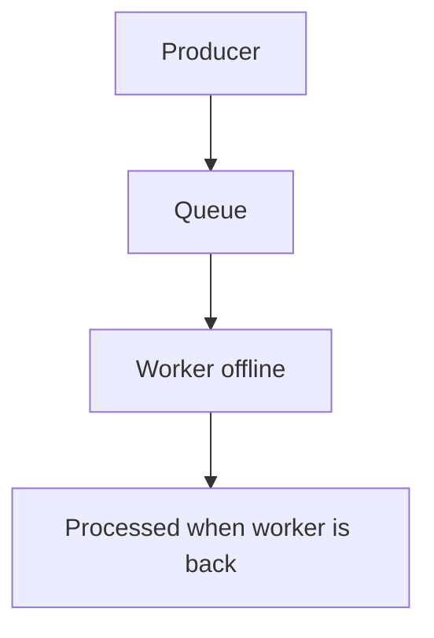

That is useful, but the biggest change is not technical. It is semantic.

There is a difference between an order being completed and an order being accepted.

With direct execution, the user clicks and the whole workflow may finish before the response arrives. If the card is declined, the user knows immediately.

With a queue, the response says the order was placed when it has really only been accepted for processing. The payment may not happen for another minute, or five minutes if the system is backed up.

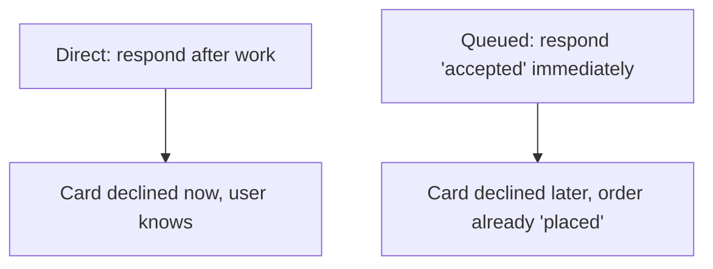

So what happens when the card is declined? The user cannot be told immediately, because the system already said the order was placed. The communication style changes. The UI may show the order as processing. The customer may get an email if the payment fails. The system may retry the payment. Whatever the answer, the experience is different.

You usually cannot take a direct procedural workflow, make it asynchronous, and expect everything to stay the same. The UI, the user experience, and the meaning of the response all change because the work now happens later.

## Queues bring technical consequences

Beyond the semantic shift, choices have engineering consequences. When processing happens asynchronously, you must own a set of problems that did not exist before.

- **Retries.** If a downstream service such as Stripe is unavailable, should the message be retried? How often? For how long? With what backoff?
- **Duplicate delivery.** A timeout can make it unclear whether a message was processed, causing the message to be delivered again.
- **Idempotency.** Can the same message be handled twice without charging the customer twice, reserving inventory twice, or recording loyalty points twice?
- **Poison messages.** A message that always fails keeps taking a worker and blocks real work.
- **Dead letter queues.** If a message cannot be processed, you usually do not want to lose it. You move it somewhere it can be investigated.
- **Outbox pattern.** If you save state to the database and publish a message, how do you guarantee both happen consistently? You do not want to persist the order but drop the message that starts the rest of the workflow.

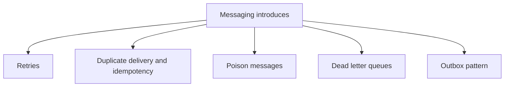

These are not random implementation details. They are consequences of choosing messaging. If you choose the queue, you own all of these.

You also lose the in process call stack. Distributed tracing with OpenTelemetry can show you what happened across processes, but it is not the same as stepping through one call stack in a debugger. The workflow now crosses process boundaries, and debugging changes with it.

Temporal decoupling gives you time and availability flexibility, but you are now operating a distributed workflow. You moved complexity into time and infrastructure.

## Independent consumers give invisible behavior

At the far end of the spectrum is publish subscribe and event driven architecture. This gives the deepest decoupling.

The producer and consumers are deeply decoupled. From the publisher's view, there may be zero, two, or one hundred consumers. The publisher does not need to know who they are.

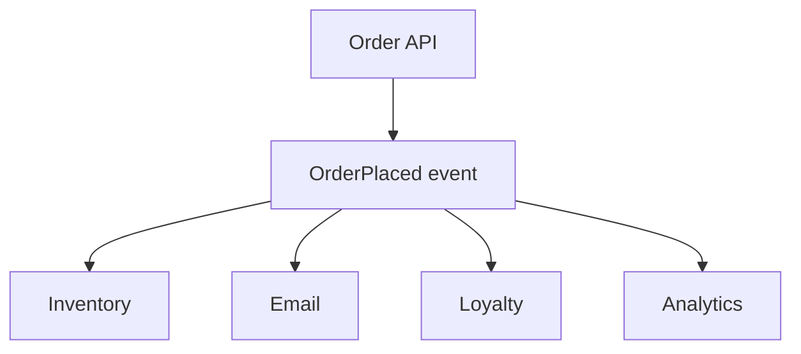

The Order API publishes an `OrderPlaced` event, and any service that needs to react can subscribe to it. New consumers can be added without the publisher changing. Existing consumers evolve independently. If a recommendation engine arrives later, it subscribes to the event and the Order API never knows. That is real extensibility.

The tradeoff: the same decoupling that gives flexibility also makes system behavior harder to see. When an event is published, what actually happens? Many consumers may react. Some may publish more events that trigger more consumers. In event choreography, there may not be one place you can see the full behavior end to end.

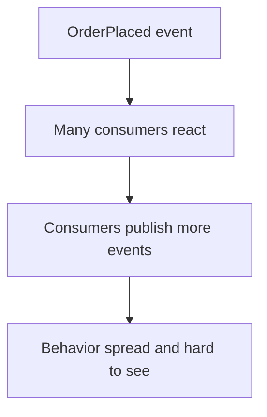

There is no single method to step through. There may not be a single stack trace. The behavior feels invisible because it is distributed across consumers, processes, queues, topics, and contracts.

Independent consumers can evolve, but now you live with invisible behavior.

## Events are contracts

Publish subscribe also changes how you think about events themselves. Events are contracts, and you must treat them that way.

You cannot change an event freely without considering the consumers hitting it. You may not know every consumer, but that does not mean they do not exist.

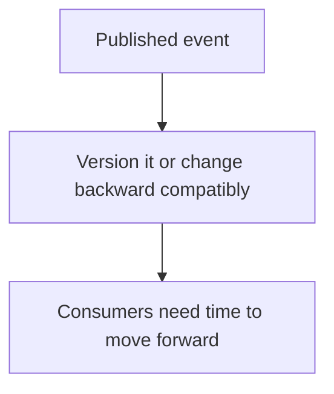

Events must be versioned or changed in a backward compatible way. Consumers need time to move forward. Publishers must understand that once an event is in use, its shape and meaning matter outside the publisher's boundary.

This is another place where complexity moved. The producer no longer coordinates every downstream action, but now the event contract must be stable enough for independent consumers to rely on it.

## Where the complexity lives

Where you land on the spectrum determines where the complexity lives.

| Level | You gain | Complexity you accept |
|---|---|---|
| Direct calls | A traceable call stack, predictable ordering | Live coupling and shared availability |
| Abstractions | Replaceable seams and boundaries | Hidden indirection and runtime wiring |
| Queues | Temporal decoupling and flexible load | A distributed workflow, time and infra problems |
| Events | Independent, extensible consumers | Invisible behavior spread across the system |

Now the tradeoff, stated directly:

- Direct calls give you traceability, but they create shared availability.
- Abstractions give you replaceable seams, but they add indirection.
- Queues give you temporal decoupling, but they make the workflow distributed.
- Events give you independent consumers, but they create invisible behavior.

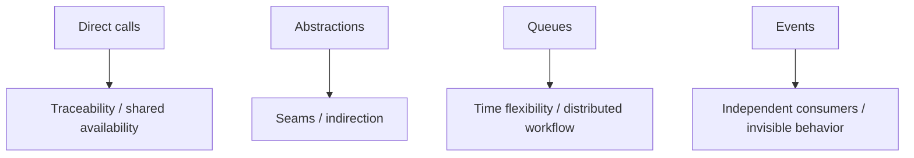

None of these options is automatically better than the others.

## Choose what fits the business case

Sometimes the right answer is a direct call. Sometimes it is an abstraction. Sometimes the work can happen later, so a queue fits. Sometimes independent consumers genuinely need to react to an event without the producer coordinating them. The correct choice depends on context.

Do not decouple because you were told good architecture is decoupled. Do not add an interface because every class is supposed to have one. Do not reach for a queue because async sounds more scalable. Do not publish every event because event driven feels like the final level.

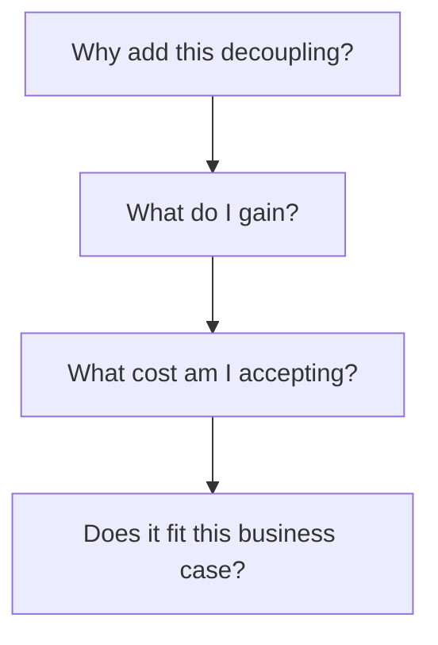

Ask what you are gaining and what you are accepting. Every step away from an in memory method call changes where the complexity lives. You might improve scalability, availability, extensibility, or independent evolution. But the complexity did not disappear.

You moved it.

## Summary

Decoupling is a spectrum, not a ladder. Each rung gives you something and charges you for it. Direct calls give traceability for coupling. Abstractions give seams for indirection. Queues give temporal freedom for a distributed workflow. Events give independent evolution for invisible behavior.

The skill is not to maximize decoupling. It is to place each piece of your system at the point on the spectrum where the complexity you get is worth the flexibility you gain. Complexity is conserved. You cannot erase it. You can only decide where it lives.

## References

- Comartin, D. (2026). *Decoupling in Software Architecture Moves Complexity*. CodeOpinion. https://codeopinion.com/decoupling-in-software-architecture-moves-complexity/. The article and companion video (GB1Kg9ufEOY). This knowledge base article restates the spectrum of decoupling in our own words and applies it alongside the related articles below.
- CodeOpinion. (2026). *Decoupling in Software Architecture Moves Complexity*. YouTube. https://youtu.be/GB1Kg9ufEOY. The source video for the style of the author-talk.

The concept crosses other knowledge base articles:
- *When to Abstract* builds on the abstraction level of this spectrum.
- *What Makes Coupling Loose* explains that coupling is about knowledge, not transport.
- *Monolith vs Microservices* and *Bounded Contexts Without Microservices* show where boundaries land.
- *Abstractions Must Earn Their Place* explains the one-usage and one-entry-point trap in the abstractions article, and it is the same tendency the event section of this article warns about.