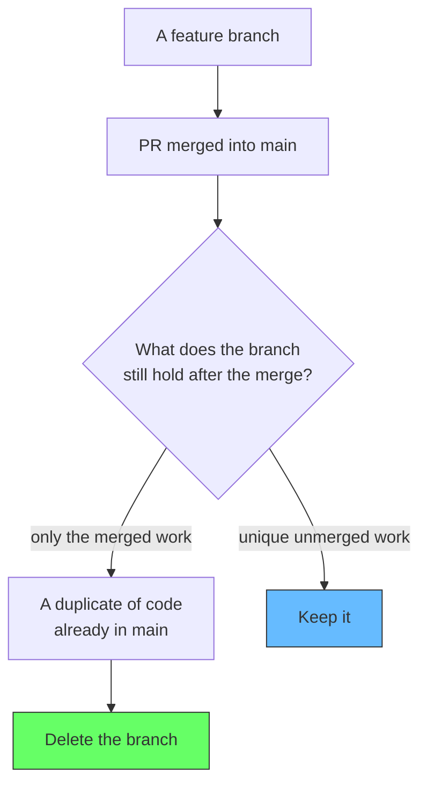
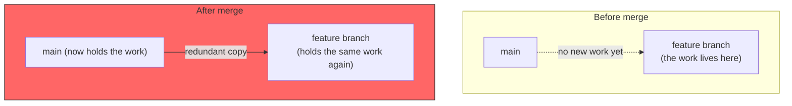
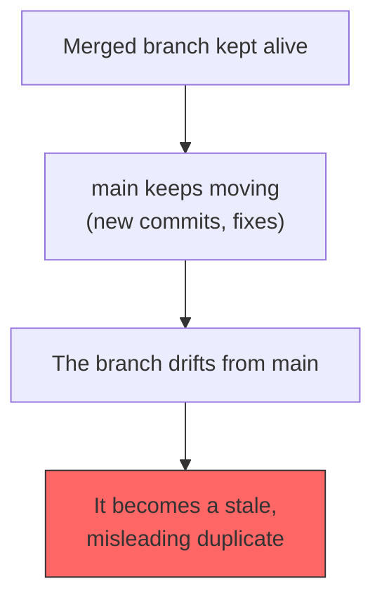
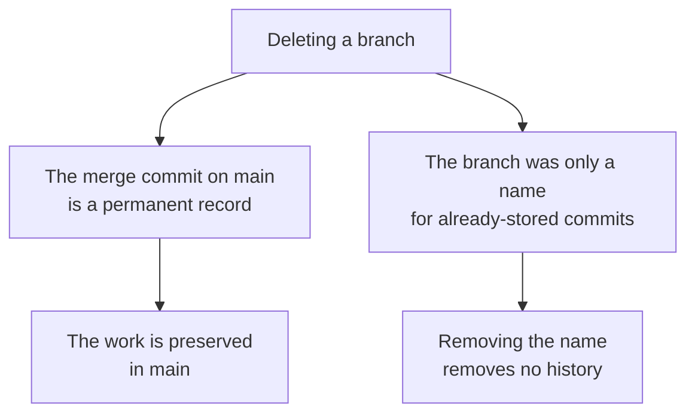
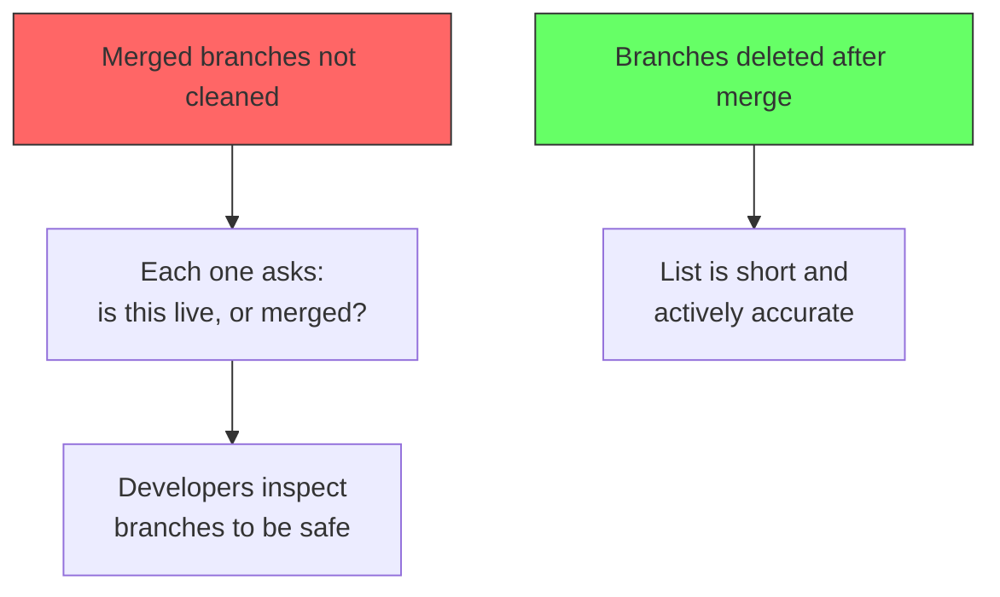
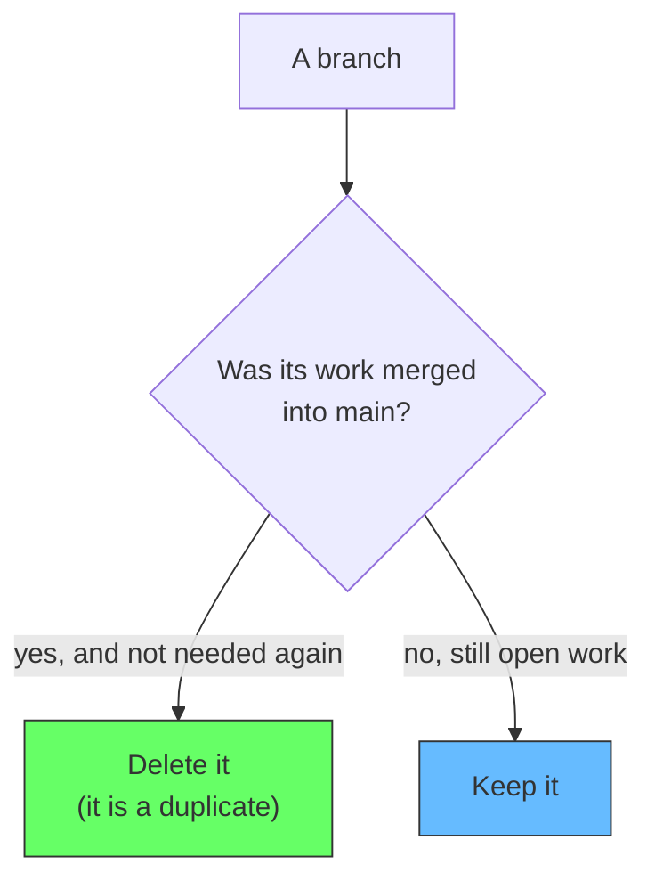

# Why We Delete Branches After a Merge

GitHub defaults to removing a branch when its pull request is merged, and teams click that button without thinking. But it is worth asking why the branch should go. The short answer: the branch has already done its job. The work it held is now permanently recorded by the merge into the main branch (see [Git Squash and Merge](/docs/software-engineering/git-squash-and-merge)). Keeping the branch only stores a used-up duplicate of changes that already live somewhere better.

The reason to delete is not that branches are precious and must be cleaned up. It is the opposite: once merged, the branch has no unique value, and keeping it adds cost.

## The merged branch is redundant

Before the merge, the branch is the only place the new work exists. It is the staging area for the change, and it must survive because the work is not anywhere else. After the merge, that work is copied into main by the merge commit. From that moment, the branch holds nothing that main does not already have. Both pointers point at the same content; the branch is just a second name for code that is now reachable from main.

## Duplicates rot and mislead

A branch left after its merge is a stale duplicate, and duplicates are worse than noise because they lie. The longer the branch sits, the more it drifts from main, because new work lands on main and not on the branch. Eventually the branch shows a version of the feature that no longer matches reality. Teams reading the repo now trust that a merged branch equals the merged work, and that is true only for a moment.

A long-lived, merged branch is also a temptation and a rumor. Someone sees the branch and does not know it was merged, so they branch from it or rebase onto it, creating a maze of overlapping history. The branch name and its stale content guide people the wrong way.

## Keeping the merge history: you do not lose work

The common fear is that deleting the branch deletes the work. It does not. The merge commit on main is a permanent record of everything the PR added. The history of that work is not the branch, it is the commit that landed on main. Deleting the branch only removes the extra pointer to content that is already preserved.

For the rare case you need something from an old branch, git can reconstruct it. The commit reachable from the old branch is still present in the repository for a while, findable via `git reflog` or the merge commit itself. So deletion is not destruction. It is cleanup of a name, not removal of history.

## Fewer branches, less confusion

The pressure to delete is also about cognitive load. Dozens of merged branches each need to be understood before a developer can let them go. Every stale branch is a name a developer has to inspect and dismiss. The branch list fills with questions like "is this still active?" and the answer is usually no. Deleting after merge removes those questions and keeps the branch list short and accurate.

## The rule

Delete a branch when its work is safely merged and its history will not be needed again. This is the default GitHub pushes. Keep a branch only when it is unmerged, or it still holds work in progress. The distinction is simple: a merged branch is a redundant name for code already in main.

## Summary

Branches are deleted after a merge because they have served their purpose. The work is now part of main, where it belongs. Keeping the branch adds the cost of a stale, misleading duplicate. Deleting it keeps the branch list clean and accurate, and it never loses work, because the merge commit on main is the permanent record. A branch is a name, not the history itself.