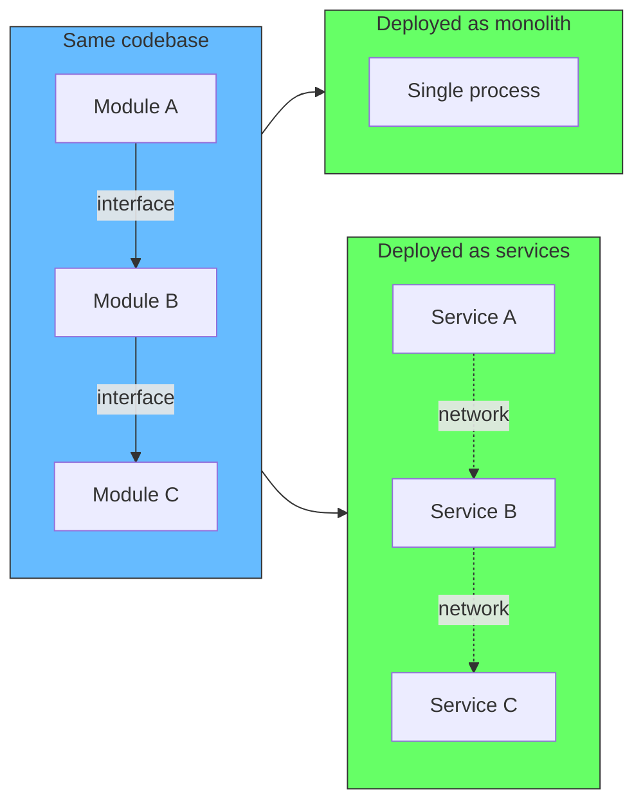
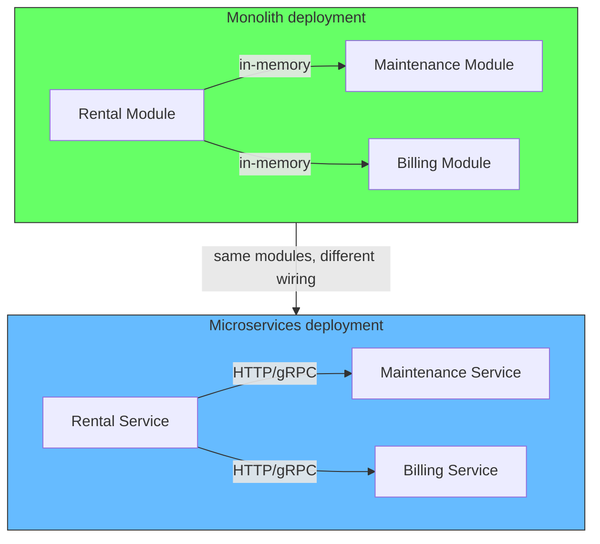
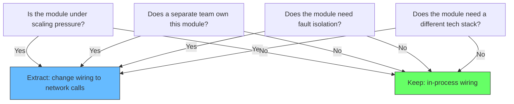

# Deployment is a Configuration Choice (If You Have Boundaries)

## The problem: architecture and deployment are treated as the same decision

Most teams treat the choice between monolith and microservices as permanent. Pick one, commit to it, live with the consequences. This framing is wrong. The two decisions — how you structure your code and how you deploy it — are orthogonal.

When modules are loosely coupled, each with its own model and its own data, the deployment topology becomes a runtime concern. The same codebase can run as a single process or as separate services. The switch is configuration, not a rewrite.

For a detailed look at how this wiring works in practice — ports, adapters, and the composition root — see [Module Wiring: Ports and Adapters](/docs/software-engineering/module-wiring-ports-adapters).



## How it works

Each module exposes the same interface regardless of how it is deployed. The wiring layer decides whether that interface resolves to an in-process call or a network call.

```typescript
// Module defines its interface -- no deployment assumptions
interface RentalAPI {
  getAvailableVehicles(): Promise<Vehicle[]>
  createRental(customerId: string, vehicleId: string): Promise<Rental>
}
```

The module implements this interface without knowing who calls it or how. At application startup, the composition root wires the implementation:

```typescript
// Monolith wiring -- in-process calls
const monolith = new Container()
monolith.register(RentalModule)
monolith.register(MaintenanceModule)
monolith.register(BillingModule)
monolith.start()

// Microservice wiring -- same modules, same interfaces, different transport
// Service A
const serviceA = new Container()
serviceA.register(RentalModule)
serviceA.registerHttpClient('MaintenanceAPI', 'http://service-b:3001')
serviceA.registerHttpClient('BillingAPI', 'http://service-c:3002')
serviceA.start()

// Service B
const serviceB = new Container()
serviceB.register(MaintenanceModule)
serviceB.registerHttpClient('RentalAPI', 'http://service-a:3000')
serviceB.start()
```

The modules themselves do not change. Each module exposes the same interface. When everything runs in one process, the call is direct. When split into services, the same interface resolves to HTTP, gRPC, or a message queue. The module does not know or care.



## Why this matters

Most teams that start with microservices pay the distributed systems tax before they have the traffic or the team size to justify it. The complexity of network calls, eventual consistency, container orchestration, and distributed tracing slows down iteration when speed matters most.

Most teams that start with a monolith build the right features quickly, but they build them without boundaries. When the time comes to split, the modules are tangled. The extraction becomes a months-long rewrite instead of a configuration change.

This approach solves both problems. Start with the monolith wiring. Move fast, deploy one artifact, debug one process. When a module genuinely needs independent scaling, independent deployment, or team ownership, change the wiring for that module only.


Hung Nguyen (2026) demonstrates this exact pattern with Go-SimpleScale, an open-source project where the same business logic runs as a single binary or as three independent services. The code does not change. The deployment mode is selected at startup by how the application is configured. His key insight: "a service depends on the interfaces it needs, not on other services." Each service defines its own interfaces for cross-module communication, and the wiring layer provides either in-process implementations or HTTP clients.

Milan Jovanovic (2026) makes a similar argument in his comparison of modular monoliths and microservices. A modular monolith gives you module boundaries, independent domain models, and simple deployment. When extraction becomes necessary, the communication pattern does not change — only the transport does. If modules communicate through events and explicit interfaces, extracting one into a service is straightforward.

Martin Fowler (2015) argued for the "monolith first" approach, but noted a critical caveat: "You cannot assume that you can take an arbitrary system and break it into microservices. Most systems acquire too many dependencies between their modules, and thus cannot be sensibly broken apart." The approach described here — interfaces with wiring-level transport switching — is the architectural discipline that makes monolith-first viable. Without it, the monolith becomes a big ball of mud that cannot be extracted from.

## The anti-pattern: premature microservices

The most expensive mistake is building modules that "might become services someday" but are tightly coupled to shared types, shared tables, and in-process assumptions. When the time comes to split, the team discovers:

- The module cannot run independently because it depends on another module's database
- The types used in cross-module calls do not serialize over the wire
- The module makes synchronous calls that timeout under network latency
- Shared configuration and shared state are spread across all modules

This is a distributed monolith, not a modular monolith. You get the worst of both worlds: the operational complexity of microservices with the coupling of a monolith.

The fix is not to avoid microservices. The fix is to build modules that are genuinely independent at the code level, then choose the deployment topology based on your current needs.

## When to switch the wiring

Move a module from in-process to network calls when you have a concrete reason:

- **Scaling pressure**: The module needs more instances than the rest of the application
- **Team ownership**: A different team needs to own and deploy the module on its own cadence
- **Fault isolation**: A failure in the module should not bring down the entire application
- **Technology diversity**: The module would benefit from a different runtime or language

Do not switch the wiring because you might need it someday. Switch it when the pain of sharing a process exceeds the cost of managing a network boundary.



## Summary

The same module code can be deployed as a monolith or as microservices. The difference is wiring, not code. This means you can start simple and scale without rewriting.

| Aspect | Monolith wiring | Microservice wiring |
|---|---|---|
| Communication | In-process call | HTTP, gRPC, message queue |
| Deployment | One artifact | Per-module artifacts |
| Scaling | Vertical or full horizontal | Per-module horizontal |
| Debugging | Single process, standard tools | Distributed tracing |
| Transaction | ACID across modules | Eventually consistent |
| When to use | Early stage, small team | Concrete scaling or team pressure |

Build modules with clean interfaces and owned data. Deploy them however your current situation demands. Change the deployment when the situation changes. The modules do not know the difference.

### References

- Fowler, M. (2015). *Monolith First*. martinfowler.com. https://martinfowler.com/bliki/MonolithFirst.html — Argues for starting with a monolith but warns that boundary discipline is required for later extraction
- Jovanovic, M. (2026). *Modular Monolith vs Microservices: How to Choose*. milanjovanovic.tech. — Describes the extraction path where communication patterns remain the same, only the transport changes
- Nguyen, H. (2026). *Go-SimpleScale: a monolith that becomes microservices without a rewrite*. hungnguyen.tech. https://hungnguyen.tech/projects/go-simplescale — Working example of the same codebase deployed as monolith or microservices through configuration
- Newman, S. (2021). *Building Microservices: Designing Fine-Grained Systems*. 2nd ed. O'Reilly. — Logical separation before physical separation, module boundaries as the prerequisite for service extraction
- StackAndSystem (2026). *Monolith vs Microservices vs Modular Monolith: Architecture Guide*. stackandsystem.com. — Notes that modular monoliths enable later extraction because "the module already has defined boundaries, a clear public API, and isolated data access"
