# Software Development Stories: Lessons from the Trenches

## The problem: what we learn in projects often dies with the project

Most hard-won engineering lessons are never written down. A developer builds something, hits a wall, finds a clever way around it, and realizes a month later that the cleverness was a mistake. Then the project ends, the context evaporates, and the next team makes the same call from scratch. The knowledge we trust most, the stuff we can only get from doing, is the stuff we share least.

This article is an attempt to fix that by collecting short, narratable stories from real production work. Each story follows the same shape: here is what we built, here is what happened, here is what we realized, here is the lesson. They are meant to be told, not just read, because a story that can be narrated to a colleague survives longer than a bullet point in a wiki.

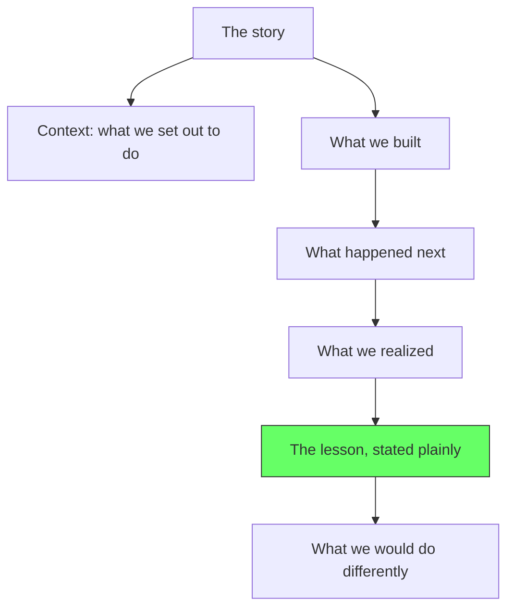
```mermaid
graph TD
    A["The story"] --> B["Context: what we set out to do"]
    A --> C["What we built"]
    C --> D["What happened next"]
    D --> E["What we realized"]
    E --> F["The lesson, stated plainly"]
    F --> G["What we would do differently"]
    style F fill:#6f6,stroke:#333
```

## Story 1: The Buy Again Service That Should Have Been Its Own Module

### Context

A while ago, a team needed a "Buy Again" feature in an e-commerce product: the order history page shows the customer their past orders and lets them reorder the same items with one click. At the time, the ordering domain was made of several microservices: orders (order lifecycle), catalog (product data), payments, and so on.

Someone stood up a Buy Again service. But here is the detail that mattered most: **Buy Again pulled its data from another downstream service directly, and it had no meaningful dependency on the orders service at all.** It did not care about order state transitions. It did not read order tables. It did not call orders' public API. Its data came from somewhere else in the stack.

### What happened next

The feature worked and it shipped. But structurally, the service was placed *inside* the orders world (same repo, same deployment unit, owned by the orders team) even though its dependency graph pointed somewhere entirely different. It lived in proximity to orders based on the product surface (it showed order history), not on the thing that actually determines cohesion: dependencies.

The misplacement became visible every time the team changed it. Since Buy Again had no dependency on orders, every change to orders forced Buy Again to coordinate, test, and redeploy a service that was conceptually unrelated. And because Buy Again sat inside orders without a boundary, its code and data began to blur into the ordering context even though its real dependencies lived downstream. The folder structure told you one story; the dependency graph told you another.

### What we realized

Cohesion in software does not come from what a screen shows. It comes from **what depends on what, who owns the data, and which workflows it participates in**. Buy Again looked like part of the order experience, so it got parked next to orders. But its data and its downstream calls made it an independent responsibility that happened to be filed under the wrong roof.

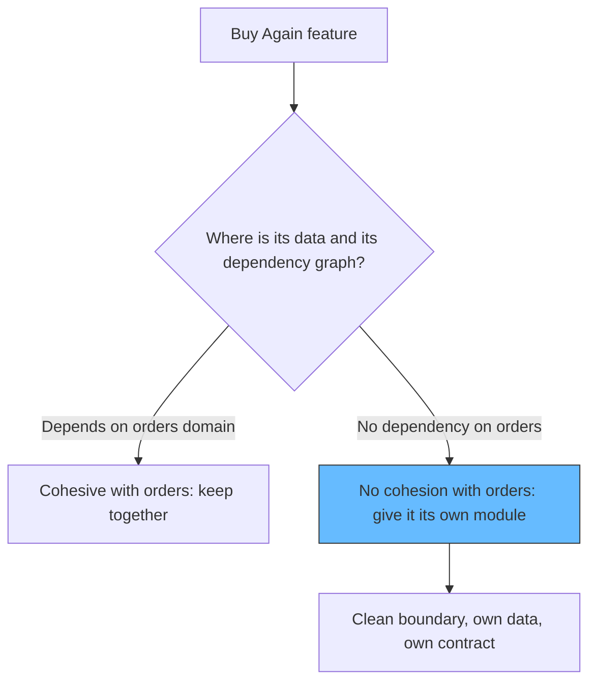
```mermaid
flowchart TD
    A["Buy Again feature"] --> Q{"Where is its data and its dependency graph?"}
    Q -->|"Depends on orders domain"| R["Cohesive with orders: keep together"]
    Q -->|"No dependency on orders"| S["No cohesion with orders: give it its own module"]
    S --> T["Clean boundary, own data, own contract"]
    style S fill:#6bf,stroke:#333
```

What was missing was a boundary, not a merger. Buy Again having no dependency on orders is a good thing; the mistake was not giving it its own module with a clean seam. In a modular monolith this is exactly the shape you want: the Buy Again module owns its data, exposes a small public interface, and communicates with the rest through contracts, so that if it ever deserves independent deployment, extraction is a mechanical step instead of a rewrite.

Milan Jovanović on module boundaries puts it precisely: "Fixing a boundary inside a monolith is a refactoring, not a migration. Merging two chatty modules means moving files. Splitting an overgrown module is harder, but still a single-codebase exercise. Compare that with microservices, where a wrong boundary is baked into network contracts." Michael van Leest, on deciding what deserves a service boundary: "I usually care more about data ownership and workflow behavior. If a service boundary does not produce clearer ownership over data, behavior, or runtime responsibilities, it often becomes just a packaging change with extra operational cost."

### The lesson

**Where a responsibility lives is decided by its dependencies, its data, and its workflows, not by the product surface it serves. If a capability does not depend on a context's domain, do not glue it to that context; give it its own module with a clean boundary, and extract it only when it earns independent deployment.**

The corollary is the modular monolith: keep the boundaries real inside one deployable, with each module owning its data and publishing a contract, so an eventual split is mechanical rather than architectural. Encore frames the two this way: modules and microservices "share the same idea about structure and disagree only on whether a network sits between the modules."

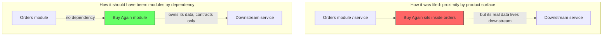
```mermaid
graph TD
    subgraph Wrong["How it was filed: proximity by product surface"]
        W["Orders module / service"] --> W2["Buy Again sits inside orders"]
        W2 -.->|"but its real data lives downstream"| W3["Downstream service"]
    end
    subgraph Right["How it should have been: modules by dependency"]
        R1["Orders module"] -->|"no dependency"| R2["Buy Again module"]
        R2 -->|"owns its data, contracts only"| R3["Downstream service"]
    end
    style W2 fill:#f66,stroke:#333
    style R2 fill:#6f6,stroke:#333
```

### What we would do differently

- **Ask where the data lives and what depends on it, not what the screen shows.** Buy Again's downstream data source was the tell: it was an independent responsibility.
- **Give Buy Again its own module with its own schema and a small public interface**, with no direct table access from, or to, orders. This is the modular monolith shape: a firm, enforceable boundary inside a single deployable.
- **Only extract it to a service when a concrete driver appears**: independent scaling, an independent team, or a separate deploy cadence. Until then, the boundary within the monolith is already the seam.

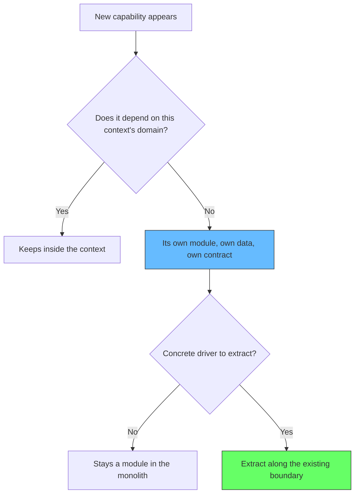
```mermaid
graph TD
    A["New capability appears"] --> B{"Does it depend on this context's domain?"}
    B -->|"Yes"| C["Keeps inside the context"]
    B -->|"No"| D["Its own module, own data, own contract"]
    D --> E{"Concrete driver to extract?"}
    E -->|"No"| F["Stays a module in the monolith"]
    E -->|"Yes"| G["Extract along the existing boundary"]
    style D fill:#6bf,stroke:#333
    style G fill:#6f6,stroke:#333
```

## Story 2: The Shared Cache That Became the Single Point of Failure

### Context

A platform ran several services (auth, catalog, cart, recommendations) that all read a small set of "hot" data: product prices, shipping rules, config values. Each service fetched it from the database on every request, and the database was starting to feel the load. Someone proposed the obvious fix: a shared in-memory cache (Redis) in front of the database, used by every service, so repeated reads never hit Postgres.

### What happened next

The cache worked wonders on latency, and everyone was happy, until the day Redis hiccuped. One afternoon the cache's memory hit its cap, eviction went poorly, and the cluster restarted. Every service that depended on it, which was every service, suddenly had to read through to the database at once. The database, previously protected by the cache, got a wall of requests it had not seen in months, and it buckled. What should have been "the cache was slow for five minutes" became a platform-wide outage because the cache was now a load-bearing dependency on the critical path.

The real problem was subtle: the services had been built so they *could* survive without the cache (with timeouts and fallbacks), but nobody had ever tested what that survival path actually looked like at full blast. In practice the fallback was untested code that nobody expected to run.

### What we realized

A cache is a correctness optimization, not a guarantee. The team had treated a performance feature as if it were part of the durability story, and in doing so had quietly inserted a new single point of failure into every request path. The instant a component becomes load-bearing, it needs the same treatment as the database: capacity planning, monitoring, and a tested degraded path.

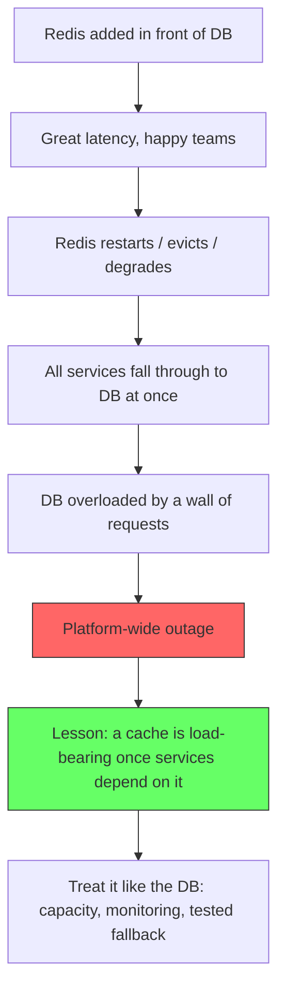
```mermaid
flowchart TD
    A["Redis added in front of DB"] --> B["Great latency, happy teams"]
    B --> C["Redis restarts / evicts / degrades"]
    C --> D["All services fall through to DB at once"]
    D --> E["DB overloaded by a wall of requests"]
    E --> F["Platform-wide outage"]
    F --> G["Lesson: a cache is load-bearing once services depend on it"]
    G --> H["Treat it like the DB: capacity, monitoring, tested fallback"]
    style F fill:#f66,stroke:#333
    style G fill:#6f6,stroke:#333
```

We should have asked the question we ask of any dependency: what happens to the system when this thing stops working? If the answer is "everything breaks at once," the component is not a cache anymore, it is the new database, and it deserves the same budget.

### The lesson

**A shared cache that every service depends on is load-bearing infrastructure, not a performance trick. Cache dependencies need capacity planning, dedicated monitoring, and a degraded path that is actually tested at storm volume.**

AWS reinforces this in its own incident retrospectives: the failure mode that takes out whole fleets is commonly a dependency that was "just a cache" but became load-bearing without anyone updating the operational budget to match. The design move is to ask early *what breaks when the cache is down* and then practice that scenario, ideally in a game day, before a real one happens for you.

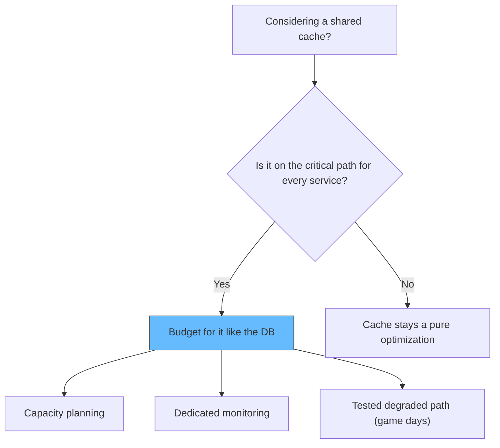
```mermaid
graph TD
    A["Considering a shared cache?"] --> B{"Is it on the critical path for every service?"}
    B -->|"Yes"| C["Budget for it like the DB"]
    B -->|"No"| D["Cache stays a pure optimization"]
    C --> E["Capacity planning"]
    C --> F["Dedicated monitoring"]
    C --> G["Tested degraded path (game days)"]
    style C fill:#6bf,stroke:#333
```

### What we would do differently

- **Scope the cache per service or per read path**, not as one fleet-wide dependency, so a hiccup in one domain does not take down the platform.
- **Make cache misses cheap by design**: if the database can handle worst-case throughput, a cache failure degrades performance gracefully instead of becoming an outage.
- **Practice the degraded path**: a game day where Redis is taken offline and the team watches the system degrade inside its budget.

## Story 3: The Temporary Feature Flag That Stayed for Two Years

### Context

During a release, a team needed to disable a newly shipped checkout step quickly in case something went wrong. They wrapped it in a feature flag labeled "temporary" in a one-liner comment, flipped it off after a brief incident, and moved on. It was the classic emergency mitigation: fast, effective, and easy to forget.

### What happened next

The flag never got removed. Two years later, no one on the team knew it existed or what behavior it controlled. When a new engineer finally found it during a cleanup, the code it guarded had grown around it: new features had quietly branched on the flag, doubling the paths through checkout. Removing it was no longer a five-minute deletion; it was a small project to untangle two parallel flows that had real users on both sides. The "temporary" escape hatch had become a permanent second architecture.

### What we realized

A mitigation that outlives the event that created it stops being a control and starts being a fork in the code. The flag did not contain complexity; it created it. This is the software version of a debt that compounds: every month it exists, more code assumes it exists, and the cost of removing it grows while the memory of why it exists fades.

It helps to think in the analogy that software architecture is like a city. You can build without a plan: a house here, a shop there, a road that seems convenient today. Individually each decision is fine, and the city works. Then a second downtown grows where no one ever planned a downtown, streets dead-end for reasons no one remembers, and the whole thing becomes hard to move through. Nothing is broken, exactly; it is simply unplanned. The city still stands, but no one can say why it looks like it does, and scaling it means untangling decisions nobody remembers making.

The same happens to a codebase one flag at a time. No single addition to the flag — no individual "just branch on it" commit — is the mistake. The mistake is that the map was never looked at. The street was laid, then more streets were laid around it, and nobody was watching the city grow. You do not get ugly, unscalable software from one bad decision; you get it from a hundred reasonable decisions with no plan holding them together. And here is the cruel part of the analogy: a city built on accident still has an architecture. It is just an architecture nobody designed, and it shows in ways that are invisible when things are working and unmistakeable six months or a year later, when the new inhabitants ask "who planned this?" and the answer is "nobody planned this; it happened."

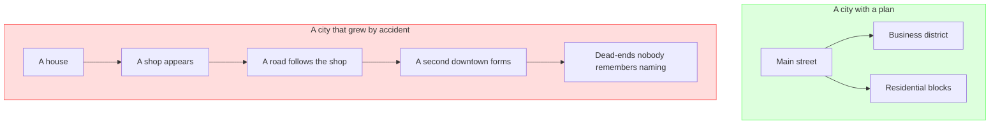
```mermaid
graph TD
    subgraph Planned["A city with a plan"]
        P1["Main street"] --> P2["Business district"]
        P1 --> P3["Residential blocks"]
    end
    subgraph Accidental["A city that grew by accident"]
        A1["A house"] --> A2["A shop appears"]
        A2 --> A3["A road follows the shop"]
        A3 --> A4["A second downtown forms"]
        A4 --> A5["Dead-ends nobody remembers naming"]
    end
    style Accidental fill:#fdd,stroke:#f66
    style Planned fill:#dfd,stroke:#6f6
```

Both cities work. Only one has an answer to "who planned this?" — and that one question is the difference between software that scales under growth and software that has to be untangled before it can.

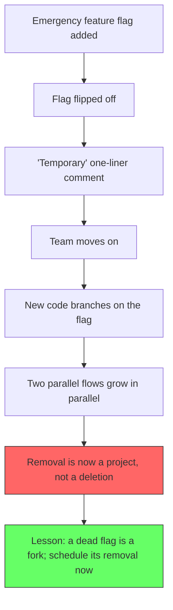
```mermaid
flowchart TD
    A["Emergency feature flag added"] --> B["Flag flipped off"]
    B --> C["'Temporary' one-liner comment"]
    C --> D["Team moves on"]
    D --> E["New code branches on the flag"]
    E --> F["Two parallel flows grow in parallel"]
    F --> G["Removal is now a project, not a deletion"]
    G --> H["Lesson: a dead flag is a fork; schedule its removal now"]
    style G fill:#f66,stroke:#333
    style H fill:#6f6,stroke:#333
```

The team that built the flag knew exactly what it controlled. The team that found it knew exactly nothing. That single fact, the decay of context, is why temporary flags die so slowly: the knowledge of what they do evaporates before the flag does.

### The lesson

**Every temporary mitigation needs an expiration date, an owner, and a ticket before the emergency ends. If it cannot be removed in the next two weeks, it is not temporary; it is a permanent decision you are choosing not to make.**

Many teams enforce this structurally instead of by discipline: a deadline attached to the flag, an alert that fires when the flag is old, a lint rule that fails on comments like "temporary." The mechanisms vary; the principle does not. Mitigate the incident, and separately, schedule the cleanup while the incident is still fresh enough to do it cheaply.

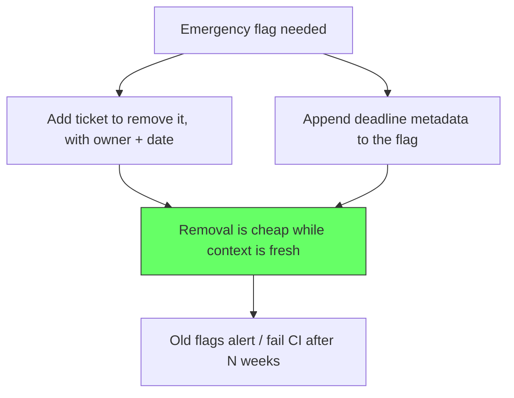
```mermaid
graph TD
    A["Emergency flag needed"] --> B["Add ticket to remove it, with owner + date"]
    A --> C["Append deadline metadata to the flag"]
    B --> D["Removal is cheap while context is fresh"]
    C --> D
    D --> E["Old flags alert / fail CI after N weeks"]
    style D fill:#6f6,stroke:#333
```

### What we would do differently

- **Create the removal ticket in the same commit that adds the flag.** If it is worth adding, it is worth scheduling the removal.
- **Attach a deadline and owner to every feature flag**, and have monitoring alert when a flag has not changed in months.
- **When a flag forks code into two paths, treat the fork as a smell** and consolidate, even if both paths work. Two working paths are double the maintenance for zero product value.

## Story 4: The Rewrite That Bought Microservices and Lost the Knowledge

### Context

A successful monolith (a billing system) was working well: fast releases, one deployable, a database the team knew inside out. Leadership decided to move to microservices, partly for scale and partly because microservices sounded like the modern architecture. The team top-to-bottom was sold on the rewrite.

### What happened next

Six services were carved out, each with its own repository, deployment, and database schema. What followed was eighteen months of infrastructure work: service discovery, distributed tracing, retries, timeouts, transactional outbox patterns, and coordinating deploys across services for changes that used to be one PR. The business features that used to ship weekly now shipped every few weeks, because a change to "billing" now meant two coordinated releases. When production misbehaved, the team could no longer attach a debugger and step through; it pieced together spans across six services.

The old monolith was deleted once the last traffic moved over. And with it went something invisible but valuable: the decade of constraints, invariants, and "weird things about this domain" encoded in one codebase the team collectively understood.

### What we realized

The rewrite did not buy what the team thought it was buying. The scaling problem that motivated it was solved by running more instances of the monolith, which they could have done without a rewrite at all. What the rewrite actually bought was independent deploys they did not need, and the cost was distributed-systems complexity they had never paid before. On top of that, the rewrite discarded the one asset the monolith held: working, tested behavior with proven boundaries embedded in years of real traffic.

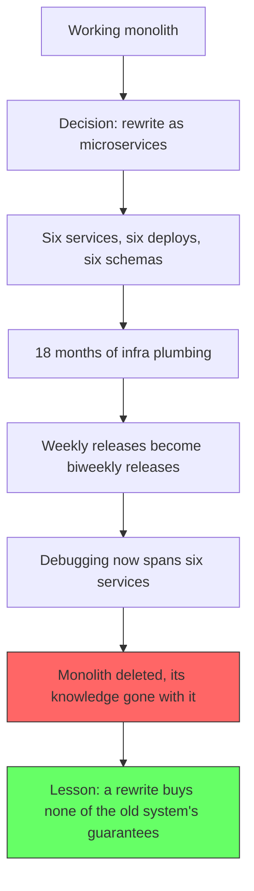
```mermaid
flowchart TD
    A["Working monolith"] --> B["Decision: rewrite as microservices"]
    B --> C["Six services, six deploys, six schemas"]
    C --> D["18 months of infra plumbing"]
    D --> E["Weekly releases become biweekly releases"]
    E --> F["Debugging now spans six services"]
    F --> G["Monolith deleted, its knowledge gone with it"]
    G --> H["Lesson: a rewrite buys none of the old system's guarantees"]
    style G fill:#f66,stroke:#333
    style H fill:#6f6,stroke:#333
```

The bitter part: the rewrite was not even a rewrite of the monolith. It was a rewrite of the monolith's *deployment*. The domain logic was mostly copied over; the architecture changed but the behavior barely did, because nobody was trying to change the behavior. That is the surest sign of an architecture-driven rewrite that was never going to pay for itself.

### The lesson

**Do not rewrite a working system to change its deployment shape. Reshape the deployment (more instances, a load balancer, a modular monolith with real boundaries) and keep the working behavior. A rewrite only makes sense when the behavior itself has to change, and even then, it should be incremental, not a forklift.**

Martin Fowler's Monolith First essay warns that most systems "acquire too many dependencies between their modules and thus can't be sensibly broken apart." The honest version of that lesson is the inverse: a working system has already told you where its real seams are, through years of successful operation. Rewriting across a diagram is how you ignore that evidence and pay dearly to learn the seams are where they always were. The modular monolith path, again, is the responsible middle: keep the codebase, carve real module boundaries, and extract only when a concrete operational reason exists.

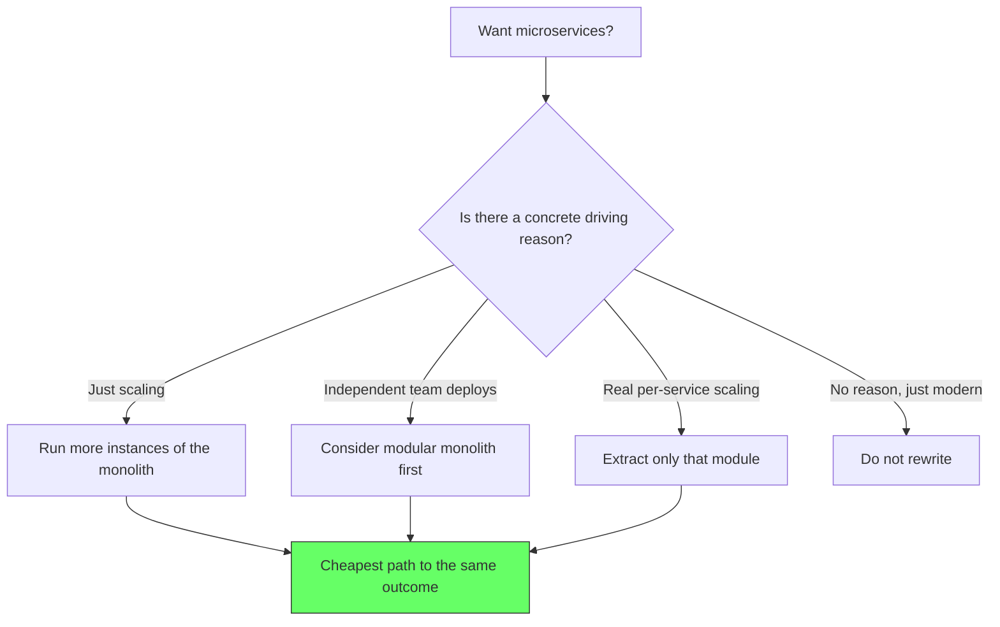
```mermaid
graph TD
    A["Want microservices?"] --> B{"Is there a concrete driving reason?"}
    B -->|"Just scaling"| C["Run more instances of the monolith"]
    B -->|"Independent team deploys"| D["Consider modular monolith first"]
    B -->|"Real per-service scaling"| E["Extract only that module"]
    B -->|"No reason, just modern"| F["Do not rewrite"]
    C --> G["Cheapest path to the same outcome"]
    D --> G
    E --> G
    style G fill:#6f6,stroke:#333
```

### What we would do differently

- **Start with the cheapest thing that solves the actual problem**: more instances, a load balancer, better caching.
- **If boundaries are the goal, carve them inside the existing monolith** and measure whether the change path really improves before extracting anything.
- **Never delete a working system before its knowledge transfer is explicit**: encode the invariants, the tests, and the "weird domain things" in documentation that survives the migration.

## Story 5: The Feature That Went Live and Broke the Cache

### Context

A team shipped a new feature that made a popular endpoint much hotter overnight. The endpoint was cache-backed: a hot key in Redis held the response, refreshed every hour. The feature was a success, traffic rose, and everything seemed fine for a day.

### What happened next

Then a developer noticed something strange in the metrics: **ports were being exhausted.** Outbound connections from the application spiked, the connection pool saturated, and requests that used to take 50ms were timing out. The initial instinct was a network problem: too many sockets, too many connections, maybe a firewall. The team's first response was to raise limits and add more connections, which bought them minutes at best before the same wall of errors returned.

The real cause was invisible to the "ports exhausted" symptom. The new feature's traffic was all hitting the same hot key, and that key had a TTL with no jitter. When the key expired, hundreds of concurrent requests all observed the miss at the same instant, and each one independently called the database to rebuild the value. The database was hammered with identical queries, the connection pool filled with recomputations, and the burst opened more outbound sockets than the ephemeral port range allowed. When the key was finally rebuilt, the system recovered, only to repeat the whole cycle at the next expiration.

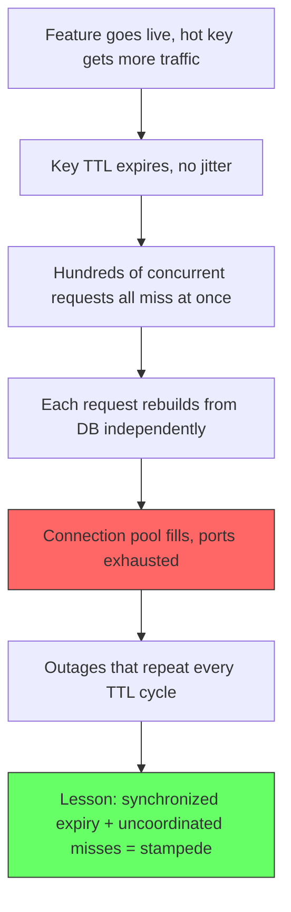
```mermaid
flowchart TD
    A["Feature goes live, hot key gets more traffic"] --> B["Key TTL expires, no jitter"]
    B --> C["Hundreds of concurrent requests all miss at once"]
    C --> D["Each request rebuilds from DB independently"]
    D --> E["Connection pool fills, ports exhausted"]
    E --> F["Outages that repeat every TTL cycle"]
    F --> G["Lesson: synchronized expiry + uncoordinated misses = stampede"]
    style E fill:#f66,stroke:#333
    style G fill:#6f6,stroke:#333
```

This is the cache stampede (also called the thundering herd problem). Redis's own writeup of it is precise: "If thousands of users were relying on that cached data, they would all fall back to fetching from the database, effectively overloading the database with simultaneous queries." The cache was alive and healthy; the *policy* around it was the problem. A single hot key expiration turned one database query into five hundred identical ones.

### What we realized

The symptom pointed one way, and the cause was entirely elsewhere. "Ports exhausted" was the smoke; synchronized cache expiration was the fire. Raising connection limits only made the stampede more thorough, because every extra socket let another redundant recomputation reach the database. The system needed the *number of rebuilds* reduced to one, not more capacity for redundant ones.

The controls for this are well documented. **TTL jitter** staggers expirations so keys do not vanish together. **Single-flight / request coalescing** (a mutex or "one loader, many waiters") ensures only one request rebuilds a key while the rest wait for its result. **Stale-while-revalidate** serves the slightly stale value immediately while a background task refreshes it. Redis's guidance is blunt: "The solution isn't just adding more servers. It's designing at the architectural level to stagger requests, coordinate cache refreshes, and distribute load."

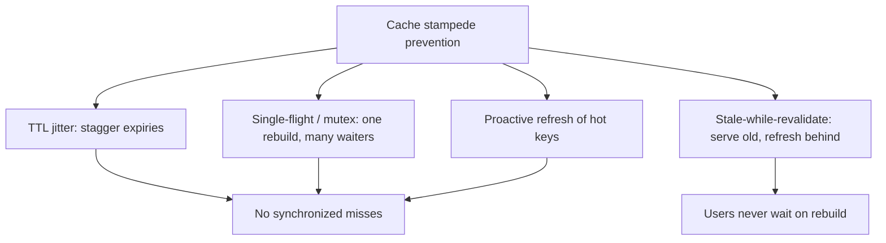
```mermaid
graph TD
    A["Cache stampede prevention"] --> B["TTL jitter: stagger expiries"]
    A --> C["Single-flight / mutex: one rebuild, many waiters"]
    A --> D["Stale-while-revalidate: serve old, refresh behind"]
    A --> E["Proactive refresh of hot keys"]
    B --> F["No synchronized misses"]
    C --> F
    D --> G["Users never wait on rebuild"]
    E --> F
```

### The lesson

**A cache is only as safe as its refresh policy. If hot keys expire in sync and nothing coordinates who rebuilds on a miss, one expiration becomes a stampede that exhausts connections, ports, and the database at once. Jitter the TTL, coalesce the miss, and serve stale data while refreshing.**

And the symptom-reading lesson is just as valuable: when the incident looks like a resource problem (ports, connections, sockets), check whether the resource is the *cause* or the *victim* of the request pattern. A stampede consumes every resource in its path, and treating the symptom as the cause is how you spend an hour raising limits on the wrong thing.

### What we would do differently

- **Add TTL jitter to every cache key** as a baseline, especially batch-warmed or hot keys, so expirations spread instead of concentrating.
- **Coordinate cache misses on hot keys**: single-flight with a distributed lock (token-safe release), so one request rebuilds and the rest wait.
- **Serve stale-while-revalidate** for user-facing reads where a few hundred milliseconds of staleness is invisible, eliminating the wait entirely.
- **Watch cache miss rate and database connection count together**: when they spike at the same moment, you are looking at a stampede, not a network fault.

## Story 6: The Data That Belonged Together, Split Apart for No Reason

### Context

A team moved from a monolith to services. One screen showed order details alongside the customer's name and the product names, all read together. In the monolith this was one query, one round trip, one join. In the new architecture, the team dutifully split it: the frontend (or an aggregation service) called the orders service, then called the customer service, then called the catalog service, and stitched the results together.

### What happened next

The feature worked, and its latency quietly tripled. Each hop added a network round trip: orders, then customer, then catalog, then the assembly. Every extra hop added serialization, deserialization, a retry budget, a timeout, and a failure mode. The page that used to answer in 30ms now took 150ms because the data was spread across three machines that had never needed to be three machines.

Worse, the failure surface multiplied. When the catalog service had a brief blip, the whole page failed, even though catalog was only supplying a display name. A join that the database could have resolved in a few milliseconds became three network calls, each with its own latency, its own retry, and its own way to fail the user.

### What we realized

The decision to split was made on the basis of *service ownership*, not on the basis of *how the data was used*. These three pieces of data changed together, were read together, and belonged to the same read model for that screen. The architecture divided them across the network because it was tidy to do so, and the network made the user pay for that tidiness on every single request.

The unit of "belongs together" is not the service boundary. It is the read pattern: data read together, and changing together, should live where one query can get it. This is the latency version of Story 1: just as a module should not be glued to a context it does not depend on, data should not be split across the network unless something real requires the split.

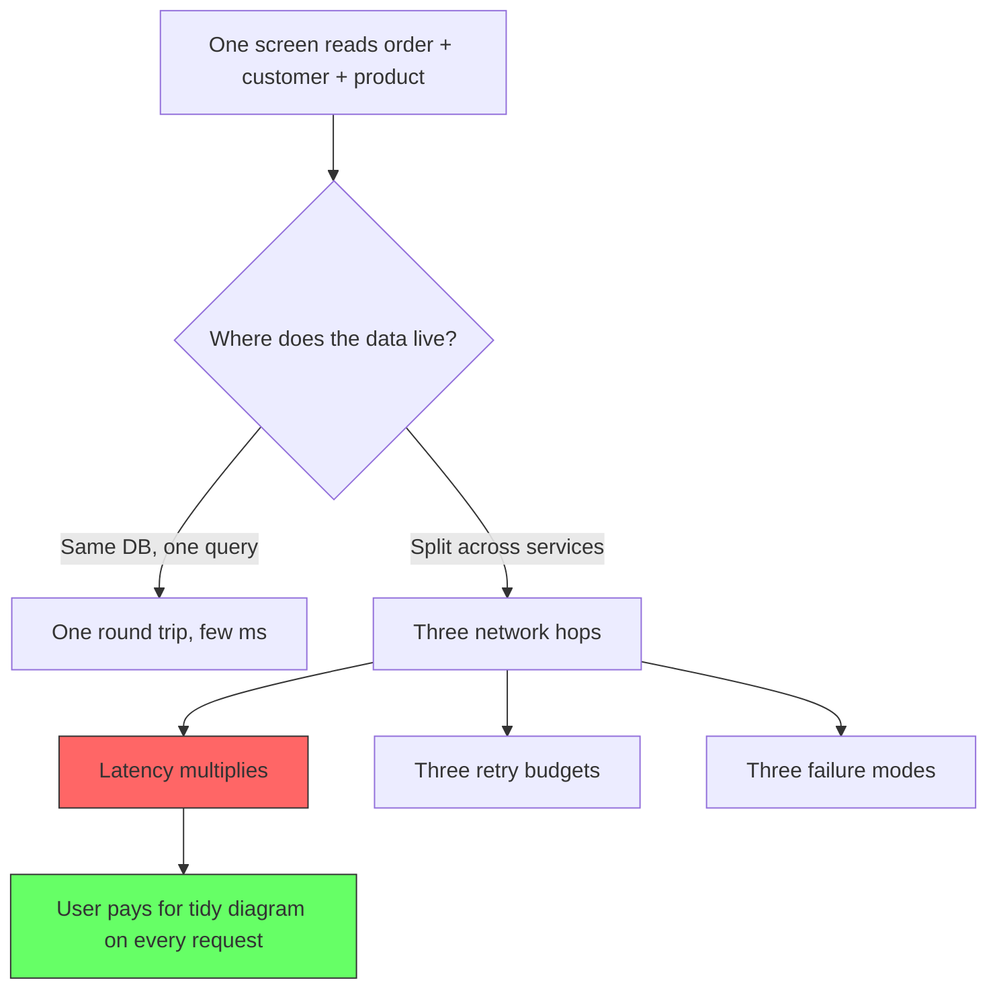
```mermaid
flowchart TD
    A["One screen reads order + customer + product"] --> B{"Where does the data live?"}
    B -->|"Same DB, one query"| C["One round trip, few ms"]
    B -->|"Split across services"| D["Three network hops"]
    D --> E["Latency multiplies"]
    D --> F["Three retry budgets"]
    D --> G["Three failure modes"]
    E --> H["User pays for tidy diagram on every request"]
    style E fill:#f66,stroke:#333
    style H fill:#6f6,stroke:#333
```

Martin Fowler's guidance on extracting data-rich services names the trap directly: splitting the logic without splitting the data creates an integration database that "gives the semblance of a distributed system that can evolve independently but in fact is a single tightly coupled system at the database level." Here the split went further: the data was physically separated, so the cost was paid in latency instead of coupling.

### The lesson

**Data that is read together and changes together should live where one query can get it. Splitting it across network calls multiplies latency, retry budgets, and failure modes, and the user pays that cost on every request. Split data across machines only when something real requires it (independent scaling, independent teams, real isolation), not because the diagram is tidier.**

The counter-rule also matters: if the data genuinely must live apart, build a read model or a denormalized projection so the hot read path still gets its data in one place, instead of making the request path crawl across services.

### What we would do differently

- **Before splitting data across services, ask what reads it serves and how often.** If one screen reads it together, that is a strong signal it belongs together.
- **Keep related data in one queryable place** (same database, same module), and split only when a concrete driver requires it.
- **If the data must live apart, publish a read model** the hot path can fetch in one call, so the user never experiences the distributed join.
- **Measure the latency budget before and after a split**: a service split that adds 100ms to a critical read is a regression, no matter how clean the architecture looks.

## Story 7: The Dogma That Slowed Everyone Down

### Context

A team adopted a rule with total conviction: "we never use SQL joins across services." The reasoning had a legitimate ancestor somewhere (a past incident where a cross-service join caused a coupling problem), but over time the rule detached from its reason. It became a style-guide commandment, repeated in every design review without anyone remembering the original justification.

### What happened next

Every feature had to obey the rule even when it made no sense. A simple report that needed data from two places could not just query both: it had to be funneled through events, read models, and an outbox, each adding complexity, delay, and failure modes. Features that should have taken a week took three. When someone asked why, the answer was "that's how we do it here," which is dogma speaking, not engineering.

The breaking point came when a team spent two weeks building an event-driven pipeline to deliver what was, functionally, a join that the database could have done in one query. The pipeline worked, but it was slower, more complex, and harder to debug than the thing it was avoiding.

### What we realized

The rule had become a religion. It was not anchored to a problem; it was anchored to the fact that it was once a reasonable answer to a different problem. Every engineering rule is a compressed answer to a past situation, and the moment it detaches from the situation it was answering, it starts producing harm: complexity where none was needed, and teams optimizing for the rule instead of the product.

What makes this spread beyond a single team is the why-vacuum: **devs do not understand the reasoning behind a rule, so they apply the rule everywhere.** A rule carries its *why* in the head of the person who created it. The next person copies the rule, but not the reasoning, and then copies it again, and each copy loses a little more context. After a few copies, every trace of the original problem is gone, and the rule is just a gesture, honored for its shape and not its content. This is dogma's engine: not malice, not laziness, but a pure transmission of the answer with the question forgotten.

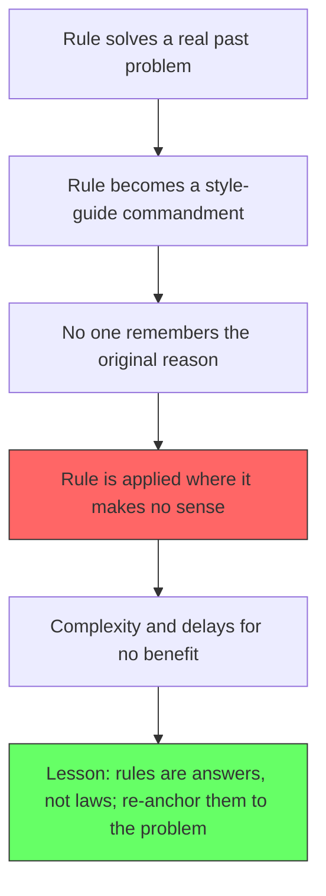
```mermaid
flowchart TD
    A["Rule solves a real past problem"] --> B["Rule becomes a style-guide commandment"]
    B --> C["No one remembers the original reason"]
    C --> D["Rule is applied where it makes no sense"]
    D --> E["Complexity and delays for no benefit"]
    E --> F["Lesson: rules are answers, not laws; re-anchor them to the problem"]
    style D fill:#f66,stroke:#333
    style F fill:#6f6,stroke:#333
```

The clearest case of this in recent memory is microservices. For years, "everything must be microservices" was repeated with the certainty of a religious doctrine, and the why was lost almost immediately: it was meant to solve a specific problem, decoupled teams shipping independently, and it only pays off when you have stable boundaries you actually own. Instead, the industry applied it everywhere, to every codebase, including systems that needed nothing of the sort. A wave of teams burned months on service discovery, distributed tracing, and coordinated deploys to solve problems they never had.

And notice the punchline: **the industry kept working.** The microservices fad peaked and receded, teams folded services back into monoliths and modular monoliths, and no business collapsed because they picked the "wrong" architecture. That is the surest tell that it was dogma: the adoption was driven by conformity, not by a problem. If a single widely-mandated architecture were *required*, its removal would have broken everything, and it broke nothing. Real decisions have real consequences; dogmatic ones entertain the industry and leave it standing. Today companies still use microservices, and that is fine, but the hope is they now choose it for the right reasons: stable boundaries, independent scaling, independent teams, not because "that is how we do it here."

The healthy version of any rule is to ask: what problem is this preventing, and is that problem present here? If the answer is "no," the rule does not apply. This is the same discipline as the article's opening story: boundaries and rules are justified by the problem they solve, not by their existence.

### The lesson

**Dogma is a rule that has detached from the problem it answered. Every engineering rule is a compressed answer to a past situation; before applying it, ask whether the situation exists here. Rules justify themselves by the harm they prevent, not by their age or how often they are quoted.**

The engine of dogma is the why-vacuum: **people copy the rule without the reasoning**, and each copy loses context until the rule is applied everywhere. The microservices wave showed the cost at industry scale -- adopted by conformity, not by a problem, and the industry kept working precisely because it was never required. The tell of dogma is not how loudly the rule is repeated; it is whether removing it breaks something real. Supervision suggests teams adopt trends for the problem they solve, not the trend itself.

The corollary for leaders: when you inherit a rule, learn its origin. A team that cannot say why a rule exists will eventually apply it to a problem it makes worse, and will call that discipline.

### What we would do differently

- **Require every architectural rule to carry its why** in the docs that state it, so future teams can test whether the situation still applies.
- **Ask "what problem is this preventing?" in every design review** before accepting a rule-based answer.
- **Encourage explicit exceptions**: a team that can name the situation that justifies bypassing a rule is doing engineering, not rebellion.

## Story 8: The Database That Was Right for the Demo and Wrong for Production

### Context

A team chose a document database (like MongoDB) for a new service because it was fast to prototype, schemaless, and trendy. The service handled orders, which have relationships: an order has items, a customer, discounts, and a history of states. In the demo, the schemaless store was a joy.

### What happened next

Production traffic arrived, and the friction started. The service needed to report on orders by customer, by date range, by status, and across relationships. In a document database these queries meant denormalization, duplicated data, and application-side joins that were slow and easy to get wrong. What a relational store would have done with a few indexed joins became a dance of secondary collections and consistency care. The team spent more engineering time on data modeling workarounds than the database was saving them.

Worse, the pain grew with the feature set. Every new relationship (discounts across products, bundles, returns) required another denormalization decision, another chance for the copies to drift, and another cleanup job. The database had been chosen for developer velocity at prototype size, and that choice was now costing velocity at production size.

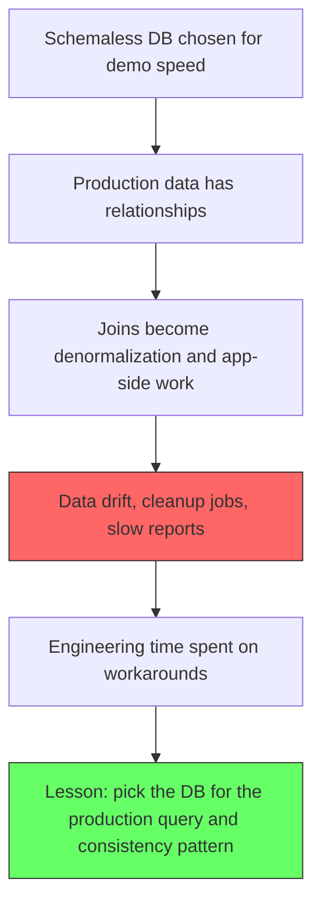
```mermaid
flowchart TD
    A["Schemaless DB chosen for demo speed"] --> B["Production data has relationships"]
    B --> C["Joins become denormalization and app-side work"]
    C --> D["Data drift, cleanup jobs, slow reports"]
    D --> E["Engineering time spent on workarounds"]
    E --> F["Lesson: pick the DB for the production query and consistency pattern"]
    style D fill:#f66,stroke:#333
    style F fill:#6f6,stroke:#333
```

### What we realized

The database was chosen for the wrong dimension. It was chosen for how easy it made *writing* data in a demo, but the real workload was about *reading* data with relationships and reporting across them. Those two shapes want very different engines. A document store shines when each record is an island (user profiles, catalogs, documents); it fights you when records are related and you must aggregate across them.

### The lesson

**Choose a database for the production query and consistency pattern, not the demo ergonomics. If your data has relationships you must join and aggregate across, a relational store is usually the honest choice. Schemaless writes are a convenience you pay for later if the reads are relational.**

The database is also the hardest component to change: migrating data between stores is a project, not a refactor. Spending a few days deciding on the right engine up front is cheap compared to a migration that takes months under load.

### What we would do differently

- **List the top read and reporting queries first**, then evaluate databases against those, not against how fast a demo can be written.
- **Ask about relationships explicitly**: will you join, aggregate, and report across records? If yes, make the store earn the schemaless freedom against that cost.
- **Prototype against production-shaped data and production-shaped queries**, because that is where the choice is actually tested.

## Story 9: The Stateful App That Could Not Scale Out

### Context

An application stored its session and a few critical flags in memory on each instance. A user's session, a lock, and some counters lived in a process-local map. This worked perfectly for years while the app ran on one instance.

### What happened next

The team needed to scale out to several instances. That is when the design broke. A user's second request landed on a different instance, which had no memory of their session, so they were logged out mid-flow. Counters reset per instance, so accounting was wrong depending on which box served the request. Locks that lived in memory only guarded the instance that held them, so two instances happily raced on the same resource. The team's answer was sticky sessions, which pinned a user to one instance, which defeated the whole point of scaling out and created load-balancer headaches.

Every instance was now a snowflake holding a piece of the world's state, and the system could not grow without tripping over its own memory. Deploys were terrifying: restarting an instance lost all its state, so a routine deploy logged users out and reset locks.

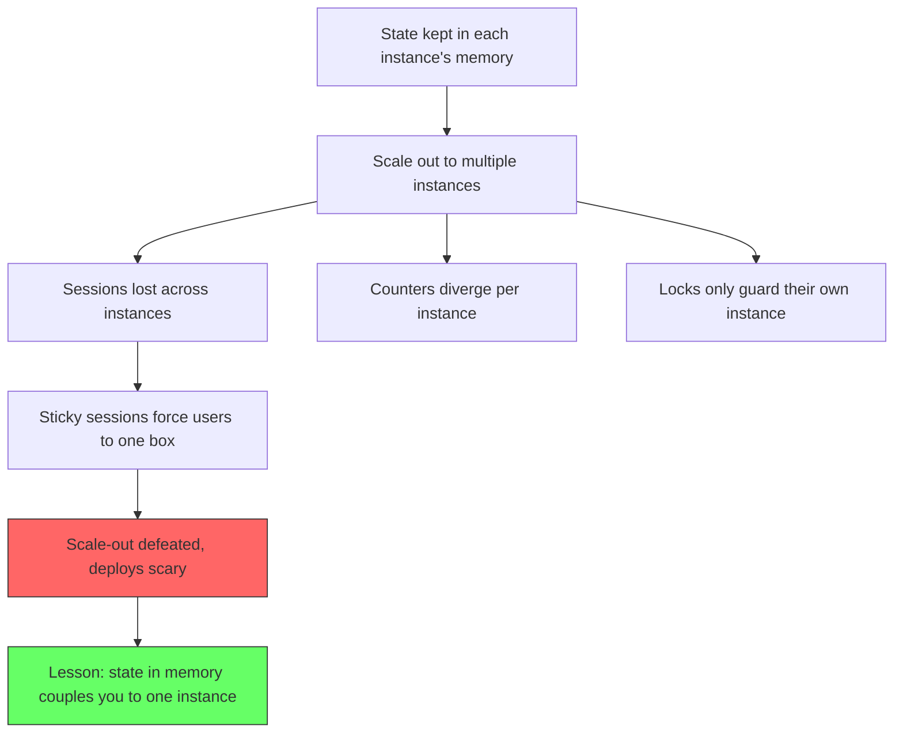
```mermaid
flowchart TD
    A["State kept in each instance's memory"] --> B["Scale out to multiple instances"]
    B --> C["Sessions lost across instances"]
    B --> D["Counters diverge per instance"]
    B --> E["Locks only guard their own instance"]
    C --> F["Sticky sessions force users to one box"]
    F --> G["Scale-out defeated, deploys scary"]
    G --> H["Lesson: state in memory couples you to one instance"]
    style G fill:#f66,stroke:#333
    style H fill:#6f6,stroke:#333
```

### What we realized

The state was not evil; it was in the wrong place. Every piece of state that lives in an instance's memory is a constraint that ties the world to that instance. Moving the state out, to a database, a cache, or a message store, turned every instance into an interchangeable worker that could serve any request, crash safely, and restart cleanly. The twelve-factor rule for stateless processes names it directly: "Any process can start or stop at any time; the process must be able to restart and resume its work."

### The lesson

**State in memory couples your application to a single instance. Every piece of state that lives in a process must either be externalized (to a store that survives the process) or be an acknowledged constraint. Stateless processes can scale, deploy, and crash freely; stateful ones cannot.**

### What we would do differently

- **Put sessions and shared flags in an external store** (Redis, the database) from the start, not in process memory.
- **Treat every in-memory variable as a candidate for externalization** during design review: if losing it on restart breaks a user, it should not live in the process.
- **Test scaling out early**: before the first production scale-out, run two instances and confirm a user's requests work across both.

## Story 10: The Stateless Service That Scaled Like It Was Nothing

### Context

A different service was designed stateless from day one: no sessions in memory, no local state, every request self-contained, and any shared data read from a store. The team chose this deliberately, partly out of habit and partly because the previous story's app had shown them the cost of doing otherwise.

### What happened next

A traffic spike hit, and the service scaled out cleanly. More instances came up, each identical, each able to serve any request. Requests balanced freely across them with no sticky sessions, no cross-instance races, and no "which box has the session" logic. A deploy was just starting new instances and draining old ones: no state to protect, no users to keep pinned, nothing to coordinate. When an instance died under load, nothing noticed except a small dip, because every other instance could do the dead one's job instantly.

The team had spent a little extra effort upfront to externalize state, and it paid off every day afterward: trivial scaling, boring deploys, and zero cross-instance bugs. Statelessness had turned the operational risk of the whole fleet into a non-event.

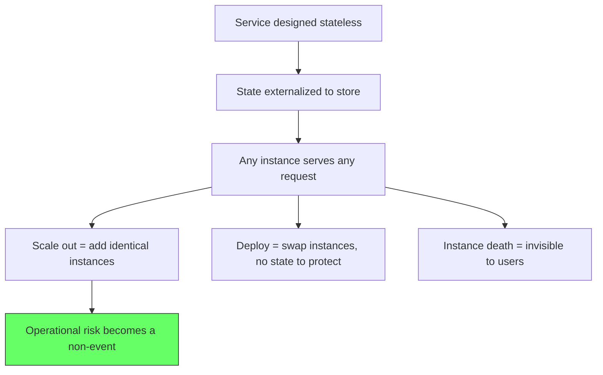
```mermaid
flowchart TD
    A["Service designed stateless"] --> B["State externalized to store"]
    B --> C["Any instance serves any request"]
    C --> D["Scale out = add identical instances"]
    C --> E["Deploy = swap instances, no state to protect"]
    C --> F["Instance death = invisible to users"]
    D --> G["Operational risk becomes a non-event"]
    style G fill:#6f6,stroke:#333
```

### What we realized

The difference between the stateful and the stateless service was not skill or luck; it was a decision made in the first two weeks. The stateless service treated every instance as disposable, which is exactly how the platform wanted to treat them. The stateful service treated every instance as precious, and the platform kept proving it wrong. The lesson from Story 9 and the benefit here are the same coin: state is the constraint, and removing it from the process removes the constraint.

### The lesson

**Statelessness is the highest-leverage design decision for operational freedom. An instance that carries no state can be created, destroyed, and replaced without ceremony, which turns scaling, deploys, and failures into non-events. Pay the small upfront cost to externalize state, and collect the benefit on every scale-out and every deploy.**

### What we would do differently

- **Design every new service to be stateless by default**, externalizing sessions, flags, and shared counters, and treat in-process state as a documented exception.
- **Confirm the property in the pipeline**: a test that restarts an instance mid-traffic and checks users are unaffected is a cheap way to keep the design honest.
- **Reuse the pattern**: after seeing the stateful and stateless versions of the same problem, the team now asks "where does the state live?" in every design review, before the code is written.

## Story 11: The Mentor Who Multiplied the Team

### Context

A senior engineer was the only person who understood a critical, gnarly service. Every question about it came to them, every incident was resolved by them, and they were the busiest person on the team. It felt heroic, and it was also a trap: the service's knowledge lived in one head, and the team could not move without it.

### What happened next

The senior engineer started doing the obvious but unglamorous thing: mentoring. They paired with the most junior engineer on every question instead of answering it directly, wrote down the service's mental model, reviewed the junior's early fixes line by line, and explained the *why* behind each decision rather than just the what. Progress was slow at first, because teaching takes longer than doing.

Then the payoff compounded. The junior engineer stopped needing to ask; they started answering questions for others. The service's knowledge spread across two heads, then four. When the senior engineer took a vacation, nothing caught fire, because the knowledge was no longer singular. The team got faster, the senior engineer's calendar freed up, and the critical service stopped being a dependency on one person.

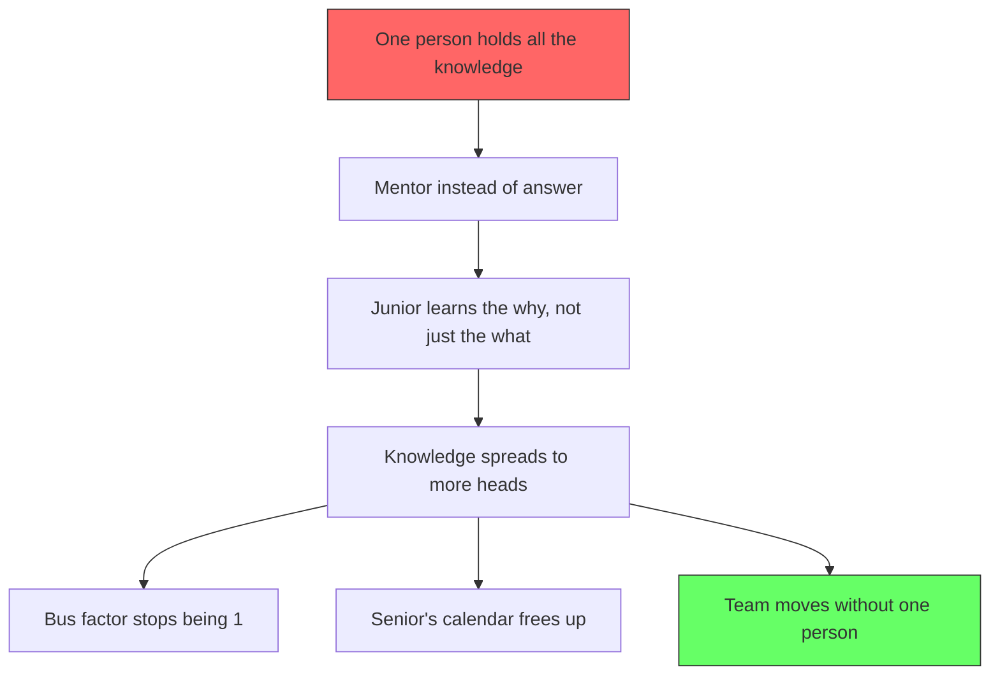
```mermaid
flowchart TD
    A["One person holds all the knowledge"] --> B["Mentor instead of answer"]
    B --> C["Junior learns the why, not just the what"]
    C --> D["Knowledge spreads to more heads"]
    D --> E["Bus factor stops being 1"]
    D --> F["Senior's calendar frees up"]
    D --> G["Team moves without one person"]
    style A fill:#f66,stroke:#333
    style G fill:#6f6,stroke:#333
```

### What we realized

Mentoring is not charity or a nice-to-have; it is the difference between a knowledge bottleneck and a self-healing team. Doing the work yourself is fast once and slow forever; teaching it is slow once and fast forever. The senior engineer was the bottleneck precisely because answering was faster than teaching, and the team had optimized for the fast option every day until the cost was obvious.

### The lesson

**The busiest expert is a single point of failure. Mentoring is how you divide knowledge the way you divide services: the goal is not for you to answer every question, it is for no question to need you. Teach the why, write down the mental model, and let the knowledge spread until the team outgrows the dependency on one person.**

The reward is not just resilience. A team whose members can explain the system to each other moves faster, because questions get answered where they are asked instead of traveling to the single expert.

### What we would do differently

- **Pair instead of answer**: when someone asks about a critical system, go through the reasoning with them rather than handing over the answer.
- **Write down the mental model** of critical services, so knowledge survives both vacations and attrition.
- **Measure the bus factor honestly**: if a service breaks when one person is out, that is a structural defect, not a staffing fact, and mentoring is the fix.

## Story 12: The Speed of Skipping the Plan That Cost a Year

### Context

A startup team was shipping fast and proud of it. They believed planning was bureaucracy. Every time someone proposed a design session, a data model, or a boundary decision, the answer was "just build it, we need speed." The feature backlog moved quickly, and for the first six months, the belief looked correct: velocity was high, and the codebase was still small enough that no one needed a map.

### What happened next

The codebase grew, and the cost of never planning arrived in an accelerating cascade. Features that were independent on the roadmap were tangled in the code because no one had drawn the lines between them. A simple change to one feature required tracing through a web of modules with no ownership boundaries. Each new feature added complexity to the shared mess instead of standing on a clean seam, so the cost of each feature went up while the speed of shipping it went down.

Then came the reversal nobody saw coming: the team started moving *slower* than they would have if they had paused to plan. Two weeks of design could have saved them from two months of untangling, and the untangling arrived exactly when the business needed speed the most, on the critical path to a big launch. The team that had optimized away planning spent the next year paying interest on the decision, in refactors, in bugs, in onboarding, and in features that took three times as long to land.

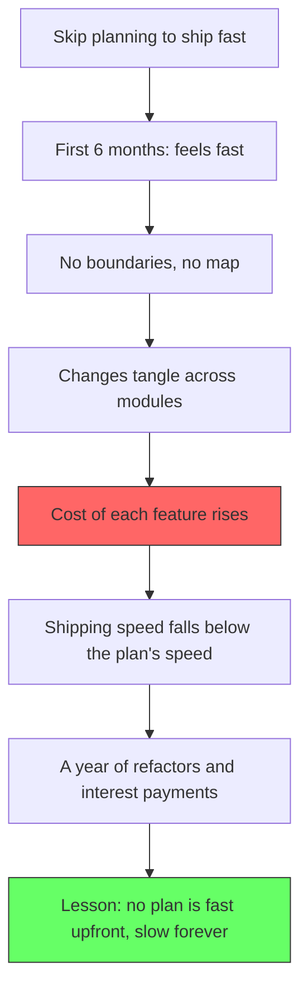
```mermaid
flowchart TD
    A["Skip planning to ship fast"] --> B["First 6 months: feels fast"]
    B --> C["No boundaries, no map"]
    C --> D["Changes tangle across modules"]
    D --> E["Cost of each feature rises"]
    E --> F["Shipping speed falls below the plan's speed"]
    F --> G["A year of refactors and interest payments"]
    G --> H["Lesson: no plan is fast upfront, slow forever"]
    style E fill:#f66,stroke:#333
    style H fill:#6f6,stroke:#333
```

### What we realized

The trade was not speed versus planning. It was speed *now* versus speed *forever*. Planning is not a delay inserted between you and shipping; it is an investment in the rate at which you ship later. The team had believed the two were in opposition, when in reality planning was the only thing that kept the long-run shipping rate from collapsing.

This is the city analogy from Story 3 made literal: a city built without a plan works for a while, then stops working, and by then the unplanned streets are too tangled to re-plan cheaply. Software has the same property, and the difference is that software teams can pretend it is not happening for much longer, because the codebase does not look broken, it just gets slower.

The planning that pays off is not heavy ceremony. It is the minimum that keeps seams honest: knowing where the boundaries are, who owns which data, and what depends on what. That is the same set of decisions this whole article keeps circling, because every expensive story in it is a planning decision made too late.

### The lesson

**Skipping architecture planning does not speed you up; it shifts the speed from now to later, with interest. The first six months feel fast precisely because the codebase is still small enough to survive without a map. The rate at which you ship is set by the seams you draw, and you pay for absent seams in every feature after the first few.**

The healthy version is not planning for its own sake. It is the smallest investment that keeps the map honest: boundaries, data ownership, and dependency decisions, made before the tangle makes them expensive. That is why this article keeps returning to the same seam: the expensive stories are the planning decisions made too late.

### What we would do differently

- **Spend the planning minutes up front**: a design session before a feature is cheaper than an untangle after it, by an order of magnitude.
- **Draw the boundaries as the code is written**, not as a document: the module boundary, the data owner, the dependency direction, so the seam exists before the tangle does.
- **Track the trend, not the point**: when the cost per feature starts rising, that is the signal that the no-plan approach has stopped paying, and it arrives long before the project is visibly broken.
- **Reject "planning is slow" as a complete argument**: the honest question is whether the plan buys back more shipping speed than it costs, and for anything that lives more than a few months, it usually does.

## Story 13: The Problem-Focused Team (and Why DDD Is Hard to Sell)

### Context

A team was asked to build a workflow: a customer places an order, it must be reserved against stock, and payment must clear before anything ships. The team split naturally into two instincts. The problem-focused instinct asked: what rules does this workflow obey, what can and cannot happen, and who owns each decision? The tech-focused instinct asked: what tables do we need, what endpoints, what services, what queue.

In the end, the tech questions won the room, because they are easier to draw. The team produced a schema, an API contract, and a service map. The workflow itself, the part that actually made the business money, was represented as whatever leftover logic fit between the tables.

### What happened next

The bugs arrived exactly where the diagram was quietest. An order could be reserved against stock that had just been sold, because the rule "reserve and then ship only after payment" lived nowhere the code consulted. A payment could be retried and doubled because the tech design had two services writing to the same row with no rule saying "an order is paid once." The team had built the infrastructure of the solution and forgotten the problem it was a solution to.

Each fix was a patch bolted onto the tech-first structure: a new constraint here, a state check there, a cron job to clean up the mess. The workflow rules, which should have been the primary structure of the system, were scattered across the patches. The system worked after enough patches, but it was now a museum of the problem it never directly modeled.

```mermaid
flowchart TD
    A["Tech-first design"] --> B["Schema + APIs + services drawn first"]
    B --> C["Business rules become leftover glue"]
    C --> D["Rules scattered as patches"]
    D --> E["Every fix is bolted onto tech structure"]
    E --> F["System works, but models no problem"]
    F --> G["Lesson: draw the problem (rules), then the tech"]
    style D fill:#f66,stroke:#333
    style G fill:#6f6,stroke:#333
```

### What we realized

The team had not skipped design; they had designed the wrong layer. The database, the endpoints, and the services are the *answers*; the business rules are the *problem*. Draw the problem first and the answers fall out with a direction. Draw the answers first and the problem has to be retrofit into them, which is what this team spent the following weeks doing.

This is what Domain-Driven Design is, at its core: a plea to start from the problem and let the technology follow the boundaries that the problem reveals. DDD was never about repositories, entities, and aggregates as a technology fashion. Those are just the vocabulary for keeping the problem in charge. The message has not fully landed in the industry, probably because the technology artifacts of DDD (the entities, the patterns) are easier to copy than the habit of starting from the problem. Teams adopt DDD's shapes without adopting its posture, and get the ceremony without the clarity.

The knowledge base's own article on this makes the same point: "Most teams begin system design by drawing tables... The ERD shows storage, not behavior. The business rule 'a course cannot exceed its capacity' is not a column type or a foreign key. It is a constraint on a workflow." Technology-first design, the article notes, "start[s] with the database schema, design[s] API endpoints around CRUD operations, and treat[s] business logic as a thin layer on top."

### The lesson

**Technology is the answer; the problem is the question. Teams that draw the schema, the endpoints, and the services first are designing the shape of the solution in a vacuum, and the business rules that should structure the system end up as scattered patches. DDD is, fundamentally, the insistence on drawing the problem first — and its message has not fully landed because its technology artifacts are easier to copy than its posture.**

### What we would do differently

- **Start the design session with the rules, not the tables**: list what can and cannot happen in the workflow, who decides, and where each decision lives, before any schema is drawn.
- **Treat the tech shape (schema, services, APIs) as the *output* of the problem shape**, not the starting point. The boundaries of the problem suggest the boundaries of the modules.
- **If adopting DDD, adopt its posture, not just its vocabulary**: the point is keeping the problem in charge, and entities and aggregates are only scaffolding for that. The knowledge base's DDD articles (Why DDD Starts from the Business, Not the Database; Bounded Contexts) are the fuller statement of this idea.

## How to add stories to this collection

The pattern for any story you want to add is deliberately small — five fields that fit in a conversation:

1. **Context**: what the business was trying to do.
2. **Decision**: what was built and why it seemed reasonable at the time.
3. **Outcome**: what happened after it shipped, including the hidden costs.
4. **Realization**: the moment someone saw the decision differently.
5. **Lesson**: the one-sentence takeaway, plus what you would do instead.

Stay narrative, stay specific, and avoid settling scores. The best lessons are about systems, not people: blameless by construction, exactly like the incident postmortems in the down-system debugging guide.

## Sources

- Martin Fowler: [Monolith First](https://martinfowler.com/bliki/MonolithFirst.html)
- Martin Fowler: [Extracting Data-Rich Services](https://martinfowler.com/articles/extract-data-rich-service.html)
- Milan Jovanović: [Module Boundaries With Bounded Contexts in Modular Monolith](https://milanjovanovic.tech/blog/module-boundaries-bounded-contexts)
- Milan Jovanović: [When to Extract a Module Into a Microservice](https://milanjovanovic.tech/blog/when-to-extract-module-to-microservice)
- Michael van Leest: [How I Decide What Deserves a Service Boundary](https://mvanleest.com/blog/how-i-decide-what-deserves-a-service-boundary-and-what-does-not/)
- Encore: [Microservices vs Modular Monolith](https://encore.dev/articles/microservices-vs-modular-monolith)
- Atharva Pandey: [Monolith First: Starting With Microservices Is Usually Wrong](https://www.atharvapandey.com/post/fundamentals/arch-monolith-first/)
- AWS Builders' Library: [Caching Challenges and Strategies](https://aws.amazon.com/builders-library/caching-challenges-and-strategies/)
- Redis: [How to Tame the Thundering Herd Problem](https://redis.io/blog/how-to-tame-the-thundering-herd-problem/)
- Redis: [Cache Stampede Prevention](https://redis.antirez.com/fundamental/cache-stampede-prevention.html)
- Yuri Shkuro / The Twelve-Factor App: [Processes (statelessness)](https://12factor.net/processes)
- GitHub Scholar: [Mentoring and the bus factor](https://en.wikipedia.org/wiki/Bus_factor)
- Gart Solutions (via YourTechnologyDoctor): [Technology-first vs Problem-first software architecture](https://becomegreatat.com/2021/09/20/technology-first-vs-problem-first-software-architecture/)
- Eric Evans: [Domain-Driven Design: Tackling Complexity in the Heart of Software](https://www.domainlanguage.com/ddd/)