# Software Development Stories: Lessons from the Trenches

## The problem: what we learn in projects often dies with the project

Most hard-won engineering lessons are never written down. A developer builds something, hits a wall, finds a clever way around it, and realizes a month later that the cleverness was a mistake. Then the project ends, the context evaporates, and the next team makes the same call from scratch. The knowledge we trust most, the stuff we can only get from doing, is the stuff we share least.

This article is an attempt to fix that by collecting short, narratable stories from real production work. Each story follows the same shape: here is what we built, here is what happened, here is what we realized, here is the lesson. They are meant to be told, not just read, because a story that can be narrated to a colleague survives longer than a bullet point in a wiki.

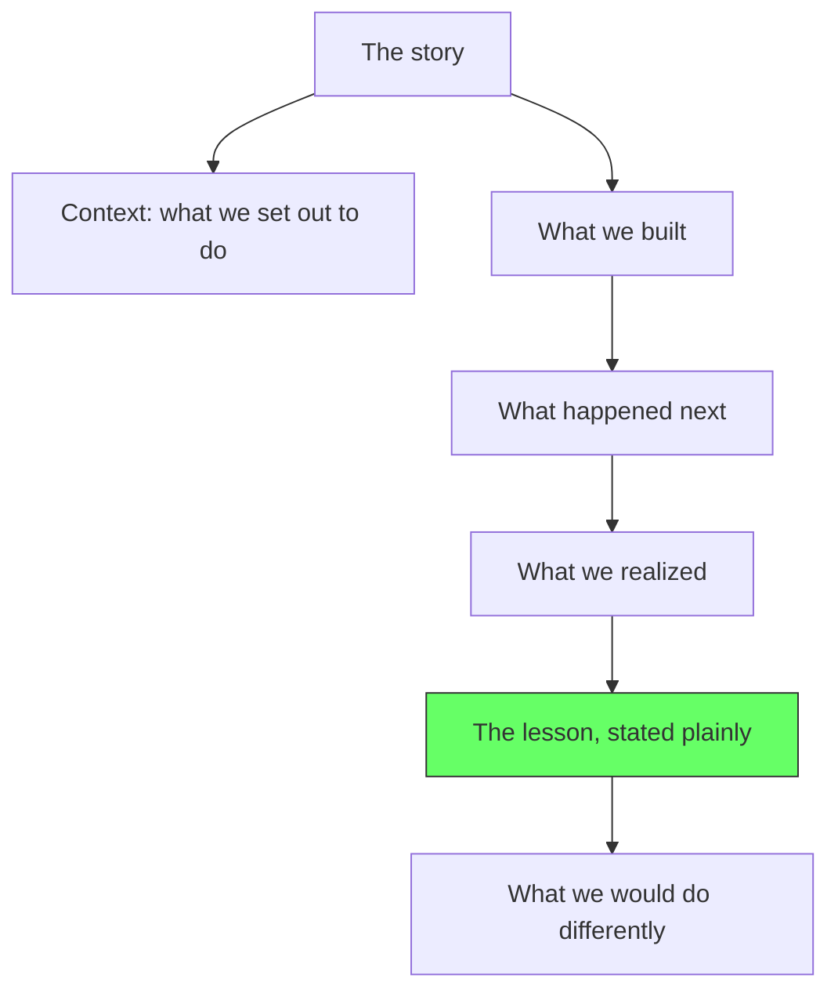

## Story 1: The Buy Again Service That Should Have Been Its Own Module

### Context

A while ago, a team needed a "Buy Again" feature in an e-commerce product: the order history page shows the customer their past orders and lets them reorder the same items with one click. At the time, the ordering domain was made of several microservices: orders (order lifecycle), catalog (product data), payments, and so on.

Someone stood up a Buy Again service. But here is the detail that mattered most: **Buy Again pulled its data from another downstream service directly, and it had no meaningful dependency on the orders service at all.** It did not care about order state transitions. It did not read order tables. It did not call orders' public API. Its data came from somewhere else in the stack.

### What happened next

The feature worked and it shipped. But structurally, the service was placed *inside* the orders world (same repo, same deployment unit, owned by the orders team) even though its dependency graph pointed somewhere entirely different. It lived in proximity to orders based on the product surface (it showed order history), not on the thing that actually determines cohesion: dependencies.

The misplacement became visible every time the team changed it. Since Buy Again had no dependency on orders, every change to orders forced Buy Again to coordinate, test, and redeploy a service that was conceptually unrelated. And because Buy Again sat inside orders without a boundary, its code and data began to blur into the ordering context even though its real dependencies lived downstream. The folder structure told you one story; the dependency graph told you another.

### What we realized

Cohesion in software does not come from what a screen shows. It comes from **what depends on what, who owns the data, and which workflows it participates in**. Buy Again looked like part of the order experience, so it got parked next to orders. But its data and its downstream calls made it an independent responsibility that happened to be filed under the wrong roof.

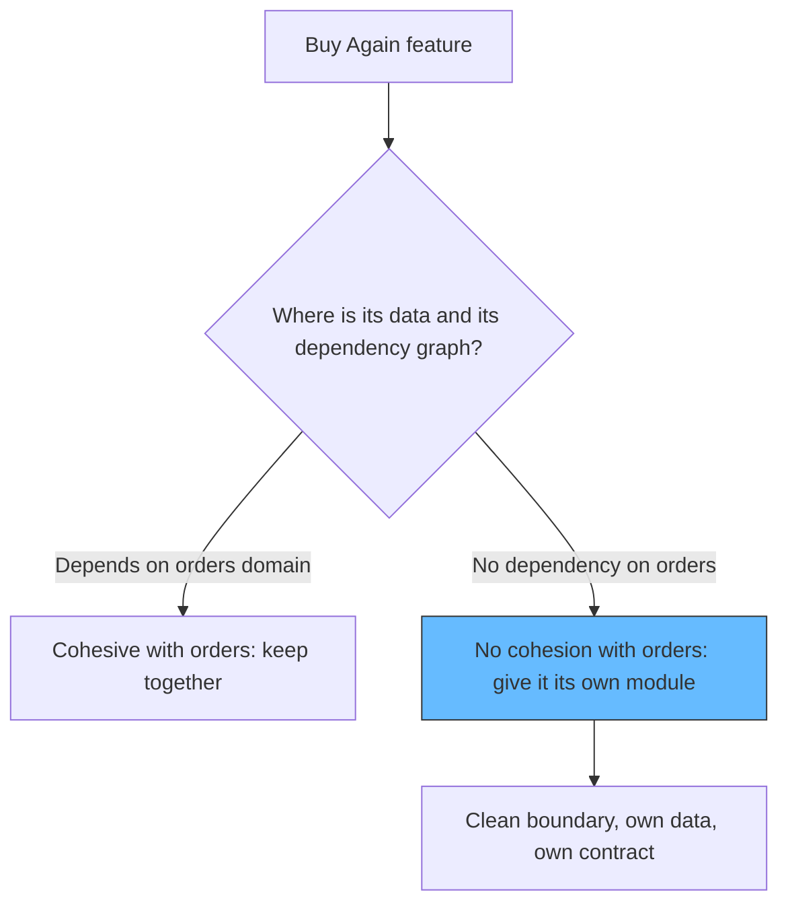

What was missing was a boundary, not a merger. Buy Again having no dependency on orders is a good thing; the mistake was not giving it its own module with a clean seam. In a modular monolith this is exactly the shape you want: the Buy Again module owns its data, exposes a small public interface, and communicates with the rest through contracts, so that if it ever deserves independent deployment, extraction is a mechanical step instead of a rewrite.

Milan Jovanović on module boundaries puts it precisely: "Fixing a boundary inside a monolith is a refactoring, not a migration. Merging two chatty modules means moving files. Splitting an overgrown module is harder, but still a single-codebase exercise. Compare that with microservices, where a wrong boundary is baked into network contracts." Michael van Leest, on deciding what deserves a service boundary: "I usually care more about data ownership and workflow behavior. If a service boundary does not produce clearer ownership over data, behavior, or runtime responsibilities, it often becomes just a packaging change with extra operational cost."

### The lesson

**Where a responsibility lives is decided by its dependencies, its data, and its workflows, not by the product surface it serves. If a capability does not depend on a context's domain, do not glue it to that context; give it its own module with a clean boundary, and extract it only when it earns independent deployment.**

The corollary is the modular monolith: keep the boundaries real inside one deployable, with each module owning its data and publishing a contract, so an eventual split is mechanical rather than architectural. Encore frames the two this way: modules and microservices "share the same idea about structure and disagree only on whether a network sits between the modules."

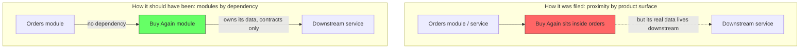

### What we would do differently

- **Ask where the data lives and what depends on it, not what the screen shows.** Buy Again's downstream data source was the tell: it was an independent responsibility.
- **Give Buy Again its own module with its own schema and a small public interface**, with no direct table access from, or to, orders. This is the modular monolith shape: a firm, enforceable boundary inside a single deployable.
- **Only extract it to a service when a concrete driver appears**: independent scaling, an independent team, or a separate deploy cadence. Until then, the boundary within the monolith is already the seam.

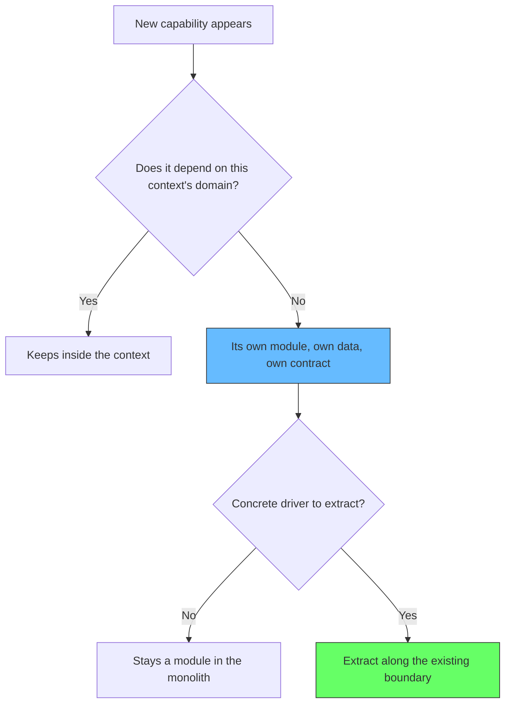

## Story 2: The Shared Cache That Became the Single Point of Failure

### Context

A platform ran several services (auth, catalog, cart, recommendations) that all read a small set of "hot" data: product prices, shipping rules, config values. Each service fetched it from the database on every request, and the database was starting to feel the load. Someone proposed the obvious fix: a shared in-memory cache (Redis) in front of the database, used by every service, so repeated reads never hit Postgres.

### What happened next

The cache worked wonders on latency, and everyone was happy, until the day Redis hiccuped. One afternoon the cache's memory hit its cap, eviction went poorly, and the cluster restarted. Every service that depended on it, which was every service, suddenly had to read through to the database at once. The database, previously protected by the cache, got a wall of requests it had not seen in months, and it buckled. What should have been "the cache was slow for five minutes" became a platform-wide outage because the cache was now a load-bearing dependency on the critical path.

The real problem was subtle: the services had been built so they *could* survive without the cache (with timeouts and fallbacks), but nobody had ever tested what that survival path actually looked like at full blast. In practice the fallback was untested code that nobody expected to run.

### What we realized

A cache is a correctness optimization, not a guarantee. The team had treated a performance feature as if it were part of the durability story, and in doing so had quietly inserted a new single point of failure into every request path. The instant a component becomes load-bearing, it needs the same treatment as the database: capacity planning, monitoring, and a tested degraded path.

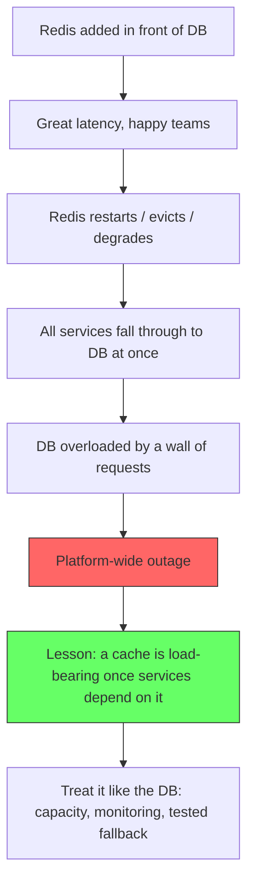

We should have asked the question we ask of any dependency: what happens to the system when this thing stops working? If the answer is "everything breaks at once," the component is not a cache anymore, it is the new database, and it deserves the same budget.

### The lesson

**A shared cache that every service depends on is load-bearing infrastructure, not a performance trick. Cache dependencies need capacity planning, dedicated monitoring, and a degraded path that is actually tested at storm volume.**

AWS reinforces this in its own incident retrospectives: the failure mode that takes out whole fleets is commonly a dependency that was "just a cache" but became load-bearing without anyone updating the operational budget to match. The design move is to ask early *what breaks when the cache is down* and then practice that scenario, ideally in a game day, before a real one happens for you.

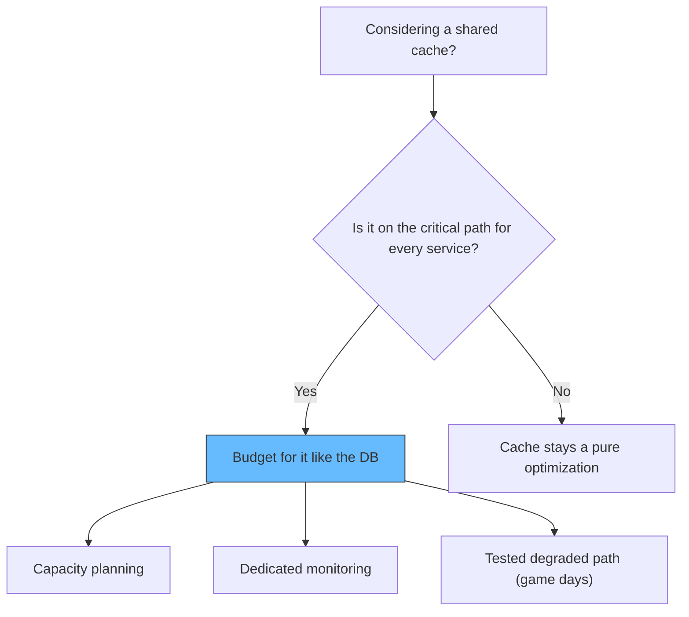

### What we would do differently

- **Scope the cache per service or per read path**, not as one fleet-wide dependency, so a hiccup in one domain does not take down the platform.
- **Make cache misses cheap by design**: if the database can handle worst-case throughput, a cache failure degrades performance gracefully instead of becoming an outage.
- **Practice the degraded path**: a game day where Redis is taken offline and the team watches the system degrade inside its budget.

## Story 3: The Temporary Feature Flag That Stayed for Two Years

### Context

During a release, a team needed to disable a newly shipped checkout step quickly in case something went wrong. They wrapped it in a feature flag labeled "temporary" in a one-liner comment, flipped it off after a brief incident, and moved on. It was the classic emergency mitigation: fast, effective, and easy to forget.

### What happened next

The flag never got removed. Two years later, no one on the team knew it existed or what behavior it controlled. When a new engineer finally found it during a cleanup, the code it guarded had grown around it: new features had quietly branched on the flag, doubling the paths through checkout. Removing it was no longer a five-minute deletion; it was a small project to untangle two parallel flows that had real users on both sides. The "temporary" escape hatch had become a permanent second architecture.

### What we realized

A mitigation that outlives the event that created it stops being a control and starts being a fork in the code. The flag did not contain complexity; it created it. This is the software version of a debt that compounds: every month it exists, more code assumes it exists, and the cost of removing it grows while the memory of why it exists fades.

It helps to think in the analogy that software architecture is like a city. You can build without a plan: a house here, a shop there, a road that seems convenient today. Individually each decision is fine, and the city works. Then a second downtown grows where no one ever planned a downtown, streets dead-end for reasons no one remembers, and the whole thing becomes hard to move through. Nothing is broken, exactly; it is simply unplanned. The city still stands, but no one can say why it looks like it does, and scaling it means untangling decisions nobody remembers making.

The same happens to a codebase one flag at a time. No single addition to the flag — no individual "just branch on it" commit — is the mistake. The mistake is that the map was never looked at. The street was laid, then more streets were laid around it, and nobody was watching the city grow. You do not get ugly, unscalable software from one bad decision; you get it from a hundred reasonable decisions with no plan holding them together. And here is the cruel part of the analogy: a city built on accident still has an architecture. It is just an architecture nobody designed, and it shows in ways that are invisible when things are working and unmistakeable six months or a year later, when the new inhabitants ask "who planned this?" and the answer is "nobody planned this; it happened."

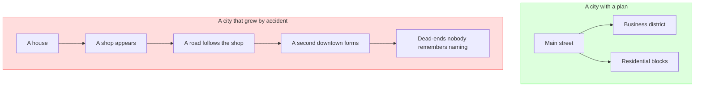

Both cities work. Only one has an answer to "who planned this?" — and that one question is the difference between software that scales under growth and software that has to be untangled before it can.

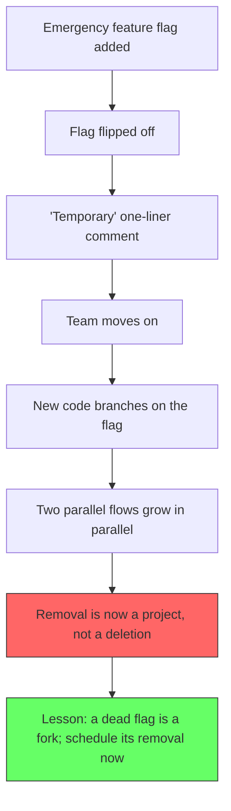

The team that built the flag knew exactly what it controlled. The team that found it knew exactly nothing. That single fact, the decay of context, is why temporary flags die so slowly: the knowledge of what they do evaporates before the flag does.

### The lesson

**Every temporary mitigation needs an expiration date, an owner, and a ticket before the emergency ends. If it cannot be removed in the next two weeks, it is not temporary; it is a permanent decision you are choosing not to make.**

Many teams enforce this structurally instead of by discipline: a deadline attached to the flag, an alert that fires when the flag is old, a lint rule that fails on comments like "temporary." The mechanisms vary; the principle does not. Mitigate the incident, and separately, schedule the cleanup while the incident is still fresh enough to do it cheaply.

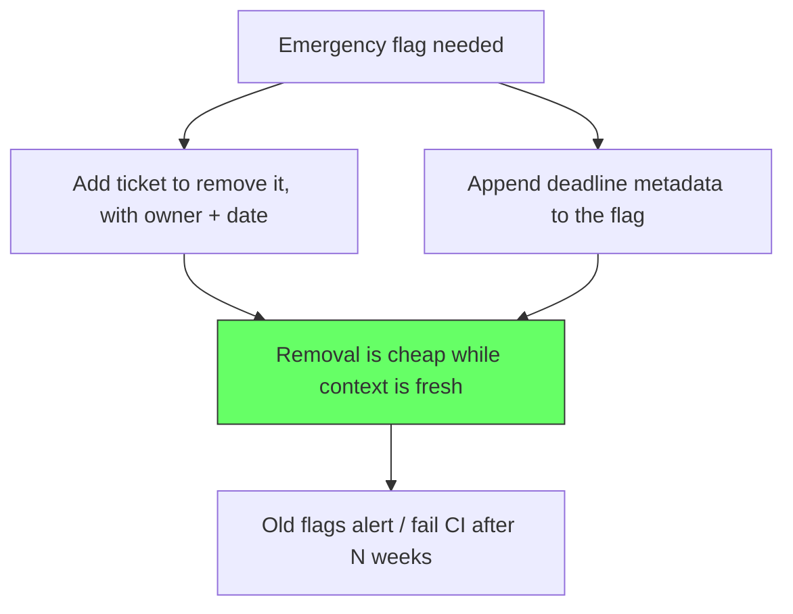

### What we would do differently

- **Create the removal ticket in the same commit that adds the flag.** If it is worth adding, it is worth scheduling the removal.
- **Attach a deadline and owner to every feature flag**, and have monitoring alert when a flag has not changed in months.
- **When a flag forks code into two paths, treat the fork as a smell** and consolidate, even if both paths work. Two working paths are double the maintenance for zero product value.

## Story 4: The Rewrite That Bought Microservices and Lost the Knowledge

### Context

A successful monolith (a billing system) was working well: fast releases, one deployable, a database the team knew inside out. Leadership decided to move to microservices, partly for scale and partly because microservices sounded like the modern architecture. The team top-to-bottom was sold on the rewrite.

### What happened next

Six services were carved out, each with its own repository, deployment, and database schema. What followed was eighteen months of infrastructure work: service discovery, distributed tracing, retries, timeouts, transactional outbox patterns, and coordinating deploys across services for changes that used to be one PR. The business features that used to ship weekly now shipped every few weeks, because a change to "billing" now meant two coordinated releases. When production misbehaved, the team could no longer attach a debugger and step through; it pieced together spans across six services.

The old monolith was deleted once the last traffic moved over. And with it went something invisible but valuable: the decade of constraints, invariants, and "weird things about this domain" encoded in one codebase the team collectively understood.

### What we realized

The rewrite did not buy what the team thought it was buying. The scaling problem that motivated it was solved by running more instances of the monolith, which they could have done without a rewrite at all. What the rewrite actually bought was independent deploys they did not need, and the cost was distributed-systems complexity they had never paid before. On top of that, the rewrite discarded the one asset the monolith held: working, tested behavior with proven boundaries embedded in years of real traffic.

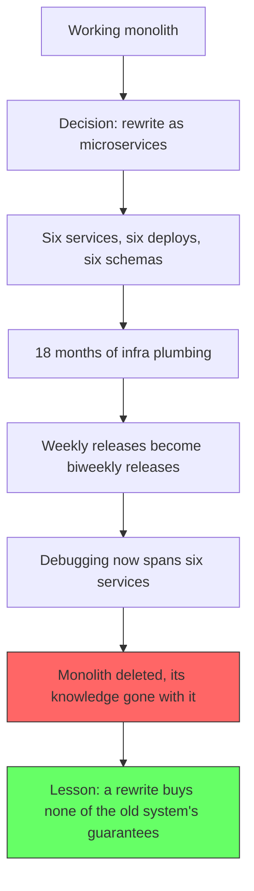

The bitter part: the rewrite was not even a rewrite of the monolith. It was a rewrite of the monolith's *deployment*. The domain logic was mostly copied over; the architecture changed but the behavior barely did, because nobody was trying to change the behavior. That is the surest sign of an architecture-driven rewrite that was never going to pay for itself.

### The lesson

**Do not rewrite a working system to change its deployment shape. Reshape the deployment (more instances, a load balancer, a modular monolith with real boundaries) and keep the working behavior. A rewrite only makes sense when the behavior itself has to change, and even then, it should be incremental, not a forklift.**

Martin Fowler's Monolith First essay warns that most systems "acquire too many dependencies between their modules and thus can't be sensibly broken apart." The honest version of that lesson is the inverse: a working system has already told you where its real seams are, through years of successful operation. Rewriting across a diagram is how you ignore that evidence and pay dearly to learn the seams are where they always were. The modular monolith path, again, is the responsible middle: keep the codebase, carve real module boundaries, and extract only when a concrete operational reason exists.

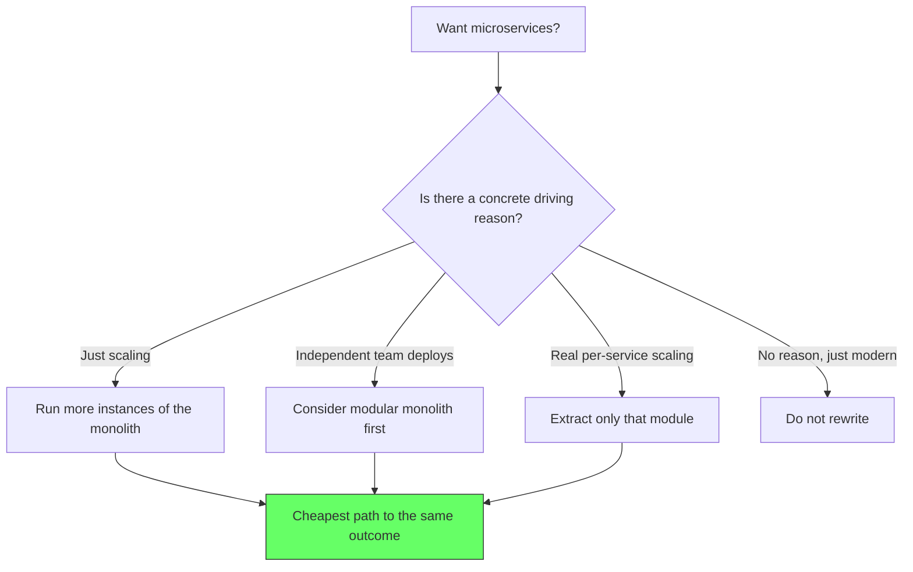

### What we would do differently

- **Start with the cheapest thing that solves the actual problem**: more instances, a load balancer, better caching.
- **If boundaries are the goal, carve them inside the existing monolith** and measure whether the change path really improves before extracting anything.
- **Never delete a working system before its knowledge transfer is explicit**: encode the invariants, the tests, and the "weird domain things" in documentation that survives the migration.

## How to add stories to this collection

The pattern for any story you want to add is deliberately small — five fields that fit in a conversation:

1. **Context**: what the business was trying to do.
2. **Decision**: what was built and why it seemed reasonable at the time.
3. **Outcome**: what happened after it shipped, including the hidden costs.
4. **Realization**: the moment someone saw the decision differently.
5. **Lesson**: the one-sentence takeaway, plus what you would do instead.

Stay narrative, stay specific, and avoid settling scores. The best lessons are about systems, not people: blameless by construction, exactly like the incident postmortems in the down-system debugging guide.

## Sources

- Martin Fowler: [Monolith First](https://martinfowler.com/bliki/MonolithFirst.html)
- Martin Fowler: [Extracting Data-Rich Services](https://martinfowler.com/articles/extract-data-rich-service.html)
- Milan Jovanović: [Module Boundaries With Bounded Contexts in Modular Monolith](https://milanjovanovic.tech/blog/module-boundaries-bounded-contexts)
- Milan Jovanović: [When to Extract a Module Into a Microservice](https://milanjovanovic.tech/blog/when-to-extract-module-to-microservice)
- Michael van Leest: [How I Decide What Deserves a Service Boundary](https://mvanleest.com/blog/how-i-decide-what-deserves-a-service-boundary-and-what-does-not/)
- Encore: [Microservices vs Modular Monolith](https://encore.dev/articles/microservices-vs-modular-monolith)
- Atharva Pandey: [Monolith First: Starting With Microservices Is Usually Wrong](https://www.atharvapandey.com/post/fundamentals/arch-monolith-first/)
- AWS Builders' Library: [Caching Challenges and Strategies](https://aws.amazon.com/builders-library/caching-challenges-and-strategies/)