# Software Development Stories: Lessons from the Trenches

## The problem: what we learn in projects often dies with the project

Most hard-won engineering lessons are never written down. A developer builds something, hits a wall, finds a clever way around it, and realizes a month later that the cleverness was a mistake. Then the project ends, the context evaporates, and the next team makes the same call from scratch. The knowledge we trust most, the stuff we can only get from doing, is the stuff we share least.

This article is an attempt to fix that by collecting short, narratable stories from real production work. Each story follows the same shape: here is what we built, here is what happened, here is what we realized, here is the lesson. They are meant to be told, not just read, because a story that can be narrated to a colleague survives longer than a bullet point in a wiki.

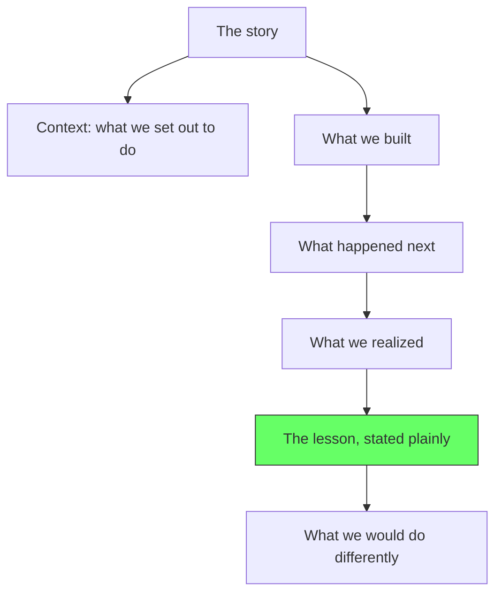
```mermaid
graph TD
    A["The story"] --> B["Context: what we set out to do"]
    A --> C["What we built"]
    C --> D["What happened next"]
    D --> E["What we realized"]
    E --> F["The lesson, stated plainly"]
    F --> G["What we would do differently"]
    style F fill:#6f6,stroke:#333
```

## Story 1: The Buy Again Service That Should Have Been Its Own Module

### Context

A while ago, a team needed a "Buy Again" feature in an e-commerce product: the order history page shows the customer their past orders and lets them reorder the same items with one click. At the time, the ordering domain was made of several microservices: orders (order lifecycle), catalog (product data), payments, and so on.

Someone stood up a Buy Again service. But here is the detail that mattered most: **Buy Again pulled its data from another downstream service directly, and it had no meaningful dependency on the orders service at all.** It did not care about order state transitions. It did not read order tables. It did not call orders' public API. Its data came from somewhere else in the stack.

### What happened next

The feature worked and it shipped. But structurally, the service was placed *inside* the orders world (same repo, same deployment unit, owned by the orders team) even though its dependency graph pointed somewhere entirely different. It lived in proximity to orders based on the product surface (it showed order history), not on the thing that actually determines cohesion: dependencies.

The misplacement became visible every time the team changed it. Since Buy Again had no dependency on orders, every change to orders forced Buy Again to coordinate, test, and redeploy a service that was conceptually unrelated. And because Buy Again sat inside orders without a boundary, its code and data began to blur into the ordering context even though its real dependencies lived downstream. The folder structure told you one story; the dependency graph told you another.

### What we realized

Cohesion in software does not come from what a screen shows. It comes from **what depends on what, who owns the data, and which workflows it participates in**. Buy Again looked like part of the order experience, so it got parked next to orders. But its data and its downstream calls made it an independent responsibility that happened to be filed under the wrong roof.

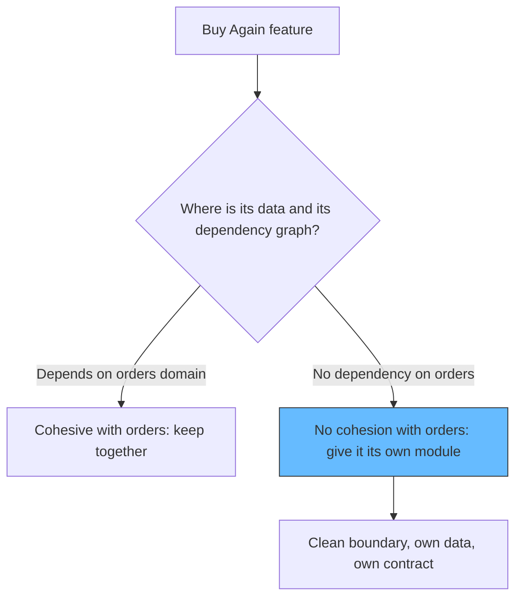
```mermaid
flowchart TD
    A["Buy Again feature"] --> Q{"Where is its data and its dependency graph?"}
    Q -->|"Depends on orders domain"| R["Cohesive with orders: keep together"]
    Q -->|"No dependency on orders"| S["No cohesion with orders: give it its own module"]
    S --> T["Clean boundary, own data, own contract"]
    style S fill:#6bf,stroke:#333
```

What was missing was a boundary, not a merger. Buy Again having no dependency on orders is a good thing; the mistake was not giving it its own module with a clean seam. In a modular monolith this is exactly the shape you want: the Buy Again module owns its data, exposes a small public interface, and communicates with the rest through contracts, so that if it ever deserves independent deployment, extraction is a mechanical step instead of a rewrite.

Milan Jovanović on module boundaries puts it precisely: "Fixing a boundary inside a monolith is a refactoring, not a migration. Merging two chatty modules means moving files. Splitting an overgrown module is harder, but still a single-codebase exercise. Compare that with microservices, where a wrong boundary is baked into network contracts." Michael van Leest, on deciding what deserves a service boundary: "I usually care more about data ownership and workflow behavior. If a service boundary does not produce clearer ownership over data, behavior, or runtime responsibilities, it often becomes just a packaging change with extra operational cost."

### The lesson

**Where a responsibility lives is decided by its dependencies, its data, and its workflows, not by the product surface it serves. If a capability does not depend on a context's domain, do not glue it to that context; give it its own module with a clean boundary, and extract it only when it earns independent deployment.**

The corollary is the modular monolith: keep the boundaries real inside one deployable, with each module owning its data and publishing a contract, so an eventual split is mechanical rather than architectural. Encore frames the two this way: modules and microservices "share the same idea about structure and disagree only on whether a network sits between the modules."

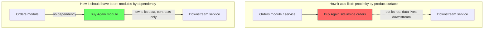
```mermaid
graph TD
    subgraph Wrong["How it was filed: proximity by product surface"]
        W["Orders module / service"] --> W2["Buy Again sits inside orders"]
        W2 -.->|"but its real data lives downstream"| W3["Downstream service"]
    end
    subgraph Right["How it should have been: modules by dependency"]
        R1["Orders module"] -->|"no dependency"| R2["Buy Again module"]
        R2 -->|"owns its data, contracts only"| R3["Downstream service"]
    end
    style W2 fill:#f66,stroke:#333
    style R2 fill:#6f6,stroke:#333
```

### What we would do differently

- **Ask where the data lives and what depends on it, not what the screen shows.** Buy Again's downstream data source was the tell: it was an independent responsibility.
- **Give Buy Again its own module with its own schema and a small public interface**, with no direct table access from, or to, orders. This is the modular monolith shape: a firm, enforceable boundary inside a single deployable.
- **Only extract it to a service when a concrete driver appears**: independent scaling, an independent team, or a separate deploy cadence. Until then, the boundary within the monolith is already the seam.

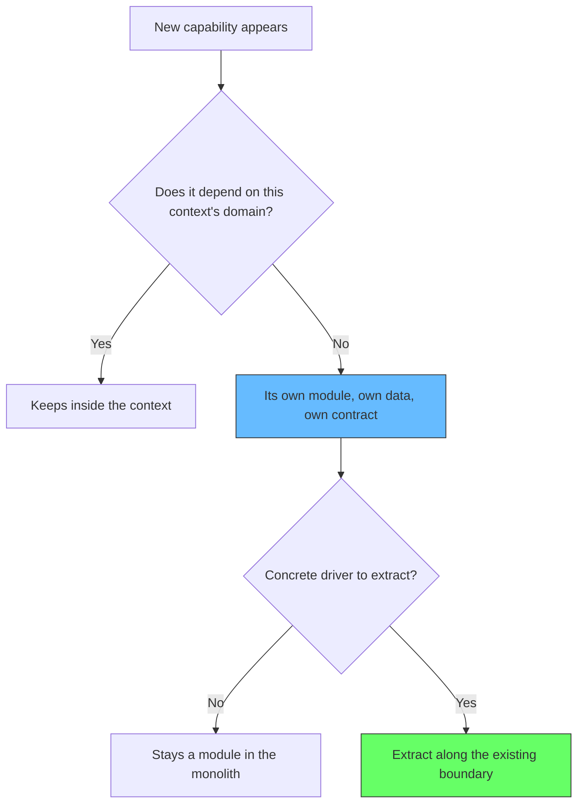
```mermaid
graph TD
    A["New capability appears"] --> B{"Does it depend on this context's domain?"}
    B -->|"Yes"| C["Keeps inside the context"]
    B -->|"No"| D["Its own module, own data, own contract"]
    D --> E{"Concrete driver to extract?"}
    E -->|"No"| F["Stays a module in the monolith"]
    E -->|"Yes"| G["Extract along the existing boundary"]
    style D fill:#6bf,stroke:#333
    style G fill:#6f6,stroke:#333
```

## Story 2: The Shared Cache That Became the Single Point of Failure

### Context

A platform ran several services (auth, catalog, cart, recommendations) that all read a small set of "hot" data: product prices, shipping rules, config values. Each service fetched it from the database on every request, and the database was starting to feel the load. Someone proposed the obvious fix: a shared in-memory cache (Redis) in front of the database, used by every service, so repeated reads never hit Postgres.

### What happened next

The cache worked wonders on latency, and everyone was happy, until the day Redis hiccuped. One afternoon the cache's memory hit its cap, eviction went poorly, and the cluster restarted. Every service that depended on it, which was every service, suddenly had to read through to the database at once. The database, previously protected by the cache, got a wall of requests it had not seen in months, and it buckled. What should have been "the cache was slow for five minutes" became a platform-wide outage because the cache was now a load-bearing dependency on the critical path.

The real problem was subtle: the services had been built so they *could* survive without the cache (with timeouts and fallbacks), but nobody had ever tested what that survival path actually looked like at full blast. In practice the fallback was untested code that nobody expected to run.

### What we realized

A cache is a correctness optimization, not a guarantee. The team had treated a performance feature as if it were part of the durability story, and in doing so had quietly inserted a new single point of failure into every request path. The instant a component becomes load-bearing, it needs the same treatment as the database: capacity planning, monitoring, and a tested degraded path.

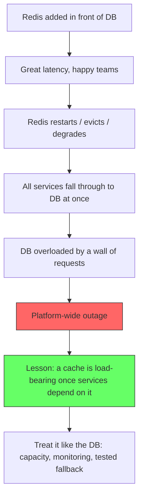
```mermaid
flowchart TD
    A["Redis added in front of DB"] --> B["Great latency, happy teams"]
    B --> C["Redis restarts / evicts / degrades"]
    C --> D["All services fall through to DB at once"]
    D --> E["DB overloaded by a wall of requests"]
    E --> F["Platform-wide outage"]
    F --> G["Lesson: a cache is load-bearing once services depend on it"]
    G --> H["Treat it like the DB: capacity, monitoring, tested fallback"]
    style F fill:#f66,stroke:#333
    style G fill:#6f6,stroke:#333
```

We should have asked the question we ask of any dependency: what happens to the system when this thing stops working? If the answer is "everything breaks at once," the component is not a cache anymore, it is the new database, and it deserves the same budget.

### The lesson

**A shared cache that every service depends on is load-bearing infrastructure, not a performance trick. Cache dependencies need capacity planning, dedicated monitoring, and a degraded path that is actually tested at storm volume.**

AWS reinforces this in its own incident retrospectives: the failure mode that takes out whole fleets is commonly a dependency that was "just a cache" but became load-bearing without anyone updating the operational budget to match. The design move is to ask early *what breaks when the cache is down* and then practice that scenario, ideally in a game day, before a real one happens for you.

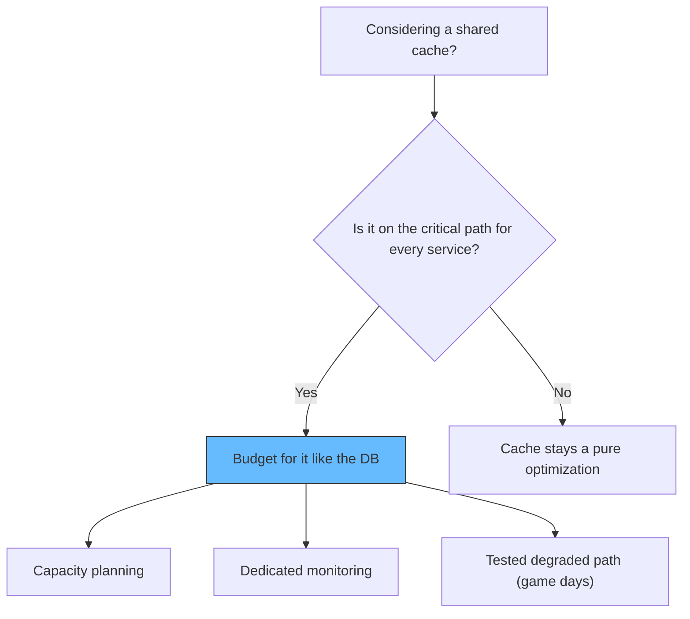
```mermaid
graph TD
    A["Considering a shared cache?"] --> B{"Is it on the critical path for every service?"}
    B -->|"Yes"| C["Budget for it like the DB"]
    B -->|"No"| D["Cache stays a pure optimization"]
    C --> E["Capacity planning"]
    C --> F["Dedicated monitoring"]
    C --> G["Tested degraded path (game days)"]
    style C fill:#6bf,stroke:#333
```

### What we would do differently

- **Scope the cache per service or per read path**, not as one fleet-wide dependency, so a hiccup in one domain does not take down the platform.
- **Make cache misses cheap by design**: if the database can handle worst-case throughput, a cache failure degrades performance gracefully instead of becoming an outage.
- **Practice the degraded path**: a game day where Redis is taken offline and the team watches the system degrade inside its budget.

## Story 3: The Temporary Feature Flag That Stayed for Two Years

### Context

During a release, a team needed to disable a newly shipped checkout step quickly in case something went wrong. They wrapped it in a feature flag labeled "temporary" in a one-liner comment, flipped it off after a brief incident, and moved on. It was the classic emergency mitigation: fast, effective, and easy to forget.

### What happened next

The flag never got removed. Two years later, no one on the team knew it existed or what behavior it controlled. When a new engineer finally found it during a cleanup, the code it guarded had grown around it: new features had quietly branched on the flag, doubling the paths through checkout. Removing it was no longer a five-minute deletion; it was a small project to untangle two parallel flows that had real users on both sides. The "temporary" escape hatch had become a permanent second architecture.

### What we realized

A mitigation that outlives the event that created it stops being a control and starts being a fork in the code. The flag did not contain complexity; it created it. This is the software version of a debt that compounds: every month it exists, more code assumes it exists, and the cost of removing it grows while the memory of why it exists fades.

It helps to think in the analogy that software architecture is like a city. You can build without a plan: a house here, a shop there, a road that seems convenient today. Individually each decision is fine, and the city works. Then a second downtown grows where no one ever planned a downtown, streets dead-end for reasons no one remembers, and the whole thing becomes hard to move through. Nothing is broken, exactly; it is simply unplanned. The city still stands, but no one can say why it looks like it does, and scaling it means untangling decisions nobody remembers making.

The same happens to a codebase one flag at a time. No single addition to the flag — no individual "just branch on it" commit — is the mistake. The mistake is that the map was never looked at. The street was laid, then more streets were laid around it, and nobody was watching the city grow. You do not get ugly, unscalable software from one bad decision; you get it from a hundred reasonable decisions with no plan holding them together. And here is the cruel part of the analogy: a city built on accident still has an architecture. It is just an architecture nobody designed, and it shows in ways that are invisible when things are working and unmistakeable six months or a year later, when the new inhabitants ask "who planned this?" and the answer is "nobody planned this; it happened."

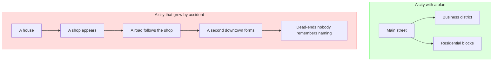
```mermaid
graph TD
    subgraph Planned["A city with a plan"]
        P1["Main street"] --> P2["Business district"]
        P1 --> P3["Residential blocks"]
    end
    subgraph Accidental["A city that grew by accident"]
        A1["A house"] --> A2["A shop appears"]
        A2 --> A3["A road follows the shop"]
        A3 --> A4["A second downtown forms"]
        A4 --> A5["Dead-ends nobody remembers naming"]
    end
    style Accidental fill:#fdd,stroke:#f66
    style Planned fill:#dfd,stroke:#6f6
```

Both cities work. Only one has an answer to "who planned this?" — and that one question is the difference between software that scales under growth and software that has to be untangled before it can.

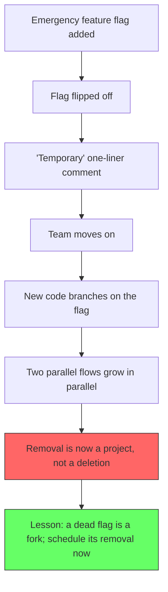
```mermaid
flowchart TD
    A["Emergency feature flag added"] --> B["Flag flipped off"]
    B --> C["'Temporary' one-liner comment"]
    C --> D["Team moves on"]
    D --> E["New code branches on the flag"]
    E --> F["Two parallel flows grow in parallel"]
    F --> G["Removal is now a project, not a deletion"]
    G --> H["Lesson: a dead flag is a fork; schedule its removal now"]
    style G fill:#f66,stroke:#333
    style H fill:#6f6,stroke:#333
```

The team that built the flag knew exactly what it controlled. The team that found it knew exactly nothing. That single fact, the decay of context, is why temporary flags die so slowly: the knowledge of what they do evaporates before the flag does.

### The lesson

**Every temporary mitigation needs an expiration date, an owner, and a ticket before the emergency ends. If it cannot be removed in the next two weeks, it is not temporary; it is a permanent decision you are choosing not to make.**

Many teams enforce this structurally instead of by discipline: a deadline attached to the flag, an alert that fires when the flag is old, a lint rule that fails on comments like "temporary." The mechanisms vary; the principle does not. Mitigate the incident, and separately, schedule the cleanup while the incident is still fresh enough to do it cheaply.

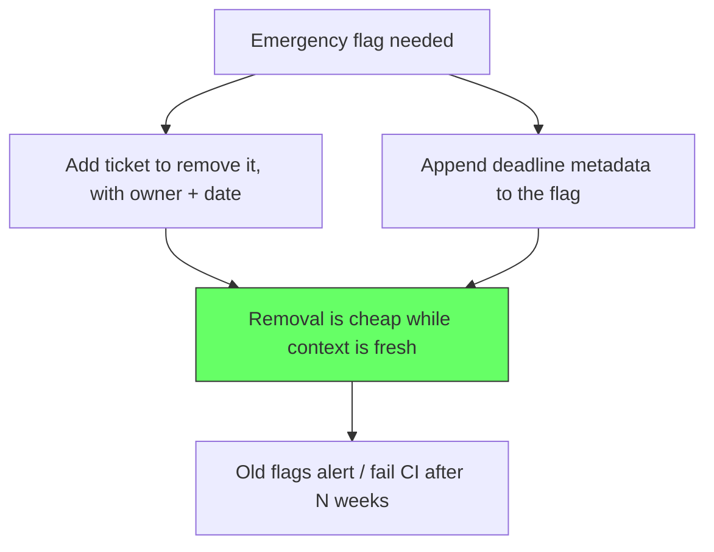
```mermaid
graph TD
    A["Emergency flag needed"] --> B["Add ticket to remove it, with owner + date"]
    A --> C["Append deadline metadata to the flag"]
    B --> D["Removal is cheap while context is fresh"]
    C --> D
    D --> E["Old flags alert / fail CI after N weeks"]
    style D fill:#6f6,stroke:#333
```

### What we would do differently

- **Create the removal ticket in the same commit that adds the flag.** If it is worth adding, it is worth scheduling the removal.
- **Attach a deadline and owner to every feature flag**, and have monitoring alert when a flag has not changed in months.
- **When a flag forks code into two paths, treat the fork as a smell** and consolidate, even if both paths work. Two working paths are double the maintenance for zero product value.

## Story 4: The Rewrite That Bought Microservices and Lost the Knowledge

### Context

A successful monolith (a billing system) was working well: fast releases, one deployable, a database the team knew inside out. Leadership decided to move to microservices, partly for scale and partly because microservices sounded like the modern architecture. The team top-to-bottom was sold on the rewrite.

### What happened next

Six services were carved out, each with its own repository, deployment, and database schema. What followed was eighteen months of infrastructure work: service discovery, distributed tracing, retries, timeouts, transactional outbox patterns, and coordinating deploys across services for changes that used to be one PR. The business features that used to ship weekly now shipped every few weeks, because a change to "billing" now meant two coordinated releases. When production misbehaved, the team could no longer attach a debugger and step through; it pieced together spans across six services.

The old monolith was deleted once the last traffic moved over. And with it went something invisible but valuable: the decade of constraints, invariants, and "weird things about this domain" encoded in one codebase the team collectively understood.

### What we realized

The rewrite did not buy what the team thought it was buying. The scaling problem that motivated it was solved by running more instances of the monolith, which they could have done without a rewrite at all. What the rewrite actually bought was independent deploys they did not need, and the cost was distributed-systems complexity they had never paid before. On top of that, the rewrite discarded the one asset the monolith held: working, tested behavior with proven boundaries embedded in years of real traffic.

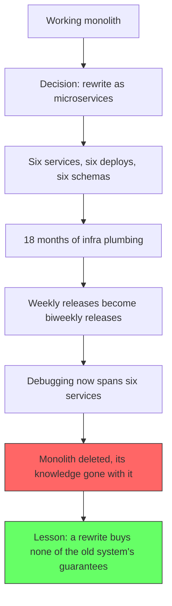
```mermaid
flowchart TD
    A["Working monolith"] --> B["Decision: rewrite as microservices"]
    B --> C["Six services, six deploys, six schemas"]
    C --> D["18 months of infra plumbing"]
    D --> E["Weekly releases become biweekly releases"]
    E --> F["Debugging now spans six services"]
    F --> G["Monolith deleted, its knowledge gone with it"]
    G --> H["Lesson: a rewrite buys none of the old system's guarantees"]
    style G fill:#f66,stroke:#333
    style H fill:#6f6,stroke:#333
```

The bitter part: the rewrite was not even a rewrite of the monolith. It was a rewrite of the monolith's *deployment*. The domain logic was mostly copied over; the architecture changed but the behavior barely did, because nobody was trying to change the behavior. That is the surest sign of an architecture-driven rewrite that was never going to pay for itself.

### The lesson

**Do not rewrite a working system to change its deployment shape. Reshape the deployment (more instances, a load balancer, a modular monolith with real boundaries) and keep the working behavior. A rewrite only makes sense when the behavior itself has to change, and even then, it should be incremental, not a forklift.**

Martin Fowler's Monolith First essay warns that most systems "acquire too many dependencies between their modules and thus can't be sensibly broken apart." The honest version of that lesson is the inverse: a working system has already told you where its real seams are, through years of successful operation. Rewriting across a diagram is how you ignore that evidence and pay dearly to learn the seams are where they always were. The modular monolith path, again, is the responsible middle: keep the codebase, carve real module boundaries, and extract only when a concrete operational reason exists.

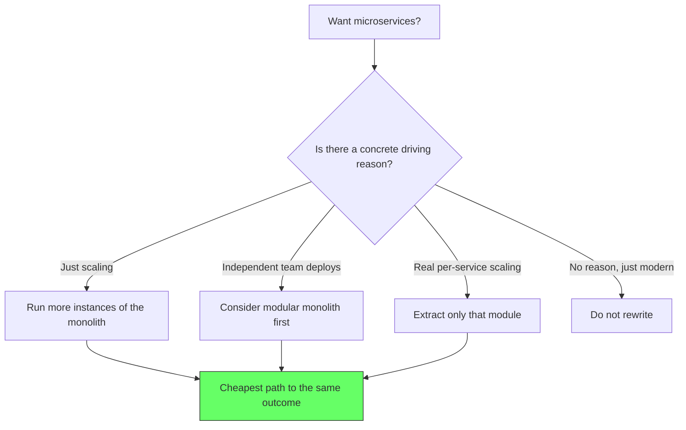
```mermaid
graph TD
    A["Want microservices?"] --> B{"Is there a concrete driving reason?"}
    B -->|"Just scaling"| C["Run more instances of the monolith"]
    B -->|"Independent team deploys"| D["Consider modular monolith first"]
    B -->|"Real per-service scaling"| E["Extract only that module"]
    B -->|"No reason, just modern"| F["Do not rewrite"]
    C --> G["Cheapest path to the same outcome"]
    D --> G
    E --> G
    style G fill:#6f6,stroke:#333
```

### What we would do differently

- **Start with the cheapest thing that solves the actual problem**: more instances, a load balancer, better caching.
- **If boundaries are the goal, carve them inside the existing monolith** and measure whether the change path really improves before extracting anything.
- **Never delete a working system before its knowledge transfer is explicit**: encode the invariants, the tests, and the "weird domain things" in documentation that survives the migration.

## Story 5: The Feature That Went Live and Broke the Cache

### Context

A team shipped a new feature that made a popular endpoint much hotter overnight. The endpoint was cache-backed: a hot key in Redis held the response, refreshed every hour. The feature was a success, traffic rose, and everything seemed fine for a day.

### What happened next

Then a developer noticed something strange in the metrics: **ports were being exhausted.** Outbound connections from the application spiked, the connection pool saturated, and requests that used to take 50ms were timing out. The initial instinct was a network problem: too many sockets, too many connections, maybe a firewall. The team's first response was to raise limits and add more connections, which bought them minutes at best before the same wall of errors returned.

The real cause was invisible to the "ports exhausted" symptom. The new feature's traffic was all hitting the same hot key, and that key had a TTL with no jitter. When the key expired, hundreds of concurrent requests all observed the miss at the same instant, and each one independently called the database to rebuild the value. The database was hammered with identical queries, the connection pool filled with recomputations, and the burst opened more outbound sockets than the ephemeral port range allowed. When the key was finally rebuilt, the system recovered, only to repeat the whole cycle at the next expiration.

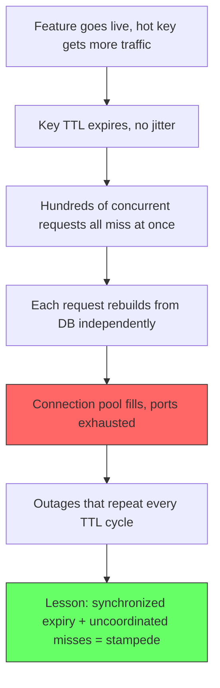
```mermaid
flowchart TD
    A["Feature goes live, hot key gets more traffic"] --> B["Key TTL expires, no jitter"]
    B --> C["Hundreds of concurrent requests all miss at once"]
    C --> D["Each request rebuilds from DB independently"]
    D --> E["Connection pool fills, ports exhausted"]
    E --> F["Outages that repeat every TTL cycle"]
    F --> G["Lesson: synchronized expiry + uncoordinated misses = stampede"]
    style E fill:#f66,stroke:#333
    style G fill:#6f6,stroke:#333
```

This is the cache stampede (also called the thundering herd problem). Redis's own writeup of it is precise: "If thousands of users were relying on that cached data, they would all fall back to fetching from the database, effectively overloading the database with simultaneous queries." The cache was alive and healthy; the *policy* around it was the problem. A single hot key expiration turned one database query into five hundred identical ones.

### What we realized

The symptom pointed one way, and the cause was entirely elsewhere. "Ports exhausted" was the smoke; synchronized cache expiration was the fire. Raising connection limits only made the stampede more thorough, because every extra socket let another redundant recomputation reach the database. The system needed the *number of rebuilds* reduced to one, not more capacity for redundant ones.

The controls for this are well documented. **TTL jitter** staggers expirations so keys do not vanish together. **Single-flight / request coalescing** (a mutex or "one loader, many waiters") ensures only one request rebuilds a key while the rest wait for its result. **Stale-while-revalidate** serves the slightly stale value immediately while a background task refreshes it. Redis's guidance is blunt: "The solution isn't just adding more servers. It's designing at the architectural level to stagger requests, coordinate cache refreshes, and distribute load."

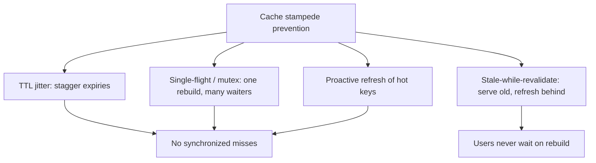
```mermaid
graph TD
    A["Cache stampede prevention"] --> B["TTL jitter: stagger expiries"]
    A --> C["Single-flight / mutex: one rebuild, many waiters"]
    A --> D["Stale-while-revalidate: serve old, refresh behind"]
    A --> E["Proactive refresh of hot keys"]
    B --> F["No synchronized misses"]
    C --> F
    D --> G["Users never wait on rebuild"]
    E --> F
```

### The lesson

**A cache is only as safe as its refresh policy. If hot keys expire in sync and nothing coordinates who rebuilds on a miss, one expiration becomes a stampede that exhausts connections, ports, and the database at once. Jitter the TTL, coalesce the miss, and serve stale data while refreshing.**

And the symptom-reading lesson is just as valuable: when the incident looks like a resource problem (ports, connections, sockets), check whether the resource is the *cause* or the *victim* of the request pattern. A stampede consumes every resource in its path, and treating the symptom as the cause is how you spend an hour raising limits on the wrong thing.

### What we would do differently

- **Add TTL jitter to every cache key** as a baseline, especially batch-warmed or hot keys, so expirations spread instead of concentrating.
- **Coordinate cache misses on hot keys**: single-flight with a distributed lock (token-safe release), so one request rebuilds and the rest wait.
- **Serve stale-while-revalidate** for user-facing reads where a few hundred milliseconds of staleness is invisible, eliminating the wait entirely.
- **Watch cache miss rate and database connection count together**: when they spike at the same moment, you are looking at a stampede, not a network fault.

## Story 6: The Data That Belonged Together, Split Apart for No Reason

### Context

A team moved from a monolith to services. One screen showed order details alongside the customer's name and the product names, all read together. In the monolith this was one query, one round trip, one join. In the new architecture, the team dutifully split it: the frontend (or an aggregation service) called the orders service, then called the customer service, then called the catalog service, and stitched the results together.

### What happened next

The feature worked, and its latency quietly tripled. Each hop added a network round trip: orders, then customer, then catalog, then the assembly. Every extra hop added serialization, deserialization, a retry budget, a timeout, and a failure mode. The page that used to answer in 30ms now took 150ms because the data was spread across three machines that had never needed to be three machines.

Worse, the failure surface multiplied. When the catalog service had a brief blip, the whole page failed, even though catalog was only supplying a display name. A join that the database could have resolved in a few milliseconds became three network calls, each with its own latency, its own retry, and its own way to fail the user.

### What we realized

The decision to split was made on the basis of *service ownership*, not on the basis of *how the data was used*. These three pieces of data changed together, were read together, and belonged to the same read model for that screen. The architecture divided them across the network because it was tidy to do so, and the network made the user pay for that tidiness on every single request.

The unit of "belongs together" is not the service boundary. It is the read pattern: data read together, and changing together, should live where one query can get it. This is the latency version of Story 1: just as a module should not be glued to a context it does not depend on, data should not be split across the network unless something real requires the split.

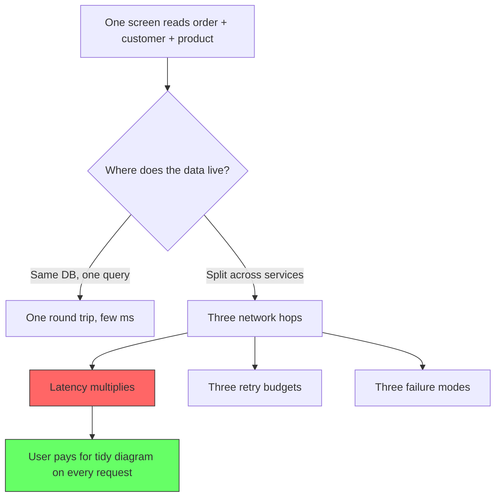
```mermaid
flowchart TD
    A["One screen reads order + customer + product"] --> B{"Where does the data live?"}
    B -->|"Same DB, one query"| C["One round trip, few ms"]
    B -->|"Split across services"| D["Three network hops"]
    D --> E["Latency multiplies"]
    D --> F["Three retry budgets"]
    D --> G["Three failure modes"]
    E --> H["User pays for tidy diagram on every request"]
    style E fill:#f66,stroke:#333
    style H fill:#6f6,stroke:#333
```

Martin Fowler's guidance on extracting data-rich services names the trap directly: splitting the logic without splitting the data creates an integration database that "gives the semblance of a distributed system that can evolve independently but in fact is a single tightly coupled system at the database level." Here the split went further: the data was physically separated, so the cost was paid in latency instead of coupling.

### The lesson

**Data that is read together and changes together should live where one query can get it. Splitting it across network calls multiplies latency, retry budgets, and failure modes, and the user pays that cost on every request. Split data across machines only when something real requires it (independent scaling, independent teams, real isolation), not because the diagram is tidier.**

The counter-rule also matters: if the data genuinely must live apart, build a read model or a denormalized projection so the hot read path still gets its data in one place, instead of making the request path crawl across services.

### What we would do differently

- **Before splitting data across services, ask what reads it serves and how often.** If one screen reads it together, that is a strong signal it belongs together.
- **Keep related data in one queryable place** (same database, same module), and split only when a concrete driver requires it.
- **If the data must live apart, publish a read model** the hot path can fetch in one call, so the user never experiences the distributed join.
- **Measure the latency budget before and after a split**: a service split that adds 100ms to a critical read is a regression, no matter how clean the architecture looks.

## Story 7: The Dogma That Slowed Everyone Down

### Context

A team adopted a rule with total conviction: "we never use SQL joins across services." The reasoning had a legitimate ancestor somewhere (a past incident where a cross-service join caused a coupling problem), but over time the rule detached from its reason. It became a style-guide commandment, repeated in every design review without anyone remembering the original justification.

### What happened next

Every feature had to obey the rule even when it made no sense. A simple report that needed data from two places could not just query both: it had to be funneled through events, read models, and an outbox, each adding complexity, delay, and failure modes. Features that should have taken a week took three. When someone asked why, the answer was "that's how we do it here," which is dogma speaking, not engineering.

The breaking point came when a team spent two weeks building an event-driven pipeline to deliver what was, functionally, a join that the database could have done in one query. The pipeline worked, but it was slower, more complex, and harder to debug than the thing it was avoiding.

### What we realized

The rule had become a religion. It was not anchored to a problem; it was anchored to the fact that it was once a reasonable answer to a different problem. Every engineering rule is a compressed answer to a past situation, and the moment it detaches from the situation it was answering, it starts producing harm: complexity where none was needed, and teams optimizing for the rule instead of the product.

What makes this spread beyond a single team is the why-vacuum: **devs do not understand the reasoning behind a rule, so they apply the rule everywhere.** A rule carries its *why* in the head of the person who created it. The next person copies the rule, but not the reasoning, and then copies it again, and each copy loses a little more context. After a few copies, every trace of the original problem is gone, and the rule is just a gesture, honored for its shape and not its content. This is dogma's engine: not malice, not laziness, but a pure transmission of the answer with the question forgotten.

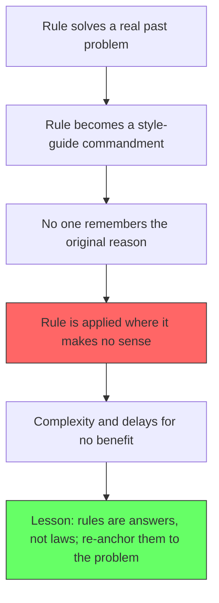
```mermaid
flowchart TD
    A["Rule solves a real past problem"] --> B["Rule becomes a style-guide commandment"]
    B --> C["No one remembers the original reason"]
    C --> D["Rule is applied where it makes no sense"]
    D --> E["Complexity and delays for no benefit"]
    E --> F["Lesson: rules are answers, not laws; re-anchor them to the problem"]
    style D fill:#f66,stroke:#333
    style F fill:#6f6,stroke:#333
```

The clearest case of this in recent memory is microservices. For years, "everything must be microservices" was repeated with the certainty of a religious doctrine, and the why was lost almost immediately: it was meant to solve a specific problem, decoupled teams shipping independently, and it only pays off when you have stable boundaries you actually own. Instead, the industry applied it everywhere, to every codebase, including systems that needed nothing of the sort. A wave of teams burned months on service discovery, distributed tracing, and coordinated deploys to solve problems they never had.

And notice the punchline: **the industry kept working.** The microservices fad peaked and receded, teams folded services back into monoliths and modular monoliths, and no business collapsed because they picked the "wrong" architecture. That is the surest tell that it was dogma: the adoption was driven by conformity, not by a problem. If a single widely-mandated architecture were *required*, its removal would have broken everything, and it broke nothing. Real decisions have real consequences; dogmatic ones entertain the industry and leave it standing. Today companies still use microservices, and that is fine, but the hope is they now choose it for the right reasons: stable boundaries, independent scaling, independent teams, not because "that is how we do it here."

The healthy version of any rule is to ask: what problem is this preventing, and is that problem present here? If the answer is "no," the rule does not apply. This is the same discipline as the article's opening story: boundaries and rules are justified by the problem they solve, not by their existence.

### The lesson

**Dogma is a rule that has detached from the problem it answered. Every engineering rule is a compressed answer to a past situation; before applying it, ask whether the situation exists here. Rules justify themselves by the harm they prevent, not by their age or how often they are quoted.**

The engine of dogma is the why-vacuum: **people copy the rule without the reasoning**, and each copy loses context until the rule is applied everywhere. The microservices wave showed the cost at industry scale -- adopted by conformity, not by a problem, and the industry kept working precisely because it was never required. The tell of dogma is not how loudly the rule is repeated; it is whether removing it breaks something real. Supervision suggests teams adopt trends for the problem they solve, not the trend itself.

The corollary for leaders: when you inherit a rule, learn its origin. A team that cannot say why a rule exists will eventually apply it to a problem it makes worse, and will call that discipline.

### What we would do differently

- **Require every architectural rule to carry its why** in the docs that state it, so future teams can test whether the situation still applies.
- **Ask "what problem is this preventing?" in every design review** before accepting a rule-based answer.
- **Encourage explicit exceptions**: a team that can name the situation that justifies bypassing a rule is doing engineering, not rebellion.

## Story 8: The Database That Was Right for the Demo and Wrong for Production

### Context

A team chose a document database (like MongoDB) for a new service because it was fast to prototype, schemaless, and trendy. The service handled orders, which have relationships: an order has items, a customer, discounts, and a history of states. In the demo, the schemaless store was a joy.

### What happened next

Production traffic arrived, and the friction started. The service needed to report on orders by customer, by date range, by status, and across relationships. In a document database these queries meant denormalization, duplicated data, and application-side joins that were slow and easy to get wrong. What a relational store would have done with a few indexed joins became a dance of secondary collections and consistency care. The team spent more engineering time on data modeling workarounds than the database was saving them.

Worse, the pain grew with the feature set. Every new relationship (discounts across products, bundles, returns) required another denormalization decision, another chance for the copies to drift, and another cleanup job. The database had been chosen for developer velocity at prototype size, and that choice was now costing velocity at production size.

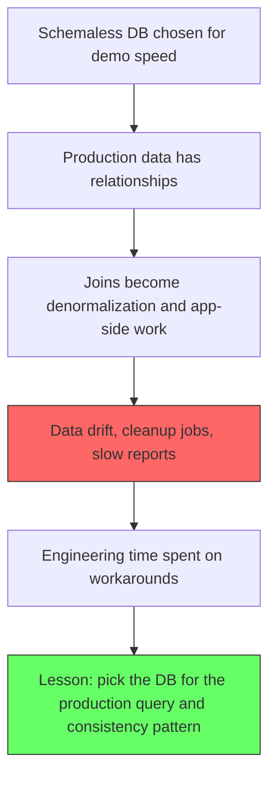
```mermaid
flowchart TD
    A["Schemaless DB chosen for demo speed"] --> B["Production data has relationships"]
    B --> C["Joins become denormalization and app-side work"]
    C --> D["Data drift, cleanup jobs, slow reports"]
    D --> E["Engineering time spent on workarounds"]
    E --> F["Lesson: pick the DB for the production query and consistency pattern"]
    style D fill:#f66,stroke:#333
    style F fill:#6f6,stroke:#333
```

### What we realized

The database was chosen for the wrong dimension. It was chosen for how easy it made *writing* data in a demo, but the real workload was about *reading* data with relationships and reporting across them. Those two shapes want very different engines. A document store shines when each record is an island (user profiles, catalogs, documents); it fights you when records are related and you must aggregate across them.

### The lesson

**Choose a database for the production query and consistency pattern, not the demo ergonomics. If your data has relationships you must join and aggregate across, a relational store is usually the honest choice. Schemaless writes are a convenience you pay for later if the reads are relational.**

The database is also the hardest component to change: migrating data between stores is a project, not a refactor. Spending a few days deciding on the right engine up front is cheap compared to a migration that takes months under load.

### What we would do differently

- **List the top read and reporting queries first**, then evaluate databases against those, not against how fast a demo can be written.
- **Ask about relationships explicitly**: will you join, aggregate, and report across records? If yes, make the store earn the schemaless freedom against that cost.
- **Prototype against production-shaped data and production-shaped queries**, because that is where the choice is actually tested.

## Story 9: The Stateful App That Could Not Scale Out

### Context

An application stored its session and a few critical flags in memory on each instance. A user's session, a lock, and some counters lived in a process-local map. This worked perfectly for years while the app ran on one instance.

### What happened next

The team needed to scale out to several instances. That is when the design broke. A user's second request landed on a different instance, which had no memory of their session, so they were logged out mid-flow. Counters reset per instance, so accounting was wrong depending on which box served the request. Locks that lived in memory only guarded the instance that held them, so two instances happily raced on the same resource. The team's answer was sticky sessions, which pinned a user to one instance, which defeated the whole point of scaling out and created load-balancer headaches.

Every instance was now a snowflake holding a piece of the world's state, and the system could not grow without tripping over its own memory. Deploys were terrifying: restarting an instance lost all its state, so a routine deploy logged users out and reset locks.

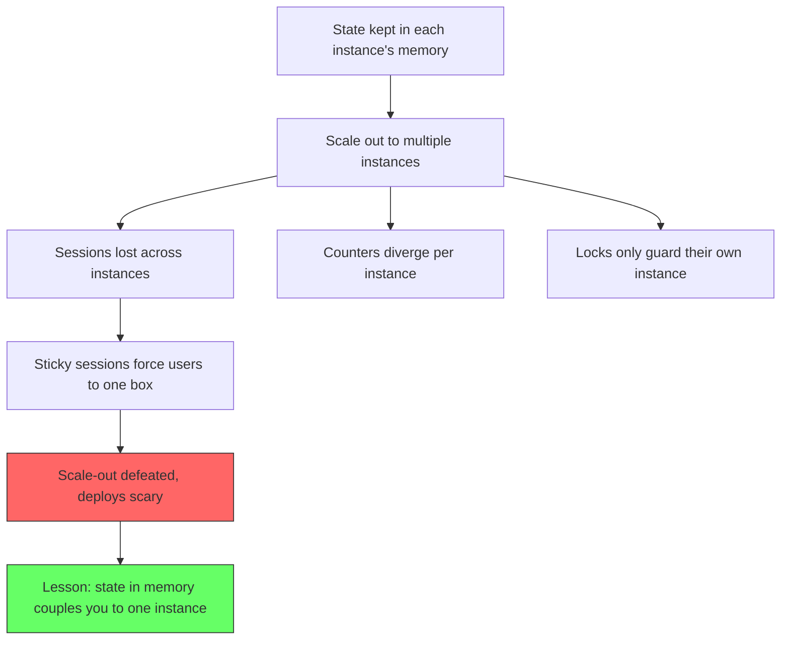
```mermaid
flowchart TD
    A["State kept in each instance's memory"] --> B["Scale out to multiple instances"]
    B --> C["Sessions lost across instances"]
    B --> D["Counters diverge per instance"]
    B --> E["Locks only guard their own instance"]
    C --> F["Sticky sessions force users to one box"]
    F --> G["Scale-out defeated, deploys scary"]
    G --> H["Lesson: state in memory couples you to one instance"]
    style G fill:#f66,stroke:#333
    style H fill:#6f6,stroke:#333
```

### What we realized

The state was not evil; it was in the wrong place. Every piece of state that lives in an instance's memory is a constraint that ties the world to that instance. Moving the state out, to a database, a cache, or a message store, turned every instance into an interchangeable worker that could serve any request, crash safely, and restart cleanly. The twelve-factor rule for stateless processes names it directly: "Any process can start or stop at any time; the process must be able to restart and resume its work."

### The lesson

**State in memory couples your application to a single instance. Every piece of state that lives in a process must either be externalized (to a store that survives the process) or be an acknowledged constraint. Stateless processes can scale, deploy, and crash freely; stateful ones cannot.**

### What we would do differently

- **Put sessions and shared flags in an external store** (Redis, the database) from the start, not in process memory.
- **Treat every in-memory variable as a candidate for externalization** during design review: if losing it on restart breaks a user, it should not live in the process.
- **Test scaling out early**: before the first production scale-out, run two instances and confirm a user's requests work across both.

## Story 10: The Stateless Service That Scaled Like It Was Nothing

### Context

A different service was designed stateless from day one: no sessions in memory, no local state, every request self-contained, and any shared data read from a store. The team chose this deliberately, partly out of habit and partly because the previous story's app had shown them the cost of doing otherwise.

### What happened next

A traffic spike hit, and the service scaled out cleanly. More instances came up, each identical, each able to serve any request. Requests balanced freely across them with no sticky sessions, no cross-instance races, and no "which box has the session" logic. A deploy was just starting new instances and draining old ones: no state to protect, no users to keep pinned, nothing to coordinate. When an instance died under load, nothing noticed except a small dip, because every other instance could do the dead one's job instantly.

The team had spent a little extra effort upfront to externalize state, and it paid off every day afterward: trivial scaling, boring deploys, and zero cross-instance bugs. Statelessness had turned the operational risk of the whole fleet into a non-event.

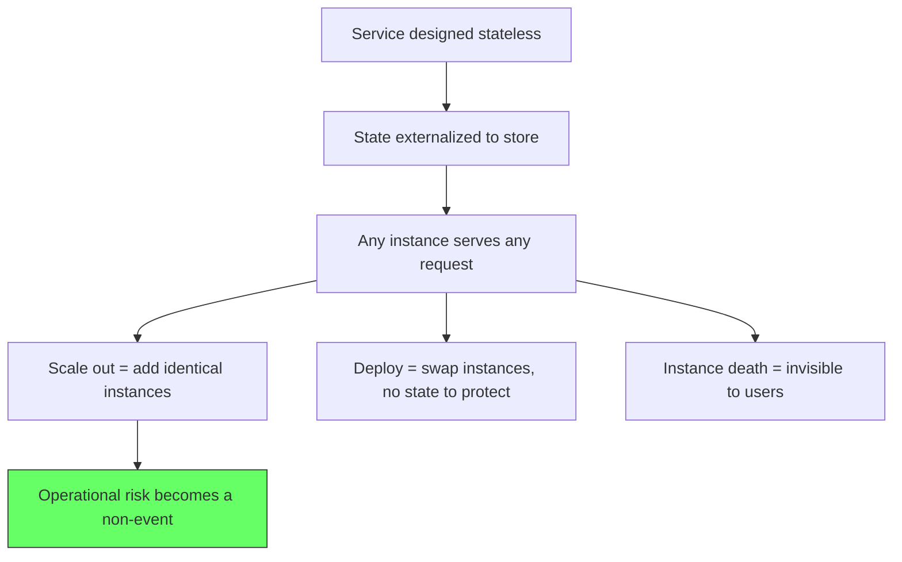
```mermaid
flowchart TD
    A["Service designed stateless"] --> B["State externalized to store"]
    B --> C["Any instance serves any request"]
    C --> D["Scale out = add identical instances"]
    C --> E["Deploy = swap instances, no state to protect"]
    C --> F["Instance death = invisible to users"]
    D --> G["Operational risk becomes a non-event"]
    style G fill:#6f6,stroke:#333
```

### What we realized

The difference between the stateful and the stateless service was not skill or luck; it was a decision made in the first two weeks. The stateless service treated every instance as disposable, which is exactly how the platform wanted to treat them. The stateful service treated every instance as precious, and the platform kept proving it wrong. The lesson from Story 9 and the benefit here are the same coin: state is the constraint, and removing it from the process removes the constraint.

### The lesson

**Statelessness is the highest-leverage design decision for operational freedom. An instance that carries no state can be created, destroyed, and replaced without ceremony, which turns scaling, deploys, and failures into non-events. Pay the small upfront cost to externalize state, and collect the benefit on every scale-out and every deploy.**

### What we would do differently

- **Design every new service to be stateless by default**, externalizing sessions, flags, and shared counters, and treat in-process state as a documented exception.
- **Confirm the property in the pipeline**: a test that restarts an instance mid-traffic and checks users are unaffected is a cheap way to keep the design honest.
- **Reuse the pattern**: after seeing the stateful and stateless versions of the same problem, the team now asks "where does the state live?" in every design review, before the code is written.

## Story 11: The Mentor Who Multiplied the Team

### Context

A senior engineer was the only person who understood a critical, gnarly service. Every question about it came to them, every incident was resolved by them, and they were the busiest person on the team. It felt heroic, and it was also a trap: the service's knowledge lived in one head, and the team could not move without it.

### What happened next

The senior engineer started doing the obvious but unglamorous thing: mentoring. They paired with the most junior engineer on every question instead of answering it directly, wrote down the service's mental model, reviewed the junior's early fixes line by line, and explained the *why* behind each decision rather than just the what. Progress was slow at first, because teaching takes longer than doing.

Then the payoff compounded. The junior engineer stopped needing to ask; they started answering questions for others. The service's knowledge spread across two heads, then four. When the senior engineer took a vacation, nothing caught fire, because the knowledge was no longer singular. The team got faster, the senior engineer's calendar freed up, and the critical service stopped being a dependency on one person.

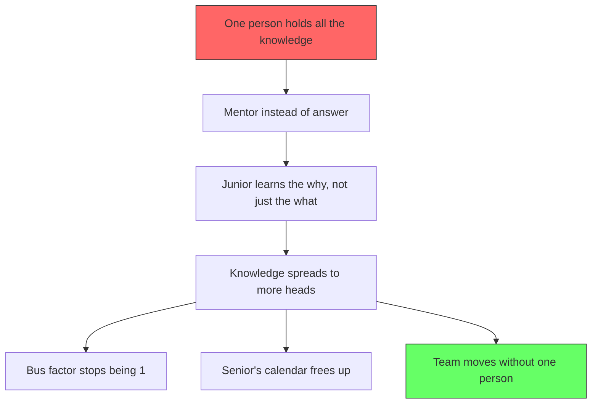
```mermaid
flowchart TD
    A["One person holds all the knowledge"] --> B["Mentor instead of answer"]
    B --> C["Junior learns the why, not just the what"]
    C --> D["Knowledge spreads to more heads"]
    D --> E["Bus factor stops being 1"]
    D --> F["Senior's calendar frees up"]
    D --> G["Team moves without one person"]
    style A fill:#f66,stroke:#333
    style G fill:#6f6,stroke:#333
```

### What we realized

Mentoring is not charity or a nice-to-have; it is the difference between a knowledge bottleneck and a self-healing team. Doing the work yourself is fast once and slow forever; teaching it is slow once and fast forever. The senior engineer was the bottleneck precisely because answering was faster than teaching, and the team had optimized for the fast option every day until the cost was obvious.

### The lesson

**The busiest expert is a single point of failure. Mentoring is how you divide knowledge the way you divide services: the goal is not for you to answer every question, it is for no question to need you. Teach the why, write down the mental model, and let the knowledge spread until the team outgrows the dependency on one person.**

The reward is not just resilience. A team whose members can explain the system to each other moves faster, because questions get answered where they are asked instead of traveling to the single expert.

### What we would do differently

- **Pair instead of answer**: when someone asks about a critical system, go through the reasoning with them rather than handing over the answer.
- **Write down the mental model** of critical services, so knowledge survives both vacations and attrition.
- **Measure the bus factor honestly**: if a service breaks when one person is out, that is a structural defect, not a staffing fact, and mentoring is the fix.

## Story 12: The Speed of Skipping the Plan That Cost a Year

### Context

A startup team was shipping fast and proud of it. They believed planning was bureaucracy. Every time someone proposed a design session, a data model, or a boundary decision, the answer was "just build it, we need speed." The feature backlog moved quickly, and for the first six months, the belief looked correct: velocity was high, and the codebase was still small enough that no one needed a map.

### What happened next

The codebase grew, and the cost of never planning arrived in an accelerating cascade. Features that were independent on the roadmap were tangled in the code because no one had drawn the lines between them. A simple change to one feature required tracing through a web of modules with no ownership boundaries. Each new feature added complexity to the shared mess instead of standing on a clean seam, so the cost of each feature went up while the speed of shipping it went down.

Then came the reversal nobody saw coming: the team started moving *slower* than they would have if they had paused to plan. Two weeks of design could have saved them from two months of untangling, and the untangling arrived exactly when the business needed speed the most, on the critical path to a big launch. The team that had optimized away planning spent the next year paying interest on the decision, in refactors, in bugs, in onboarding, and in features that took three times as long to land.

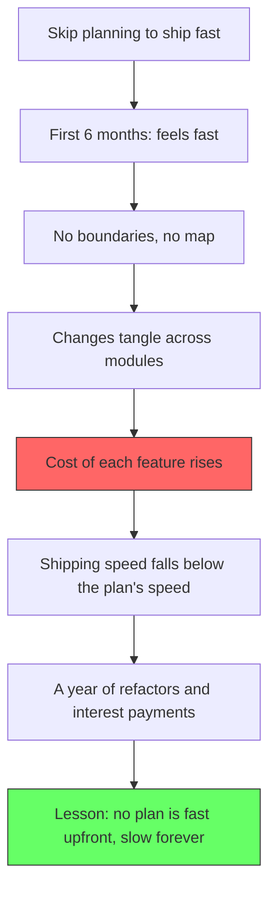
```mermaid
flowchart TD
    A["Skip planning to ship fast"] --> B["First 6 months: feels fast"]
    B --> C["No boundaries, no map"]
    C --> D["Changes tangle across modules"]
    D --> E["Cost of each feature rises"]
    E --> F["Shipping speed falls below the plan's speed"]
    F --> G["A year of refactors and interest payments"]
    G --> H["Lesson: no plan is fast upfront, slow forever"]
    style E fill:#f66,stroke:#333
    style H fill:#6f6,stroke:#333
```

### What we realized

The trade was not speed versus planning. It was speed *now* versus speed *forever*. Planning is not a delay inserted between you and shipping; it is an investment in the rate at which you ship later. The team had believed the two were in opposition, when in reality planning was the only thing that kept the long-run shipping rate from collapsing.

This is the city analogy from Story 3 made literal: a city built without a plan works for a while, then stops working, and by then the unplanned streets are too tangled to re-plan cheaply. Software has the same property, and the difference is that software teams can pretend it is not happening for much longer, because the codebase does not look broken, it just gets slower.

The planning that pays off is not heavy ceremony. It is the minimum that keeps seams honest: knowing where the boundaries are, who owns which data, and what depends on what. That is the same set of decisions this whole article keeps circling, because every expensive story in it is a planning decision made too late.

### The lesson

**Skipping architecture planning does not speed you up; it shifts the speed from now to later, with interest. The first six months feel fast precisely because the codebase is still small enough to survive without a map. The rate at which you ship is set by the seams you draw, and you pay for absent seams in every feature after the first few.**

The healthy version is not planning for its own sake. It is the smallest investment that keeps the map honest: boundaries, data ownership, and dependency decisions, made before the tangle makes them expensive. That is why this article keeps returning to the same seam: the expensive stories are the planning decisions made too late.

### What we would do differently

- **Spend the planning minutes up front**: a design session before a feature is cheaper than an untangle after it, by an order of magnitude.
- **Draw the boundaries as the code is written**, not as a document: the module boundary, the data owner, the dependency direction, so the seam exists before the tangle does.
- **Track the trend, not the point**: when the cost per feature starts rising, that is the signal that the no-plan approach has stopped paying, and it arrives long before the project is visibly broken.
- **Reject "planning is slow" as a complete argument**: the honest question is whether the plan buys back more shipping speed than it costs, and for anything that lives more than a few months, it usually does.

## Story 13: The Problem-Focused Team (and Why DDD Is Hard to Sell)

### Context

A team was asked to build a workflow: a customer places an order, it must be reserved against stock, and payment must clear before anything ships. The team split naturally into two instincts. The problem-focused instinct asked: what rules does this workflow obey, what can and cannot happen, and who owns each decision? The tech-focused instinct asked: what tables do we need, what endpoints, what services, what queue.

In the end, the tech questions won the room, because they are easier to draw. The team produced a schema, an API contract, and a service map. The workflow itself, the part that actually made the business money, was represented as whatever leftover logic fit between the tables.

### What happened next

The bugs arrived exactly where the diagram was quietest. An order could be reserved against stock that had just been sold, because the rule "reserve and then ship only after payment" lived nowhere the code consulted. A payment could be retried and doubled because the tech design had two services writing to the same row with no rule saying "an order is paid once." The team had built the infrastructure of the solution and forgotten the problem it was a solution to.

Each fix was a patch bolted onto the tech-first structure: a new constraint here, a state check there, a cron job to clean up the mess. The workflow rules, which should have been the primary structure of the system, were scattered across the patches. The system worked after enough patches, but it was now a museum of the problem it never directly modeled.

```mermaid
flowchart TD
    A["Tech-first design"] --> B["Schema + APIs + services drawn first"]
    B --> C["Business rules become leftover glue"]
    C --> D["Rules scattered as patches"]
    D --> E["Every fix is bolted onto tech structure"]
    E --> F["System works, but models no problem"]
    F --> G["Lesson: draw the problem (rules), then the tech"]
    style D fill:#f66,stroke:#333
    style G fill:#6f6,stroke:#333
```

### What we realized

The team had not skipped design; they had designed the wrong layer. The database, the endpoints, and the services are the *answers*; the business rules are the *problem*. Draw the problem first and the answers fall out with a direction. Draw the answers first and the problem has to be retrofit into them, which is what this team spent the following weeks doing.

This is what Domain-Driven Design is, at its core: a plea to start from the problem and let the technology follow the boundaries that the problem reveals. DDD was never about repositories, entities, and aggregates as a technology fashion. Those are just the vocabulary for keeping the problem in charge. The message has not fully landed in the industry, probably because the technology artifacts of DDD (the entities, the patterns) are easier to copy than the habit of starting from the problem. Teams adopt DDD's shapes without adopting its posture, and get the ceremony without the clarity.

The knowledge base's own article on this makes the same point: "Most teams begin system design by drawing tables... The ERD shows storage, not behavior. The business rule 'a course cannot exceed its capacity' is not a column type or a foreign key. It is a constraint on a workflow." Technology-first design, the article notes, "start[s] with the database schema, design[s] API endpoints around CRUD operations, and treat[s] business logic as a thin layer on top."

### The lesson

**Technology is the answer; the problem is the question. Teams that draw the schema, the endpoints, and the services first are designing the shape of the solution in a vacuum, and the business rules that should structure the system end up as scattered patches. DDD is, fundamentally, the insistence on drawing the problem first — and its message has not fully landed because its technology artifacts are easier to copy than its posture.**

### What we would do differently

- **Start the design session with the rules, not the tables**: list what can and cannot happen in the workflow, who decides, and where each decision lives, before any schema is drawn.
- **Treat the tech shape (schema, services, APIs) as the *output* of the problem shape**, not the starting point. The boundaries of the problem suggest the boundaries of the modules.
- **If adopting DDD, adopt its posture, not just its vocabulary**: the point is keeping the problem in charge, and entities and aggregates are only scaffolding for that. The knowledge base's DDD articles (Why DDD Starts from the Business, Not the Database; Bounded Contexts) are the fuller statement of this idea.

## Story 14: The Order That Half-Succeeded

### Context

A checkout flow was one business capability: the customer places an order, the stock is deducted, the card is charged, all as one operation. In a monolith that was one database transaction, atomic by construction. Then that single capability was broken into three parts: an order service, an inventory service, and a payment service, each with its own database.

Make no mistake about this split: it was never earned. These three pieces are called together, they scale together, and they are one workflow. There was no independent team behind them, no independent scaling need, no separate deploy cadence. The split happened because the diagram looked cleaner that way. And the moment the data lived in three databases, atomicity died with it, whether anyone noticed or not.

### What happened next

The order was created. The stock was deducted. Then the payment refused the card. In a monolith this would have been one rollback. Here the payment service returned an error, and the inventory service had already committed, and nothing told the inventory service to give the stock back. "Committed" is permanent; it is not remembered. Stock was now reserved for an order that would never ship, and the next customer who wanted the same product was told it was out of stock.

```mermaid
flowchart TD
    A["Order created<br/>COMMITS"] --> B["Stock deducted<br/>COMMITS"]
    B --> C["Payment fails"]
    C --> D["Stock stays deducted forever"]
    C --> E["Order is dead, nobody told inventory"]
    D --> F["Atomicity was a property of one database;<br/>three databases have none"]
    style D fill:#f66,stroke:#333
    style F fill:#6f6,stroke:#333
```

The naive fix is a distributed transaction (two-phase commit, 2PC) that tries to make all three databases commit together. It works in demos and fights in production: locks held across services, participants blocking on each other, and every service coupled to a coordinator it cannot live without. In a microservices architecture it is generally a bad idea, because it is synchronous communication that couples the services and hurts availability.

### What we realized

The failure was not a bug. It was the bill for the split, arriving at runtime. Atomicity is not a property of three databases talking to each other; it is a property of one database. The moment the data is in three places, nothing rolls anything back for you. Consistency becomes something you have to build by hand.

A saga is that machine. You take the business operation and cut it into steps, each step committing inside its own service, and every step that can be followed by a failure gets an explicit undo called a compensating transaction. When the payment fails, the saga does exactly what you would hope somebody would do: it runs a compensation that increases the stock back by the amount it was decreased, then marks the order as rejected. It is not magic and it is not automatic. It is ordinary business code you have to design, write, and test, because the database will not do it for you.

```mermaid
graph TD
    A["Step 1: create order<br/>(undo: reject order)"] --> B["Step 2: deduct stock<br/>(undo: restore stock)"]
    B --> C["Step 3: charge payment<br/>FAILS"]
    C --> D["Compensation runs: restore stock"]
    C --> E["Compensation runs: reject order"]
    D --> F["System returns to a consistent state"]
    E --> F
    style C fill:#f66,stroke:#333
    style F fill:#6f6,stroke:#333
```

Two warnings, because every team learns them the hard way. First, a saga replaces automatic rollback with manual undo, so a step with no compensation is a step you can never recover from; every reversible step needs its undo defined before it ships. Second, the undo itself must be reliable: the service that runs it needs the event to survive a crash (usually a transactional outbox), and the compensation has to be idempotent, so if it runs twice, the stock is not restored twice.

### The lesson

**Splitting a business capability across services gives up the atomicity the monolith gave you for free, and nothing restores it by accident. If the pieces are one workflow that is called together and scaled together, the honest move is not to split them at all. But if the data already lives apart, for any reason, consistency stops being a database feature and becomes a program you write: a saga of local steps, each reversible by an explicit compensating transaction. The checkout in this story should probably never have been a saga. It should never have been split.**

### What we would do differently

- **Ask whether the operation is one capability before drawing three boxes around it**: called together, scaled together, owned together, and it is one thing, and splitting it is how you buy the exact problem in this story.
- **If a split is real (an independent team, an independent scale, an independent cadence), design the saga up front**, and write the compensation for every step that can fail in the same review that approves the split.
- **Never rely on the happy path**: the test that matters is the one where the payment fails at step three and the stock comes back.

## Story 15: The One Slow Service That Took Everything Down

### Context

An API gateway, or an aggregator, called six backend services to serve each user request. One of them, catalog, was healthy most of the time and one afternoon it was not: not down, just slow. Its latency jumped from 30 milliseconds to five seconds, which is the most dangerous kind of failure, because nothing crashed and nothing errored, every call just took a long time and then came back wrong or late.

### What happened next

The team watched the cascade happen in slow motion in the dashboards. Every request that needed catalog now occupied its thread for five seconds instead of thirty milliseconds. The gateway's thread pool, sized for requests that finished quickly, filled up a hundred times faster than it drained. Threads that should have served calls to the five *healthy* services were all blocked waiting on catalog, so the whole gateway, not just the catalog calls, started timing out to its own clients. The clients, being well-behaved production software, did exactly what they were built to do: they retried. Each retry arrived as a new request into the same saturated pool and waited for catalog again, multiplying the pressure.

This is the feedback loop that kills distributed systems. It is not one component dying; it is a slow component consuming the caller's resources, the caller slowing and saturating, and the caller's callers retrying and amplifying. A call stack five deep where each layer retries three times turns one original request into 3^5, two hundred and forty-three downstream requests. The blast radius of a single slow service grows to fit the entire platform, and the retries keep pounding the struggling service so it never gets the quiet it needs to recover.

```mermaid
flowchart TD
    A["Catalog becomes slow"] --> B["Gateway threads wait 5s per call"]
    B --> C["Thread pool saturates"]
    C --> D["Healthy service calls starve too"]
    D --> E["Gateway times out to its clients"]
    E --> F["Clients retry, amplifying load"]
    F --> A
    style A fill:#f66,stroke:#333
    style F fill:#f66,stroke:#333
```

Netflix described this exact failure in the report that accompanied its circuit-breaker work: when a single API dependency fails at high volume with increased latency, it can rapidly, in seconds or sub-seconds, saturate all available request threads and take down the entire API. The failure is not the dependency dying. The failure is that every request thread in every layer waits politely for it, and the waiting is contagious.

### What we realized

The design principle that fixes this is to make failures fast instead of letting them stack: time out, fail fast, shed load, and let the sick dependency recover instead of pounding it. That translates into four tools that belong on every service-to-service call.

**Timeouts** are non-negotiable: no call waits forever. The dangerous default is that many HTTP client libraries historically wait indefinitely, and a request that never completes holds a thread forever. Size the timeout against the dependency's real latency distribution, typically a few multiples of its p99, so you cut off genuinely bad requests without false positives on healthy ones. **Retries** need capped exponential backoff with jitter: exponential so early retries are quick, capped so they never wait too long, and jittered so clients that failed together do not retry together in a synchronized wave. **Circuit breakers** stop calling a dependency once its error rate passes a threshold, fail fast instead of burning resources, and let a single probe through after a cooldown to test recovery. **Bulkheads** isolate resources per dependency, so a slow catalog saturates only catalog's own thread pool and cannot starve the healthy services sharing the box.

```mermaid
graph TD
    A["Every inter-service call"] --> B["Timeout: never wait forever"]
    A --> C["Retry: backoff + jitter<br/>never retry in sync"]
    A --> D["Circuit breaker: fail fast<br/>when the dependency is sick"]
    A --> E["Bulkhead: isolate each<br/>dependency's resources"]
    B --> F["Cascade stopped at the source"]
    C --> F
    D --> F
    E --> F
    style F fill:#6f6,stroke:#333
```

There is a subtle operational lesson in Netflix's history that matters here: when a circuit trips, the instinct is to give the dependency more resources, bigger timeouts, bigger pools, "breathing room". Netflix's operations guidance says the opposite. If you configured a circuit correctly for a healthy system and it is now rejecting and short-circuiting, fix the underlying root cause, do not inflate the resources, because at the extreme you simply DDoS yourself with your own generous settings. The pattern is the point: release the pressure so the system can recover.

### The lesson

**A cascade is not a component dying; it is a slow dependency consuming caller resources, the caller saturating, and callers retrying and amplifying. Protect every inter-service call with a timeout, retries with backoff and jitter, and a circuit breaker, then let the healthy parts of the system fail fast and keep serving while the sick part recovers. Retries without circuits do not fix outages; they widen them.**

The corollary for the rewriting teams of this article: resilience between services is not something you bolt on during the incident. It is per-call configuration that has to exist before the incident, because the incident is not the time to discover which HTTP client defaults to no timeout.

### What we would do differently

- **Audit every service-to-service call for an explicit timeout**, renaming the "defaults are fine" assumption as a debt item, because a no-timeout default is a landmine.
- **Retry at exactly one layer** (usually the outermost), with capped exponential backoff and full jitter, and only for idempotent operations, so one request is never amplified by nested retries at every level.
- **Put a circuit breaker on every dependency** with a per-dependency thread pool or semaphore, so one slow service cannot starve the others.
- **Practice the failure**: a periodic game day where a dependency is slowed to a crawl while the team watches the circuits trip, the load shed, and the healthy services keep serving.
- **Do not "help" a sick dependency with more resources**: the lever for recovery is shedding load, not giving it more to work with.

## Story 16: The Design Review That Never Asked Where the Code Lives

### Context

A team had the highest design standards on the platform. Every pull request was reviewed for naming, patterns, structure, and clean code. A new feature would get its own module with carefully designed classes, its own repository, and tests, and the design review would be sharp and honest. The team believed, with total sincerity, that this discipline was what kept the codebase healthy.

What the reviews never asked was where the code lives. Not which folder, which service, which database, who owns its data, or what it changes with. Those questions were considered "structural" and were waved through: the module was clean, so it must be fine. The first project this team built this way was a refunds feature that touched order, payment, and ledger data. Each slice was beautifully designed. Where they lived was decided almost by accident, whatever folder or service was nearest, because nothing in the process forced a placement argument.

### What happened next

Two years later the team faced the consequence they had deferred. A business rule change about refunds touched all three places the feature's logic had scattered into, and the three places were now separate services with separate databases, which meant one change required three coordinated deploys, three schemas to migrate, and a debugging session that spanned three services for what was one conceptual change. The boundaries had not been decided; they had been inherited from wherever the code happened to land, and by now they were baked into network contracts and shared schemas. Moving a piece was no longer a refactor; it was a migration project.

The cruel part was how invisible it had been. Every individual slice was textbook-clean. The design quality was real, and it was completely beside the point, because a beautifully designed class on the wrong side of a boundary costs exactly as much as an ugly one. Clean code does not tell you where it goes. You can write the cleanest refund logic in the world and place it inside a service whose data it does not own, and the company pays for that placement on every change for the life of the system.

```mermaid
flowchart TD
    A["Feature touches order + payment + ledger"] --> B["Each slice: beautifully designed<br/>classes, patterns, tests"]
    B --> C["Placement decided by accident:<br/>nearest service / folder"]
    C --> D["Logic scatters across 3 services"]
    D --> E["One business change = 3 coordinated deploys"]
    D --> F["Boundaries baked into network contracts"]
    E --> G["Moving logic is a migration,<br/>not a refactor"]
    style E fill:#f66,stroke:#333
    style G fill:#6f6,stroke:#333
```

The team believed it was doing architecture because it was doing design very well. This is the confusion the knowledge base's own article on the topic names directly: design is *how a single unit is built on the inside* and it is local, while architecture is *where a piece lives in the system* and it is system-wide, deciding who can change what and at what long-term cost. The two questions are not the same question, and mixing them up is where the expensive mistakes start.

### What we realized

The definition that explains why this matters comes from Ralph Johnson, in the email exchange that shaped Martin Fowler's thinking: "Architecture is about the important stuff. Whatever that is." The word "important" is doing real work. Architecture is not diagrams and not abstractions; it is the set of decisions that are *expensive to change later*. Broadly that means the system's boundaries, who owns which data, and the seams between deploy units. Everything else is design: local, cheap to change, and safe to iterate on.

The house analogy makes the economics obvious. Rearranging furniture, repainting, hanging a new lamp: that is an afternoon, and that is design. Moving a load-bearing wall, relocating the bathroom to where the plumbing runs, widening the foundation: structural work, dust, real money, and that is architecture. The two costs are not similar, and treating them as the same level of decision is how a team spends its best energy on the cheap things and defers the expensive ones. The refunds team had run a world-class furniture-reviewing operation while load-bearing walls were being moved without anyone formally noticing.

What Johnson and Fowler add is that the "important stuff" is a property of the team, not of the diagram: it is the shared understanding the expert developers have of the system, including how it is divided into components and how they interact. The refunds team had no shared understanding of where things lived. Each developer's local design choice was correct in isolation, and the sum of correct local choices with no agreement on placement is a system nobody can change.

### The lesson

**Design is how a unit is built; architecture is where it lives, and where it lives decides who can change it and at what long-term cost. A team that reviews design but never reviews placement will produce beautiful units inside a system nobody can change. Budget your careful decision-making by reversibility: spend deliberate effort on the decisions that are expensive to reverse, boundaries, data ownership, deploy units, and let cheap-to-change design decisions stay cheap.

The diagnosis tool is the question the team added after the incident: "What happens to this piece if we draw the boundary in the wrong place?" If the worst case is a refactor, it is design, move fast. If the worst case is a migration, or a coordinated multi-service release, it is architecture, and it gets the same deliberation as the feature itself.

### What we would do differently

- **Add a "where does this live?" question to every design review**, answered out loud: which module or service owns this, what data does it read, and what does it change with.
- **Split planning energy by reversibility**: architecture decisions (boundaries, data ownership, deploy units) get the upfront deliberation, design decisions get the code-review energy, and neither is mistaken for the other.
- **Record placement decisions in an architecture decision record** so the next team can see the reasoning instead of rediscovering the boundary by accident.
- **Do not defer an architecture decision as "refactor later"**, because the entire definition of architecture is that it is the hard-to-change part; by the time you get there, it is a migration.

## Story 17: The Event That Broke Five Consumers at Once

### Context

An orders service published a domain event, OrderCreated, onto a shared bus. Five consumers subscribed to it: billing, inventory, notifications, analytics, and a warehouse service owned by a different team entirely. Each consumer ran on its own deploy schedule, which is the whole point of an event-driven architecture: producers and consumers are decoupled in time and ownership. The orders team needed to make a schema change: add a currency field and rename totalAmount to amount. It looked like one of those trivial, uncontroversial refactors that a codebase performs every day.

### What happened next

The orders team updated the producer, updated its own integration tests (which were also updated, so they passed), and deployed. The consumers already running in production never got the memo, because nothing in the pipeline was required to tell them. Every event emitted after the deploy was now parsed by old consumers as `{ amount: undefined }`. Billing silently wrote zero into a money column on a thousand invoices before anyone noticed. Notifications crashed on deserialization. Warehouse processed an order without the amount it needed. The schema was the contract between five teams, and the change to it was made with exactly the ceremony a change to a local function deserves.

```mermaid
flowchart TD
    A["Orders service: schema change<br/>add currency, rename amount"] --> B["Producer updated + deployed"]
    B --> C["5 consumers still on old schema"]
    C --> D["billing: writes undefined to money column"]
    C --> E["notifications: crashes on parse"]
    C --> F["warehouse: receives order without amount"]
    D --> G["One deploy, five silent breakages"]
    E --> G
    F --> G
    style G fill:#f66,stroke:#333
```

This class of incident is common enough that Yan Cui, who writes extensively on serverless architecture, calls schema drift in event-driven systems one of the most frequent sources of production incidents teams do not understand until they are on fire. The reason it keeps happening is structural: events are not API calls. With a REST endpoint you can version the URL, coordinate the cutover, and deprecate cleanly. Events are asynchronous and durable; they are consumed by services that deploy on different schedules, and the producer is decoupled from the consumer by design, which means the schema contract between them has no enforcement point by default. There is no request and response to fail fast on. The breakage is discovered by whatever consumer read the event first.

### What we realized

An event is a public contract, permanently archived. Once another service depends on it, its schema is part of the architecture, and the producer team's local code change is a cross-organization change carried out inside one repository. Versioning the event type in the name and moving on is not enough either: version numbers only work when they are part of an engineering process with compatibility rules, otherwise they become just another field.

The design discipline that prevents these incidents is small and well documented. **Make changes additive**: add a field rather than renaming or removing one, keep the old field during a migration window, and never delete anything a consumer might still read. Adding an optional field is backward-compatible; removing a required field, renaming one, or changing its type breaks every current consumer at once. **Enforce compatibility mechanically**: a schema registry rejects a new version that is not backward-compatible before it ever reaches the broker, or consumer-driven contract tests (Pact is the canonical tool) run each consumer's expectations against the producer's change in CI and fail the deploy that would break them. **Test consumers against old events**: schemas live forever inside queues, logs, and event stores, so a consumer must be able to read both the v1 and v2 shapes, and replays of history must not crash a service that only knows the latest shape.

```mermaid
flowchart TD
    A["Event schema change"] --> B{"Is it additive?"}
    B -->|"no: rename / remove / change type"| C["BREAKS every current consumer"]
    C --> D["Version the event explicitly"]
    D --> E["Registry or contract tests<br/>enforce compatibility in CI"]
    B -->|"yes: add an optional field"| F["Backward compatible"]
    F --> G["Consumers keep working"]
    G --> H["Migrate by adding, then retire later"]
    E --> H
    style C fill:#f66,stroke:#333
    style H fill:#6f6,stroke:#333
```

The scariest failure mode is the one the registry cannot catch. When a field keeps its name and type but its *meaning* changes, say totalAmount shifts from pre-tax to post-tax, the schema is byte-for-byte compatible and every automated check stays green, while every consumer silently computes the wrong business result. AWS's own guidance on contract testing flags exactly this: schema validation cannot capture business semantics, which is why contract tests with real event samples from consumers matter. A registry protects the shape; only tests over meaning protect the business.

### The lesson

**An event is a contract, and unlike an HTTP API it has no request/response to fail fast on, so a schema change is discovered only when an old consumer reads a new event. Treat every published event as public API: make changes additive, version breaking changes, enforce backward compatibility with a registry or contract tests in CI, and test consumers against old schemas and replays. Never change a field's meaning silently; a shape-compatible event with a new meaning is a data corruption bug wearing compatible clothes.**

The event contract is where "architecture is the important stuff, whatever that is" stops being abstract. The schema an event carries is shared, system-wide, hard to change once consumers exist, and owned by nobody in the orders team's review process. That is the definition of important, and it was the thing no review looked at until five consumers broke.

### What we would do differently

- **Treat event schemas as public API with an explicit owner**, and give schema changes the review ceremony of an API change, because consumers you have never met depend on them.
- **Make changes additive by default**: add fields, keep old ones through a migration window, and schedule retirement explicitly instead of never.
- **Enforce compatibility in CI**, with a schema registry that rejects non-backward-compatible versions or consumer-driven contract tests that run against the producer's change before it deploys.
- **Build consumers to be tolerant**: ignore unknown fields, test against both old and new event shapes, and run replay tests so a consumer that has deployed once can read the full history of the topic.
- **Treat any semantic change as a breaking change** with a version bump, even if the bytes stay the same, and add a contract test that recomputes the meaning (like re-deriving an amount from its line items) so drift breaks a test before it breaks the books.

## Story 18: The Platform With No Integration Layer

### Context

A company broke its monolith into a set of services and explicitly decided *not* to stand up an integration layer. No enterprise service bus, no event backbone, no message broker, no shared integration platform. The reasoning was stated with total confidence: EAI was "old middleware", ESBs were heavy ceremony from the SOA era, and "we are microservices now, we just call each other's APIs." So each service integrated with each other directly, service to service, over point-to-point HTTP calls. This is exactly the situation that triggered the invention of enterprise application integration in the first place.

### What happened next

Integration multiplied. With N services, each integrating directly with the others, the system grew toward N-squared point-to-point connections, each one a bespoke hand-rolled contract. Every pair of services invented its own JSON shape for the same concept: one pair's "customer" had a nested profile object, another pair's "customer" was a flat identifier, and a third service expected a different date format again. Every integration had its own retry policy, its own timeout, its own way of failing. There was no place where integration was decided; it was decided per pair, in whichever team happened to make the call.

The cost arrived exactly where point-to-point integration always fails. When a new consumer needed order data, the producer had to change: a new endpoint, a re-architected payload, a coordinated release, because there was no channel the new consumer could simply subscribe to. Gregor Hohpe, whose Enterprise Integration Patterns book codified the discipline, describes the repeating analytics of this design: applications spread across highly coupled point-to-point connections are hard to evolve, impossible to monitor centrally, and expensive to change, which is precisely why the integration patterns and messaging stack grew out of "stovepipe" systems that could not interoperate. The team had re-created the stovepipes, minus the discipline that was developed to fix them.

```mermaid
flowchart TD
    A["Service 1"] --> B["Service 2"]
    A --> C["Service 3"]
    A --> D["Service 4"]
    B --> C
    B --> D
    C --> D
    B --> E["Every edge = a bespoke contract,<br/>a bespoke retry, a bespoke failure"]
    C --> E
    D --> E
    E --> F["New consumer = producer must change,<br/>no channel to subscribe to"]
    style E fill:#f66,stroke:#333
    style F fill:#f66,stroke:#333
```

Synchronous HTTP between services also quietly re-imported every availability problem this article has already met: one slow service took down its callers (Story 15), retries amplified outages, and every integration was a hard dependency on the other service's uptime. Asynchronous messaging exists precisely to break that chain. Hohpe lists what it buys: the sender does not wait for the receiver, the two sides run at their own pace, the receiver can throttle incoming work instead of being overloaded, delivery is reliable via store-and-forward, and the messaging system mediates so that a component only ever needs to reconnect to the bus, not to every other component in the system. The team had none of that. Every service was coupled to every other service's availability, latency, and schema, one HTTP call at a time.

### What we realized

The problem was not that the team skipped buying middleware. The problem was that they skipped an *architecture decision*, and an un-decided integration architecture defaults to the worst one. Integration is system-wide by nature, it spans every pair of services, and that is the definition of the "important stuff" that Fowler and Johnson insist deserves explicit attention. Point-to-point does not scale to dozens of services for deep structural reasons: the connections grow combinatorially, each attempt at decoupling two services couples the design of the *whole collection*. The honest framing from the enterprise integration world is that neither the ESB nor any specific vendor is the lesson; the lesson is that integration is a pattern language with proven shapes (channels, routers, translators, a message bus) that show up again and again, and Hohpe himself notes the same patterns resurface in modern service meshes, orchestrators, and event buses. Microservices did not abolish integration discipline; they re-implemented it without the name.

```mermaid
flowchart TD
    subgraph NoBus["No integration layer: each pair integrates directly"]
        A["Service A"] --> B["Service B"]
        A --> C["Service C"]
        B --> C
    end
    subgraph Bus["With a backbone: one mediated channel"]
        D["Service A"] --> H["Event backbone / bus"]
        E["Service B"] --> H
        F["Service C"] --> H
        G["New consumer D"] --> H
    end
    style NoBus fill:#fdd,stroke:#f66
    style Bus fill:#dfd,stroke:#6f6
```

The "why" the team had trouble with: integration failures are silent and compounding, so they did not show up as one loud incident. They showed up as a thousand small frictions, each one justified in the moment ("we just need this one field"), each one adding another bespoke edge to the graph. By the time the graph was unmanageable, untangling it meant touching every team, which is why the discipline EAI teaches ("the patterns arise from across the many years of hands-on integrations") exists: without a shared vocabulary and a shared integration point, every team re-derives integration badly and differently.

### The lesson

**Integration is an architecture decision, not an incidental detail, and skipping it does not avoid it, it defaults to point-to-point coupling, which grows toward N-squared connections, each with a bespoke contract, retry policy, and failure mode. Establish a deliberate integration point (an event backbone, messaging, or at minimum shared contracts and a context map) and a shared integration vocabulary, so new consumers subscribe instead of forcing producers to change, and so one slow service does not take its neighbors down with it.**

The microservices version of "EAI" is not the old vendor bus. It is the deliberate, system-wide decision about how the pieces talk: who publishes, who subscribes, what the canonical shapes are, how messages survive a crash. Made deliberately, it is the message bus pattern from the integration canon. Skipped, it is the spaghetti of Story 17 and Story 15 happening on every edge, all at once.

### What we would do differently

- **Draw the integration map before the services are built**: every service, every edge, and label each edge with its contract, so the graph and its N-squared growth are visible while it is still cheap to change.
- **Route durable fan-out through an event backbone with the outbox pattern** (Story 14), so a new consumer subscribes instead of demanding a change from the producer.
- **Adopt the integration patterns vocabulary (Hohpe and Woolf) in design reviews**: channels, routers, transformers, and the message bus are a language, and teams that cannot name the pattern are doomed to re-derive it badly.
- **Keep synchronous calls for the cases that genuinely need a request and a response**, with the full resilience toolkit from Story 15, and use messaging for everything that only needs a notification.
- **Treat "we do not need integration infrastructure" as a plan, not a paragraph**: the absence of a layer is a decision with the same weight as drawing one, and it deserves the same scrutiny.

## Story 19: The Resistance to Every Abstraction Layer Since Fortran

### Context

A well-respected senior engineer refused to use the AI coding tools the rest of the team adopted. In every meeting the arguments were the same: "AI-generated code is not as good as what a skilled developer writes. It is slower, it hides bugs, and you cannot trust what you did not write. I know my craft better than a machine does." The sentiment was sincere, and it was also verbatim from history. The exact same argument, made against the exact same kind of tool, dominates the early history of compilers.

When compilers first automated the transition from machine code and assembly to high-level languages, the assembly programmers of the 1950s objected with language that could be copy-pasted into the AI debate today: hand-coded assembly was more efficient, the compiler produced verbose and inferior output, and surrendering control over memory and instructions to a program felt like losing the ability to understand what the machine was doing. John Backus described the culture as a priesthood guarding the arcane knowledge of wringing efficiency out of early machines. Grace Hopper was told facing "automatic programming" that the idea was crazy, that it would make skilled programmers obsolete. None of the objections were baseless at the time: early compilers really did sometimes produce worse code than a great assembly programmer could write by hand. And none of it mattered.

### What happened next

What mattered was that compilers were about a different axis than assembly skill. They were about the *rate of production*. A program that took a thousand assembly instructions could be expressed in roughly fifty lines of Fortran, and the compiler was not competing with the best assembly programmer on elegance, it was competing with the organization on throughput. The efficiency gap closed quickly, and the adoption did not follow the arguments, it followed the numbers: a 1958 survey found that more than half of all code running on IBM computers was already generated by the Fortran compiler, within a few years of its release.

The team in our story repeated the pattern in miniature. The resisting engineer produced careful code at the old comparative rate while the rest of the team operated at the abstraction layer above. The controlled evidence on AI pair programming is the measured version of the same shift the team lived through subjectively: Microsoft Research's randomized trial found developers with GitHub Copilot completed a standard coding task 55.8% faster than the control group, and GitHub's enterprise trial with Accenture found an 8.69% increase in pull requests per developer and a 15% increase in pull request merge rate, meaning more code shipped and more of it passed review. The arguments about quality were, as in 1958, not wrong, just outmatched: the question was never whether a skilled human can write better code than the tool, it was whether the layer changes how much software an organization can produce in a window of time. It does.

```mermaid
flowchart TD
    A["New abstraction layer appears:<br/>compiler, runtime, framework, cloud, AI"] --> B["Resistance: it is worse, less efficient,<br/>you lose control, it replaces the job"]
    B --> C["The layer wins on speed:<br/>the rate of production, not elegance"]
    C --> D["Adoption follows the numbers,<br/>not the arguments"]
    D --> E["Skill moves up the stack:<br/>the 'important stuff' shifts with it"]
    style B fill:#f66,stroke:#333
    style C fill:#6f6,stroke:#333
```

And the doom prediction failed exactly as it failed for compilers. Hopper had to prove over and over that the compiler would augment programmers, not replace them, and history delivered the opposite of the fear: high-level languages widened access to programming, and the demand for programmers exploded rather than shrank. The compounding of automation, where cheaper, faster software production led to more software being demanded, is the mechanism Haldar identifies explicitly when he draws the parallel: the compiler was the AI that scared programmers, and the fear was resolved not by the tool going away but by the profession moving up the abstraction stack, to problem analysis and system design, the things the compiler could not do. The same is happening now, and the same resolution awaits.

### What we realized

The engineer's resistance had two distinct roots, and both are worth separating. The first was the honest, recurring worry that generated code has bugs, is sometimes slower, and surrenders a degree of explicability; that worry is real, and it has been measured in every generation of the debate, from Matt Rickard's careful point that "developers are right: AI-generated code is not as good as something you or I could write," down to the DORA 2024 report's finding that increased AI adoption correlates with a small but real decrease in delivery stability. These costs exist, and the mature response to them is not to reject the layer but to add the feedback loops that catch what it hides, which is the entire subject of the knowledge base's article on architecture drift in the age of AI.

The second root was a category error about what abstraction layers are *for*. An abstraction layer is not a claim that the thing below it is worthless. It is a claim that the rate of production is now more valuable than the manual mastery being automated. Every layer in the stack, machine code to assembly to high-level languages to managed runtimes to cloud to AI, was resisted with the same arguments and adopted because it increased how much software could be produced per unit of effort. Resistance framed as "my handwriting is better than the tool's" misses that the tool is not competing on handwriting. The industry always chooses speed, and it always has, which is why the change is inevitable: not because the tool is flawless, but because the traffic of demand flows to the side that produces faster.

```mermaid
graph TD
    subgraph WrongDual["The two failure modes"]
        R["Resist: stay at the old layer,<br/>hand-write everything at the old speed"]
        T["Blind-trust: accept the output<br/>with no eye on structure or drift"]
    end
    R --> COST["Slower than the<br/>organization around you"]
    T --> COST2["Locally optimal code,<br/>globally incoherent system"]
    subgraph Right["The healthy position"]
        U["Understand what the layer does and hides"]
        U --> S["Let it generate fast<br/>(the trenches)"]
        U --> B["Keep the important stuff<br/>yours (the board): boundaries,<br/>drift, tests, intent"]
    end
    style R fill:#fdd,stroke:#f66
    style T fill:#fdd,stroke:#f66
    style Right fill:#dfd,stroke:#6f6
```

The lesson from the abstraction history is not "adopt everything uncritically." It is that there are two failure modes and one healthy position. Resisting the layer keeps you at the old speed. Blindly trusting it hands structure away, which is how architecture drifts. The healthy position understands what the abstraction replaces and what it does not: the AI can generate code at 55% of the time, the DORA and GitHub data say so, but it does not decide where the code lives, who owns the data, or what the system should be in six months, and it never questioned that. That is the same "important stuff, whatever that is" that Fowler and Johnson keep naming, and it is exactly what moved up the stack when compilers arrived: the role of the programmer was not erased, it became design and architecture, the work at the top of the stack.

### The lesson

**Every abstraction layer since the compiler has been resisted with the same arguments (worse quality, less control, job loss) and adopted anyway, because an abstraction layer is not a claim that the old craft is worthless, it is a claim that the rate of production now outweighs the manual mastery being automated. AI is the latest of these layers, and resistance that frames it as "hand-written code is better" misses the entire axis of the change. Understand what the layer does and what it hides, let it generate at its speed, and keep for yourself the work it cannot do: the boundaries, the data ownership, and the intent, which move up the stack exactly the way they did when the compiler arrived.**

The change is inevitable for the same reason the change was inevitable in 1958: demand flows to the side that produces faster, and mastery that cannot be reconciled with the new rate of production becomes a personal preference rather than an engineering position. The profession does not shrink when a layer arrives; it rises, and the people who rise with it are the ones who take responsibility for the parts of the work the layer cannot see.

### What we would do differently

- **Argue about measured outcomes, not taste**: a team that can point to its own throughput before and after a layer, like the controlled trials did, beats a team that argues from identity.
- **Separate the two questions**: "is the layer better at this task?" and "does the layer change our rate of production?" Only the second decides adoption, and it has decided in favor of every abstraction layer so far.
- **Do not let speed outrun structure**: keep the drift feedback loop from the architecture drift article, so the layer generates fast while the team still answers the walls, the boundaries, and the data ownership that the layer will never ask about.
- **Understand the layer's boundary precisely**: know what it automates, what it hides, and where its failure modes are, which is also the definition of healthy use of any abstraction, from a repository to a compiler.
- **Rehearse the Hopper outcome**: the resisting engineer whose craft stopped being reconcilable with the new speed should move up the stack, not out of it; the architecture and design work that a generation of assembly programmers grew into is the same work available to the resister now.

## How to add stories to this collection

The pattern for any story you want to add is deliberately small — five fields that fit in a conversation:

1. **Context**: what the business was trying to do.
2. **Decision**: what was built and why it seemed reasonable at the time.
3. **Outcome**: what happened after it shipped, including the hidden costs.
4. **Realization**: the moment someone saw the decision differently.
5. **Lesson**: the one-sentence takeaway, plus what you would do instead.

Stay narrative, stay specific, and avoid settling scores. The best lessons are about systems, not people: blameless by construction, exactly like the incident postmortems in the down-system debugging guide.

## Sources

- Martin Fowler: [Monolith First](https://martinfowler.com/bliki/MonolithFirst.html)
- Martin Fowler: [Extracting Data-Rich Services](https://martinfowler.com/articles/extract-data-rich-service.html)
- Milan Jovanović: [Module Boundaries With Bounded Contexts in Modular Monolith](https://milanjovanovic.tech/blog/module-boundaries-bounded-contexts)
- Milan Jovanović: [When to Extract a Module Into a Microservice](https://milanjovanovic.tech/blog/when-to-extract-module-to-microservice)
- Michael van Leest: [How I Decide What Deserves a Service Boundary](https://mvanleest.com/blog/how-i-decide-what-deserves-a-service-boundary-and-what-does-not/)
- Encore: [Microservices vs Modular Monolith](https://encore.dev/articles/microservices-vs-modular-monolith)
- Atharva Pandey: [Monolith First: Starting With Microservices Is Usually Wrong](https://www.atharvapandey.com/post/fundamentals/arch-monolith-first/)
- AWS Builders' Library: [Caching Challenges and Strategies](https://aws.amazon.com/builders-library/caching-challenges-and-strategies/)
- Redis: [How to Tame the Thundering Herd Problem](https://redis.io/blog/how-to-tame-the-thundering-herd-problem/)
- Redis: [Cache Stampede Prevention](https://redis.antirez.com/fundamental/cache-stampede-prevention.html)
- Yuri Shkuro / The Twelve-Factor App: [Processes (statelessness)](https://12factor.net/processes)
- GitHub Scholar: [Mentoring and the bus factor](https://en.wikipedia.org/wiki/Bus_factor)
- Gart Solutions (via YourTechnologyDoctor): [Technology-first vs Problem-first software architecture](https://becomegreatat.com/2021/09/20/technology-first-vs-problem-first-software-architecture/)
- Eric Evans: [Domain-Driven Design: Tackling Complexity in the Heart of Software](https://www.domainlanguage.com/ddd/)
- Chris Richardson: [Pattern: Saga](https://microservices.io/patterns/data/saga.html)
- Chris Richardson: [Managing Data Consistency in a Microservice Architecture Using Sagas](https://microservices.io/post/microservices/2019/07/09/developing-sagas-part-1.html)
- Chris Richardson: [Pattern: Transactional Outbox](https://microservices.io/patterns/data/transactional-outbox.html)
- AWS Prescriptive Guidance: [Transactional outbox pattern](https://docs.aws.amazon.com/prescriptive-guidance/latest/cloud-design-patterns/transactional-outbox.html)
- Netflix Technology Blog: [Fault Tolerance in a High-Volume Distributed System](https://netflixtechblog.com/fault-tolerance-in-a-high-volume-distributed-system-91ab4faae74a)
- Netflix/Hystrix wiki: [How It Works](https://github.com/Netflix/Hystrix/wiki/How-it-Works)
- AWS Prescriptive Guidance: [Circuit breaker pattern](https://docs.aws.amazon.com/prescriptive-guidance/latest/cloud-design-patterns/circuit-breaker.html)
- The HLD Handbook: [Resilience Patterns: Timeouts, Retries, Circuit Breakers, and Bulkheads](https://hld.handbook.academy/curriculum/reliability-and-operations/resilience-patterns/)
- Martin Fowler & Ralph Johnson: [Software Architecture Guide](https://martinfowler.com/architecture/)
- Martin Fowler: [Who Needs an Architect?](https://www.martinfowler.com/ieeeSoftware/whoNeedsArchitect.pdf)
- CMU Software Engineering Institute: [Architecture, Design, Implementation](https://insights.sei.cmu.edu/documents/178/2003_019_001_29559.pdf)
- Yan Cui: [How to Detect and Prevent Breaking Changes in Event Schemas](https://theburningmonk.com/2025/04/how-to-detect-and-prevent-breaking-changes-in-event-schemas/)
- Jeroen Herczeg: [Event Schema Versioning: Evolving Events Without Breaking Consumers](https://herczeg.be/blog/event-schema-versioning/)
- AWS Samples: [Schema and contract testing for event-driven architectures](https://github.com/aws-samples/serverless-test-samples/blob/main/typescript-test-samples/schema-and-contract-testing/README.md)
- Gregor Hohpe & Bobby Woolf: [Enterprise Integration Patterns](https://www.enterpriseintegrationpatterns.com/)
- Gregor Hohpe: [What Does It Mean to Use Messaging?](https://www.enterpriseintegrationpatterns.com/ramblings/74_messaging.html)
- Vivek Haldar: [When Compilers Were the AI That Scared Programmers](https://vivekhaldar.com/articles/when-compilers-were-the--ai--that-scared-programmers/)
- Matt Rickard: [The Age-Old Resistance to Generated Code](https://blog.matt-rickard.com/p/the-age-old-resistance-to-generated)
- Microsoft Research: [The Impact of AI on Developer Productivity: Evidence from GitHub Copilot](https://arxiv.org/abs/2302.06590)
- GitHub Blog / Accenture: [Research: Quantifying GitHub Copilot's Impact in the Enterprise](https://github.blog/news-insights/research/research-quantifying-github-copilots-impact-in-the-enterprise-with-accenture/)
- DORA: [Accelerate State of DevOps Report 2024](https://dora.dev/research/2024/dora-report/)