# Distributed Transactions: When 2PC Fails and Saga Is the Answer

## TLDR

- **The problem:** a business transaction (book order draws down credit, transfer moves money, reservation holds inventory) that must update several databases owned by different services. One local ACID transaction can no longer cover it, because each database commits on its own.
- **The two candidate tools:** **Two-Phase Commit (2PC)** and the **Saga pattern**. Both try to give you "atomicity across services", but they trade different things: 2PC gives strong atomicity at the cost of blocking and coupling; sagas give availability at the cost of isolation and handmade compensation.
- **Three-Phase Commit (3PC)** fixes 2PC's blocking problem in theory by adding a "Prepared to commit" middle phase, but real systems almost never run it because it assumes bounded network delays and costs extra round trips; non-blocking agreement today comes from consensus (Paxos/Raft) under the commit path instead.
- **2PC works** inside one organization's data center, over databases you control, when the coordinator will not blow up and latency is low (the classic X/Open XA usage). **2PC fails** in a microservice architecture: it is synchronous, it holds locks while participants wait on the coordinator, and if the coordinator dies some participants block forever. Richardson's verdict for microservices is blunt: "2PC is not an option".
- **Sagas work** by doing a sequence of local transactions where each one commits independently and triggers the next via an event or message. If a later step fails, explicitly written compensating transactions undo the earlier work. There is no automatic rollback and no isolation, so you must design compensations and accept (or counter) the resulting data anomalies.
- **The decision rule:** if steps can be undone by a business-level reverse action, use a saga. If they cannot, or you genuinely need a strongly atomic all-or-nothing outcome across machines you control, 2PC (or redesigning the workflow, or the transactional outbox) is the remaining option.
- **The invisible-lock UX:** while car 7 is locked in a prepared-but-uncommitted transaction, other users' pages still show it as *available* (MVCC readers see the old committed value), because `available = false` is not committed yet. The "reserved" message does not come from the lock or the database — the developer writes it after a guarded `UPDATE ... WHERE id = 7 AND available = true` returns 0 rows. Without that guard, a user whose write unblocks after the winner commits can double-book.
- Deep dive on the saga side: see [Sagas: Managing Transactions That Span Multiple Services](./sagas.md).

## The problem: a transaction that crosses data ownership

Consider a rental car booking. The customer chooses a car, and the flow must do three things: reserve the car for the dates, charge the credit card, and update the customer's loyalty points. In a monolith with one database, this is one SQL transaction:

<div style={{display: 'flex', justifyContent: 'center'}}>

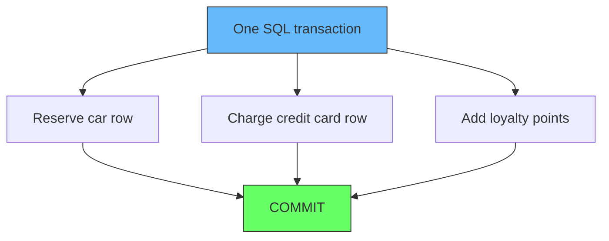

</div>

One `BEGIN`, three updates, one `COMMIT`. The database guarantees atomicity: either all three changes land or none of them do, and no other transaction ever sees a half-applied booking.

What does "reserve the car" mean here? It means the rental car row is marked unavailable for those dates. The reservation *holds* that inventory: while the transaction is running (and after it commits), the car cannot be booked by someone else. If the transaction later aborts, the hold is released and the car becomes bookable again. "Holding inventory" is just that - making a resource temporarily unavailable to everyone else, and being able to let it go if the surrounding business action fails.

Now split the same system into services, each with its private database, as the microservice architecture prescribes:

<div style={{display: 'flex', justifyContent: 'center'}}>

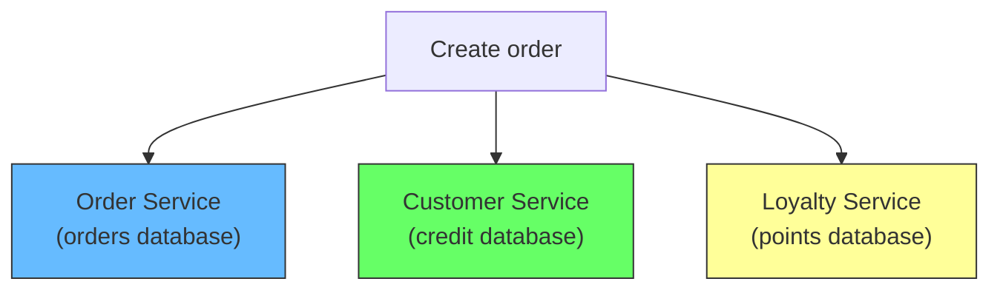

</div>

The order lives in the Order database. The credit limit lives in the Customer database. The points live in the Loyalty database. A single business action, "place this order", now has to write to three transactions in three databases, each of which commits independently. If the points update fails after the card was charged, the customer has been charged but the points were not added. There is no database that can see both writes, so no database can roll them back together.

This is the core problem distributed transactions exist to solve: **how do you make several independently committed writes behave like one atomic unit when no single database controls all of them?**

## Why a single ACID transaction cannot span databases

ACID is exactly what made all of this possible in a single, non-distributed database, and your description is right. Inside one database you can wrap two, three, four statements (`INSERT`, `UPDATE`, `DELETE`, whatever the operation needs) in one transaction, and they execute as a single unit. The database gives you four guarantees:

- **Atomicity:** all the statements succeed together or all of them fail together. There is no partial commit, no "first two rows updated, third one crashed."
- **Consistency:** the transaction moves the data from one valid state straight to another valid state, obeying every constraint (foreign keys, unique indexes, check constraints) at commit time.
- **Isolation:** while the transaction is running, no other transaction can see its partial changes. If statement 1 inserts a row and statement 2 is still deciding, a concurrent reader does not see that half-finished row - only the fully committed state.
- **Durability:** once committed, the change survives a crash, thanks to the write-ahead log.

The key point behind all of this is the one you spotted: **during the statement sequence, the partial changes are invisible.** Other transactions never observe "row updated but order not created yet." They either see the whole unit or none of it.

But these guarantees are enforced by *one* database engine that owns the data. Their atomicity rests on a write-ahead log and locks that the same engine coordinates. The moment the data is spread across engines:

- **No shared commit point.** A DBMS cannot include rows it does not own. Each engine can only commit its own bookkeeping.
- **No shared lock manager.** The "isolation" guarantee of one engine cannot see locks held in another engine.
- **No shared recovery.** If one node crashes mid-transaction, its engine can undo its own work, but it has no idea what the other engines were doing.

So the ACID acronym stops describing your system at the point where a business transaction is spread across services. You must either (a) resequence the process so each write is its own business action, or (b) introduce a coordination mechanism that makes the databases agree on an outcome. 2PC is mechanism (b). A saga is a disciplined way of doing (a).

## Tool 1: Two-Phase Commit (2PC)

2PC is an atomic commitment protocol (ACP): a distributed algorithm that coordinates all processes that participate in a distributed atomic transaction so that they either all commit or all abort. As Bernstein, Hadzilacos and Goodman describe it, one node is the **coordinator** (master site) and the rest are the **participants** (also called cohorts or workers), and the protocol runs in two phases ([Wikipedia, Two-Phase Commit Protocol](https://en.wikipedia.org/wiki/Two-phase_commit_protocol)).

In plain terms, it works like an all-party vote with a binding rule. First, all participants vote "can I commit?" Every participant prepares its work and promises what it can do. Then, only if everyone voted "yes," everyone commits. The moment even one participant says "no," everyone rolls back. It is an attempt to re-create, across several databases, the single all-or-nothing decision that a lone database makes for free inside one transaction.

### Phase 1: the voting (commit-request) phase

The coordinator sends a "query to commit" message to every participant and waits for replies. Each participant executes the transaction up to the point where it would commit, writes entries to its undo and redo logs, and then replies with either:

- **an agreement message (vote "Yes"**): its local portion ran fine and it is ready to commit, or
- **an abort message (vote "No"**): it hit a failure that makes committing impossible.

### Phase 2: the decision (commit) phase

If the coordinator received "Yes" from everyone, it broadcasts a **COMMIT** message; each participant completes the operation, releases its locks, and acknowledges. If anyone voted "No" (or the coordinator's timeout expired), the coordinator broadcasts a **ROLLBACK** message; each participant undoes the work using its undo log, releases locks, and acknowledges ([Wikipedia, Two-Phase Commit Protocol](https://en.wikipedia.org/wiki/Two-phase_commit_protocol)).

<div style={{display: 'flex', justifyContent: 'center'}}>

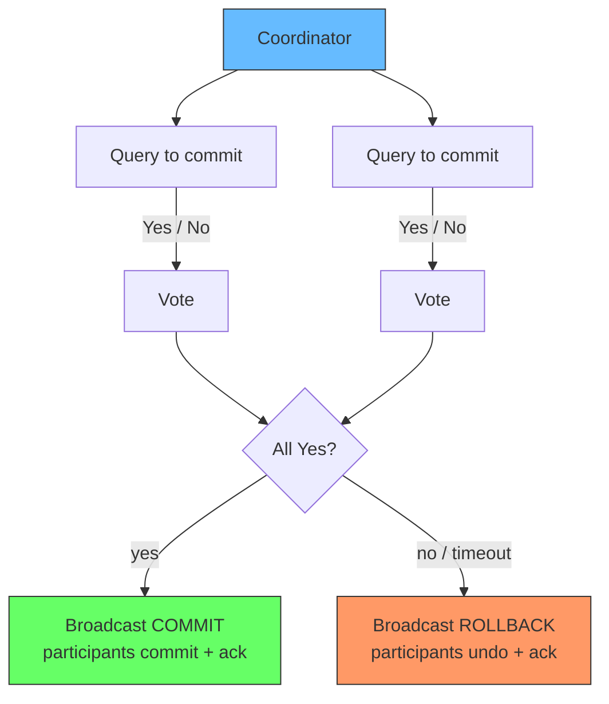

</div>

The protocol makes a clever assumption to stay safe: a participant that voted "Yes" has promised it *can* commit, and a participant that voted "No" (or that the coordinator could not reach) forces everyone to abort. Notice the asymmetry: a "Yes" is a binding promise, and that promise is what creates the blocking problem later.

In the X/Open XA architecture the coordinator is a **transaction manager (TM)**, and the databases register with it as XA resource managers. Java's JTA and JTS, for example, implement this, letting one application drive a transaction across several XA-capable databases and message brokers. This is 2PC's home turf: a single application process, multiple databases it fully owns, low latency between them, and a coordinator that rarely dies ([Wikipedia, Two-Phase Commit Protocol - Common architecture](https://en.wikipedia.org/wiki/Two-phase_commit_protocol)).

### Worked example: the rental car booking, state by state

Let's see the whole thing on the rental example, and watch the state of every database as it happens. Assume three microservices, each with its own database, and the Order Service handler acts as the coordinator (this is the XA TM riding inside the application process we described above):

- **Order Service** (coordinator), owns the `booking` table
- **Inventory Service**, owns the `car` table (the availability hold lives here)
- **Payment Service**, owns the `charge` table

The API surface the coordinator calls on each participant is exactly the XA resource interface four verbs: **prepare**, **commit**, **rollback**, and between them the participant knows its own local state.

The happy path, table by table:

**Step 0 — before anything starts.** All rows are open:

| booking | | car | | charge | |
| --- | --- | --- | --- | --- | --- |
| id=1, status=`draft` | | id=7, available=`true` | | id=101, status=`none` |

**Step 1 — Phase 1, prepare.** The coordinator calls `prepare()` on each participant. Each participant writes its intent (undo + redo entries) to its own log and replies "Yes". The car is now *held* — other bookings cannot take it — because the Inventory Service's database holds the lock on that row for the duration of the whole 2PC round. Its local status is **prepared**, not committed: the hold is real but reversible.

| booking | | car | | charge | |
| --- | --- | --- | --- | --- | --- |
| id=1, status=`prepared` (lock held) | | id=7, available=`true` but **lock held**, status=`prepared` | | id=101, status=`prepared` (lock held) |

**Step 2 — all votes "Yes", Phase 2, commit.** The coordinator calls `commit()` on each. Each database flips its prepared state to final, releases its locks, and replies "Ack". Now the hold is permanent and visible to everyone.

| booking | | car | | charge | |
| --- | --- | --- | --- | --- | --- |
| id=1, status=`booked` | | id=7, available=`false`, status=`committed` | | id=101, status=`charged` |

**What those statuses mean.** "Prepared" is the intermediate state that does most of the work: each participant is saying *I have done everything except the irreversible step, and I am locked so nothing else can interfere.* It is why 2PC can later guarantee an all-or-nothing outcome without anyone committing early. "Committed" is the irreversible state — released locks, visible to everyone, written to the durable log.

**The failure path.** If Payment says "No" (card declined) at Step 1, the coordinator never commits:

- Coordinator calls `rollback()` on Order and Inventory.
- The Inventory Service releases the car hold and flips its row back to `available=true`. Its prepared state is undone via the undo log.
- Final state: booking `cancelled`, car `available=true`, charge `none` — exactly as if nothing happened, but done through reverse actions, not through one shared database.

<div style={{display: 'flex', justifyContent: 'center'}}>

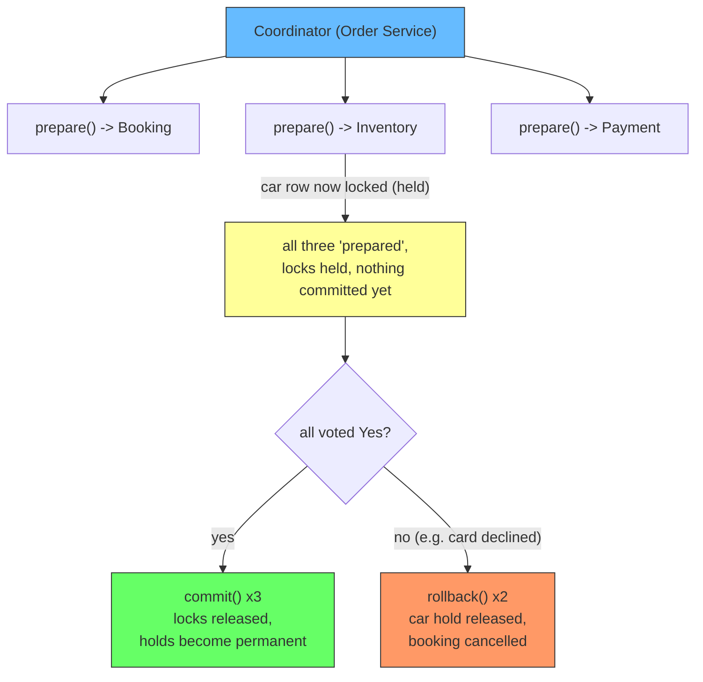

</div>

This is why the coordinator is the *weakest* point too: every participant is now waiting for its commit/rollback instruction. If the Order Service dies in the "prepared" window, booking, car, and charge are all locked and stuck — nobody can safely decide. That is the blocking problem, and it is what 3PC and sagas exist to fix.

### What the user actually sees while the car is locked (the invisible-lock UX)

A row lock is a write-blocker, not a visibility flag. While car 7 sits in "prepared" (locked, uncommitted), a second customer loading the booking page sends a plain `SELECT` and MVCC serves the old committed value: the page shows the car **available**. `available = false` is not visible, because it is not committed — this is the same rule as [Locks Only Live as Long as Your Transaction](./lock-duration-and-begin.md): readers never see uncommitted state.

The second customer then clicks "reserve this car." Their `UPDATE cars SET available = false WHERE id = 7` does not fail — it **blocks** on the row lock until the first transaction resolves. What they see next depends on the outcome:

| First customer's fate | Second customer's blocked UPDATE then... | Second customer sees |
| --- | --- | --- |
| COMMIT PREPARED (winner commits) | re-evaluates; with `WHERE id = 7 AND available = true` it matches **0 rows** | "Sorry, just reserved" (message the developer wrote for 0-row updates) |
| COMMIT PREPARED, but WHERE has **no** `AND available = true` guard | overwrites `available = false` again | "Booking confirmed" — the double-book bug |
| ROLLBACK PREPARED | proceeds, commits `available = false` | "Confirmed" (correct) |
| Coordinator dies, never resolves | blocks until `lock_timeout` | error or a long spinner |

The critical point: **"reserved" is not a word the database or the lock produces.** It is an application message, triggered by a guarded conditional update returning zero rows. The guard (`WHERE ... AND available = true`) is what converts "someone else won this row" into a safe, user-visible "reserved." Without the guard, the same waiting user blindly overwrites the winner's state and double-books.

### The real SQL: PREPARE TRANSACTION, COMMIT PREPARED, ROLLBACK PREPARED

PostgreSQL ships a real implementation of the 2PC participant interface as SQL. Each participant's "prepare" is `PREPARE TRANSACTION '<gid>'`, its "commit" is `COMMIT PREPARED '<gid>'`, and its "undo" is `ROLLBACK PREPARED '<gid>'`. The `<gid>` is a global transaction identifier that lets the coordinator name the same transaction on every participant. This is what Java's JTA uses under the hood when it drives XA across PostgreSQL instances.

**The `<gid>` must be unique — globally.** It identifies one logical transaction *across all participants*: the coordinator sends the *same* `booking-1` to Inventory Service and to Payment Service, so a later `COMMIT PREPARED 'booking-1'` on each one means "the same transaction" everywhere. Run a duplicate on one node and PostgreSQL rejects it (`prepared transaction with identifier "booking-1" already exists`), because `pg_prepared_xacts` keys on it — a collision would make `COMMIT PREPARED 'booking-1'` ambiguous. In real XA the gid is not a human-picked name but a **globally unique transaction ID (XID)** generated by the transaction manager (typically branch ID + timestamp + nonce), so two transactions never collide. Uniqueness is also what makes post-crash recovery possible: when a coordinator dies and an operator must resolve a prepared transaction by hand, the unique ID is what lets them know they are resolving the right one, on every node.

What does `PREPARE TRANSACTION` actually *do*? A normal `COMMIT` has always been atomic, but it is also *instant and unilateral*: the database decides alone, right now. That unilateral freedom is exactly what 2PC cannot allow, because the coordinator needs all participants to hold their state until it decides the outcome for everyone. So `PREPARE TRANSACTION` converts a transaction into a different kind of object — one we can think of as a **transaction held in suspense**:

- **It freezes the transaction in a "committed-but-withheld" state.** All the work (the `UPDATE`, the `INSERT`) is fully done inside the database, logs written, effects real. It is not rolled back, and it is not final either.
- **It is invisible to everyone else.** Until a `COMMIT PREPARED` arrives, no other transaction can see these changes and no lock is released. To the rest of the world it might as well not exist.
- **It is durable and survives death.** The "prepared" state is written to WAL, which is why it outlives the connection, process crashes, even a full database restart. That durability is the price of making a *promise*: the participant is telling the coordinator "I have done my part and captured my state, so whatever you decide, I can complete it."

The punchline is the promise: **`PREPARE TRANSACTION` is the vote "Yes".** It is the participant saying "I am ready to commit, and I will wait here, safely, until you tell me which way it goes." That is precisely why the later failure mode is so nasty — the transaction waits safely, holding its locks, and if the decision never comes, it waits forever. `COMMIT PREPARED` and `ROLLBACK PREPARED` are simply the two ways the decision finally arrives.

The happy path, in actual SQL, one session per participant:

```sql
-- Participant 1: Inventory Service (the car row is the resource being held)
BEGIN;
UPDATE cars SET available = false WHERE id = 7;      -- row lock acquired here
PREPARE TRANSACTION 'booking-1';                    -- phase 1: vote Yes

-- Participant 2: Payment Service
BEGIN;
INSERT INTO charges (id, status) VALUES (101, 'pending');
PREPARE TRANSACTION 'booking-1';                    -- phase 1: vote Yes
```

Both have now voted "Yes" and are durable but uncommitted. The coordinator then runs phase 2:

```sql
-- Coordinator decides: all Yes -> commit
COMMIT PREPARED 'booking-1';   -- on Inventory Service
COMMIT PREPARED 'booking-1';   -- on Payment Service
```

And the undo path, when a participant votes No or fails:

```sql
-- Coordinator decides: not all Yes -> roll back
ROLLBACK PREPARED 'booking-1'; -- on Inventory Service
ROLLBACK PREPARED 'booking-1'; -- on Payment Service
```

Two practical notes on PostgreSQL's implementation:

- `PREPARE TRANSACTION` is off by default. `max_prepared_transactions` must be set to a positive value in `postgresql.conf`, and it is usually only enabled on nodes that run external transaction coordination — a sign of how rare real 2PC is in normal applications.
- A prepared transaction that is never resolved holds its locks and its snapshot forever. It is durable: it survives the connection that created it, process restarts, and even a full database restart.

### What happens when the node holding the lock fails?

Everything above assumed the participants stay alive and only the coordinator is at risk. The harder case is a *participant* failing while holding its locks — say the Inventory Service crashes right after `PREPARE TRANSACTION 'booking-1'`, before the coordinator's phase 2 arrives.

In PostgreSQL this is exactly the blocking problem, observable:

```sql
-- Any session, on the Inventory Service:
SELECT gid, prepared, owner FROM pg_prepared_xacts;
-- 'booking-1' is still listed: it survived the crash (durable via WAL)

SELECT pid, locktype, mode FROM pg_locks WHERE NOT granted;
-- every other transaction on cars.id = 7 is now waiting, indefinitely
```

Every other booking that touches car 7 now blocks. The lock does not disappear when the node dies — the prepared transaction and its locks are durable, because the coordinator *may* still send `COMMIT PREPARED` for `booking-1`, and the database must be able to honor it. There is nothing to kick the lock loose automatically. Resolution has to come from outside:

- An operator (or a recovery coordinator) inspects `pg_prepared_xacts`, decides the fate of `booking-1`, and runs `COMMIT PREPARED` or `ROLLBACK PREPARED`.
- If the *coordinator* also crashed, the transaction is *locatable but undecidable*: `pg_prepared_xacts` still lists it, but nobody alive is allowed to make the call. A prepared transaction records the *intent* ("I did my work and I'm parked"), not the *verdict*. The verdict is decided by the coordinator after all votes are in, and a participant that never received the final message is genuinely ignorant of which way it went. If the one participant that may have received the verdict is the one that's also down, the survivors cannot commit (the verdict may have been abort) and cannot abort (the verdict may have been commit). Nothing may be decided until the coordinator recovers its decision log, or every participant is contacted — the exact double-failure uncertainty from the disadvantages list above.

So the answer to "if the node holding the lock fails, what happens to the lock?" is: **the lock stays. It becomes an orphaned lock that blocks everyone until a human or a new coordinator resolves the prepared transaction.** That is the entire reason 2PC is called a blocking protocol, and why the microservice world prefers sagas, which never hold a lock across a service boundary.

<div style={{display: 'flex', justifyContent: 'center'}}>

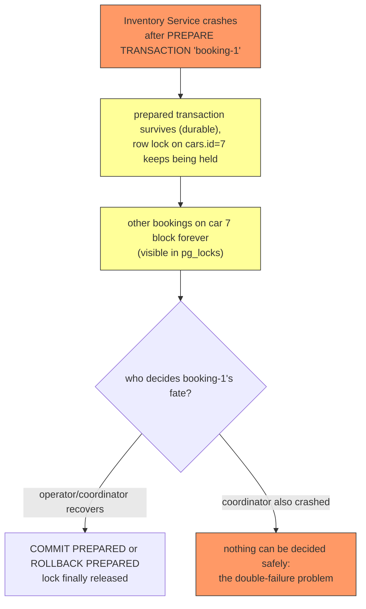

</div>

### The retry problem: prepare partially succeeds, then who cleans up?

There is another failure the worked example hides. Suppose the coordinator's flow runs in order: `prepare('booking-1')` succeeds on **Inventory**, then `prepare('booking-1')` fails on **Payment** (payment service down, card declined, timeout). What does the coordinator do?

The naive instinct is to *retry the prepare* — and that is exactly the trap you spotted. Retrying `prepare('booking-1')` on Inventory does **not** just run again; Inventory already holds a prepared transaction with that identifier, so the retry fails with `duplicate key` / `already exists`. You can no longer prepare "booking-1" on Inventory, you cannot commit it (Payment was never prepared), and you cannot run the same transaction again. The coordinator has actually *poisoned* its own retry.

The correct structure is what you suggested — compensate in the catch path **before** retrying:

```sql
-- coordinator flow, roughly:
BEGIN;                                        -- coordinator's own bookkeeping
-- 1. prepare each participant
PREPARE TRANSACTION 'booking-1';              -- on Inventory  (succeeds)
PREPARE TRANSACTION 'booking-1';              -- on Payment     (FAILS)

-- 2. catch block runs the undo:
ROLLBACK PREPARED 'booking-1';                -- on Inventory (undo the one that stuck)
--            (never prepared on Payment: nothing to undo there)

-- 3. only then, retry the whole transaction with a NEW gid
PREPARE TRANSACTION 'booking-2';              -- fresh identifier for the new attempt
```

So the rule has two parts:

- **Undo the participants that already prepared, then and only then retry.** Leaving a prepared transaction behind is what breaks the world — it holds locks and its identifier is now burned.
- **Retry with a fresh gid, not the same one.** A transaction identifier is *used once*. Each new attempt is a new logical transaction with a new XID. This is why a transaction manager generates a fresh XID per attempt instead of reusing the business order number as the gid.

Now the harder part: **the timeout case.** If `prepare('booking-2')` on Payment *times out* rather than returning an explicit failure, the coordinator does not know whether Payment actually prepared it or not. It cannot safely `COMMIT PREPARED 'booking-2'` (Payment may not have prepared), and it cannot safely `ROLLBACK PREPARED 'booking-2'` either (if Payment *did* prepare, rolling back could undo work whose commit was already decided elsewhere). This is the same "indoubt" uncertainty as the coordinator crash, and it is why production systems never hand-roll this loop — the transaction manager keeps a **recovery log**: it journals "I am coordinating transaction X," and on restart it queries every participant's `pg_prepared_xacts` to learn the true state before it makes a single commit/rollback decision. Picking a number, retrying blindly, and never journaling is how production 2PC turns into a data-corruption incident.

### Assumptions 2PC quietly needs

The protocol only works if its assumptions hold ([Wikipedia, Two-Phase Commit Protocol - Assumptions](https://en.wikipedia.org/wiki/Two-phase_commit_protocol)):

- Each node has stable storage with a write-ahead log.
- No node crashes forever (a node can crash and recover).
- Data in a write-ahead log is never lost or corrupted during a crash.
- Any two nodes can communicate (the network can be rerouted).

Every one of these is a real design statement. "No crashed node is gone forever" and "the coordinator recovers with a readable log" are not free in a microservice world where instances are scaled up and down, containers are restarted, and disks are ephemeral.

### Why 2PC is a bad fit for microservices

Richardson's position is unambiguous: "Using 2PC is generally a bad idea in a microservice architecture. It's a form of synchronous communication that results in runtime coupling that significantly impacts the availability of an application" ([Chris Richardson, Managing data consistency in a microservice architecture using Sagas](https://microservices.io/post/microservices/2019/07/09/developing-sagas-part-1.html)).

**1. 2PC is a blocking protocol.** Its greatest disadvantage is that if the coordinator fails permanently, some participants will never resolve their transactions: a participant that already sent "Yes" is waiting for a commit or rollback that now may never arrive, and it stays blocked holding its locks ([Wikipedia, Two-Phase Commit Protocol - Disadvantages](https://en.wikipedia.org/wiki/Two-phase_commit_protocol)).

<div style={{display: 'flex', justifyContent: 'center'}}>

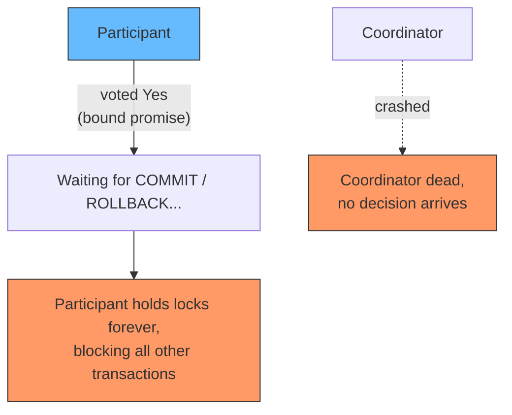

</div>

**2. It is synchronous and holds locks across services.** Every participant locks its rows while the transaction runs and while it waits for the coordinator. A slow service is not just slow for itself: it holds its locks, its neighbors hold theirs, and the whole coordination tree slows down. State locks are the currency, and 2PC spends them across every hop.

**3. It couples services at runtime.** For 2PC to work, every participating service must be reachable and responsive at the same moment the coordinator asks, and each service's transaction manager must interoperate with the coordinator's. This is exactly the tight runtime coupling microservices exist to avoid.

**4. It cannot reliably recover from a specific double failure.** If both the coordinator and a cohort member fail during the commit phase, a new coordinator cannot confidently decide the outcome: the failed member may have been the first to receive the commit and may actually have committed. Recovery has to wait until every cohort member responds ([Wikipedia, Two-Phase Commit Protocol - Disadvantages](https://en.wikipedia.org/wiki/Two-phase_commit_protocol)).

The one-liner that captures the whole argument: **2PC is correct but unforgiving. It works when you control the whole data center; it hurts when you have services you do not fully control and cannot keep all online at once.**

## Tool 1.5: Three-Phase Commit (3PC)

If 2PC's fatal flaw is that a coordinator crash can block everyone forever, the obvious instinct is: cannot we make it non-blocking? That is exactly what the three-phase commit protocol (3PC) attempts. It is a distributed algorithm that ensures all nodes agree to commit or abort a transaction, and it improves on 2PC by eliminating the indefinite blocking caused by failures during the commit phase ([Wikipedia, Three-Phase Commit Protocol](https://en.wikipedia.org/wiki/Three-phase_commit_protocol)).

**How 3PC differs from 2PC.** Recall the reason 2PC blocks: a participant may have voted "Yes" and then the coordinator dies, so nobody knows whether to commit or abort. 3PC inserts an extra state and an extra phase between the vote and the decision, called the **Prepared to commit** state, so the ambiguity never exists. Concretely ([Skeen (1982), A Quorum-Based Commit Protocol](https://en.wikipedia.org/wiki/Three-phase_commit_protocol)):

1. **Voting phase:** as in 2PC, the coordinator asks all participants, and each one votes "Yes" or "No".
2. **PreCommit phase:** if all voted "Yes", the coordinator sends a **Prepare to commit** message to everyone. Each participant acknowledges that it is prepared (writes the prepared state to its log) and replies "Prepared". This is the extra round that 2PC does not have.
3. **Commit phase:** once the coordinator has received the *Prepared* acknowledgement from every participant, and only then, it sends the **doCommit** message, and everyone commits.

Because of that middle phase, a coordinator failure no longer leaves the cohort stuck:

- If a new coordinator takes over and learns that some nodes received a Prepare to Commit message, it can safely assume the original coordinator was heading toward commit, and shepherd the transaction to commit.
- If it learns that no node received the Prepare to Commit message, it can safely conclude no participant has committed anything, and it can abort.

That single added round eliminates the specific ambiguity that forced 2PC to block indefinitely ([Wikipedia, Three-Phase Commit Protocol](https://en.wikipedia.org/wiki/Three-phase_commit_protocol)).

<div style={{display: 'flex', justifyContent: 'center'}}>

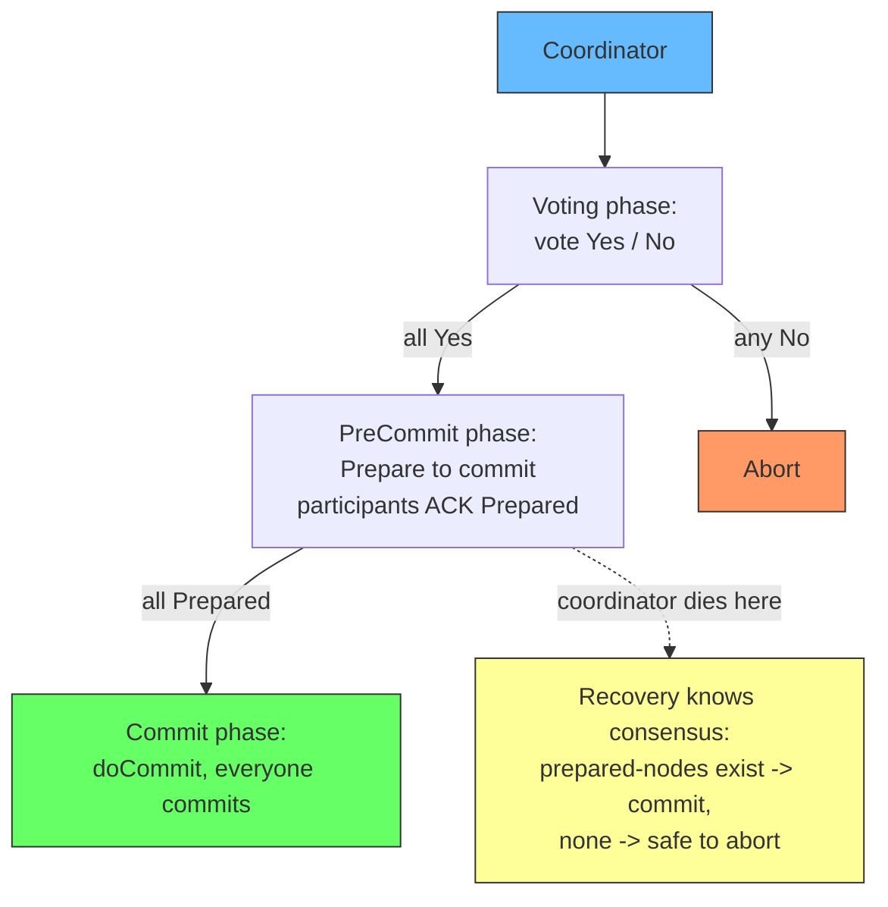

</div>

**Why 3PC is not the answer in practice.** Two serious drawbacks keep it out of real systems ([Wikipedia, Three-Phase Commit Protocol - Disadvantages](https://en.wikipedia.org/wiki/Three-phase_commit_protocol)):

- **It assumes bounded delays.** 3PC requires a network with bounded delay and nodes with bounded response times. In most real systems, where network latency is unbounded and processes can pause (GC pauses, CPU throttling, stragglers), it cannot guarantee atomicity. This is a fundamental assumption, not a corner case.
- **It costs latency.** 3PC needs at least three round trips to complete. Every additional round trip adds wall-clock time to every transaction, and at high throughput that latency is a real price.
- **Progress is not guaranteed.** Skeen's original protocol can still reach a state where a quorum is connected but cannot make progress until the network partition heals. Refinements such as Keidar and Dolev's E3PC solve that specific problem, but they do not remove the bounded-delay assumption ([Keidar & Dolev (1998), Increasing the Resilience of Distributed and Replicated Database Systems](https://en.wikipedia.org/wiki/Three-phase_commit_protocol)).

In practice, when people need non-blocking agreement today, they reach for consensus algorithms (Paxos, Raft) underneath the commit path, which is what modern distributed databases like Google Spanner do, rather than textbook 3PC. So the honest takeaway is: **3PC is a classic textbook protocol that fixes 2PC's blocking in theory, and that real systems almost never run as-is because its bounded-delay assumption is too strict.**

## Tool 2: The Saga pattern

In plain terms, a saga is the opposite strategy: instead of making everyone decide together, it lets each service do its small piece, save it, and hand off to the next. If a later piece fails, the earlier pieces run a reverse action to undo themselves. Think of it as a transaction broken into checkpoints, where the rollback is a series of explicit business actions instead of a database undo log.

A saga trades 2PC's strong atomicity for availability. Instead of making all participants vote and then commit together, a saga is a **sequence of local transactions**, each in one service, where:

1. Each local transaction completes its work atomically within its own service.
2. It updates that service's database.
3. It initiates the next transaction via an event or a message.

If a local transaction fails, the saga runs a series of **compensating transactions** that reverse the changes made by the preceding local transactions ([Microsoft Azure Architecture Center, Saga Design Pattern](https://learn.microsoft.com/en-us/azure/architecture/patterns/saga)).

Richardson's canonical example is a "Create Order" saga across an Order Service and a Customer Service:

| Step | Participant | Transaction | Compensating transaction |
| --- | --- | --- | --- |
| 1 | Order Service | `createPendingOrder()` | `rejectOrder()` |
| 2 | Customer Service | `reserveCredit()` | - |
| 3 | Order Service | `approveOrder()` | - |

The happy path runs all three steps in order. If the credit reserve fails, the saga runs the compensation: `rejectOrder()` undoes the pending order. Notably, `reserveCredit()` has no compensating transaction, because the only step that can fail after it (`approveOrder()`) cannot fail for business reasons; and `approveOrder()` has none because it is the last step ([Chris Richardson, Managing data consistency in a microservice architecture using Sagas](https://microservices.io/post/microservices/2019/07/09/developing-sagas-part-1.html)).

The double table is the part worth slowing down on, because it is the source of the recurring question. **Each row's compensating transaction belongs to that row, but it is *executed* when a *later* step fails.** The question "if step 3 fails, do we compensate step 2 only, or steps 1 and 2?" has one answer: **every step that already committed gets compensated, in reverse order.** If step 3 of 5 fails, the saga walks back steps 2 and 1 (in that order), undoing each with its own compensation. A later failure is never "local" - it is a chain reaction that unwinds the whole prefix.

<div style={{display: 'flex', justifyContent: 'center'}}>

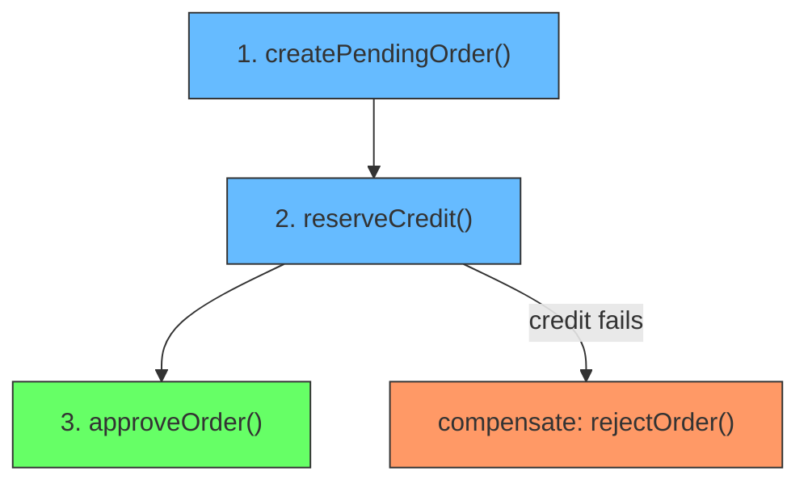

</div>

### The compensating chain: a four-service saga, with code

The three-step example hides the scope of compensation because only one step fails. Let's make it concrete with a four-service saga: **book a car, hold the payment, add loyalty points, send the confirmation email.** Every step except the last can fail, so steps 1-3 each need a compensation.

| Step | Service | Transaction | Compensating transaction |
| --- | --- | --- | --- |
| 1 | Inventory | `reserveCar()` | `releaseCar()` |
| 2 | Payment | `holdPayment()` | `releasePayment()` |
| 3 | Loyalty | `addPoints()` | `cancelPoints()` |
| 4 | Notifications | `sendEmail()` | - |

If step 3 (`addPoints`) fails, the saga does **not** stop at step 2. It compensates *both* earlier committed steps, in reverse: first `cancelPoints` is not needed (step 3 itself failed, nothing to undo), then `releasePayment` (step 2), then `releaseCar` (step 1). The car is released *and* the payment hold is lifted, so the customer is fully back to the pre-book state.

Code makes the reverse walk explicit. Here is the orchestrator that drives this saga (simplified, no message broker for clarity):

```typescript
type Step = {
  id: number;
  run: () => Promise<void>;      // the local transaction
  compensate: (() => Promise<void>) | null; // undo, or null for the last step
};

const saga = [
  { id: 1, run: reserveCar,    compensate: releaseCar },
  { id: 2, run: holdPayment,   compensate: releasePayment },
  { id: 3, run: addPoints,     compensate: cancelPoints },
  { id: 4, run: sendEmail,     compensate: null },   // last: nothing can fail after it
];

async function runSaga(steps: Step[]) {
  const done: Step[] = [];
  for (const step of steps) {
    try {
      await step.run();
      done.push(step);                       // commit succeeded, remember it
    } catch (e) {
      // walk back in reverse over everything that committed BEFORE the failure
      for (const s of [...done].reverse()) {
        if (s.compensate) await s.compensate(); // undo each, newest first
      }
      throw e;
    }
  }
}
```

Trace the failure the question asks about. Steps 1 and 2 run, both push onto `done`. Step 3 throws. The catch block iterates `[...done].reverse()` giving `[step2, step1]` — so `releasePayment()` runs first, then `releaseCar()`. **Compensating the whole committed prefix, not just the immediate predecessor.** That reverse order matters: it releases the most recently acquired resource first, which is the same discipline as unwinding a stack.

A useful mental sentence to remember: **a saga never compensates just one step - it compensates every step that already committed, back to the beginning, newest first.** The only step that escapes is the one that failed (nothing to undo) and the compensations that can never be needed.

### Choreography: nobody calls anyone, events make the reverse-walk happen

The orchestration code above has a coordinator that owns the whole chain. Choreography removes it: **each service knows only its own step and its own compensation.** When a step fails, the failing service publishes an event, and the *earlier* services hear it and run their own undo in response ([Richardson, Pattern: Saga](https://microservices.io/patterns/data/saga.html)).

The same four-service car example, as choreography:

```typescript
// Service 1: Inventory
onEvent(OrderCreated)     { reserveCar();                emit(CarReserved); }
onEvent(PaymentHoldFailed){ releaseCar(); }              // its own compensation

// Service 2: Payment
onEvent(CarReserved)      { holdPayment();               emit(PaymentHeld); }
onEvent(PointsFailed)     { releasePayment(); }          // its own compensation

// Service 3: Loyalty
onEvent(PaymentHeld)      { addPoints();                 emit(PointsAdded); }
onEvent(EmailFailed)      { cancelPoints(); }            // its own compensation

// Service 4: Notifications
onEvent(PointsAdded)      { sendEmail(); }               // last step: no compensation
```

Trace the failure your question asked about. Step 3 throws, so `PointsAdded` is never emitted; instead Loyalty emits `PointsFailed`. Service 2 (Payment) hears `PointsFailed`, runs its *own* `releasePayment()`. It does not call Service 3 and does not know Service 1 exists. Then — because `releasePayment` is itself a state change worth announcing — Payment emits `PaymentHoldReleased`, and Service 1 (Inventory) hears it and runs `releaseCar()`. The reverse-walk propagates as a *cascade of events*, and at no point does any service call another service's compensation directly.

<div style={{display: 'flex', justifyContent: 'center'}}>

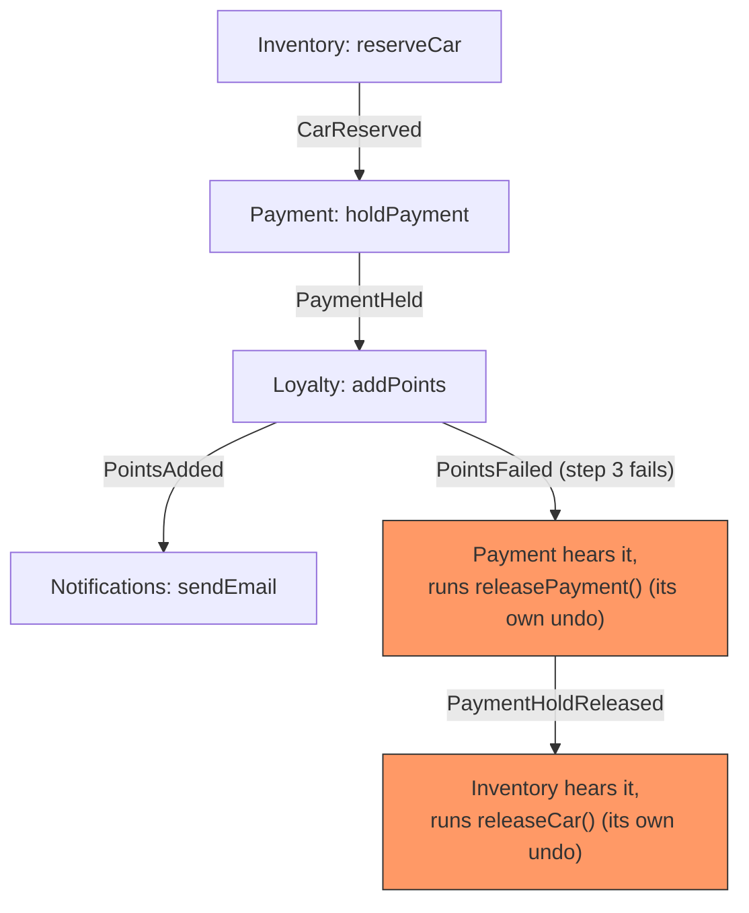

</div>

The rule that separates the two styles: **in orchestration the composer knows the whole chain; in choreography the participants know only their own step and their own undo.** The "composer" in choreography is the event contract each participant opts into, not a piece of code.

### Sync vs async, and what keeps the messages from losing you money

Both styles are **asynchronous** in their production form:

- **Choreography is inherently async** - it runs on events over a broker (pub/sub).
- **Orchestration is command/reply, also over async messaging.** Richardson's example: the orchestrator "sends a Reserve Credit command... the Customer Service sends back a reply message indicating the outcome" ([Richardson, Pattern: Saga](https://microservices.io/patterns/data/saga.html)). A synchronous HTTP orchestrator works but couples you to latency and loses durable resume on crash.

Because events and commands travel over a broker with **at-least-once delivery**, three reliability mechanisms carry the correctness:

**1. Idempotent consumers (the sink side).** At-least-once means the same event can be delivered twice (retry, broker redelivery, duplicate publish). Every handler - forward step *and* compensation - must be safe to run twice: `releasePayment()` on an already-released payment is a no-op, `addPoints()` checks "already added" and skips. If a handler is not idempotent, retries turn a small duplicate into a double-charge or double-refund.

**2. Retries with backoff (the queue's first defense).** When a handler throws, the queue does not give up first try. It retries with delay (exponential backoff plus jitter to avoid the thundering-herd re-stamp), up to a configured attempt limit. Transient failures - a service restarting, a brief network blip - are absorbed silently.

**3. Dead-letter queue (DLQ) - the sink that catches the retry-exhausted.** After the retry limit, the poison message is moved to a DLQ instead of being dropped. It sits there for an operator (or a repair job) to inspect: what was the message, who failed to consume it, how many times it retried. The DLQ is the observation point for the compensating transaction that "might not always succeed" - the Azure warning that compensation can leave an inconsistent state and needs monitoring ([Microsoft Azure Architecture Center, Saga Design Pattern](https://learn.microsoft.com/en-us/azure/architecture/patterns/saga)).

<div style={{display: 'flex', justifyContent: 'center'}}>

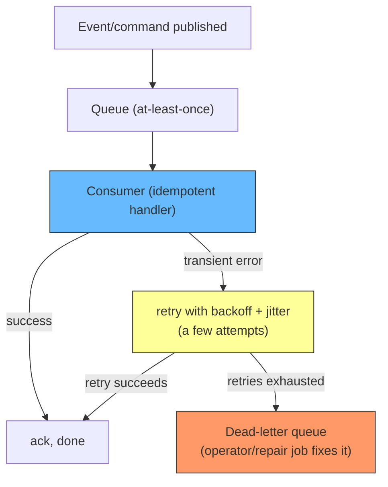

</div>

DLQ and retry protect you only if the handlers are idempotent; retry is what makes transient failures silent, and the DLQ is what makes persistent failures *visible* instead of silently lost. Sink into a DLQ means the compensation for a step that could not be reversed is not gone - it is parked where a human can find it. That is the real meaning of the outbox + reliable-messaging requirement: the events a saga depends on must be published atomically with the DB change they describe, and their consumption must be idempotent, retried, and dead-lettered.

The full deep dive on sagas - choreography vs orchestration, why sagas have no isolation, the data anomalies (lost updates, dirty reads, fuzzy reads) and their countermeasures, and the reliable-messaging requirement underneath - lives in the dedicated article [Sagas: Managing Transactions That Span Multiple Services](./sagas.md). What matters here is the contrast with 2PC:

| | 2PC | Saga |
| --- | --- | --- |
| Atomicity | Strong, all-or-nothing across participants | Eventual, per-step; manually compensated |
| Isolation | Full, participants hold locks | None; you must counter anomalies |
| Coordination | Synchronous coordinator + votes | Async events (choreography) or an orchestrator |
| Blocking | Yes, coordinator failure blocks participants | No, each step is an independent committed write |
| Coupling | Runtime coupling across all participants | Loose: services react to events |
| Your job | Wire up XA-compatible resources | Write compensating transactions by hand |

## When to use which: the decision diagram

The rule of thumb from Azure's guidance is that a saga is the right tool "when you need to ensure data consistency in a distributed system without tight coupling" and "when you need to roll back or compensate if one of the operations in the sequence fails", and it is the wrong tool when "transactions are tightly coupled" or "compensating transactions occur in earlier participants" ([Microsoft Azure Architecture Center, Saga Design Pattern](https://learn.microsoft.com/en-us/azure/architecture/patterns/saga)). Combine that with Richardson's "2PC is not an option" in microservices, and the reasoning flow is:

<div style={{display: 'flex', justifyContent: 'center'}}>

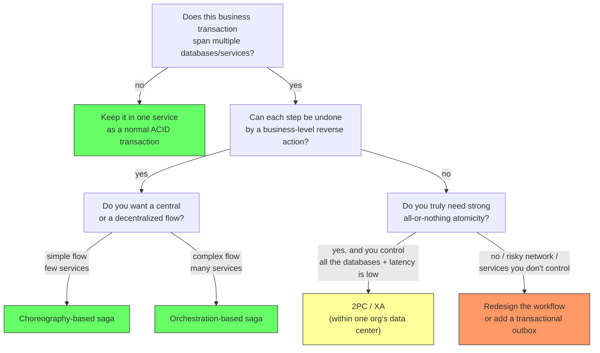

</div>

Practically, in a modern web backend most cross-service business flows land in the "yes, can compensate" branch, so a saga wins. 2PC still has a seat at the table in a few narrow places: inside one organizational data center with low-latency links, short-lived transactions, XA-capable databases, and an operational guarantee that the coordinator will recover. Modern distributed databases (Google Spanner and its descendants) solve the durability side of the coordination problem with consensus (Paxos/Raft) underneath the transaction, which changes the math again - but that is a different protocol from classic 2PC over unrelated databases.

## How to apply this

When you design the next cross-service flow, ask in order:

1. **Can this become a single service?** Move the writes into one transaction before you build coordination machinery. Splitting data to make room for a saga is a design decision, not a requirement.
2. **Can the steps be compensated?** Every step except the last (and except steps that cannot fail) needs a reverse business action. If a step cannot be compensated, you have a problem: 2PC is not realistically the fallback in a microservice, so you likely redesign the flow.
3. **Pick the coordination style.** Few services and simple flow -> choreography. Many services, complex orchestration, unavoidable cyclic dependencies -> an orchestrator.
4. **Design for the anomalies.** Sagas lose isolation: expect lost updates, dirty reads, and fuzzy reads, and apply the countermeasures (semantic lock, commutative updates, reread values) documented in [Sagas](./sagas.md).

## Summary

A distributed transaction is any business transaction that has to update several independently owned databases. The mechanisms to make it behave: 2PC, a blocking agreement protocol where a coordinator makes every participant vote and then commits or rolls back all of them; 3PC, a non-blocking variant in theory that assumes bounded delays and is rarely run as-is; and sagas, a sequence of committed local transactions with hand-written compensating transactions. 2PC delivers strong atomicity but blocks on failures and couples services, which makes it a poor fit for microservices (Richardson: "2PC is not an option"). Sagas keep services available and loosely coupled but hand you the isolation problem and require every step to be compensable. Choose by the shape of the business flow: compensate-able workflows get a saga; truly atomic, fully controlled, low-latency data centers were what 2PC was built for.

## References

- [Two-Phase Commit Protocol](https://en.wikipedia.org/wiki/Two-phase_commit_protocol). Wikipedia - the protocol's phases, message flow under X/Open XA, the blocking disadvantage, recovery assumptions, and the two-phase locking distinction.
- [Three-Phase Commit Protocol](https://en.wikipedia.org/wiki/Three-phase_commit_protocol). Wikipedia - the Prepared to commit state, recovery after a coordinator failure, the bounded-delay assumption, and the latency of three round trips.
- Skeen, D. (1982). *A Quorum-Based Commit Protocol*. Department of Computer Science, Cornell University - the original 3PC protocol.
- Keidar, I. & Dolev, D. (1998). "Increasing the Resilience of Distributed and Replicated Database Systems". *Journal of Computer and System Sciences* 57(3) - the E3PC refinement that guarantees quorum progress.
- Bernstein, P., Hadzilacos, V., Goodman, N. (1987). *Concurrency Control and Recovery in Database Systems*, Chapter 7 - the foundational treatment of atomic commitment cited by the protocol's description.
- [Chris Richardson, Managing data consistency in a microservice architecture using Sagas - Part 1](https://microservices.io/post/microservices/2019/07/09/developing-sagas-part-1.html) - why 2PC is a bad idea in microservices ("2PC is not an option"), the Create Order saga, compensating transactions, and the semantic lock countermeasure.
- [Chris Richardson, Pattern: Saga](https://microservices.io/patterns/data/saga.html) - the context, problem, forces, choreography and orchestration examples, and drawbacks (no automatic rollback, no isolation).
- [Microsoft Azure Architecture Center, Saga Design Pattern](https://learn.microsoft.com/en-us/azure/architecture/patterns/saga) - compensable / pivot / retryable transactions, choreography vs orchestration, data anomalies and countermeasures, and when (not) to use the pattern.
- [Sagas: Managing Transactions That Span Multiple Services](./sagas.md) - the deep dive on sagas: coordination styles, the "lost I", anomalies, and reliable messaging.