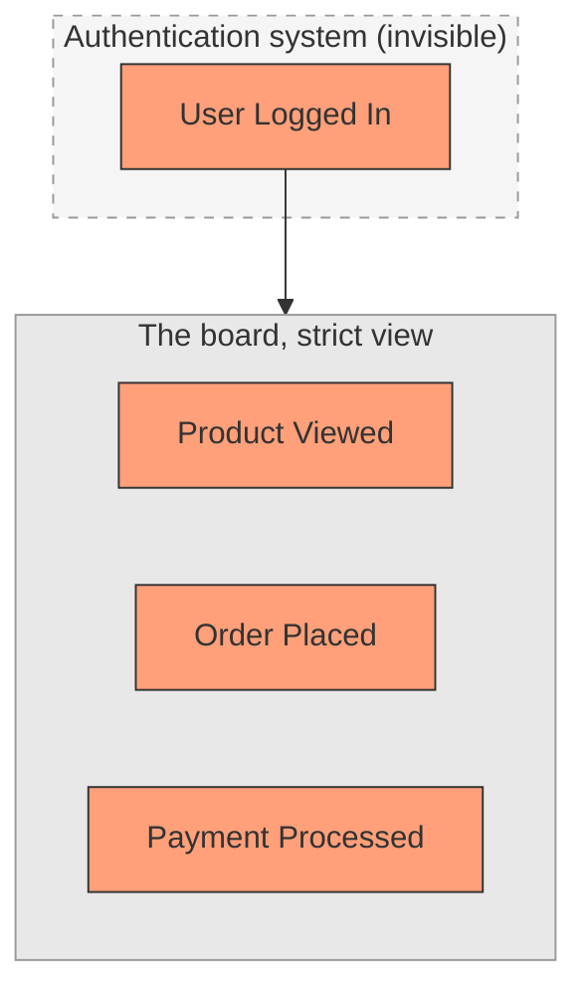
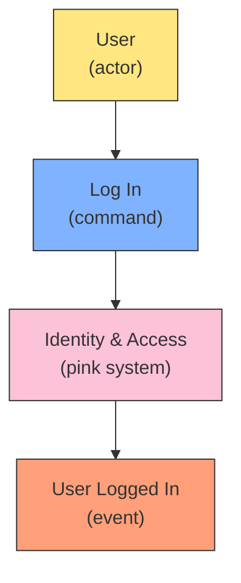
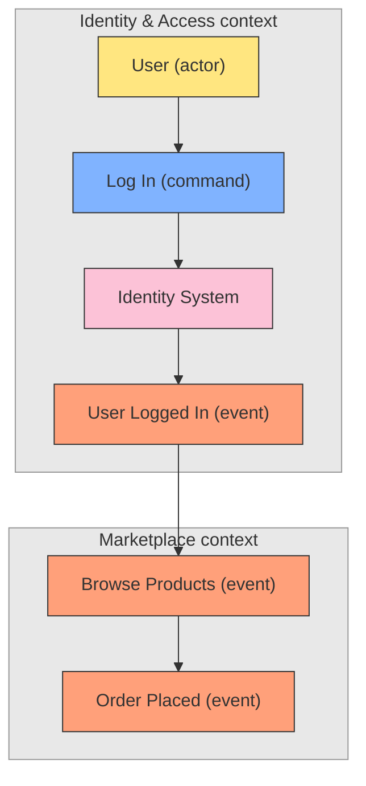
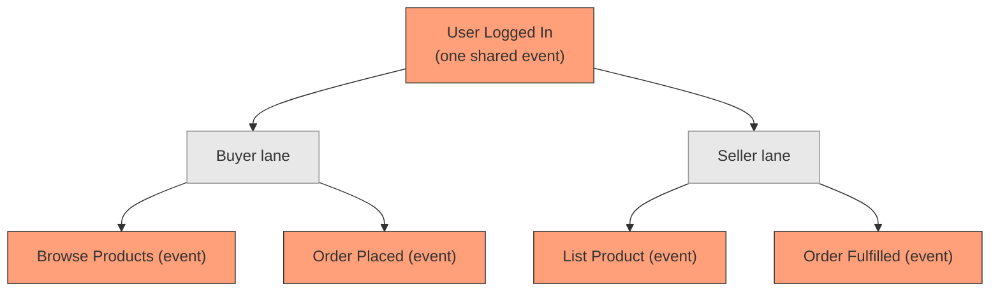
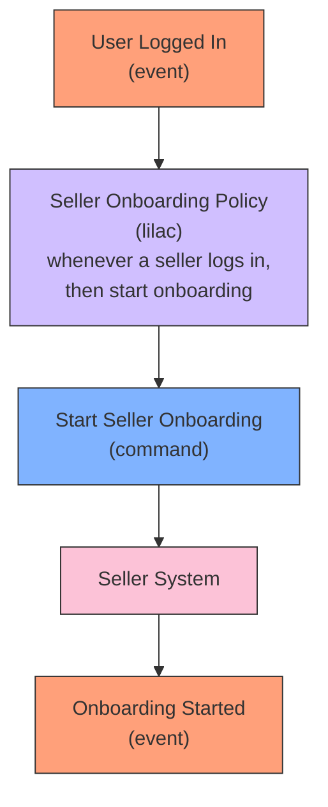

# Put Login on the Board: Real System Events Reveal Bounded Contexts

## The problem: strict DDD leaves the door off the wall

You are event storming a marketplace. The wall fills with orange stickies: `Product Viewed`, `Order Placed`, `Payment Processed`, `Order Shipped`. Then someone asks where login goes.

The strict answer says it does not belong. Login is authentication, a generic subdomain, not a core business fact. Domain experts do not care that a user logged in, so the sticky stays off the wall. This is the same argument made for excluding "Homepage Visited" and other UI events.

The strict answer is wrong for login, and here is why: login **is an event in the system**. It is recorded, it changes state (a session is created, `lastLoggedInAt` is set, failed attempts reset), and it is the door through which the entire buyer and seller journeys begin. Leave it off the board and you lose the boundary between the authentication system and the marketplace, and you have nowhere to anchor the post-login flow. The UI events and login are not the same category.

The authentication system exists, it produces events, and it is missing from the wall. Missing events make boundaries invisible and post-login work forgettable.

## The position: it is an event, put it on the board

`UserLoggedIn` is an event that happens in some system. It does not stop being an event because it is not a *core* domain event. The board is a discovery tool, not a specification. Adding a sticky costs nothing. A missing boundary costs a lot.

Event storming notation already has a place for login. It sits at the left edge of a flow as the entry trigger: an actor issues a command, a system handles it, the system emits an event. Brandolini's rule is that processes start from a trigger, usually a command or an external event. Login is exactly that: `User` (actor) issues `Log In` (command), the identity system handles it, and `User Logged In` (event) comes out.

Qlerify's official guide models it this way. In the "Adding People and Systems" step of its example board there is an orange `USER LOGGED IN` event, a pink `BANK ID` system that produces it, and a `CFO` actor who triggers it. When login appears on the wall, it is modeled as actor, command, system, event like any other.

## The payoff: the event draws the boundary

Put `User Logged In` on the wall and ask the question that event storming always asks: who owns this event? The answer is the identity and access context, not the marketplace. The vertical boundary line lands exactly between the login event and the first marketplace event.

This is the real value of including it. The event does not blur the boundary, it *reveals* it. It becomes the integration event connecting the authentication context to the consuming context, the same way `Order Placed` connects ordering to billing. In DDD terms, the identity and access context is a generic subdomain to its consumers, and it communicates through standard integration, which is an event contract.

The one warning that stays valid: do not let a generic event do domain work inside a context that does not own it. `User Logged In` marks the entry and the boundary, but the marketplace's real business events are `Browse Products`, `Order Placed`, and so on. The login event is the door, not the building.

## One shared event, then the journeys diverge

Buyer and seller share the same login. That is one event, not two. The event sits once on the wall at the left edge. The role is data in the event payload, not a reason to duplicate the sticky.

But after login the journeys diverge, and the board is still left to right. The answer is swimlanes by actor. The shared entry stays on the left, then the flow forks into a buyer lane and a seller lane, each with its own left-to-right line. Qlerify documents swimlanes for exactly this: parallel activities separated by role or department, often combined with pivotal events that anchor the split.

If the two journeys are genuinely different, the fork is usually more than a layout trick. It is a bounded context boundary, and you have found it by putting the shared login event on the board first.

## Policies move the flow from one event to the next

Once login is on the board, the process modeling grammar applies to it like anything else. Process modeling follows a repeatable pattern: `Event -> Policy -> Command -> System -> Event`. The policy is the lilac sticky that reacts to an event and triggers the next command, phrased as "whenever X, then Y". It always sits after the event that fires it and before the command it triggers.

A policy cannot come before the event that wakes it. It reacts to the event, applies a rule, and issues the command. Then the chain repeats: the system produces a new event, which triggers the next policy.

## The rule of thumb

Put every event the system will actually record on the board. The board is a map, not a filter. Boundaries fall where ownership of events changes, and a real system event like login is exactly the kind of sticky that makes the boundary visible. What you must not do is let a generic event do domain work inside a context it does not own.

## Related

- [Event Storming: Find Module Boundaries Through Events](event-storming.md) - the workshop process this article builds on
- [From Event Storming to Bounded Contexts](event-storming-read-models-boundaries.md) - includes the case for "User Logged In" as a domain event and the five checks that decide boundaries
- [When Events Are Events and When They Are Not](events-are-discovery-not-code.md) - the filter between the wall and the code, and where integration events live

## References

- Palopaa, S. (2025). *Event Storming – The Complete Guide*. Qlerify. https://www.qlerify.com/post/event-storming-the-complete-guide : Models "USER LOGGED IN" as an orange event in the "Adding People and Systems" example, and documents the `Event -> Policy -> Command -> System -> Event` grammar and swimlanes by role.
- Brandolini, A. (2013). *Introducing Event Storming*. ziobrando.blogspot.com. https://ziobrando.blogspot.com/2013/11/introducing-event-storming.html : The original source for the notation: processes start from a trigger (a command, an external event, or time passing).
- DDD Practitioners. (n.d.). *Generic Subdomain*. https://ddd-practitioners.com/home/glossary/domain/generic-subdomain/ : Places user authentication among the generic subdomains solved with off-the-shelf software.
- Vernon, V. (2013). *Implementing Domain-Driven Design*. Addison-Wesley : Introduces the Identity and Access bounded context, which consuming contexts treat as a generic subdomain and integrate with through standard DDD integration techniques.
