# From Event Storming to Bounded Contexts: The Amazon Book Example

## The problem: same noun, different meaning

Two teams at Amazon talk about "book." But they mean different things.

The catalog team describes a book by its title, author, cover, description, and reviews. The warehouse team describes a book by its weight, dimensions, and fragility. The shipping team describes a book by its delivery speed and handling instructions.

Same noun. Three different models. If you force them into a single `Book` class, it becomes a 50-field god object that satisfies nobody and breaks every time one team changes a field.

Event Storming alone cannot catch this. The sticky notes say "Book" in both places, but they do not show what attributes each context needs. You need a second step: write the Read Models and event payloads for each cluster and compare them.

## Why Event Storming exists: the silo problem

This same-noun-different-meaning situation is not a coincidence of Amazon. It is the natural state of every organization with departments. Silos form because people in different departments speak different languages. Each person has a deep, accurate understanding of *their own* slice, and a distorted view of everyone else's.

The catalog person knows what "book" means: title, author, price, cover. The warehouse person knows what "book" means: weight, dimensions, fragility. Both are right. Both use the same word. Neither is wrong, and neither will change.

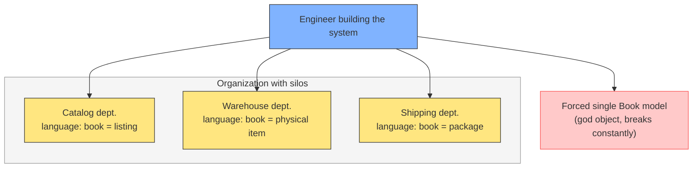

The problem the engineer faces: they must build one system that satisfies all of these people. If they model "book" the way catalog wants, warehouse cannot do their job. If they model it the way warehouse wants, catalog cannot. The tempting answer is a 50-field `Book` that contains everything — which satisfies nobody and breaks every time one department changes a field.

How do you discover the differences? The naive answer is email threads. Ask catalog what "book" means, then ask warehouse, then compare. This takes weeks, and it fails in a specific way: the engineer becomes the messenger between departments, re-telling each side's words in their own words. The message gets distorted, and the departments never hear each other.

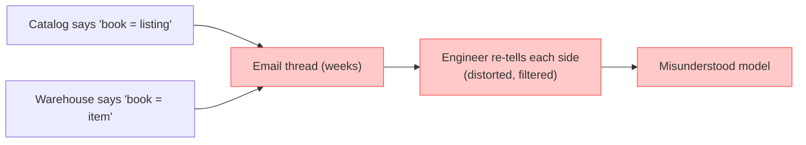

The better way, and the reason Event Storming exists: gather everyone in the room — all the stakeholders, typically 15 to 20 people — and run the exercise together. Everyone writes their events on the wall. The catalog person writes "Book Listed." The warehouse person writes "Shipment Created." The wall becomes a shared canvas where each department sees the other's language directly, not through the engineer's filter.

When two departments disagree in the room, the developers watch it happen. They learn that these people want different things, and that is fine. The disagreement is not a bug to resolve; it is the boundary. It becomes a bounded context.

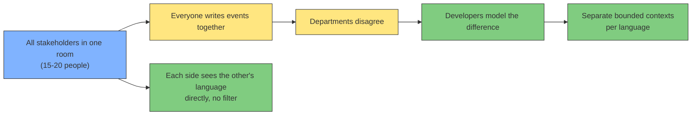

This is why Event Storming is a workshop and not a document. The point is not just the sticky notes; the point is the conversation that produces them. The exercise surfaces the differences that email threads hide.

## The setup

We model three teams at Amazon for the journey of a book from listing to delivery. We follow the correct Event Storming color coding throughout:

| Color | Represents |
|---|---|
| Salmon / Orange | Domain event (past tense) |
| Blue | Command (present tense) |
| Yellow (small) | Actor |
| Yellow (large) | Event cluster / aggregate |
| Lilac / Purple | Policy / automated rule |
| Green | Read model / what the actor needs to see |
| Pink | External system |
| Red | Hot spot / question |

A **policy** (lilac sticky) represents an automated business rule — a decision that the system makes without a human. Everywhere you have a human actor deciding when to act, a policy is the automated equivalent.

### Purpose: why policies exist

During a Process Modeling workshop, you identify every command and ask "who or what triggers this?" For most commands the answer is a person (yellow actor). But some commands happen automatically — no one sits there clicking a button. Those get a policy instead of an actor.

Examples of policies:
- "When stock drops below 10 units, automatically reorder"
- "When payment is received, automatically mark order as confirmed"
- "When a package has not moved in 2 days, automatically alert support"

Without policies, your event timeline has gaps. Events happen but you do not know why — was a human involved or was it automatic? The policy fills that gap.

### How to use a policy in the workshop

During Level 2 (Process Modeling), for each command in your table:

| If the trigger is… | Use… |
|---|---|
| A human making a decision | Yellow actor sticky |
| An automated rule or system logic | Lilac policy sticky |
| An event from another system | Lilac policy + pink external system |

Place the policy between the triggering event and the command:

```
[Trigger Event] → [Policy (lilac)] → [Command (blue)] → [Result Event]
```

The policy does three things:
1. **Listens** for a specific event
2. **Evaluates** a condition or rule
3. **Executes** a command if the rule matches

### How policies affect boundary decisions

Policies are either *internal* or *cross-context*:

- **Internal policy**: both the trigger event and the command live inside the same bounded context. Example: a policy in Fulfillment that says "when Shipment Created, send tracking email" — everything stays inside Fulfillment.
- **Cross-context policy**: the trigger event comes from another context. Example: Inventory's Auto-Reserve policy listens to `Book Purchased` from Catalog. This is the normal way contexts communicate — via event subscriptions.

The boundary rule: **a policy must only consume events, never query aggregates.** If your policy needs to read another context's database table or call its API to fetch current state before deciding, that is a boundary violation. The policy should get everything it needs from the event payload.

We work through three levels: Big Picture for events, Process Modeling for commands and actors, Software Design for aggregates and boundaries.

## Level 1: Big Picture — events only

Walk through the whole process of a book from listing to delivery. Write every event on orange stickies and place them on a timeline.

```
[Book Listed] → [Book Details Updated] → [Book Purchased] → [Stock Reserved]
→ [Shipment Created] → [Package Picked Up] → [Package In Transit]
→ [Package Delivered] → [Return Requested] → [Refund Issued]
```

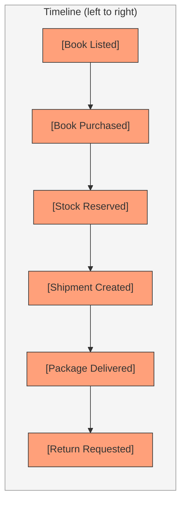

At this level we only have events. No commands, no actors. The goal is to see the full lifecycle.

## Which events belong on the timeline: domain events vs everything else

Not every event in your system is a domain event. Event Storming models **domain events** — things that changed domain state and matter to the business. The classic pitfall is filling the timeline with UI and telemetry events that change nothing.

Take "Homepage Visited." No aggregate is modified, no business rule is triggered, no downstream process starts. It is a user-interface event, and it does not belong on the timeline. The same goes for "Button Clicked," "Page Loaded," and "API Called."

Domain events come in four types, classified by their trigger:

| Type | Trigger | Example |
|---|---|---|
| Command-derived event | A human command | Order Placed (after Place Order) |
| Policy-driven event | An automated rule | Stock Low (after a policy checks a threshold) |
| External event | An outside system | Package Scanned by Carrier (from the carrier API) |
| Temporal event | Time passing | Subscription Renewed, Session Expired |

Everything else is a user-interface or telemetry event. They stay off the wall.

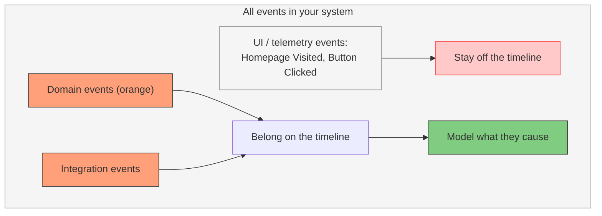

**The one exception:** if viewing content *is* the business, a page visit becomes a domain event. A media site where "Article Viewed" drives ad revenue, or a search engine where "Query Performed" is the product. In that rare case it is command-derived (the user's request to load the page is the command) and it triggers real domain behavior like analytics aggregation or ad bidding.

**The test to separate them:** ask "does the business care about this state change itself?" If the answer is "only for analytics," it stays off the timeline. Then ask the productive follow-up: "what domain event does this UI action *cause*?" — `Search Initiated`, `Promo Displayed`, `Recommendation Requested`. Those are the events worth modeling, because they trigger real behavior.

### What about "User Logged In"?

Unlike "Homepage Visited", login **is** a domain event in most systems — because it changes domain state and triggers real behavior.

| | Homepage Visited | User Logged In |
|---|---|---|
| State change | None | `lastLoggedInAt` set, failed attempts reset, Session created |
| Aggregate touched | None | `UserAccount`, `Session` |
| Downstream behavior | None | Audit log, fraud-detection policy, MFA, device notification |
| Business cares? | Only analytics | Yes — security, compliance, fraud |

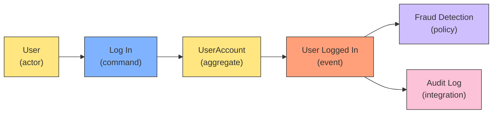

It is a **command-derived domain event**: the `Log In` command modifies the `UserAccount` aggregate (setting `lastLoggedInAt`, resetting failed attempts, creating a session), which produces `User Logged In`. Downstream policies and integrations consume it — the audit log writes a record, a fraud-detection policy checks the device and location, an MFA policy decides whether to require a second factor.

The boundary case: if your login is a pass-through with no business rules attached (no lockouts, no MFA, no security events), it drifts toward technical plumbing and you can model it as infrastructure instead of domain. But the moment the business cares about *who* logs in, *from where*, and *how often* — which is most real systems — it is a domain event.

### What about "Notifications Fetched"?

"Notifications Fetched" is one step further than "Homepage Visited" — it is not an event at all, it is a **Read Model being displayed**. Fetching is a query, not a state change. Nothing is modified, no aggregate is touched, no rule triggers.

The fetch produces the green Read Model (the notification list the user sees), which then *enables* the next command:

```
[Notification List (read model)] → [Mark Notification Read] (command)
   → Notification Marked Read (DOMAIN EVENT — readAt set, unreadCount changes)
```

| | Notifications Fetched | Notification Marked Read |
|---|---|---|
| What it is | Read model (green sticky) | Domain event (orange sticky) |
| State change | None | `readAt` set, unread count decremented |
| Aggregate touched | None | `Notification` |
| Triggered by | The user opening the app | The `Mark Notification Read` command |
| Downstream | Enables the next command | Updates badge count, clears unread |

**Read models do not emit events; they enable commands that do.** If you are tempted to write "X Fetched" on the timeline, you are describing the green sticky, not the orange one. The orange event is whatever the user does *after* seeing the fetched data.

### What about "Password Reset Email Sent"?

"Password Reset Email Sent" is the policy case. Sending an email is a mechanical consequence of a policy, not a domain state change — no aggregate is touched, nothing new happens in the domain.

```
User → [Request Password Reset] (command)
     → Password Reset Requested (DOMAIN EVENT — reset token created,
        request recorded, abuse counter bumped)
     → policy: Send Reset Email → email goes out (TECHNICAL, no aggregate changed)
     → User → [Reset Password] (command)
     → Password Reset Completed (DOMAIN EVENT — new password hash,
        token invalidated, sessions revoked)
```

| Event | Domain event? | Why |
|---|---|---|
| Password Reset Requested | Yes | Security-sensitive state change, triggers rate-limiting/abuse policies |
| Password Reset Email Sent | No | The transport for the reset link. Nobody cares that an email was dispatched |
| Password Reset Completed | Yes | The credential changed; sessions die; that matters |

The nuance, same as login: if the *delivery* of the email is itself a business concern, it becomes domain-relevant. Then you model `Password Reset Email Bounced` or `Password Reset Email Delivered` — those trigger real rules (flag the account, compliance proof, re-send policies). But "Email Sent" alone is the policy firing, not a domain event.

## The spine and the lanes: how the timeline handles parallel events

The timeline is a **time axis, not an actor axis**. It shows the order of the business process even though many people participate. The commands and actors are *annotations* attached to events — they do not rearrange them. The timeline encodes the causal order, which is the most valuable information on the wall.

But not everything is causally ordered. Two events are **parallel** when neither causes nor enables the other — they can happen in either order, or at the same time.

**The test:** if event A causes or enables event B, they share the spine (ordered). If there is no dependency, the event goes in a parallel lane.

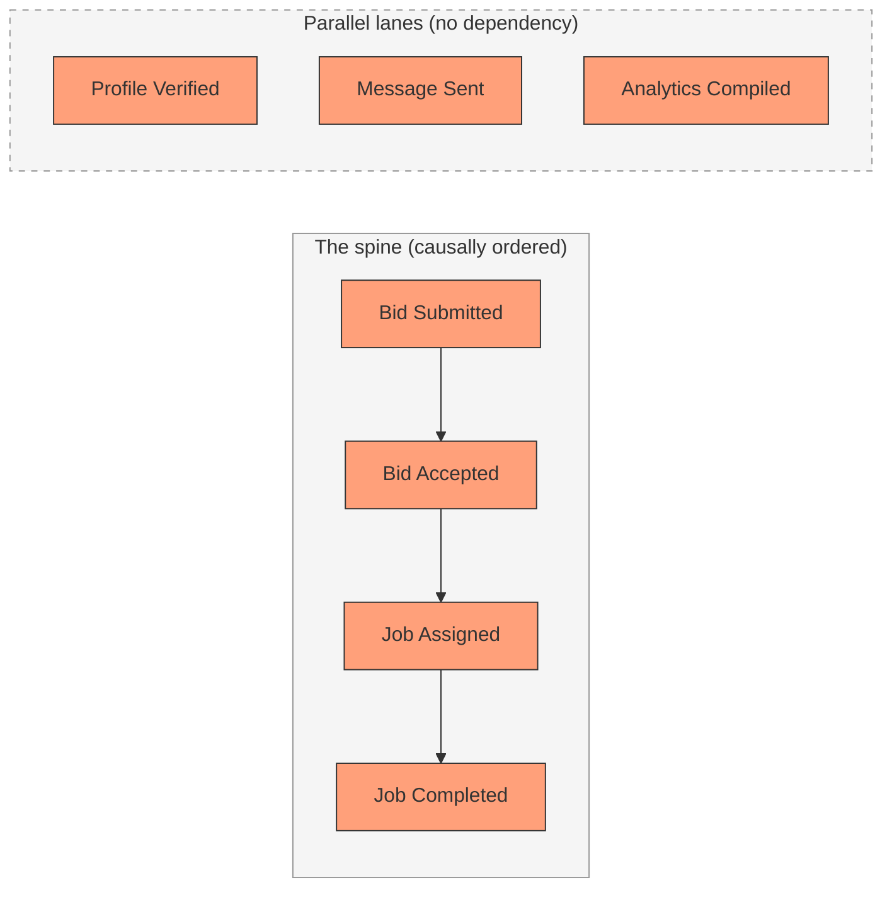

The spine is the main process. Profile events, messages, notifications, and background jobs hang in lanes above or below it — causally independent, so no fake ordering between them. If a real rule ever connects a lane to the spine (for example "only verified pros can bid"), that is when you draw the dependency arrow and it becomes explicit and correct.

Parallel events are also a boundary signal: when two activities run side-by-side with different nouns and different actors, that is a strong hint they belong to different clusters or contexts.

### One event, one sticky: never duplicate

**An event appears in exactly one place on the wall.** The timeline position encodes causality — what caused it and what it enables. Duplicating an event gives it two different causes and two different effects, which confuses anyone reading the wall.

But an event that is part of a process can also happen independently. `Profile Verified` happens during onboarding, and a pro might also get verified later. You still place it once. The independent occurrence is expressed through the **command layer**: one event can have multiple commands that trigger it.

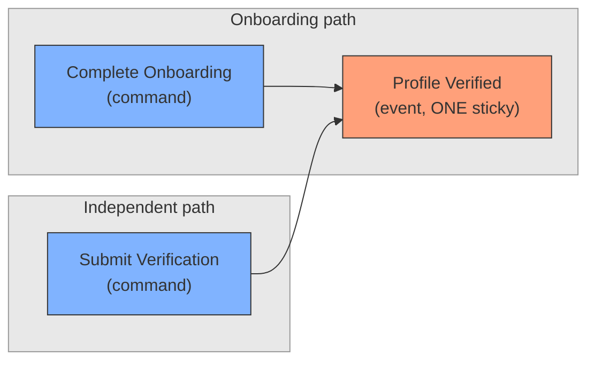

**One event, multiple commands.** That is how "part of the process but also independent" is expressed. When you add commands, attach *every* command that can produce the event, including the independent one.

The rule of thumb: if you feel the urge to duplicate an event, either it is really two different events (so rename one), or it is the same event (so let it live in one place and let the command layer show its multiple triggers).

## Level 2: Process Modeling — add commands and actors

Go event by event. Add blue commands (what triggered it) and small yellow actors (who triggered it). For each event ask: *what command caused this?* and *who issued it?*

### Command naming

Commands are **imperative, present tense** — what the actor wants to happen. The event names the result in the past; the command names the intent in the present:

| Command (imperative) | Event (past tense) |
|---|---|
| Sign Up | User Signed Up |
| Place Order | Order Placed |
| Mark Notification Read | Notification Marked Read |
| Submit Bid | Bid Submitted |

The check: a command answers "what should I do?" — an event answers "what happened?" If your command reads like a noun or a past-tense phrase, it is an event wearing a command's hat.

### The command sticky and its payload

The blue command sticky conventionally holds just the command name (`Sign Up`). The payload can be written directly on the sticky, or on a small note stuck next to it:

```
┌──────────────┐     ┌──────────────┐
│   Sign Up    │     │   Sign Up    │
│              │     │ payload:     │
│ (name only)  │     │ email        │
│              │     │ password     │
│              │     │ name         │
│              │     │ role         │
└──────────────┘     └──────────────┘
   (a) name only       (b) name + payload
```

Writing the payload is better for boundary analysis — the payload is what you compare across clusters in the five-check table. The only hard rule is the name: imperative, present tense.

### Catalog process

| Orange event | Blue command | Yellow actor |
|---|---|---|
| Book Listed | List Book | Content Manager |
| Book Details Updated | Update Book Details | Content Manager |
| Book Purchased | Purchase Book | Customer |

The catalog events cluster around "Book" as a saleable item.

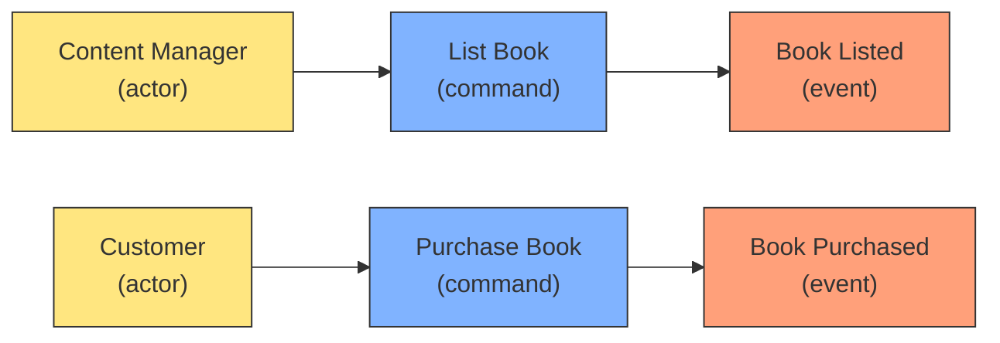

### Inventory process

The inventory cluster has no humans. Policies trigger everything automatically.

| Orange event | Blue command | Lilac policy | Triggered by |
|---|---|---|---|
| Stock Reserved | Reserve Stock | Auto-Reserve Policy | Book Purchased event from Catalog |
| Stock Depleted | (no command — automatic side effect) | Auto-Deplete Policy | Shipment Created event from Fulfillment |

The policy sits between the incoming event and the local command:

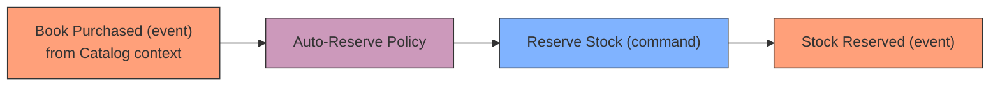

The Auto-Reserve Policy reads the `Book Purchased` event, determines which stock to reserve, and issues `Reserve Stock`. No human writes a picking list or clicks a button.

**How policies affect boundaries:** If a policy is triggered by an event from another context (like this one), that is normal — it is the event contract between contexts. But if a policy needs read access to another context's aggregates (not just events), that is a boundary violation. The policy should only consume events, not query another context's database.

### Warehouse / Fulfillment process

| Orange event | Blue command | Yellow actor |
|---|---|---|
| Shipment Created | Create Shipment | Warehouse Staff |
| Package Picked Up | Pick Up Package | Carrier (External) |
| Package In Transit | (automated tracking) | System |
| Package Delivered | Confirm Delivery | Customer |

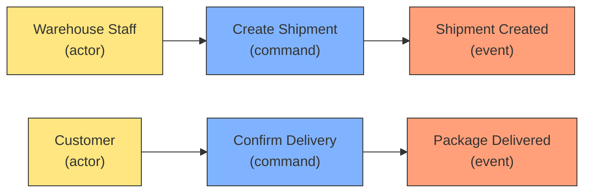

## Level 3: Add Read Models

The full flow is **Read Model → Command (with payload) → Event (with payload)**. The actor first sees information, then decides what to send, then the system records what happened.

```
[Read Model] → Actor looks → [Command + Payload] → System → [Event + Payload]
```

Every command requires a Read Model — the information the actor needs to *see* before they can act. The Read Model comes *before* the command, not after. It sits **between the actor and the command**: the actor consumes the read model to decide, then issues the command. The actor needs to see something to act.

One subtlety: the Read Model does not have to mirror a single aggregate. A Customer's Book Listing read model might pull `averageRating` from the Review aggregate even though `Purchase Book` only touches the Book aggregate's price and availability. Read Models are denormalized views built for the actor's convenience. They span aggregates — only the command targets a specific one.

| Green Read Model | Blue command | Actor sees |
|---|---|---|
| Book Details Form | List Book | Author, title, description, categories, pricing |
| Book Listing | Purchase Book | Cover, price, availability, reviews, ratings |
| Shipment Picking List | Create Shipment | Weight, dimensions, fragility, warehouse location |
| Delivery Confirmation | Confirm Delivery | Order ID, delivery photo, signature |

### Catalog context Read Models

```
Book Details Form (what Content Manager sees before listing a book):
  { title, author, description, isbn, coverImage,
    category, tags, price, reviews, ratings,
    publicationDate, pageCount, publisher }
```

```
Book Listing (what Customer sees before purchasing):
  { title, author, coverImage, price, averageRating,
    availabilityStatus, deliveryEstimate }
```

### Warehouse context Read Models

```
Shipment Picking List (what Warehouse Staff sees before creating shipment):
  { sku, title (short), weight, dimensions,
    fragility, warehouseLocation, quantity }
```

### Shipping context Read Models

```
Delivery Confirmation (what Customer sees before confirming delivery):
  { orderId, trackingNumber, deliveryPhoto,
    signature, deliveredAt, recipientName }
```

## Level 3a: Add Command Payloads

The Command Payload is what the actor *sends*. It is not the same as the Read Model. The actor sees many fields but only sends the ones relevant to their intent.

### Catalog context command payloads

```
List Book (command) → payload:
  { title, author, description, isbn, coverImage,
    category, price, pageCount, publisher }
  → Book Listed (event):
  { isbn, title, listedAt, listedBy }
```

```
Update Book Details (command) → payload:
  { isbn, price?, description?, tags?, coverImage? }
  (only fields that changed)
  → Book Details Updated (event):
  { isbn, changedFields[], updatedAt }
```

```
Purchase Book (command) → payload:
  { isbn, quantity, customerId, shippingAddress }
  → Book Purchased (event):
  { orderId, isbn, quantity, totalPrice, purchasedAt }
```

### Warehouse context command payloads

```
Create Shipment (command) → payload:
  { orderId, sku, quantity, warehouseLocation, carrier }
  → Shipment Created (event):
  { shipmentId, sku, quantity, carrier, trackingNumber, createdAt }
```

### What command payloads reveal

Compare the `Purchase Book` command payload (Catalog) with `Create Shipment` command payload (Fulfillment). They share no fields beyond identifiers:

| Command | Context | Payload fields |
|---|---|---|
| Purchase Book | Catalog | isbn, quantity, customerId, shippingAddress |
| Create Shipment | Fulfillment | orderId, sku, quantity, warehouseLocation, carrier |

Same `quantity` field, but `Purchase Book` sends a customer address while `Create Shipment` sends a warehouse location and carrier. The Catalog context does not know about warehouse locations. The Fulfillment context does not know about customer addresses (it receives a pre-packed order).

**Different payloads = different context.** If two commands had the same payload structure, they would be candidates for merging.

## Step 4: Group events into clusters

Now cluster events by their shared noun.

| Cluster | Events | Actors |
|---|---|---|
| **Catalog** | Book Listed, Book Details Updated, Book Purchased | Content Manager, Customer |
| **Inventory** | Stock Reserved, Stock Depleted | System |
| **Fulfillment** | Shipment Created, Package Picked Up, Package In Transit | Warehouse Staff, Carrier |
| **Delivery** | Package Delivered, Return Requested, Refund Issued | Customer, Customer Support |

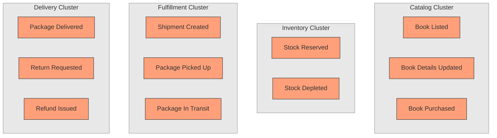

## Step 5: Compare Read Models to validate boundaries

Now compare the "Book" noun across clusters. Does it have the same attributes? If yes, merge. If no, keep separate.

| Attribute | Catalog | Inventory | Fulfillment | Shipping |
|---|---|---|---|---|
| title | Yes | Yes (short) | No | No |
| author | Yes | No | No | No |
| description | Yes | No | No | No |
| coverImage | Yes | No | No | No |
| price | Yes | No | No | No |
| isbn | Yes | Yes | No | No |
| weight | No | Yes | Yes | No |
| dimensions | No | Yes | Yes | No |
| fragility | No | Yes | Yes | No |
| warehouseLocation | No | No | Yes | No |
| trackingNumber | No | No | No | Yes |
| deliveryPhoto | No | No | No | Yes |
| signature | No | No | No | Yes |

The attribute sets barely overlap. Each cluster cares about a fundamentally different view of "book." This confirms they are separate bounded contexts.

This is one of three signals you triangulate. The others are:

- **Invariants**: "price cannot be negative" (Catalog) vs "weight cannot exceed 30kg" (Fulfillment) — different rules means different context, even if the noun is the same.
- **Actors**: different people touch different clusters. This is a *smell* that tells you where to look, not a rule that decides the boundary — see the next section.

Attributes alone are usually enough to spot the split, but invariants catch the edge cases where attribute sets happen to overlap. The actor check only raises suspicion; the invariants and attributes confirm it.

## How actors affect the boundary: a smell, not a rule

Look at the actors column from the event cluster table:

| Cluster | Actors |
|---|---|
| Catalog | Content Manager, Customer |
| Inventory | System (no human) |
| Fulfillment | Warehouse Staff, Carrier |
| Delivery | Customer, Customer Support |

Two facts about this table prove that actors alone cannot decide the boundary:

1. **The same actor spans contexts.** Customer appears in both Catalog and Delivery. Same person, two contexts.
2. **Multiple actors share a context.** Content Manager and Customer both live in Catalog. Different people, one context.

So "different actors" is never enough to split, and "same actor" is never enough to merge. Actors are a **smell** — they tell you where to run the real checks, not the answer.

### The counter-example: roles sharing one context

Three roles log into a system: Client, Professional, Super Admin. All three issue the same `Log In` command with the same payload `{ email, password }`, producing the same `User Logged In` event `{ userId, sessionId, loggedInAt }`, enforced by the same `UserAccount` aggregate rules. The roles are just three values of a "role" attribute — the process does not change shape based on which value is stored. One Identity/Auth context handles all three.

A role change only creates a new context when it changes the *shape* of the process, never because the job title changed.

### The decision procedure: five checks

When you see two actors in different clusters, do not split based on the actor. Run these five comparisons:

| Check | What to compare | Split contexts if... | Same context if... |
|---|---|---|---|
| Command | names and payloads | command or payload differs | identical |
| Event | names and payloads | event or payload differs | identical |
| Aggregate | attributes of the noun | same noun, different attributes | attributes match |
| Invariant | business rules | rules differ (price ≥ 0 vs weight ≤ 30kg) | rules match |
| Language | word meanings | "book" means different things | words mean the same thing |

**Split only when at least one of the five differs. If all five match, the actors are role variants sharing one context.**

This is why Catalog and Fulfillment split even though both mention "book": the Content Manager's Book has `{ price, title, author }` while the Warehouse Staff's Book has `{ weight, dimensions, fragility }`. The attributes differ (check 3), the rules differ (check 4), and the word "book" means different things (check 5). Three of the five checks diverge.

### Role values vs structural difference

| | Role value | Structural difference |
|---|---|---|
| Example | Client vs Pro vs Admin logging in | Content Manager's "book" vs Warehouse Worker's "book" |
| Command | Same `Log In`, same payload | Different commands, different payloads |
| Aggregate | Same `UserAccount` | Different aggregates, different attributes |
| Rules | Same invariants | price ≥ 0 vs weight ≤ 30kg |
| Verdict | One context | Two contexts |

A role value is data — a column on a table. A structural difference is a different model with different rules and different language. The five checks tell you which one you are looking at.

## Step 6: Define the aggregates

Within each bounded context, define the aggregates — the entities that enforce business rules.

### A worked example: User Signed Up

Walk the full chain for one event, from read model to event payload:

```
Read Model → Actor → Command → Aggregate → Event
```

| Element | What it is | Details |
|---|---|---|
| Read Model | Sign Up Form | `{ email, password, name, role }` — what the actor sees before acting |
| Actor | The person registering | A client *or* a professional — same event, role is a value in the payload |
| Command | Sign Up | Imperative, present tense. Payload: `{ email, password, name, role }` |
| Aggregate | UserAccount | The entity worked on. Validates (email unique, password strength), mutates (sets email, hashes password) |
| Event | User Signed Up | `{ userId, email, name, role, signedUpAt, emailVerified }` — the enriched result |

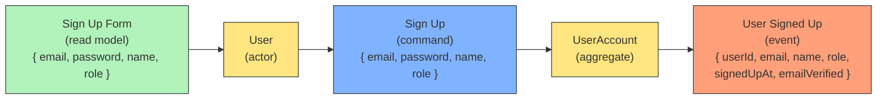

**The command works on the aggregate, the aggregate emits the event.** The command is the instruction, the aggregate is the entity the instruction acts on, the event is the record of what changed. Without the aggregate in the middle, nothing validates the command or owns the state that changes. The aggregate is the thing that *does* the work.

The command payload and event payload differ on purpose. The user sends `{ email, password, name, role }`; the system records `{ userId, signedUpAt, emailVerified: false }` on top — the `userId` is generated, the timestamp is added, the verification flag is set. The event payload is the *enriched* superset.

The actor being both client and professional does not split the context. Same command, same payload shape, same event, same aggregate — that is the role-variant case from the earlier section. One Identity context handles both, with `role` as a value in the payload.

### One command, one aggregate

**A command is applied to exactly one aggregate.** That is the rule — one command, one aggregate, one transactional boundary. The aggregate is the unit that must stay internally consistent. If a command mutated two aggregates at once, you would have a cross-aggregate transaction spanning two consistency boundaries, and one could fail while the other commits.

**The wrong way — a command directly touching two aggregates:**

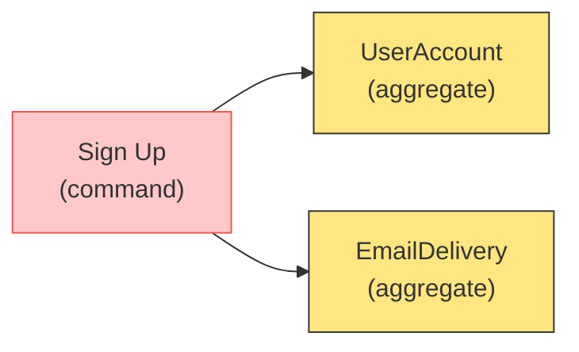

One transaction now spans two consistency boundaries. If the email fails but the account saved, the transaction must roll back both — or you accept partial state. This is the anti-pattern: the command is reaching outside its aggregate.

**The right way — the event chases the second aggregate through a policy:**

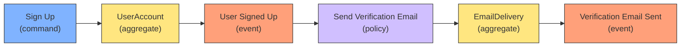

The command touches `UserAccount` only. It emits `User Signed Up`. A policy reacts to that event and drives `EmailDelivery` in a separate step. Each aggregate stays internally consistent; each step is its own transaction. If the email fails, the account still exists — and a retry policy handles the email.

**One aggregate, multiple events.** The `UserAccount` can emit both `User Signed Up` and `Verification Requested` from a single command. The command is not reaching further; it is just announcing more about the same change.

The mental model:

- **One command → one aggregate** (transactional)
- **One aggregate → can emit multiple events**
- **Each event → can trigger policies** that drive *other* aggregates, asynchronously

Two aggregates *after* a command never happens. Two aggregates *downstream of a policy* happens all the time — and that is the correct, decoupled shape.

### Catalog context

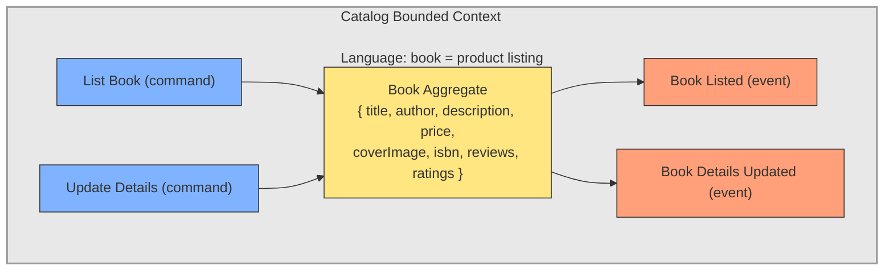

### Fulfillment context

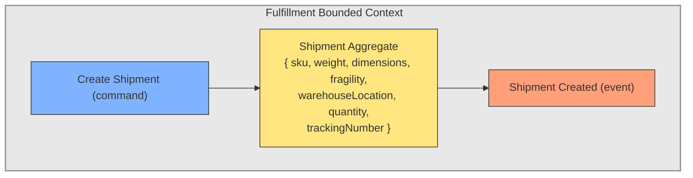

The Book aggregate in Catalog has a `price` field and enforces "price cannot be negative." The Shipment aggregate in Fulfillment has a `weight` field and enforces "weight cannot exceed 30kg." Different rules because different contexts.

### How they connect

The Catalog publishes `Book Purchased`. The Fulfillment context subscribes to it and reads only the fields it needs: `{ isbn, quantity, shippingAddress }`. It does not import the full `Book` aggregate.

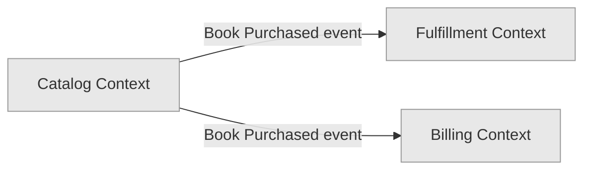

## From Workshop Output to Documented Boundaries

### Where Event Storming ends

Event Storming the workshop stops at candidate clusters. The output is:

- Orange events grouped by shared noun into clusters
- Blue commands and yellow actors per cluster
- Green Read Models and lilac policies discovered along the way

It does **not** give you validated boundaries, aggregate definitions, or formal documentation. The workshop produces *candidates*. Validation happens in a follow-up session where you compare attributes, payloads, and actors across clusters — steps 5 and 5a in this article.

### Step 7: Name each bounded context

The context name becomes the module name, the team boundary, and the namespace in the code. Naming rules:

| Do | Don't |
|---|---|
| Name after the business capability: **Catalog**, **Fulfillment**, **Billing** | Name after an entity: **Book Context**, **Order Context** |
| Use domain language: **Inventory Management** | Use technical terms: **DB Context**, **API Context** |
| Use nouns: **Shipping**, **Payments** | Use verbs: **Shipping Books**, **Handling Returns** |

Why not "Book Context"? Because a context contains multiple aggregates. Catalog has Book, Review, and Category. If you name it "Book", where does Review go? The capability name covers everything in that context.

For the Amazon example:

| Candidate cluster | Bounded context name | Why |
|---|---|---|
| Catalog events | **Catalog** | Manages product listings, search, discovery |
| Inventory events | **Inventory** | Manages stock levels, reordering |
| Fulfillment events | **Fulfillment** | Manages picking, packing, shipping |
| Delivery events | **Shipping** | Manages carrier handoff, tracking, confirmation |
| (inferred) billing | **Billing** | Manages payments, invoices, refunds |

### Step 8: Map aggregates to bounded contexts

Each bounded context contains one or more aggregates. The rule: aggregates that share the same invariants and the same actors live in the same context.

In Catalog, multiple aggregates sit under one capability:

```
Catalog (bounded context)
├── Book aggregate     { title, author, price, coverImage, isbn, ... }
├── Review aggregate   { rating, text, customerId, bookId, ... }
├── Category aggregate { name, slug, parentId, ... }
└── Author aggregate   { name, bio, photo, bookIds[], ... }
```

Book and Review share the same actor (Content Manager manages both) and participate in the same workflow (a book page displays reviews). They belong in the same context even though they are different entity types.

Compare with Fulfillment:

```
Fulfillment (bounded context)
├── Shipment aggregate     { sku, weight, warehouseLocation, carrier, ... }
└── PickingList aggregate  { orderId, items[], status, assignedTo, ... }
```

Shipment and PickingList share the same actor (Warehouse Staff). They belong together. But neither belongs in Catalog — different actors, different attributes, different language.

### Step 9: Document each bounded context

Each bounded context gets a structured documentation block. This is the standard artifact format — it captures the context boundary, its language, its aggregates, and its event contracts:

```yaml
---
context: Catalog
purpose: Manage product listings for customer browsing and purchase
language:
  book: A product listing with title, description, price, and metadata
  review: Customer feedback on a book with rating and text
  category: Grouping of books by genre or topic
aggregates:
  Book:
    attributes: [title, author, description, isbn, price, coverImage, reviews]
    invariants:
      - price must be non-negative
      - isbn must be unique
    commands:
      List Book: { title, author, description, isbn, price }
      Update Book Details: { isbn, price?, description?, tags? }
    events:
      Book Listed: { isbn, title, listedAt, listedBy }
      Book Details Updated: { isbn, changedFields[], updatedAt }
  Review:
    attributes: [bookId, customerId, rating, text, createdAt]
    invariants:
      - rating must be between 1 and 5
      - one review per customer per book
    events:
      Review Submitted: { reviewId, isbn, rating, createdAt }
published_events:
  Book Purchased: { orderId, isbn, quantity, totalPrice, purchasedAt }
  -> consumed by: Billing, Fulfillment
---
```

For Inventory — note it has no commands initiated by humans, only policies:

```yaml
---
context: Inventory
purpose: Track stock levels and trigger replenishment
language:
  stock: Physical units of a book available in the warehouse
  stock-reservation: Held units for an active order, not available for other orders
aggregates:
  Stock:
    attributes: [sku, quantityAvailable, quantityReserved, reorderThreshold]
    invariants:
      - quantityAvailable must never be negative
      - quantityReserved must never exceed quantityAvailable
      - when quantityAvailable falls below reorderThreshold, emit Stock Low
    events:
      Stock Reserved: { sku, quantity, orderId }
      Stock Depleted: { sku, orderId }
      Stock Low: { sku, currentLevel, reorderThreshold }
policies:
  Auto-Reserve:
    triggers_on: Book Purchased (event from Catalog)
    action: Reserve Stock command
    rule: Reserve quantity === event.quantity for orderId orderId
  Auto-Deplete:
    triggers_on: Shipment Created (event from Fulfillment)
    action: Decrement quantityAvailable
    rule: Reduce stock by shipment quantity at shipment confirmation
consumed_events:
  Book Purchased: { orderId, isbn, quantity }
  -> source: Catalog
  Shipment Created: { shipmentId, sku, quantity }
  -> source: Fulfillment
---
```

For Fulfillment:

```yaml
---
context: Fulfillment
purpose: Pick, pack, and ship customer orders
language:
  shipment: A physical package with weight, dimensions, and tracking
  picking-list: A work order for warehouse staff to collect items
aggregates:
  Shipment:
    attributes: [sku, weight, dimensions, fragility, warehouseLocation, carrier, trackingNumber]
    invariants:
      - weight must not exceed carrier maximum
    commands:
      Create Shipment: { orderId, sku, quantity, warehouseLocation, carrier }
    events:
      Shipment Created: { shipmentId, sku, quantity, carrier, trackingNumber, createdAt }
consumed_events:
  Book Purchased: { orderId, isbn, quantity, shippingAddress }
  -> source: Catalog
---
```

### Step 10: Draw the context map

The context map shows relationships between bounded contexts. Arrows point from event publisher to event subscriber:

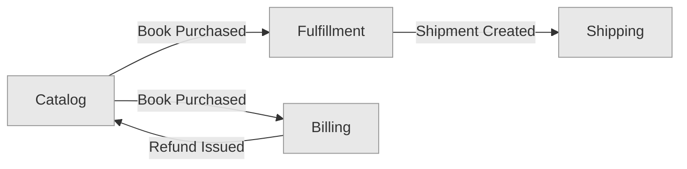

Each context is a module, a team boundary, and a deployment unit. The arrows are the event contracts — the only thing that crosses the boundary.

Each arrow implies a **policy** in the consuming context. When Fulfillment subscribes to `Book Purchased`, it has a policy somewhere that says "when this event arrives, create a shipment." Policies are the automated glue that turns an incoming event into a local command. If you draw a context map, you should be able to point at each arrow and say "this is the policy in the consumer that reacts to this event."

### Summary of artifacts

| Artifact | Content | Produced when |
|---|---|---|
| Event Storming photos | Orange events, blue commands, lilac policies, yellow actors on a wall | During workshop |
| Cluster table | Events grouped by shared noun, with actors, policies marked | End of workshop |
| Attribute comparison matrix | Read Model attributes per cluster (same noun, different fields) | Follow-up |
| Payload comparison | Command and event payload fields per cluster | Follow-up |
| Bounded context spec | Name, purpose, language, aggregates, invariants, commands, events, policies | Follow-up |
| Context map | Graph of contexts and their event contracts; each arrow implies a policy in the consumer | Follow-up |

## The method summarized (full sequence)

**During the Event Storming workshop:**

1. Write events (orange) on a timeline
2. Add commands (blue) and actors (small yellow)
3. Where commands are triggered automatically (no human), replace the actor with a policy (lilac) — write the policy, its trigger event, and the command it executes
4. Add Read Models (green) — what the actor sees *before* issuing the command
5. Group events into clusters by shared noun (large yellow)

**After the workshop, in a follow-up session:**

6. Write Read Model attributes for each cluster — if the same noun has different attributes across clusters, they are separate contexts
7. Write Command Payloads for each command — if the same-sounding command has different payloads across clusters, they are separate contexts
8. Write Event Payloads for each event — the event is the contract between contexts
9. Check invariants — if the same noun enforces different business rules in different clusters, they are separate contexts
10. Check policies — if a policy reaches into another context's aggregates (beyond consuming events), that is a boundary violation. Policies should only consume events across contexts
11. If actors differ across clusters, investigate — run the five checks (command, event, aggregate, invariants, language). Split only if at least one diverges; if all match, they are role variants sharing one context
12. Name each context after its business capability (not after an entity)
13. Map aggregates to contexts — aggregates sharing actors and invariants go together
14. Document each context with its language, aggregates, commands, events, policies, and invariants
15. Draw the context map showing event flows between contexts

Event Storming gives you the clusters. The five checks validate the boundaries. The documentation artifacts make them permanent.

## References

- Brandolini, A. (2017). *Introducing Event Storming*. Leanpub. https://leanpub.com/introducing_eventstorming — The full workshop format including Read Models and Software Design level.
- Jovanovic, M. (2026). *Bounded Context in DDD: How to Define Boundaries*. milanjovanovic.tech. https://milanjovanovic.tech/blog/bounded-context-ddd-explained — Shows the same Product entity with different attributes in Sales vs Fulfillment contexts.
- Fowler, M. (2014). *BoundedContext*. martinfowler.com. https://martinfowler.com/bliki/BoundedContext.html — "Different contexts may have completely different models of common concepts."
- Evans, E. (2003). *Domain-Driven Design: Tackling Complexity in the Heart of Software*. Addison-Wesley. Chapter 14 — Bounded contexts and context mapping.
- Vernon, V. (2013). *Implementing Domain-Driven Design*. Addison-Wesley. Chapter 2 — Bounded context definition and Chapter 3 — Context mapping.
