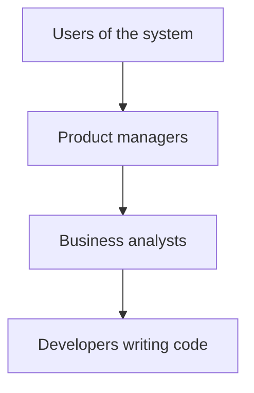
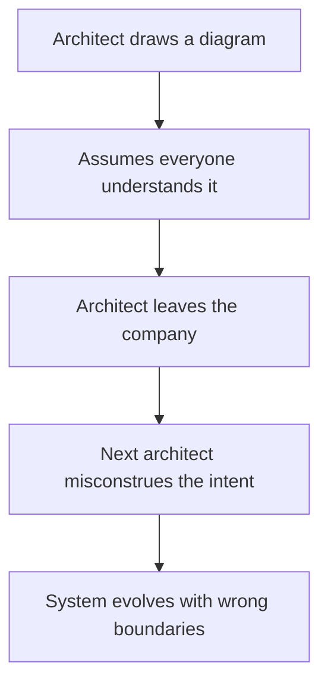
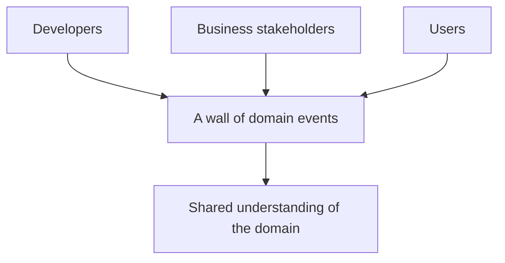
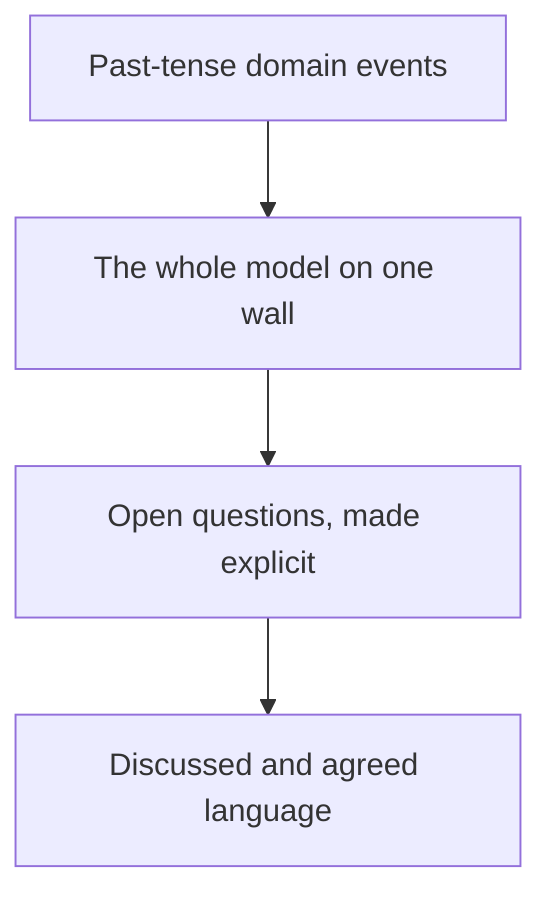
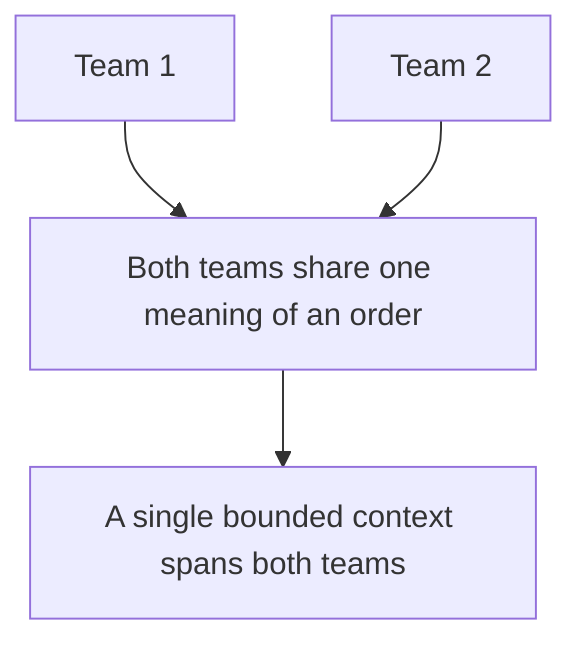
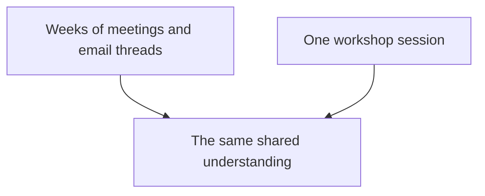

# Event Storming Talk: From Days to Hours

## The problem this talk addresses

A conference talk can take an hour to watch. The valuable ideas inside are compressed into a few key points. Most people never re-watch a talk, and the useful insight fades. This article is the condensed takeaway of a single talk, written so you can recover the point of it without replaying the video.

The talk is *From Days to Hours: How EventStorming Transformed Our Domain Modeling Process*, by Vadzim Prudnikau, given at NDC Oslo. Its subject is Event Storming, a technique this knowledge base already covers in depth in the *Event Storming: Find Module Boundaries Through Events* article. Where that article explains the mechanics, this one captures why the technique matters and the problem it solves. Read both together.

## The problem the speaker describes

The starting observation is uncomfortable: developers work on systems they do not fully understand. They rely on assumptions, because the system's full picture was never available to them. This is not a junior-only problem. It happens on mature teams in established companies.

The cause is distance. In a corporate environment, the people who write the software sit many layers away from the people who use it. Between them sit product managers, business analysts, project managers, and process. Every layer translates the domain, and each translation loses fidelity.

Every arrow in that chain is a place where the meaning of the domain can be distorted. The developer ends up encoding a version of the business that nobody with authority over the business ever fully agrees with.

The speaker notes that knowledge sharing inside companies is rarely useful in practice. Documentation gets written and ignored. Onboarding material drifts out of date. The real understanding lives in a few people's heads, and it never fully transfers.

## Where the architect should have helped

The speaker holds up the architect as the mechanism that was supposed to fix this. The architect draws diagrams of the system and assumes that everyone understands them. But that assumption is the problem: a diagram that is never explained does not transfer knowledge, it merely signals that knowledge exists somewhere.

The genuine risk arrives when the architect departs. The knowledge does not live in the drawing. It lived in the architect. When that person leaves, the next architect reinterprets old diagrams, imposes their own model, and the boundaries drift. After a couple of these handoffs, the system's architecture no longer matches anyone's intent, including the people who are currently maintaining it.

## A side question about architects

There is a recurring critique worth separating. People say the architecture is no longer needed, and the phrase gets repeated until it means nothing. The speaker surfaces a real tension in this critique.

Those who reject the ivory tower architect make a fair complaint: the architect is not near the code, and is not in the production call when something breaks. Their diagrams do not help on a Monday morning. This part of the critique is valid.

But the loud critics rarely answer the follow-up. If you remove the architect, who coordinates a feature that spans two or three teams? The component that crosses boundaries still needs a decision maker. Netflix is often raised as the example of a company with no explicit architecture, but the interesting question is how cross-team work actually gets coordinated there. Removing the role does not remove the need for the coordination, it only hides who does it.

## Event Storming as the answer

Event Storming is the answer because it changes who is in the room. It is a workshop. Everyone participates: developers, business people, and in the best case the users themselves. The point is not for one expert to present, it is for the whole group to build the domain together.

The workshop works because of the silos in an organization. Every person understands their own silo very well, but not the silos of their colleagues. The marketing person knows pricing, the developer knows the order flow. Bring them together, and each group can verify and correct the other's assumptions in real time.

This simple commitment is what turns the title's promise into reality. Instead of weeks of exchanged emails and meeting summaries, the whole domain map is formed in hours. The sticky notes become a model of the entire domain that every attendee agrees on because they were present when it was built.

## What Event Storming makes visible

An event is something that happened in the domain. It is written in the past tense: "Order Placed", "Payment Received", "Shipment Delivered". A non-technical person can grasp every one of these events, because they live in the business vocabulary, not the code vocabulary.

The workshop does more than list events. It surfaces shared assumptions and unearths disagreements:

- **Concerns** are written down and addressed, so nothing is silently assumed.
- **Open questions** stay on the wall, so the group decides who will answer them before moving on.
- **The common owned language** is discussed out loud. The group figures out how the same business term is used across departments, and where the words clash.

The value of the wall is not the sticky notes. It is the shared understanding that formed while the group agreed on what each sticky means. That understanding is what the architect's diagram never achieved.

## The bounded context takeaway

The talk points toward the relationship between Event Storming and bounded contexts. The knowledge base has a whole article on bounded contexts, so the one insight worth isolating here is the difference between a context and a department.

The key takeaway: a bounded context is not a department. A department is an org-chart unit. A bounded context is a boundary around a language.

A shared language can span departments. When two different teams use the same word to say the same thing, then the bounded context sits over both of them, regardless of the org chart. The instant that everyone in a company uses "order" to mean the same thing, the language is a single context even though it crosses teams.

This is the reason you do not cut bounded contexts along department lines. The language is the clue, not the org chart. Event Storming reveals where the language is really shared, and that is where the bounded context lives even if it crosses departments.

And reciprocally, the same department often holds several distinct contexts, because a single team uses different models for the different things it manages. The department and the context simply do not align.

## What "days to hours" means in practice

The title is a claim about outcomes: what used to take days of back and forth now takes hours in a room. Not because the workshop makes people go faster, but because it compresses the loop. One email iteration takes a day. A workshop iteration takes minutes, because the answer is right there and the group is already aligned.

The result is the same shared model, obtained in a fraction of the calendar time, and with more of the team carrying the understanding afterwards.

## When to use this summary

Reach for this article when you want the argument without spending an hour on the video. Reach for the full *Event Storming* article when you want the actual steps, the sticky colors, and the module clustering. Reach for the *Bounded Contexts* article when you want the model mechanics, the data ownership, and the communication patterns.

## References

- Prudnikau, V. (2024). *From Days to Hours: How EventStorming Transformed Our Domain Modeling Process*. NDC Oslo. Available via Class Central: course/youtube-from-days-to-hours-how-eventstorming-transformed-our-domain-modeling-process-vadzim-prudnikau-312717.
- Knowledge base. *Event Storming: Find Module Boundaries Through Events*. event-storming.md. The step by step how to.
- Knowledge base. *Bounded Contexts Without Microservices*. bounded-contexts.md. The model mechanics behind the contexts.