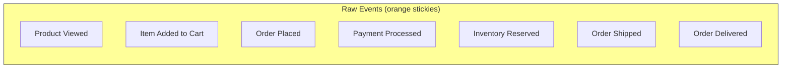
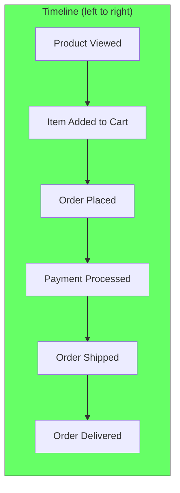
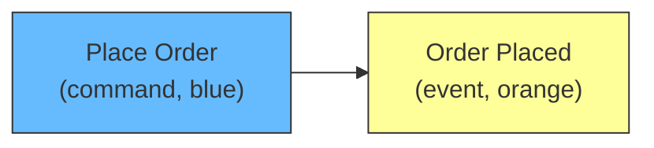
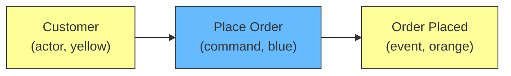
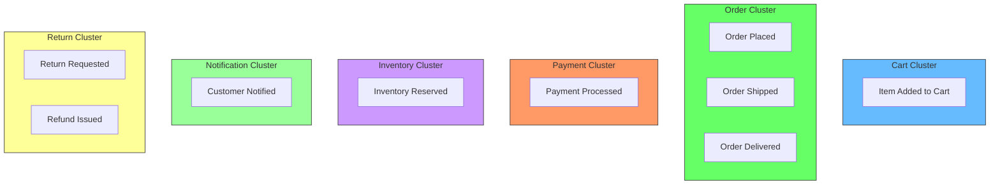
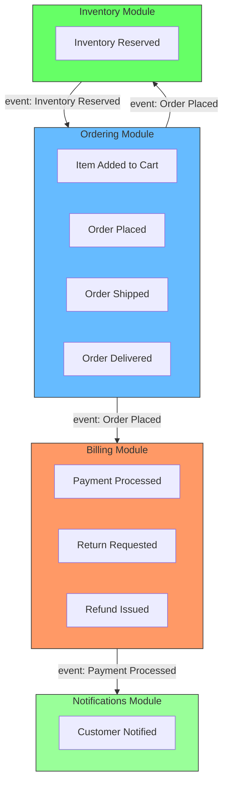

# Event Storming: Find Module Boundaries Through Events

## The problem

You are designing a new system. You know you want separate modules, but you don't know where one ends and another begins. Every idea sounds like it could go in every module. You draw boxes on a whiteboard, erase them, draw them again. Nothing sticks.

Event Storming is the alternative. It is a workshop technique created by Alberto Brandolini (originally 2013, evolved significantly since) that replaces guesswork with a structured process. Instead of asking "what modules should we have?", you ask "what happens in the business?" The events tell you the boundaries.

## The scenario

We will use one scenario throughout: an e-commerce system where customers browse products, place orders, and receive shipments. This scenario is adapted from the running example used in Qlerify's Event Storming guide (Palopaa, 2025) and similar published walkthroughs — it is a standard domain that appears across multiple sources.

The basic flow: a customer views a product, places an order, pays, the order is shipped, and it arrives. Along the way there are inventory checks, payment processing, and notifications.

Now we walk through the Event Storming steps using this scenario.

## Step 1: Write every event that happens

You start with orange sticky notes. Every event is written in past tense. One event per sticky. No discussion yet. Just dump everything onto the wall.

For the e-commerce system:

```
[Product Viewed]
[Item Added to Cart]
[Order Placed]
[Payment Processed]
[Inventory Reserved]
[Order Shipped]
[Order Delivered]
[Return Requested]
[Refund Issued]
[Customer Notified]
```

These are the raw events. Some are customer actions (Product Viewed, Order Placed), some are system actions (Inventory Reserved, Customer Notified), and some are business milestones (Order Shipped, Order Delivered). All of them belong on the wall.



Brandolini describes this as the foundation: "Domain Event is something meaningful happened in the domain. It can be easily grasped from non-technical people."

## Step 2: Arrange events on a timeline

Now move the events left to right by time. What happens first? What happens after? Gaps are fine — leave blank space where you do not know.

The timeline forces causality. "Order Placed" comes before "Payment Processed" which comes before "Order Shipped." If you cannot place an event in time, you do not understand when it happens.



If the group disagrees on ordering, that is productive. "Payment Processed comes before Order Shipped, not after." The argument surfaces assumptions about how the business works.

## Step 3: Add commands (what triggered the event)

For each event, add a blue sticky note on its left: what command caused this event?

An event does not happen by itself. Something made it happen. A person performed an action. A system process ran. A policy triggered.

| Event | Command |
|---|---|
| Product Viewed | View Product |
| Item Added to Cart | Add Item to Cart |
| Order Placed | Place Order |
| Payment Processed | Process Payment |
| Inventory Reserved | Reserve Inventory |
| Order Shipped | Ship Order |
| Order Delivered | Confirm Delivery |
| Return Requested | Request Return |
| Refund Issued | Issue Refund |

Commands are the "what". They fill the causation chain. An event without a command is suspicious — where did it come from?



## Step 4: Add actors (who triggered it)

For each command, add a small yellow sticky note: who performed this action?

The actors reveal the roles in the system. Different actors often mean different modules.

| Command | Actor |
|---|---|
| View Product | Customer |
| Add Item to Cart | Customer |
| Place Order | Customer |
| Process Payment | System |
| Reserve Inventory | System |
| Ship Order | Warehouse Staff |
| Confirm Delivery | Customer |
| Request Return | Customer |
| Issue Refund | Customer Support |



## Step 5: Group events by noun

Now you have the full map: events, commands, and actors. The next step is to find the clusters.

Group events that share the same noun. "Noun" is the main thing the event is about.

| Event | Noun | Actor |
|---|---|---|
| Product Viewed | Product | Customer |
| Item Added to Cart | Cart | Customer |
| Order Placed | Order | Customer |
| Payment Processed | Payment | System |
| Inventory Reserved | Inventory | System |
| Order Shipped | Order | Warehouse Staff |
| Order Delivered | Order | Customer |
| Return Requested | Return | Customer |
| Refund Issued | Refund | Customer Support |
| Customer Notified | Notification | System |

Events sharing the same noun belong together. They form an **event cluster**.



This step is the core of Event Storming. The cluster is simply "events that are about the same thing."

## Step 6: Merge clusters into modules

You now have event clusters. The next step is asking: which clusters belong in the same module?

The rule: clusters that share the same language and the same actors belong together. Clusters that use different language or have different actors belong in separate modules.

Apply this to our clusters:

| Cluster | Actors | Language | Decision |
|---|---|---|---|
| Cart | Customer | cart, items, checkout | Merged with Order |
| Order | Customer, Warehouse | order, shipping, delivery | Own module |
| Payment | System | payment, processing, refund | Own module |
| Inventory | System | stock, reservation | Own module |
| Notification | System | email, SMS, notification | Own module |
| Return | Customer, Support | return, refund | Merged with Payment? |

**Cart and Order**: the Cart feeds into the Order — "Item Added to Cart" leads to "Order Placed." They share the same actor (Customer) and the same process. They belong in the same module: **Ordering**.

**Payment and Return**: a return triggers a refund. The payment module processes both charges and refunds. They share the same actor (System/Customer Support) and the same financial language. They belong in the same module: **Billing**.

**Inventory** is separate. The Warehouse Staff actor and the "stock reservation" language are different from ordering or billing. The inventory module publishes `Inventory Reserved` and the ordering module subscribes to it. Two modules, one event.



This is the output of Event Storming: a map of modules, each with its own events, commands, and actors. The events that cross module boundaries (Order Placed → Billing, Order Placed → Inventory) become the communication between modules.

## What to do with the result

Take the module map and two things follow:

**Each module owns its data.** The Ordering module owns the order database. The Inventory module owns the inventory database. If another module needs order data, it asks through an interface or subscribes to an event. No shared tables.

**Cross-module events become ports.** `Order Placed` crosses from the Ordering module to the Inventory module. This event is the contract between them. The Ordering module publishes it. The Inventory module subscribes to it. The two modules never import each other's internal code.

## The workshop format variations

Brandolini describes three levels of Event Storming on the official site (eventstorming.com). They map to different needs:

**Big Picture (2-4 hours).** Events only. No commands, no actors. The goal is to understand the landscape and find pain points. Use this when you are exploring a new domain or onboarding a team.

**Process Modeling (4-8 hours).** Events, commands, actors. This is what we did above. The goal is to design the flow and find the clusters. Use this when you are designing a new feature or system.

**Software Design (4-8 hours).** Adds detailed interfaces, data models, and integration points. Use this when you are ready to implement.

For most projects, the Process Modeling level is enough to find the module boundaries.

## Common mistakes

**Starting with the data model.** Do not draw tables first. Events first. The data model follows from the events, not the other way around.

**Skipping the timeline.** Events without chronology are just a list. The timeline forces causality and reveals missing events.

**Jumping to code too early.** The goal is discovery, not design. If someone says "we should use WebSockets here", write it on a red sticky and move on. The implementation decisions come after the boundaries are clear.

**One person writing all the events.** Everyone should hold a marker. The quietest person in the room knows something the loudest person does not. Event Storming works because it forces participation.

## What you get at the end

- A wall covered in events arranged by time
- Event clusters (groups of events that share the same noun)
- Module boundaries (groups of clusters that share language and actors)
- Cross-module events (the communication lines between modules)
- A list of open questions (red stickies)

The wall is temporary. Take photos. Type up the modules and their events within 24 hours. The value is not the sticky notes — it is the shared understanding that developed while putting them up.

## References

- Palopaa, S. (2025). *Event Storming – The Complete Guide*. Qlerify. https://www.qlerify.com/post/event-storming-the-complete-guide — Comprehensive guide covering all three levels with notation examples. The e-commerce scenario used in this article (Product Viewed, Order Placed, Payment Processed, Order Shipped) is adapted from the running example in this guide.
- EventStorming.com. (n.d.). https://www.eventstorming.com/ — Official site with current workshop formats, resources, and a starter kit. The most up-to-date starting point.
- Brandolini, A. (2017). *Introducing Event Storming*. Leanpub. https://leanpub.com/introducing_eventstorming — The book covering all three levels (Big Picture, Process Modeling, Software Design) with detailed guidance and real-world scenarios including startup kickoffs and corporate process discovery. The 2013 blog post is the original, but the book and this site represent the evolved technique.
- Brandolini, A. (2018). *50.000 Orange Stickies Later*. YouTube. https://www.youtube.com/watch?v=NGXl1D-KwRI — Presentation covering lessons learned from running hundreds of Event Storming sessions across many organizations.
- Leroy, S. (2026). *Event Storming for Complex Domains: A Practitioner's Field Guide*. sylvainleroy.com. https://sylvainleroy.com/2026/07/event-storming-for-complex-domains-a-practitioners-field-guide/ — Practical guide with workshop flow and facilitation tips from real sessions.
- Brandolini, A. (2013). *Introducing Event Storming*. ziobrando.blogspot.com. https://ziobrando.blogspot.com/2013/11/introducing-event-storming.html — The original blog post. The technique has evolved since this was written, but this is where it started.
- Wikipedia. (2026). *Event Storming*. wikipedia.org. https://en.wikipedia.org/wiki/Event_storming — Overview with notation reference and examples.
